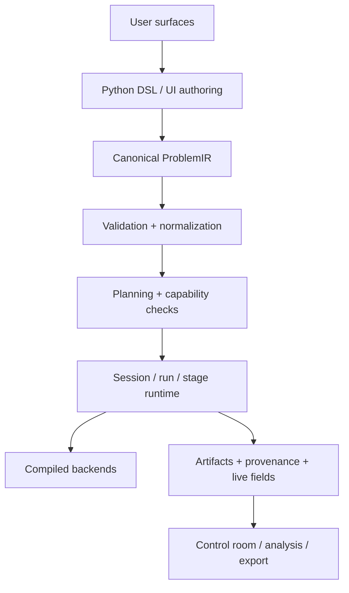

# Kontrakty aplikacji Fullmag

Wiążące rozwinięcie [AGENTS.md](../../AGENTS.md). Czytaj sekcje dotyczące zadania. Zachowano numerację kontraktów dla łatwego wyszukiwania; ścieżki w backtickach są względem repozytorium. Zasady procesu i uprawnień określa główny AGENTS.md.

## 1. Mission

Fullmag is being built to become a **best-in-class micromagnetics platform** for:

- **authoring** physical problems,
- **running** them across multiple numerical backends,
- **observing** them live in a control room,
- **exporting** and **reproducing** the exact same simulation through one canonical public model.

Fullmag is **not** a collection of loosely related solvers.

Fullmag is **one application** with:

- one product identity,
- one semantic core,
- one canonical physical model,
- multiple execution realizations.

---

## 2. North star

Fullmag must always describe a **physical micromagnetic problem**, never a numerical storage layout or a solver implementation accident.

This has four consequences:

1. the public authoring contract must stay **physics-first**,
2. solver/backend choice must remain **explicit but secondary** to the problem definition,
3. all user surfaces must converge to the same canonical model,
4. provenance must preserve **requested intent** and **resolved execution reality**.

If a change makes Fullmag feel like “a thin wrapper around a backend,” it is likely the wrong change.

---

## 3. Product promise

The intended user experience is:

1. a user can author a simulation in the Python DSL,
2. a user can author the same simulation interactively in the browser,
3. both flows converge to the same canonical semantic representation,
4. the same problem can be executed headlessly, interactively, locally, or through managed runtimes,
5. the browser can export a canonical, human-editable Python script,
6. the browser can inspect live fields, meshes, artifacts, and stage execution without inventing alternate physics semantics,
7. reproducibility is preserved across authoring, planning, execution, and artifacts.

The browser is **not** a secondary admin panel.
It is a **first-class control room** and **authoring companion**.

---

## 4. Canonical public contract

The following are non-negotiable:

1. **One physical model contract**
   - Shared semantics live above solver internals.

2. **One canonical semantic representation**
   - `ProblemIR` is the canonical lowered representation.

3. **One canonical public scripting surface**
   - The embedded Python DSL in `packages/fullmag-py`.

4. **One runtime abstraction**
   - sessions, runs, stages, fields, artifacts, and live state.

5. **One round-trip rule**
   - UI-authored problems must round-trip to canonical Python DSL.

6. **One provenance model**
   - requested intent and resolved backend/runtime must both be visible.

7. **One capability language**
   - Python, UI, planner, runner, docs, and provenance must speak the same capability vocabulary.

8. **One resource-first control-room API**
   - The local browser contract is versioned, resource-scoped, and revision-driven.

9. **One control-plane / data-plane split**
   - Thin JSON carries state, capabilities, commands, and diagnostics; binary transport carries
     heavy numerical payloads.

10. **One frontend access path**
   - Components and hooks go through one typed API client, one resource-hook layer, and one
     capability/adapter boundary.

**Round-trip drift is a product bug.**

---

## 5. Canonical source hierarchy

When deciding truth, use this order:

1. **Physics notes in `docs/physics/`**
   - canonical scientific intent
   - equations, units, assumptions, observables, limits

2. **Architecture / spec docs in `docs/specs/` and `docs/adr/`**
   - canonical application and runtime design

3. **This file (`AGENTS.md`)**
   - canonical project operating rules

4. **Canonical public API**
   - `packages/fullmag-py`

5. **Canonical semantic model**
   - `ProblemIR`, validation, normalization, planning

6. **UI authoring / session state / script export**
   - must follow, never redefine, the above

If two layers disagree, the higher layer wins and the lower layer must be repaired.

---

## 7. Strategic priority stack

## 7.1 Current top execution priority

**GPU-first FDM/CUDA** remains the top execution priority until it is truly production-grade.

That means:

1. CPU FDM reference remains the trusted `double` oracle.
2. GPU FDM public execution must reach strong parity in `double`.
3. GPU `single` stays behind qualification gates until validated.
4. Backend selection must become **more explicit**, not less explicit.
5. FDM performance work must not destroy semantic consistency.

## 7.2 In parallel, but not at the expense of correctness

The following workstreams are important and active:

- FEM shared-domain meshing
- FEM magnetostatics / demag realizations
- relaxation correctness and stage lifecycle
- live field-store / quantity switching
- matrix-free eigensolve / frequency-domain stack
- viewport and inspection UX
- managed runtime packaging

But no workstream is allowed to bypass the canonical model.

---

## 8. What Fullmag is and is not

## 8.1 Fullmag is

- a micromagnetics application,
- a canonical Python DSL,
- a Rust control plane,
- a browser control room,
- a multi-backend execution platform,
- a provenance-preserving scientific toolchain.

## 8.2 Fullmag is not

- a UI-only simulation editor,
- a bag of backend-specific scripts,
- a mesh viewer pretending to be a solver,
- a backend-specific config generator,
- a hidden-fallback execution shell,
- a place where stale concepts accumulate unchallenged.

---

## 9. Architectural layers

Fullmag must remain explicitly layered.

### Layer responsibilities

| Layer | Responsibility | Must never do |
|---|---|---|
| Python DSL | public authoring surface | leak backend internals into common semantics |
| UI authoring | first-class authoring companion | invent a second physical model |
| ProblemIR | canonical lowered semantics | encode UI-only quirks |
| Planner | validation, capability resolution, backend selection | silently erase user intent |
| Runtime | sessions, stages, state, fields, artifacts | become solver-specific policy soup |
| Compiled backends | high-performance compute | define public product semantics |
| Control room | observability + live authoring + export | bypass canonical model |

## 10. Execution-selection doctrine

Execution choice must be easy for the user and explicit in the architecture.

The user-facing execution vocabulary should remain:

- **discretization**: `fdm | fem | auto | hybrid (future)`
- **device**: `cpu | gpu | auto`
- **precision**: `single | double`
- **execution mode**: `strict | extended | hybrid`
- **UI mode**: `headless | ui | auto`

### Rules

1. Requested intent and resolved reality must both be preserved.
2. `auto` may be resolved, but never silently forgotten.
3. Unsupported paths must fail clearly or degrade explicitly.
4. Public surfaces must not require users to understand CUDA image names, MFEM internals, raw buffers, or implementation-only toggles.
5. If one surface cannot express a choice another surface can express, that is product debt.
6. Backend-specific knobs belong in explicit advanced/backend-hint scopes only.

---

## 13. Semantic invariants by subsystem

## 13.1 Python DSL invariant

The embedded Python DSL is the only canonical public scripting surface.

Implications:

- UI must be exportable to Python DSL.
- Public scripts must remain human-editable.
- Backend-specific implementation details must not leak into the common surface.
- If a UI concept cannot be expressed in canonical Python, the concept is incomplete.

## 13.2 ProblemIR invariant

`ProblemIR` is the semantic center of gravity.

Implications:

- planner decisions must be derivable from IR,
- provenance must refer back to IR intent,
- UI scene/script-builder state must not drift from IR semantics.

## 13.3 Session/run invariant

The session runtime is the product control-plane.

Implications:

- stages must have explicit lifecycle,
- commands must have explicit intent and completion status,
- live state must distinguish compute state from display-selection state,
- fields, scalars, artifacts, and display resources must have stable contracts,
- local current-live API must expose revisions and capabilities as first-class runtime truth.

## 13.4 Provenance invariant

Every meaningful action must be reproducible.

Implications:

- requested backend vs resolved backend must be stored,
- mesh configuration and realized mesh summary must be exportable,
- stage completion reason must be explicit,
- field revisions and mesh revisions must be visible where needed.

---

## 21. Honesty doctrine

Fullmag documentation and status must remain honest.

### Always distinguish

- **target architecture**
- **implemented architecture**
- **bootstrap/transitional path**
- **reference-only path**
- **planned work**

Do not describe aspirational work as production-ready.
Do not hide known limitations behind vague wording.
Do not claim parity that has not been validated.

Honest docs build trust and make the roadmap actionable.

---

## 22. Modularity rules

Performance work does not justify monoliths.

### Required rules

1. Separate semantic layers from execution layers.
2. Separate backend policy from backend implementation.
3. Separate operator modules from solver shells.
4. Separate packaging from semantics.
5. Separate observability from execution.
6. Keep files reasonably bounded.
7. Prefer focused modules over god-files.
8. Split viewports into:
   - scene/model logic,
   - transport/state logic,
   - UI overlays and controls.
9. Keep one typed frontend API client and resource-hook layer; React components do not talk to the
   network directly.
10. Keep FDM/FEM differences inside capability guards and domain adapters, not duplicated control-room
   trees.

### File size rule

No single source file should exceed roughly **1000 lines** unless there is a very strong, documented reason.

Treat that threshold as a review signal. Split when it reduces mixed responsibility, lifecycle risk, or comprehension cost; do not split solely to satisfy a line count.

---

## 23. Repository map

| Path | Role |
|---|---|
| `packages/fullmag-py` | canonical public Python DSL |
| `crates/fullmag-ir` | typed canonical IR |
| `crates/fullmag-plan` | planner, capability resolution |
| `crates/fullmag-cli` | CLI launcher and orchestration |
| `crates/fullmag-api` | control-plane API |
| `crates/fullmag-runner` | runner and stage execution |
| `crates/fullmag-engine` | trusted CPU/reference solvers |
| `crates/fullmag-py-core` | private Python/Rust bridge |
| `apps/control-room` | target modular frontend v2 control room |
| `apps/legacy_web` | legacy frontend reference during v2 migration |
| `backends/` | production compiled FDM/FEM backends |
| `native/` | CMake root, shared native packaging, and compatibility glue; not the solver implementation root |
| `docs/` | specs, ADRs, physics notes |
| `.agents/` | agent workflows / skills |
| `.github/` | mirrored summaries and CI hints |

---

## 25. Development workflow requirements

Every serious feature should follow this sequence:

1. update physics note,
2. update or add architecture/spec note if needed,
3. update Python/API surface,
4. update IR / planner / runtime contracts,
5. update live API / OpenAPI / capability / adapter contracts when control-room behavior changes,
6. update native backend behavior,
7. update session/live state if user-visible,
8. update UI and script export,
9. add tests,
10. update AGENTS/README/specs if project direction changed.

Skipping steps 3–7 and only “making the backend work” is not acceptable for user-facing features.

---

## 26. Definitions of done

A feature is only done when all applicable layers are done.

### 26.1 Physics/numerics feature done
- physics note updated,
- public Python surface defined,
- units and semantics stable,
- IR lowered correctly,
- planner understands support/limits,
- runtime carries the right state,
- native backend executes correctly,
- artifacts/provenance record it,
- docs explain it,
- tests cover it.

### 26.2 Mesh feature done
- UI edit path works,
- scene/script-builder round-trip works,
- Rust authoring schema matches TS schema,
- Python script export renders it,
- build report exposes effective targets,
- realized mesh matches intent,
- quality/reporting visible,
- acceptance cases pass.

### 26.3 Solver stage feature done
- lifecycle explicit,
- logs clear,
- stop reason explicit,
- UI stage tree reflects status,
- artifact/provenance records result,
- errors are visible without log spelunking.

### 26.4 Viewport feature done
- data transport correct,
- no semantic drift from solver state,
- performance acceptable,
- interaction documented,
- screenshot/capture path preserved,
- warnings and degraded states explicit.

### 26.5 Control-room API feature done
- thin status remains thin,
- revisions and generation ids are explicit,
- OpenAPI and shared types are updated,
- binary codecs cover heavy resources,
- one API client / resource-hook path is preserved,
- FDM/FEM differences stay inside capability/adapters,
- legacy bootstrap/poll/preview dependencies are retired or explicitly transitional.

---

## 27. Must-have test classes

Every major subsystem should have tests from the relevant groups below.

### Semantics / authoring
- Python ↔ IR round-trip
- UI scene/script-builder ↔ Python export round-trip
- unit consistency

### Planning / runtime
- capability checks
- backend resolution
- stage lifecycle
- command completion and rejection semantics

### Solver correctness
- reference parity
- invariants and conservation checks
- benchmark reproduction
- convergence studies

### Mesh
- per-object target effectiveness
- airbox grading
- interface refinement
- swept / boundary-layer validity
- shared-domain conformity

### UI / control room
- API contract coverage for status/domain/fields/scalars/display/commands
- binary codec tests and malformed-payload rejection
- cache invalidation by revision and generation
- capability/adapters coverage across FDM and FEM
- stage status updates
- quantity switching
- viewport revision handling
- artifact browsing
- warning surfaces

---

## 28. Legacy concepts to retire

Retire the following stale concepts when the requested change includes their migration. Report unrelated occurrences separately; do not expand a narrow task into an unrequested cutover:

| Legacy concept | Replace with |
|---|---|
| anonymous final mesh blob | explicit universe/object/shared-domain mesh semantics |
| preview mutation as quantity switch | field-store data plane |
| monolithic bootstrap / poll session blob | thin status + on-demand resource families |
| hidden solver fallback | explicit requested vs resolved execution |
| UI-only mesh semantics | canonical script + IR + runtime contract |
| direct `fetch()` in React components | typed shared API client + resource hooks |
| FDM/FEM UI forks | capability guards + domain adapters + one UI tree |
| Build/Study/Analyze workspace stage switching | one workspace shell + active module context |
| geometry-only builder viewport | unified 3D viewport with Geometry display preset |
| long-lived old/new API dual stack | one canonical resource-first stack after migration |
| dense eigensolver as default future path | matrix-free Krylov operator architecture |
| “relax = run with another stop” | explicit relax semantics and stop reason |
| monolithic viewport file | split model/hooks/overlays/scene |
| monolithic native FEM `Context` / `mfem_bridge.cpp` solver | narrower owners inside `backends/fem/{core,cpu/mfem,gpu/cuda,src,include,tests}`, plus Rust runner orchestration/ABI facades only |
| generic FEM `demag/` implementation | explicit FEM demag strategy directories: `poisson_airbox`, `pbc_reduced_poisson`, `fem_bem`, `fmm`, and `mapped_exterior_shell` where applicable |

---

## 29. Communication style for agents and contributors

When proposing or implementing changes:

- be explicit,
- be honest about what is implemented vs planned,
- call out unit systems,
- call out performance implications,
- call out round-trip implications,
- call out migration impact,
- call out missing tests,
- call out stale concepts being replaced.

Do not bury the most important architectural consequence in the middle of a long patch.

---

## 30. The standard for “good”

A good Fullmag change has these properties:

- improves the product, not just one codepath,
- preserves canonical semantics,
- makes runtime behavior more explicit,
- reduces drift between Python, UI, IR, and execution,
- strengthens correctness and provenance,
- improves performance without semantic shortcuts,
- leaves the repository more modular and easier to understand.

---

## 31. Final rule

When in doubt, ask:

> Does this make Fullmag a clearer, more correct, more explicit, more reproducible, and more performant micromagnetics application?

If not, stop and redesign.

## Reguły z korekt projektu

- Always resolve abbreviated Git commit IDs with `git rev-parse` before using them in verification assertions; never infer missing hash characters.
- In a shared dirty worktree, inspect `git diff --cached --name-only` in a separate command before every commit; never chain that inspection and `git commit`, because another process may have staged unrelated files between task steps.
- Always write reports, plans, audits, implementation documents, and artifact summaries in Polish. Code comments, commit messages, and variable names remain in English.
