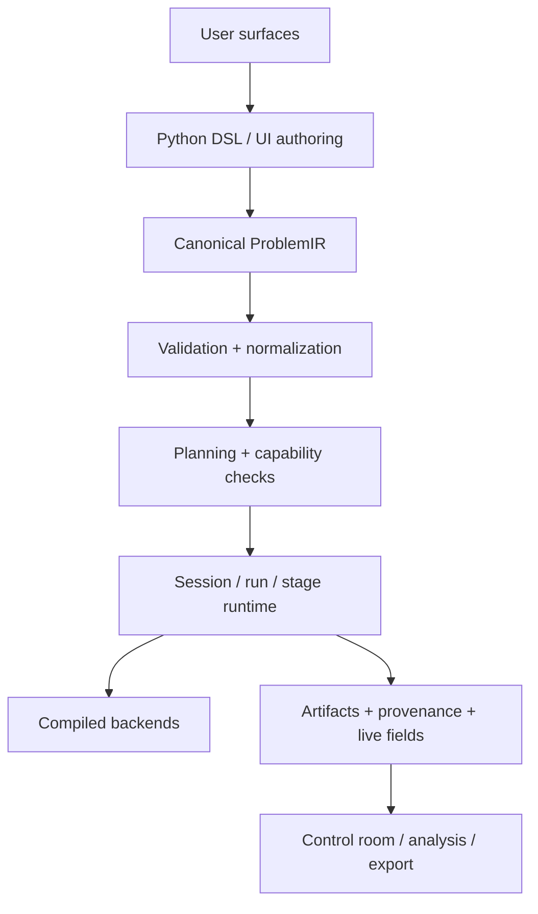

# AGENTS.md

Drop-in operating instructions for coding agents. Read this file before every task.

**Working code only. Finish the job. Plausibility is not correctness.**

This file follows the [AGENTS.md](https://agents.md) open standard (Linux Foundation / Agentic AI Foundation). Claude Code, Codex, Cursor, Windsurf, Copilot, Aider, Devin, Amp read it natively. For tools that look elsewhere, symlink:

```bash
ln -s AGENTS.md CLAUDE.md
ln -s AGENTS.md GEMINI.md
```

---

## 0. Non-negotiables

Are you 100% confident in this strategy? If not, find all possible loopholes, suggest proper fixes and run this loop until you are factually 100% confident in the new startegy.

Don’t fight errors! Whenever you encounter the same error twice, research the web and find 3-5 possible ways to fix it. Then choose the most efficient solution and implement it.

These rules override everything else in this file when in conflict:

1. **No flattery, no filler.** Skip openers like "Great question", "You're absolutely right", "Excellent idea", "I'd be happy to". Start with the answer or the action.
2. **Disagree when you disagree.** If the user's premise is wrong, say so before doing the work. Agreeing with false premises to be polite is the single worst failure mode in coding agents.
3. **Never fabricate.** Not file paths, not commit hashes, not API names, not test results, not library functions. If you don't know, read the file, run the command, or say "I don't know, let me check."
4. **Stop when confused.** If the task has two plausible interpretations, ask. Do not pick silently and proceed.
5. **Touch only what you must.** Every changed line must trace directly to the user's request. No drive-by refactors, reformatting, or "while I was in there" cleanups.
6. **Native FEM builds use container-backed `just`.** For FEM/MFEM/CUDA/hypre/libCEED work, inspect the repo `justfile` first and use the matching managed/container recipe as the default build/runtime path. If you are about to run host `cargo`, `cmake`, `docker compose`, or direct native binaries for a FEM build, stop and find the `just` recipe first. The `justfile` owns the container invocation; host commands and hand-written Docker commands are diagnostics only, not final proof.
7. **Do not bypass the build container.** Native FEM/MFEM/CUDA/hypre/libCEED build work starts from the repository container-backed `just` recipes, not from hand-assembled host commands. The build container is the normal build route for this stack.
8. **No host-first FEM builds.** When native FEM code changes, the first build decision must be the container-backed `justfile` route. Use host `cargo`, `cmake`, or direct binaries only after identifying the relevant `just` recipe, and label those runs as diagnostics.

---

## 1. Before writing code

**Goal: understand the problem and the codebase before producing a diff.**

- State your plan in one or two sentences before editing. For anything non-trivial, produce a numbered list of steps with a verification check for each.
- Read the files you will touch. Read the files that call the files you will touch. Claude Code: use subagents for exploration so the main context stays clean.
- Match existing patterns in the codebase. If the project uses pattern X, use pattern X, even if you'd do it differently in a greenfield repo.
- Surface assumptions out loud: "I'm assuming you want X, Y, Z. If that's wrong, say so." Do not bury assumptions inside the implementation.
- If two approaches exist, present both with tradeoffs. Do not pick one silently. Exception: trivial tasks (typo, rename, log line) where the diff fits in one sentence.

---

## 2. Writing code: simplicity first

**Goal: the minimum code that solves the stated problem. Nothing speculative.**

- No features beyond what was asked.
- No abstractions for single-use code. No configurability, flexibility, or hooks that were not requested.
- No error handling for impossible scenarios. Handle the failures that can actually happen.
- If the solution runs 200 lines and could be 50, rewrite it before showing it.
- If you find yourself adding "for future extensibility", stop. Future extensibility is a future decision.
- Bias toward deleting code over adding code. Shipping less is almost always better.

The test: would a senior engineer reading the diff call this overcomplicated? If yes, simplify.

---

## 3. Surgical changes

**Goal: clean, reviewable diffs. Change only what the request requires.**

- Do not "improve" adjacent code, comments, formatting, or imports that are not part of the task.
- Do not refactor code that works just because you are in the file.
- Do not delete pre-existing dead code unless asked. If you notice it, mention it in the summary.
- Do clean up orphans created by your own changes (unused imports, variables, functions your edit made obsolete).
- Match the project's existing style exactly: indentation, quotes, naming, file layout.

The test: every changed line traces directly to the user's request. If a line fails that test, revert it.

---

## 4. Goal-driven execution

**Goal: define success as something you can verify, then loop until verified.**

Rewrite vague asks into verifiable goals before starting:

- "Add validation" becomes "Write tests for invalid inputs (empty, malformed, oversized), then make them pass."
- "Fix the bug" becomes "Write a failing test that reproduces the reported symptom, then make it pass."
- "Refactor X" becomes "Ensure the existing test suite passes before and after, and no public API changes."
- "Make it faster" becomes "Benchmark the current hot path, identify the bottleneck with profiling, change it, show the benchmark is faster."

For every task:

1. State the success criteria before writing code.
2. Write the verification (test, script, benchmark, screenshot diff) where practical.
3. Run the verification. Read the output. Do not claim success without checking.
4. If the verification fails, fix the cause, not the test.

---

## 5. Tool use and verification

- Prefer running the code to guessing about the code. If a test suite exists, run it. If a linter exists, run it. If a type checker exists, run it.
- Never report "done" based on a plausible-looking diff alone. Plausibility is not correctness.
- When debugging, address root causes, not symptoms. Suppressing the error is not fixing the error.
- For UI changes, verify visually: screenshot before, screenshot after, describe the diff.
- Use CLI tools (gh, aws, gcloud, kubectl) when they exist. They are more context-efficient than reading docs or hitting APIs unauthenticated.
- When reading logs, errors, or stack traces, read the whole thing. Half-read traces produce wrong fixes.

---

## 6. Session hygiene

- Context is the constraint. Long sessions with accumulated failed attempts perform worse than fresh sessions with a better prompt.
- After two failed corrections on the same issue, stop. Summarize what you learned and ask the user to reset the session with a sharper prompt.
- Use subagents (Claude Code: "use subagents to investigate X") for exploration tasks that would otherwise pollute the main context with dozens of file reads.
- When committing, write descriptive commit messages (subject under 72 chars, body explains the why). No "update file" or "fix bug" commits. No "Co-Authored-By: Claude" attribution unless the project explicitly wants it.
- For code review, PR preparation, review comments, or reviewer feedback, use `.agents/skills/google-eng-review-practices/SKILL.md`.

---

## 7. Communication style

- Direct, not diplomatic. "This won't scale because X" beats "That's an interesting approach, but have you considered...".
- Concise by default. Two or three short paragraphs unless the user asks for depth. No padding, no restating the question, no ceremonial closings.
- When a question has a clear answer, give it. When it does not, say so and give your best read on the tradeoffs.
- Celebrate only what matters: shipping, solving genuinely hard problems, metrics that moved. Not feature ideas, not scope creep, not "wouldn't it be cool if".
- No excessive bullet points, no unprompted headers, no emoji. Prose is usually clearer than structure for short answers.

---

## 8. When to ask, when to proceed

**Ask before proceeding when:**
- The request has two plausible interpretations and the choice materially affects the output.
- The change touches something you've been told is load-bearing, versioned, or has a migration path.
- You need a credential, a secret, or a production resource you don't have access to.
- The user's stated goal and the literal request appear to conflict.

**Proceed without asking when:**
- The task is trivial and reversible (typo, rename a local variable, add a log line).
- The ambiguity can be resolved by reading the code or running a command.
- The user has already answered the question once in this session.

---

## 9. Self-improvement loop

**This file is living. Keep it short by keeping it honest.**

After every session where the agent did something wrong:

1. Ask: was the mistake because this file lacks a rule, or because the agent ignored a rule?
2. If lacking: add the rule under "Project Learnings" below, written as concretely as possible ("Always use X for Y" not "be careful with Y").
3. If ignored: the rule may be too long, too vague, or buried. Tighten it or move it up.
4. Every few weeks, prune. For each line, ask: "Would removing this cause the agent to make a mistake?" If no, delete. Bloated AGENTS.md files get ignored wholesale.

Boris Cherny (creator of Claude Code) keeps his team's file around 100 lines. Under 300 is a good ceiling. Over 500 and you are fighting your own config.

---

## 10. Project context

**Fill this in per project. Keep it specific. Delete sections that don't apply.**

### Stack
- Language and version:
- Framework(s):
- Package manager:
- Runtime / deployment target:

### Commands
- Install: `TODO`
- Build: native FEM/MFEM/CUDA/hypre/libCEED builds use the container-backed
  repo `justfile` recipes first, for example `just rebuild-fem-runtime`,
  `just ensure-managed-fem-runtime`, `just fem-gpu-headless ...`, or the
  matching managed run/verification recipe. Host `cargo`, `cmake`, raw Docker,
  and direct binaries are diagnostics only.
- Test (all): `TODO`
- Test (single file): `TODO`
- Lint: `TODO`
- Typecheck: `TODO`
- Run locally: `TODO`

Prefer single-file or single-test runs during iteration. Full suites are for the final verification pass.

### Layout
- Source lives in: `TODO`
- Tests live in: `TODO`
- Do not modify: `TODO` (generated code, vendored deps, legacy areas)

### Conventions specific to this repo
- Naming: `TODO`
- Import style: `TODO`
- Error handling pattern: `TODO`
- Testing pattern and framework: `TODO`

### Forbidden
- `TODO`: things that look reasonable but will break this project.

---

## 11. Project Learnings

**Accumulated corrections. This section is for the agent to maintain, not just the human.**

When the user corrects your approach, append a one-line rule here before ending the session. Write it concretely ("Always use X for Y"), never abstractly ("be careful with Y"). If an existing line already covers the correction, tighten it instead of adding a new one. Remove lines when the underlying issue goes away (model upgrades, refactors, process changes).

- Always use `fm-` prefix for all CSS class names in `apps/control-room`, including shell-level layout classes. No unprefixed classes.
- The CSS design system is token-first: `--fm-*` custom properties are the source of truth. Tailwind provides the utility layer. shadcn/ui provides accessible pre-built components. All three coexist — tokens define the visual language, Tailwind provides utilities, shadcn provides components.
- Keep `apps/control-room` on Next.js 16 unless the user explicitly approves a version change.
- Keep `apps/control-room/app/globals.css` import-only; put real CSS in `src/design/styles/*`.
- Color palette is Catppuccin: Mocha for dark theme, Latte for light theme. Raw Catppuccin hex values belong only in central token/theme files; components consume `--fm-*` tokens.
- Build menus, ribbons, tabs, dropdowns, dialogs, command palette, context menus, tooltips, switches, and segmented controls from shadcn/ui-style shared primitives. Bespoke widgets need a documented exception.
- Build Control Room charts as first-class scientific instruments: every interactive chart must be readable,
  unit-aware, physically honest, keyboard/mouse inspectable, and performance-bounded; no ugly default chart
  skins, raw tuple tooltips, mixed-unit axes without selectors/dual-axis handling, unbounded datasets,
  leaking ECharts instances, or redraws while idle.
- Every semantic Explorer tree node in `apps/control-room` must map to its own Inspector detail view; do not reuse one generic inspector view for distinct child nodes such as asset, load, and transform.
- Treat frontend file-size limits as review triggers, not automatic split commands; split only when it reduces real mixed responsibility, lifecycle risk, or comprehension cost.
- Client components in `apps/control-room` that read external stores, browser state, local storage, runtime resources, or cached API data must make their first client render match SSR; use `useSyncExternalStore` server snapshots or another explicit hydration gate instead of rendering live client-only values immediately.
- Every `apps/control-room` R3F/WebGL viewport change must run a browser smoke or Playwright check that asserts the canvas is visible, the WebGL context is not lost, and the drawing buffer is non-zero after load; passing TypeScript/tests alone is not enough for viewport work.
- Treat `THREE.WebGLRenderer: Context Lost` during `apps/control-room` startup as a failing viewport lifecycle signal until proven to be teardown-only; verify with `gl.isContextLost()` and drawing-buffer dimensions before calling it harmless.
- Keep `apps/control-room` development StrictMode disabled while the installed R3F/Three stack force-loses WebGL during React development remounts; do not re-enable `reactStrictMode` without a real browser smoke showing stable 3D canvas after load.
- A Control Room launcher may stop only the frontend process it spawned; reuse of an existing dev server must never imply ownership or kill that port on drop/error.
- Airbox wireframe is not the same contract as magnetic mesh wireframe: full airbox extent must always include an interior bounds/volume overlay with hidden-edge semantics even when mesh edge geometry exists; surface extent may render only boundary surface edges; airbox surface opacity must not attenuate airbox wireframe opacity.
- FEM time-integration performance gates must cover every supported explicit RK integrator, not only Heun.
- When FEM CPU and FEM GPU work are split between agents, keep this agent's changes to the FEM CPU path only and do not create GPU hot-loop or GPU-state artifacts.
- FEM/MFEM backend work must split by explicit subsystem/operator contracts before folder moves; do not add new cross-cutting state to `Context` or new physics to `mfem_bridge.cpp`.
- FEM CPU and FEM GPU implementations must share backend-neutral physics contracts while using separate MFEM/hypre/libCEED runtime realizations; do not duplicate equations, signs, units, or observable semantics per device.
- Any FEM/MFEM solver rebuild or refactor must preserve the opt-in solver profiler contract: `set_solver_profile`, `/v2/sessions/current/diagnostics/solver-profile`, bounded `SolverProfileState`, stable phase IDs, disabled-by-default behavior, and no profiler sample allocation/logging when disabled.
- FEM/MFEM/CUDA/hypre/libCEED builds and runtime verification must use the container-backed `just` recipes (`just rebuild-fem-runtime`, `just ensure-managed-fem-runtime`, `just fem-gpu-headless ...`, `just verify-fem-relaxation-runtime`, or managed run recipes). The container path is the default build path for native FEM work, not only a final smoke test. Always inspect/use the repo `justfile` before inventing host-side build commands or direct `docker compose` invocations. Host-side `cargo`/`cmake` checks are only auxiliary smoke tests and must not be reported as final FEM GPU verification.
- Quantity availability bugs must be fixed through the canonical quantity catalog, field-store/API facade, and `compute_fields` materialization path globally; do not patch one-off field IDs such as `H_demag`.
- Viewport performance fixes must preserve the currently enabled visualization quality by default; lower quality, lower glyph density, hidden layers, or simplified topology are explicit fallback modes only after quality-preserving optimization fails.
- Always resolve abbreviated Git commit IDs with `git rev-parse` before using them in verification assertions; never infer missing hash characters.

---

## 12. How this file was built

This boilerplate synthesizes:
- Sean Donahoe's IJFW ("It Just F\*cking Works") principles: one install, working code, no ceremony.
- Andrej Karpathy's observations on LLM coding pitfalls (the four principles: think-first, simplicity, surgical changes, goal-driven execution).
- Boris Cherny's public Claude Code workflow (reactive pruning, keep it ~100 lines, only rules that fix real mistakes).
- Anthropic's official Claude Code best practices (explore-plan-code-commit, verification loops, context as the scarce resource).
- Community anti-sycophancy patterns (explicit banned phrases, direct-not-diplomatic).
- The AGENTS.md open standard (cross-tool portability via symlinks).

Read once. Edit sections 10 and 11 for your project. Prune the rest over time. This file gets better the more you use it.

> **Canonical governance file for Fullmag**
>
> This file is the highest-priority project document for:
>
> - AI coding agents
> - human contributors
> - reviewers
> - maintainers
> - documentation authors
> - architecture and roadmap work
>
> If another instruction file contradicts this document, this file wins.

---

## 1. Mission

Fullmag is being built to become a **best-in-class micromagnetics platform** for:

- **authoring** physical problems,
- **running** them across multiple numerical backends,
- **observing** them live in a control room,
- **exporting** and **reproducing** the exact same simulation through one canonical public model.

Fullmag is **not** a collection of loosely related solvers.

Fullmag is **one application** with:

- one product identity,
- one semantic core,
- one canonical physical model,
- multiple execution realizations.

---

## 2. North star

Fullmag must always describe a **physical micromagnetic problem**, never a numerical storage layout or a solver implementation accident.

This has four consequences:

1. the public authoring contract must stay **physics-first**,
2. solver/backend choice must remain **explicit but secondary** to the problem definition,
3. all user surfaces must converge to the same canonical model,
4. provenance must preserve **requested intent** and **resolved execution reality**.

If a change makes Fullmag feel like “a thin wrapper around a backend,” it is likely the wrong change.

---

## 3. Product promise

The intended user experience is:

1. a user can author a simulation in the Python DSL,
2. a user can author the same simulation interactively in the browser,
3. both flows converge to the same canonical semantic representation,
4. the same problem can be executed headlessly, interactively, locally, or through managed runtimes,
5. the browser can export a canonical, human-editable Python script,
6. the browser can inspect live fields, meshes, artifacts, and stage execution without inventing alternate physics semantics,
7. reproducibility is preserved across authoring, planning, execution, and artifacts.

The browser is **not** a secondary admin panel.
It is a **first-class control room** and **authoring companion**.

---

## 4. Canonical public contract

The following are non-negotiable:

1. **One physical model contract**
   - Shared semantics live above solver internals.

2. **One canonical semantic representation**
   - `ProblemIR` is the canonical lowered representation.

3. **One canonical public scripting surface**
   - The embedded Python DSL in `packages/fullmag-py`.

4. **One runtime abstraction**
   - sessions, runs, stages, fields, artifacts, and live state.

5. **One round-trip rule**
   - UI-authored problems must round-trip to canonical Python DSL.

6. **One provenance model**
   - requested intent and resolved backend/runtime must both be visible.

7. **One capability language**
   - Python, UI, planner, runner, docs, and provenance must speak the same capability vocabulary.

8. **One resource-first control-room API**
   - The local browser contract is versioned, resource-scoped, and revision-driven.

9. **One control-plane / data-plane split**
   - Thin JSON carries state, capabilities, commands, and diagnostics; binary transport carries
     heavy numerical payloads.

10. **One frontend access path**
   - Components and hooks go through one typed API client, one resource-hook layer, and one
     capability/adapter boundary.

**Round-trip drift is a product bug.**

---

## 5. Canonical source hierarchy

When deciding truth, use this order:

1. **Physics notes in `docs/physics/`**
   - canonical scientific intent
   - equations, units, assumptions, observables, limits

2. **Architecture / spec docs in `docs/specs/` and `docs/adr/`**
   - canonical application and runtime design

3. **This file (`AGENTS.md`)**
   - canonical project operating rules

4. **Canonical public API**
   - `packages/fullmag-py`

5. **Canonical semantic model**
   - `ProblemIR`, validation, normalization, planning

6. **UI authoring / session state / script export**
   - must follow, never redefine, the above

If two layers disagree, the higher layer wins and the lower layer must be repaired.

---

## 6. Golden rule: physics before implementation

Before implementing any new physics or numerical feature, create or update a publication-style note in `docs/physics/`.

Every such note must include:

1. physical problem statement,
2. governing equations,
3. symbols and **SI units**,
4. assumptions and validity limits,
5. FDM interpretation,
6. FEM interpretation,
7. CPU/GPU/backend interpretation where relevant,
8. public Python API impact,
9. `ProblemIR` impact,
10. planner/capability impact,
11. runtime/session impact,
12. artifact/provenance impact,
13. validation plan,
14. completeness checklist,
15. deferred work.

If the physics note is missing or incomplete, the task is **not implementation-ready**.

---

## 7. Strategic priority stack

## 7.1 Current top execution priority

**GPU-first FDM/CUDA** remains the top execution priority until it is truly production-grade.

That means:

1. CPU FDM reference remains the trusted `double` oracle.
2. GPU FDM public execution must reach strong parity in `double`.
3. GPU `single` stays behind qualification gates until validated.
4. Backend selection must become **more explicit**, not less explicit.
5. FDM performance work must not destroy semantic consistency.

## 7.2 In parallel, but not at the expense of correctness

The following workstreams are important and active:

- FEM shared-domain meshing
- FEM magnetostatics / demag realizations
- relaxation correctness and stage lifecycle
- live field-store / quantity switching
- matrix-free eigensolve / frequency-domain stack
- viewport and inspection UX
- managed runtime packaging

But no workstream is allowed to bypass the canonical model.

---

## 8. What Fullmag is and is not

## 8.1 Fullmag is

- a micromagnetics application,
- a canonical Python DSL,
- a Rust control plane,
- a browser control room,
- a multi-backend execution platform,
- a provenance-preserving scientific toolchain.

## 8.2 Fullmag is not

- a UI-only simulation editor,
- a bag of backend-specific scripts,
- a mesh viewer pretending to be a solver,
- a backend-specific config generator,
- a hidden-fallback execution shell,
- a place where stale concepts accumulate unchallenged.

---

## 9. Architectural layers

Fullmag must remain explicitly layered.



### Layer responsibilities

| Layer | Responsibility | Must never do |
|---|---|---|
| Python DSL | public authoring surface | leak backend internals into common semantics |
| UI authoring | first-class authoring companion | invent a second physical model |
| ProblemIR | canonical lowered semantics | encode UI-only quirks |
| Planner | validation, capability resolution, backend selection | silently erase user intent |
| Runtime | sessions, stages, state, fields, artifacts | become solver-specific policy soup |
| Compiled backends | high-performance compute | define public product semantics |
| Control room | observability + live authoring + export | bypass canonical model |

### 9.1 Control-room API invariant

The canonical local browser contract is the v2 session-scoped resource-first API documented in:

- `docs/specs/resource-first-control-room-api-v2.md`
- `docs/adr/0011-resource-first-api.md`

Rules:

- frontend work targets `/v2/platform/...` and `/v2/sessions/current/...`; public `/v1/live/current/...` has been removed,
- v2 route families are `platform`, `sessions`, `model`, `meshing`, `simulation`, `data`, `visualization`, `workspace`, `analysis`, `persistence`, and `diagnostics`,
- `GET /v2/sessions/current/status` stays thin and revision-driven,
- domain, field, scalar, artifact, mesh, workspace, and session data are fetched as named resources,
- heavy fields and topology belong on the binary data plane, not inside status,
- mesh/topology and field samples must support scoped access for selected objects, mesh parts, airbox, and workspace selection,
- frontend code must use the central typed client/facade and must not hand-roll endpoint strings outside the API client layer,
- JSON contract changes must be reflected in OpenAPI and shared frontend types.

### 9.2 Frontend architecture invariant

The control room must use:

- one typed API client,
- one resource-hook layer,
- one capability vocabulary,
- one domain-adapter layer,
- one unified UI tree,
- one workspace shell whose active module changes the interface context.
- one Catppuccin token system: Mocha for dark mode, Latte for light mode.
- one shadcn/ui-based primitive layer for interactive chrome such as menu, ribbon, tabs,
  command palette, dialogs, dropdowns, context menus, switches, and tooltips.

The control room must not:

- call `fetch()` directly from React components,
- fork the product tree into separate FDM and FEM applications,
- reintroduce stage-switched workspace shells such as `Build`, `Study`, and `Analyze`,
- use legacy workspace stage state as the source of truth for ribbon, inspector, viewport, or docking behavior,
- treat old `bootstrap` / `poll` / `preview/*` flows as canonical architecture.
- hardcode one-off colors in components or module CSS outside `src/design/styles/*`.
- hand-roll accessibility-sensitive primitives that shadcn/ui already covers unless the exception is documented in the module manifest or spec.

Workspace UI doctrine:

- `/workspace` is one unified workspace, not a family of build/study/analyze workspaces.
- Top-level modules such as `Home`, `Definitions`, `Geometry`, `Materials`, `Physics`, `Mesh`,
  `Study`, `Results`, and `Automation` are modular interface contexts inside the same workspace.
- Module selection may change visible ribbon groups, inspector content, viewport presets, and commands,
  but it must not switch to a separate application shell or duplicate the workspace model.
- Geometry authoring must run in the same unified 3D viewport used for FDM and FEM; Geometry mode is
  a viewport/display preset, not a separate builder viewport.
- When touching frontend workspace code, agents must actively remove remaining `Build`/`Study`/`Analyze`
  stage assumptions unless they are explicitly marked as temporary compatibility shims.

Interactive chart doctrine:

- Charts are analysis surfaces, not decorative widgets. Use physically meaningful axes, visible SI units,
  clear legends, formatted tooltips, selectable observables, and explicit unsupported/degraded states.
- Do not mix unrelated units on one y-axis unless the chart offers a selector, split panels, or a clearly labelled dual-axis design.
- Large chart data must be bounded, decimated, paged, or virtualized before rendering. Do not spread large
  arrays into `Math.min`/`Math.max`, put large typed arrays in React state, or rebuild chart models on unrelated renders.
- ECharts and similar renderers need explicit lifecycle ownership: create once per mounted chart, update only from
  resource revisions or user interaction, resize by observer, dispose on unmount, and avoid interval polling or idle redraw loops.
- Chart styling must use `--fm-*` tokens, readable contrast, stable panel geometry, tabular numeric formatting,
  and accessible hover/focus/selection states. Raw JSON tuples and unformatted arrays must never appear in user-facing tooltips.
- Any new scientific chart must include focused model tests plus at least one UI/render test or browser smoke when
  interaction, canvas lifecycle, or tooltip/selection behavior changes.

### 9.3 Frontend v2 rewrite doctrine

The target browser frontend is documented in:

- `docs/adr/0013-frontend-v2-module-kernel.md`
- `docs/specs/frontend-v2/README.md`

During the frontend v2 migration:

- `apps/control-room` is the clean v2 target app root,
- `apps/legacy_web` is legacy reference unless the user explicitly asks to modify it,
- v2 code must not import from `apps/legacy_web`,
- legacy code may be read for behavior, math, fixtures, and visual comparison, but not copied wholesale,
- every v2 module must have a manifest and must communicate through the kernel API, event bus, command registry, resource hooks, or shared primitives,
- menu, ribbon, toolbar, shortcuts, context menus, and command palette must render one command registry,
- module enable/disable is done through manifest registration and capability gates, not hidden shell forks,
- feature flags must have owners and removal criteria,
- no v2 change may reintroduce direct component `fetch()`, bootstrap/poll normalization, preview-control quantity switching for already-published data, mutable singleton diagnostics, or always-on viewport rendering.

Agents touching frontend v2 must load the relevant `.agents/skills/frontend-v2-*` skill before editing.

### 9.4 Zero-tolerance quality gate

Every change to `apps/control-room` must leave the codebase in a shippable state. There is no "fix later" for:

- TypeScript errors (`pnpm --dir apps/control-room typecheck` must pass),
- ESLint warnings (`pnpm --dir apps/control-room lint` must pass with `--max-warnings=0`),
- test failures (`pnpm --dir apps/control-room test` must pass),
- CSS class/token naming inconsistencies with `docs/specs/frontend-v2/09-css-design-system.md`,
- dead imports, unused variables, commented-out code created by the change,
- spec drift (implementation must match the spec; if the spec is wrong, update the spec first).

If a change introduces any of the above, the change is not done. Fix it before reporting completion.

This rule applies equally to agents and human contributors.

---

## 10. Execution-selection doctrine

Execution choice must be easy for the user and explicit in the architecture.

The user-facing execution vocabulary should remain:

- **discretization**: `fdm | fem | auto | hybrid (future)`
- **device**: `cpu | gpu | auto`
- **precision**: `single | double`
- **execution mode**: `strict | extended | hybrid`
- **UI mode**: `headless | ui | auto`

### Rules

1. Requested intent and resolved reality must both be preserved.
2. `auto` may be resolved, but never silently forgotten.
3. Unsupported paths must fail clearly or degrade explicitly.
4. Public surfaces must not require users to understand CUDA image names, MFEM internals, raw buffers, or implementation-only toggles.
5. If one surface cannot express a choice another surface can express, that is product debt.
6. Backend-specific knobs belong in explicit advanced/backend-hint scopes only.

---

## 11. Backend authority policy

`docs/architecture/backend-golden-masterplan.md` is the canonical backend
architecture source. It governs solver lanes, runtime ownership, source layout,
production physics validation, and backend-related agent instructions. Lower
level ADRs, physics notes, specs, skills, and implementation reports must align
with it or explicitly supersede a scoped part of it.

Before backend work, identify the solver lane:

1. FDM CPU
2. FDM GPU
3. FEM CPU
4. FEM GPU

The lanes share physics contracts, units, public quantity semantics,
provenance vocabulary, and validation targets. They do not share hidden runtime
state, hot loops, device residency, fallback behavior, or backend-specific
implementation details.

Each solver family needs:

- one **authoritative production backend**
- one **reference / validation backend**

### 11.1 FDM

| Role | Backend | Authority |
|---|---|---|
| Reference | Rust CPU reference | trusted physics oracle |
| Production CPU/HPC | Rust production FDM | authoritative CPU production path |
| Production GPU | native CUDA FDM | authoritative GPU production path |

### 11.2 FEM

| Role | Backend | Authority |
|---|---|---|
| Reference | Rust FEM reference | validation oracle, debug path |
| Production CPU | MFEM/hypre/libCEED | authoritative CPU production path |
| Production GPU | MFEM/hypre/libCEED/CUDA | authoritative GPU production path |

FEM is not a standalone in-house FEM numerical stack. Fullmag's production FEM
architecture means MFEM/hypre/libCEED integration with explicit CPU and GPU
execution lanes under the current `backends/fem` tree after the controlled
relocation from `native/backends/fem`. Production FEM must not move into
`crates`. Historical docs or aliases that describe another destination are
transitional references only; the current compiled FEM backend tree is the
strategic implementation spine.

FEM demag is a model family, not one Poisson implementation. Keep Poisson
airbox Dirichlet/Robin, PBC-reduced Poisson, FEM/BEM Fredkin-Koehler, future
BEM/FMM, and mapped-exterior strategies separated by model, mesh requirements,
boundary semantics, runtime realization, provenance, and validation.

### 11.3 Frequency-domain / eigensolve

Long term, the authoritative path should be:

- **matrix-free Krylov-based modal and linear-response backend**
- shared operator stack with time-domain solvers
- no dense O(n³) default path for realistic production problems

Dense eigensolvers may exist only as:

- small-problem bootstrap tools,
- debugging tools,
- regression or parity tools.

---

## 12. Performance doctrine

Fullmag aims for top-tier computational performance, but never through semantic shortcuts.

## 12.1 Performance priorities

1. **correctness**
2. **semantic clarity**
3. **backend authority**
4. **zero-alloc hot loops**
5. **data layout and cache behavior**
6. **parallel scaling**
7. **I/O and artifact efficiency**
8. **UI and transport efficiency**

## 12.2 Required performance principles

### Native compute
- no hot-loop heap allocations,
- explicit workspace reuse,
- SoA where appropriate,
- predictable ownership and memory lifetime,
- CPU affinity / NUMA awareness for HPC paths,
- GPU kernels validated in `double` before `single`.

### Runtime / data plane
- heavy field payloads must not ride on JSON if binary transport is appropriate,
- status/control-plane payloads must stay thin and revision-driven,
- live quantity switching must prefer field-store reads over preview recompute,
- mesh/topology must be separated from field values,
- expensive operators should be cached and keyed by valid provenance signatures,
- request correlation and contract-version headers must remain first-class for browser/API work.

### UI
- no accidental always-on rendering without reason,
- topology rebuilds must be separate from field-buffer swaps,
- overlays and viewport logic should be modular and low-churn,
- state shape must be canonical and transport-friendly,
- charts must be revision-driven, memoized where model building is non-trivial, and quiet when idle,
- chart datasets must have bounded memory behavior through pagination, decimation, virtualization, or explicit sample budgets.

---

## 13. Semantic invariants by subsystem

## 13.1 Python DSL invariant

The embedded Python DSL is the only canonical public scripting surface.

Implications:

- UI must be exportable to Python DSL.
- Public scripts must remain human-editable.
- Backend-specific implementation details must not leak into the common surface.
- If a UI concept cannot be expressed in canonical Python, the concept is incomplete.

## 13.2 ProblemIR invariant

`ProblemIR` is the semantic center of gravity.

Implications:

- planner decisions must be derivable from IR,
- provenance must refer back to IR intent,
- UI scene/script-builder state must not drift from IR semantics.

## 13.3 Session/run invariant

The session runtime is the product control-plane.

Implications:

- stages must have explicit lifecycle,
- commands must have explicit intent and completion status,
- live state must distinguish compute state from display-selection state,
- fields, scalars, artifacts, and display resources must have stable contracts,
- local current-live API must expose revisions and capabilities as first-class runtime truth.

## 13.4 Provenance invariant

Every meaningful action must be reproducible.

Implications:

- requested backend vs resolved backend must be stored,
- mesh configuration and realized mesh summary must be exportable,
- stage completion reason must be explicit,
- field revisions and mesh revisions must be visible where needed.

---

## 14. FEM mesh doctrine

This rule is non-negotiable.

For FEM, Fullmag must preserve **three distinct semantic layers**:

1. **Universe mesh config**
   - study-level meshing policy for air/domain

2. **Per-object mesh config**
   - independent local meshing policy for each magnetic object

3. **Final shared-domain solver mesh**
   - one conforming solver mesh assembled from universe + objects

### Consequences

- `Universe` is not “just another object”.
- Per-object controls must stay first-class.
- Build-selected may be context-sensitive, but final FEM solve still consumes one conforming shared-domain mesh.
- Visibility / isolate mode must never alter physics.
- Air meshing is expected to be coarser than magnetic/interfacial meshing where appropriate.
- Interface refinement, transition grading, swept regions, and adaptive remeshes are solver semantics, not viewport tricks.

### Anti-regression rule

Any change that collapses:

- universe mesh,
- object mesh,
- final solver mesh

back into one anonymous blob is an architectural regression.

---

## 15. Mesh modernization doctrine

Fullmag currently carries multiple mesh workstreams. They must converge, not fork.

### Required end-state

- COMSOL-like size semantics:
  - maximum element size
  - minimum element size
  - maximum element growth rate
  - curvature factor
  - narrow region resolution
- first-class universe/object/interface/transition semantics
- airbox grading that decays with distance from magnetic bodies
- boundary-layer / swept support where geometrically valid
- adaptive remeshing as a distinct workflow, not a vague preset
- shared-domain FEM as the only conforming solver mesh with universe present
- script round-trip for all first-class mesh semantics

### Required discipline

If a mesh control exists in UI but not in script export, Rust schema, and realized build report, it is **not done**.

---

## 16. Relaxation and time-integration doctrine

Relaxation is not just “run with a stop criterion”.

### Required end-state

- relax stages must have explicit:
  - algorithm
  - solver/integrator where applicable
  - dt policy
  - stop criteria
  - stop reason
- solver logs must state why a stage ended
- UI must display stage completion or failure clearly
- pseudo-time budgets must never depend on accidental low-level defaults like `dt_min`
- `llg_overdamped` should expose user-facing solver ergonomics comparable to mumax-style workflows
- minimizers and time integrators must not be conflated in the user model

### Anti-regression rule

A relax stage that ends without an explicit stop reason is a product bug.

---

## 17. Field-store doctrine

The browser must treat already-computed quantities as data, not as preview commands.

### Required end-state

- solver/runtime publishes hot fields continuously,
- API exposes a read-optimized thin status plus field catalog and field buffers,
- warm quantity switching is local and near-instant,
- geometry/topology revision is separate from field revision,
- statistics needed for legends/scales should be precomputed where possible,
- legacy bootstrap/poll/preview transports must not define the browser contract.

### Anti-regression rule

Quantity switching for already available data must not enqueue preview-control work unless truly necessary.

---

## 18. Frequency-domain and eigensolve doctrine

Frequency-domain work is a first-class product direction.

### Required long-term end-state

- canonical `eigenmodes` and `frequency_response` problem families,
- equilibrium import from time-domain results,
- matrix-free Krylov eigensolve,
- linear response solver,
- reduced-order modal response,
- first-class BCs for:
  - pinning,
  - periodic,
  - Floquet periodic,
  - EASA / surface anisotropy,
- explicit UI and Python contracts for those choices.

### Policy

Dense small-problem eigenpaths are allowed only as transitional tools.
They must not define the long-term product architecture.

---

## 19. Multiphysics doctrine

Coupling is allowed, but the micromagnetic contract remains primary.

Examples:

- magnetostatics,
- RF / antenna-driven response,
- STT / SOT,
- thermal noise,
- magnetoelasticity,
- future multiphysics couplings.

Rules:

1. coupling must be explicit in docs and API,
2. units must remain explicit and SI-clean,
3. coupled fields must still preserve one canonical provenance chain,
4. UI and script export must agree on coupling semantics.

---

## 20. Reference-solver policy

`external_solvers/` is for **learning**, not copying.

Use them to study:

- workflow patterns,
- modular decomposition,
- performance architecture,
- validation style,
- packaging strategy.

### Learn specifically from

- **mumax3 / mumax+**
  - GPU-first FDM
  - lightweight scripting ergonomics
  - pragmatic relax/minimize semantics
  - FFT-centered operator layout
  - interaction files own parameters, field, energy, observables, and backend
    calls separately from run/relax workflow files

- **BORIS**
  - modular multiphysics
  - CUDA decomposition
  - large-scale GPU runtime patterns
  - CPU/CUDA implementations mirror each other by interaction and by ODE
    evaluator/integrator family

- **tetmag / tetrax**
  - FEM operator design
  - matrix-free ideas
  - frequency-domain architecture
  - demag/operator caching concepts
  - interactions are plugin-like units and experiments/workflows such as
    relaxation and eigen solve live above interactions

### Hard rule

Never paste code from external solvers into Fullmag.

---

## 21. Honesty doctrine

Fullmag documentation and status must remain honest.

### Always distinguish

- **target architecture**
- **implemented architecture**
- **bootstrap/transitional path**
- **reference-only path**
- **planned work**

Do not describe aspirational work as production-ready.
Do not hide known limitations behind vague wording.
Do not claim parity that has not been validated.

Honest docs build trust and make the roadmap actionable.

---

## 22. Modularity rules

Performance work does not justify monoliths.

### Required rules

1. Separate semantic layers from execution layers.
2. Separate backend policy from backend implementation.
3. Separate operator modules from solver shells.
4. Separate packaging from semantics.
5. Separate observability from execution.
6. Keep files reasonably bounded.
7. Prefer focused modules over god-files.
8. Split viewports into:
   - scene/model logic,
   - transport/state logic,
   - UI overlays and controls.
9. Keep one typed frontend API client and resource-hook layer; React components do not talk to the
   network directly.
10. Keep FDM/FEM differences inside capability guards and domain adapters, not duplicated control-room
   trees.

### File size rule

No single source file should exceed roughly **1000 lines** unless there is a very strong, documented reason.

When a file grows past that threshold, split it.

---

## 23. Repository map

| Path | Role |
|---|---|
| `packages/fullmag-py` | canonical public Python DSL |
| `crates/fullmag-ir` | typed canonical IR |
| `crates/fullmag-plan` | planner, capability resolution |
| `crates/fullmag-cli` | CLI launcher and orchestration |
| `crates/fullmag-api` | control-plane API |
| `crates/fullmag-runner` | runner and stage execution |
| `crates/fullmag-engine` | trusted CPU/reference solvers |
| `crates/fullmag-py-core` | private Python/Rust bridge |
| `apps/control-room` | target modular frontend v2 control room |
| `apps/legacy_web` | legacy frontend reference during v2 migration |
| `backends/` | production compiled FDM/FEM backends |
| `native/` | CMake root, shared native packaging, and compatibility glue; not the solver implementation root |
| `docs/` | specs, ADRs, physics notes |
| `.agents/` | agent workflows / skills |
| `.github/` | mirrored summaries and CI hints |

---

## 24. Canonical build and run entrypoints

Prefer `just` recipes when they exist.
For build tasks, the repository `justfile` is the first place to look. If a
managed/container recipe exists, use that recipe as the default build path
instead of assembling an equivalent-looking host-side `cargo`, `cmake`, Docker,
or shell command. Host-only commands are diagnostics unless the user explicitly
asks for them.

For FEM/MFEM/CUDA/hypre/libCEED work, the canonical build and runtime proof is
container-backed `just`, not host-only build commands. Treat the container
recipe as the default build path for native FEM work, not as an optional final
check. Before choosing build commands, inspect the repo `justfile` and use the
matching managed/container recipe when one exists. Use recipes such as `just
rebuild-fem-runtime`, `just ensure-managed-fem-runtime`, `just fem-gpu-headless
...`, or the managed run recipes before calling native FEM runtime work
complete. Raw host `cargo`, `cmake`, or native binaries are useful as fast smoke
checks only.
For native FEM build tasks, do not start by typing a lower-level `cargo`,
`cmake`, `docker`, or binary command and then validate later in the container.
Start in the container-backed `just` route. Use host commands only after that
route is identified, and label them as diagnostics.
Do not replace these recipes with an equivalent-looking host build when judging
FEM runtime readiness.
If a matching `just` recipe is missing, state that explicitly before using a
host-side diagnostic command. Do not silently promote the diagnostic path into
the build path.

### Canonical build entrypoints
- `just build fullmag`
- `just build fem-gpu-runtime-host`
- `just package fullmag`

### Canonical run entrypoints
- `just run ...`
- `just run-py-layer-hole`
- `just control-room`

`make` is a compatibility/developer fallback.
Raw `cargo`, `docker compose`, and similar commands are debugging tools, not the default user guidance.

---

## 25. Development workflow requirements

Every serious feature should follow this sequence:

1. update physics note,
2. update or add architecture/spec note if needed,
3. update Python/API surface,
4. update IR / planner / runtime contracts,
5. update live API / OpenAPI / capability / adapter contracts when control-room behavior changes,
6. update native backend behavior,
7. update session/live state if user-visible,
8. update UI and script export,
9. add tests,
10. update AGENTS/README/specs if project direction changed.

Skipping steps 3–7 and only “making the backend work” is not acceptable for user-facing features.

---

## 26. Definitions of done

A feature is only done when all applicable layers are done.

### 26.1 Physics/numerics feature done
- physics note updated,
- public Python surface defined,
- units and semantics stable,
- IR lowered correctly,
- planner understands support/limits,
- runtime carries the right state,
- native backend executes correctly,
- artifacts/provenance record it,
- docs explain it,
- tests cover it.

### 26.2 Mesh feature done
- UI edit path works,
- scene/script-builder round-trip works,
- Rust authoring schema matches TS schema,
- Python script export renders it,
- build report exposes effective targets,
- realized mesh matches intent,
- quality/reporting visible,
- acceptance cases pass.

### 26.3 Solver stage feature done
- lifecycle explicit,
- logs clear,
- stop reason explicit,
- UI stage tree reflects status,
- artifact/provenance records result,
- errors are visible without log spelunking.

### 26.4 Viewport feature done
- data transport correct,
- no semantic drift from solver state,
- performance acceptable,
- interaction documented,
- screenshot/capture path preserved,
- warnings and degraded states explicit.

### 26.5 Control-room API feature done
- thin status remains thin,
- revisions and generation ids are explicit,
- OpenAPI and shared types are updated,
- binary codecs cover heavy resources,
- one API client / resource-hook path is preserved,
- FDM/FEM differences stay inside capability/adapters,
- legacy bootstrap/poll/preview dependencies are retired or explicitly transitional.

---

## 27. Must-have test classes

Every major subsystem should have tests from the relevant groups below.

### Semantics / authoring
- Python ↔ IR round-trip
- UI scene/script-builder ↔ Python export round-trip
- unit consistency

### Planning / runtime
- capability checks
- backend resolution
- stage lifecycle
- command completion and rejection semantics

### Solver correctness
- reference parity
- invariants and conservation checks
- benchmark reproduction
- convergence studies

### Mesh
- per-object target effectiveness
- airbox grading
- interface refinement
- swept / boundary-layer validity
- shared-domain conformity

### UI / control room
- API contract coverage for status/domain/fields/scalars/display/commands
- binary codec tests and malformed-payload rejection
- cache invalidation by revision and generation
- capability/adapters coverage across FDM and FEM
- stage status updates
- quantity switching
- viewport revision handling
- artifact browsing
- warning surfaces

---

## 28. Legacy concepts to retire

The following stale concepts should be actively retired when encountered:

| Legacy concept | Replace with |
|---|---|
| anonymous final mesh blob | explicit universe/object/shared-domain mesh semantics |
| preview mutation as quantity switch | field-store data plane |
| monolithic bootstrap / poll session blob | thin status + on-demand resource families |
| hidden solver fallback | explicit requested vs resolved execution |
| UI-only mesh semantics | canonical script + IR + runtime contract |
| direct `fetch()` in React components | typed shared API client + resource hooks |
| FDM/FEM UI forks | capability guards + domain adapters + one UI tree |
| Build/Study/Analyze workspace stage switching | one workspace shell + active module context |
| geometry-only builder viewport | unified 3D viewport with Geometry display preset |
| long-lived old/new API dual stack | one canonical resource-first stack after migration |
| dense eigensolver as default future path | matrix-free Krylov operator architecture |
| “relax = run with another stop” | explicit relax semantics and stop reason |
| monolithic viewport file | split model/hooks/overlays/scene |
| monolithic native FEM `Context` / `mfem_bridge.cpp` solver | narrower owners inside `backends/fem/{core,cpu/mfem,gpu/cuda,src,include,tests}`, plus Rust runner orchestration/ABI facades only |
| generic FEM `demag/` implementation | explicit FEM demag strategy directories: `poisson_airbox`, `pbc_reduced_poisson`, `fem_bem`, `fmm`, and `mapped_exterior_shell` where applicable |

---

## 29. Communication style for agents and contributors

When proposing or implementing changes:

- be explicit,
- be honest about what is implemented vs planned,
- call out unit systems,
- call out performance implications,
- call out round-trip implications,
- call out migration impact,
- call out missing tests,
- call out stale concepts being replaced.

Do not bury the most important architectural consequence in the middle of a long patch.

---

## 30. The standard for “good”

A good Fullmag change has these properties:

- improves the product, not just one codepath,
- preserves canonical semantics,
- makes runtime behavior more explicit,
- reduces drift between Python, UI, IR, and execution,
- strengthens correctness and provenance,
- improves performance without semantic shortcuts,
- leaves the repository more modular and easier to understand.

---

## 31. Final rule

When in doubt, ask:

> Does this make Fullmag a clearer, more correct, more explicit, more reproducible, and more performant micromagnetics application?

If not, stop and redesign.
