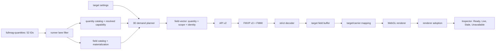
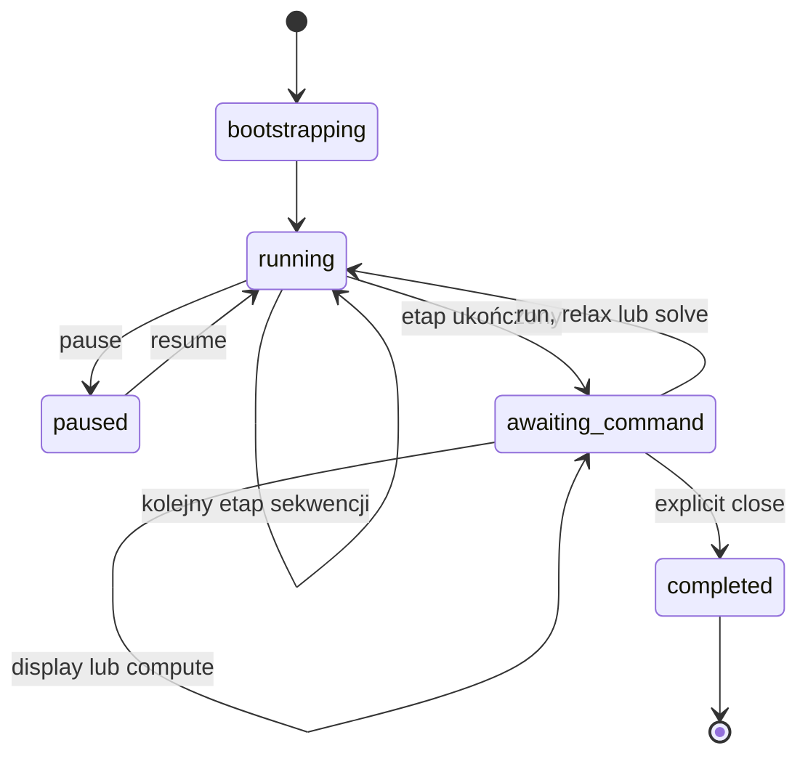

# Audyt frontendu wizualizacji 3D FEM/FDM i kontraktów backend–frontend

**Projekt:** Fullmag
**Data audytu:** 2026-08-24
**Audytowany commit `master`:** `78cde18ee95b6d6ee1cd93e7a775bb7a8c7249de`
**Zakres:** Control Room, API v2, transport pól, targety i carriery FEM/FDM, Airbox, quantities oraz stan interaktywny po zakończeniu etapu solvera
**Rodzaj audytu:** statyczna analiza kodu i kontraktów. Raport nie deklaruje wykonania managed FEM, browser/WebGL fixture ani testów runtime dla wskazanego SHA.

---

## 1. Werdykt

Rdzeń wizualizacji 3D ma poprawną, bliską produkcyjnej architekturę. Fullmag rozdziela quantity, scope, target, carrier, generation, revision oraz renderer adoption. Payload nie jest przyjmowany tylko dlatego, że ma odpowiednią długość: FMVP v3 przenosi scope i identity, a frontend sprawdza zgodność nośnika, topologii oraz sesji.

Nie należy jednak kwalifikować całego zakresu FEM/FDM 3D jako bezwarunkowo gotowego produkcyjnie. Pozostają dwa blokery o znaczeniu release:

1. Capability quantity nie jest jeszcze pojedynczym źródłem prawdy aż do konkretnego carriera. Frontend nadal ma ręczne mapy metadata, a część ścieżek Airboxa używa ogólnego `domain=full_domain`.
2. `master` nie jest chroniony i nie wymaga żadnych status checks, mimo że repozytorium definiuje wymagane bramki 3D.

### Ocena obszarów

| Obszar | Ocena | Wniosek |
|---|---|---|
| Target/carrier architecture | dobra | semantyczny target jest oddzielony od technicznego nośnika |
| FEM Airbox i obiekty | dobra z luką | Airbox jest osobny, ale wiele mesh parts jednego obiektu jest agregowanych |
| FDM single-grid | dobra | magnetic support i outside-support są rozróżnione przez membership |
| FDM multilayer | bardzo dobra | native layers i target-only Airbox są osobnymi nośnikami; common FFT grid nie jest geometrią |
| Quantity contracts | dobra, niepełny parytet | 52 kanoniczne ID, ale wykonanie zależy od backendu, engine i planu |
| Binary field plane | dobra | v3 jest rygorystyczne; legacy v2 osłabia identity po remeshu |
| Post-stage interactive mode | poprawny, z cold-path dla shared-air | shared-air rekonstruuje pola na żądanie, lecz nie ma warm switchingu ani retained operator cache |
| CI/release governance | niewystarczająca | branch protection i required checks są wyłączone |

### Klasyfikacja

- P0: 0
- P1: 2
- P2: 10
- P3: 2

---

## 2. Przepływ backend–frontend



Poprawnym kontraktem nie jest samo `quantity_id`. Dla przestrzennej wizualizacji minimalna identity powinna obejmować:

```text
session_epoch
quantity_id
component lub complex view
scope_kind
scope_id
carrier_id lub carrier fingerprint
domain_generation
topology_revision lub topology hash
indexing
field_revision
```

Obecna ścieżka v3 w dużej mierze to zapewnia. Ważną zaletą jest też to, że backend nie deklaruje renderer adoption. Backend może udowodnić capability, materialization i gotowość payloadu; dopiero viewport może potwierdzić, że konkretny bufor został faktycznie użyty.

---

## 3. FEM: Airbox, obiekty i części siatki

`manifestRenderableCarriers.ts` traktuje rzeczywiste `mesh_parts` jako field-capable carriery. `object_segments` są wyłącznie diagnostycznym fallbackiem, jeżeli nie istnieje potwierdzony nośnik. Jest to poprawne zachowanie fail-closed.

`buildSemanticRenderTargetCatalog()` w `semanticRenderTargetCatalog.ts` buduje targety:

- `airbox`;
- `object:<object_id>`;
- `part:<part_id>`;
- regiony nie należą do tego katalogu; `resolveViewport3DRegionTargetByPartId()` i
  `resolveViewport3DRegionTargetsForMembershipOwnerParts()` w
  `useViewport3DSceneModel.ts` składają osobne targety `region:<...>`.

Część o roli Airboxa trafia do logicznego targetu `airbox`. Część przypisana do obiektu sceny trafia do targetu obiektu. Nieprzypisana część pozostaje targetem `part`. W efekcie Airbox i obiekty mają niezależne visibility, wireframe, points, bounds, vectors i active quantity.

### Luka: wiele części jednego obiektu

Jeżeli kilka carrierów mapuje się na ten sam obiekt, są agregowane pod jednym `object:<id>`. To jest wygodne dla prostego obiektu, lecz nie daje pełnego zarządzania każdym fragmentem siatki. Docelowo katalog powinien umożliwiać hierarchię:

```text
object:<object_id>
├── part:<mesh_part_a>
├── part:<mesh_part_b>
└── region:<region_id>
```

Ustawienia obiektu powinny być bazą grupową, a part/region opcjonalnym override. Nie wymaga to duplikowania danych: ten sam carrier może być używany przez grupę i subtarget z odpowiednią maską indeksów.

**Ocena FEM:** Airbox–obiekt jest rozdzielony prawidłowo. Pełne object–subpart management jest częściowe.

---

## 4. FDM: single-grid i multilayer

### FDM single-grid

FDM single-grid nie ma Airbox mesh w sensie FEM. Istnieje regularny universe grid oraz membership opisujący aktywne komórki magnetyczne, nieaktywne komórki i obszar poza magnetic support. `domainPresentation.ts` poprawnie nie utożsamia outside-support z FEM shared-domain Airboxem.

Przed publikacją membership frontend może pokazać jedynie konserwatywną obwiednię. Nie powinien udawać dokładnego podziału komórek na podstawie bounding boxów autora. Exact cell ownership musi pochodzić z FMRM/membership.

### FDM multilayer

Multilayer ma bardzo dobrą separację:

- każda native layer ma własny `layer_id`, `object_id`, grid fingerprint, maskę aktywności i rewizję;
- common convolution/transform grid jest jawnie wykluczony jako fizyczna geometria;
- Airbox jest osobnym `target_only` carrierem;
- Airbox ma własne origin, spacing, shape, generation, fingerprint i revision;
- aktualnie certyfikowanym observable Airboxa jest tylko `H_demag`;
- `H_eff` jest dla tego carriera niedostępne;
- payload wymaga FMVP v3, `scope_kind=airbox`, `scope_id=airbox`, zgodnej generation, fingerprintu i jawnych indeksów.

Maski warstw są sprawdzane rygorystycznie. Deklarowana maska nie przechodzi na fallback renderujący wszystkie komórki. Sprawdzane są shape, counts, grid fingerprint, mask hash i layout revision.

### Publiczny Airbox a klasa nośnika

UI kanonizuje różne historyczne identyfikatory do targetu `airbox`. Jest to właściwe dla użytkownika, ale diagnostyka powinna dodatkowo publikować klasę carriera:

```ts
type AirboxCarrierKind =
  | 'fem-shared-domain-part'
  | 'fdm-single-grid-outside-support'
  | 'fdm-multilayer-target-only';
```

Identity payloadu chroni przed bezpośrednim przeciekiem między tymi przypadkami. Jawny `carrier_kind` jest jednak potrzebny do wyjaśnienia różnic capabilities i polityki post-stage.

---

## 5. Kontrakty wszystkich 52 quantities

Kontrakt quantity ma cztery poziomy:

1. canonical descriptor: ID, shape, components, unit, location, domain i preview policy;
2. resolved lane capability: backend, engine, aktywne interakcje i plan;
3. materialization: unmaterialized, pending, complete, stale lub error;
4. target adoption: zgodny target, carrier, scope, generation, revision i renderer buffer.

`QuantityId::as_str()` jest zamrożonym wire formatem. `registry.rs` testuje parytet providerów z katalogiem 52 wpisów. Jest to właściwy fundament.

### Legenda macierzy

- `3D` — quantity jest wystawiona, interaktywna i ma preview 3D;
- `hist.` — global scalar, właściwa ścieżka to historia/tabela;
- `deferred` — canonical, lecz nie jest obecnie live 3D;
- `A` — lane zasadniczo dopuszcza quantity, jeżeli engine/provider ją realizuje;
- `C` — dopuszczona warunkowo przez aktywną fizykę;
- `N` — bieżący spatial-preview gate odrzuca;
- `S` — inna ścieżka, np. scalar history lub analysis overlay.

| # | Quantity | Katalog | Domena | FDM CPU | FDM GPU | FDM-ML | FEM CPU | FEM GPU | Uwagi |
|---:|---|---|---|---:|---:|---:|---:|---:|---|
| 1 | `m` | 3D vector | magnetic | A | A | A | A | A | podstawowy carrier |
| 2 | `H_ex` | 3D vector | magnetic | C | C | C | C | C | exchange |
| 3 | `H_demag` | 3D vector | full | C | C | C | C | C | główne pole Airboxa |
| 4 | `H_ext` | 3D vector | full | C | C | C | C | C | external field |
| 5 | `H_ant` | 3D vector | full | C | N | N | N | N | tylko FDM CPU ma bieżący materializator; CUDA FDM, multilayer i native FEM odrzucają |
| 6 | `H_drive` | 3D vector | magnetic | N | N | N | C | C | FDM CPU/GPU i multilayer nie materializują; frontend ma alias `B_drive` |
| 7 | `H_eff` | 3D vector | full | A | A | A | A | A | Airbox support musi być carrier-specific |
| 8 | `torque` | 3D vector | magnetic | A | A | A | A | A | katalog: unit `T` |
| 9 | `H_ani` | 3D vector | magnetic | C | C | C | C | C | anisotropy |
| 10 | `H_dmi` | 3D vector | magnetic | C | N | C | C | C | `CudaSnapshotObservable::from_quantity()` nie obsługuje `H_dmi` |
| 11 | `H_mel` | 3D vector | magnetic | N | N | N | C | C | FDM CPU/GPU i multilayer bez materializatora magnetoelastic |
| 12 | `u` | deferred | full | N | N | N | N | N | mechanika bez live 3D |
| 13 | `eps` | deferred, 6 comp. | full | N | N | N | N | N | shape `VectorField` jest nieprecyzyjny |
| 14 | `sigma` | deferred, 6 comp. | full | N | N | N | N | N | powinien być symmetric tensor |
| 15 | `H_ani_cubic` | 3D vector | magnetic | N | N | C | C | C | FDM CPU/GPU nie materializują cubic anisotropy |
| 16 | `H_dmi_bulk` | 3D vector | magnetic | N | N | C | C | C | FDM CPU/GPU nie materializują bulk DMI |
| 17 | `H_oe` | 3D vector | full | C | C | N | C | C | multilayer IR bez Oersteda |
| 18 | `H_therm` | 3D vector | magnetic | N | N | N | C | C | FDM CPU/GPU i multilayer bez preview termicznego |
| 19 | `E_ex` | hist. | magnetic | S | S | S | S | S | global scalar |
| 20 | `E_demag` | hist. | magnetic | S | S | S | S | S | global scalar |
| 21 | `E_ext` | hist. | full | S | S | S | S | S | global scalar |
| 22 | `E_drive` | hist. | magnetic | S | S | S | S | S | global scalar |
| 23 | `E_ani` | hist. | magnetic | S | S | S | S | S | global scalar |
| 24 | `E_dmi` | hist. | magnetic | S | S | S | S | S | global scalar |
| 25 | `E_el` | hist. deferred | full | S | S | S | S | S | mechanika niewystawiona |
| 26 | `E_kin_el` | hist. deferred | full | S | S | S | S | S | mechanika niewystawiona |
| 27 | `elastic_residual_norm` | hist. deferred | full | S | S | S | S | S | diagnostyka mechaniki |
| 28 | `E_total` | hist. | full | S | S | S | S | S | global scalar |
| 29 | `mode_amplitude` | deferred analysis | magnetic | N | N | N | N | N | osobna ścieżka eigen |
| 30 | `mode_real` | deferred analysis | magnetic | N | N | N | N | N | osobna ścieżka eigen |
| 31 | `mode_imag` | deferred analysis | magnetic | N | N | N | N | N | osobna ścieżka eigen |
| 32 | `mode_phase` | deferred analysis | magnetic | N | N | N | N | N | osobna ścieżka eigen |
| 33 | `eden_ex` | 3D scalar | magnetic | C | C | C | C | C | cell field |
| 34 | `eden_demag` | 3D scalar | magnetic | C | C | C | C | C | cell field |
| 35 | `demag_phi` | deferred scalar | full | N | N | N | C | C | FEM może liczyć, UI 3D blokuje |
| 36 | `eden_ext` | 3D scalar | magnetic | C | C | C | C | C | cell field |
| 37 | `eden_drive` | 3D scalar | magnetic | N | C | N | C | C | FDM CPU i multilayer bez materializatora drive-density |
| 38 | `eden_ani` | 3D scalar | magnetic | C | C | C | C | C | cell field |
| 39 | `eden_dmi` | 3D scalar | magnetic | C | C | C | C | C | cell field |
| 40 | `eden_total` | 3D scalar | magnetic | A | A | A | A | A | cell field |
| 41 | `mat_ms` | 3D scalar | magnetic | A | N | A | N | N | brak CUDA FDM i FEM material field provider |
| 42 | `mat_aex` | 3D scalar | magnetic | A | N | A | N | N | brak CUDA FDM i FEM material field provider |
| 43 | `mat_alpha` | 3D scalar | magnetic | A | N | A | N | N | brak CUDA FDM i FEM material field provider |
| 44 | `mat_dind` | 3D scalar | magnetic | N | N | N | N | N | katalog wyprzedza lane providers |
| 45 | `mat_dbulk` | 3D scalar | magnetic | N | N | N | N | N | katalog wyprzedza lane providers |
| 46 | `dm_dt` | deferred vector | magnetic | N | N | N | N | N | preview flag bez UI exposure |
| 47 | `V_electric` | deferred scalar | full | N | N | N | N | N | brak live 3D providera; ui_exposed, ale preview 3D false |
| 48 | `J_charge` | deferred vector | full | N | N | N | N | N | brak live 3D providera; ui_exposed, ale preview 3D false |
| 49 | `spin_potential` | deferred vector | full | N | N | N | N | N | brak native FEM preview providera i standardowego renderera 3D |
| 50 | `spin_current_tensor` | deferred tensor | full | N | N | N | N | N | brak native FEM preview providera; wymaga jawnej projekcji tensora |
| 51 | `torque_stt` | deferred vector | full | N | N | N | N | N | brak native FEM preview providera; UI i interactive false |
| 52 | `torque_sot` | deferred vector | magnetic | N | N | N | N | N | brak bieżącego lane provider |

### Wnioski quantity

- Katalog jest kompletny semantycznie, ale nie oznacza parytetu backendów. UI musi używać `resolved_capability`.
- FEM nie publikuje obecnie pięciu pól materiałowych: `mat_ms`, `mat_aex`, `mat_alpha`, `mat_dind`, `mat_dbulk`.
- FDM multilayer świadomie ma ograniczony IR i zestaw obserwabli.
- Transport jest canonical, lecz standardowy renderer 3D nie ma jeszcze pełnej semantyki scalar/vector/tensor dla tych pól.
- `eps` i `sigma` powinny otrzymać `SymmetricTensorField` lub równoważny descriptor przed ekspozycją.
- `B_drive` i skalowanie przez `mu0` powinny być descriptor-driven, a nie zaszyte ręcznie w TypeScript.

---

## 6. Podwójne źródło prawdy quantities

`fullmag-quantities` jest deklarowany jako single source of truth, ale `quantityIds.ts` nadal utrzymuje ręczne:

- canonical aliases;
- scalar-spatial ID set;
- unit map;
- `B_drive -> H_drive`;
- skalowanie przez `mu0`.

Mapy nie pokrywają pełnych 52 ID. Po aktywacji nowych quantity może to dać błędną jednostkę, niewłaściwy component selector, błędny colorbar lub potraktowanie scalar/tensor field jako vector3.

Docelowo descriptor OpenAPI/TypeScript powinien zawierać ID, aliases, shape, components, unit, domain, location, preview policy, renderer kind i opcjonalny display transform. `quantityIds.ts` powinien ograniczyć się do typowanych helperów, bez niezależnej tabeli prawdy.

---

## 7. Capability Airboxa musi być carrier-specific

`domain=full_domain` oznacza, że quantity może mieć sens poza magnesem. Nie oznacza, że każdy carrier Airboxa ją publikuje.

FDM multilayer jest bezpieczny w rendererze, ponieważ `viewport3DFdmMultilayerAirbox.ts` żąda twardo tylko `H_demag`. Równolegle generic helper `fieldCatalogQuantitySupportsAirbox()` sprawdza przede wszystkim ID i full-domain. Jest używany w planowaniu, zasobach viewportu, Inspectorze i Ribbonie.

Istnieje lepszy `resolveTargetFieldAvailability`, który uwzględnia carrier, scope, generation, revision, materialization i adoption. Docelowo wszystkie listy quantities oraz request plans muszą korzystać z jednego `CarrierQuantityCapability`.

Zalecane pola:

```text
target_id
carrier_id
carrier_kind
quantity_id
components
scope_kind
scope_id
materialization_policy
state
reason_code
generation
revision
```

Legacy full-domain helper należy usunąć po migracji.

---

## 8. Binary field contract

### Mocne strony v3

FMVP v3 sprawdza magic, wersję, nagłówek, alignment, reserved fields, rozmiar payloadu, components, point/value count, indexing, explicit indices, scope, generation i topology fingerprint. Target buffer dodatkowo przechowuje session ID/epoch, consumer IDs, target IDs, completeness i source identity.

### Legacy v2

V2 może dla full-domain opierać część identity na response headers i zaakceptować legacy payload z niepełną generacją/topologią. Po remeshu w tej samej sesji osłabia to gwarancję, że stare pole nie zostanie pokazane na nowej siatce.

Plan migracji:

1. telemetria użycia v2;
2. warning w development;
3. v3-required dla FEM, scoped data, Airbox, multilayer i remesh-capable sessions;
4. usunięcie v2 po migracji fixture.

### Typ danych

Wire payload jest `Float64`. Dla single-precision lane i dużych pól oznacza około dwukrotnie większy transfer/cache niż `Float32` oraz dodatkową konwersję do GPU. Format powinien mieć jawny scalar type `f32` lub `f64`, będący częścią cache identity.

---

## 9. Ustawienia targetów

`ObjectVisualizationController` ma wystarczający model per target: visibility, render mode, wireframe, points, bounds, surface, color source, colormap, projection, vectors, budget i active quantity.

### Potwierdzony błąd leaf reset

`removeSerializedOverrideField()` usuwa cały nested object:

```ts
case 'boundsVisible':
  delete display.bounds;
  break;

case 'pointsVisible':
  delete display.points;
  break;
```

Reset `boundsVisible` może usunąć `bounds.opacity`, a reset `pointsVisible` może usunąć `points.opacity`. Należy usuwać wyłącznie leaf i zachowywać rodzeństwo. Wymagany jest parametryczny test, że reset pola X nie modyfikuje żadnego Y.

Część preferences jest celowo viewport-local i nie jest synchronizowana. UI powinien oznaczać, czy opcja jest local, session-shared, persistent lub reset-on-session.

---

## 10. Tryb interaktywny po zakończeniu etapu



Orchestrator realizuje podstawowy scenariusz poprawnie:

- interaktywna sesja nie jest zamykana po zakończeniu stage;
- ostatni stage update nie oznacza całej sesji jako finished;
- sekwencja przechodzi bezpośrednio do następnego etapu;
- po ostatnim etapie status session/run/live state staje się `awaiting_command`;
- continuation magnetization jest zachowana;
- `mark_closed()` i `completed` następują dopiero po explicit close.

### Polityka per lane

| Lane | Post-stage provider | Wniosek |
|---|---|---|
| FDM regular | retained runtime | dynamic observation |
| FDM multilayer | deterministic reconstruction | poprawne dla wspieranych pól |
| FEM magnetic-only | retained runtime | dynamic observation |
| FEM shared-air | deterministic reconstruction | `compute_fields` odtwarza snapshot; cold path bez retained operator cache |
| FEM eigen/frequency | unavailable in this runtime | osobna analysis path |

### Shared-air gap

Dla `SharedDomainMeshWithAir` retained dynamic idle preview jest jawnie wyłączone, ale nie blokuje to nowej quantity. `InteractiveRuntimeHost::compute_current_fields()` przekazuje bieżącą lub continuation magnetization do `snapshot_problem_vector_field_batch()`. Gałąź FEM tworzy świeży `NativeFemBackend`, oblicza pola efektywne i materializuje aktywne żądane quantity.

Pozostają więc problemy wydajności i UX, nie brak capability:

- retained observation runtime zachowujący mesh, mapowanie DOF, Poisson/demag operator, BC, materiały i ostatnie `m` może usunąć koszt cold-path;
- UI powinno jawnie pokazywać rekonstrukcję jako operację w toku z command ID, scope, generation i field revision;
- warm switching i cache operatorów nie mogą zmieniać wyniku istniejącej ścieżki rekonstrukcji.

Nie wolno prezentować cold reconstruction jako nieskończonego `loading`.

Lifecycle API poprawnie rozdziela solver, session resource, connectivity i commandability. Słabością jest `SolverLifecycle = string`; należy wygenerować wspólny zamknięty enum Rust/OpenAPI/TypeScript.

---

## 11. Cache i adoption

Mocne strony:

- cache jest czyszczony przy zmianie `sessionId + sessionEpoch`;
- inflight binary requests są abortowane;
- last-good payload pozostaje oddzielony od bieżącego statusu;
- częściowy błąd Airboxa nie staje się globalnym `ready`;
- stale payload jest zachowywany tylko przy zgodnej request identity;
- backend ready nie jest utożsamiane z renderer Live.

Te zasady powinny pozostać obowiązkowe. Payload nie może być przyjęty tylko po długości tablicy lub liczbie węzłów.

---

## 12. Monolityczność scene modelu i mesh schemas

`useViewport3DSceneModel.ts` łączy session resources, domain adaptation, branching FEM/FDM/multilayer, demand planning, scalar mapping, vector allocation, selection, overlays, clipping i diagnostics. Jest to ryzyko invalidation, rerenderów i trudnego testowania lane-specific.

Zalecany podział:

```text
useViewport3DSessionFrame
useViewport3DDomainFrame
useFemTargetFrame
useFdmSingleGridTargetFrame
useFdmMultilayerTargetFrame
useViewport3DFieldDemandFrame
useViewport3DScalarFrame
useViewport3DVectorFrame
useViewport3DOverlayFrame
useViewport3DDiagnosticsFrame
```

W `schemas/mesh.rs` część visualization-adjacent metadata pozostaje `serde_json::Value` lub generic maps. Wszystko, co steruje rolą części, renderability, capability, bounds, quality coloring, Airbox semantics i carrier identity, powinno mieć zamknięty schema. Otwarty JSON może pozostać wyłącznie diagnostyczny.

---

## 13. Ustalenia

### F3D-AUD-001 — P2 — FEM shared-air używa kosztownej rekonstrukcji po stage

Sesja przechodzi do `awaiting_command`, a `compute_fields` może policzyć nowe aktywne pole przez świeży `NativeFemBackend`. Brakuje warm switchingu i retained operator cache; wymagany jest test poprawności rekonstrukcji oraz pomiar kosztu cold-path.

### F3D-AUD-002 — P1 — wymagane bramki CI nie są egzekwowane

Branch API raportuje `master` jako `protected: false` z pustą listą required checks. Należy włączyć ruleset i wymagać wszystkich contextów z `frontend-3d-required-check-matrix.md`.

### F3D-AUD-003 — P2 — frontend duplikuje quantity metadata

Ręczne aliases, units, scalar IDs i display transforms mogą rozjechać się z katalogiem Rust. Wymagany generated descriptor/parity test dla 52 ID.

### F3D-AUD-004 — P1 — full-domain jest używane jako przybliżenie Airbox capability

Capability musi być per target/carrier. Renderer multilayer ma dodatkowe zabezpieczenie, ale generic UI i request helpers są rozproszone.

### F3D-AUD-005 — P2 — brak pełnej hierarchii object → parts

Wiele carrierów jednego obiektu jest agregowanych. Wymagane opcjonalne child part targets i dziedziczenie ustawień.

### F3D-AUD-006 — P2 — reset visibility usuwa sibling opacity

Potwierdzony leaf-reset bug w `ObjectVisualizationController.ts`.

### F3D-AUD-007 — P2 — solver lifecycle jest free-form stringiem

Brak compile-time exhaustiveness. Wymagany wspólny enum.

### F3D-AUD-008 — P2 — FMVP v2 osłabia identity po remeshu

V3 powinno być obowiązkowe dla FEM, scoped payloads, Airbox i remesh.

### F3D-AUD-009 — P2 — brak wire-level f32

Jawny scalar type ograniczy transfer i cache w single precision.

### F3D-AUD-010 — P2 — `eps` i `sigma` mają nieprecyzyjny shape

Sześcioskładnikowy tensor Voigta nie powinien być zwykłym VectorField.

### F3D-AUD-011 — P2 — centralny scene hook ma zbyt szeroką odpowiedzialność

Wymagane lane-specific immutable frames.

### F3D-AUD-012 — P2 — część mesh metadata jest luźnym JSON-em

Pola wpływające na rendering muszą być silnie typowane.

### F3D-AUD-013 — P3 — publiczny `airbox` ukrywa różne klasy carrierów

Identity payloadu jest bezpieczne, lecz Inspector powinien pokazywać `carrier_kind` i capability summary.

### F3D-AUD-014 — P3 — równoległe definicje Airbox capability

`resolveFdmMultilayerAirboxFieldAvailability()` i request builder definiują pokrywające się reguły. Należy generować UI capability i request plan z jednego descriptora.

---

## 14. Mocne strony do zachowania

1. Zamrożone canonical quantity IDs.
2. Test parytetu registry z pełnym katalogiem 52 wpisów.
3. Fail-closed lane filters zależne od aktywnej fizyki.
4. Backend nie deklaruje renderer adoption.
5. Inspector odróżnia Ready od Live.
6. FEM object segments bez dowodu nie są field-capable.
7. Common FFT grid nie jest fizyczną warstwą FDM.
8. FDM multilayer Airbox ma osobny scope i fingerprint.
9. Native layer masks nie mają dense fallbacku.
10. Cache jest unieważniany przez session epoch.
11. Inflight requests są abortowane przy zmianie sesji.
12. Partial Airbox failure nie jest raportowany jako pełne ready.
13. Orchestrator nie zamyka sesji po samym zakończeniu stage.
14. Sequence continuation nie przechodzi przedwcześnie do idle.
15. Lifecycle rozdziela commandability od solver state.
16. Repozytorium definiuje required proof matrix i managed FEM workflow.

---

## 15. Plan naprawczy

### Etap 0 — release blockers

1. Włączyć branch protection i required checks.
2. Zastąpić przybliżenie `full_domain` capability kontraktem per target/carrier (F3D-AUD-004).

### Etap 1 — pojedynczy kontrakt quantity/target

1. Usunąć ręczne frontend metadata maps.
2. Wprowadzić carrier-specific quantity capability.
3. Wprowadzić typed lifecycle enum.
4. Dodać parity tests dla wszystkich 52 ID.
5. Naprawić leaf reset `boundsVisible` i `pointsVisible` (F3D-AUD-006).

### Etap 2 — pełna interaktywność

1. Zoptymalizować istniejącą rekonstrukcję FEM shared-air przez retained observation context lub cache operatorów.
2. Dynamic `compute_fields` zwracające command ID, scope, generation i field revision.
3. Quantity selector oparty wyłącznie na capability konkretnego carriera.

### Etap 3 — struktura i wydajność

1. Hierarchia object/part/region.
2. FMVP f32/f64.
3. Rozbicie scene modelu.
4. Typowanie mesh metadata.
5. Symmetric tensor contract.

---

## 16. Minimalne kryteria akceptacji

### Quantity

- [ ] 52 IDs mają dokładnie jeden canonical descriptor i provider registry entry.
- [ ] Frontend nie ma niezależnych units/shape/aliases.
- [ ] Każda quantity ma jawny wynik per lane i per carrier.
- [ ] `eps`/`sigma` mają tensor contract przed ekspozycją.
- [ ] `spin_current_tensor` nie trafia do vector3 renderer bez projekcji.

### Identity/remesh

- [ ] payload starej generation jest odrzucany;
- [ ] zgodna liczba węzłów przy innym topology hash jest odrzucana;
- [ ] scoped payload bez scope metadata jest odrzucany;
- [ ] FMVP v2 jest odrzucane w produkcyjnym FEM/remesh/Airbox;
- [ ] last-good nie zmienia `stale` na `ready`.

### FEM

- [ ] obiekt i Airbox mają niezależną widoczność i quantity;
- [ ] part bez field-capable carriera nie żąda pola;
- [ ] Airbox aggregate zachowuje per-part failure state;
- [ ] opcjonalnie dwa parts jednego obiektu mają niezależne overrides.

### FDM

- [ ] przed membership jest tylko outline, bez fałszywych filled cells;
- [ ] inactive cells nie dziedziczą magnetyzacji;
- [ ] common FFT grid nie jest renderowany;
- [ ] błędny mask hash blokuje warstwę;
- [ ] multilayer Airbox akceptuje wyłącznie `H_demag`;
- [ ] `H_eff` ma jawne unavailable dla target-only Airbox.

### Interactive runtime

- [ ] FDM regular: stage complete → awaiting_command → nowe pole;
- [ ] FDM multilayer: deterministic reconstruction dla wspieranych pól;
- [ ] FEM magnetic-only: retained runtime;
- [ ] FEM shared-air: rekonstrukcja nowego aktywnego pola kończy się bez nieskończonego spinnera i zachowuje generation identity;
- [ ] następny stage sekwencji nie publikuje przejściowego completed;
- [ ] explicit close tombstonuje session resource;
- [ ] reconnect nie adoptuje payloadu ze starego epoch.

### Settings i CI

- [ ] reset `boundsVisible` zachowuje bounds opacity;
- [ ] reset `pointsVisible` zachowuje point opacity;
- [ ] `master` jest chroniony;
- [ ] wszystkie contexts z macierzy są required;
- [ ] proof bundle zawiera dokładny head SHA;
- [ ] brak managed runnera daje BLOCKED, nie PASS.

---

## 17. Status kwalifikacji audytowanego SHA

Na moment audytu:

- `master` wskazywał `78cde18ee95b6d6ee1cd93e7a775bb7a8c7249de`;
- branch API raportował `protected: false`;
- required status checks były puste;
- zapytanie o PR-triggered workflow runs dla SHA nie zwróciło wyników. Nie dowodzi to braku push-triggered runs;
- managed FEM i browser fixture nie zostały wykonane w ramach tego audytu.

> **ARCHITECTURE REVIEW: PASS WITH FINDINGS**
> **FULL PRODUCTION QUALIFICATION FOR SHA: NOT PROVEN / BLOCKED PENDING REQUIRED CI EVIDENCE**

---

## 18. Indeks źródeł i stabilnych symboli

| Twierdzenie audytu | Ścieżka | Stabilny symbol / kotwica |
|---|---|---|
| Zamrożone wire IDs | `crates/fullmag-quantities/src/id.rs` | `QuantityId::as_str` |
| Katalog 52 quantities | `crates/fullmag-quantities/src/catalog.rs` | `quantity_catalog` |
| Parytet providerów | `crates/fullmag-quantities/src/registry.rs` | `standard_providers_register_every_canonical_quantity` |
| Capability zależne od lane i planu | `crates/fullmag-runner/src/quantities.rs` | `fdm_quantity_is_active`, `fem_quantity_is_active` |
| Zamknięta lista CUDA FDM | `crates/fullmag-runner/src/fdm/gpu/cuda/native.rs` | `CudaSnapshotObservable::from_quantity` |
| Zamknięta lista native FEM | `crates/fullmag-runner/src/native_fem.rs` | `NativeFemPreviewObservable::from_quantity` |
| Polityka providerów post-stage | `crates/fullmag-runner/src/observation.rs` | `ObservationProviderResolver::uses_deterministic_reconstruction` |
| Komenda post-stage | `crates/fullmag-cli/src/interactive_runtime_host.rs` | `InteractiveRuntimeHost::compute_current_fields` |
| Rekonstrukcja bez retained runtime | `crates/fullmag-runner/src/lib.rs` | `snapshot_problem_vector_field_batch` |
| Walidacja i serializacja FMVP | `crates/fullmag-api/src/field_store.rs` | `validate_field_vector_payload`, `serialize_field_vector_binary_v3` |
| Dekodowanie i identity FMVP | `apps/control-room/src/kernel/api/codecs/fieldVectorCodec.ts` | `decodeFieldVector` |
| Reset leaf target settings | `apps/control-room/src/kernel/visualization/ObjectVisualizationController.ts` | `removeSerializedOverrideField` |
| Semanticzne targety Airbox/object/part | `apps/control-room/src/kernel/selection/semanticRenderTargetCatalog.ts` | `buildSemanticRenderTargetCatalog` |
| Targety regionów | `apps/control-room/src/modules/viewport-3d/hooks/useViewport3DSceneModel.ts` | `resolveViewport3DRegionTargetByPartId`, `resolveViewport3DRegionTargetsForMembershipOwnerParts` |
| Airbox capability multilayer | `apps/control-room/src/modules/viewport-3d/viewport3dDomainAdapter.ts` | `resolveFdmMultilayerAirboxFieldAvailability` |
| Zarządzany gate FEM 3D | `.github/workflows/frontend-3d-managed-fem.yml` | job `frontend-3d-managed-fem` |
| Wymagane dowody release | `docs/validation/frontend-3d-required-check-matrix.md` | tabela wymaganych checków |
