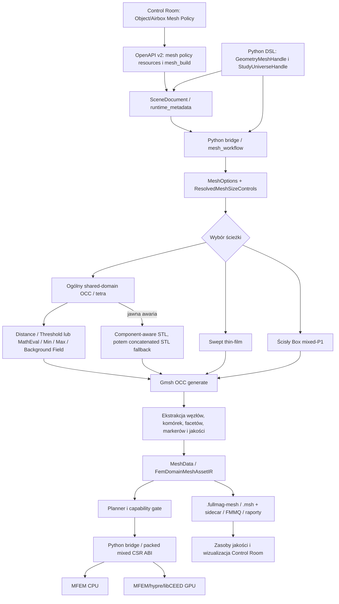

# Audyt przepływu tworzenia meshu FEM w FullMag

**Data:** 2026-08-27
**Audytowany revision:** `5ac37c7a8c4715cff7fdf197caede15f94665d9e`
**Zakres:** Python DSL, Control Room, OpenAPI v2, `ProblemIR`, planowanie, generator Gmsh/OCC, formaty wymiany, backend FEM CPU/GPU, jakość, diagnostyka, deterministyczność, artefakty i testy.
**Stan środowiska:** Gmsh `4.15.2`, meshio `5.3.5` w `.fullmag/local/python`; deklarowany zakres pakietu to Gmsh `>=4.12,<5` i meshio `>=5.3,<6`.

## 1. Werdykt wykonawczy

Przepływ meshu nie jest pustą fasadą. FullMag ma działające, dość rygorystyczne fundamenty: jeden wspólny model OCC dla domeny ferromagnetyk–airbox, konformalną fragmentację, jawne grupy fizyczne, semantyczny marker airboxa `0`, bezstratny transport topologii mieszanej, ścisłą walidację orientacji i zdegenerowania elementów oraz kwalifikowany wariant `Box + prism6 + airbox(tet4/pyramid5)`. Generator ogólny ma także rzeczywisty stos pól Gmsh, w tym `Distance`, `Threshold` lub `MathEval`, `Min`, `Max` i `Background Field`, oraz osobne warstwy sterowania dla wnętrza obiektu, interfejsu, przejścia, krawędzi/narożników i airboxa.

Najważniejszy problem nie polega więc na całkowitym braku tych mechanizmów, lecz na tym, że nie tworzą one jeszcze jednego, typowanego i egzekwowanego kontraktu produkcyjnego od UI/Python API do artefaktu i backendu. W szczególności:

1. `maximum_element_growth_rate` jest prezentowany publicznie jako współczynnik wzrostu sąsiednich elementów, ale generator przekłada go na `Mesh.SmoothRatio`; według dokumentacji Gmsh parametr ten dotyczy BAMG, a produkcyjna ścieżka 3D nie mierzy ani nie odrzuca naruszeń sąsiedniej gradacji. To jest luka krytyczna.
2. Zwykły mesh tetraedryczny przechodzi ścisłą kontrolę orientacji/Jacobianu, lecz nie ma produkcyjnej bramki progowej dla rozkładu jakości, aspect ratio, skewness, lokalnej gradacji i najgorszych elementów. Wyjątkiem jest węższy kontrakt mixed-P1.
3. Niektóre parametry są akceptowane na wejściu, ale nie są skutecznie konsumowane. Najczystszy przykład to `sweep_direction`: DSL i dokument sceny zachowują wartość, lecz `_mesh_options_from_runtime_metadata()` jej nie przenosi, a generator wybiera oś automatycznie.
4. Walidacja w Control Room/API jest słabsza niż w Python DSL. Otwarte mapy JSON i łagodne konwersje mogą zamienić błędną wartość na brak wartości, po czym generator użyje domyślnej polityki bez jednoznacznego odrzucenia żądania.
5. Bieżąca bramka `just verify-fem-meshing-production` nie ma dostępnego manifestu dowodowego i nie generuje w jednym samodzielnym przebiegu pełnego dowodu managed CPU/GPU oraz browser/UI. Na tym revision pełna kwalifikacja produkcyjna jest `BLOCKED`.

Ocena ogólna: **architektura generowania jest funkcjonalna i w wielu miejscach dobrze zabezpieczona, ale kontrakt polityki rozmiaru, jakość produkcyjna, walidacja wejścia i dowód kwalifikacyjny pozostają niekompletne.** Nie należy traktować dostępności meshera jako równoważnej gotowości produkcyjnej wszystkich wariantów topologii.

## 2. Metoda i znaczenie statusów

Audyt obejmował statyczne prześledzenie ścieżek wywołań, porównanie dokumentacji naukowej z kodem, odczyt testów kontraktowych, uruchomienie ukierunkowanego zestawu testów Gmsh/importu/persistencji oraz sprawdzenie bramek `justfile`. Nie wykonano pełnego managed-runtime CPU/GPU ani testu przeglądarkowego.

Statusy w raporcie:

| Status | Znaczenie |
|---|---|
| `CONFIRMED` | Stan potwierdzony aktualnym kodem, testem lub artefaktem. |
| `PARTIALLY CONFIRMED` | Mechanizm istnieje, ale ma ograniczony zakres albo niepełny dowód. |
| `NOT VERIFIED` | Brak wystarczającego dowodu bieżącego runtime. |
| `BLOCKED` | Wymagana bramka nie może obecnie zakończyć się pozytywnie z powodu konkretnego brakującego warunku. |

## 3. Mapa przepływu end-to-end



### 3.1 Własność kontraktu

| Warstwa | Obecny nośnik | Ocena |
|---|---|---|
| Python authoring | `packages/fullmag-py/src/fullmag/world.py` | Najpełniejsza walidacja jednostek i ograniczeń. |
| UI authoring | `apps/control-room/src/modules/inspector/panels/ObjectMeshPolicyPanelModel.ts`, `airbox/airboxMeshPolicyDraft.ts` | Typowany panel na powierzchni, ale nadal otwarta mapa polityki i słabsza walidacja. |
| API | `crates/fullmag-api/src/router_v2/handlers/meshing/mesh.rs` | Resource-first; zapisuje dokument sceny i uruchamia komendę, lecz nie ustanawia kompletnego schematu polityki meshu. |
| Authoring/IR | `crates/fullmag-authoring/src/builder.rs`, `crates/fullmag-ir/src/mesh_assets.rs` | `SweptMeshHintsIR` istnieje, ale wejściowa intencja meshowania nadal w dużej części płynie przez surowe `runtime_metadata`. |
| Generator | `packages/fullmag-py/src/fullmag/meshing/_gmsh_types.py`, `_size_field_plan.py`, `_gmsh_fields.py` | Faktyczne źródło wykonawczej semantyki rozmiaru. |
| Wynik | `MeshData`, `FemDomainMeshAssetIR`, mixed topology certificate | Wynikowa topologia jest znacznie bardziej rygorystycznie typowana niż wejściowa polityka. |

Wniosek: **kontrakt wyniku jest dojrzalszy niż kontrakt żądania**. To główna przyczyna rozjazdów UI/Python/generator.

## 4. Macierz najważniejszych hipotez zlecenia

| Hipoteza | Status | Werdykt |
|---|---|---|
| Brak jednego jawnego modelu polityki rozmiaru | `CONFIRMED` | Są typy lokalne i wiele pól, ale nie ma jednego kanonicznego, typowanego kontraktu trzech stref, obowiązującego identycznie w UI, Pythonie, IR i generatorze. |
| Brak rozdzielenia ferromagnetyka, interfejsu i dalekiego airboxa | `PARTIALLY CONFIRMED` | Generator OCC rozdziela te strefy; luka dotyczy publicznego modelu i jednolitości wszystkich tras/fallbacków. |
| Brak łańcucha `Distance → Threshold/MathEval → Min → Background Field` | `CONFIRMED` jako mechanizm; hipoteza braku obalona | Łańcuch istnieje. Dodatkowo dolne ograniczenie jest składane przez `Max`, a konkurencyjne źródła rozmiaru są wyłączane przy aktywnych polach. |
| Brak jednoznacznego maksymalnego wzrostu sąsiadów | `CONFIRMED` | Brak pomiaru par sąsiednich elementów i bramki; `Mesh.SmoothRatio` nie stanowi takiego dowodu dla ścieżki 3D. |
| Niewystarczające zagęszczanie krawędzi thin-film | `PARTIALLY CONFIRMED` | Dla testowanego Box/OCC istnieją edge/corner plumes i testy. Nie ma globalnej gwarancji dla wszystkich geometrii, fallbacków i najgorszych lokalnych relacji. |
| Ekstrudowany mesh jest mylony ze strukturalnym | `CONFIRMED` jako ryzyko semantyczne | Ścisły Box gwarantuje regularność normalną i typ komórki, nie strukturalną triangulację w płaszczyźnie. Ogólna ekstrudacja sama jej nie zapewnia. |
| Możliwe tetra zamiast pryzmatów | `PARTIALLY CONFIRMED` | Ścisła trasa Box odrzuca brak `prism6`; starsza/ogólna trasa cylindra jawnie dzieli elementy na tetra, a ArchWaveguide kończy jako free tetra. Nazwa/intencja nie zawsze oznacza pryzmat w wyniku. |
| Utrata tagów po OCC boolean | `PARTIALLY CONFIRMED` | Top-level shared-domain `fragment` używa mapy wyników i zachowuje semantykę. Wewnętrzne operandy zagnieżdżonego CSG nie mają osobnej trwałej tożsamości materiałowej. |
| Niepotwierdzona zgodność interfejsu FM–airbox | `PARTIALLY CONFIRMED` | Generator OCC i testy potwierdzają konformalność. Native ABI ufa roli facetu i nie weryfikuje ponownie różności markerów właścicieli dla ręcznie zbudowanego IR. |
| Brak bramki Jacobian/volume/aspect/skew/degenerate | `CONFIRMED` z zastrzeżeniem | Dodatni i skalozależny Jacobian/degeneracja są sprawdzane. Brakuje pełnej bramki progowej i aspekt/skew dla zwykłych meshów. Mixed-P1 ma węższy certyfikat. |
| Brak kontroli regionów przy eksporcie/importcie | `PARTIALLY CONFIRMED` | Natywny format i `.msh` z sidecarem są rygorystyczne. Samodzielny zewnętrzny `.msh` wymaga jawnego `region_map` i jednostki; bez tego semantyka nie jest rekonstruowana automatycznie. |
| Parametry obecne w UI/API, lecz niekonsumowane | `CONFIRMED` | `sweep_direction` ginie przed `MeshOptions`; błędne tekstowe rozmiary mogą zostać zredukowane do `None` i zastąpione domyślnymi. |
| Brak obserwowalności rozmiaru/jakości/gradacji | `CONFIRMED` dla mixed i produkcyjnej bramki | Tetra ma statystyki i FMMQ, mixed ma liczniki/certyfikat, ale brak pełnych histogramów per region/family, maksymalnej sąsiedniej gradacji i identyfikacji najgorszych elementów. |

## 5. Topologie i ścieżki generowania

| Żądanie / geometria | Faktyczna ścieżka | Wynik | Gwarancja | Ograniczenie |
|---|---|---|---|---|
| Ogólny FEM/OCC | `generate_shared_domain_mesh_via_occ()` | Zwykle `tet4` + `tri3` | Konformalna wspólna domena, regiony i fasety. | Brak pełnej produkcyjnej bramki jakości. |
| `thin_film_tetrahedral` | Trasa free tetra z profilem cienkiej warstwy | `tet4` | Zwiększone sterowanie przez grubość/refinement. | Nie gwarantuje równych płaszczyzn warstw ani pryzmatów. |
| `swept_prism`, `Box`, bez airboxa | Ścisła trasa swept | `prism6` + fasety | Dokładna liczba warstw w osi normalnej; kontrola typu elementu. | Siatka bazowej powierzchni pozostaje nieustrukturyzowaną triangulacją. |
| `swept_prism`, `Box`, airbox | Ścisły shared-domain mixed-P1 | FM `prism6`; air `pyramid5`/`tet4`; interfejs `tri3`/`quad4` | Jeden konformalny interfejs, certyfikat topologii, stały Gmsh `4.15.2`, jeden efektywny wątek. | Wąski kontrakt: Box, P1, 1–3 warstwy, automatyczna oś, ograniczona rodzina airboxa. |
| Swept cylinder | `generate_swept_cylinder_mesh()` | Wynik dzielony do tetra | Istnieje ścieżka geometryczna ekstrudowania. | Semantycznie nie jest produkcyjnym pryzmatem; nazewnictwo/provenance może mylić. |
| ArchWaveguide layered | STL + free tetra | `tet4` | Umożliwia złożoną geometrię. | Nie daje regularnej warstwy pryzmatycznej. |
| Import mieszany | meshio / natywny artefakt | `tet4`, `prism6`, `pyramid5`, `hex8`; `tri3`, `quad4` | Pełne rodziny są zachowywane w CSR. | Importowalność `hex8` nie oznacza kwalifikacji solvera w każdej ścieżce. |

### 5.1 Thin-film: co jest rzeczywiście regularne

W ścisłej trasie Box regularność dotyczy kierunku normalnego: żądana liczba warstw jest sprawdzana, pozycje płaszczyzn są przewidywalne, a komórki ferromagnetyka muszą być `prism6`. Nie ma jednak kontraktu strukturalnej siatki 2D w płaszczyźnie filmu. Gmsh trianguluje powierzchnię bazową, a ekstrudowanie tej triangulacji tworzy warstwowe pryzmaty. To jest mesh warstwowy, ale nie automatycznie strukturalny.

W `thin_film_tetrahedral` warstwowość jest intencją sterującą zagęszczeniem, a nie gwarancją komórek lub równych płaszczyzn. Raportowanie musi rozdzielać:

- `layered sizing intent`,
- `exact normal layer count`,
- `prismatic cell family`,
- `structured in-plane topology`.

Obecnie te pojęcia nie są dość jednoznacznie rozdzielone na wszystkich powierzchniach produktu.

### 5.2 Pryzmaty, rekombinacja i walidacja

Sama opcja ekstrudowania z `recombine` nie wystarcza jako dowód. Wartościowym zabezpieczeniem jest dopiero ekstrakcja typów elementów i odrzucenie wyniku niezgodnego z kontraktem. Ścisła trasa mixed-P1 robi to prawidłowo: kontroluje wersję Gmsh, rząd P1, liczbę warstw, typ `prism6` w filmie i dozwolone typy w airboxie. Nie wolno rozszerzać deklaracji „prism supported” na cylinder, ArchWaveguide ani tryb tetraedryczny bez analogicznego certyfikatu.

## 6. OCC, fragmentacja i zgodność interfejsów

### 6.1 Wspólna domena

`packages/fullmag-py/src/fullmag/meshing/_gmsh_occ.py::generate_shared_domain_mesh_via_occ` buduje obiekty i regiony, wykonuje jedno wspólne `occ.fragment`, synchronizuje model, a następnie korzysta z mapy wynikowej Gmsh, aby przypisać wynikowe objętości do komponentów i regionów. Taki model jest właściwy: fragmentacja tworzy zgodne interfejsy zamiast dwóch niezależnych, geometrycznie pokrywających się siatek.

Potwierdzone własności:

- brak eksportu wewnętrznego interfejsu jako zewnętrznej granicy;
- odrębne markery domen dla komponentów i jawnych regionów;
- airbox jako osobna objętość wspólnego modelu;
- rozpoznawanie `material_interface` na podstawie dwóch właścicieli o różnych markerach;
- kontrola duplikatów i niezgodnych powierzchni w mixed certificate.

### 6.2 Operacje boolean i tożsamość regionu

Dla top-level komponentów oraz jawnych regionów mapowanie po końcowym `fragment` jest zachowywane. Natomiast `_add_geometry_to_occ()` wykonuje zagnieżdżone `cut`, `fuse` i `intersect` jako konstrukcję jednej geometrii logicznej. Operandy wewnętrzne nie zachowują odrębnych identyfikatorów materiałowych. Nie jest to błąd, jeśli CSG definiuje jeden obiekt; staje się błędem modelowania, jeżeli użytkownik oczekuje, że nazwana część składowa pozostanie osobnym materiałem. Taki przypadek musi być modelowany jako jawny region/komponent przed fragmentacją.

### 6.3 Luka na granicy natywnej

Pythonowa ekstrakcja klasyfikuje `material_interface`, gdy facet ma dwóch właścicieli o różnych markerach. Natywne `collect_boundaries` sprawdza przede wszystkim liczbę właścicieli. Ogólna walidacja `MeshIR` nie rekonstruuje niezależnie warunku różności markerów dla każdej ręcznie dostarczonej roli. Dane wygenerowane przez standardowy pipeline są poprawne, ale ręcznie zbudowany IR lub bezpośredni ABI może wprowadzić semantycznie fałszywy interfejs. To powinno być odrzucane przed wejściem do MFEM.

### 6.4 Degradacja po awarii OCC

`asset_pipeline.py::_realize_fem_domain_mesh_asset_from_components_impl` ma jawny łańcuch awaryjny: po błędzie conformal OCC próbuje component-aware STL, a następnie concatenated STL. Raport zapisuje przyczyny, m.in. `conformal_occ_failed` i `component_aware_import_failed`, oraz oznacza build jako zdegradowany. Dla jawnych conformal object regions fallback jest blokowany, ponieważ nie mógłby zachować ich kontraktu.

Mechanizm nie jest cichym fallbackiem, ale wynik nie jest równoważny trasie OCC. Konsument musi kwalifikować `build_mode`, `degraded` i `fallbacks_triggered`; sam status „mesh zbudowany” nie wystarcza. Fallback STL nie może dziedziczyć twierdzeń o konformalnym interfejsie, pełnym remapie regionów ani takim samym edge/corner refinement bez osobnego dowodu.

## 7. Physical Groups, markery i formaty wymiany

### 7.1 Model markerów

W modelu Gmsh grupy fizyczne mają dodatnie tagi per wymiar. FullMag używa natomiast semantycznego markera `0` dla airboxa. Eksport rozwiązuje to przez dodatni tag Gmsh i jawne tłumaczenie w metadanych/sidecarze. Typowy układ jest następujący:

| Zakres | Semantyka FullMag |
|---|---|
| Komponenty magnetyczne | Dodatnie, unikalne markery domen. |
| Jawne regiony wewnątrz komponentów | Dodatnie markery po zakresie komponentów. |
| Airbox | Semantyczny marker domeny `0`, dodatnio kodowany w `.msh`. |
| Interfejs materiałowy | Rola `material_interface`, domyślny marker facetu `10`. |
| Granica zewnętrzna | Rola `exterior`, zwykle marker `99`; w mixed musi być różna od interfejsu. |

`element_marker` nie jest samodzielnie identyfikatorem materiału. `FemRegionMaterialIR` wiąże marker domeny z `object_id` i materiałem. Runner normalizuje maskę natywną do kontraktu air `0` / magnetic `!=0`. Należy utrzymać ten rozdział: marker jest identyfikatorem regionu topologicznego, a materiał jest jawnie przypisaną własnością regionu.

### 7.2 Eksport i import

Eksport `.msh` nie jest realizowany przez meshio. FullMag ma własny zapis Gmsh 4.1 ASCII, który zachowuje rodziny elementów, porządek globalny, Physical Groups i mapowanie markera `0`; sidecar zawiera translacje markerów, jednostkę, partycje i digest. meshio służy przede wszystkim do importu.

Ocena:

- natywny `.fullmag-mesh`: silny kontrakt, atomowy zapis, sumy SHA-256 członków, fingerprint authoringu i topologii, ścisłe pokrycie mapowania;
- `.msh` z sidecarem FullMag: semantyka regionów jest jawna i testowana;
- zewnętrzny `.msh` bez sidecaru: import musi otrzymać `coordinate_unit` i `region_map`; nie powinien zgadywać materiału z nazwy lub numeru;
- standardowe bloki niższego wymiaru są rozdzielane od komórek domeny, a wieloblokowe rodziny są scalane z zachowaniem markerów.

## 8. Polityka rozmiaru i gradacja Gmsh

### 8.1 Faktyczny stos pól

`packages/fullmag-py/src/fullmag/meshing/_size_field_plan.py::_build_field_stack` tworzy osobne wkłady dla:

1. wnętrza obiektów i regionów,
2. interfejsu materiałowego,
3. strefy przejściowej,
4. krawędzi i narożników thin-film,
5. ręcznych hotspotów,
6. polityk regionalnych,
7. wewnętrznej i zewnętrznej części airboxa.

`_add_airbox_grading_field()` używa `Distance`, następnie `MathEval` dla gradacji geometrycznej albo `Threshold` dla liniowej, ogranicza pole do domeny airboxa i składa limity. `_configure_mesh_size_fields()` łączy górne ograniczenia przez `Min`, dolne przez `Max`, ustawia wynik jako `Background Field` i przy aktywnym polu wyłącza konkurencyjne `Mesh.MeshSizeFromPoints`, `Mesh.MeshSizeFromCurvature` i `Mesh.MeshSizeExtendFromBoundary`.

To jest poprawna baza zgodna z modelem Gmsh. Hipoteza, że FullMag nie ma kontrolowanego łańcucha pól, jest nieaktualna dla ogólnej ścieżki OCC.

### 8.2 Czego nadal brakuje

Brakuje jednego publicznego obiektu polityki, który jawnie i w SI definiowałby co najmniej:

```text
ferromagnet:
  h_min, h_max
interface:
  h_min, h_max, thickness_or_distance, edge_weight, corner_weight
airbox:
  near_h, far_h, transition_distance, law, target_max_neighbor_ratio
quality:
  min_scaled_jacobian, max_aspect_ratio, max_skewness, reject_degenerate
```

Obecne `MeshOptions`, `MeshSizeControls` i `ResolvedMeshSizeControls` są użyteczne, ale powstają dopiero po przejściu przez kilka luźniejszych formatów. Poszczególne pola są rozproszone między universe policy, object policy, runtime metadata i wartości domyślne. Nie istnieje jedno miejsce, które może udowodnić: „to dokładnie ta polityka została zaakceptowana, znormalizowana, wykonana i zmierzona”.

### 8.3 Współczynnik wzrostu

`maximum_element_growth_rate` jest walidowany w Python DSL i przenoszony do `MeshOptions.growth_rate`, po czym `_apply_mesh_options()` ustawia `Mesh.SmoothRatio`. Problem jest dwojaki:

- oficjalna dokumentacja Gmsh opisuje `Mesh.SmoothRatio` jako stosunek rozmiarów węzłów tej samej krawędzi używany w BAMG, a nie jako twardą granicę dla sąsiednich tetra/pryzmatów w 3D;
- FullMag nie oblicza po wygenerowaniu `max(h_i/h_j)` dla komórek współdzielących ścianę/krawędź i nie porównuje wyniku z żądaniem.

Testy airboxa potwierdzają zapełnienie pasm odległości i monotoniczność statystyk pasmowych, ale nie gwarantują najgorszej lokalnej pary sąsiadów. Publiczny opis „neighboring elements” jest więc silniejszy niż dowód wykonawczy.

### 8.4 Krawędzie i narożniki thin-film

Dla Box/OCC istnieją pola plumes dla krawędzi bocznych i narożników oraz testy sprawdzające rzeczywiste zagęszczenie blisko obwodu filmu. To obala tezę o całkowitym braku mechanizmu. Nie ma jednak:

- metryki rozdzielającej krawędź, narożnik, płaski interfejs i bulk w raporcie produkcyjnym;
- progu najgorszego elementu w każdej strefie;
- równego pokrycia dla fallbacków STL i wszystkich geometrii CSG;
- fizycznej bramki wiążącej gęstość z rozdzielczością ładunku magnetycznego, a nie tylko z odległością geometryczną.

## 9. Parametry, jednostki i walidacja

### 9.1 Python DSL

`packages/fullmag-py/src/fullmag/world.py` ma najsilniejszy kontrakt: liczby muszą być skończone, rozmiary dodatnie, padding nieujemny, relacje `h_min <= h_max` są kontrolowane, a współczynnik wzrostu ma ograniczony zakres. Wartości długości są kanonicznie prowadzone w SI.

### 9.2 Control Room i API

Control Room korzysta z generowanego transportu OpenAPI i zasobów v2; nie znaleziono bocznej, ręcznie zbudowanej ścieżki HTTP. Problemem jest model danych, nie transport:

- `airboxMeshPolicyDraft.ts` dopuszcza częściowe konfiguracje, wartości tekstowe i tryb niezamknięty pełnym enumem;
- w ścieżce draftu można utworzyć niespójne `h_min/h_max` lub ujemny padding przed późniejszą interpretacją;
- API przechowuje polityki jako otwarte mapy `BTreeMap<String, Value>` i nie wykonuje wszystkich walidacji fizycznych DSL;
- `_coerce_positive_float()` zwraca `None` dla wartości takich jak `"20nm"`, śmieciowego tekstu lub wartości niedodatniej; downstream może wtedy użyć wartości domyślnej zamiast odrzucić żądanie.

To jest groźne, bo interfejs może pokazać parametr jako zapisany, chociaż generator go nie wykonał.

### 9.3 Parametr niekonsumowany: `sweep_direction`

`GeometryMeshHandle.swept()` zapisuje `sweep_direction`; Rust authoring oraz dokument sceny potrafią tę wartość przechować i zwalidować. Jednak `_mesh_options_from_runtime_metadata()` nie odczytuje pola, a `MeshOptions` nie ma odpowiadającego mu atrybutu. `generate_swept_mesh()` ponownie klasyfikuje cienką oś automatycznie. W rezultacie jawna wartość `x`, `y` lub `z` nie steruje generatorem zgodnie z oczekiwaniem. Ścisła trasa mixed wymaga `auto`, co ogranicza szkody w tej trasie, ale nie naprawia kontraktu publicznego.

### 9.4 ProblemIR

`SweptMeshHintsIR` istnieje w `crates/fullmag-ir/src/mesh_assets.rs`, ale nie jest kanonicznym obiektem wejściowym używanym przez cały planner i generator. Planner nadal odczytuje `problem_meta.runtime_metadata["mesh_workflow"]`, a silna walidacja mixed pojawia się głównie po materializacji meshu i certyfikatu. Właściwy kierunek to typowana intencja w `ProblemIR`, a nie rozszerzanie kolejnych luźnych map.

## 10. Jakość elementów

### 10.1 Co jest kontrolowane

`MeshData.validate_strict()` sprawdza między innymi:

- skończoność współrzędnych;
- prawidłowe indeksy i rodziny elementów;
- dodatnią orientację/Jacobian wszystkich wspieranych rodzin 3D;
- degenerację względem skali geometrii;
- spójność markerów, facetów i właścicieli;
- dokładne ograniczenia mieszanej topologii, gdy jest certyfikowana.

Mixed-P1 dodatkowo utrwala liczby rodzin, objętości per marker, minimalny Jacobian i próg 5. percentyla scaled Jacobian (`>= 0.1`) oraz fingerprint topologii. To jest realna bramka, ale tylko dla wąskiej kwalifikowanej trasy.

### 10.2 Czego nie kontroluje zwykła bramka produkcyjna

`derive_mesh_quality_gates()` w API, gdy nie ma bogatszych danych, sprowadza ocenę głównie do niepustej siatki, pokrycia markerów i obecności granicy `99`. Nie ma uniwersalnych progów dla:

- minimalnego scaled Jacobian/SICN w całym meshu i per region/family;
- rozkładu i wartości najgorszych objętości;
- aspect ratio;
- skewness;
- maksymalnej gradacji par sąsiadów;
- osobnych kryteriów FM, interfejsu i airboxa;
- listy najgorszych elementów z lokalizacją, markerem i rodziną.

Słowo `aspect_ratio` występujące w logice sweepability opisuje geometrię wejściową, nie pełną metrykę jakości elementu. `skewness` nie jest obecnie materializowanym kanałem backendowym.

### 10.3 Statystyki i FMMQ

`MeshData.statistics_ir()` zwraca bogatsze statystyki tylko dla jednorodnego `tet4/tri3`; dla topologii mieszanej zwraca `None`. Mixed certificate ma liczniki i minima, ale nie pełne rozkłady per region/family ani histogramy rozmiaru i jakości.

FMMQ v1 przenosi per-elementowe kanały jakości dla starszego wariantu tetra. Sam plik zawiera magic/version/count/flags i tablice, ale nie własny fingerprint topologii. ETag zasobu opiera się na rewizji, ścieżce, rozmiarze i liczbie elementów. Metadane sesji mogą przenosić fingerprint, lecz payload nie jest kryptograficznie związany z konkretnym porządkiem komórek. To pozostawia ryzyko odczytu poprawnego rozmiarowo, ale starego artefaktu.

W `_compute_swept_quality()` aktualny kod nie udaje, że proxy topologiczne jest SICN: kanał SICN pozostaje pusty/zerowy, a źródło ma nazwę `swept_topology_proxy`. To jest poprawne zachowanie fail-honest.

## 11. Backend FEM i zachowanie materiałów

### 11.1 Transport topologii

Topologia mieszana jest przenoszona bez spłaszczenia przez:

- Python `MeshData` i packed CSR;
- `FemDomainMeshAssetIR`;
- Python bridge/ABI;
- runner;
- budowę siatki MFEM przez `AddTet`, `AddWedge`, `AddPyramid` i `AddHex`.

Fasety `tri3/quad4`, role oraz markery są zachowywane. Import `hex8` jest strukturalnie obsługiwany, ale kwalifikowana trasa mixed-P1 jest węższa: magnetyk `prism6`, airbox `pyramid5/tet4`, interfejs i exterior `tri3/quad4`.

### 11.2 Materiały i airbox

Backend nie powinien interpretować samego numeru regionu jako materiału. `FemRegionMaterialIR` dostarcza jawne powiązanie marker → obiekt/materiał. Na natywnej granicy maska demag rozróżnia air `0` i magnetyk `!=0`. Brak wymaganej domeny airboxa dla konfiguracji demag jest odrzucany; nie znaleziono cichego zastępowania jej domeną magnetyczną.

### 11.3 CPU/GPU

Źródłowy kontrakt mixed istnieje po obu stronach i korzysta ze wspólnego neutralnego opisu siatki. Nie uruchomiono jednak w tym audycie managed recipe `just verify-fem-mixed-prism-airbox-runtime`; dlatego faktyczna kwalifikacja bieżącego revision na CPU i GPU pozostaje `NOT VERIFIED`. Testy źródłowe/ABI nie są dowodem produkcyjnego wykonania MFEM/CUDA.

## 12. Deterministyczność, cache i diagnostyka

### 12.1 Deterministyczność

Ścisła trasa mixed wymusza:

- Gmsh `4.15.2`;
- jeden efektywny wątek niezależnie od środowiska;
- stabilne sortowanie i globalne porządki;
- fingerprint topologii;
- test powtórnego generowania.

Ogólna trasa OCC ustawia seed/reproducibility, ale dopuszcza szerszy zakres wersji Gmsh i nie zawsze wymusza jeden wątek. Nie ma macierzy dowodowej pokazującej identyczny fingerprint dla wszystkich geometrii, wersji pakietu i platform. Ocena deterministyczności całego meshera to `PARTIALLY CONFIRMED`.

### 12.2 Cache

`.fullmag-mesh` ma kompletne fingerprinty i nadaje się do bezpiecznego ponownego użycia, ale orchestrator remesh nie implementuje z tego automatycznego cache buildów. `FULLMAG_FEM_MESH_CACHE_DIR` jest katalogiem roboczym/stagingiem artefaktów, nie cache z kluczem obejmującym:

- znormalizowaną geometrię i regiony;
- pełną politykę rozmiaru;
- wersję Gmsh i algorytm;
- jednostkę i transformacje;
- oczekiwaną topologię/family contract.

Brakuje również testów invalidacji po zmianie jednego z tych składników.

### 12.3 Diagnostyka

Pipeline preparation dobrze rozróżnia m.in. etap Gmsh i `extracting mesh data`; długi etap ekstrakcji nie powinien być diagnozowany jako zawieszenie tylko na podstawie stałej rewizji. Raporty meshu, capability diagnostics, manifest, quality resources i FMMQ dają szeroką powierzchnię obserwacji.

Nadal brakuje jednego strukturalnego rekordu awarii jakości zawierającego:

- `metric`, `value`, `threshold`;
- `scope` (`ferromagnet`, `interface`, `airbox`);
- `region_marker`, `element_family`, `element_ordinal`;
- położenie najgorszego elementu;
- fingerprint topologii i polityki wejściowej;
- rozkład/histogram oraz maksymalną sąsiednią gradację.

Obecne błędy jakości często kończą jako tekstowy `detail`, co utrudnia UI, regresje i porównywanie przebiegów.

## 13. Pokrycie testowe i wykonane dowody

### 13.1 Ukierunkowany przebieg audytowy

Uruchomiono:

```text
PYTHONPATH=packages/fullmag-py/src .fullmag/local/python/bin/python -m pytest -q -p no:cacheprovider \
  packages/fullmag-py/tests/test_mixed_element_meshing.py \
  packages/fullmag-py/tests/test_meshing.py \
  packages/fullmag-py/tests/test_mesh_persistence.py \
  -k '<17 testów OCC, mixed, regionów, gradacji, eksportu i deterministyczności>'
```

Wynik: **17 passed, 495 deselected, 42.43 s**.

Zakres dowodu obejmował:

- wymuszenie exact requested layer i dozwolonych rodzin mixed-P1;
- zachowanie ról facetów po skalowaniu SI;
- deterministyczny fingerprint strict mixed;
- wymuszenie jednego wątku;
- zapełnienie i monotoniczność pasm gradacji airboxa;
- edge/corner refinement;
- osobne markery komponentów/regionów;
- brak eksportu interfejsu jako granicy zewnętrznej;
- zachowanie grup semantycznych i markera air `0` w round-trip;
- pełne rodziny liniowe w interchange.

Dodatkowo uruchomiono kontrakty walidacji intencji warstwowej i ograniczenia liczby warstw strict mixed. Wynik: **3 passed, 485 deselected, 8 subtests passed** w dwóch ukierunkowanych przebiegach.

### 13.2 Pokrycie istniejące, lecz niewystarczające

Repo ma rozbudowane testy jednostkowe i kontraktowe dla Gmsh, importu, mixed IR, ABI, planner gate, API oraz UI. Brakuje testów akceptacyjnych, które odrzucają:

1. zwykły mesh tetra z SICN/scaled Jacobian poniżej progu produkcyjnego, ale bez degeneracji topologicznej;
2. przekroczenie maksymalnego stosunku rozmiaru faktycznych sąsiednich komórek;
3. przekroczenie aspect ratio i skewness per region/family;
4. FMMQ z poprawną długością, ale obcym fingerprintem topologii;
5. błędne tekstowe wartości UI/API, które obecnie zamieniają się w domyślne;
6. jawne `sweep_direction != auto` docierające do generatora;
7. cache hit/miss oraz invalidację po zmianie geometrii, jednostki, regionu, wersji Gmsh i polityki;
8. odrzucenie `material_interface` między komórkami o tym samym markerze na granicy natywnej;
9. pełne histogramy mixed per strefa i rodzina;
10. produkcyjny managed CPU/GPU + browser proof generowany w jednym przebiegu.

### 13.3 Stan bramki produkcyjnej

Walidator domyślnego manifestu zwrócił:

```text
evidence manifest is missing: /home/kkingstoun/git/fullmag/fullmag/.fullmag/reports/fem-meshing-production/evidence.v1.json
```

`just verify-fem-meshing-production` weryfikuje istniejący manifest, uruchamia testy Python/API/frontend, ale nie materializuje samodzielnie całego managed runtime i browser proof. Z tego powodu aktualny stan bramki to `BLOCKED`, a nie „passed”.

## 14. Rejestr ustaleń

| ID | Priorytet | Status | Ustalenie i przyczyna źródłowa | Dokładny obszar naprawy | Wymagany test / gate |
|---|---:|---|---|---|---|
| FM-MESH-001 | P0 | `CONFIRMED` | Brak twardej kontroli maksymalnej gradacji sąsiadów; publiczna semantyka opiera się na `Mesh.SmoothRatio`, które nie dowodzi ograniczenia 3D. | `world.py`; `_gmsh_types.py::resolve_mesh_size_controls`; `_gmsh_fields.py::_apply_mesh_options`; nowa analiza adjacency w `MeshData`. | Zbudować graf sąsiedztwa komórek, mierzyć rozmiar reprezentatywny i odrzucać `max_ratio > target + tolerance` per strefa/family. |
| FM-MESH-002 | P0 | `CONFIRMED` | Zwykła produkcyjna bramka jakości jest słabsza od walidacji topologicznej i od kontraktu mixed. | `_gmsh_types.py::validate_strict/statistics_ir`; `mesh.rs::derive_mesh_quality_gates`; `docs/physics/0105-fem-meshing-production-acceptance.md`. | Negatywne testy progów Jacobian/SICN/volume/aspect/skew oraz managed acceptance receipt. |
| FM-MESH-003 | P0 | `CONFIRMED` | `sweep_direction` jest przyjmowany, lecz nie dociera do generatora. | `world.py::GeometryMeshHandle.swept`; `_size_field_plan.py::_mesh_options_from_runtime_metadata`; `_gmsh_types.py::MeshOptions`; `generate_swept_mesh`. | E2E x/y/z: authoring → `ProblemIR` → generator → certificate requested/resolved axis. |
| FM-MESH-004 | P0 | `CONFIRMED` | UI/API i Python DSL mają różne zasady walidacji; łagodna konwersja może uruchomić default zamiast błędu. | `airboxMeshPolicyDraft.ts`; `ObjectMeshPolicyPanelModel.ts`; `builder.rs`; `mesh.rs`; `_mesh_targets.py`. | Wspólne przypadki kontraktowe: NaN/inf, `20nm`, zero, minus, `h_min > h_max`, ujemny padding, nieznany mode. |
| FM-MESH-005 | P0 | `BLOCKED` | Bramka produkcyjna nie ma bieżącego manifestu i nie jest samodzielnym generatorem dowodu runtime/browser. | `justfile::verify-fem-meshing-production`; `scripts/verify_fem_meshing_production.sh`; verifier/evidence schema. | Jedna recepta: build managed → CPU/GPU workload → artefakty → browser/API → walidacja podpisanego manifestu. |
| FM-MESH-006 | P1 | `CONFIRMED` | Brak jednego typowanego modelu wejściowej polityki rozmiaru i topologii. | `SweptMeshHintsIR`; nowe typy w `fullmag-ir`; authoring adapter; OpenAPI; Python lowering. | Round-trip UI ↔ OpenAPI ↔ `ProblemIR` ↔ Python bez surowego `runtime_metadata`. |
| FM-MESH-007 | P1 | `CONFIRMED` | Statystyki i histogramy nie obsługują pełnej topologii mixed per region/family. | `_gmsh_types.py::statistics_ir`; raport/manifest; quality resources; Inspector. | Golden mixed mesh z dokładnymi bucketami i licznikami dla prism/pyramid/tet oraz FM/interface/air. |
| FM-MESH-008 | P1 | `CONFIRMED` | Aspect ratio i skewness nie są produkcyjnymi metrykami elementów. | Warstwa obliczeń jakości Python/native; FMMQ v2; OpenAPI quality schemas. | Referencyjne elementy idealne i zdeformowane dla każdej rodziny liniowej. |
| FM-MESH-009 | P1 | `CONFIRMED` | FMMQ v1 nie wiąże payloadu z fingerprintem i kolejnością komórek. | `remesh_cli.py::_write_quality_data_artifact`; `meshQualityDataCodec.ts`; API ETag/metadata. | Odrzucić poprawny długościowo FMMQ o obcym fingerprint/order hash. |
| FM-MESH-010 | P1 | `CONFIRMED` | Brak wykonawczego cache meshera i testowanej invalidacji. | `remesh_cli.py`; persistence API; klucz policy+geometry+Gmsh. | Macierz hit/miss i atomowy cache przy równoległych buildach. |
| FM-MESH-011 | P1 | `PARTIALLY CONFIRMED` | Deterministyczność jest mocna w strict mixed, ale niekwalifikowana globalnie. | Ogólny OCC/Gmsh init; manifest wersji/wątków; testy wielokrotne/platformowe. | N powtórzeń dla Box/Cylinder/CSG/region/airbox na wspieranych platformach. |
| FM-MESH-012 | P1 | `CONFIRMED` | Natywna granica nie odtwarza warunku różności markerów dla `material_interface`. | `backends/fem` boundary collection; `MeshIR` validation; runner preflight. | Ręcznie zbudowany facet dwóch komórek tego samego markera musi zostać odrzucony. |
| FM-MESH-013 | P1 | `CONFIRMED` | UI nie oferuje pełnej typowanej parytetowości `thin_film_tetrahedral`; exact prism jest fail-closed do czasu kwalifikacji. | `ObjectMeshPolicyPanel.tsx/Model.ts`; capability matrix; OpenAPI enum. | UI round-trip dla tetra thin-film i warunkowe odblokowanie prism dopiero po receipt. |
| FM-MESH-014 | P1 | `PARTIALLY CONFIRMED` | Obserwowalność jest rozproszona między summary, manifest, scoped resources i fallbacki UI. | `derive_mesh_quality_gates`; scoped quality resources; Inspector models. | Jedno źródło zasobu jakości z rewizją i fingerprintem, bez frontendowego rekonstruowania semantyki. |
| FM-MESH-015 | P1 | `CONFIRMED` | Dokumentacja ma drift: opis liniowej gradacji i statusy mixed nie odpowiadają w pełni kodowi/capability. | `docs/physics/0101`, `0102`, `0104`, `0106`; capability matrix. | Doc/source contract check porównujący status, trasę i wymagany receipt. |
| FM-MESH-016 | P1 | `CONFIRMED` | Intencja swept/prism nie oznacza tej samej topologii dla Box, Cylinder i ArchWaveguide. | `_gmsh_swept.py`; dispatch/provenance; mesh build report. | Każda geometria deklaruje `requested`, `resolved`, rodziny wynikowe i przyczynę fallbacku; explicit prism nie może kończyć jako tet. |
| FM-MESH-017 | P2 | `CONFIRMED` | Awaria jakości nie ma jednolitego strukturalnego payloadu diagnostycznego. | preparation state, mesh build report, API error schema, Control Room. | Snapshot błędu z metric/value/threshold/scope/element/fingerprint. |
| FM-MESH-018 | P1 | `PARTIALLY CONFIRMED` | Fallback OCC → component-aware/concatenated STL jest jawny, lecz wynik ma słabsze gwarancje interfejsów, regionów i pól. | `asset_pipeline.py::_realize_fem_domain_mesh_asset_from_components_impl`; build report; capability gate. | Wymuszona awaria OCC musi dać `degraded=true`, dokładny `build_mode` i brak odziedziczonych twierdzeń OCC; regiony konformalne muszą pozostać fail-closed. |

## 15. Plan naprawczy w kolejności zależności

### Etap A — zamknąć kontrakt wejściowy

1. Opisać w `docs/physics/0100` i `0105` kanoniczny model `FemMeshPolicyIR`: strefy FM/interface/airbox, jednostki SI, prawo gradacji, docelowy maksymalny stosunek sąsiadów, topologia i kryteria jakości.
2. Dodać typy do `fullmag-ir`, wygenerować OpenAPI i transport frontendowy; zabronić luźnego `BTreeMap<String, Value>` dla pól kanonicznych.
3. Przenieść `sweep_direction` i istniejące `SweptMeshHintsIR` do rzeczywistego lowering/planner/generator contract.
4. Ujednolicić walidator Rust/Python/UI przez wspólne fixtures kontraktowe. Nieznane jednostki lub błędne wartości muszą kończyć się błędem przed Gmsh, nigdy defaultem.

**Gate A:** identyczny znormalizowany `FemMeshPolicyIR` oraz canonical Python export dla wejścia z DSL i UI.

### Etap B — egzekwować realizowaną gradację

1. Zachować istniejący stos `Distance → Threshold/MathEval → Min/Max → Background Field` jako realizację Gmsh.
2. Dodać post-mesh graf sąsiedztwa i obliczenie rozmiaru komórki dobrane per family.
3. Raportować `max`, p95/p99 i histogram ratio per FM/interface/airbox oraz pary przechodzące przez granice stref.
4. Odrzucać mesh przekraczający jawny target z udokumentowaną tolerancją; `Mesh.SmoothRatio` traktować tylko jako hint generatora.

**Gate B:** syntetyczny mesh z pojedynczym naruszeniem jest odrzucany i wskazuje obie komórki.

### Etap C — pełna jakość rodzin elementów

1. Zdefiniować matematycznie Jacobian/scaled Jacobian, volume, aspect ratio i skewness dla `tet4`, `prism6`, `pyramid5`, `hex8`.
2. Rozszerzyć statystyki na mixed i na scope/marker/family; przechowywać najgorsze ordinals i centroidy.
3. Wprowadzić FMMQ v2 z topology fingerprint, element-order hash, family offsets i kanałami per family.
4. Zastąpić fallback `derive_mesh_quality_gates` jednym autorytatywnym zasobem jakości.

**Gate C:** zwykłe i mixed meshe przechodzą tę samą klasę bramki; celowo zdeformowane komórki każdej rodziny są odrzucane.

### Etap D — uszczelnić topologię i regiony

1. W `MeshIR`/runnerze ponownie wyliczać, że `material_interface` ma dwóch właścicieli o różnych markerach.
2. Dla CSG dokumentować granicę: operand konstrukcyjny nie jest regionem; osobny materiał wymaga osobnego regionu/komponentu.
3. Dla każdej ścieżki swept raportować i egzekwować `requested_topology`, `resolved_topology`, `fallback_reason` i dokładne rodziny wynikowe.
4. Usunąć semantyczną możliwość, by jawne `swept_prism` kończyło jako tetra. Fallback wymaga zmiany resolved intent i widocznej zgody/polityki.

**Gate D:** region/tag/interface round-trip obejmuje fragment/cut/fuse/import oraz direct-ABI negative cases.

### Etap E — deterministyczność, cache i produkcyjny receipt

1. Utworzyć cache key z authoring fingerprint, policy fingerprint, Gmsh version/options, jednostki i oczekiwanego kontraktu topologii.
2. Dodać atomowy zapis, blokadę równoległą i kompletną macierz invalidacji.
3. Ustalić wspieraną wersję/wątki dla każdej kwalifikowanej trasy; fingerprintować wynik wielu powtórzeń.
4. Przebudować `verify-fem-meshing-production` jako samodzielną managed recipe: generowanie workloadów, CPU/GPU, artefakty, API/browser i walidacja manifestu.

**Gate E:** świeży checkout bez istniejącego `evidence.v1.json` generuje i waliduje kompletny receipt albo kończy się jednoznacznym błędem środowiskowym.

## 16. Kryteria akceptacji końcowej

Przepływ można nazwać produkcyjnie zamkniętym dopiero, gdy wszystkie poniższe warunki są spełnione:

- UI i Python tworzą identyczny, typowany `ProblemIR` meshu;
- żaden zaakceptowany parametr nie ginie i żaden błędny parametr nie uruchamia cichego defaultu;
- każdy explicit prism request daje `prism6` albo jest odrzucony;
- thin-film raportuje osobno regularność normalną i brak/obecność strukturalności w płaszczyźnie;
- interfejs FM–airbox jest konformalny i walidowany po obu stronach ABI;
- marker regionu, materiał i rola facetu pozostają rozdzielone oraz round-tripowane;
- wykonana gradacja, nie tylko hint Gmsh, spełnia limit sąsiedni;
- jakość jest liczona per family/region/strefa i obejmuje Jacobian, objętość, aspect ratio, skewness oraz degenerację;
- statystyki zawierają histogramy rozmiaru, jakości i gradacji oraz najgorsze elementy;
- cache ma fingerprint i testy invalidacji;
- deterministyczność jest potwierdzona dla każdej deklarowanej trasy;
- managed CPU/GPU i Control Room/API tworzą jeden bieżący, podpisany lub hashowany receipt;
- `just verify-fem-meshing-production` przechodzi na świeżym środowisku bez ręcznie przygotowanego manifestu.

## 17. Ograniczenia dowodu

1. Nie uruchomiono pełnego managed FEM CPU/GPU, więc wydajność, zgodność MFEM/CUDA oraz brak regresji runtime są `NOT VERIFIED`.
2. Nie wykonano browser/WebGL proof jakości i Inspectorów; oceniono kod, kontrakty i testy źródłowe.
3. Nie przeprowadzono dużej kampanii statystycznej na rzeczywistych geometriach CSG; ocena deterministyczności ogólnego OCC pozostaje częściowa.
4. Brak bieżącego `evidence.v1.json` blokuje produkcyjną kwalifikację na audytowanym revision.
5. Ukierunkowane 17 testów potwierdza wymienione kontrakty, ale nie zastępuje pełnej macierzy testów repozytorium.

## 18. Indeks źródeł

### Kod i kontrakty FullMag

- `packages/fullmag-py/src/fullmag/world.py` — publiczny DSL, walidacja i lowering polityk meshu.
- `packages/fullmag-py/src/fullmag/meshing/_gmsh_types.py` — `MeshOptions`, `MeshSizeControls`, `MeshData`, ścisła walidacja i statystyki.
- `packages/fullmag-py/src/fullmag/meshing/_size_field_plan.py` — plan pól oraz odczyt runtime metadata.
- `packages/fullmag-py/src/fullmag/meshing/_gmsh_fields.py` — aplikowanie opcji i składanie pól tła.
- `packages/fullmag-py/src/fullmag/meshing/_airbox_grading.py` — geometryczna/liniowa gradacja airboxa.
- `packages/fullmag-py/src/fullmag/meshing/_gmsh_occ.py` — model OCC, fragmentacja i Physical Groups.
- `packages/fullmag-py/src/fullmag/meshing/_gmsh_swept.py` — ekstrudowanie, trasy swept i jakość proxy.
- `packages/fullmag-py/src/fullmag/meshing/_gmsh_extraction.py` — ekstrakcja Gmsh/meshio, markery i role facetów.
- `packages/fullmag-py/src/fullmag/meshing/asset_pipeline.py` — materializacja shared-domain i jawny łańcuch fallbacków.
- `packages/fullmag-py/src/fullmag/meshing/persistence.py` — `.fullmag-mesh`, eksport/import `.msh`, sidecar, digesty i fingerprinty.
- `packages/fullmag-py/src/fullmag/meshing/remesh_cli.py` — materializacja raportów i FMMQ.
- `crates/fullmag-ir/src/mesh_assets.rs` — `FemDomainMeshAssetIR`, mixed certificate i `SweptMeshHintsIR`.
- `crates/fullmag-plan` — capability gate i walidacja przed backendem.
- `crates/fullmag-cli/src/python_bridge.rs` — transport Python/IR/ABI.
- `crates/fullmag-runner` i `backends/fem` — budowa natywnej siatki i mapowanie regionów/materials.
- `crates/fullmag-api/src/router_v2/handlers/meshing/mesh.rs` — zasoby, komendy i quality gates API.
- `apps/control-room/src/modules/inspector/panels` — authoring i obserwowalność meshu.
- `docs/physics/0100-mesh-and-region-discretization.md`.
- `docs/physics/0101-swept-mesh-through-thickness.md`.
- `docs/physics/0102-airbox-mesh-grading-geometric.md`.
- `docs/physics/0104-thin-film-shared-domain-meshing.md`.
- `docs/physics/0105-fem-meshing-production-acceptance.md`.
- `docs/physics/0106-fem-mixed-prism-pyramid-shared-domain.md`.

### Referencja zewnętrzna

- [Gmsh 4.15.2 Reference Manual](https://gmsh.info/doc/texinfo/gmsh.html) — semantyka Physical Groups, `occ.fragment` i `outDimTagsMap`, fields/background mesh size, ekstrudowanie/recombine oraz zakres `Mesh.SmoothRatio`.
