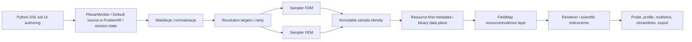
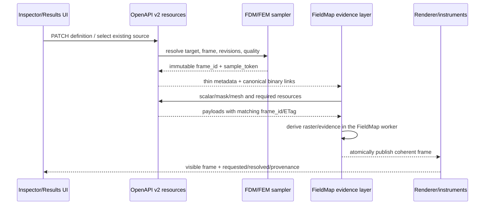

# Audyt postępu wizualizacji 2D Fullmag: FDM, FEM, PlanarMonitor, A-MuMax i próg jakości COMSOL

Data audytu: 2026-08-31  
Audytowana rewizja źródeł: e4f653cfaa4505b8659b1ad173b7aec2b67aaad5  
Gałąź: master  
Stan checkoutu: współdzielony dirty worktree; 125 wpisów porcelain w początkowym snapshotcie, 135–142 podczas reauditu; brak plików staged w sprawdzonym snapshotcie  
Charakter dokumentu: audyt źródłowy, kontraktowy, testowy i artefaktowy  
Stan dokumentu: wersja 0.7 po drugim odczycie kodu, czterech niezależnych reaudytach, świeżej próbie kanonicznego smoke oraz zatwierdzeniu zakresu, progu jakości, wariantu A, architektury, semantyki samplingu i kontraktu resource-first  

## 1. Werdykt wykonawczy

Planarna wizualizacja 2D Fullmag nie jest atrapą ani pojedynczym legacy przekrojem. Jej współczesny tor ma znaczną część potrzebnej architektury:

- kanoniczny PlanarMonitor w Python DSL i ProblemIR;
- presety XY, XZ, YZ oraz arbitralną prawoskrętną ramę w 3D;
- operatory plane sample, slab average, depth projection i częściowy surface projection;
- osobne adaptery próbkowania FDM i FEM;
- resource-first API dla metadata, rastra, wektorów, maski, sondy, PNG i mesh overlay;
- wspólny moduł field-map dla FDM i FEM;
- imperatywny renderer Canvas z workerem, osiami, legendą, konturami, wektorami, overlayami i probe;
- sesyjne źródło Default, które nie wymaga utworzenia trwałego monitora;
- testy jednostkowe i walidatory fail-closed.

Nie można jednak uczciwie stwierdzić, że obecny system osiąga jakość COMSOL albo jest produkcyjnie zakwalifikowany. Najważniejsze powody są następujące:

1. Nie ma świeżego, zielonego, wspólnego receipt runtime + science + browser dla bieżącego HEAD we wszystkich wymaganych torach FDM CPU, FDM GPU, FEM CPU i FEM GPU.
2. Strukturalny test kontraktu skryptu smoke 2D jest obecnie czerwony: 10 testów przechodzi, 1 test pada. Kanoniczny live smoke został wywołany, lecz zatrzymał się na source-identity gate przed uruchomieniem fixture, API i przeglądarki.
3. FEM obsługuje natywnie Tet4 i Prism6, ale jawnie odrzuca Pyramid5 i Hex8. Pełna mieszana siatka SP4 Prism6 + Pyramid5 + Tet4 nie może więc przejść przez obecny sampler 2D.
4. Interfejs ma suwak pozycji płaszczyzny dla źródła Default, lecz nie ma jawnego selektora dyskretnej warstwy FDM ani profesjonalnego manipulatora arbitralnej płaszczyzny.
5. FDM snapuje płaszczyznę do środka komórki, podczas gdy UI pokazuje ciągłą współrzędną. Zwrócona, faktycznie użyta współrzędna nie jest dostatecznie czytelna dla użytkownika.
6. Wektory są wizualnie i semantycznie częściowe: brak klasycznych grotów, brak streamlines, a opcja kolorowania magnitude nie ma kompletnej realizacji renderera i legendy.
7. Są rozjazdy zakresów UI: region i native layer są mapowane na monitor_target, a frontend blokuje FDM Airbox mimo istniejących backendowych carrierów.
8. Readiness w Inspectorze może pokazywać metadata-only Live przed gotową klatką. Sam FieldMap ma ostrzejszy dowód meta + scalar + raster identity.
9. Istniejące historyczne screenshoty nie osiągają progu profesjonalnej czytelności i są starsze niż bieżący HEAD; dlatego nie są dowodem wyglądu bieżącego HEAD.
10. Dokumentacja i aktywne plany wzajemnie sobie przeczą: jeden masterplan oznacza praktycznie wszystko jako ukończone, podczas gdy nowsze plany, status i raporty kwalifikacyjne nadal są otwarte albo blocked.

Ocena końcowa:

| Pytanie | Odpowiedź |
|---|---|
| Czy rdzeń planarnej wizualizacji 2D istnieje? | Tak, IMPLEMENTED źródłowo w szerokim zakresie. |
| Czy FDM ma w UI wybór XY/XZ/YZ i suwak położenia? | Kontrolki istnieją i są source-tested dla źródła Default; interakcja na realnej sesji FDM pozostaje NOT VERIFIED. |
| Czy FDM ma jawny suwak lub selektor numeru warstwy? | Backend layer jest implemented i testowany, lecz aktywny planar UI nie ma selektora i gubi native-layer selection do monitor_target. |
| Czy FDM obsługuje inne konfiguracje? | Authored monitor obsługuje arbitralną ramę, slab i depth; surface jest jawnie unsupported. |
| Czy FEM korzysta z tego samego profesjonalnego UI? | Korzysta z tego samego field-map i źródła Default, ale profesjonalność end-to-end nie jest udowodniona. |
| Czy FEM działa dla Tet4? | Tak źródłowo i testowo. |
| Czy FEM działa dla Prism6? | Tak źródłowo i testowo, bez świeżego managed/browser receipt. |
| Czy FEM działa dla Pyramid5/Hex8? | Nie; obecnie fail-closed 422 unsupported_element_order. |
| Czy arbitralny cut plane działa jak w COMSOL? | Kontrakt i authored monitor istnieją, ale brak interaktywnego manipulatora i pełnej kwalifikacji. |
| Czy jakość jest co najmniej COMSOL? | Nie. Taka deklaracja byłaby obecnie nieprawdziwa. |

## 2. Znaczenie statusów

W audycie użyto następujących statusów:

- IMPLEMENTED — istnieje pełna, aktywna ścieżka źródłowa dla opisanego zakresu.
- PARTIAL — istnieje część ścieżki, lecz są jawne ograniczenia semantyczne, UI, wydajnościowe lub topologiczne.
- SOURCE-TESTED — istnieje świeży albo odczytany test jednostkowy/kontraktowy, lecz nie jest to runtime proof.
- RUNTIME-VERIFIED — przeprowadzono bieżące wykonanie na rzeczywistym runtime z poprawną tożsamością źródeł.
- BROWSER-VERIFIED — przeprowadzono bieżący browser smoke z dowodem canvas, warstw, lifecycle i screenshotami.
- NOT VERIFIED — audyt nie dysponuje bieżącym dowodem odpowiedniej klasy.
- UNSUPPORTED — funkcja jest jawnie odrzucana; brak cichego fallbacku.
- STUB/NOT USED — kod lub model istnieje, ale nie należy do aktywnej ścieżki produkcyjnej.
- BLOCKED — istniejący gate lub receipt zakończył się niepowodzeniem albo nie spełnił wymaganej tożsamości.

Zielony test jednostkowy nie zmienia automatycznie statusu na RUNTIME-VERIFIED lub BROWSER-VERIFIED.

## 3. Zakres audytu

Audyt objął:

1. publiczny Python DSL i lowering;
2. ProblemIR oraz walidację;
3. sampler FDM;
4. sampler FEM, w tym Tet4, Prism6 i odrzucane topologie;
5. materializację pola i target/scoping;
6. OpenAPI, trasy v2, ETag, rewizje i provenance;
7. frontendowy resource layer;
8. moduł field-map;
9. renderer Canvas/worker;
10. Inspectory Default i authored PlanarMonitor;
11. wektory, kontury, mesh, bounds, points, probe, osie, legendę i eksport;
12. lifecycle 2D/3D;
13. testy jednostkowe, walidatory, browser-smoke contract i historyczne receipty;
14. stare i nowe plany wdrożeniowe;
15. lokalny kod MuMax3 i A-MuMax;
16. oficjalną dokumentację COMSOL 6.3/6.4 jako zewnętrzny benchmark funkcjonalny.

Poza zakresem bieżącego dowodu:

- zakończony, zielony managed runtime run z aktualną source identity;
- świeży Playwright na realnej sesji;
- pomiar produkcyjnej wydajności dużej siatki;
- naukowa kwalifikacja GPU sampling;
- implementacja zmian;
- commit, push lub modyfikacja cudzych dirty zmian.

## 4. Hierarchia dowodu

Wnioski oparto na następującej hierarchii:

1. bieżący kod i dokładne symbole;
2. świeżo uruchomione testy w tym audycie;
3. testy i walidatory obecne w repozytorium;
4. istniejące receipty z ich revision/timestamp;
5. historyczne screenshoty;
6. dokumentacja i plany;
7. inferencje, zawsze oznaczone jako takie.

Dokument albo checkbox nie jest dowodem działania. Screenshot nie dowodzi poprawności naukowej. Test API nie dowodzi jakości przeglądarkowej. Browser smoke bez tożsamości source/runtime nie dowodzi kwalifikacji produkcyjnej.

## 5. Stan repozytorium i ograniczenia audytu

Audytowana rewizja to e4f653cfaa4505b8659b1ad173b7aec2b67aaad5. Początkowy snapshot checkoutu miał 125 wpisów w git status porcelain; podczas niezależnego reauditu licznik zmieniał się od 135 do 142. Jest to oczekiwane w aktywnym współdzielonym worktree i liczba nie jest trwałą właściwością audytu. Zmiany nie zostały resetowane, stashowane, formatowane ani commitowane. Niniejszy nowy dokument pozostaje untracked, ponieważ użytkownik nie zlecił commita.

Wśród dirty plików są generowane typy OpenAPI i niezależne prace FrozenSpins/viewport 3D. Z tego powodu:

- nie można automatycznie przypisać wszystkich błędów typecheck do planar 2D;
- runtime source identity może celowo failować;
- istniejące artefakty muszą być oceniane według zapisanej rewizji, nie według obecnego katalogu;
- każda późniejsza implementacja powinna powstać w izolowanym worktree albo po uzgodnieniu właścicieli zmian.

## 6. Źródłowa architektura docelowego toru

Aktywny przepływ ma postać:

Python DSL lub UI  
→ PlanarMonitor / Default source  
→ ProblemIR i walidacja  
→ session visualization state  
→ resolved spatial field carrier  
→ adapter target + FDM/FEM sampler  
→ canonical sample identity i cache  
→ meta/scalar/vectors/mask/probe/PNG/mesh-overlay  
→ typed frontend API i resource hooks  
→ FieldMap render model  
→ Canvas + worker + DOM/SVG chrome.

To jest jawniejszy i szerszy inspected contract niż zbadany prosty preview warstwy w MuMax3/A-MuMax, ponieważ:

- monitor nie przechowuje quantity ani presentation;
- ten sam monitor może oglądać różne ilości;
- samplowanie jest backendowe i ma occupancy;
- istnieje canonical identity;
- frontend nie rekonstruuje FEM z przypadkowego payloadu;
- ciężkie dane są oddzielone od cienkiego control plane;
- renderer nie tworzy elementu DOM dla każdej próbki.

To porównanie kontraktów nie jest dowodem przewagi funkcjonalnej. Nie zastępuje brakującej kwalifikacji i ergonomii.

## 7. Publiczny kontrakt PlanarMonitor

### 7.1. Python DSL

Główne dowody:

- packages/fullmag-py/src/fullmag/model/planar_monitor.py:211-280 — PlanarFrame oraz presety XY/XZ/YZ;
- ten sam plik:283-384 — PlaneSample, SlabAverage, DepthProjection, SurfaceProjection;
- ten sam plik:392-431 — PlanarMonitor;
- packages/fullmag-py/tests/test_planar_monitor.py:13-164 — lowering, walidacja i round-trip.

PlanarFrame:

- przechowuje origin, normal, u_axis i extent;
- deterministycznie ortonormalizuje ramę;
- tworzy prawoskrętną bazę u, v, normal;
- ma presety XY, XZ, YZ;
- umożliwia arbitralną płaszczyznę.

PlanarMonitor:

- ma stabilne id i nazwę;
- wiąże target, frame i operator;
- nie wiąże quantity, component, colormap ani rozdzielczości;
- zachowuje rozdział fizycznego monitora od prezentacji.

Ocena: IMPLEMENTED i SOURCE-TESTED.

### 7.2. ProblemIR

Główne dowody:

- crates/fullmag-ir/src/planar_monitor.rs:5-155;
- crates/fullmag-ir/src/validation.rs:1264-1422;
- crates/fullmag-ir/tests/ir_tests.rs:5-171.

IR obejmuje:

- target domain, magnetic_domain, object i region;
- frame z presetem lub dowolną bazą;
- extenty;
- plane sample;
- slab average;
- depth projection z redukcją i polityką pustych;
- surface projection z selektorem i polityką nakładania.

Walidacja obejmuje identyfikatory, skończone wartości, prawoskrętność, grubość, extenty i selektory.

Ocena: IMPLEMENTED i SOURCE-TESTED.

## 8. Odpowiedź szczegółowa: suwaki i wybór cięcia FDM

### 8.1. Co rzeczywiście jest w aktywnym UI

DefaultPlanarSourceSection udostępnia:

- XY, XZ, YZ: apps/control-room/src/modules/inspector/visualization/DefaultPlanarSourceSection.tsx:27-31 oraz 100-110;
- suwak Position od 0 do 1 z krokiem 0.01: ten sam plik:112-122;
- pole Coordinate w jednostce SI na osi normalnej: :123-131;
- wybór Plane sample lub Slab average: :132-149;
- grubość slab: :150-160.

Odpowiedź źródłowa brzmi więc: kontrolki suwaka przekroju i wyboru XY/XZ/YZ istnieją w backend-neutralnym źródle Default. Testy komponentowe potwierdzają render i patchowanie stanu, ale nie wykonują pełnej interakcji plane/position na realnej sesji FDM. Status runtime/browser tej interakcji to NOT VERIFIED.

### 8.2. Czego suwak nie robi

Suwak nie wybiera publicznie:

- layer 0..Nz-1;
- konkretnej nazwanej warstwy materiałowej;
- scope_kind=layer;
- kilku warstw jednocześnie;
- depth projection w źródle Default;
- surface projection w źródle Default.

Backend posiada nośnik FdmNativeLayerCells, zna scope layer i ma integracyjny test native-layer planar w crates/fullmag-api/src/router_v2/tests.rs:29797+. Generated API również zna layer. Aktywny frontendowy FieldMapViewScopeKind ma jednak tylko monitor_target, mesh_part i airbox. Nie znaleziono użytkowego selektora layer.

To nie jest wyłącznie brak wygodnej kontrolki. apps/control-room/src/modules/inspector/visualization/VisualizationViewContext.ts:43-58 mapuje native-layer selection do monitor_target, a akcja Use target scope w PlanarVisualizationSection zapisuje ten zredukowany scope. Wybrana warstwa jest więc aktywnie gubiona przed planem danych.

Wniosek: suwak pozycji jest wygodniejszy dla wspólnego FDM/FEM modelu, ale nie zastępuje oczekiwanego przez użytkownika dyskretnego wyboru warstwy w modelach warstwowych.

### 8.3. Snap do środka komórki

crates/fullmag-api/src/planar_sampling/source.rs:31-91 waliduje geometrię FDM i rozwiązuje pozycję jako:

origin + (index + 0.5) × spacing.

To jest fizycznie właściwe dla cell-centered FDM. Frontend w:

- apps/control-room/src/modules/inspector/visualization/defaultPlanarSourceModel.ts:21-45

pokazuje ciągłą interpolację między granicami domeny i clampuje ją do przedziału 0..1.

Potwierdzony konflikt kontraktów:

- użytkownik widzi współrzędną żądaną;
- backend używa środka wybranej komórki;
- dla parzystej liczby komórek fraction 0.5 nie musi oznaczać geometrycznego środka;
- smoke-viewport-2d.mjs:653-711 oczekuje współrzędnej ciągłej, mimo że fixture FDM ma parzysty grid 16 × 12 × 8 i backend wybiera dolny środek komórki dla q=0.5;
- naukowy validator scripts/analysis/validate_planar_monitor_sampling.py:413-470 i 516-521 ma już poprawny oracle cell-centered, więc browser smoke i science validator nie zgadzają się.

Wymagana poprawa:

- UI powinien pokazywać jednocześnie Requested position i Sampled cell center;
- suwak może zachować ciągłość, ale tick/tooltip powinien ujawnić indeks i centrum komórki;
- istniejąca asercja resolved_frame w browser smoke musi używać FDM cell-center oracle zamiast ciągłego środka;
- numeryczne Coordinate nie może po cichu wyglądać jak dokładne cięcie między komórkami.

### 8.4. Authored monitor

PlanarMonitorDefinitionEditor udostępnia:

- XY, XZ, YZ i Arbitrary: apps/control-room/src/modules/inspector/panels/PlanarMonitorDefinitionEditor.tsx:314-360;
- wszystkie cztery operatory: :378-403 i :443-520;
- origin, normal oraz osie jako pola numeryczne;
- extenty i parametry operatora.

To daje większą ekspresję niż A-MuMax, lecz ergonomia nie jest poziomu COMSOL:

- brak gizmo płaszczyzny w 3D;
- brak przeciągania plane handle;
- brak konstrukcji z trzech punktów;
- brak listy równoległych płaszczyzn;
- brak natychmiastowego preview i kosztu;
- normalization_version jest prezentowane jak pole edycyjne;
- arbitralne wektory w raw number inputs są podatne na błędy.

Ocena: kontrakt IMPLEMENTED, profesjonalne authoring UX PARTIAL.

## 9. Sampler FDM

### 9.1. Zaimplementowane operatory

crates/fullmag-api/src/planar_sampling/fdm.rs:210-240 obsługuje:

- PlaneSample;
- SlabAverage;
- DepthProjection;
- jawne odrzucenie SurfaceProjection.

PlaneSample:

- próbkuje w środku piksela;
- mapuje próbkę do cell-centered FDM;
- zachowuje maskę i occupancy.

Slab/Depth:

- przycina komórki do pryzmatu piksela;
- rozkłada komórkę na tetrahedra do całkowania;
- używa miary przecięcia;
- SlabAverage jest na stałe MeanOccupied;
- DepthProjection udostępnia mean, integral, RMS, min, max i abs-max przez wspólny reducer.

Główne dowody:

- fdm.rs:259-298 — plane;
- fdm.rs:301-412 — volume/slab/depth;
- fdm.rs:414-470 — finalizacja redukcji i empty policy;
- fdm.rs:473-487 — indeksowanie przez cell-edge origin i floor;
- crates/fullmag-api/src/planar_sampling/reduction.rs:29-104.

Ocena: IMPLEMENTED źródłowo, SOURCE-TESTED, runtime bieżącego HEAD NOT VERIFIED.

Pokrycie FDM jest szersze niż sam kontrakt DSL. Bezpośrednie testy samplera w crates/fullmag-api/src/planar_sampling/tests.rs:45-421 obejmują duży raster, depth, nanoskale, partial occupancy i membership mask. Integracyjne testy endpointu są w router_v2/tests.rs:39521-39602 oraz 39723-39874. Nadal nie jest to managed/browser proof.

### 9.2. Targety i membership

crates/fullmag-api/src/planar_sampling/target.rs:204-473 obejmuje:

- Domain;
- MagneticDomain;
- Object;
- Region;
- maskę aktywności;
- airbox/native layer carrier.

crates/fullmag-api/src/router_v2/handlers/data/fdm_region_membership.rs:820-958 waliduje FMRM v2, fingerprinty i liczności.

Stary dokument 0970 twierdził, że object target wybiera wszystkie aktywne komórki. Bieżący kod i testy target isolation wskazują, że opis jest historyczny. Nie należy powtarzać tego jako aktualnego błędu bez bieżącego runtime counterexample.

Potwierdzone zachowanie wymagające poprawy diagnostyki:

- resolved_spatial_field.rs:2227 używa load_resolved_fdm_membership(snapshot).ok();
- błąd membership jest spłaszczany do Option i traci pierwotną diagnostykę;
- Object, Region i MagneticDomain są później fail-closed, gdy membership jest wymagany;
- Domain może legalnie próbkować pełną siatkę bez membership;
- potrzebny jest test, że malformed membership nie rozszerza targetu i że terminalny błąd zachowuje dokładny powód.

### 9.3. Surface FDM

FDM SurfaceProjection jest jawnie odrzucany:

- crates/fullmag-api/src/planar_sampling/fdm.rs:228-239;
- komunikat unsupported_planar_operator: FDM boundary surface topology is not published;
- UI wyłącza tę opcję z powodem.

To jest poprawniejsze niż cichy fallback, ale funkcjonalność jest UNSUPPORTED.

### 9.4. GPU

Planarne próbkowanie jest obecnie postprocesorem CPU, nawet gdy źródłowe pole pochodzi z GPU. Bieżące metadata już publikuje source backend/device/precision oraz sampling_execution=cpu. Brakuje osobnych pól sampling device/precision i dowodu innego wykonania niż CPU.

Nie ma dowodu native GPU planar sampling. Nie wolno nazywać toru GPU 2D tylko dlatego, że pole zostało wcześniej policzone przez GPU.

Recipe guard w justfile:5889-5898 blokuje wyłącznie default-slice qualification lane fdm/gpu przed osobną kwalifikacją managed FDM GPU. Nie jest to dowód globalnego braku źródłowego pola FDM GPU.

Ocena: FDM CPU sampler IMPLEMENTED; FDM GPU source-to-browser NOT VERIFIED; native GPU sampling NOT IMPLEMENTED.

## 10. Sampler FEM

### 10.1. Zaimplementowane operatory

crates/fullmag-api/src/planar_sampling/fem.rs:19-64 obsługuje:

- plane sample;
- slab average;
- depth projection;
- surface projection dla ObjectBoundary.

RegionBoundary i NamedSurface są authorowalne w kontrakcie, lecz jawnie odrzucane w fem.rs:45-61.

Ocena:

- plane/slab/depth: IMPLEMENTED źródłowo;
- object surface: IMPLEMENTED źródłowo;
- region/named surface: UNSUPPORTED;
- runtime dużej siatki: NOT VERIFIED.

### 10.2. Tet4

Tet4 używa interpolacji P1/barycentrycznej:

- fem.rs:511-645;
- test arbitrary plane i pola liniowego w planar_sampling/tests.rs:524-559.

Ocena: IMPLEMENTED i SOURCE-TESTED.

### 10.3. Prism6

Prism6 używa izoparametrycznej interpolacji i iteracji Newtona:

- fem.rs:555-630;
- testy w planar_sampling/tests.rs:433-522;
- testy carrier/scoping w target_tests.rs:760-831.

Ocena: IMPLEMENTED i SOURCE-TESTED, lecz managed/browser receipt bieżącego HEAD NOT VERIFIED.

### 10.4. Pyramid5 i Hex8

crates/fullmag-api/src/planar_sampling/target.rs:738-774 jawnie zwraca:

unsupported_element_order: planar P1 sampling does not support Pyramid5/Hex8.

To spełnia fail-closed i nie ukrywa konwersji do tetrahedrów. Jednocześnie oznacza, że pełny mixed FEM nie jest obsługiwany przez planar 2D.

Konsekwencja dla SP4:

- mixed mesh może zawierać Prism6 + Pyramid5 + Tet4;
- wystąpienie Pyramid5 blokuje budowę kompatybilnego planar carrier;
- nie można zadeklarować profesjonalnej wizualizacji FEM dla kanonicznego mixed mesh;
- COMSOL-quality wymaga obsługi każdej topologii dopuszczonej przez produkcyjny mesher albo jawnego ograniczenia całej lane.

Ocena: Pyramid5/Hex8 NOT IMPLEMENTED; pełny mixed-mesh planar 2D NOT VERIFIED i dla obecnego carriera odrzucany.

### 10.5. Mixed Tet4 + Prism6

FemPlanarField::new_mixed istnieje, lecz nie znaleziono mocnego route/API testu jednego carriera zawierającego jednocześnie Tet4 i Prism6 w pełnej ścieżce.

Wymagana bramka:

- manufactured carrier z Tet4 i Prism6;
- to samo liniowe pole;
- arbitralna płaszczyzna przecinająca oba typy;
- ciągłość wartości i occupancy na granicy;
- meta, scalar, vectors, probe i FMCS overlay;
- następnie osobne rejection Pyramid5 do czasu implementacji.

### 10.6. Overlay FEM

FEM publikuje dokładny przekrój FMCS v4 z klasyfikacją:

- MeshInterior;
- TargetBoundary;
- UnclassifiedDegenerate.

Dowody:

- fem.rs:82-176 i 206-248;
- planar_fields.rs:953-987.

To jest mocniejszy kontrakt niż proceduralna kratka FDM. Brakuje jednak świeżego dowodu czytelności na dużym mesh oraz stabilnej deduplikacji/klasyfikacji przy degeneracjach.

### 10.7. Wydajność FEM

Aktywna nowoczesna ścieżka planar przechodzi bezpośrednio po elementach i pikselach:

- fem.rs:251-340;
- fem.rs:511-525.

Nie ma spatial index w aktywnej nowoczesnej ścieżce planar dla arbitralnej płaszczyzny. Legacy /samples/slice ma get_or_build_fem_spatial_index, ale nie kwalifikuje to nowego PlanarMonitor path. Ryzyka:

- koszt rośnie z liczbą elementów i rozdzielczością;
- slider może generować drogie, powtarzalne próbki;
- interaktywność na dużej siatce może być niestabilna;
- cache nie zastępuje indeksu po zmianie położenia;
- bez profilera nie wiadomo, czy dominuje candidate search, clipping, interpolacja, serializacja czy transfer.

Tolerancje też wymagają scale sweep:

- determinant Tet4 jest sprawdzany względem dokładnego zera;
- overlay ma progi absolutne;
- istnieją testy nanometrowe, ale brak pełnej kwalifikacji od skali nm do µm/mm.

Ocena: poprawność źródłowa obiecująca; profesjonalna interaktywna wydajność NOT VERIFIED.

Dodatkowe problemy kontraktowe FEM:

- fem.rs publikuje metodę fem_p1_tetra_volume_weighted także dla native Prism6 volume integration; provenance method powinno być topology-neutral albo dokładnie wskazywać Prism6;
- target.rs:584-598 przycina zakres mesh-part do liczby elementów; malformed metadata powinno być odrzucone zamiast cicho skracane;
- wewnętrzny component vocabulary ma MagnitudeSquared i AbsWorldX/Y/Z, których aktywne planar API nie wystawia; należy albo ujednolicić vocabulary, albo jawnie oznaczyć typy wewnętrzne;
- Slab/Depth nie zachowuje source entity id per bin tak jak plane; probe musi jawnie raportować brak identyfikatora źródłowego.

## 11. Surface, scope i selekcje

Macierz:

| Funkcja | FDM | FEM |
|---|---|---|
| Domain | Implemented | Implemented |
| Magnetic domain | Implemented | Implemented |
| Object target | Implemented źródłowo | Implemented źródłowo |
| Region target | Implemented backendowo | Implemented backendowo |
| Airbox | Backend ma FdmAirboxCells i multilayer Airbox zależnie od carriera; generic field-map UI blokuje każdy FDM airbox | Partial/Drift |
| Mesh part | Brak legalnego field-map scope | Partial |
| Native layer | Backend carrier istnieje; brak aktywnego selektora | Nie dotyczy w tej formie |
| Object boundary surface | Unsupported | Implemented |
| Region boundary surface | Unsupported | Unsupported |
| Named surface | Unsupported | Unsupported |
| Interaktywna selection geometry | Not verified | Not verified |
| Lasso/element selection | Not implemented | Not implemented |

Potwierdzony rozjazd frontendu:

- VisualizationViewContext uznaje region za wspierany;
- region mapuje się na monitor_target;
- FieldMapViewScopeKind nie ma region;
- użytkownik może otrzymać target monitora zamiast wybranego regionu.

Potwierdzony rozjazd Airbox:

- backend ma FdmAirboxCells oraz multilayer Airbox w target.rs:251-283 i planar_fields.rs:574-596;
- planarCapabilities i fieldMapDataPlan blokują Airbox/mesh_part dla każdego FDM;
- VisualizationViewContext potrafi zgłosić Airbox jako supported;
- wynik jest fail-closed w planie danych, lecz capability UI nie odzwierciedla realnego carriera.

To są błędy kontraktu UX, nie tylko kosmetyka.

## 12. Resource-first API i provenance

### 12.1. Trasy

Authored monitor:

- /meta;
- /scalar;
- /vectors;
- /empty-mask;
- /probe;
- /render.png;
- /mesh-overlay.

Default source ma ten sam zestaw pod /planar-default.

Dowód:

- crates/fullmag-api/src/router_v2/handlers/data/planar_fields.rs:82-466.

### 12.2. Materializacja i canonical identity

planar_fields.rs:479-750:

- rozwiązuje source;
- rozwiązuje frame/operator/target;
- wybiera carrier;
- wykonuje get_or_sample_planar;
- wiąże field, mesh i source revision;
- buduje canonical sample identity.

quantity_data_plane.rs:547-602 zapewnia cache i wykonanie samplowania poza blokadą.

Ocena: IMPLEMENTED źródłowo.

### 12.3. Provenance

Bieżący kod planar_fields.rs:1169-1269 publikuje source backend/device/precision oraz sampling execution. Starszy dokument 0970 twierdzący, że tych pól brakuje, jest nieaktualny.

Nie oznacza to automatycznej kwalifikacji:

- pola mogą istnieć, ale receipt musi je sprawdzić;
- runtime bundle i source hash muszą odpowiadać HEAD;
- source device i sampling device nie mogą być zlane;
- GPU source nie oznacza GPU sampler.

### 12.4. Probe

Probe zwraca wartość skalarną/wektorową oraz cell_id/element_id, gdy identyfikator istnieje.

Potwierdzone zachowanie w planar_fields.rs:882-890:

- współrzędna poza extentem jest floorowana i clampowana do krawędzi rastra;
- probe może zwrócić wartość brzegową zamiast jawnego outside/empty;
- użytkownik nie powinien otrzymać fizycznie wiarygodnie wyglądającej wartości dla punktu poza zakresem.

Wymaganie:

- outside extent → jawny status outside;
- empty bin → jawny status empty;
- stale identity → conflict/stale;
- occupied → wartość, jednostka, world coordinate, u/v, cell/element id.

## 13. Frontend resource layer

Aktywny frontend korzysta z:

- apps/control-room/src/kernel/api/ControlRoomApi.ts:1170-1300;
- apps/control-room/src/kernel/resources/planarFieldResources.ts:293-642.

Nie stwierdzono bezpośredniego fetch w aktywnym FieldMap.

Zalety:

- ETag i rewizje;
- typed query;
- osobne zasoby;
- abort nieobserwowanych requestów;
- identity z metadata;
- invalidacja realtime.

Ryzyka:

### 13.1. vector_budget

fieldMapDataPlan buduje vector_budget, lecz canonical metadata link w planar_fields.rs:1279-1320 deterministycznie go pomija, a planarFieldQueryFromMeta w planarFieldResources.ts:227-273 odtwarza wartość 0. Backendowa trasa vectors serializuje raster wektorowy, a frontend ogranicza liczbę glyphów dopiero w vectorGlyphs.ts:18-46. Rzeczywisty byte length wymaga osobnego receipt HTTP.

Należy podjąć jedną decyzję:

1. vector_budget jest render-only — wtedy nie należy udawać, że ogranicza transfer ani sample identity;
2. vector_budget jest data-plane — wtedy backend musi zwrócić bounded payload i raportować byte length.

Obecny model jest PARTIAL.

### 13.2. Cache i session identity

Cache scalar/vector/mask/mesh jest długowieczny. Klucz zawiera ścieżkę, query, sample_token i revision, ale nie ma jawnego session_id/session_epoch.

Realtime invaliduje scope sesji, jednak brakuje regresji:

- sesja A z revision 1 i ETag X;
- przejście do sesji B z revision 1;
- brak 304/cache reuse z A;
- brak starego obrazu podczas ładowania B.

Ocena: PARTIAL / NOT VERIFIED.

### 13.3. Readiness

Inspector może pokazać metadata-only Live, gdy metadata ma status ready, mimo że scalar lub budowa aktualnej klatki nadal są loading/error. Nie jest to błąd dowodu gotowości samego FieldMap: fieldMapEvidence wymaga meta + scalar + raster identity. Mask, vectors i mesh są zasobami pomocniczymi i powinny prowadzić do jawnego degraded, jeśli aktywna prezentacja ich wymaga.

Profesjonalny status powinien mieć:

- loading;
- ready;
- degraded z listą brakujących opcjonalnych warstw;
- blocked/error;
- stale;
- sampled identity i revision.

## 14. Renderer field-map

### 14.1. Lifecycle

usePlanarSurfaceRenderer:

- tworzy renderer raz na mount;
- używa ResizeObserver;
- respektuje devicePixelRatio;
- rozłącza observer;
- niszczy renderer;
- terminates worker przez colorizer.dispose.

Dowody:

- apps/control-room/src/modules/field-map/renderer/usePlanarSurfaceRenderer.ts:43-87 i 89-240;
- PlanarSurface.test.tsx sprawdza create/terminate i remount.

ViewportTabHost renderuje tylko aktywny moduł, więc 2D i 3D nie powinny działać ciężko równocześnie.

Ocena: IMPLEMENTED źródłowo, lifecycle runtime po 100 przełączeniach NOT VERIFIED.

### 14.2. Raster i colorbar

Renderer ma:

- colorization w workerze;
- auto/manual/symmetric range;
- obsługę pustych i nie-finite;
- osie;
- jednostki;
- legendę;
- opacity rastera niezależną od overlay.

Obecne testy renderer/model są szerokie. Nie ma jednak świeżego dowodu:

- mały viewport;
- bardzo duży viewport HiDPI;
- eksport z legendą;
- dynamiczny kontrast;
- czytelność na danych o wąskim zakresie;
- zgodność palety z publikacją.

Ocena: IMPLEMENTED/PARTIAL.

### 14.3. Kontury

Marching squares istnieje i jest testowany. Brakuje:

- profesjonalnego labelowania poziomów;
- kontroli stylu per level;
- log/symlog level generation;
- confidence dla mask boundaries;
- browser evidence na rzeczywistym polu.

Ocena: PARTIAL.

### 14.4. Wektory

Renderer:

- ogranicza liczbę glyphów deterministycznie;
- rysuje komponenty u/v;
- koduje normal component;
- ma orientacyjne kolorowanie.

Braki:

- glyphy są odcinkami bez klasycznych grotów;
- normal component jest krótką kreską;
- brak streamlines;
- brak seeding/density controls dla trajectories;
- scalar component=magnitude działa; niekompletna jest odrębna opcja vector color mode=magnitude;
- brak wektorowego colorbara z jednostką;
- brak screen-space qualification czytelności;
- pełny payload może być transferowany mimo małego budżetu glyphów.

Ocena: PARTIAL, poniżej poziomu profesjonalnego quiver.

### 14.5. Mesh, bounds, points i probe

Warstwy istnieją w rendererze i w smoke contract. Historyczny FEM CPU report miał część z nich blocked. Bez świeżego browser run nie można potwierdzić:

- właściwej kolejności z-index;
- kontrastu względem rastra;
- stabilności na zoom;
- braku aliasingu;
- jednoznaczności target boundary;
- czytelności punktów;
- formatowania pinned probe.

## 15. Interakcje

Zaimplementowane:

- wheel zoom;
- pinch zoom;
- drag pan;
- fit;
- keyboard zoom/pan;
- hover local;
- pin probe.

Potwierdzone ryzyko:

- PlanarSurface publikuje onInteraction podczas drag/pinch/wheel;
- FieldMapModule kolejkuje planar.interaction;
- kontroler debouncuje HTTP, ale nie klasyfikuje planar patch jako camera-only;
- notify może generować render-affecting updates dla każdego pointer event.

Wymagana bramka:

- viewport reaguje lokalnie przez RAF;
- stan trwały zapisuje się na settle/pointerup lub bounded debounce;
- liczba React renders i PATCH requests podczas drag ma jawny limit;
- żadna interakcja nie powoduje resamplowania, jeśli zmienia tylko transform widoku.

## 16. Dostępność

Stan:

- Canvas ma role=img i label;
- colorbar ma tekstowe min/max;
- Position jest prawdziwym range input;
- osie istnieją w DOM/SVG chrome.

Braki:

- ticki osi są aria-hidden;
- Canvas nie ma pełnego aria-describedby z frame, jednostką, zakresem i revision;
- rampa jest aria-hidden bez pełnego tekstowego ekwiwalentu;
- pinned probe ma surowe formatowanie;
- brak świeżego axe/keyboard browser gate;
- większość parametrów monitora to pola liczbowe bez ergonomicznych kontrolek.

Ocena: PARTIAL.

## 17. Testy uruchomione w tym audycie

### 17.1. Frontend planar/unit

Polecenie:

corepack pnpm --dir apps/control-room exec vitest run src/modules/field-map src/modules/inspector/visualization src/modules/inspector/panels/PlanarMonitorDefinitionEditor.test.tsx src/modules/inspector/panels/PlanarMonitorDraftInspectorPanel.test.tsx src/modules/inspector/panels/PlanarMonitorInspectorPanel.test.tsx src/modules/inspector/panels/usePlanarMonitorDefinitionAvailability.test.ts src/kernel/resources/planarFieldResources.test.ts src/kernel/workspace/planarMonitorFramePreview.test.ts src/kernel/visualization/planarVisualizationProfile.test.ts src/kernel/visualization/planarPresentationProjection.test.ts

Wynik:

- 37 plików testowych passed;
- 273 testy passed;
- czas 8.35 s;
- exit code 0.

Zakres obejmował field-map, renderer, inspector visualization, PlanarMonitor editory, resource hooks i modele presentation.

To jest świeży SOURCE-TESTED proof dla bieżącego checkoutu, nie browser proof.

### 17.2. Validator próbkowania

Polecenie:

C:\Users\Mateusz\miniconda3\python.exe -m unittest scripts.test_validate_planar_monitor_sampling -v

Wynik:

- 42 testy passed;
- exit code 0.

Walidator sprawdza między innymi fail-closed identity, default/monitor distinction, snapped FDM centers, cross-backend report, refinement peer, runtime identity i blokowanie niepełnych raportów.

### 17.3. Python PlanarMonitor

Polecenie z PYTHONPATH wskazującym packages/fullmag-py/src:

C:\Users\Mateusz\miniconda3\python.exe -m unittest packages.fullmag-py.tests.test_planar_monitor -v

Wynik:

- 5 testów passed;
- exit code 0.

### 17.4. Scientific documentation validator

Polecenie:

C:\Users\Mateusz\miniconda3\python.exe .agents/skills/scientific-documentation-contract/scripts/validate_scientific_docs.py docs/physics/0970-planar-monitor-sampling-and-projection.source-map.json --repo-root .

Wynik:

- exit code 0.

To dowodzi struktury/source-map, nie aktualności każdego twierdzenia w dokumencie.

### 17.5. Browser smoke contract

Polecenie:

node --test apps/control-room/scripts/smoke-viewport-2d.test.mjs

Wynik:

- 11 testów;
- 10 passed;
- 1 failed;
- exit code 1.

Fail:

2D smoke captures each legal layer and a terminal 3D lifecycle proof

Test oczekuje literalnego id: "raster", natomiast bieżący smoke-viewport-2d.mjs:834-841 używa id: "shaded" z layers.raster=true. Jest to czerwony strukturalny kontrakt nazewnictwa, nie dowód braku warstwy raster ani wynik live browser smoke.

Wniosek:

- browser smoke script istnieje i ma ambitny zakres;
- jego własny kontrakt strukturalny jest czerwony;
- nie wolno twierdzić, że browser qualification gate jest gotowy.

### 17.6. Typecheck

Polecenie:

corepack pnpm --dir apps/control-room typecheck

Wynik:

- NOT VERIFIED;
- generator route types otrzymał EPERM przy otwarciu apps/control-room/.next/types/routes.d.ts;
- plik nie był read-only;
- bieżący audyt nie usuwał .next ani nie zatrzymywał możliwego aktywnego serwera.

Nie jest to dowód błędu planar 2D. Jest to blokada środowiskowa/współdzielonego procesu.

## 18. Istniejące receipty i screenshoty

### 18.1. Aktualność

Istniejące raporty planar-monitor są głównie z 2026-07-18 i 2026-08-13. Bieżący HEAD jest z 2026-08-31.

Science reports:

- fdm-cpu/science-report.json — pass false;
- fem-cpu/science-report.json — pass false;
- fem-gpu/science-report.json — pass false.

Browser reports:

- FDM CPU historyczny pass true z 2026-07-18 używa schema viewport-2d-browser-smoke-v1 i nie ma bieżącego git_head, final WebGL ani worker evidence;
- FEM GPU historyczny pass true z 2026-07-18 używa tego samego węższego schema v1;
- FEM CPU z 2026-08-13 używa v2, ma pass false i git_head ef3b97b7f6bdbe108495b5255c6921129cc710c1.

Cross-backend:

- pary FDM CPU ↔ FEM CPU i FDM CPU ↔ FEM GPU są pass false;
- raport wskazuje różny HEAD i brak paired finite raster samples.

Nie ma świeżego receipt dla bieżącej rewizji.

### 18.2. Historyczna jakość wizualna

Historyczne obrazy w .fullmag/reports/viewport-2d-planar-monitor-smoke pokazują:

- FDM scalar-plane z mało czytelnymi drobnymi wektorami i starą prezentacją osi/legendy;
- FDM slab-vectors uchwycony w stanie Loading planar field;
- FEM obrazy z gęstym czarnym meshem, bardzo dużą liczbą drobnych glyphów/punktów i nakładającymi się warstwami;
- surface projection z diagnostyką dużej liczby overlaps/folds;
- część screenshotów warstw złapanych w stanie loading.

Ocena tych obrazów:

- nie spełniają progu publikacyjnej/profesjonalnej jakości;
- nie są wiarygodnym obrazem bieżącego renderera; rejestr nie dowodzi, jaki dokładnie wpływ miały późniejsze zmiany osi i colorbara;
- należy je zachować jako historyczny negatywny baseline;
- muszą zostać zastąpione świeżymi screenshotami bieżącego HEAD.

## 19. MuMax3 i A-MuMax jako benchmark

### 19.1. Zbadane rewizje

- MuMax3 external_solvers/3: f656494b29516bead825b444b1f0b38c6e6c7dbf, lokalnie dirty;
- A-MuMax external_solvers/amumax: 03c9bf19a5266e64db5658d6d118db10a6a4c78f, lokalnie dirty.

### 19.2. Co robi MuMax3/A-MuMax dobrze

- prosty wybór quantity;
- prosty wybór component;
- jawny slider/indeks layer;
- szybki preview;
- automatyczny zakres;
- proste strzałki;
- czytelny mental model dla regularnej siatki FDM.

Lokalne dowody:

- MuMax3 engine/gui.go:338-420;
- MuMax3 engine/render.go:27-36 i 64-104;
- MuMax3 draw/arrows.go:11-29 i 56;
- A-MuMax src/api/sec_preview.go:16-72, 100-172 i 203-272;
- A-MuMax frontend preview2D.ts.

### 19.3. Czego nie należy kopiować

A-MuMax:

- jest ograniczony głównie do jednej warstwy regularnej siatki;
- nie ma ogólnego PlanarMonitor;
- nie ma arbitralnego XY/XZ/YZ + surface modelu FEM;
- transportuje listy punktów;
- renderer ECharts SVG tworzy ryzyko skalowalności dla dużych payloadów; w tym audycie nie wykonano porównawczego benchmarku;
- ma słabszy lifecycle listenera resize;
- nie ma canonical revisions/ETag/sample identity;
- może liczyć extrema przed pełnym maskowaniem;
- ma ryzyko dzielenia przez zero przy normalizacji wektorów.

Fullmag powinien zachować prostotę ergonomii A-MuMax, ale nie cofać architektury.

## 20. COMSOL jako benchmark jakości

Porównanie oparto na oficjalnej dokumentacji:

- [COMSOL 6.4 Cut Plane](https://doc.comsol.com/6.4/doc/com.comsol.help.comsol/comsol_ref_results.37.050.html);
- [COMSOL 6.4 Plot Types](https://doc.comsol.com/6.4/doc/com.comsol.help.comsol/comsol_ref_results.37.109.html);
- [COMSOL 6.4 Datasets](https://doc.comsol.com/6.4/doc/com.comsol.help.comsol/comsol_ref_results.37.042.html);
- [COMSOL 6.4 Data Series Operation](https://doc.comsol.com/6.4/doc/com.comsol.help.comsol/comsol_ref_results.37.028.html);
- [COMSOL 6.4 3D Cross-Section Surface Plot](https://doc.comsol.com/6.4/doc/com.comsol.help.comsol/comsol_ref_results.37.117.html);
- [COMSOL 6.3 Streamline Multislice](https://doc.comsol.com/6.3/doc/com.comsol.help.comsol/comsol_ref_results.37.176.html).

Oficjalny COMSOL Cut Plane:

- jest datasetem wyprowadzonym z 3D;
- może być pokazany w 2D lub 3D;
- współpracuje z pełnym zestawem analiz 2D;
- ma selection;
- obsługuje dodatkowe równoległe płaszczyzny;
- publikuje lokalne współrzędne i normalną.

COMSOL Results oferuje także:

- Cut Point, Cut Line, Cut Plane i Surface datasets;
- composition/mapping między datasetami;
- arrows z atrybutami;
- contours i series;
- multislice;
- streamlines i streamline multislice;
- selection/filter;
- deformation;
- transformations;
- min/max markers;
- derived values i operacje po czasie/parametrach;
- eksport expression/data;
- interaktywny cross-section toolbar.

### 20.1. Jakościowa macierz Fullmag ↔ COMSOL

Macierz jest porównaniem jakościowym funkcji opisanych w dokumentacji, nie benchmarkiem, pomiarem UI ani certyfikatem parytetu.

| Funkcja | Fullmag | COMSOL benchmark | Ocena |
|---|---|---|---|
| XY/XZ/YZ | Tak | Tak | Parity podstawowe |
| Arbitralna płaszczyzna | Kontrakt tak, UX raw inputs | Interaktywnie i datasetowo | Partial |
| Suwak pozycji | Tak dla Default | Tak | Partial przez snapping/UX |
| Kilka równoległych płaszczyzn | Brak | Tak | Gap |
| Multislice | Brak aktywnego renderu | Tak | Gap |
| Plane sample | Tak | Tak | Source parity |
| Slab average | Tak | Przez dataset/evaluation | Source parity częściowe |
| Depth projection/reduction | Tak authored | Rozbudowane operations | Partial |
| Surface object boundary | FEM tak | Tak | Partial |
| Region/named surface | Nie | Tak przez selection/dataset | Gap |
| Tet4 | Tak | Tak | Source parity |
| Prism6 | Tak | Tak | Source parity, runtime pending |
| Pyramid5/Hex8 | Nie | Ogólny Results benchmark nie jest tu ograniczony do Tet4/Prism6 | Krytyczna luka Fullmag, jeśli typy dopuszcza jego production mesh |
| Mesh overlay | Tak | Tak | Partial visual quality |
| Contours | Tak podstawowe | Zaawansowane | Partial |
| Quiver arrows | Odcinki bez pełnych grotów | Zaawansowane arrows | Gap jakości |
| Streamlines | Nie | Tak | Gap |
| Probes | Tak raster-based | Point/cut/derived datasets | Partial |
| Cut line/profile | Nie | Tak | Gap |
| Derived expressions | Brak ogólnego plot expression | Tak | Gap |
| Time/parameter series | Brak w field-map | Tak | Gap |
| Selection/filter | Ograniczone target/scope | Rozbudowane | Gap |
| Deformation | Nie | Tak | Gap |
| Interactive 3D plane handle | Nie | Tak | Gap |
| Publication export | PNG/data częściowe | Rozbudowane | Partial |
| Revisions/provenance | Jawny kontrakt | Inny model | Nieporównywalne funkcjonalnie |
| Resource-first binary plane | Tak | Nieporównywalne | Cecha architektury Fullmag, nie dowód przewagi |

### 20.2. Proponowane minimum Fullmag dla deklaracji COMSOL-quality

Nie ma sensu kopiować całego COMSOL Results. Na potrzeby dalszego designu audyt proponuje, aby próg COMSOL-quality w Fullmag oznaczał:

1. poprawność fizyczną i topologiczną dla wszystkich produkcyjnych mesh types;
2. arbitralny plane z profesjonalnym manipulatorem;
3. czytelny raster, contour, mesh, boundary, vector i probe;
4. spójne jednostki, zakresy i provenance;
5. multislice oraz line/profile dla najważniejszych zadań micromagnetycznych;
6. streamlines dla pól wektorowych;
7. brak flicker/stale/loading screenshots;
8. responsywność i bounded memory;
9. publikacyjny PNG/SVG/data export;
10. świeże naukowe i browser receipts.

Według tego progu obecny Fullmag jest poniżej COMSOL-quality.

## 21. Potwierdzone problemy

### P0-01 — brak bieżącego qualification receipt

Skutek: nie wiadomo, czy źródłowo zaimplementowany tor działa razem na bieżącym HEAD.

Bramka:

- jeden source identity;
- FDM CPU, FEM CPU, FEM GPU;
- FDM GPU osobno po kwalifikacji runtime;
- science + browser + screenshot + performance;
- paired cross-backend;
- refinement peer;
- exact artifact receipt.

### P0-02 — czerwony kontrakt smoke

Skutek: strukturalny kontrakt skryptu nie jest samospójny. Test oczekuje id=raster, a implementacja nazywa przypadek id=shaded z layers.raster=true. Live browser smoke jest osobnym, nadal niewykonanym gate.

Bramka:

- uzgodnić canonical id raster/shaded bez obniżania wymagania obecności warstwy;
- test strukturalny 11/11;
- następnie live smoke;
- nie osłabiać asercji.

### P0-03 — brak Pyramid5/Hex8 w FEM planar

Skutek: pełny mixed FEM jest odrzucany.

Priorytet P0 obowiązuje, jeżeli Pyramid5 lub Hex8 są dopuszczone przez produkcyjny mesher/capability lane, co obecna polityka mixed mesh sygnalizuje. Jeśli zatwierdzony zakres pierwszego wydania zostanie jawnie ograniczony do Tet4/Prism6, luka przechodzi do P1, a pozostałe topologie muszą pozostać fail-closed i niewspierane w capability matrix.

Bramka:

- publication note/contract dla shape functions;
- native Pyramid5;
- Hex8, jeśli dopuszczony w production mesh;
- mixed carrier;
- manufactured linear field;
- oblique plane;
- slab/depth;
- boundary classification;
- scale sweep;
- managed CPU/GPU source receipts.

### P0-04 — sprzeczny release ledger

Skutek: dokumentacja może fałszywie ogłosić production ready.

Bramka:

- jeden kanoniczny status ledger;
- rewizja i data per evidence;
- checkbox tylko z linkiem do receipt;
- stare plany oznaczone superseded/historyczne.

### P1-01 — mismatch continuous UI vs snapped FDM center

Bramka:

- naprawić konkretny konflikt: science validator używa cell-center oracle, browser smoke używa continuous oracle;
- UI pokazuje requested i resolved;
- indeks komórki;
- test dla fraction 0, 0.5, 1;
- offset origin i parzyste/nieparzyste shape.

### P1-02 — brak jawnego layer UI

Bramka:

- nie mapować native-layer selection do monitor_target;
- decyzja produktowa: continuous plane, named layer albo oba;
- jeśli oba, osobny canonical scope layer;
- lista warstw z nazwą, indeksem, z-range i materiałem;
- brak mapowania layer na przypadkowy monitor target.

### P1-03 — region scope drift

Bramka:

- region w typed API i data plan;
- albo fail-closed unsupported w coverage;
- browser test z dwoma regionami o różnych polach.

### P1-04 — Airbox capability drift

Bramka:

- capability pochodzi z jednego źródła;
- backend/platform/target-aware reason;
- UI nie pokazuje supported przed resolve.

### P1-05 — probe outside jest clampowany

Bramka:

- outside/empty/stale/occupied jako rozłączne statusy;
- test krawędzi i punktu poza extent.

### P1-06 — vector magnitude color presentation niekompletna

Bramka:

- pozostawić działający scalar component=magnitude bez zmian;
- implementacja vector color magnitude z osobną legendą;
- albo usunięcie opcji;
- żadna atrapowa kontrolka.

### P1-07 — glyphy bez profesjonalnych grotów

Bramka:

- screen-space arrowheads;
- minimalna długość w px;
- overlap/density control;
- normal component glyph;
- screenshot regression.

### P1-08 — metadata-only Live w Inspectorze za wcześnie

Bramka:

- nie zmieniać ostrzejszego fieldMapEvidence;
- Inspector Live dopiero po aktualnym meta + scalar + raster identity;
- degraded dla opcjonalnych overlays.

### P1-09 — brak spatial index w aktywnej nowoczesnej ścieżce FEM planar

Bramka:

- profiler etapów;
- BVH/interval candidates;
- bounded candidate count;
- benchmark mały/średni/duży;
- brak regresji dokładności.

### P1-10 — scale-dependent tolerances

Bramka:

- geometry-relative epsilon;
- determinant/volume thresholds zależne od skali;
- test nm, µm, mm;
- near-degenerate fail-closed.

### P1-11 — membership soft failure

Bramka:

- zachować dokładny błąd loadera zamiast spłaszczać go przez .ok();
- Object/Region/MagneticDomain nadal failują jawnie bez poprawnego membership;
- Domain ma jawny legalny no-membership path;
- malformed descriptor nie rozszerza targetu.

### P1-12 — include_air_as_zero extrema

Bramka:

- metadata odróżnia occupied range od rendered range;
- puste zera nie fałszują scientific extrema;
- test całkowicie pustego i częściowo pustego rastra.

### P1-13 — vector_budget semantics

Bramka:

- naprawić deterministic omission z canonical metadata link albo usunąć tę wartość z data-plane identity;
- jednoznaczny render-only albo data-plane contract;
- query identity;
- bytes;
- glyph count.

### P1-14 — global cache bez jawnego session epoch

To jest potencjalna luka izolacji, nie potwierdzony stale-reuse bug. Klucz zawiera query, sample_token i revision; brakuje testu sesja A → sesja B z identycznymi numerami rewizji.

Bramka:

- test zmiany sesji z równymi revision;
- session epoch w key albo twarda invalidacja.

### P1-15 — legacy FEM→FDM fallback

Stare /samples/slice ścieżki potrafią oznaczyć fem_fallback_fdm_nearest. Dowody są w crates/fullmag-api/src/field_slice.rs:1709-1719, router_v2/handlers/data/fields.rs:7532-7585 i 7733-7825 oraz field_resolution.rs:479-505, gdzie extract_fem_field jest Tet4-only. Aktywny PlanarMonitor failuje jawnie, ale legacy może użyć nearest-neighbour i nie jest równoważny dla Prism6/mixed FEM.

Bramka:

- legacy wyraźnie odseparowane od field-map;
- brak użycia w aktywnym module;
- telemetryka;
- plan usunięcia lub jawny diagnostics-only status.

### P2-01 — interakcje publikowane na każdy pointer event

Jest to source-level risk wynikający z przepływu PlanarSurface → queuePatch → notify. Faktyczna liczba React renderów i requestów nie została zmierzona w browserze.

Bramka:

- local RAF;
- persist on settle;
- bounded render/request count.

### P2-02 — dostępność osi i canvas

Bramka:

- aria-described summary;
- dostępne ticki/zakres/jednostka;
- keyboard probe;
- axe smoke.

### P2-03 — pinned probe formatting

Bramka:

- display units;
- scientific notation;
- occupancy/outside;
- element/cell id.

### P2-04 — nieużywane fieldMapStore i planarFrameScheduler

Ocena:

- występują zasadniczo tylko w testach;
- należy albo podłączyć do aktywnego toru, albo usunąć po potwierdzeniu braku konsumentów;
- nie wykonywać porządkującego refaktoru bez osobnej decyzji.

### P2-05 — brak line/profile i time series

Bramka:

- osobny kontrakt Results dataset;
- nie wciskać tego jako kolejne flagi raster query;
- resource-first series/export.

### P2-06 — brak streamlines

Bramka:

- publication note dla interpolacji pola i seeding;
- deterministic integration;
- mask/boundary stop;
- CPU/worker budget;
- legend i export.

### P2-07 — brak multislice

Bramka:

- jeden dataset, wiele frame instances;
- shared quantity/range;
- per-plane identity;
- layout i 3D preview;
- bounded parallel sampling.

## 22. Drift dokumentacji i planów

### 22.1. Fałszywie zamknięty masterplan

docs/plans/active/viewport-2d-planar-monitor-production-masterplan-2026-07-18-pl.md:

- we wcześniejszych sekcjach opisuje brak field-map/PlanarMonitor/API;
- w Definition of Done oznacza managed runtime, screenshoty, performance i production-ready jako done;
- jest sprzeczny z bieżącymi blocked receipts.

Wymaganie: oznaczyć jako historical execution record albo odtworzyć checklistę na podstawie rzeczywistych receiptów.

### 22.2. Stare user docs

docs/ui/2d-slice.md nadal opisuje automatyczny pierwszy monitor i draft Midplane wymagający Apply. Obecny model ma session Default bez mutacji oraz authored monitor.

Wymaganie: aktualizacja po zatwierdzeniu docelowej semantyki.

### 22.3. Stary fizyczny status 0970

0970 poprawnie zachowuje ostrożność kwalifikacyjną, ale część twierdzeń o braku target/scoped extent/provenance jest historyczna. Source-map waliduje się strukturalnie, lecz wskazuje starszą rewizję audytu.

Wymaganie:

- reaudyt symbol-by-symbol;
- tabela fixed/current limitation;
- nowy audited source revision;
- brak usuwania nadal prawdziwych ograniczeń.

### 22.4. Rozjechane plany sierpniowe

Plan A-MuMax, default source, refactor i renderer qualification mają checklisty niedopasowane do bieżącego kodu. Część zadań jest zaimplementowana, choć pozostaje unchecked; część odwrotnie.

Wymaganie: jeden superseding master plan po zatwierdzeniu designu.

## 23. Minimalny profesjonalny Definition of Done

### 23.1. Nauka i topologia

- [ ] FDM plane/slab/depth manufactured fields.
- [ ] FEM Tet4/Prism6/Pyramid5/Hex8 dla każdej topologii dopuszczonej przez produkcyjny mixed mesh; typy jawnie poza zakresem pozostają fail-closed.
- [ ] Linear reproduction.
- [ ] Constant reproduction.
- [ ] Occupancy i empty policy.
- [ ] Surface visibility policies.
- [ ] Scale sweep.
- [ ] Refinement invariance.
- [ ] Cross-backend porównanie na wspólnej geometrii.
- [ ] Brak silent fallback.

### 23.2. Runtime

- [ ] FDM CPU receipt.
- [ ] FDM GPU source receipt.
- [ ] FEM CPU receipt.
- [ ] FEM GPU source receipt.
- [ ] Source identity.
- [ ] Requested/resolved backend/device.
- [ ] Precision.
- [ ] Mesh/field/carrier revisions.
- [ ] Complete artifact manifest.

### 23.3. UI

- [ ] XY/XZ/YZ przez UI.
- [ ] Slider przez UI.
- [ ] Requested/resolved coordinate.
- [ ] Authored arbitrary plane.
- [ ] Object/region/airbox/part legal scopes.
- [ ] Nielegalne scopes fail-closed.
- [ ] Quantity/component availability.
- [ ] Raster/contours/mesh/bounds/points/vectors/probe.
- [ ] Readiness bez false Live.

### 23.4. Jakość wizualna

- [ ] Jednostki i osie fizyczne.
- [ ] Czytelny colorbar.
- [ ] Publikacyjne palety.
- [ ] Screen-space arrows z grotami.
- [ ] Brak kolizji glyphów.
- [ ] Czytelny mesh overlay.
- [ ] Właściwa kolejność warstw.
- [ ] Mały i duży viewport.
- [ ] HiDPI.
- [ ] Dark/light theme.
- [ ] PNG/data export.

### 23.5. Lifecycle i wydajność

- [ ] 100 przełączeń 2D↔3D.
- [ ] Worker create/terminate 1:1.
- [ ] Brak WebGL context loss po powrocie do 3D.
- [ ] Widoczny 2D canvas i niezerowy backing store.
- [ ] Bounded heap growth.
- [ ] Bounded request/render count.
- [ ] P50/P95 dla 128, 512, 1024.
- [ ] Duża siatka FEM.
- [ ] Brak redraw while idle.

### 23.6. Dokumentacja

- [ ] Jeden status ledger.
- [ ] Każdy checkbox ma receipt.
- [ ] Aktualny 0970 + source-map.
- [ ] Aktualne UI docs.
- [ ] Stare plany superseded.
- [ ] COMSOL scope jawnie zdefiniowany.

## 24. Strategia osiągnięcia jakości COMSOL

Najbardziej racjonalny kierunek nie polega na kopiowaniu całego COMSOL. Powinien mieć trzy poziomy.

### Poziom A — bezwarunkowa poprawność i kwalifikacja

- zamknięcie czerwonych gate;
- mixed FEM topology;
- scope/probe/readiness;
- current receipts;
- profesjonalne wektory;
- dokumentacja bez fałszywych checkboxów.

### Poziom B — profesjonalne micromagnetic postprocessing

- arbitrary plane manipulator;
- named layers;
- multislice;
- line profile;
- streamlines;
- time/stage navigator;
- derived micromagnetic quantities;
- publication export.

### Poziom C — optymalizacja i zaawansowane Results

- spatial index;
- progressive resolution;
- tile/LOD;
- bounded GPU-assisted color/vector preparation;
- cached dataset graph;
- selection/filter;
- comparisons;
- animations.

Każdy poziom wymaga osobnego designu i approval. Implementowanie kilku tysięcy linii przed zamknięciem Poziomu A zwiększyłoby dług techniczny i utrudniło kwalifikację.

## 25. Rekomendacja audytora

Nie należy obecnie rozpoczynać szerokiego przepisywania renderera ani migracji do WebGL tylko po to, by zwiększyć liczbę linii kodu. Obecny Canvas/worker jest rozsądną bazą.

Kolejność powinna być:

1. naprawić prawdziwe P0 i czerwone gate;
2. zsynchronizować dokumentację;
3. rozszerzyć FEM o brakujące produkcyjne topologie;
4. zamknąć scope/probe/readiness/vector semantics;
5. uzyskać świeży managed/browser receipt;
6. dopiero potem dodać funkcje COMSOL-like.

Wielotysięczna implementacja ma sens dopiero jako wynik zatwierdzonego, wieloetapowego designu. Sama liczba linii nie jest kryterium akceptacji.

## 26. Rejestr decyzji produktowych i projektowych

Decyzja zakresowa została zatwierdzona przez użytkownika 2026-08-31: celem jest profesjonalny micromagnetyczny podzbiór COMSOL Results, obejmujący dyskretne i nazwane warstwy, arbitralne płaszczyzny, profile liniowe, multislice, profesjonalne wektory i streamlines, nawigację czasu/stage, produkcyjne topologie FEM oraz kwalifikację FDM/FEM CPU/GPU/browser. Zakres nie obejmuje kopiowania wszystkich ogólnych datasetów i typów wykresów COMSOL.

### 26.1. Protokół zatwierdzeń

| Przedmiot | Decyzja | Status |
|---|---|---|
| Zakres produktu | Profesjonalny micromagnetyczny podzbiór COMSOL Results | ZATWIERDZONE |
| Kierunek realizacji | Wariant A: ewolucja PlanarMonitor/FieldMap przez kompletne pionowe funkcje | ZATWIERDZONE |
| Próg jakości | Funkcjonalnie i naukowo około COMSOL lub lepiej; lepiej w provenance, reprodukowalności i diagnostyce fail-closed | ZATWIERDZONE |
| Sekcja 1 projektu | Architektura docelowa i programy kwalifikacyjne A0–A5 | ZATWIERDZONE |
| Sekcja 2 projektu | Semantyka datasetu, płaszczyzny, FDM layer modes, FEM mixed topology, target i probe | ZATWIERDZONE |
| Sekcja 3 projektu | Resource-first API, tożsamość klatki, spójność zasobów, cache, quality tiers i realtime | ZATWIERDZONE |
| Visual companion | Użycie interaktywnych makiet do rozstrzygnięcia ergonomii UI | ZATWIERDZONE |
| Konkretny wariant układu UI | Jeszcze nie wybrany; makiety zostały wstrzymane na żądanie zapisania checkpointu | OTWARTE |
| Sekcje renderer, failure semantics i kwalifikacja | Nie zostały jeszcze przedstawione w całości | OTWARTE |
| Wieloetapowy plan implementacji | Powstanie dopiero po zatwierdzeniu kompletnej specyfikacji | NIE ROZPOCZĘTO |
| Implementacja | Nie rozpoczęto w ramach tego audytu/designu | NIE ROZPOCZĘTO |

### 26.2. Decyzje zatwierdzone

1. **Zakres COMSOL-quality.** COMSOL-quality oznacza profesjonalny podzbiór potrzebny micromagnetyce, nie pełną ogólną parytetowość całego modułu Results.
2. **Wariant A.** Rozwijany jest istniejący PlanarMonitor/FieldMap. Nie powstaje równoległy model `Results v3`, drugi renderer ani drugi ręcznie utrzymywany transport.
3. **Próg jakości.** Wynik ma być funkcjonalnie i naukowo co najmniej zbliżony do COMSOL, a w provenance, reprodukowalności, requested/resolved state i fail-closed diagnostyce docelowo lepszy. Podobieństwo kolorów albo samego layoutu nie spełnia tego kryterium.
4. **Kanoniczny przepływ.** Obowiązuje `Python DSL / UI -> ProblemIR -> walidacja -> sampling FDM/FEM -> resource-first API -> FieldMap -> renderer`.
5. **Rozdział odpowiedzialności.** Definicja datasetu, sampling, Results resources, presentation state i scientific instruments są osobnymi warstwami; renderer nie definiuje fizyki ani semantyki targetu.
6. **Kompletne pionowe funkcje.** Każda funkcja przechodzi przez kontrakt, sampler FDM/FEM, API, frontend, testy naukowe i browser receipt. Poziomy pracy A0–A5 nie są listą niezależnych półproduktów.
7. **Trzy tryby FDM.** FDM udostępnia `continuous-plane`, dyskretny `cell-layer` i stabilny `named-layer`.
8. **Jawne requested/resolved.** UI zawsze pokazuje współrzędną żądaną i rozwiązaną oraz, gdy dotyczy, indeks i identyfikator warstwy. Snap do środka komórki nie może być ukryty.
9. **Default i PlanarMonitor.** Źródło Default obsługuje plane, cell/named layer, slab i depth; trwały PlanarMonitor rozszerza ten zakres o surface projection, zestawy równoległych płaszczyzn i multislice.
10. **FEM mixed topology.** FEM używa ciągłej ramy i dokładnego samplingu na mieszanym carrierze Tet4/Prism6/Pyramid5/Hex8. Ukryta konwersja do tetów, nearest-FDM fallback albo pomijanie elementów są zabronione.
11. **Tożsamość targetu.** `domain`, `object`, `region`, `part`, `layer`, `airbox` i `selection` zachowują osobne tożsamości end-to-end; brak wymaganego membership jest błędem fail-closed.
12. **Probe bez cichego clampu.** Probe poza poprawnym zakresem zwraca `no sample`; backend nie przykleja cicho współrzędnej do krawędzi.
13. **Ewolucja istniejącego OpenAPI v2.** Rozszerzane są istniejące rodziny źródeł `default` i `monitor`; frontend korzysta z typów generowanych i jednego facade/resource layer.
14. **Niemutowalna tożsamość próbki.** Backend rozwiązuje definicję do `frame_id` oraz `sample_token`; wszystkie składowe klatki odnoszą się do dokładnie tej samej próbki.
15. **Atomowa publikacja FieldMap.** FieldMap publikuje nową klatkę dopiero, gdy wymagane metadata, scalar i raster mają wspólne `frame_id`. Zasoby pomocnicze nie mogą przypadkowo należeć do innego snapshotu.
16. **Cienki control plane, binarny data plane.** JSON przenosi stan, linki, jednostki, provenance i diagnostykę. Scalar, vector, mask, mesh, boundaries, profile i streamlines są zasobami binarnymi z ETag oraz jawną długością payloadu.
17. **Pełny klucz cache.** Klucz obejmuje co najmniej `session_epoch`, source/monitor, `sample_token` lub `frame_id`, quantity/component, scope, snapshot/stage/time, resolution/quality i wszystkie rewizje wpływające na dane.
18. **`vector_budget` jest częścią kontraktu.** Budżet nie może ginąć w canonical linku ani być odtwarzany jako `0`; jego znaczenie obejmuje rzeczywisty payload oraz render-time glyph budget, z oddzielnymi polami, jeśli są to dwa różne limity.
19. **Trzy poziomy jakości.** Obowiązują profile `interactive`, `analysis` i `publication`. Preview jest jawnie oznaczony, wynik analityczny zastępuje go atomowo, stare żądania są anulowane, a last-good frame pozostaje widoczna podczas przejścia.
20. **Precyzyjna invalidacja realtime.** Zdarzenia invalidują dokładne klucze zasobów. Nie wolno globalnie refetchować, remountować Inspectora ani resetować viewportu po każdej zmianie.
21. **Jeden właściciel subskrypcji.** Inspector i renderer współdzielą spójny snapshot; w jednym drzewie panelu istnieje dokładnie jeden właściciel subskrypcji danego zasobu.
22. **Derived resources, nie alternatywny dataset.** Line profile, multislice i streamlines są zasobami pochodnymi tej samej tożsamości datasetu i klatki. Nie tworzą drugiego, semantycznie rozbieżnego modelu Results.
23. **Legacy nie jest źródłem prawdy.** Legacy slice endpoints mogą pełnić czasowo rolę adapterów zgodności, ale aktywny UI i nowa kwalifikacja nie mogą opierać na nich semantyki mixed FEM ani planarnej tożsamości. Ich deprecjację można zakończyć dopiero po inwentaryzacji i migracji konsumentów.

### 26.3. Decyzje pozostające otwarte przed planem implementacji

1. Dokładny układ Results/Explorer/Inspector/viewport i kompromis między klasyczną gęstością COMSOL a viewport-first Control Room.
2. Forma prezentacji multislice: macierz zsynchronizowanych paneli 2D, zestaw płaszczyzn w widoku 3D czy obie formy nad jednym datasetem.
3. Szczegółowy manipulator arbitralnej płaszczyzny: gizmo w viewport, edycja liczbowa, pick-from-face i zachowanie klawiaturowe.
4. Priorytet streamlines względem pełnej kwalifikacji quivera i wektorowego magnitude coloring.
5. Ostateczny kontrakt grotów, skali, gęstości, overlap policy i legendy wektorowej.
6. Layout profilu liniowego i derived values oraz ich synchronizacja z probe/cursor/time navigator.
7. Failure, empty, stale, partial i unsupported states widoczne w UI bez maskowania last-good frame.
8. Konkretne limity P50/P95, pamięci, payloadu, renderów i żądań dla profili jakości.
9. Finalna sekwencja deprecjacji legacy endpoints po udowodnieniu braku aktywnych konsumentów.

Otwarte punkty nie upoważniają do implementacji „na wyczucie”. Zostaną rozstrzygnięte w kolejnych sekcjach designu i zapisane w finalnej specyfikacji przed użyciem skillu `writing-plans`.

## 27. Podsumowanie

Fullmag ma dziś jawniejszy i szerszy inspected contract planarnej wizualizacji niż zbadany preview A-MuMax; nie jest to dowód przewagi funkcjonalnej:

- wspólny FDM/FEM contract;
- arbitralne ramy;
- operatory miarowe;
- occupancy;
- provenance;
- resource-first API;
- renderer z workerem.

Nie ma jednak jeszcze jakości ani kompletności COMSOL:

- pełny mixed FEM jest zablokowany;
- podstawowe line glyphs istnieją, lecz profesjonalny quiver z grotami, overlap qualification i legendą jest niekompletny; streamlines/multislice/cut-line są nieobecne;
- ergonomia arbitrary plane jest surowa;
- scope i readiness mają rozjazdy;
- gate browser jest czerwony;
- bieżąca kwalifikacja runtime nie istnieje;
- historyczne screenshoty są niewystarczające;
- dokumentacja statusowa jest sprzeczna.

Najuczciwszy status brzmi:

IMPLEMENTED/SOURCE-TESTED core, PARTIAL professional UX, BLOCKED current qualification, NOT COMSOL-quality yet.

## 28. Indeks kluczowych plików

Kontrakt:

- packages/fullmag-py/src/fullmag/model/planar_monitor.py
- crates/fullmag-ir/src/planar_monitor.rs
- crates/fullmag-ir/src/validation.rs

Sampling:

- crates/fullmag-api/src/planar_sampling/source.rs
- crates/fullmag-api/src/planar_sampling/frame.rs
- crates/fullmag-api/src/planar_sampling/fdm.rs
- crates/fullmag-api/src/planar_sampling/fem.rs
- crates/fullmag-api/src/planar_sampling/surface.rs
- crates/fullmag-api/src/planar_sampling/target.rs
- crates/fullmag-api/src/planar_sampling/reduction.rs

API:

- crates/fullmag-api/src/router_v2/handlers/data/planar_fields.rs
- crates/fullmag-api/src/quantity_data_plane.rs
- crates/fullmag-api/src/schemas/planar_fields.rs
- crates/fullmag-api/src/schemas/planar_monitors.rs

Frontend:

- apps/control-room/src/modules/field-map/FieldMapModule.tsx
- apps/control-room/src/modules/field-map/model/fieldMapDataPlan.ts
- apps/control-room/src/modules/field-map/renderer/PlanarSurface.tsx
- apps/control-room/src/modules/field-map/renderer/usePlanarSurfaceRenderer.ts
- apps/control-room/src/modules/field-map/renderer/planarRenderer.ts
- apps/control-room/src/modules/field-map/renderer/vectorGlyphs.ts
- apps/control-room/src/kernel/resources/planarFieldResources.ts
- apps/control-room/src/modules/inspector/visualization/DefaultPlanarSourceSection.tsx
- apps/control-room/src/modules/inspector/visualization/PlanarVisualizationSection.tsx
- apps/control-room/src/modules/inspector/panels/PlanarMonitorDefinitionEditor.tsx

Kwalifikacja:

- scripts/analysis/validate_planar_monitor_sampling.py
- scripts/test_validate_planar_monitor_sampling.py
- apps/control-room/scripts/smoke-viewport-2d.mjs
- apps/control-room/scripts/smoke-viewport-2d.test.mjs
- justfile:5797-5970

Dokumentacja:

- docs/physics/0970-planar-monitor-sampling-and-projection.md
- docs/adr/0020-planar-field-map-and-monitor.md
- docs/specs/frontend-v2/15-viewport-2d-module.md
- docs/status/2d-slice-capabilities.md
- docs/ui/2d-slice.md
- docs/superpowers/plans/2026-08-17-amumax-2d-interface-transfer.md
- docs/superpowers/plans/2026-08-18-planar-field-map-production-redesign-00-master.md
- docs/plans/active/viewport-2d-planar-monitor-production-masterplan-2026-07-18-pl.md
- docs/plans/active/viewport-2d-refactor-2026-08-12/viewport-2d-refactor-audit-and-implementation-plan.md

## 29. Rejestr dowodów świeżych

| Dowód | Wynik | Klasa |
|---|---|---|
| Frontend planar Vitest | 273/273 pass | Source/unit |
| Sampling validator unittest | 42/42 pass | Validator contract |
| Python PlanarMonitor unittest | 5/5 pass | DSL contract |
| Scientific docs validator | exit 0 | Document structure |
| Browser smoke contract | 10/11, exit 1 | Blocking contract failure |
| Control Room typecheck | EPERM w .next routes.d.ts | Environment blocked |
| Managed FDM runtime | Kanoniczny smoke FDM CPU wywołany; zablokowany w `ensure-managed-fem-runtime` przed startem fixture przez zmianę source identity | BLOCKED / NOT VERIFIED |
| Managed FEM CPU runtime | Nie uruchomiono | NOT VERIFIED |
| Managed FEM GPU runtime | Nie uruchomiono | NOT VERIFIED |
| Live browser smoke | Recipe wywołane, lecz browser stage nie został osiągnięty | NOT VERIFIED |
| Current screenshot proof | Screenshoty historyczne istnieją; brak screenshotu związanego z bieżącym HEAD | NOT VERIFIED |

## 30. Świeża próba kwalifikacji runtime/browser z 2026-08-31

### 30.1. Cel i kanoniczna ścieżka

Po zakończeniu reauditu podjęto próbę uruchomienia bieżącego toru Default Slice dla FDM CPU przez repozytoryjny gate:

```text
just run-viewport-2d-default-slice-smoke-fdm-cpu
```

Alias prowadzi do:

```text
just run-viewport-2d-default-slice-smoke fdm cpu
```

Właściwy gate jest zdefiniowany w `justfile:5889-5950`. Jego wymagany porządek jest następujący:

1. `just ensure-python`;
2. `just ensure-managed-fem-runtime`;
3. start fixture FDM i lokalnego API;
4. walidator naukowy `validate_planar_monitor_sampling.py`;
5. live browser smoke `smoke:viewport-2d`;
6. wspólny wynik science + browser.

Użycie managed FEM runtime również dla tego gate FDM jest właściwością bieżącej recepty. Nie wolno z tego wyprowadzać wniosku, że sam planar sampler FDM wymaga FEM albo że błąd managed bundle jest błędem samplera 2D.

### 30.2. Pierwsza próba: natywny Windows/Git Bash

Bezpośrednie wywołanie aliasu w bieżącym checkoutcie zatrzymało się w `ensure-python` przed jakimkolwiek runtime 2D. Repozytoryjna ścieżka:

```text
.fullmag/local/python/bin/python
```

była plikiem o długości 0 bajtów, podobnie jak lokalne placeholdery `python3` i `python3.10`. `justfile:33-56` uznał interpreter za niewykonywalny i spróbował utworzyć venv, po czym zakończył się komunikatem:

```text
cannot create the Fullmag Python environment; install the Python venv/ensurepip package for this interpreter
```

Klasyfikacja:

- VERIFIED: lokalny interpreter w Windows checkoutcie nie był wykonywalny;
- VERIFIED: recipe nie dotarło do managed runtime, fixture, API ani browsera;
- NOT A PLANAR BUG: ten wynik nie testuje samplera ani renderera;
- ENVIRONMENT/BOOTSTRAP BLOCKER: checkout zawiera nieprzenośny lub uszkodzony lokalny venv.

### 30.3. Bezpieczny preflight WSL

W WSL Ubuntu2 znaleziono sprawny istniejący interpreter:

```text
/home/kkingstoun/git/fullmag/fullmag/.fullmag/local/python/bin/python
Python 3.10.13
```

Przed jego użyciem porównano SHA-256 bieżących plików kontraktu środowiska:

```text
packages/fullmag-py/pyproject.toml
ddd7ceadaa9bd437ebed54c1f96bfdbd9b1d95c905bec5a796b62317207b7ccf

packages/fullmag-py/uv.lock
bee9d628a54291a8b3ed446b74fa012b956b95f7bf62eed0c1f477d6229fa691
```

Stary lokalny `.dependencies-stamp` zawierał oba hashe, ale nie zawierał wersji Pythona wymaganej przez bieżący fingerprint z `justfile:50`. Z tego powodu pierwszy preflight `ensure-python` wszedł do `pip install`. Pip zgłosił wszystkie wymagania jako `Requirement already satisfied`; nie zaktualizował pakietów. Lokalny ignorowany stamp został uzupełniony i kolejne wywołanie wypisało:

```text
Reusing Fullmag Python dependencies (stamp unchanged).
```

Klasyfikacja:

- VERIFIED: interpreter i wymagane pakiety były dostępne;
- VERIFIED: drugie wywołanie nie instalowało zależności;
- VERIFIED: nie była potrzebna naprawa kodu ani modyfikacja zewnętrznego venv;
- PARTIAL: bootstrap na natywnej ścieżce Windows nadal pozostaje niesprawny.

### 30.4. Wynik właściwej próby FDM CPU

Właściwy gate uruchomiono w WSL na wolnych portach 3196/8196, zachowując repozytoryjne recipe i przekazując ten sam sprawny interpreter do zagnieżdżonych wywołań `just`.

Przebieg osiągnął:

```text
just ensure-python
Reusing Fullmag Python dependencies (stamp unchanged).
just ensure-managed-fem-runtime
Managed FEM runtime bundle is invalid; restoring the persistent build first. Exact source mismatch will rebuild.
./scripts/export_fem_gpu_runtime.sh
[export_fem_gpu_runtime] verifying durable latest archive copy byte-for-byte
SOURCE_IDENTITY_ERROR=source identity changed while capturing the snapshot
```

Końcowe błędy recept:

```text
error: recipe `rebuild-fem-runtime` failed on line 6108 with exit code 2
error: recipe `ensure-managed-fem-runtime` failed on line 5479 with exit code 2
error: recipe `run-viewport-2d-default-slice-smoke` failed on line 5891 with exit code 2
```

Pierwszy capture w `ensure-managed-fem-runtime` musiał się zakończyć, ponieważ wykonanie doszło do walidacji istniejącego bundle'a, próby restore i `rebuild-fem-runtime`. Właściwy komunikat tej próby powstał podczas nowego bootstrapu immutable source snapshotu w `scripts/export_fem_gpu_runtime.sh:363-369`. Wywołany tam `capture_source_snapshot_identity.py` wykonuje dwa pełne capture w `scripts/capture_source_snapshot_identity.py:684-703` i failuje na `:701-702`, jeżeli oba wyniki różnią się. CLI zapisuje prefiks `SOURCE_IDENTITY_ERROR` w `:1063-1065`.

Po przerwaniu eksportu link `.fullmag/runtimes/fem-gpu-host` nadal wskazywał istniejący wariant `hypre-baseline`, a strukturalna walidacja bez wymogu zgodności z bieżącym źródłem zwróciła `"bundle": "valid"`. Nie jest to jednak bundle bieżącego audytowanego źródła. Jego manifest zawierał:

```text
runtime git_commit:            5e4c8c6dfea9ce6e183d192cdf86d118f2b78d07
runtime worktree_state:        dirty
runtime source_snapshot_sha256:b054e55f7c712b90894fb67b1176e34cc1758943bf53f802e12343cf928419db
runtime variant:               hypre-baseline
audytowany checkout HEAD:      e4f653cfaa4505b8659b1ad173b7aec2b67aaad5
```

Wynik `bundle valid` oznacza spójność struktury i bibliotek historycznego artefaktu, nie zgodność z bieżącym source snapshotem. Uruchomienie go ręcznie mogłoby dać diagnostyczny obraz starego kodu, ale nie mogłoby awansować żadnej funkcji obecnego HEAD do `RUNTIME-VERIFIED` ani `BROWSER-VERIFIED`.

Bieżący shared worktree zmieniał się równolegle. Po nieudanej próbie `git status --short --untracked-files=all` wykazywał niezależne modyfikacje między innymi w FrozenSpins, viewport 3D, public docs, meshing, SP4 oraz kilku nowych dokumentach i skryptach. Mechanizm source identity prawidłowo odmówił przypisania zbudowanego bundle'a do niestabilnego snapshotu.

Opcja `--ignore-non-runtime-dirty` wyklucza między innymi `apps/control-room/`, `docs/`, `public_docs/` i `scripts/test_*`. Sam fakt zmian dokumentacyjnych lub frontendowych nie tłumaczy więc błędu. W checkoutcie były jednak także równoległe dirty zmiany w runtime-relevant crates i skryptach. Bez zachowanego pierwszego oraz drugiego JSON capture nie można wskazać jednego pliku, który zmienił się pomiędzy nimi; uczciwa diagnoza to runtime-source identity race, a nie przypisanie winy konkretnemu modułowi.

Nie powstał żaden nowy raport planar. `justfile:5901-5907` tworzy katalog i pliki raportowe dopiero po `ensure-managed-fem-runtime`. Istniejące:

```text
.fullmag/reports/viewport-2d-default-slice-smoke/fdm-cpu/runtime.log
.fullmag/reports/viewport-2d-default-slice-smoke/fdm-cpu/browser.log
```

mają datę 2026-08-19 i nie należą do tej próby. Nie wolno ich łączyć z wynikiem z 2026-08-31.

Klasyfikacja:

- VERIFIED: kanoniczny gate został rzeczywiście wywołany;
- VERIFIED: `ensure-python` przeszedł;
- VERIFIED: `ensure-managed-fem-runtime` wykrył nieważną tożsamość bundle'a i wszedł w fail-closed restore/rebuild;
- VERIFIED: eksport przerwał się, ponieważ snapshot źródeł zmienił się podczas capture;
- VERIFIED: po przerwaniu pozostał strukturalnie poprawny historyczny bundle, ale jego commit i source snapshot nie odpowiadają bieżącemu checkoutowi;
- NOT VERIFIED: poprawność runtime samplera FDM;
- NOT VERIFIED: scientific validator na żywym API;
- NOT VERIFIED: interakcja suwaka XY/XZ/YZ w przeglądarce;
- NOT VERIFIED: Canvas, worker, probe, glyphy, WebGL/lifecycle i screenshot bieżącego HEAD;
- NOT A RENDERER FAILURE: renderer nie został uruchomiony;
- BLOCKED CURRENT QUALIFICATION: źródłowo niestabilny shared checkout uniemożliwił zgodny receipt.

### 30.5. Dlaczego nie wykonano automatycznego retry

Natychmiastowa druga próba nie byłaby wiarygodnym testem. W chwili diagnozy aktywne były inne procesy testowe i równoległe modyfikacje repozytorium, a fail-closed identity obejmuje dirty source snapshot. Ponowienie w tym samym niestabilnym checkoutcie mogłoby jedynie:

- ponownie uruchomić kosztowny restore/rebuild;
- stworzyć kolejny niekwalifikowalny bundle;
- zwiększyć konkurencję o cache i runtime;
- nadal nie dostarczyć dowodu planar 2D.

Warunkiem kolejnej wiarygodnej próby jest stabilny snapshot źródeł przez cały capture/build/export/runtime. Nie wolno osiągać go przez reset, stash albo zatrzymywanie cudzej pracy bez jawnej zgody. Po ustabilizowaniu checkoutu należy ponownie uruchomić dokładnie ten sam kanoniczny gate, a następnie osobno tory FEM CPU i FEM GPU.

## 31. Checkpoint projektowy po zatwierdzeniu sekcji 1–3

Ta część została dopisana na wyraźne żądanie użytkownika, aby zachować w dokumentacji projektowej cały stan pracy przed dalszym etapem makiet i implementacji. Jest to checkpoint audytu i brainstormingu, a nie deklaracja zakończonego wdrożenia.

### 31.1. Jak czytać ten checkpoint

Dokument rozróżnia cztery klasy informacji:

1. **Stan istniejący** — zachowanie odczytane z bieżącego kodu lub testów.
2. **Stan udowodniony** — zachowanie potwierdzone dowodem odpowiedniej klasy: source/unit, runtime, browser albo scientific validation.
3. **Stan docelowy zatwierdzony** — projekt zaakceptowany przez użytkownika, ale jeszcze niewdrożony.
4. **Stan otwarty** — decyzja, której nie wolno zaimplementować przed kolejnym zatwierdzeniem.

Sformułowanie „zatwierdzono” w tej części oznacza zatwierdzenie projektu. Nie oznacza, że kod, OpenAPI, UI, renderer, testy i runtime zostały już zmienione.

### 31.2. Wykonane czynności

| Etap | Zakres pracy | Rezultat |
|---|---|---|
| Rozpoznanie repozytorium | Python DSL, ProblemIR, sampler FDM/FEM, API v2, resource hooks, FieldMap, renderer, Inspector, testy i dokumentacja | Ukończono |
| Audyt źródłowy | Prześledzono aktywny tor Default i authored PlanarMonitor od definicji do renderera | Ukończono |
| Audyt FDM | Plane/slab/depth, snapping, layer contract, Airbox, membership i UI source controls | Ukończono |
| Audyt FEM | Tet4, Prism6, odrzucenie Pyramid5/Hex8, mixed topology, membership, mesh overlay i legacy fallback | Ukończono |
| Audyt frontendowy | Resource identity, readiness, cache, `vector_budget`, scope mapping, lifecycle, vectors i smoke | Ukończono |
| Audyt porównawczy | Lokalny A-MuMax/MuMax i oficjalna dokumentacja COMSOL Results | Ukończono |
| Świeże testy kontraktowe | Planarne Vitest, sampling validator, Python DSL, scientific docs validator i structural smoke | Ukończono; wyniki zapisano w sekcjach 29–30 |
| Próba runtime/browser | Kanoniczny FDM CPU Default Slice smoke | Wywołano; zablokowany przed fixture/API/browser przez source-identity race |
| Reaudit | Cztery niezależne odczyty krytyczne i drugi odczyt kodu | Ukończono; ustalenia włączono do wersji 0.6/0.7 |
| Brainstorming zakresu | Definicja profesjonalnego podzbioru COMSOL Results | Zatwierdzono |
| Wybór architektury | Wariant A | Zatwierdzono |
| Sekcja 1 | Architektura i programy A0–A5 | Zatwierdzono |
| Sekcja 2 | Semantyka datasetu i samplingu | Zatwierdzono |
| Sekcja 3 | Resource-first API i spójność klatki | Zatwierdzono |
| Visual companion | Zgoda na interaktywne makiety UI | Zatwierdzono; wykonanie wstrzymano na czas tego zapisu |
| Specyfikacja końcowa | Pełny dokument designu | Jeszcze nie powstał |
| Plan implementacji | Wieloplikowy, wieloetapowy plan refaktoryzacji | Jeszcze nie powstał |
| Kod produktu | Implementacja kilku tysięcy linii | Nie rozpoczęto |

### 31.3. Uczciwy stan projektu w chwili checkpointu

Najkrótszy poprawny opis brzmi:

> Rdzeń planarnej wizualizacji jest szeroko zaimplementowany i source-tested, profesjonalny UX jest częściowy, bieżąca kwalifikacja runtime/browser jest zablokowana, a docelowy projekt sekcji 1–3 jest zatwierdzony, lecz niezaimplementowany.

Nie ma podstaw do stwierdzenia „Fullmag już ma jakość COMSOL”. Jest natomiast zatwierdzony kierunek, który definiuje, co musi zostać zrobione i jak będzie odróżniana poprawność naukowa od samej atrakcyjności wizualnej.

## 32. Zatwierdzony cel produktu

### 32.1. Cel główny

Fullmag ma dostarczyć jeden profesjonalny system wizualizacji i analizy pól 2D dla FDM i FEM, zbliżony funkcjonalnie i jakościowo do właściwego podzbioru COMSOL Results, a lepszy w obszarach specyficznych dla powtarzalnej mikromagnetyki:

- requested versus resolved sampling state;
- jawna tożsamość źródła, targetu, klatki, rewizji, stage i czasu;
- brak cichych fallbacków pomiędzy FEM i FDM;
- fail-closed przy nieobsługiwanej topologii lub niepoprawnym membership;
- reprodukowalny dataset, eksport i provenance;
- wspólne semantyki FDM/FEM bez udawania, że ich dyskretyzacje są identyczne;
- kwalifikacja naukowa, runtime, browser i wizualna jako oddzielne gate.

### 32.2. Docelowe doświadczenie FDM

Użytkownik FDM ma móc:

1. wybrać XY, XZ albo YZ;
2. przesunąć płaszczyznę w sposób ciągły;
3. przełączyć się na konkretną komórkę/warstwę i widzieć jej indeks;
4. wybrać nazwaną warstwę fizyczną lub geometryczną i zachować jej stabilne ID;
5. widzieć jednocześnie wartość requested i rzeczywiście rozwiązaną współrzędną środka komórki;
6. użyć arbitralnej płaszczyzny, slab average i depth projection;
7. przejść od mapy skalarnej do profesjonalnego quivera, streamlines, profilu liniowego i multislice;
8. zmieniać quantity, component, stage, time i snapshot bez utraty last-good frame albo mieszania rewizji;
9. uzyskać eksport danych i obrazu o jawnych jednostkach oraz provenance.

### 32.3. Docelowe doświadczenie FEM

Użytkownik FEM ma otrzymać ten sam poziom narzędzia, ale z semantyką właściwą ciągłej siatce niestrukturalnej:

1. płaszczyzna jest ciągłym datasetem geometrycznym, nie numerem warstwy FDM;
2. przecięcie i interpolacja działają natywnie dla Tet4, Prism6, Pyramid5 i Hex8;
3. mixed topology zachowuje oryginalny typ elementu i nie przechodzi ukrycie przez tetrahedralizację;
4. domain/object/region/part/layer/airbox/selection filtrują dokładny carrier;
5. mesh overlay rozróżnia granice elementów, targetów i domen;
6. arbitralna płaszczyzna, profile, multislice, wektory i streamlines działają na tej samej tożsamości datasetu;
7. koszt zapytania jest ograniczony przez indeks przestrzenny, budżety i quality tier;
8. UI nie sugeruje native GPU samplingu, jeśli źródło pola jest GPU, ale sampling nadal wykonuje CPU.

### 32.4. Jawne non-goals

Zakres nie obejmuje:

- kopiowania wszystkich ogólnych datasetów COMSOL;
- odtwarzania każdego typu wykresu i każdej opcji formatowania COMSOL;
- budowania drugiego, równoległego produktu Results;
- przepisywania działającego renderera wyłącznie dla zwiększenia liczby linii;
- ukrytej degradacji jakości, liczby glyphów albo topologii jako domyślnej optymalizacji;
- deklarowania GPU na podstawie pochodzenia pola bez dowodu urządzenia wykonującego sampling;
- awansowania testu strukturalnego albo starego screenshotu do browser/runtime proof;
- implementacji funkcji o niezatwierdzonej ergonomii.

### 32.5. Kryteria „COMSOL lub lepiej”

Próg jest wielowymiarowy. Funkcja nie jest ukończona, jeżeli spełnia tylko jedną kolumnę.

| Wymiar | Minimalny próg |
|---|---|
| Poprawność naukowa | Zdefiniowana miara, jednostki, target, interpolacja/redukcja, oracle i tolerancja |
| Semantyka datasetu | Stabilna definicja, requested/resolved state, frame identity, stage/time/snapshot |
| Zakres FEM/FDM | Jawne różnice; brak cichego fallbacku; wszystkie zadeklarowane topologie kwalifikowane |
| Czytelność | Osie fizyczne, colorbar, legenda, brak kolizji i czytelny mesh/vector overlay |
| Interakcja | Mysz, klawiatura, focus, screen reader, stabilny Inspector i przerwane stare requesty |
| Wydajność | Jawne profile jakości, limity payloadu, P50/P95, pamięć, bounded redraw/request count |
| Reprodukowalność | Query/frame hash, pełna revision vector, source/runtime identity i eksport |
| Dowód | Aktualny receipt source + science + runtime + browser + visual review dla właściwego lane |

## 33. Zatwierdzona architektura docelowa

### 33.1. Jeden kanoniczny przepływ



UI nie może ominąć ProblemIR/session state i ręcznie złożyć alternatywnej definicji samplingu. Renderer nie może wywnioskować targetu, operatora ani jednostek z lokalnych właściwości warstwy.

### 33.2. Warstwy odpowiedzialności

| Warstwa | Odpowiedzialność | Stan bieżący | Stan zatwierdzony |
|---|---|---|---|
| Definition | Co jest próbkowane: source, frame, target, operator, time/stage | Istnieje PlanarMonitor i Default; brakuje pełnych layer/multislice semantics | Jeden kanoniczny model z backward-compatible rozszerzeniem |
| Sampling | Jak FDM/FEM wyznacza wartości, occupancy, mesh i resolved state | FDM oraz Tet4/Prism6 istnieją; Pyramid5/Hex8 fail-closed | Pełny production carrier i jawne CPU/GPU execution provenance |
| Results resources | Jak próbka jest wersjonowana i transportowana | Metadata i kilka binary resources istnieją; są luki tożsamości/budżetu | `frame_id`, `sample_token`, pełne revisions i rodzina derived resources |
| Presentation state | Kamera 2D, palette, range, layers, density, selection | Istnieje visualization state; część zakresów jest spłaszczana | Oddzielony od definicji naukowej, stabilny podczas invalidacji |
| Scientific instruments | Probe, line profile, multislice, streamlines, time navigator, export | Probe częściowy; pozostałe luki | Instrumenty nad wspólną klatką, jednostkami i provenance |

### 33.3. Programy realizacyjne A0–A5

| Program | Cel | Przykładowe wyjście | Gate zakończenia |
|---|---|---|---|
| A0 — correctness i receipts | Naprawić czerwone gate i uwiarygodnić baseline | Zielony smoke contract, stabilny source identity, bieżące receipty | FDM/FEM CPU/GPU oraz browser mają rozdzielone i aktualne dowody |
| A1 — topology i sampling | Uzupełnić brakujące semantyki samplera | Pyramid5/Hex8, no-clamp probe, exact target membership | Oracle naukowy i fail-closed negative tests dla każdego lane/topologii |
| A2 — Results/API/provenance | Domknąć tożsamość datasetu i transport | frame/sample identity, binary resources, revisions, payload budgets | Brak mixed-frame; generowane OpenAPI/types; receipts HTTP/ETag/bytes |
| A3 — plane/layer UI | Profesjonalny wybór płaszczyzny i warstwy | FDM continuous/cell/named, arbitrary plane manipulator | Browser test myszy/klawiatury i widoczne requested/resolved state |
| A4 — renderer/instruments | Jakość analityczna i publikacyjna | quiver, streamlines, profile, multislice, export | Visual baselines, accessibility, units i brak kolizji/artefaktów |
| A5 — performance/qualification | Skalowalność bez domyślnej degradacji | FEM spatial index, progressive quality, LOD/tile, lifecycle budgets | P50/P95, pamięć, payload, idle redraw i pełna macierz kwalifikacji |

A0–A5 opisują kolejność dominujących ryzyk, ale implementacja ma przebiegać pionowymi funkcjami. Na przykład `named FDM layer` nie jest ukończony po dodaniu pola w IR; musi przejść przez resolution, API, UI, test naukowy i browser receipt.

### 33.4. Definicja kompletnej pionowej funkcji

Każda funkcja musi mieć:

1. publiczną semantykę w Python/UI;
2. kanoniczne pole lub wariant w ProblemIR/session state;
3. walidację, normalizację i unsupported-combination semantics;
4. implementację FDM i FEM albo jawne `UNSUPPORTED` z powodem;
5. tożsamość source/target/frame/sample;
6. OpenAPI oraz typy wygenerowane, nie ręcznie dublowane;
7. resource hook i precyzyjną invalidację;
8. stabilny presentation state;
9. test jednostkowy i negatywny;
10. oracle naukowy z jednostkami/tolerancją;
11. runtime receipt dla właściwego urządzenia;
12. browser/WebGL/canvas/lifecycle proof oraz screenshot bieżącego HEAD;
13. limit wydajności i pamięci;
14. dokumentację statusu z linkiem do receipt.

## 34. Zatwierdzona semantyka płaszczyzny i samplingu

### 34.1. Kanoniczna rama płaszczyzny

Rama składa się z początku $\mathbf{p}_0$, jednostkowych osi $\mathbf{u}$ i $\mathbf{v}$ oraz normalnej $\mathbf{n}$. Punkt przestrzeni odpowiadający współrzędnym płaszczyzny $(u,v)$ i odległości normalnej $s$ jest zdefiniowany przez:

```{math}
:label: audit-planar-frame-point
\mathbf{p}(u,v,s)=\mathbf{p}_0+u\mathbf{u}+v\mathbf{v}+s\mathbf{n}.
```

Rama jest ortonormalna i prawoskrętna:

```{math}
:label: audit-planar-frame-basis
\lVert\mathbf{u}\rVert=\lVert\mathbf{v}\rVert=\lVert\mathbf{n}\rVert=1,
\qquad
\mathbf{u}\cdot\mathbf{v}=\mathbf{u}\cdot\mathbf{n}=\mathbf{v}\cdot\mathbf{n}=0,
\qquad
\mathbf{n}=\mathbf{u}\times\mathbf{v}.
```

| Symbol | Znaczenie | Jednostka SI |
|---|---|---|
| $\mathbf{p}_0$ | Początek ramy w przestrzeni świata | $\mathrm{m}$ |
| $\mathbf{u}$ | Pierwsza jednostkowa oś płaszczyzny | $1$ |
| $\mathbf{v}$ | Druga jednostkowa oś płaszczyzny | $1$ |
| $\mathbf{n}$ | Jednostkowa normalna płaszczyzny | $1$ |
| $u,v$ | Współrzędne fizyczne na płaszczyźnie | $\mathrm{m}$ |
| $s$ | Odległość wzdłuż normalnej | $\mathrm{m}$ |
| $\mathbf{p}$ | Punkt w przestrzeni świata | $\mathrm{m}$ |

Presety XY, XZ i YZ są skrótami autorowania tej samej ramy. Arbitralna płaszczyzna nie jest innym rodzajem danych.

### 34.2. Requested i resolved state

Definicja użytkownika i stan wykonany nie mogą być jednym polem:

- `requested_frame` zachowuje dokładny zamiar użytkownika;
- `resolved_frame` zawiera ortonormalizację, rozwiązany extent i rzeczywiście użyte położenie;
- `resolution_reason` wyjaśnia snap, clamp zabroniony przez kontrakt, normalizację albo wybór named layer;
- `frame_id` identyfikuje wynik rozstrzygnięcia;
- `sample_token` wiąże frame z quantity, targetem, stage/time/snapshot i rewizjami.

FDM może legalnie rozwiązać ciągłą współrzędną do środka komórki, lecz UI musi pokazać obie wartości. FEM zasadniczo zachowuje ciągłe położenie, chyba że jawna walidacja/normalizacja ramy zmieni bazę lub extent.

### 34.3. Tryby FDM

| Tryb | Znaczenie | Wymagane UI | Wymagana provenance |
|---|---|---|---|
| `continuous-plane` | Użytkownik żąda ciągłej współrzędnej; sampler rozwiązuje zachowanie zgodnie z FDM | Suwak/liczba requested i jawna resolved cell-center | requested coordinate, resolved coordinate, axis, cell index |
| `cell-layer` | Użytkownik wybiera dyskretny indeks komórki wzdłuż osi | Stepper/suwak indeksowy, liczba warstw, jednostka położenia | axis, zero-based canonical index, displayed index policy, center coordinate |
| `named-layer` | Użytkownik wybiera stabilną warstwę domenową/geometrii | Lista nazwa + ID, filtr legalnych targetów | immutable layer ID, display name, membership/topology revision |

`named-layer` nie może być wywnioskowany wyłącznie z nazwy obiektu. Musi być jawnie authorowany i zachować stabilne ID.

### 34.4. FEM i mieszane topologie

| Topologia | Stan bieżący nowoczesnego samplera | Stan docelowy | Polityka |
|---|---|---|---|
| Tet4 | IMPLEMENTED/SOURCE-TESTED | Production-qualified | Dokładna interpolacja P1 |
| Prism6 | IMPLEMENTED/SOURCE-TESTED | Production-qualified | Natywne funkcje kształtu Prism6 |
| Pyramid5 | UNSUPPORTED/fail-closed | Production-qualified | Natywna, jawnie zwalidowana realizacja; bez ukrytej tetrahedralizacji |
| Hex8 | UNSUPPORTED/fail-closed | Production-qualified | Natywna, jawnie zwalidowana realizacja; bez pomijania elementów |

Każda topologia wymaga osobnych testów punktów wewnętrznych, przecięć przez ściany/krawędzie/wierzchołki, degeneracji, occupancy, mesh overlay, target membership i dużej siatki. Sam fakt, że solver potrafi przechować dany typ elementu, nie dowodzi poprawności samplera planarnego.

### 34.5. Operatory i źródła

| Operator | Default | Authored PlanarMonitor | FDM/FEM semantyka docelowa |
|---|---|---|---|
| Plane sample | Tak | Tak | Wartość na płaszczyźnie, z requested/resolved state |
| Cell/named layer | Tak dla FDM | Tak dla FDM | Dyskretna warstwa lub stabilny membership |
| Slab average | Tak | Tak | Miara po jawnej grubości; obecnego hard-coded mean nie należy mylić z pełną listą redukcji |
| Depth projection | Tak | Tak | Jawna redukcja i empty policy |
| Surface projection | Nie w Default | Tak | Natywna granica/selection; brak cichej projekcji zastępczej |
| Parallel planes | Nie | Tak | Wspólna definicja bazowa i lista offsetów |
| Multislice | Nie | Tak | Derived resource nad jedną tożsamością datasetu |

### 34.6. Target identity i membership

Każdy target ma osobny rodzaj i stabilną tożsamość:

| Target | Minimalna tożsamość | Zachowanie przy braku membership |
|---|---|---|
| `domain` | domain/session identity | Pełny legalny carrier domeny |
| `object` | immutable object ID | Fail-closed |
| `region` | immutable region ID | Fail-closed |
| `part` | mesh part ID + topology revision | Fail-closed |
| `layer` | immutable layer ID + membership revision | Fail-closed |
| `airbox` | airbox identity + extent/topology revision | Fail-closed |
| `selection` | selection ID + selection revision | Fail-closed |

Frontend nie może redukować regionu lub native layer do anonimowego `monitor_target`. Zmiana rodzaju targetu musi zmieniać query identity, capabilities, diagnostykę i testy.

### 34.7. Probe

Probe używa tej samej klatki i tego samego targetu co raster. Poza zakresem lub poza membership zwraca jawny `no sample` z powodem. Cichy clamp do najbliższego piksela/krawędzi jest zabroniony, ponieważ tworzy wiarygodnie wyglądającą, ale fizycznie inną obserwację.

## 35. Zatwierdzony kontrakt Results i resource-first API

### 35.1. Zasada podstawowa

Istniejące rodziny zasobów `default` i `monitor` pozostają jedyną aktywną drogą. Zmiana definicji następuje przez wersjonowaną komendę lub PATCH. Odczyt próbki zwraca niemutowalną tożsamość, a nie „najnowszy kawałek danych” składany niezależnie przez każdy hook.

### 35.2. Sekwencja publikacji klatki



### 35.3. Minimalne metadata klatki docelowej

To nie jest jeszcze gotowy schemat OpenAPI, lecz zatwierdzony zestaw informacji, który finalny schemat musi reprezentować bez utraty semantyki:

| Grupa | Wymagane informacje |
|---|---|
| Identity | `frame_id`, `sample_token`, source kind/ID, target kind/ID |
| Definition | requested frame/operator/layer/quality oraz canonical query hash |
| Resolution | resolved frame, resolved layer/index/coordinate i reason |
| Scientific state | quantity, component, unit, stage, time, snapshot |
| Revisions | session epoch, model/domain/mesh/field/carrier/topology/membership/visualization revisions |
| Execution | requested backend/device/precision, resolved field backend/device/precision, sampling backend/device/precision |
| Geometry | bounds, resolution, occupancy summary i coordinate system |
| Transport | canonical links, codec, byte length, ETag i payload budget |
| Diagnostics | readiness, partial/unsupported/stale reason i qualification class |

Pochodzenie pola i urządzenie samplera są osobnymi informacjami. Pole wyliczone na GPU może zostać skopiowane i próbkowane na CPU; metadata nie może oznaczyć takiej klatki jako „GPU sampling”.

### 35.4. Rodzina zasobów binarnych

| Zasób | Przeznaczenie | Warunek spójności |
|---|---|---|
| Scalar | Wartości jednej składowej lub magnitude | Wspólny `frame_id`, unit i resolution |
| Vectors | Składowe wektorowe po data-plane budget | Wspólny `frame_id`, basis i unit |
| Mask | Occupancy/no-sample/selection mask | Wspólny raster layout |
| Mesh | Przecięcia elementów/komórek i klasy granic | Wspólna rama, extent i topology revision |
| Boundaries | Granice targetów, regionów, warstw i selection | Wspólna target/membership revision |
| Profile | Próbki po authored cut-line | Wspólny dataset/frame oraz jawna parametryzacja odległości |
| Streamlines | Linie i atrybuty integracji pola | Wspólny vector field/frame i parametry integratora |
| Render export | PNG/SVG/PDF albo publication artifact | Wspólny frame, style snapshot, units i provenance |

### 35.5. Inwariant spójności

Nowa widoczna klatka może zostać opublikowana tylko wtedy, gdy wszystkie zasoby wymagane przez aktywną konfigurację mają zgodne:

- `frame_id`;
- `sample_token`;
- source i target identity;
- stage/time/snapshot;
- quantity/component/unit;
- resolution i coordinate frame;
- revision vector.

Jeżeli nowy scalar dotarł, ale nowy raster albo maska jeszcze nie, renderer pokazuje oznaczoną last-good frame. Nie miesza starego meshu z nowym polem bez jawnej kompatybilności.

### 35.6. Klucz cache

Docelowy klucz jest funkcją:

```text
K = H(
  session_epoch,
  source_kind, source_id,
  frame_id lub sample_token,
  target_kind, target_id,
  quantity, component,
  stage, time, snapshot,
  resolution, quality,
  operator, reduction, empty_policy,
  mesh_revision, field_revision, carrier_revision,
  topology_revision, membership_revision
)
```

Lista może zostać znormalizowana do krótszego tokenu serwerowego, ale żadna składowa wpływająca na wynik nie może zostać pominięta. Sam `revision` bez `session_epoch` nie dowodzi izolacji między sesjami.

### 35.7. `vector_budget`

Projekt rozdziela dwie potencjalnie różne wielkości:

- `vector_payload_budget` — maksymalna liczba/wektorowy rozmiar danych przesyłanych przez API;
- `glyph_render_budget` — maksymalna liczba glyphów po selekcji/decymacji w rendererze.

Jeśli finalna implementacja zachowa jedno pole, musi udowodnić, że znaczenie jest identyczne end-to-end. Canonical link, metadata i parser nie mogą go usuwać ani zastępować wartością `0`.

### 35.8. Profile jakości

| Profil | Cel | Zachowanie |
|---|---|---|
| `interactive` | Natychmiastowa manipulacja | Ograniczony, jawny preview; szybkie anulowanie; bez fałszywej etykiety publication |
| `analysis` | Standardowa praca naukowa | Pełna docelowa dokładność i stabilny payload; atomowe zastąpienie preview |
| `publication` | Eksport i inspekcja wysokiej jakości | Najwyższa rozdzielczość/budżety, deterministyczny styl, pełny receipt i provenance |

Obniżenie jakości nie jest domyślną „optymalizacją”. Użytkownik i receipt muszą znać aktywny profil.

### 35.9. Realtime i lifecycle

- zdarzenie invaliduje dokładny klucz lub rodzinę kluczy;
- stare requesty są anulowane po zmianie query identity;
- last-good frame pozostaje dla tego samego targetu, dopóki nowa klatka nie jest spójna;
- Inspector nie remountuje się, nie traci focusu, scrolla ani draftu;
- jeden zasób ma jednego właściciela subskrypcji w drzewie panelu;
- brak zmian nie powoduje redraw while idle;
- przełączenie 2D↔3D nie może zgubić WebGL context ani osierocić workera/canvasu.

### 35.10. Derived resources

Line profile, multislice i streamlines zachowują bazową tożsamość datasetu. Mają własne parametry pochodne i token zasobu, ale nie redefiniują source, targetu, quantity, stage/time ani resolved frame. Dzięki temu probe, profil, legenda i eksport mogą być porównywane bez ukrytej zmiany snapshotu.

## 36. Czterotorowa macierz stanu i celu

### 36.1. Stan w chwili checkpointu

| Lane | Core source/unit | Aktywny UI | Runtime bieżącego HEAD | Browser bieżącego HEAD | Uczciwy status |
|---|---|---|---|---|---|
| FDM CPU | Plane/slab/depth i backend layer mają testy; snapping jest zaimplementowany; surface zwraca 422, a SlabAverage używa `MeanOccupied` | Wspólne XY/XZ/YZ i continuous position controls istnieją; brak layer selector, interakcja live nieudowodniona | Próba gate zablokowana przed fixture przez source identity; istniejący science report ma `pass:false` i `qualification_complete:false` | Nie osiągnięto etapu browser | SOURCE-TESTED / RUNTIME NOT VERIFIED |
| FDM GPU | Ten sam sampler jest postprocessingiem CPU; metadata publikuje `sampling_execution="cpu"`; brak dowodu native GPU planar sampler | Ten sam frontend, bez layer selector i bez dowodu realnej sesji GPU | Default-slice recipe jawnie odrzuca ten lane jako niezakwalifikowany przed fixture; brak aktualnego receipt device | Brak | NOT QUALIFIED; bez deklaracji native GPU sampling |
| FEM CPU | Plane/slab/depth i ObjectBoundary dla Tet4/Prism6 są source-tested; Pyramid5/Hex8 oraz RegionBoundary/NamedSurface fail-closed; nowoczesna ścieżka bez spatial index | Ten sam FieldMap/Inspector i authored arbitrary frame, lecz pełne scope i mixed topology nieudowodnione | Nie uruchomiono bieżącej kwalifikacji; istniejący science report ma `pass:false` i `qualification_complete:false` | Historyczny report również nie kwalifikuje bieżącego HEAD | PARTIAL / RUNTIME NOT VERIFIED |
| FEM GPU | Field source może mieć GPU provenance, ale sampler jest tym samym CPU postprocessor i ma te same ograniczenia topologii | Ten sam frontend; brak bieżącego device/browser proof | Nie uruchomiono; istniejący science report ma `pass:false` i `qualification_complete:false` | Historyczny browser pass v1 nie ma bieżącego `git_head` ani finalnego WebGL proof | FIELD GPU możliwe historycznie; PLANAR GPU NOT VERIFIED |

### 36.2. Wymagany stan końcowy każdego lane

Każdy z czterech lane otrzymuje osobny receipt zawierający:

1. pełny commit i source snapshot identity;
2. requested i resolved backend/device/precision;
3. sampling backend/device/precision oddzielone od field provenance;
4. model/domain/mesh/field/carrier/topology/membership revisions;
5. przypadki plane, operatorów miarowych, targetów i obsługiwanych topologii;
6. oracle, jednostki, tolerancje i wynik scientific validation;
7. API identity, ETag, codec, byte length i payload budget;
8. widoczny canvas, niezerowy backing store, worker lifecycle i brak context loss;
9. interakcję XY/XZ/YZ, position/layer, arbitrary plane, quantity/component i probe;
10. screenshoty bieżącego HEAD oraz visual review;
11. P50/P95, pamięć, request/render count i idle behavior;
12. artifact manifest z jednoznacznym `pass`, bez odziedziczonych historycznych plików.

Brak wsparcia danego lane musi być jawny i fail-closed. Nie wolno wypełniać brakującej komórki CPU fallbackiem i nadal etykietować jej jako GPU.

### 36.3. Crosswalk zatwierdzony projekt → obecny kod → dowód → gate

| Obszar | Zatwierdzony projekt | Obecny kod | Bieżący dowód | Gate akceptacji |
|---|---|---|---|---|
| FDM cell/named layer | Trzy tryby i jawny requested/resolved/index/ID | Backend layer istnieje; aktywny scope UI nie zachowuje native layer | Source tests backendu; brak live UI | Browser wybiera warstwę i asertywnie sprawdza meta, raster, index, ID i coordinate |
| FEM mixed topology | Tet4/Prism6/Pyramid5/Hex8 bez ukrytej konwersji | Tet4/Prism6 implemented; Pyramid5/Hex8 422 | Unit/source only | Oracle i managed/browser receipt dla każdej topologii oraz mixed mesh |
| Target identity | Oddzielne domain/object/region/part/layer/airbox/selection | Frontend spłaszcza region/layer do `monitor_target`; FDM Airbox capability drift | Source-level finding | Round-trip test każdego targetu i fail-closed negative membership test |
| Probe | `no sample` poza extent/membership | Backend clampuje współrzędną w aktywnej odpowiedzi probe | Source-level finding | API + browser test poza zakresem bez wartości zastępczej |
| Frame/sample identity | `frame_id`, `sample_token`, query hash i pełna revision vector | Istnieje sample identity/revisions, lecz niepełny zatwierdzony kontrakt atomowy | Unit/resource evidence częściowe | Test zabraniający publikacji mieszanej klatki przy wyścigu zasobów |
| Session isolation | `session_epoch` w identity/cache | Brak jawnego epoch w frontendowym kluczu; reuse jest ryzykiem, nie potwierdzonym bugiem | Brak testu A→B | Dwie sesje o tych samych revision nie współdzielą danych |
| Vector budgets | Payload i glyph budget zachowane end-to-end | Canonical link pomija budget, parser odtwarza `0`; frontend ogranicza glyphy lokalnie | Source-level deterministic gap; HTTP bytes niezmierzone | Receipt link/query/bytes/render count dla obu budżetów |
| Quality tiers | interactive/analysis/publication | Nie ma kompletnego kontraktu trzech profili | Brak | Test atomowego preview→analysis, anulowania stale requests i publication artifact |
| Realtime | Targeted invalidation i jeden owner subskrypcji | Istnieją resource revisions, ale pełny kontrakt nieudowodniony | Unit/source partial | Browser mierzy request/render count, root identity, focus i scroll |
| Derived resources | Profile/multislice/streamlines nad jednym datasetem | Niezaimplementowane albo niepełne | GAP | Wspólny frame/sample identity, units, export i browser/science receipts |
| Legacy slice | Tymczasowy adapter, nie źródło prawdy | Nadal istnieje osobna ścieżka z legacy FEM→FDM nearest fallback | Source finding | Inwentaryzacja konsumentów, parity receipts, deprecation notice i odłączenie aktywnego UI |

## 37. Dowody i blokery zachowane w dokumentacji

### 37.1. Dowody pozytywne

- 273 testy planarnego podzbioru frontendowego przeszły w pierwotnym przebiegu audytu; lista uruchomionych plików wymaga zachowania w finalnym receipcie, ponieważ sam licznik nie jest w pełni reprodukowalnym poleceniem.
- 42 testy walidatora samplingu przeszły.
- 5 testów Python PlanarMonitor przeszło.
- walidator dokumentacji naukowej zakończył się kodem 0.
- bezpośrednie testy FDM obejmują między innymi plane, depth, occupancy, membership i duży raster.
- testy FEM obejmują Tet4 i Prism6 oraz jawne odrzucanie nieobsługiwanych elementów.
- źródła UI dla Default zawierają XY/XZ/YZ i continuous position controls.

### 37.2. Dowody negatywne albo blokujące

- structural Node smoke ma wynik 10/11, ponieważ test oczekuje ID `raster`, a skrypt definiuje warstwę `shaded` z `layers.raster=true`;
- ten wynik jest czerwonym kontraktem strukturalnym, nie dowodem awarii live renderera;
- canonical FDM CPU smoke nie dotarł do fixture/API/browser;
- managed runtime capture zakończył się `SOURCE_IDENTITY_ERROR` podczas zmiany source snapshotu;
- istniejący bundle ma inną rewizję i snapshot niż bieżący checkout;
- nie powstał nowy raport ani screenshot;
- historyczne screenshoty istnieją, lecz nie dowodzą bieżącego HEAD;
- typecheck był wcześniej zablokowany przez EPERM w `.next`; nie jest to dowód błędu planar 2D;
- bieżący shared dirty checkout uniemożliwia przypisanie kosztownego managed build do stabilnego source identity.

### 37.3. Dlaczego nie obchodzono blokera

Nie wykonano resetu, stashu, zatrzymania cudzych procesów ani ręcznego uruchomienia starego bundle'a jako rzekomo bieżącego dowodu. Taki skrót stworzyłby zielony artefakt o fałszywej provenance. Kolejna kwalifikacja wymaga stabilnego snapshotu, lecz uzyskanie go nie może niszczyć pracy w współdzielonym checkoutcie.

## 38. Stan UI i renderingu przed sekcją wizualną

### 38.1. Co istnieje

- wspólny FieldMap dla FDM/FEM;
- Default source bez konieczności authorowania monitora;
- authored PlanarMonitor;
- Canvas/worker renderer;
- raster, kontury, mesh, bounds, points, line-based vector glyphs, probe, osie i colorbar;
- presentation state i resource hooks;
- Inspector controls dla wielu parametrów;
- historyczne smoke scripts i screenshoty.

### 38.2. Co jest nieprofesjonalne albo niekompletne

- brak aktywnego FDM cell/named layer selector;
- native-layer i region gubią semantykę w `monitor_target`;
- brak profesjonalnego arbitrary-plane manipulatora;
- brak grotów i kompletnego quiver contract;
- brak streamlines;
- brak multislice;
- brak line/cut profile;
- brak kompletnego vector-magnitude coloring i legendy;
- readiness Inspectora jest słabszy niż FieldMap evidence;
- brak aktualnego visual/browser proof;
- brak udowodnionej ergonomii przy małym/dużym viewport, HiDPI, dark/light i keyboard-only;
- brak udowodnionych limitów redraw/request/payload.

### 38.3. Co zostało zatwierdzone, ale jeszcze nie narysowane

Użytkownik zatwierdził przygotowanie visual companion. Planowany pierwszy ekran porówna trzy układy, które realizują tę samą architekturę:

1. **Instrument Dock — rekomendowany:** Explorer/Results po lewej, unified viewport pośrodku, stabilny Inspector po prawej, profil/time navigator w dolnym docku i kompaktowe odczyty w viewport.
2. **COMSOL Results Tree:** gęstsze drzewo datasetów i plot groups, centralny plot oraz właściwości po prawej.
3. **Viewport-first contextual:** maksymalny viewport z kontekstowymi paletami i mniejszą ilością stałego chrome.

Żaden wariant nie został jeszcze wybrany. Pierwszy ekran visual companion został wygenerowany i udostępniony w lokalnej sesji przeglądarki; kontrola serwera zwróciła `HTTP 200`, lecz plik zdarzeń nie zawiera kliknięcia ani innej decyzji. Nie wolno traktować wariantu rekomendowanego jako zatwierdzonego layoutu. Po wznowieniu należy odczytać zdarzenia sesji i połączyć je z jawną odpowiedzią użytkownika w terminalu.

## 39. Czego jeszcze nie wykonano

Na moment tego checkpointu nie wykonano:

- zmian kodu produktu związanych z tym projektem;
- migracji OpenAPI ani generowanych typów;
- implementacji Pyramid5/Hex8;
- selektora warstw FDM;
- arbitrary-plane gizmo;
- quivera z grotami;
- streamlines, multislice ani line profile;
- FEM spatial index w aktywnej nowoczesnej ścieżce;
- nowego cache key/session epoch;
- naprawy `vector_budget`;
- finalnej polityki deprecjacji legacy endpoints;
- aktualnych screenshotów i browser proof;
- stabilnego managed runtime receipt;
- końcowej specyfikacji designu;
- samorecenzji końcowej specyfikacji;
- zatwierdzenia końcowej specyfikacji przez użytkownika;
- użycia `writing-plans` i utworzenia szczegółowego planu implementacji;
- wdrożenia planu ani kilku tysięcy linii kodu;
- commita, pusha, PR albo integracji.

To rozróżnienie jest celowe: duża ilość kodu przed zamknięciem semantyki UI, renderingu, failure states i kwalifikacji zwiększyłaby ryzyko kolejnego częściowego systemu.

## 40. Stabilny indeks źródłowy checkpointu

Poniższe odwołania używają `ścieżka + symbol`. Numery linii w starszych częściach audytu są pomocnicze i odnoszą się do audytowanej rewizji, lecz nie zastępują stabilnej tożsamości symbolu.

| Odpowiedzialność | Ścieżka | Symbol |
|---|---|---|
| Publiczny target monitora | `packages/fullmag-py/src/fullmag/model/planar_monitor.py` | `MonitorTarget` |
| Publiczna rama | `packages/fullmag-py/src/fullmag/model/planar_monitor.py` | `PlanarFrame` |
| Publiczny plane operator | `packages/fullmag-py/src/fullmag/model/planar_monitor.py` | `PlaneSample` |
| Publiczny slab operator | `packages/fullmag-py/src/fullmag/model/planar_monitor.py` | `SlabAverage` |
| Publiczny depth operator | `packages/fullmag-py/src/fullmag/model/planar_monitor.py` | `DepthProjection` |
| Publiczny monitor | `packages/fullmag-py/src/fullmag/model/planar_monitor.py` | `PlanarMonitor` |
| Kanoniczny monitor IR | `crates/fullmag-ir/src/planar_monitor.rs` | `PlanarMonitorIR` |
| Kanoniczny target IR | `crates/fullmag-ir/src/planar_monitor.rs` | `MonitorTargetIR` |
| Kanoniczna rama IR | `crates/fullmag-ir/src/planar_monitor.rs` | `PlanarFrameIR` |
| Operator IR | `crates/fullmag-ir/src/planar_monitor.rs` | `PlanarOperatorIR` |
| Redukcja IR | `crates/fullmag-ir/src/planar_monitor.rs` | `PlanarReductionIR` |
| Resolution Default source | `crates/fullmag-api/src/planar_sampling/source.rs` | `resolve_default_planar_source` |
| Resolution authored source | `crates/fullmag-api/src/planar_sampling/source.rs` | `resolve_authored_planar_source` |
| Walidacja i projekcja ramy | `crates/fullmag-api/src/planar_sampling/frame.rs` | `ResolvedFrame::try_from_ir`, `ResolvedFrame::point`, `ResolvedFrame::project` |
| Sampling FDM | `crates/fullmag-api/src/planar_sampling/fdm.rs` | `sample` |
| Overlay FDM | `crates/fullmag-api/src/planar_sampling/fdm.rs` | `build_grid_overlay` |
| Sampling FEM | `crates/fullmag-api/src/planar_sampling/fem.rs` | `sample` |
| Interpolacja FEM | `crates/fullmag-api/src/planar_sampling/fem.rs` | `interpolate_at`, `prism6_weights` |
| Overlay FEM | `crates/fullmag-api/src/planar_sampling/fem.rs` | `build_overlay` |
| Resolution targetu | `crates/fullmag-api/src/planar_sampling/target.rs` | `resolve_spatial_target` |
| Sampling resolved target | `crates/fullmag-api/src/planar_sampling/target.rs` | `sample_resolved_target` |
| Tożsamość próbki | `crates/fullmag-api/src/planar_sampling/target.rs` | `PlanarSampleIdentity`, `PlanarSampleIdentity::cache_key` |
| Schemat query | `crates/fullmag-api/src/schemas/planar_fields.rs` | `PlanarFieldQuery` |
| Schemat metadata | `crates/fullmag-api/src/schemas/planar_fields.rs` | `PlanarFieldMetaResource` |
| Schemat ramy odpowiedzi | `crates/fullmag-api/src/schemas/planar_fields.rs` | `PlanarFieldFrameResource` |
| Budowanie próbki API | `crates/fullmag-api/src/router_v2/handlers/data/planar_fields.rs` | `build_planar_field_from_source` |
| Metadata odpowiedzi | `crates/fullmag-api/src/router_v2/handlers/data/planar_fields.rs` | `meta_resource`, `planar_meta_response` |
| Scalar/vector data plane | `crates/fullmag-api/src/router_v2/handlers/data/planar_fields.rs` | `planar_scalar_response`, `planar_vectors_response` |
| Canonical sample query | `crates/fullmag-api/src/router_v2/handlers/data/planar_fields.rs` | `canonical_sample_query` |
| Frontend query z metadata | `apps/control-room/src/kernel/resources/planarFieldResources.ts` | `planarFieldQueryFromMeta` |
| Frontend resource identity | `apps/control-room/src/kernel/resources/planarFieldResources.ts` | `resolvePlanarFieldResourceKey` |
| Frontend scalar/vector/mask/mesh | `apps/control-room/src/kernel/resources/planarFieldResources.ts` | `usePlanarScalarResource`, `usePlanarVectorResource`, `usePlanarMaskResource`, `usePlanarMeshOverlayResource` |
| Data plan FieldMap | `apps/control-room/src/modules/field-map/model/fieldMapDataPlan.ts` | `buildFieldMapDataPlan` |
| Evidence spójnej klatki | `apps/control-room/src/modules/field-map/model/fieldMapEvidence.ts` | `createPlanarEvidence`, `assertPlanarEvidenceReady`, `resolvePlanarEvidenceStatus` |
| Moduł FieldMap | `apps/control-room/src/modules/field-map/FieldMapModule.tsx` | `FieldMapModule` |
| Canvas i pointer lifecycle | `apps/control-room/src/modules/field-map/renderer/PlanarSurface.tsx` | `PlanarSurface` |
| Hook renderera | `apps/control-room/src/modules/field-map/renderer/usePlanarSurfaceRenderer.ts` | `usePlanarSurfaceRenderer` |
| Renderer i overlaye | `apps/control-room/src/modules/field-map/renderer/planarRenderer.ts` | `createPlanarRenderer`, `drawPlanarOverlays` |
| Default plane controls | `apps/control-room/src/modules/inspector/visualization/DefaultPlanarSourceSection.tsx` | `DefaultPlanarSourceSection` |
| Planar visualization controls | `apps/control-room/src/modules/inspector/visualization/PlanarVisualizationSection.tsx` | `PlanarVisualizationSection` |
| Mapping scope z selection | `apps/control-room/src/modules/inspector/visualization/VisualizationViewContext.ts` | `planarViewScopeForSelection` |

## 41. Następny zatwierdzony proces

Po tym checkpointcie praca ma wrócić do brainstormingu, nie bezpośrednio do kodu:

1. uruchomić zatwierdzony visual companion;
2. porównać i wybrać układ UI;
3. dopracować manipulator plane/layer, multislice, profile, time navigator i vector tools;
4. przedstawić sekcję renderingu oraz uzyskać zatwierdzenie;
5. przedstawić failure/empty/stale/unsupported semantics i uzyskać zatwierdzenie;
6. przedstawić testy, performance budgets i qualification matrix i uzyskać zatwierdzenie;
7. zapisać końcową specyfikację designu w `docs/superpowers/specs/`;
8. wykonać samorecenzję specyfikacji i poprawić luki;
9. przekazać specyfikację użytkownikowi do końcowej recenzji;
10. dopiero po zatwierdzeniu użyć `writing-plans` i utworzyć szczegółowy wieloplikowy plan;
11. implementować przez TDD i kompletne pionowe funkcje;
12. kwalifikować każdy lane osobno, a ukończenie stwierdzić dopiero po aktualnych receiptach.

Skill brainstormingu normalnie zaleca commit dokumentu po akceptacji finalnej specyfikacji. W tym współdzielonym dirty worktree nie wykonuje się commita bez jawnego polecenia użytkownika. Brak commita nie zmienia treści checkpointu, lecz jego stan pozostaje roboczy i niezatwierdzony jako finalna specyfikacja.

## 42. Propozycja sekcji 4 — UI, renderer i instrumenty [NIEZATWIERDZONE]

Poniższa sekcja jest zapisana jako propozycja do obejrzenia na visual companion. Nie jest decyzją użytkownika i nie upoważnia jeszcze do implementacji. Została przygotowana, ponieważ brak interakcji z ekranem A/B/C nie powinien kasować konkretnej pracy projektowej.

### 42.1. Rekomendowany układ bazowy: Instrument Dock (A)

Domyślny workspace ma jedną scenę FieldMap i cztery stabilne strefy:

1. **Explorer/Results po lewej** — drzewo źródeł `Default`, authored monitorów, profili, multislice i streamlines; pod nimi widoczność warstw `scalar`, `mesh`, `bounds`, `vectors`, `probe`.
2. **Unified viewport w środku** — płaszczyzna, osie fizyczne, colorbar, mesh/boundary overlay, wektory, probe i interaktywny manipulator ramy.
3. **Inspector po prawej** — stabilny panel z sekcjami Source, Plane/Layer, Target, Quantity, Presentation, Quality i Provenance.
4. **Bottom instrument dock** — profile liniowe, stage/time navigator, synchronizacja kursora i eksport; dock można zwijać bez remountu viewportu.

Układ jest COMSOL-like w strukturze dataset → plot/instrument, ale nie kopiuje ogólnego drzewa COMSOL. Każda kontrolka odwołuje się do kanonicznego source/target/frame, a nie do lokalnej właściwości renderera.

### 42.2. Pasek poleceń i kolejność informacji

Górny ribbon/pasek ma stałą kolejność:

```text
Results | Source | Plane/Layer | Quantity | Presentation | Instruments | Export | Diagnostics
```

Aktywny element zawsze pokazuje:

- source kind i source ID;
- backend pola oraz osobno backend samplingu;
- requested/resolved plane lub layer;
- quantity, component i jednostkę;
- stage/time/snapshot;
- quality tier;
- status świeżości i frame/sample identity.

Nie wolno ukrywać provenance w tooltipie, a następnie pokazywać tylko „Live”. `Live` oznacza pełną gotową klatkę, nie samo pobranie metadata.

### 42.3. Inspector: Source i Plane/Layer

Sekcja Source pokazuje:

- `Default` albo authored `PlanarMonitor`;
- backend field (`FDM`/`FEM`) i urządzenie;
- legalne scope’y wynikające z capability matrix;
- target z typem i stabilnym ID;
- przyczynę `unsupported`, jeżeli scope jest niedozwolony.

Sekcja Plane/Layer dla FDM udostępnia trzy jawne tryby:

| Kontrolka | Efekt |
|---|---|
| `Continuous plane` | suwak/liczba współrzędnej; po odpowiedzi widoczne requested i resolved cell-center |
| `Cell layer` | indeks komórki, liczba warstw, oś, środek komórki w SI |
| `Named layer` | stabilne ID, nazwa prezentacyjna, zakres i membership revision |

Sekcja dla FEM pokazuje continuous frame i nie udaje numeru warstwy FDM. Dla obu backendów dostępne są preset XY/XZ/YZ oraz `Arbitrary`. Edycja numeryczna, gizmo, wybór ściany i pick-from-viewport aktualizują jeden draft; ACK publikuje nową frame identity.

### 42.4. Manipulator arbitralnej płaszczyzny

Manipulator ma trzy równoważne kanały sterowania:

1. drag osi `u`/`v` i normalnej w viewport;
2. pola liczbowe dla origin, normal, roll, extent i offsetu;
3. wybór płaszczyzny przez kliknięcie ściany/elementu z potwierdzeniem targetu.

W każdym kanale:

- preview jest oznaczony jako `interactive`;
- podczas requestu pozostaje ostatnia dobra klatka tego samego targetu;
- po ACK pokazuje się requested/resolved oraz reason normalizacji;
- stale request jest anulowany;
- zakres poza domeną nie jest cicho clampowany;
- klawiatura ma ten sam wynik co mysz;
- `Escape` cofa draft, `Enter` zatwierdza, `Shift` daje drobny krok;
- screen reader otrzymuje tekstowy opis osi, zakresu i resolved value.

### 42.5. Renderer 2D

Renderer zachowuje istniejący Canvas/worker jako bazę i domyka brakujące instrumenty:

- scalar raster z jednostką, tickami fizycznymi i deterministycznym range;
- publication-safe colorbar z opisem quantity/component/unit;
- mesh overlay z odrębnym stylem elementów, granic targetów i granic domeny;
- wektory w screen-space z grotami, skalą, legendą i kontrolą overlap;
- vector magnitude coloring jako jawna opcja z własną legendą;
- probe z wartością, jednostką, współrzędną i `no sample`;
- profile i streamlines jako nakładane instrumenty tej samej klatki;
- HiDPI, dark/light, mały/duży viewport i eksport publication bez zmiany semantyki.

Optymalizacja nie może domyślnie zmniejszać glyph density, ukrywać warstw, upraszczać topologii ani zmieniać zakresu kolorów. Każda degradacja jest jawnie nazwaną opcją quality tier.

### 42.6. Tryby B i C jako tryby prezentacji

Wariant B (COMSOL Results Tree) pozostaje opcjonalnym trybem gęstym:

- większe drzewo datasetów i plot groups;
- właściwości wybranego datasetu obok viewportu;
- przydatny przy porównywaniu wielu źródeł;
- nie tworzy osobnego modelu danych ani endpointów.

Wariant C (Viewport-first Contextual) pozostaje trybem pełnoekranowym:

- większy viewport;
- kontekstowe palety dla Plane/Layer, Quantity i Probe;
- bottom dock może być wysuwany;
- provenance i status pozostają stale dostępne w compact readout, nie tylko po otwarciu panelu.

Każdy tryb przełącza wyłącznie presentation state. Source, target, frame, sample, quantity i revisions są wspólne.

### 42.7. Stany błędów i przejściowe

Renderer i Inspector muszą rozróżniać:

| Stan | Widoczny komunikat | Dozwolona akcja |
|---|---|---|
| `loading` | „Pobieram klatkę …” + identity requestu | zmiana query, cancel |
| `preview` | „Preview — nie jest artefaktem analitycznym” | podnieś quality |
| `stale` | „Ostatnia dobra klatka; czekam na revision …” | retry/cancel |
| `no-sample` | „Brak próbki dla punktu/extent/membership” | zmień punkt/target |
| `unsupported` | dokładny operator/topology/scope i reason | wybierz legalną konfigurację |
| `partial` | które zasoby są gotowe, a których brakuje | retry/inspect diagnostics |
| `error` | kod API, frame/source identity i następny krok | retry/export diagnostics |
| `live` | pełna coherent frame, nie metadata-only | probe/profile/export |

Last-good frame może pozostać widoczna przy `loading` i `stale`, ale musi być jednoznacznie opisana. Nigdy nie wolno udawać, że scalar z nowej rewizji i mesh ze starej rewizji tworzą `live`.

### 42.8. Minimalne gate’y UX i wizualne

Sekcja 4 będzie uznana za wdrożoną dopiero, gdy bieżący HEAD przejdzie:

1. browser test wyboru XY/XZ/YZ;
2. browser test FDM `continuous-plane`, `cell-layer`, `named-layer` z requested/resolved/index/ID;
3. browser test arbitrary-plane gizmo + edycji klawiaturą;
4. browser test FEM continuous frame na każdej kwalifikowanej topologii;
5. test `no sample` poza extent i bez clampu;
6. test scalar/vector/mask/mesh z jednym `frame_id`;
7. test quivera z grotami, legendą i bounded overlap;
8. test profilu, multislice i streamlines jako derived resources;
9. test loading/stale/unsupported/partial/error/live;
10. test root identity, focus, scroll i brak niepowiązanych disabled/opacity animations;
11. test canvas visible, non-zero drawing buffer i brak WebGL context loss po 2D↔3D;
12. screenshot review w dark/light, HiDPI, małym i dużym viewport;
13. measurement request/render count, heap growth, payload bytes i P50/P95.

### 42.9. Decyzja wymagana od użytkownika

Do zatwierdzenia pozostaje jeden wybór:

- **A** — Instrument Dock jako domyślny, B/C jako tryby prezentacji;
- **B** — COMSOL Results Tree jako domyślny, A/C jako tryby prezentacji;
- **C** — Viewport-first jako domyślny, A/B jako tryby prezentacji;
- **A+B** albo **A+C** — dwa równorzędne tryby startowe, z A jako semantycznym baseline.

Jeżeli użytkownik nie wskaże inaczej, rekomendacją pozostaje A. Do chwili jawnej odpowiedzi status sekcji wynosi `PROPOSED / NOT APPROVED`.

## 43. Kontrola zakresu po propozycji sekcji 4

Ta propozycja nie zmienia zatwierdzonych decyzji sekcji 1–3. Dodaje jedynie konkretną ergonomię do zatwierdzenia. Nadal nie rozpoczęto implementacji, nie powstała końcowa specyfikacja i nie uruchomiono `writing-plans`.

Jeżeli użytkownik zaakceptuje układ, kolejne dokumentowane sekcje muszą osobno rozstrzygnąć:

1. priorytet streamlines względem quivera;
2. dokładną formę multislice;
3. line profile i derived values;
4. pełny failure/empty/stale contract;
5. performance budgets i receipt format;
6. finalną deprecjację legacy slice endpoints.

Dopiero po tych akceptacjach można zapisać końcowy design do `docs/superpowers/specs/`, wykonać self-review, poprosić o review dokumentu i przejść do planu wieloplikowego.

## 44. Rewalidacja po wznowieniu visual companion

### 44.1. Stan źródeł i sesji

Po wznowieniu celu ponownie sprawdzono źródła związane z planar 2D oraz sesję visual companion. Bieżący HEAD pozostaje `e4f653cfaa4505b8659b1ad173b7aec2b67aaad5`. `git status` nie wykazał zmian w `apps/control-room/src/modules/field-map`, `apps/control-room/src/modules/inspector/visualization`, `crates/fullmag-api/src/planar_sampling` ani w samym audycie poza jego własnym plikiem roboczym. Nie należy przenosić zmian z innych obszarów dirty worktree do tego projektu.

Sesja visual companion pozostaje uruchomiona (`server-stopped=False`), a pierwszy ekran odpowiadał `HTTP 200`. Plik `events` nie istnieje, więc nie ma strukturalnego dowodu, że użytkownik wybrał A, B albo C. Wybór layoutu nadal ma status `PROPOSED / NOT APPROVED`.

### 44.2. Nowe potwierdzenia source-level

| Obszar | Potwierdzenie z bieżącego kodu | Granica dowodu |
|---|---|---|
| Canvas semantics | `PlanarSurface` ma `aria-label="Planar scalar field"`, `role="img"`, `onKeyDown`, pointer down/up/cancel/move/leave i anulowanie `requestAnimationFrame` | Brak browser proof focus/keyboard/pointer i brak pomiaru renderów |
| Default slider | `DefaultPlanarSourceSection` ma `aria-label="Plane"`, tekstowy `aria-valuetext`, bounds-based coordinate i disabled przy braku bounds | To dowodzi kodu kontrolki, nie działającej sesji FDM ani zgodności cell-center oracle |
| FieldMap evidence | `FieldMapModule` przekazuje `sampleToken`, `resolvedCoordinateM`, revisions i liczniki overlayów do evidence DOM | Brak bieżącego browser receipt i brak dowodu pełnej spójności binary frame |
| Vector preparation | `usePlanarSurfaceRenderer` wywołuje `buildVectorGlyphs` z `vectorBudget`, skalą i stylem; renderer rozróżnia `monochrome` oraz inne color modes | Nadal brak grotów, streamlines, overlap qualification i pełnej magnitude legend |
| Mesh/boundary | `planarRenderer` partycjonuje mesh/boundary segments i zachowuje osobną opacity wireframe | Brak aktualnego screenshotu i visual review dla wszystkich targetów/topologii |
| Worker | Hook tworzy `planarRendererWorker` jako module Worker i publikuje statystyki segmentów/glyphów | Brak browser lifecycle receipt po wielokrotnych 2D↔3D przełączeniach |
| Inspector readiness | `PlanarVisualizationSection` ma stany capability/reason i statusy zasobów | Metadata-only `Live` w Inspectorze pozostaje słabszy niż FieldMap evidence |

### 44.3. Korekta interpretacji

Rewalidacja łagodzi wcześniejsze ryzyko sformułowane jako „brak obsługi klawiatury”: obsługa istnieje w źródle, ale nie jest zakwalifikowana w browserze. Nie zmienia to werdyktu dotyczącego jakości COMSOL, ponieważ nadal brakuje dowodu interakcji live, pełnych warstw FDM, mixed FEM, profesjonalnego quivera, instrumentów derived i bieżącego runtime receipt.

Ten rozdział jest dowodem postępu audytowego, nie zmianą kodu produktu.
