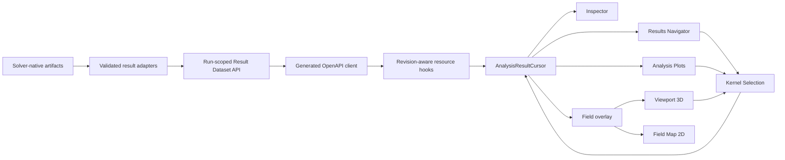

# Masterplan refaktoryzacji UI wyników modalnych, sweepów i FFT

**Data:** 2026-09-01  
**Status:** normatywny plan architektoniczny i wykonawczy; implementacja niewykonana  
**Repozytorium:** `MateuszZelent/fullmag`  
**Dokument wejściowy:** [`2026-09-01-results-mode-sweep-ui-audit-and-refactor-plan.md`](2026-09-01-results-mode-sweep-ui-audit-and-refactor-plan.md)  
**Rozwinięcie:** [`2026-09-01-results-mode-sweep-ui-refactor-masterplan/README.md`](2026-09-01-results-mode-sweep-ui-refactor-masterplan/README.md)

## 1. Cel

Celem refaktoru jest jeden spójny produkt UI dla wyników:

- modalnego eigensolvera `k=0`, `k!=0`, ścieżek `k` i siatek `k`;
- wymuszonej odpowiedzi częstotliwościowej;
- zwykłej dynamiki LLG, FFT, pików spektralnych i `S(k,f)`;
- sweepów pola, materiału, prądu, geometrii i wielu parametrów;
- pól zespolonych w 3D i 2D;
- porównań, branch trackingu, provenance i kwalifikacji.

Docelowy przepływ użytkownika jest identyczny niezależnie od solvera:

```text
run -> stage -> dataset -> coordinates/slice -> item -> field/relation
```

Użytkownik wybiera przykładowo `mu0 Hx = 75 mT`, a UI pobiera dokładnie tę
próbkę, pokazuje należące do niej mody, aktualizuje widmo, Inspector i viewport
oraz odrzuca pole z innej próbki lub topologii.

## 2. Zamrożone decyzje architektoniczne

1. **Jeden lewy panel, pięć kart.** Kernel renderuje `Model`, `Results`,
   `Resources`, `Jobs`, `Diagnostics`. `results-navigator` jest jedynym modułem
   karty Results. `explorer` obsługuje pozostałe cztery karty. Obecne drugie
   drzewo Results w `ExplorerModule` zostaje usunięte po parity.
2. **Drzewo nie jest tabelą modów.** Drzewo zawiera runy, stage i datasety.
   Próbki i elementy wynikowe są stronicowane i wirtualizowane w osobnym
   `Dataset/Slice Browser`; nie powstaje milion ukrytych węzłów.
3. **Jedna kanoniczna referencja wyniku.** Results, Analysis, Inspector i
   viewport używają `AnalysisResultSelectionRef` z `datasetId`, revision,
   `sampleId`, `itemId` i opcjonalnym `fieldId`. Indeksy są metadanymi
   prezentacyjnymi, nie tożsamością.
4. **Kontekst i fokus są rozdzielone.** Kernelowy `AnalysisResultCursor`
   przechowuje małą tożsamość aktywnego datasetu/slice/item. Globalna
   `SelectionController` określa aktualny fokus Inspectora. Gdy fokus dotyczy
   wyniku, obie referencje muszą być identyczne; wybór obiektu modelu nie kasuje
   aktywnego kontekstu analizy.
5. **Artefakty pozostają natywne fizycznie.** Ogólny result index nie zastępuje
   `eigen/field_sweep.v1`, spectrum, branches, response, FFT ani DSF. API buduje
   nad nimi walidowany indeks i projekcje.
6. **Najpierw typed parity dla field sweep.** Pierwszy wdrażany przypadek to
   istniejący 15-punktowy FEM K0 sweep pola dla warstwy z otworem. Frontend nie
   może parsować `payload.extra`.
7. **Eigenmode, driven point i FFT peak są różnymi typami.** Pik FFT jest
   `spectral_feature`; relacja do eigenmodu wymaga jawnego artefaktu matching z
   metodą, score i revisions.
8. **Finite-open nie jest nazywany `k=0`.** Kontekst `finite_open`, `gamma`,
   `fixed_k`, `k_path` i `k_grid` pozostaje jawny w każdym dataset, selection,
   wykresie i polu.
9. **Pole jest fail-closed.** Field metadata, field revision, source item,
   topologia, liczba punktów, basis i encoding muszą być zgodne. Zmiana próbki
   unieważnia stary overlay przed rozpoczęciem kolejnego fetchu.
10. **Geometria może zmieniać topologię.** Geometry sweep wymaga result mesh dla
    próbki albo jawnego `unsupported`. Pole nie jest nakładane na aktualny mesh
    tylko dlatego, że liczba węzłów jest podobna.
11. **HTTP v2 jest źródłem prawdy.** Generated OpenAPI -> `ControlRoomApi` ->
    resource hooks. Realtime tylko invaliduje. Moduły nie używają `fetch()` i
    nie budują URL.
12. **Stores nie przechowują payloadów naukowych.** Dozwolone są IDs,
    kursory, filtry, sortowanie, jednostki wyświetlania, zakresy i układ. Pola,
    topologie, tablice FFT i listy stron należą do resource cache/leases.
13. **Center surfaces są active-only.** Analysis, viewport-3d i field-map
    zwalniają renderer, obserwatory, workery i leases po odmontowaniu.
14. **Brak promocji przez obecność kodu.** Source-visible, executable,
    physics-validated i production-qualified pozostają oddzielnymi stanami.

## 3. Dokumenty masterplanu

| Rozdział | Zakres |
|---|---|
| [`README.md`](2026-09-01-results-mode-sweep-ui-refactor-masterplan/README.md) | architektura nadrzędna, granice, mapa odpowiedzialności i kolejność wdrożenia |
| [`01-information-architecture-and-user-workflows.md`](2026-09-01-results-mode-sweep-ui-refactor-masterplan/01-information-architecture-and-user-workflows.md) | pełny układ UI, wszystkie karty, drzewa i przepływy użytkownika |
| [`02-result-domain-model-identities-and-state.md`](2026-09-01-results-mode-sweep-ui-refactor-masterplan/02-result-domain-model-identities-and-state.md) | dataset, osie, slice, items, relations, selection, cursor i stany |
| [`03-api-artifacts-resources-and-pagination.md`](2026-09-01-results-mode-sweep-ui-refactor-masterplan/03-api-artifacts-resources-and-pagination.md) | Rust/OpenAPI, typed field sweep, result index, paging, filtry i data-plane |
| [`04-panel-left-explorer-results-navigation.md`](2026-09-01-results-mode-sweep-ui-refactor-masterplan/04-panel-left-explorer-results-navigation.md) | kernelowy host lewego panelu, Results browser, drzewa i cross-navigation |
| [`05-analysis-plots-projections-and-synchronization.md`](2026-09-01-results-mode-sweep-ui-refactor-masterplan/05-analysis-plots-projections-and-synchronization.md) | zakładki Analysis, projekcje, osie wykresów, selection round-trip i eksport |
| [`06-inspector-routing-panels-and-cross-links.md`](2026-09-01-results-mode-sweep-ui-refactor-masterplan/06-inspector-routing-panels-and-cross-links.md) | routing Inspectorów, zawartość paneli, akcje i provenance |
| [`07-field-visualization-viewport-and-topology.md`](2026-09-01-results-mode-sweep-ui-refactor-masterplan/07-field-visualization-viewport-and-topology.md) | wspólny field overlay, 3D/2D, faza, animacja, topology-per-sample i lifecycle |
| [`08-product-adapters-k0-nonk0-driven-llg-fft.md`](2026-09-01-results-mode-sweep-ui-refactor-masterplan/08-product-adapters-k0-nonk0-driven-llg-fft.md) | mapowanie wszystkich produktów solvera i sweepów na wspólny model |
| [`09-implementation-work-packages-and-pr-sequence.md`](2026-09-01-results-mode-sweep-ui-refactor-masterplan/09-implementation-work-packages-and-pr-sequence.md) | dokładne pakiety prac, pliki, zależności, fragmenty kodu i kolejność PR |
| [`10-tests-performance-browser-and-definition-of-done.md`](2026-09-01-results-mode-sweep-ui-refactor-masterplan/10-tests-performance-browser-and-definition-of-done.md) | testy, fixture, budżety, browser proof, migracja i końcowe DoD |

## 4. Docelowa architektura



## 5. Docelowy podział odpowiedzialności UI

| Powierzchnia | Odpowiedzialność | Nie może robić |
|---|---|---|
| Panel-left / Model | model, geometria, fizyka, mesh, study, visualizations | interpretować wyniku solvera |
| Panel-left / Results | run/stage/dataset, slice, item list, branch follow | renderować ciężkie pole i wykres |
| Panel-left / Resources | surowe zasoby, artefakty, tables, payload metadata | zastępować Results semantyką plików |
| Panel-left / Jobs | wykonanie, postprocessing, publication, stop reasons | przechowywać wynik |
| Panel-left / Diagnostics | capability, kontrakty, solver, cache, renderer | udawać status naukowy pojedynczą flagą |
| Analysis | spectrum, mapy, branches, cuts, comparison, export | posiadać drugi niezależny dataset selection |
| Inspector | szczegóły aktualnego fokusu, actions, provenance | kopiować server state do draft store |
| Viewport/Field Map | przestrzenna reprezentacja wybranego field ref | podpisywać payload aktualną topologią |

## 6. Pierwszy pionowy zakres wdrożenia

Pierwszy production-shaped increment obejmuje wyłącznie istniejący bias-field
sweep:

```text
field_sweep.v1 writer
  -> pełny typed API payload
  -> generated TypeScript
  -> dataset adapter
  -> Results: 15 wartości mu0 H
  -> dynamiczna lista modów dla wybranego sample
  -> Analysis spectrum tej samej próbki
  -> Inspector mode/sample
  -> poprawny mode field w viewport
  -> zmiana sample czyści poprzedni overlay
```

Nie należy zaczynać od ogólnego kreatora dowolnych sweepów ani od kosmetycznego
dropdownu. Pionowy przypadek field sweep ma najpierw udowodnić kompletność
identyfikacji, revisions, branch tracking, topology i field handoff.

## 7. Warunki wejścia do implementacji

- zaakceptowanie ADR dla `AnalysisResultDataset`, `AnalysisResultCursor` i
  kernelowego hosta panel-left;
- zamrożenie typed `eigen/field_sweep.v1` w Rust/OpenAPI;
- fixture z pełnym writer outputem, a nie ręcznie zredukowany JSON;
- określenie compatibility window dla `frequency-domain` selection refs;
- potwierdzenie, że obecny mode bundle publikuje field refs wyłącznie dla
  istniejącego Cartesian complex XYZ payloadu;
- brak modyfikacji `apps/legacy_web`.

## 8. Definicja ukończenia

Refaktor jest ukończony dopiero, gdy dla modal eigen, driven response i LLG/FFT
użytkownik może:

1. wybrać run, stage i dataset;
2. zobaczyć osie i jednostki bez zgadywania z nazw plików;
3. wybrać wartości jednego lub wielu parametrów;
4. otrzymać właściwą, stronicowaną listę elementów;
5. przejść z drzewa do wykresu, Inspectora i pola bez utraty identity;
6. kliknąć wykres i wrócić do dokładnie tego samego item w Results;
7. odróżnić mode, response point, spectral feature, fit i DSF point;
8. wyrenderować pole tylko przy zgodnym field/topology/revision contract;
9. przełączać próbki bez pozostawienia starego payloadu;
10. pracować na dużym sweepie bez materializacji całego datasetu;
11. uzyskać jawne `missing`, `unsupported`, `partial`, `interrupted`, `corrupt`,
    `stale` i qualification state;
12. odtworzyć wybór z immutable IDs oraz digests.

Końcowa akceptacja wymaga rzeczywistego browser proof dla 15-punktowego FEM K0
sweepu warstwy z otworem oraz oddzielnych scenariuszy non-K0, driven i LLG/FFT.
