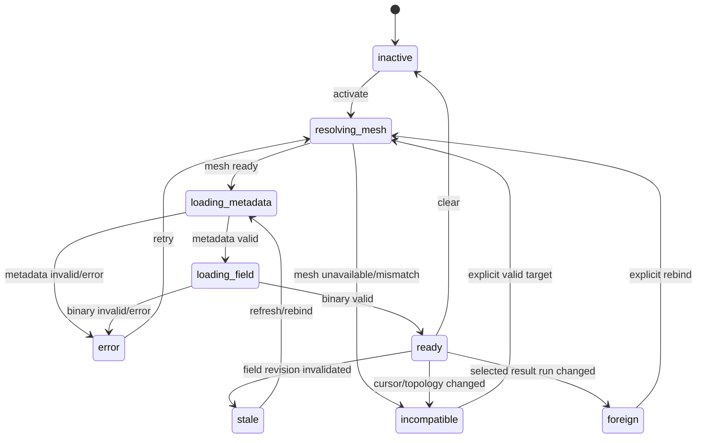

# 07 — Wizualizacja pól, viewport i zgodność topologii

## 1. Cel

Istniejący Control Room ma dojrzały fundament dla zespolonych pól modalnych i
odpowiedzi: metadata, binary codec, fazę, `real/imag/abs/phase`, animację,
provenance i topology checks. Refaktor nie może osłabić tych bramek. Powinien
uogólnić je na wszystkie typy wyników oraz jednoznacznie związać pole z:

```text
run -> dataset revision -> sample -> item -> field revision -> result mesh
```

## 2. Zakres

Docelowa ścieżka obsługuje:

- eigenmode field dla finite-open, Gamma, fixed-k, k-path i k-grid;
- driven response field;
- time-domain spectral response field;
- statyczny result state, jeśli produkt go publikuje;
- różnicę pól, jeśli istnieje qualified transfer/alignment;
- 3D viewport;
- 2D field-map;
- real, imaginary, magnitude, phase, phase-rotated real i animację;
- component selection, vectors, shader, range, colormap, clipping i scope;
- topology shared across dataset i per-sample topology.

## 3. Model field overlay

## 3.1. Źródła

```typescript
export type AnalysisResultFieldSource =
  | "modal-eigen"
  | "driven-response"
  | "time-domain-response"
  | "static-result"
  | "comparison-difference";
```

Nie należy używać samego `frequency-response` jako catch-all dla FFT response.

## 3.2. Intent

```typescript
export interface AnalysisResultFieldOverlayIntent {
  readonly runId: string;
  readonly stageId: string;
  readonly datasetId: string;
  readonly datasetRevision: string;
  readonly sampleId: string;
  readonly sampleRevision: string;
  readonly itemId?: string;
  readonly itemRevision?: string;
  readonly itemKind?: AnalysisResultItemKind;
  readonly fieldId: string;
  readonly fieldRevision: string;
  readonly source: AnalysisResultFieldSource;
  readonly quantityId: string;
  readonly representation: AnalysisResultFieldRepresentation;
  readonly metadataResourceKey: string;
  readonly binaryResourceKey: string;
  readonly meshRef: AnalysisResultMeshRef;
  readonly frequencyHz?: number;
  readonly wavevectorKf?: readonly [number, number, number];
  readonly kPathCoordinateRadPerM?: number;
  readonly cellOrigin?: readonly [number, number, number];
  readonly kContextKind?: AnalysisFieldOverlayKContextKind;
  readonly phasorConvention?: PhasorConvention;
  readonly floquetSpatialConvention?: FloquetSpatialConvention;
}
```

W przeciwieństwie do obecnego `ModeFieldOverlayIntent`, generic intent używa
stable item IDs i revisions. Presentation indices są opcjonalne tylko dla
legacy endpoint bridge.

## 3.3. Render state

```typescript
export interface AnalysisResultFieldOverlayState {
  intent: AnalysisResultFieldOverlayIntent;
  query: FieldVectorQuery;
  appearance: AnalysisFieldOverlayAppearanceState;
  animation: AnalysisFieldOverlayAnimationState;
  visualizationPhaseRad: number;
  status:
    | "resolving-mesh"
    | "loading-metadata"
    | "loading-field"
    | "ready"
    | "stale"
    | "foreign"
    | "incompatible"
    | "error";
  reason: string | null;
}
```

`status=ready` oznacza, że metadata i binary zostały zweryfikowane. Sam intent
nie jest jeszcze drawable.

## 4. Controller

## 4.1. Odpowiedzialność

`AnalysisResultFieldOverlayController` przechowuje małą immutable identity i
preferences renderowania. Nie przechowuje typed arrays, Three.js objects ani
pełnej topologii.

```typescript
export class AnalysisResultFieldOverlayController {
  getSnapshot(): AnalysisResultFieldOverlaySnapshot;
  getRenderableSnapshot(): AnalysisResultFieldOverlayState | null;
  activate(intent: AnalysisResultFieldOverlayIntent, options?: ActivateOptions): void;
  setStatus(status: OverlayStatus, reason?: string): void;
  updateQuery(query: Partial<FieldVectorQuery>): void;
  updateAppearance(patch: Partial<AnalysisFieldOverlayAppearanceState>): void;
  updateAnimation(patch: Partial<AnalysisFieldOverlayAnimationState>): void;
  clear(reason: OverlayClearReason): void;
  rebind(intent: AnalysisResultFieldOverlayIntent): boolean;
  bindResultCursor(cursor: AnalysisResultCursorSnapshot | null): void;
  subscribe(listener: () => void): () => void;
}
```

## 4.2. Result cursor binding

Każda zmiana cursoru wykonuje synchronizację przed kolejnym paint:

```typescript
function overlayCompatibilityWithCursor(
  intent: AnalysisResultFieldOverlayIntent,
  cursor: AnalysisResultCursorSnapshot | null,
): OverlayCompatibility {
  if (!cursor) return incompatible("result_cursor_unavailable");
  if (intent.runId !== cursor.runId) return foreign("foreign_run");
  if (intent.datasetId !== cursor.datasetId) return incompatible("dataset_changed");
  if (intent.datasetRevision !== cursor.datasetRevision) {
    return incompatible("dataset_revision_changed");
  }
  if (intent.sampleId !== cursor.slice.sampleId) {
    return incompatible("sample_changed");
  }
  if (intent.itemId && intent.itemId !== cursor.item?.itemId) {
    return incompatible("item_changed");
  }
  if (intent.itemRevision && intent.itemRevision !== cursor.item?.itemRevision) {
    return incompatible("item_revision_changed");
  }
  return compatible();
}
```

### Krytyczny inwariant

Po zmianie sample/item stary overlay **nie może pozostać drawable do czasu
ukończenia nowego requestu**. Może pozostać w kontrolerze jako historyczny
snapshot z `incompatible`, ale `getRenderableSnapshot()` zwraca `null`.

## 4.3. Kolejność powiadomień

Atomowa result-navigation transaction:

```text
1. nowy cursor zostaje zatwierdzony
2. overlay compatibility jest przeliczona synchronicznie
3. renderer dostaje brak drawable overlay
4. globalna selection jest aktualizowana
5. resource hooks rozpoczynają nowe requests
```

Nigdy:

```text
request new field
-> stary field pozostaje widoczny
-> po kilku klatkach cursor się zmienia
```

## 5. Activation state machine



## 6. Polecenie aktywacji

```typescript
export interface PlotAnalysisResultFieldInput {
  resultRef: AnalysisResultSelectionRef;
  fieldRef: AnalysisResultFieldRef;
  target: "viewport-3d" | "field-map";
  view?: AnalysisResultFieldView;
  component?: string;
  phaseRad?: number;
}
```

### Command preflight

Przed aktywacją:

- selection/cursor dataset snapshot jest zgodny;
- field należy do selected item/sample;
- field status pozwala na renderowanie;
- representation jest obsługiwana przez target;
- result mesh jest dostępny;
- requested view należy do `availableViews`;
- component istnieje;
- field revision i topology metadata są kompletne.

Disabled reason jest widoczny przed kliknięciem.

## 7. Metadata validation

```typescript
export interface ResolvedAnalysisResultFieldMetadata {
  intent: AnalysisResultFieldOverlayIntent;
  fieldRevision: string;
  contentDigest: string;
  payloadValueCount: number;
  pointCount: number;
  componentCount: number;
  components: readonly string[];
  availableViews: readonly AnalysisResultFieldView[];
  defaultView: AnalysisResultFieldView;
  defaultPhaseRad: number;
  encoding: string;
  binaryLayout: string;
  meshRef: AnalysisResultMeshRef;
}
```

### Walidator

```typescript
export function resolveAnalysisResultFieldMetadata(
  intent: AnalysisResultFieldOverlayIntent,
  metadata: AnalysisResultFieldMetadataResource,
): ResolvedAnalysisResultFieldMetadata | null {
  if (metadata.status !== "ready") return null;
  if (metadata.run_id !== intent.runId) return null;
  if (metadata.dataset_id !== intent.datasetId) return null;
  if (metadata.dataset_revision !== intent.datasetRevision) return null;
  if (metadata.sample_id !== intent.sampleId) return null;
  if (metadata.item_id !== intent.itemId) return null;
  if (metadata.field_id !== intent.fieldId) return null;
  if (metadata.field_revision !== intent.fieldRevision) return null;
  if (!meshRefEquals(metadata.mesh_ref, intent.meshRef)) return null;
  if (!supportedRepresentation(metadata.representation)) return null;
  if (!supportedComponentBasis(metadata.component_basis)) return null;
  if (!validPayloadShape(metadata)) return null;
  return freezeResolvedMetadata(metadata, intent);
}
```

## 8. Binary validation

```typescript
export function validateAnalysisResultFieldBinary(
  metadata: ResolvedAnalysisResultFieldMetadata,
  binary: DecodedFieldVector,
  mesh: ActiveResultMeshIdentity,
): ValidatedAnalysisResultFieldBinary | null {
  if (binary.quantityId !== metadata.intent.fieldId) return null;
  if (binary.pointCount !== metadata.pointCount) return null;
  if (binary.valueCount !== metadata.payloadValueCount) return null;
  if (binary.values.length !== binary.valueCount) return null;
  if (!allFinite(binary.values)) return null;
  if (!binaryMeshMatches(binary, metadata.meshRef, mesh)) return null;
  if (!binaryShapeMatchesRepresentation(binary, metadata)) return null;
  return createValidatedField(binary, metadata);
}
```

Dla złożonych pól Cartesian XYZ oczekiwany jest dokładny layout, np.
interleaved real/imag z sześcioma komponentami na punkt. Tangent-local field nie
jest automatycznie traktowane jako global XYZ; wymaga opublikowanego operatora
rekonstrukcji i nowej verified field revision.

## 9. Result mesh resolution

## 9.1. Shared topology

Dla field sweep z niezmienną geometrią:

```text
manifest.topologyPolicy = sharedAcrossDataset
```

Mesh może być używany przez wiele sample pod warunkiem zgodności:

```text
meshId
meshRevision
topologyFingerprint
pointCount
indexing
```

## 9.2. Per-sample topology

Dla geometry sweep:

```text
manifest.topologyPolicy = perSample
sample.meshRef = ...
```

Activation flow:

1. odczytaj sample mesh ref;
2. sprawdź result-mesh cache;
3. pobierz metadata/topology, jeśli brak;
4. zbuduj render model;
5. dopiero potem pobierz field lub równolegle, ale nie adoptuj przed oboma
   valid gates;
6. zamień aktywny spatial context atomowo.

## 9.3. Current authoring mesh

Może zostać użyty tylko, gdy immutable identity jest dokładnie zgodna z result
mesh ref. Równa liczba węzłów nie wystarcza.

## 9.4. Brak result mesh

UI pokazuje:

```text
Spatial visualization unavailable: this result sample uses a topology that is
not published by the result-mesh data plane.
```

Spectrum/tabela pozostają dostępne.

## 10. 3D viewport

## 10.1. Render model

```typescript
export interface AnalysisResultFieldRenderModel {
  field: ValidatedAnalysisResultFieldBinary;
  mesh: ResultMeshRenderModel;
  view: AnalysisResultFieldView;
  component: string;
  phaseRad: number;
  appearance: AnalysisFieldOverlayAppearanceState;
  kContext?: AnalysisResultFieldKContext;
}
```

FDM/FEM interpretacja topologii jest w adapterach render modelu. Komponent
React nie wykonuje switcha backendowego.

## 10.2. Widoki

```typescript
export type AnalysisResultFieldView =
  | "real"
  | "imag"
  | "magnitude"
  | "phase"
  | "phase-rotated-real"
  | "animate";
```

Compatibility aliases `abs`, `amplitude`, `phase_rotated_real` są mapowane w
jednym boundary. Nowy publiczny kontrakt powinien zamrozić jedną nomenklaturę.

### Phasor

Dla zespolonego pola `u = u_r + i u_i` i fazy `phi`:

```text
Re[u exp(i phi)] = u_r cos(phi) - u_i sin(phi)
```

Znak czasu i Floquet convention pochodzą z metadata. UI nie zakłada globalnego
`exp(+i omega t)`.

## 10.3. Animation

Animation jest presentation state:

```typescript
interface FieldAnimationState {
  animatePhase: boolean;
  animationRateHz: number; // szybkość prezentacji, nie fizyczna frequency
  direction: -1 | 1;
  loop: boolean;
}
```

- animationRateHz opisuje tempo obrotu fazy w UI;
- physical frequency pozostaje w metadata/Inspectorze;
- `prefers-reduced-motion` wyłącza auto-start i ogranicza transition;
- rAF działa tylko podczas aktywnej animacji i zamontowanego viewportu;
- stop/unmount anuluje rAF;
- zmiana cursoru zatrzymuje renderowanie starego field natychmiast.

## 10.4. Appearance

Dozwolone persistent preferences:

```text
view
component
colormap
range mode/min/max
display gain
vector visibility/budget/scale
shader visibility/color source
geometry scope
clip planes
opacity
```

Preferences mogą być wspólne dla kolejnych modów, ale nigdy nie przenoszą
field identity. Manual range może zostać zachowane tylko przy zgodnej quantity i
unit dimension.

## 11. Field Map 2D

## 11.1. Wspólny source, osobna projection

Field Map nie importuje viewport-3d store/renderer. Konsumuje ten sam intent i
field/mesh resources przez neutralne adapters.

Request zawiera:

```text
fieldId/revision
meshRef
plane/surface/slab definition
view/component/phase
reduction/interpolation
resolution/budget
```

## 11.2. Plane i slice ownership

- canonical planar monitor może należeć do modelu;
- runtime-only quick plane jest local visualization preference;
- result field nie zmienia canonical modelu;
- plane update nie zmienia dataset cursor;
- field-map output ma własną projection revision zależną od field i plane
  request.

## 11.3. Funkcje

```text
raster/heatmap
contours
vectors/quiver
mesh overlay
probes
line profiles
surface projection
phase/magnitude/components
export image/data
```

## 12. Selection w viewport

### Pick result layer

Picking aktywnego pola może ustawić fokus:

```typescript
{
  type: "analysis-result",
  focus: "field",
  datasetId,
  sampleId,
  itemId,
  fieldId,
  // revisions
}
```

Picking nie zmienia sample/item, ponieważ pole już do nich należy. Inspector
przechodzi do field panelu.

### Pick mesh object under result field

Domyślna polityka:

- zwykły click na obiekt może ustawić scene-object focus, result cursor pozostaje;
- modifier/action `Inspect result field here` otwiera probe lub field focus;
- UI jednoznacznie pokazuje, czy Inspector opisuje model object czy result field.

## 13. Model tree — Active analysis field

Pod `Model -> Visualizations`:

```text
Active analysis field
├─ Source: Eigen mode B1
├─ Dataset: Modal field sweep
├─ Slice: μ0Hx=75mT
├─ View: phase-rotated real
├─ Phase and animation
├─ Appearance
└─ Clear
```

Węzeł jest projection aktualnego overlay state. Nie zawiera wszystkich pól
wynikowych i nie pobiera payloadu po rozwinięciu. Selection typu
`mode-visualization` zostaje zastąpiona lub zmapowana do `analysis-result` focus
`field` z presentation context.

## 14. Field source registry

## 14.1. Adapter

```typescript
export interface AnalysisResultFieldSourceAdapter {
  source: AnalysisResultFieldSource;
  supports(field: AnalysisResultFieldRef): boolean;
  metadataQuery(intent: AnalysisResultFieldOverlayIntent): ResultFieldMetadataQuery;
  binaryQuery(
    intent: AnalysisResultFieldOverlayIntent,
    view: AnalysisResultFieldView,
  ): ResultFieldBinaryQuery;
  validateMetadata(
    intent: AnalysisResultFieldOverlayIntent,
    resource: unknown,
  ): ResolvedAnalysisResultFieldMetadata | null;
}
```

### Początkowe adaptery

```text
ModalEigenFieldAdapter
DrivenResponseFieldAdapter
TimeDomainResponseFieldAdapter
StaticResultFieldAdapter
ComparisonDifferenceFieldAdapter
```

Adapter registry eliminuje rozgałęzienia `source === eigen-mode ? endpoint A :
endpoint B` w wielu komponentach.

## 15. Caching i leases

## 15.1. Field cache key

```text
runId
datasetId
datasetRevision
sampleId
itemId
fieldId
fieldRevision
binary query view/component/scope
mesh fingerprint
```

Display-only shader/colormap/range nie uczestniczą w key surowego field buffer.
Phase może być renderowana lokalnie z complex field, więc nie musi powodować
network request, jeśli raw complex payload jest dostępny.

## 15.2. Lease lifecycle

```text
resource cache owns decoded buffer
renderer obtains lease
renderer uploads GPU buffer/texture
on field change/unmount renderer releases GPU resources and lease
cache eviction releases decoded buffer after final consumer
```

Nie kopiujemy typed arrays do React state ani Zustand.

## 15.3. Warm switching

Dopuszczalne:

- cache ostatnich bounded field buffers według globalnej polityki pamięci;
- natychmiastowe użycie cache po pełnej identity validation;
- zachowanie appearance preferences.

Niedopuszczalne:

- utrzymywanie wszystkich field payloads sweepu;
- preload podczas scroll/hover;
- display starego field jako placeholder dla nowego sample;
- cache key bez dataset/sample revisions.

## 16. Cancellation i race safety

Każda activation ma generation ID:

```typescript
const generation = controller.beginActivation(intent);
const [mesh, metadata] = await Promise.all([...]);
if (!controller.isCurrent(generation, intent)) return;
const binary = await loadField(...);
if (!controller.isCurrent(generation, intent)) return;
controller.adopt(validate(...));
```

Zmiana cursoru/unmount:

- abortuje fetch metadata/binary/topology;
- odrzuca spóźnione decode worker message;
- nie ustawia state po unmount;
- zwalnia częściowo utworzone GPU resources;
- nie powoduje flash starego pola.

## 17. Dirty-driven rendering

### Dirty reasons

```text
field-buffer-adopted
field-view-changed
field-phase-changed
field-appearance-changed
camera-changed
clip-changed
mesh-changed
animation-tick
resize
```

Idle po settling:

```text
0 viewport frames
0 chart frames
0 polling
0 field scans
```

Animation tick istnieje tylko dla aktywnej animacji.

## 18. Diagnostics

Bounded snapshot zawiera:

```text
intent identity
cursor compatibility
metadata validation result
binary/header validation result
mesh identity comparison
payload/point counts
active view/component/phase
GPU resource counts
field/cache lease counts
last dirty reason
last request timing/status
```

Nie zawiera pełnego field array. Visualization debug nie uruchamia dodatkowego
heavy request bez aktywnego demand.

## 19. Compatibility z istniejącym overlay

### Etap 1

Dodać adapter:

```typescript
export function genericIntentFromModeFieldOverlayIntent(
  legacy: ModeFieldOverlayIntent,
  resultIndex: AnalysisResultCompatibilityIndex,
): AnalysisResultFieldOverlayIntent | null;
```

Wymaga mappingu stable mode ID do dataset/sample/item i revisions.

### Etap 2

Existing commands:

```text
analysis.eigen.plot-mode-3d
analysis.frequency-response.plot-response-field-3d
```

stają się aliasami wywołującymi generic:

```text
analysis-result.plot-field
```

Nowe UI emituje tylko generic command.

### Etap 3

`AnalysisFieldOverlayController` może zostać:

- rozszerzony i przemianowany, jeśli migration cost jest akceptowalny; albo
- opakowany przez `AnalysisResultFieldOverlayController`, a stary publiczny API
  pozostaje compatibility facade.

Nie wolno utrzymywać dwóch aktywnych field overlay owners.

### Etap 4

Po release gate usunąć:

- source inference po `kind.startsWith`;
- field ID prefix inference;
- index-only mode intent;
- `mode-visualization` selection writes;
- old command aliases.

## 20. Testy jednostkowe

### Intent

- wszystkie required IDs/revisions;
- wrong item/sample rejected;
- finite-open bez k accepted;
- Gamma z nonzero k rejected;
- fixed-k bez vector rejected;
- k-path bez sample/path coordinate rejected;
- unsupported representation rejected.

### Cursor compatibility

- dataset changed;
- dataset revision changed;
- sample changed;
- item changed;
- same branch but different item nadal invaliduje field;
- non-result Inspector focus nie invaliduje zgodnego cursoru;
- foreign run.

### Metadata/binary

- field revision mismatch;
- mesh mismatch;
- topology fingerprint mismatch;
- point count mismatch;
- component count/basis mismatch;
- encoding/layout mismatch;
- NaN/Inf;
- stale binary;
- result mesh unavailable;
- valid Cartesian complex field.

### Controller

- stale overlay becomes non-renderable synchronously;
- no duplicate notify for equal state;
- rebind preserves appearance but not identity;
- clear releases demand;
- animation lifecycle;
- late request ignored.

## 21. Testy integracyjne i browser

### 15-punktowy field sweep

1. aktywuj field sample 0/mode A;
2. sprawdź drawing buffer i field digest;
3. zmień na sample 7 podczas animacji;
4. przed odpowiedzią sieciową canvas nie renderuje starego overlay;
5. aktywuj mode B;
6. sprawdź nową field/sample/item/topology identity;
7. przejdź 3D -> Field Map -> 3D;
8. sprawdź cleanup i brak context loss.

### Geometry sweep

1. sample A i mesh A;
2. sample B i mesh B;
3. payload A nie jest adoptowany na mesh B;
4. bez mesh B action jest disabled z reason;
5. po powrocie cache A działa tylko z mesh A identity.

### Performance

- 100 zmian sample bez explicit Plot Field = 0 field requests;
- 100 field activations z bounded cache nie powoduje unbounded heap/WebGL growth;
- idle frames zero;
- unmount resource tracker wraca do baseline;
- ECharts i WebGL aktywne tylko w swoich center surfaces;
- abort count i late completion są mierzone.

## 22. Definition of Done

- jeden generic field intent obsługuje eigen, driven i time-domain response;
- intent zawiera dataset/sample/item/field revisions;
- cursor change synchronicznie blokuje stary field;
- metadata i binary są walidowane względem owner i mesh;
- geometry sweep używa result mesh albo fail-closed;
- finite-open/Gamma/fixed-k/k-path/k-grid zachowują semantykę;
- wszystkie complex views i animation działają bez zmiany danych naukowych;
- 3D i Field Map konsumują tę samą field identity bez importów między modułami;
- fields nie są prefetchowane przez Results/Analysis;
- typed arrays nie trafiają do stores;
- renderer jest dirty-driven i idle=0 frames;
- cancellation/race tests przechodzą;
- browser proof potwierdza brak stale overlay, zdrowy WebGL i bounded resources;
- legacy commands/intents mają bounded alias i removal gate.
