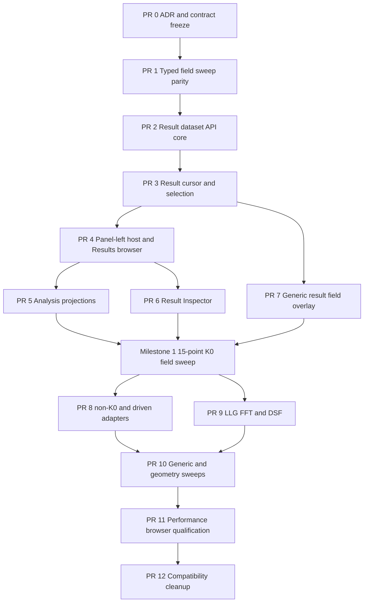

# 09 — Pakiety implementacyjne, kolejność PR i konkretne zmiany w kodzie

## 1. Cel

Ten rozdział zamienia architekturę w wykonywalny program zmian. Każdy pakiet ma:

- jednoznaczny zakres;
- właścicieli plików;
- wymagane testy RED/GREEN;
- warunki wejścia i wyjścia;
- zależności;
- kryterium rollbacku;
- zakaz niejawnej promocji capability.

Plan nie wymaga jednego ogromnego PR. Refaktor jest dzielony tak, aby na każdym
etapie stary przepływ pozostawał działający albo jawnie zastąpiony przez
zweryfikowany nowy przepływ.

## 2. Globalne reguły wykonania

1. Każdy pakiet ma osobny branch/worktree lub jasno wydzielony commit series.
2. Nie modyfikować `apps/legacy_web`.
3. Nie łączyć zmian native FEM runtime z UI, chyba że pakiet wprost tego wymaga.
4. Native FEM/MFEM/CUDA verification używa repozytoryjnych managed `just`
   recipes; hostowe buildy są tylko diagnostyczne.
5. Najpierw failing test kontraktu, potem implementacja.
6. Generated OpenAPI files są regenerowane, nigdy ręcznie edytowane.
7. Moduły nie importują swoich store/komponentów wzajemnie.
8. HTTP v2 pozostaje źródłem prawdy; realtime tylko invaliduje.
9. Stores przechowują tylko bounded UI state i IDs.
10. Każdy compatibility reader ma właściciela, wersję wejściową i removal gate.
11. Nie usuwać starej ścieżki, dopóki parity tests i browser proof nie przejdą.
12. Każdy PR dokumentuje `git diff --name-only`, uruchomione testy i testy
    niewykonane.
13. Nie deklarować runtime/physics qualification na podstawie testów frontend.
14. Osobno kwalifikować modal CPU, modal GPU, driven i time-domain lanes.

## 3. Graf zależności



## 4. PR 0 — ADR i zamrożenie kontraktu

### Cel

Zatwierdzić trzy decyzje przed publiczną zmianą API:

1. `AnalysisResultDataset` jako validated index nad native artifacts;
2. `AnalysisResultCursor` jako kernelowy kontekst wyniku;
3. kernelowy host pięciu kart panel-left z jednym ownerem Results.

### Nowe dokumenty

```text
docs/adr/00xx-analysis-result-dataset-and-cursor.md
docs/specs/frontend-v2/xx-analysis-results-workspace.md
docs/specs/analysis-result-api-v2.md
```

### Zmiany

- zdefiniować finalne nazwy typów i endpointów;
- zamrozić product/item/axis/status enums;
- zamrozić compatibility window;
- zdefiniować source-of-truth hierarchy;
- zdefiniować ownership modułów i state;
- zdefiniować pierwszą wersję API i data-plane;
- dodać plan migracji docs index.

### Testy/gates

- ADR check;
- link checker;
- spec consistency scan;
- architecture review: brak konfliktu z frontend-v2 module/API/state specs;
- physics review: FFT peak, eigenmode i driven point pozostają odrębne.

### Exit criteria

- ADR accepted;
- nie ma dwóch możliwych nazw/namespace;
- wszystkie kolejne PR używają tego kontraktu;
- brak zmian produkcyjnych w tym PR.

## 5. PR 1 — pełny typed field sweep parity

### Cel

Usunąć najważniejszą lukę writer -> API -> TypeScript i zweryfikować legalność
mode field refs.

### Główne pliki Rust

```text
crates/fullmag-runner/src/eigen/artifacts/field_sweep.rs
crates/fullmag-runner/src/eigen/artifacts/mode_bundle.rs
crates/fullmag-runner/src/eigen/artifacts/tests.rs
crates/fullmag-api/src/router_v2/handlers/analysis/frequency_domain.rs
crates/fullmag-api/src/router_v2/handlers/analysis/frequency_domain/tests.rs lub istniejący moduł testów
crates/fullmag-api/src/openapi.rs / router registration, jeśli wymagane
scripts/verify_fem_frequency_domain_eigen_artifacts.py
scripts/test_verify_fem_frequency_domain_eigen_artifacts.py
```

### Generated/frontend files

```text
apps/control-room/src/kernel/api/generated/openapi-v2.json
apps/control-room/src/kernel/api/generated/openapi-v2-types.ts
apps/control-room/src/kernel/api/generated/openapi-v2-client.ts lub aktualny generated wrapper
apps/control-room/src/kernel/api/apiTypes.ts
apps/control-room/src/modules/results-navigator/resultsNavigatorTypes.ts
```

### RED tests

1. Serialize pełny 15-sample writer fixture.
2. Deserializacja obecnym API traci `modes/scan_axis/topology` — test RED.
3. Mode bez istniejącego bundle nie może mieć field ref — test RED.
4. Source spectrum/branches revision mismatch — test RED.
5. `complete=true` z missing equilibrium/operator signature — test RED.
6. Generated OpenAPI schema musi zawierać typed mode fields — source/schema test
   RED.

### Implementacja

- rozszerzyć typed API payload dokładnie do writer schema;
- optional field refs;
- wspólne typed source/topology/execution/unit structs zamiast `Value`;
- walidator artifact digest/cross refs;
- sprawdzenie mode bundle przed field ref;
- zachować `extra` tylko dla niekrytycznych rozszerzeń;
- regenerate API;
- dodać pure `navigatorFieldSweepFromResource()` lub tymczasowy typed adapter do
  testów parity.

### GREEN

```bash
cargo test -p fullmag-runner field_sweep
cargo test -p fullmag-api frequency_domain
python -m pytest scripts/test_verify_fem_frequency_domain_eigen_artifacts.py
pnpm --dir apps/control-room run generate:api
pnpm --dir apps/control-room run typecheck
pnpm --dir apps/control-room run test -- resultsNavigatorTypes
```

### Exit criteria

- writer fixture przechodzi pełny round-trip;
- zero required fields only in `extra`;
- field refs są prawdziwe lub absent;
- generated TS jest typed;
- brak UI heuristics.

### Rollback

Jeśli pełna zmiana schema narusza backward reader, dodać nową wersję payload
variant, nie cofać fields do `extra`.

## 6. PR 2 — Result Dataset API core

### Cel

Wprowadzić catalog, manifest, axis values, sample pages i item pages dla dwóch
adapterów:

- single-sample modal eigen;
- bias-field modal sweep.

### Nowe pliki

```text
crates/fullmag-api/src/router_v2/handlers/analysis/results/mod.rs
crates/fullmag-api/src/router_v2/handlers/analysis/results/types.rs
crates/fullmag-api/src/router_v2/handlers/analysis/results/catalog.rs
crates/fullmag-api/src/router_v2/handlers/analysis/results/manifest.rs
crates/fullmag-api/src/router_v2/handlers/analysis/results/samples.rs
crates/fullmag-api/src/router_v2/handlers/analysis/results/items.rs
crates/fullmag-api/src/router_v2/handlers/analysis/results/pagination.rs
crates/fullmag-api/src/router_v2/handlers/analysis/results/validation.rs
crates/fullmag-api/src/router_v2/handlers/analysis/results/adapters/mod.rs
crates/fullmag-api/src/router_v2/handlers/analysis/results/adapters/modal_eigen.rs
crates/fullmag-api/src/router_v2/handlers/analysis/results/adapters/field_sweep.rs
```

### Zmiany istniejące

```text
router v2 registration
OpenAPI registration
ControlRoomApi facade
apiPaths/generated only through generation
resource invalidation map
```

### RED tests

- run ID wymagane;
- catalog zwraca stable dataset IDs;
- manifest nie zawiera sample arrays;
- 15 field samples mapuje do 15 sample IDs;
- sample 7 ma mody wyłącznie sample 7;
- page cursor związany z revision/filter;
- stale cursor -> 409;
- unknown token/filter -> 422;
- reordering source arrays nie zmienia stable IDs;
- partial/interrupted/corrupt status;
- field ref absent dla spectrum-only.

### Implementacja

- typed enums/resources;
- adapter registry;
- deterministic dataset IDs/revisions;
- cursor signing/validation;
- bounded page limits;
- catalog/manifest/pages;
- source validation cache keyed by artifact digests;
- explicit error codes;
- OpenAPI generation.

### Exit criteria

CLI/API test może:

1. odkryć dataset field sweep;
2. pobrać manifest;
3. pobrać axis values;
4. znaleźć sample po tokenie;
5. pobrać pierwszą stronę modów;
6. pobrać item detail;
7. zrobić to bez czytania source file w kliencie.

## 7. PR 3 — frontend domain, resources, cursor i selection

### Cel

Dodać wspólną tożsamość klienta bez jeszcze pełnego nowego UI.

### Nowe pliki

```text
apps/control-room/src/shared/domain/analysis/results/types.ts
apps/control-room/src/shared/domain/analysis/results/identity.ts
apps/control-room/src/shared/domain/analysis/results/selection.ts
apps/control-room/src/shared/domain/analysis/results/status.ts
apps/control-room/src/shared/domain/analysis/results/axisFormatting.ts
apps/control-room/src/shared/domain/analysis/results/compatibility.ts
apps/control-room/src/kernel/resources/analysisResultResources.ts
apps/control-room/src/kernel/workspace/analysisResultCursorTypes.ts
apps/control-room/src/kernel/workspace/AnalysisResultCursorController.ts
apps/control-room/src/kernel/workspace/useAnalysisResultCursor.ts
apps/control-room/src/kernel/workspace/AnalysisResultNavigationController.ts
```

### Zmiany

```text
kernel/types.ts — dodać resultCursor/resultNavigation
kernel construction/provider
selectionTypes.ts — dodać AnalysisResultSelectionRef
selection equality
ControlRoomApi.ts — result facade
apiTypes exports
resource invalidation tests
```

### RED tests

- equality nie zależy od labels/indexes;
- coordinate key canonical order;
- cursor dataset/slice/item transitions;
- illegal item from another sample rejected;
- atomowe cursor+selection notify;
- selecting scene object nie czyści cursoru;
- dataset/sample change invalidates registered overlay observer;
- legacy ref mapping wymaga stable IDs/revision;
- no payload arrays in cursor/selection.

### Implementacja

- immutable value types/builders;
- `useSyncExternalStore` boundary;
- atomic navigation transaction;
- generated resource hooks;
- bounded compatibility reader;
- no module imports.

### Exit criteria

Synthetic test może ustawić dataset/sample/mode z Results-like source, odczytać
identyczny ref w Analysis-like i Inspector-like consumers i wykryć zmianę sample
bez index guessing.

## 8. PR 4 — kernelowy panel-left i Results Dataset/Slice Browser

### Cel

Usunąć ribbon coupling, stworzyć jeden panel-left tab host i podłączyć nowy
Results do field-sweep dataset API.

### Nowe kernel files

```text
apps/control-room/src/kernel/layout/panel-left/PanelLeftWorkspaceHost.tsx
apps/control-room/src/kernel/layout/panel-left/PanelLeftTabBar.tsx
apps/control-room/src/kernel/layout/panel-left/panelLeftTypes.ts
apps/control-room/src/kernel/layout/panel-left/panelLeftContributions.ts
apps/control-room/src/kernel/layout/panel-left/panelLeftNavigation.ts
```

### Results files

```text
modules/results-navigator/controller/useResultsNavigatorController.ts
modules/results-navigator/controller/useResultContextController.ts
modules/results-navigator/controller/useResultDatasetTree.ts
modules/results-navigator/controller/useResultSliceController.ts
modules/results-navigator/controller/useResultItemsController.ts
modules/results-navigator/components/ResultContextBar.tsx
modules/results-navigator/components/ResultDatasetTree.tsx
modules/results-navigator/components/ResultDatasetStatus.tsx
modules/results-navigator/components/ResultSliceControls.tsx
modules/results-navigator/components/ResultAxisControl.tsx
modules/results-navigator/components/ResultItemToolbar.tsx
modules/results-navigator/components/ResultItemList.tsx
modules/results-navigator/components/ResultItemRow.tsx
modules/results-navigator/components/ResultActionBar.tsx
modules/results-navigator/store.ts
```

### Zmiany istniejące

```text
layoutTypes.ts / LayoutController.ts / persistence
kernel SlotHost/shell integration
module manifest contribution types
explorer manifest/module/store
results-navigator manifest/root
registry tests
styles under src/design/styles
```

### RED tests

- ribbon i panel-left niezależne;
- każdy tab ma jednego ownera;
- Results module aktywuje się z panel tab, nie ribbon;
- Results tree nie ma sample/mode children;
- 15 axis values;
- zmiana field value zmienia sample i item page;
- branch preserve/gap;
- virtualizer only visible rows;
- zero field requests;
- stale cursor reset;
- module unmount abort.

### Implementacja

- `activePanelLeftTab` i migration;
- contribution registry;
- Results root refactor;
- dataset tree high-level;
- slice controls;
- paged/virtualized list;
- commands;
- status/empty/error states;
- physical labels w mT/GHz z canonical SI retained.

### Exit criteria

Na writer-derived fixture użytkownik wybiera każdą z 15 wartości pola i widzi
właściwą listę modów. Inspector/Analysis mogą jeszcze działać przez compatibility
bridge, ale selection jest już `analysis-result`.

## 9. PR 5 — Analysis projections i synchronizacja

### Cel

Podłączyć modal spectrum at selected field oraz field-sweep branch/map do tego
samego cursoru.

### Nowe pliki

```text
shared/domain/analysis/results/projections/types.ts
shared/domain/analysis/results/projections/registry.ts
shared/domain/analysis/results/projections/spectrumProjection.ts
shared/domain/analysis/results/projections/branchProjection.ts
modules/analysis-plots/hooks/useAnalysisResultProjection.ts
modules/analysis-plots/resultProjectionSeriesAdapter.ts
modules/analysis-plots/components/AnalysisAxisRoleControls.tsx
```

### Zmiany

```text
AnalysisPlotsView.tsx
useAnalysisPlotsController.ts
analysisViewPreferences.ts -> v3 migration
AnalysisSurfaceTabs.tsx
shared chart point identity
analysisWorkspace.ts
```

### RED tests

- primary dataset pochodzi z cursoru;
- selectedDatasetRef v2 tylko migracja;
- Results slice -> właściwe spectrum;
- chart point -> ten sam item ID;
- chart selection -> Results reveal locator;
- field-sweep branches używają branch IDs;
- raw index lines forbidden;
- unit/range/legend = zero network;
- inactive Analysis = zero projection requests;
- ECharts dispose.

### Implementacja

- projection registry/model;
- axis role mapping;
- result projection hook;
- point identity;
- v3 preferences;
- compatibility route for old products;
- status/presentation generalization.

### Exit criteria

Wybranie pola i modu w Results podświetla dokładny punkt w Analysis. Kliknięcie
innego punktu aktualizuje Results do tego samego sample/mode bez prywatnej
selection.

## 10. PR 6 — typed Result Inspector

### Cel

Wprowadzić jeden `analysis-result` route i panele dla dataset, slice, eigen mode
i branch w pierwszym pionowym zakresie.

### Nowe pliki

Zgodnie z rozdziałem 06, początkowo:

```text
AnalysisResultInspectorRouter.tsx
AnalysisResultInspectorHeader.tsx
ResultBreadcrumb.tsx
ResultDatasetInspectorPanel.tsx
ResultSliceInspectorPanel.tsx
EigenModeResultInspectorPanel.tsx
BranchResultInspectorPanel.tsx
ResultFieldInspectorPanel.tsx
ResultProvenanceGroup.tsx
ResultCrossLinksGroup.tsx
```

### Zmiany

```text
inspectorRouteCatalog.tsx
selection route tests
existing field/mode display control extraction
styles/tests
```

### RED tests

- typed route dispatch;
- identity/revision fields;
- physical coordinates;
- status facets;
- spectrum-only mode;
- branch gap;
- cross-link commands;
- no cross-module imports;
- stale retained state.

### Implementacja

- jeden global route;
- typed internal router;
- reusable common groups;
- migration wrapper dla existing panels;
- command enablement/disabled reasons.

### Exit criteria

Dataset, field sample, mode, branch i field mają spójny Inspector z tym samym
result ref i bez manual parsing `extra`.

## 11. PR 7 — generic result field overlay

### Cel

Zastąpić index/source-specific handoff generic intentem i zamknąć pełny
15-punktowy field workflow.

### Nowe pliki

```text
kernel/visualization/AnalysisResultFieldOverlayIntent.ts
kernel/visualization/AnalysisResultFieldOverlayController.ts
kernel/visualization/analysisResultFieldCommandContributions.ts
kernel/resources/analysisResultFieldResources.ts
shared/domain/analysis/results/fieldValidation.ts
```

### Zmiany

```text
kernel/types.ts / construction
viewport-3d field hooks/render adapter
field-map field hooks/adapter
ModeFieldOverlayIntent.ts compatibility
AnalysisFieldOverlayController compatibility or migration
existing command contributions
ModeVisualizationInspectorPanel / generic result field panel
Model Visualizations tree active result field node
```

### RED tests

- full owner identity required;
- sample change synchronously non-renderable;
- metadata/binary/mesh mismatch;
- valid complex XYZ;
- finite-open/Gamma/fixed-k rules;
- no field request on item selection;
- explicit Plot Field only;
- cancellation/race;
- renderer cleanup;
- 3D/Field Map same identity.

### Exit criteria — Milestone M1

Rzeczywisty lub writer-derived 15-point dataset umożliwia:

```text
field value -> mode list -> Analysis point -> Inspector -> 3D/2D field
```

Zmiana field sample podczas animacji nigdy nie pokazuje starego pola.

## 12. PR 8 — non-K0 i driven adapters

### Cel

Rozszerzyć API/UI bez nowych specjalnych drzew.

### Backend adapters

```text
results/adapters/dispersion.rs
results/adapters/driven_response.rs
results/projections/dispersion.rs
results/projections/response.rs
results/relations/modal_driven.rs
```

### Frontend

```text
projection adapters dispersion/heatmap/response
DrivenPointResultInspectorPanel
additional branch/k-context panels
field source adapter driven
```

### Test matrix

- finite-open;
- Gamma;
- fixed nonzero-k;
- k-path with branches/gaps;
- k-grid without false lines;
- driven spectrum;
- outer field × frequency map;
- response field;
- modal-driven typed relation;
- source excitation vs response split.

### Exit criteria

Ten sam Results/Analysis/Inspector/field stack obsługuje modal i driven K0/non-K0
bez nowych module-specific selection stores.

## 13. PR 9 — LLG, FFT, spectral features i DSF

### Warunek wejścia

Canonical time-domain spectral artifacts z planu contracts/storage są dostępne
albo PR jawnie implementuje bounded legacy adapter bez claimu produkcyjnego.

### Backend/API

```text
results/adapters/time_domain.rs
results/projections/time_series.rs
results/projections/temporal_spectrum.rs
results/projections/dsf.rs
results/relations/spectral_matching.rs
```

### Frontend

```text
Temporal/Spectral projection adapters
SpectralFeatureResultInspectorPanel
DsfPointResultInspectorPanel
TimeDomainResponseFieldAdapter
Analysis subviews update
Results item column models
```

### RED tests

- physical-time sampling metadata;
- nonuniform accepted steps rejected or resampling explicit;
- feature != eigen mode;
- optional match relation;
- DSF stable cell selection;
- response/source split;
- legacy artifacts partial;
- no field action without field ref;
- large DSF tiled/bounded.

### Exit criteria

LLG time traces, temporal spectrum/features i S(k,f) są pierwszorzędnymi
result datasets i współdzielą cursor/selection.

## 14. PR 10 — generic material/current/geometry/multi-axis sweeps

### Backend/IR producer scope

Ten PR może wymagać zmian w planner/runner writers, ponieważ axis metadata musi
powstawać przy źródle intencji:

```text
fullmag-py sweep DSL
ProblemIR sweep axes
planner resolved axes
runner sample provenance
artifact writers
result adapters
```

Nie należy inferować semantic parameter path wyłącznie w API.

### Typy osi

- scalar material;
- current/current density;
- geometry scalar;
- category/entity ref;
- replicate;
- multiple outer axes;
- sparse/adaptive sample set.

### Result mesh

- per-sample geometry snapshot;
- result mesh metadata/topology endpoint;
- field/topology gate;
- optional qualified transfer for differences.

### RED tests

- unit/dimension;
- immutable entity refs;
- sparse combinations;
- multi-axis query canonicalization;
- branch path fixed coordinates;
- per-sample topology;
- missing result mesh disabled reason;
- no current mesh fallback;
- comparison compatibility.

### Exit criteria

Co najmniej cztery demonstracyjne datasets używają tego samego UI:

```text
bias field
A_ex
current density
antidot diameter
```

oraz jeden 2D sweep.

## 15. PR 11 — wydajność i browser qualification

### Fixture/performance

```text
15 samples × real mode count
10,000 samples × 100 items synthetic control-plane
large branch set with gaps
large response map
large DSF tiles
geometry sweep with 3 topologies
```

### Nowe scripts

```text
apps/control-room/scripts/smoke-results-mode-sweep.mjs
apps/control-room/scripts/audit-results-browser-performance.mjs
apps/control-room/scripts/audit-result-field-switching.mjs
apps/control-room/scripts/validate-result-ui-proof-manifest.mjs
```

### Browser scenarios

- real 15-point antidot K0 FEM CPU;
- non-K0 fixed/path;
- driven response;
- LLG/FFT/DSF;
- geometry result mesh;
- Mocha/Latte;
- keyboard, 200% zoom, reduced motion;
- 3D/Analysis/Field Map transitions;
- memory/resource cleanup;
- stale field race.

### Evidence

Immutable proof manifest wiąże:

```text
source commit/snapshot
runtime manifest/image
dataset/source artifact digests
browser build
scenario IDs
screenshots
request/resource metrics
WebGL status
pass/fail/not-measured
```

### Exit criteria

Spełnione budgets i browser proof; nadal osobne physics qualification records.

## 16. PR 12 — compatibility cleanup i finalny cutover

### Usunąć po spełnieniu bramek

- `activationTab` jako panel-left selection;
- Results branch w Explorer;
- `resultsExplorerNodes.ts`;
- stare Results node kinds/optional fields;
- nowe zapisy `frequency-domain` selection;
- `analysisWorkspace.selectedDatasetRef` jako primary owner;
- artifact-specific Analysis routing, jeśli parity complete;
- source inference po prefixach;
- old mode/response field command writes;
- `mode-visualization` selection writes;
- bounded preference aliases po release window.

### Pozostawić

- source-native artifact endpoints jako public compatibility, jeśli wymagane;
- bounded server artifact readers;
- migration telemetry do końca wspieranego okresu;
- dokumentowane removal gates.

### Testy

- dead code/import scans;
- no legacy writes;
- no duplicate Results owner;
- full frontend suite;
- API contract suite;
- browser qualification replay;
- docs/spec consistency;
- cutover acceptance.

## 17. Macierz własności plików

| Obszar | Właściciel implementacyjny | Nie powinien modyfikować |
|---|---|---|
| native artifacts | runner/eigen lub time-domain owner | frontend modules |
| result API/adapters | fullmag-api analysis/results | renderer internals |
| generated client | generation pipeline | ręczne edycje |
| cursor/selection | kernel workspace/selection | module-local store |
| panel-left host | kernel layout | Results domain parsing |
| Results browser | results-navigator | Analysis store/component |
| projections models | shared domain + API | Results store |
| Analysis presentation | analysis-plots | Results private state |
| Inspector routing | inspector | field buffer ownership |
| field overlay | kernel visualization + viewport adapters | Inspector local state |
| heavy data cache | kernel resources/renderer leases | Zustand/localStorage |
| qualification | release/evidence owner | UI presence test |

## 18. Review checklist każdego PR

### Contract

- czy publiczny typ ma schema/version?
- czy required fields nie są w `extra/unknown`?
- czy stable IDs i revisions są kompletne?
- czy units i coordinate semantics są jawne?
- czy partial/corrupt są fail-closed?

### Architecture

- czy moduł nie importuje innego modułu?
- czy server state pozostał w resource hooks/cache?
- czy command registry jest jedyną akcją cross-module?
- czy inactive module nie wykonuje pracy?
- czy compatibility ma removal gate?

### Science

- czy finite-open/Gamma/non-K0 są rozróżnione?
- czy eigen/driven/FFT są rozróżnione?
- czy branch ma prawdziwy tracking?
- czy field/topology identity jest zgodna?
- czy qualification nie została zawyżona?

### Performance

- czy listy są paged/virtualized?
- czy field nie jest prefetchowany?
- czy duże arrays nie trafiają do React/Zustand?
- czy renderer/observer/worker ma cleanup?
- czy request count jest zmierzony?

## 19. Strategia merge

1. Każdy PR jest rebase/merge aktualnego master przed końcową weryfikacją.
2. Generated files są commitowane razem z source schema.
3. PR z compatibility i nową ścieżką może użyć feature capability, ale nie
   commented registration.
4. Feature gate ma ownera i removal condition.
5. Po M1 nie wolno dodawać kolejnego solver-specific Results tree; każdy nowy
   produkt używa adaptera.
6. Cleanup jest osobnym PR po dowodach, nie częścią pierwszej implementacji.

## 20. Minimalne pionowe milestone'y

### M0 — Contract complete

ADR + typed field sweep + dataset API test.

### M1 — Field sweep usable

15 pól -> dynamiczna lista modów -> Analysis -> Inspector -> 3D/2D field.

### M2 — Frequency-domain unified

finite-open/Gamma/fixed-k/k-path/k-grid + driven response.

### M3 — Time-domain unified

LLG traces + FFT features + DSF + optional response fields.

### M4 — Generic sweeps

material/current/geometry/multi-axis + result meshes.

### M5 — Production-shaped UI

performance/browser/accessibility/evidence + compatibility cleanup.

## 21. Warunki zatrzymania

Pakiet nie może zostać scalony, gdy:

- source/artifact revision join jest niejednoznaczny;
- UI wymaga parsera `unknown extra`;
- selection opiera się tylko na indeksie;
- field ref istnieje bez payloadu;
- geometry field używa obcej topologii;
- Results/Analysis mają dwa primary dataset owners;
- inactive module nadal pobiera dane;
- tests tylko aktualizują fixture pod błędny kształt;
- browser proof używa statycznego mocka zamiast deklarowanego real scenario;
- capability została promowana bez evidence.

## 22. Definicja ukończenia programu

Program jest ukończony, gdy:

- wszystkie PR 0–12 albo równoważne pakiety spełniły exit criteria;
- M1–M5 mają immutable evidence;
- nie istnieje duplicate Results owner;
- result cursor/selection/projections/field refs są wspólne;
- wszystkie wymagane products mają adaptery;
- 10k×100 fixture spełnia budgets;
- real antidot sweep browser proof przechodzi;
- osobne modal CPU/GPU, driven i time-domain qualification states są uczciwe;
- compatibility readers mają zamknięte lub nadal jawne release gates;
- docs/specs/ADR odpowiadają kodowi po finalnym merge.
