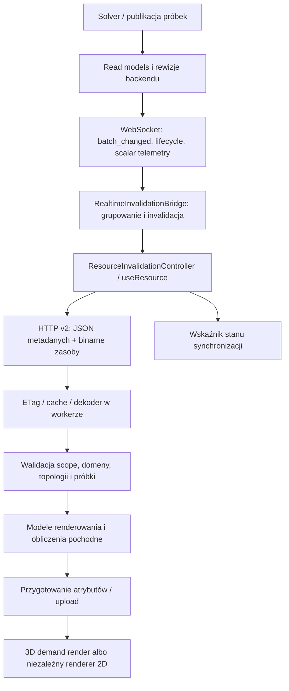

# Audyt synchronizacji i ciągłości wizualizacji aktywnej symulacji

Data: 2026-09-11. Zakres: Control Room, backend API v2, wizualizacja 3D, mapy 2D i wykresy podczas aktywnej symulacji.

## 1. Status i podstawa audytu

Audyt dotyczy **lokalnego `master` o commicie `fe10f8be750474025fb3c677aa6134c505a9d45d`**, z datą commita `2026-09-11T12:13:59+02:00`. Nie wykonywano fetch/pull; zgodność z aktualnym zdalnym branchem nie została potwierdzona.

Bieżący worktree `sp4-windows-launch-fix` ma HEAD `1f7fe4534d7854deb52c33e6c6cd4c2290681ad6` i różni się od master, również w obsłudze kolorów viewportu. Dlatego źródła do analizy wyeksportowano przez `git archive master` do `/tmp/fullmag-live-audit-master`. Numery linii w raporcie odnoszą się do tego commita, a nie do HEAD worktree. Windowsowy wskaźnik `.git` wymagał podania `--git-dir` i `--work-tree` przy odczytach z Linuksa; nie zmieniano konfiguracji Git.

**Wykonano:** przegląd pełnej ścieżki aktualizacji od publikacji/API do renderera, przegląd powiązanych testów oraz izolowane wykonanie wybranych funkcji z audytowanego master. Raport nie jest przeglądem każdej linii całego frontendu. Szczegółowo oceniono ścieżki mające znaczenie dla odświeżania danych i ciągłości obrazu; pozostałe moduły tylko na ich granicach z tym przepływem.

**NOT VERIFIED:** odtworzenie konkretnego migania w działającej aplikacji użytkownika, pomiary sieci/CPU/GPU, ciągłość klatek w przeglądarce oraz wykonanie FDM/FEM CPU/GPU. W trakcie audytu nie udostępniono adresu scenariusza ani śladu jego wykonania. Sesja nie miała narzędzia przeglądarkowego; odczyt nasłuchujących portów przez `ss` został ograniczony przez środowisko. Nie uruchamiano nowej symulacji ani builda tylko po to, by zastąpić nimi nieznany przypadek użytkownika.

Nie zmieniono kodu aplikacji, ustawień synchronizacji ani solvera. To audyt z planem naprawczym, a nie wdrożona poprawka. Zastane zmiany worktree zachowano; nie wykonywano commit/push/merge.

Poziomy dowodów użyte poniżej:

- **Kod:** mechanizm wynika bezpośrednio ze źródeł wskazanego commita.
- **Probe:** mechanizm wykonano w izolowanej diagnostyce źródeł; nie oznacza to testu React/WebGL.
- **Ryzyko:** kod dopuszcza scenariusz, ale nie potwierdzono jego wystąpienia u użytkownika.
- **Propozycja:** docelowe zachowanie lub bramka do wdrożenia, a nie stan obecny.

## 2. Najważniejsze wnioski

**Główny problem migania to ciągłość i spójność przyjmowania kolejnej klatki.** W komunikacji przeglądarka↔API pola, topologia i tabele już korzystają z binary data plane. **Wewnętrzny most CLI/runner→API nadal wysyła ciężkie payloady JSON** i również wymaga optymalizacji; nie wolno rozciągać oceny transportu przeglądarkowego na cały system.

W 3D istnieje retencja poprzedniego pola i zatwierdzonych kolorów. Audyt wykrył jednak luki na granicach identity, budowy kolorów i anulowania uploadu. W 2D zidentyfikowano bezpośrednią ścieżkę odmontowania canvasu przy oczekiwaniu na nową rewizję. Nie należy utożsamiać tych mechanizmów ani twierdzić, że wszystkie występują jednocześnie.

| Priorytet | Ustalenie | Dowód i znaczenie |
|---|---|---|
| P1 | R1: transportowe `ready` z odrzuconym payloadem pomija zgodny previous envelope | Kod + probe; kandydat na znikanie warstwy 3D w takim stanie |
| P1 | R2: globalny chunked color gate pomija zmianę pola przy tym samym build key | Kod + probe; ryzyko wyświetlania starych kolorów, niezależne od flashu |
| P1 | R3: przerwany upload nie ma pełnej transakcji/rollback; wektory mają rozdzielone tickety | Kod; widoczny skutek zależy od timingu i wymaga browser trace |
| P1 | R4: matcher retencji nie sprawdza snapshot/stage/phase/view | Kod + probe dla snapshot; ryzyko semantycznie błędnej retencji |
| P1 | S1: kolejne rewizje mogą stale anulować niedokończone pobieranie | Kod + probe mechanizmu; wymaga próby wolnej sieci/dekodowania |
| P1 | D1/D2: mapa 2D odmontowuje powierzchnię i nie zatwierdza wspólnie wymaganych warstw | Bezpośredni mechanizm w kodzie; brak live proof przypadku użytkownika |
| P2 | S4: hook maskuje błąd odświeżenia, gdy istnieją stare dane | Kod + probe; UI może pokazywać „syncing” po błędzie |
| P2 | S2/D3/D4: kolejki workerów, cache rewizji i invalidacja Default wymagają dopracowania | Kod/ryzyko; brak zmierzonych kosztów |
| P2 | T1/T3: duży JSON wewnętrznego mostu i koszt pracy pod lockami API | Kod; potencjalny koszt opóźnienia/pamięci, do zmierzenia na scenie |

Rekomendowana kolejność: odtworzyć zgłoszoną scenę z obserwacją klatek pośrednich; naprawić konkretne luki retencji/commit; zapewnić aktualność i spójność próbek; dopiero potem optymalizować transfer i alokacje na podstawie pomiaru. Skrócenie „2 sekund” przed tymi poprawkami może zwiększyć churn i anulowania zamiast poprawić płynność.

## 3. Jak działa obecna synchronizacja

Control Room rozdziela komponenty React, kernel zasobów i właściwe renderery. Komponenty modułów czytają dane przez resource hooks i `ControlRoomApi`; duże payloady należą do cache oraz modeli renderowania, nie do statusu sesji. 3D używa Three.js/R3F i jednego canvasu renderowanego na żądanie; mapa 2D ma własny renderer canvas/worker; wykresy korzystają ze wspólnej powierzchni ECharts. Kontrakt aktywnej zakładki wymaga montowania tylko używanego ciężkiego viewportu. Zmiana danych powinna aktualizować model/bufory, a nie odtwarzać cały moduł. Obecna mapa 2D narusza tę ostatnią zasadę w opisanym dalej przejściu.



### 3.1. Zdarzenia i zegary

Frontend nie powinien być opisywany jako „co dwie sekundy pobiera całą scenę”. Obecny model opiera się na invalidacji konkretnych zasobów:

1. `RealtimeClient` odbiera JSON przez WebSocket, aktualizuje politykę komunikacji z `hello`, przekazuje zdarzenie do bridge i zapamiętuje `seq`. Przy reconnect używa `after_seq` (`kernel/realtime/RealtimeClient.ts:58–78,157–204`).
2. `RealtimeInvalidationBridge` grupuje invalidacje do callbacka `requestAnimationFrame`. Odróżnia katalog pól od próbek; obsługuje exact query, zbiór quantities i broad invalidation. Zdarzenie próbki nie musi unieważniać topologii ani statusu sesji (`RealtimeInvalidationBridge.ts:418–428,489–614`).
3. `ResourceInvalidationController` powiadamia subskrybentów kluczy i chroni przed cofnięciem numerycznej rewizji (`kernel/resources/ResourceInvalidationController.ts:39–95`).
4. `useResource` korzysta ze współdzielonego store i stabilnych subskrypcji. Snapshot odświeżanego zasobu zachowuje poprzednie `data`, oznaczając je jako `stale`; błąd także nie usuwa danych (`resourceState.ts:13–47`, `useResource.ts:97–132,586–623`).
5. Runtime deduplikuje ten sam request, odkłada pobieranie do dozwolonego terminu, obsługuje retry i odrzuca odpowiedzi anulowanych sekwencji. Dla pól 3D włączono `abortStaleInflight: true` (`ResourceRuntimeStore.ts:450–545,595–668`, `viewport3dResources.ts:1444–1452`).

Polityka domyślna, nadpisywana konfiguracją backendu, znajduje się w `kernel/realtime/communicationPolicy.ts:22–41`:

| Parametr | Domyślna wartość | Znaczenie |
|---|---:|---|
| `fieldSamplePublishMs` | 2000 ms | Kadencja publikacji pól; frontend używa jej także jako minimalnego odstępu refetch |
| `scalarTelemetryPublishMs` | 200 ms | Szybsza ścieżka małej telemetrii skalarnej |
| `tableRowsMinRefetchMs` | 1000 ms | Ograniczenie odświeżania tabel |
| `lifecycleCoalesceMs` | 250 ms | Grupowanie zdarzeń lifecycle |
| `statusRefreshMs` | 5000 ms | Minimalny odstęp odświeżania statusu w hooku; sam nie jest pętlą pollingu |
| `wsHeartbeatMs` / `wsReconnectMs` | 15000 / 5000 ms | Polityka utrzymania/odtwarzania połączenia |

Ważne: minimalny odstęp refetch jest liczony od **zakończenia** poprzedniego pobierania (`ResourceRuntimeStore.ts`, funkcja `refetchDelayMs`), nie od jego rozpoczęcia. Po opóźnionym transferze/UI decode kolejne pobranie może nastąpić później niż nominalna kadencja publikacji. To ogranicza obciążenie, ale jest też źródłem dodatkowego opóźnienia.

### 3.2. Co faktycznie pokazuje licznik

`viewport3dRefreshCountdown.ts:79–111,220–239` szacuje następny odstęp na podstawie poprzednich dostaw: 35% poprzedniego oszacowania + 65% nowej obserwacji, z zakresem 200–5000 ms. Startuje od 1000 ms. `Viewport3DModule.tsx:3118–3173` aktualizuje lokalny stan wskaźnika; nie wywołuje z niego pobierania zasobów.

Wskaźnik `updated` ma własny czas 650 ms. To animacja wskaźnika, **nie dowód resetowania shadera**. Komunikat „Next field sync” jest prognozą, nie gwarancją przyszłej dostawy ani potwierdzeniem, że dana próbka została już narysowana przez GPU.

Propozycja: prezentować wiek ostatniej **wyświetlonej** próbki, stan „pobieranie/przygotowanie” i opóźnienie względem najnowszej publikacji. Prognozę, jeśli pozostaje, oznaczyć jako szacunkową. Szczegółowe numery rewizji należą do diagnostyki.

## 4. Format danych, transport i koszt

### 4.0. Dwie granice transportu

| Granica / zasób | Stan w audytowanym kodzie | Ocena |
|---|---|---|
| CLI/runner → API: snapshot, runtime, pola | HTTP POST z JSON; tablice f64 wewnątrz payloadu | Istotny pozostały koszt serializacji, kopiowania i parsowania |
| API → browser: status, katalog quantities, meta | JSON z identyfikatorami, rewizjami i metadanymi | Prawidłowy control plane; nie wymaga zamiany całości na binaria |
| API → browser: field vector/scalar | FMVP v2/v3, f64 little-endian; v3 z metadata FMMI, tożsamością domeny/topologii i indeksami | Binary data plane już istnieje |
| API → browser: topologia | FMMT z walidacją i limitami | Rozdzielona od zmian samych wartości pola |
| API → browser: planar scalar/vector/mask/mesh/export | Binarne bufory i PNG, JSON meta/probe | Format zasadniczo właściwy; problemem jest lifecycle/commit klienta |
| API → browser: table rows | FMTB przez `rowsBinary` | Właściwa baza dla okien/decymacji wykresów |
| API → browser: WebSocket | Tekstowe zdarzenia lifecycle/invalidation oraz mała telemetria scalar | Nie jest kanałem wielkich tablic pól |
| Wyjątek: material-field detail | Pełne wartości pola mogą być w JSON | Kandydat na descriptor + osobny binarny zasób, po pomiarze użycia |

Dowody: `crates/fullmag-cli/src/control_room.rs:1620–1645,1715–1732`; `crates/fullmag-api/src/main.rs:2466–2507,2919–3049`; `crates/fullmag-api/src/field_store.rs:157–214,304–383`; frontend `kernel/api/codecs/fieldVectorCodec.ts:25–116`, `kernel/resources/studyRuntimeResources.ts:2263–2337`; backend `router_v2/handlers/data/material_fields.rs:136–239`.

### T1. Ciężki JSON pozostaje wewnątrz systemu — P2, kod; koszt niezmierzony

CLI rzeczywiście wysyła snapshot i pola przez `.json(...)`, nie jest to tylko nieużywany typ endpointu (`crates/fullmag-cli/src/control_room.rs:1624–1638,1719–1729`). API przyjmuje te zasoby przez `Json<...>` i dopuszcza body do 128 MiB (`crates/fullmag-api/src/main.rs:82,2505–2507,2920–2922`). Limit transportowy nie oznacza, że każdy update ma taki rozmiar. `latest_fields`, preview i magnetyzacja zawierają tablice danych (`crates/fullmag-api/src/types.rs:564–621,1091–1196`).

**Ważne istniejące zabezpieczenie:** publikacja sieciowa jest już odseparowana od solvera przez `CurrentLivePublisher`, osobny wątek i `sync_channel(1)` (`crates/fullmag-cli/src/live_workspace.rs:1600–1617,1666–1694`). Pending state jest koalescowany; kod zachowuje ciężkie dane między cienkimi aktualizacjami (`:1216–1264`). Nie należy proponować „dodać wątek publishera” jako brakującej funkcji ani twierdzić, że każdy krok solvera bezpośrednio czeka na HTTP.

Nadal kosztują materializacja próbek w pętli runnera, klonowanie stanu publishera i JSON. Runner ma krokowy warunek preview (`crates/fullmag-runner/src/interactive_runtime.rs:43–64`), z domyślnym preview co 50 kroków i `max_points=16384` (`crates/fullmag-runner/src/types.rs:1872–1905`); nie jest to uniwersalny limit wszystkich pól/scopes. W obserwowanej ścieżce snapshotowanie pola poprzedza callback `on_step` (`interactive_runtime.rs:5108–5138`). Publisher ma jeszcze własny min interval/fast mode i klonuje payload (`live_workspace.rs:5206–5237`), a WebSocket oraz klient swoje osobne cadences. To kilka zegarów, nie jedna pętla „2 s”.

Naprawa: zachować istniejącą koalescencję i własność publishera; zmierzyć osobno snapshot/materialization, clone, serialize, HTTP, deserialize/apply. Wprowadzić wersjonowany binarny frame dla wielkich tablic, cienki manifest JSON i limity liczby próbek/bajtów przed alokacją. Nie mieszać migracji wewnętrznego mostu z publicznym kontraktem v2 ani nie budować nowej równoległej ścieżki solvera.

### T2. Spójność pojedynczego apply istnieje, ale nie jest transakcją całego cyklu — P2, kod/ryzyko

Snapshot oraz field frame korzystają z clone/apply/swap (`crates/fullmag-api/src/session.rs:1956–1963,2321–2328`). Publikacja terminalna ma dodatkową walidację run/sequence i odrzuca stare generacje (`:1913–1954`). To istotne zabezpieczenia.

Zwykły cykl delta wysyła kolejno scalar, session, runtime i fields jako osobne żądania (`crates/fullmag-cli/src/control_room.rs:1787–1813`); nie ma jednego commit wszystkich tych odczytów. Zwykłe field merge, poza trybem terminal replacement, nadpisuje quantities w kolejności przyjścia (`session.rs:2459–2463`). Frame ma opcjonalne `field_generation`, lecz walidacja sekwencji jest związana z `replace_latest_fields`, a nie obowiązkowa dla każdego live frame (`types.rs:1183–1202`, `session.rs:1919–1922`).

Obecny pojedynczy publisher wysyła sekwencyjnie, co ogranicza reorder w zwykłym przebiegu. **Nie potwierdzono cofania pola na produkcji.** Ryzyko dotyczy spóźnionej publikacji, restartu, retry lub przyszłych równoległych producentów.

Naprawa: source/run/frame identity i monotonic admission dla każdego frame oraz spójne znaczniki czasu/snapshotu na zasobach odczytowych. Testy B→A i zmiany run; odczyty meta/pola/topologii pomiędzy częściami delta nie mogą przedstawiać niespójnego zestawu jako jednej bieżącej klatki.

### T3. ETag chroni transfer, ale nie zawsze eliminuje przygotowanie danych i blokady — P2, kod

Field-vector tworzy silny ETag z quantity, session, field/domain revision, component, scope, sampling, snapshot i topology identity (`crates/fullmag-api/src/router_v2/handlers/data/fields.rs:4825–4853`). Projection cache istnieje; właściwa projekcja jest wykonywana poza jego mutexem (`:4912–5007`).

Jednocześnie handler posiada read guard `current_live_state` podczas wcześniejszego przygotowania i walidacji scope (`:4525–4637,4743–4823`), a sampling/indeksy są przygotowane przed lookup projection cache (`:4862–4929`). Aktualizacja API trzyma write guard podczas budowy kolejnego stanu i preview (`crates/fullmag-api/src/main.rs:3142–3178,3218–3237`). Długie operacje mogą opóźnić producenta lub czytelników; czasów oczekiwania nie zmierzono. Komentarz „outside the lock” w projekcji dotyczy cache locka, nie stanowi dowodu braku wszystkich innych blokad wcześniej w handlerze.

Nierówna obsługa warunkowych odczytów: domain meta/layout zwracają JSON bez lokalnej obsługi ETag (`handlers/data/domain.rs:49–57,169–176`); maski i memberships budują dane/hash przed sprawdzeniem warunku (`domain.rs:201–425`, `handlers/data/fdm_region_membership.rs:171–252`); planar PNG nie ma analogicznej ścieżki conditional GET (`handlers/data/planar_fields.rs:926–951`).

Naprawa: krótko uchwycić immutable snapshot/provenance, zwolnić lock przed kosztowną pracą/I/O, utrzymywać revision-keyed przygotowane reprezentacje. Sprawdzać 304 możliwie wcześnie na znanym identity. Priorytet nadawać według częstości i kosztu endpointu, nie mechanicznie dodawać cache do każdego małego JSON-a.

### T4. Preview fallback trzeba rozróżnić od canonical field-store — hipoteza, nie diagnoza flashu

Terminal replacement wymaga `clear_preview_cache`; przy wyłączonym fallback i nieudanej budowie `next.preview` może pozostać `None` (`session.rs:1923–1931`, `main.rs:3228–3237`). Aktualizacja odbywa się pod lockiem, więc nie ma podstaw do twierdzenia, że każdy czytelnik widzi pusty stan *w środku* rebuilda. Widoczny może być dopiero zatwierdzony wynik. To także ścieżka terminalna, nie dowód okresowego resetu co 2 s.

W reprodukcji sprawdzić, czy konsument korzysta z canonical field-store, czy z preview/fallback, oraz czy zasób zwraca 202/204/409. Zachowywać zgodny last-good frame po stronie prezentacji, lecz nie maskować celowego usunięcia lub niezgodności danych po stronie backendu.

### T5. Kontrakt binarny i WebSocket wymagają testów granicznych — P2, kod/ryzyko

FMVP ma stałe pole quantity ID długości 16 bajtów; writer obcina dłuższy identyfikator (`crates/fullmag-api/src/field_store.rs:177–184`). Nie wykazano, że m/H_demag trafiają na ten limit. To luka dla rozszerzeń katalogu: walidować długość/encoding przed zapisem lub wersjonować format. Walidacja metadanych ma limity długości, lecz obliczenia sumy rozmiarów i mnożenia indeksów wymagają konsekwentnego checked arithmetic i limitu bajtów przed alokacją (`:187–212`).

WebSocket ma osobne klasy publikacji/QoS i grupowanie zmian (`crates/fullmag-api/src/schemas/realtime.rs:82–134`, `main.rs:2218–2375`). Klucz merge zmian nie zawiera domain generation ani `broad` (`main.rs:2027–2053`). Samo pominięcie tych pól nie dowodzi błędnego zdarzenia; należy przetestować broad→exact i zmianę generacji w jednym oknie, by sprawdzić, czy koalescencja nie traci wymaganej invalidacji. Do tego replay/resync/gap oraz 200→304/202/204/409 na zasobach. Nie uzasadnia to przesyłania pełnego pola przez WebSocket.

### 4.1. Co już jest zoptymalizowane po stronie klienta

- Typowany transport pobiera `ArrayBuffer`; odpowiedzi 304/204/202 rozróżnia od normalnego payloadu (`kernel/api/ControlRoomApi.ts:3465–3552`).
- `loadCachedBinaryResource` rewaliduje ETag i ponownie używa tego samego decoded payloadu przy 304. 202 uruchamia obsługę oczekiwania; dla wskazanych hooków 204 może zachować ostatni cache (`viewport3dResources.ts:823–927`).
- Duże bufory trafiają do workera z transferem własności `ArrayBuffer`, a wynik wraca listą transferables (`binaryDecodeScheduler.ts:190–205`, `binaryDecodeWorker.ts:23–32`). To nie jest JSON-owa kopia wielkich tablic.
- FMVP udostępnia wartości jako widok `Float64Array` na buforze (`codecs/fieldVectorCodec.ts:100–115`). Nie oznacza to braku późniejszych kopii przy mapowaniu na reprezentację GPU.
- Zestawy requestów 3D mają domyślny limit czterech równoległych żądań i priorytet wybranego targetu (`viewport3dResources.ts:576–618`). Limit jest lokalny dla wywołania kolekcji, nie globalny dla wszystkich konsumentów aplikacji.
- Cache 3D ma osobne deklarowane budżety: topologia 96 MiB, pola 128 MiB, quality data 48 MiB (`viewport3dResources.ts:57–64,473–474`). To nie jest limit całej pamięci aplikacji ani GPU. `ResourceCache.set` dopuszcza pojedynczy zasób większy od budżetu (`kernel/resources/ResourceCache.ts:130–149`).

### 4.2. Binarność nie usuwa kosztu całej ścieżki

Przy `N` punktach i `C` rzeczywistych komponentach sam payload f64 ma około `8 × N × C` bajtów, bez metadanych i indeksów. Milion trójskładnikowych wektorów to około 24 MB; przy dostawie co 2 s około 12 MB/s na jedną quantity, przed kompresją i narzutami. Dwie takie quantities to około 24 MB/s. **To przykład rachunkowy, nie pomiar sceny użytkownika.**

Dochodzi pamięć ostatniej próbki, nowej próbki, wyników mapowania, atrybutów CPU, buforów GPU i ewentualnego stagingu. Dopiero zmierzenie wszystkich tych etapów pozwala wybrać optymalizację.

Kolejność: ograniczyć żądania do potrzebnych scopes/components, ponownie używać niezmienionej topologii i atrybutów, unikać kopiowania i niepotrzebnych przebudów, następnie profilować kompresję lub dedykowaną reprezentację wizualizacyjną f32. Zmiana f64→f32 wymaga osobnego kontraktu reprezentacji i kontroli błędu; nie wolno po cichu zmieniać precyzji danych naukowych lub eksportu. Binarne delty wymagają bazowej rewizji i pełnego snapshotu do recovery. Przeniesienie ciężkich payloadów do WebSocket samo nie naprawi retencji ani uploadu i naruszałoby obecny podział odpowiedzialności v2.

## 5. Ustalenia dotyczące ciągłości i renderowania 3D

### 5.1. Istniejące zabezpieczenia, których nie należy usuwać

`MeshPartLayer.tsx:813–820,908–912` zachowuje zgodny scalar buffer i rozdziela żądany pipeline od zatwierdzonego. `useViewport3DScalarColorUpload.ts:249–263,438–452` publikuje nowy bufor w `onVisible`, po wykonaniu zaplanowanych chunków. Retencja sprawdza geometrię i retention key (`:82–103`). To już jest częściowa implementacja last-good frame; diagnoza „każde loading zeruje shader” byłaby niezgodna z master.

Topologia i pole mają oddzielne ścieżki. Geometria jest przyjmowana po ukończeniu własnego uploadu (`useViewport3DGeometryUpload.ts:88–137`). Canvas działa z `frameloop="demand"`, a jego React key zależy od ustawień antialias/preserveDrawingBuffer, nie rewizji pola (`Viewport3DModule.tsx:1928,2697–2699`, `viewport3dTypes.ts:18`). Nie znaleziono dowodu, że co dwie sekundy cały canvas jest odmontowywany.

### R1. `ready` z odrzuconą odpowiedzią może usunąć zgodną poprzednią warstwę — P1, kod + probe; efekt wizualny nieweryfikowany

`resolveViewport3DFieldVectorCollectionLastGood` przy `status === "ready"` bierze bieżący envelope tylko wtedy, gdy jego identity pasuje do requestu. Gdy envelope nie pasuje lub go brakuje, wykonuje `continue`, pomijając poprzedni zgodny envelope (`viewport3dResources.ts:359–397`, szczególnie `:385`). Fallback z `previous` działa dla `error/loading/stale`, lecz nie dla tego przypadku.

Podobna granica występuje dla pola głównego: `useViewport3DSceneModel.ts:4457–4478` uzależnia przyjęcie od `ready + identity match`, a retencję od `status !== ready`. Odrzucony envelope przy ready daje pusty `displayedFieldVector`.

**Warunek wystąpienia:** odpowiedź zakończona transportowo, lecz brakująca albo niezgodna z oczekiwanym kontraktem pola. Zwykły poprawny field refresh nie musi wchodzić w tę gałąź. To konkretny kandydat na utratę warstwy, nie dowód jego wystąpienia co dwie sekundy u użytkownika.

Probe funkcji potwierdził pustą kolekcję dla `ready`, bieżącego envelope innej quantity i poprzedniego envelope pasującego do żądanej quantity.

Naprawa: walidacja odpowiedzi powinna poprzedzać oznaczenie jej jako przyjętej. Przy błędnej nowej odpowiedzi zachować poprzednią klatkę **tylko jeśli nadal jest zgodna z aktualnym targetem, domeną i semantyką**, zgłosić błąd/stale i uruchomić kontrolowane recovery. Przy remesh lub zmianie sesji odrzucenie starego pola pozostaje prawidłowe. Test: poprawna A → odpowiedź B z niezgodnym identity → poprawna C; sprawdzenie widoczności A w całym przejściu.

### R2. Globalna ścieżka chunked colors może pominąć nową próbkę — P1, kod + probe gate

`useViewport3DChunkedScalarColors.ts:528–537` buduje globalny `modesKey` z trybu koloru i zakresu. `combinedModesKey` dodaje part keys tylko wtedy, gdy istnieją (`:687`). Gate startu otrzymuje ten klucz (`:769–781`); `shouldStartChunkedScalarColorBuild` przy podanych kluczach porównuje wyłącznie ich równość i nie porównuje zmienionego obiektu `fieldVector` (`:279–305`).

W globalnej ścieżce, bez zmieniającego się part key, nowa próbka z tą samą topologią, liczbą punktów, trybem i zakresem może nie rozpocząć nowej budowy kolorów. `fieldRevision` pojawia się w kluczu właściwego zadania dopiero po przejściu tego gate (`:856–879`). Part keys zawierają tożsamość obiektu pola (`:652–668`), więc nie należy rozszerzać tego ustalenia na wszystkie targety.

Skutek: nieaktualne kolory mimo nowych danych; może wyglądać jak zatrzymana/skokowa animacja. **Nie jest to bezpośredni dowód migania.** Szczególnie istotny test to stały manual range i wartości zmieniające się wewnątrz tego zakresu.

Probe `shouldStartChunkedScalarColorBuild` potwierdził `false` dla nowego obiektu pola, przy tym samym niepustym build key, `eligibleForChunkedBuild=true` i `pending=false`. Nie wykonywał całego hooka React.

Naprawa: globalny build key musi uwzględniać semantyczną tożsamość i rewizję/buffer ID pola. Klucz retencji powinien pozostać osobny, by nowa rewizja nie usuwała poprzedniego obrazu. Potrzebny test całego gate/hooka dla A→B przy stałym zakresie; test samego wewnętrznego build reference tego nie zapewnia.

### R3. Anulowanie uploadu nie zapewnia przywrócenia poprzednich atrybutów — P1, kod/ryzyko wizualne

Plan scalar upload ponownie używa istniejącego `BufferAttribute` i kopiuje jego tablicę partiami (`useViewport3DScalarColorUpload.ts:539–575,579–610`). `needsUpdate` jest ustawiane przy `onVisible`, co chroni typowy ukończony przebieg. Nie należy utożsamiać każdej zmiany tablicy CPU z natychmiastową zmianą pikseli GPU.

Jednak manager wywołuje rollback tylko dla `failed`, nie dla `aborted` (`build-engine/gpu/viewport3dGpuUploadManager.ts:252–269`). Scalar rollback usuwa nowo podpięte atrybuty, ale nie rekonstruuje poprzednich wartości istniejącego atrybutu (`useViewport3DScalarColorUpload.ts:528–537`). Przerwane przygotowanie może pozostawić częściowo zmienioną tablicę CPU. Nie wykazano, że każdy taki stan staje się widoczny; zależy to od kolejnego uploadu, renderu i innych konsumentów.

Wektory dodatkowo przygotowują kolory i macierze w oddzielnych ticketach (`layers/VectorFieldLayer.tsx:851–922,945–1079`). Mają funkcje rollback, ale wspólny manager nie uruchamia ich przy anulowaniu. Brak wspólnego commit obu ticketów zwiększa ryzyko mieszaniny starej i nowej reprezentacji.

Naprawa: jawna transakcja uploadu/commit/abort. Wybrać staging/copy-on-write albo podwójne atrybuty z kontrolowanym budżetem; przy mutacji w miejscu przywracać poprzedni stan także po abort. Macierze, kolory i count wektorów przyjmować razem, gdy reprezentują tę samą próbkę. Nie wystarczy sama zmiana warunku `failed` na `failed || aborted`, jeżeli rollback nie umie odtworzyć danych.

Test: A jest widoczna → B zapisuje pierwszy chunk → B anulowana przez C → dodatkowy render kamery → C kończy. Asercje: brak zerowania/count=0, brak częściowych B, poprawne zwolnienie zasobów i kompletne C. Potrzebny browser/WebGL proof, a nie wyłącznie wykonanie `onVisible` na świeżej geometrii.

### R4. Walidacja retencji nie obejmuje całej semantyki zapytania — P1 dla replay/przełączeń, kod + probe; integracja nieweryfikowana

`viewport3DFieldVectorMatchesRequestIdentity` sprawdza quantity, scope, expected generation/carrier i component (`viewport3dResources.ts:267–342`). Nie sprawdza snapshot/stage/phase/view, chociaż takie selektory występują w `FieldVectorQuery` (`kernel/api/apiTypes.ts:884–900`). Normalne klucze query rozdzielają requesty; ustalenie **nie oznacza**, że wszystkie wpisy cache mają wspólny klucz. Ryzyko dotyczy przyjęcia previous envelope w mechanizmach retencji targetu, jeśli obejmą zmianę tych selektorów.

Probe matchera zaakceptował envelope z `snapshotId=old` wobec requestu `snapshot_id=new`, gdy pozostała tożsamość pasowała.

Naprawa: określić kompletne identity dla live i replay oraz osobną politykę „poprzednia próbka tej samej quantity” vs „poprzednia quantity/etap/faza”. Retencja nie może pokazywać starej fazy lub snapshotu pod etykietą nowego. Testować zmianę każdego selektora przy niezmienionej geometrii.

### R5. Ponowne etapowanie sceny ukrywa field layers, jeśli zmienia się klucz topologii — P2, hipoteza do pomiaru

`Viewport3DScene.tsx:672–794` ma etapowe włączanie warstw. Klucz obejmuje topologię/model (`:722–747`); jego zmiana resetuje etap i odracza field-driven layers przez kolejne RAF-y. Jest to zamierzone przy zmianie geometrii. Audyt nie wykazał, że zwykła nowa próbka na pewno zmienia ten klucz.

W śladzie przypadku użytkownika porównać mesh revision, obiekt topology model, stage i field revision. Jeśli field-only update uruchamia ten reset, naprawić właściciela rewizji/tożsamości topologii. Nie usuwać etapowania potrzebnego przy rzeczywistym remesh.

## 6. Synchronizacja, kolejki i diagnostyka

### S1. Możliwe zagłodzenie pobierania przez ciągłe anulowanie — P1, ryzyko potwierdzone mechanizmem

Hooki pól ustawiają `abortStaleInflight: true` (`viewport3dResources.ts:1445,1637,1882–1885,2112–2115`). `ResourceRuntimeStore.ts:506–513` anuluje niedokończony request przy nowej rewizji, gdy nie zatrzymuje tego jeszcze throttle. Jeżeli kolejne rewizje stale wyprzedzają ukończenie transferu/dekodowania, klient może długo nie przyjąć żadnej nowej próbki.

Izolowany probe odtworzył cztery niedokończone rewizje: pierwsze trzy sygnały zostały anulowane, dane przyjęto dopiero po zakończeniu ostatniej. Dowodzi to mechanizmu anulowania, **nie** wystąpienia trwałego zagłodzenia w konkretnym runtime.

Propozycja: dla tej samej tożsamości domeny/quantity/scope kończyć jedno zgodne pobranie, utrzymywać tylko najnowszą rewizję oczekującą i od razu kontynuować po zakończeniu. Zmiana sesji, domeny lub semantyki musi nadal anulować niezgodną pracę. Rozdzielić cadence publikacji od budżetu transferu; mierzyć `published → fetched → decoded → displayed`, liczbę anulowań i wiek widocznej próbki. Nie tworzyć nieograniczonej kolejki wszystkich pośrednich klatek.

### S2. Brak backpressure dekodowania i niepełny pomiar kolejki — P2, kod/ryzyko

`BinaryDecodeWorkerClient.pending` jest mapą bez jawnego limitu zadań/bajtów. API zadania nie przyjmuje `AbortSignal` ani rewizji do koalescencji (`binaryDecodeScheduler.ts:5–10,173–205`). Przerwanie requestu po oddaniu payloadu workerowi nie oznacza usunięcia jego pracy z kolejki. Rzeczywisty wzrost zależy od tempa napływu i czasu decode; wycieku pamięci nie wykazano.

`queueWaitMs` jest wyliczane tuż przed wysłaniem do workera (`binaryDecodeScheduler.ts:77–91`), więc nie mierzy oczekiwania w jego kolejce. `durationMs` obejmuje oczekiwanie na wynik razem z pracą i komunikacją. Obecne metryki nie wystarczają do rozróżnienia tych kosztów.

Propozycja: budget in-flight bytes/jobs wspólny dla binary decode, koalescencja bezpiecznych zadań według klucza/rewizji, identyfikator anulowania oraz czasy enqueue/start/end raportowane z workera. Nie utożsamiać limitu czterech HTTP w jednej kolekcji z globalnym limitem całego pipeline.

### S3. Stan transportu i stan widocznej klatki wymagają osobnych miar — P2, kod

Cache, snapshot hooka, gotowość modelu i obecność atrybutów renderera reprezentują różne etapy. `ready` na jednym z nich nie dowodzi widocznej kompletnej klatki. Retencja istnieje na kilku poziomach, lecz musi zachować wspólną tożsamość i być sprawdzona jako cały łańcuch. Sam licznik synchronizacji, screenshot po ustabilizowaniu albo zdrowy WebGL nie wykrywają krótkiego powrotu do materiału bazowego.

Propozycja: osobno raportować `requestedRevision`, `receivedRevision`, `preparedRevision`, `displayedRevision`, `sampleTime`, `displayedAt`, `staleReason`, `refreshError`. Zachować ostatnią poprawną klatkę i komunikat o jej wieku; nie przedstawiać jej jako bieżącej tylko dlatego, że bufor jest kompletny.

### S4. Hook może ukryć błąd odświeżenia, gdy ma stare dane — P2, kod + probe

`useResource.ts:599–622` zwraca niezmieniony stan błędu dla zakończonej rewizji tylko wtedy, gdy `state.data === null` (albo działa `pauseLoad`). Przy zachowanym payloadzie i zwykłym odświeżaniu przechodzi do `markResourceLoading`, które zeruje `error` i zwraca `stale` (`resourceState.ts:17–22`). Dotyczy wspólnej funkcji używanej przez `useResource` i `useResourceSelector`.

Probe wykonał ten przypadek: store miał `error` z ostatnią poprawną próbką, a stan widoczny hooka zawierał tę próbkę, `status: stale` i `error: null`. To nie dowodzi migania, ale utrudnia odróżnienie normalnego pobierania od nieudanego odświeżenia i może pozostawiać UI w pozornym „syncing”.

Propozycja: niezależne `dataStatus` i `refreshStatus/refreshError`, ewentualnie zachowanie błędu zakończonego odświeżenia wraz z last-good data. Test powinien obejmować trwały błąd po udanej pierwszej próbce, brak automatycznego retry, ręczny retry i recovery.

## 7. Mapy 2D i wykresy

### D1. Mapa 2D odmontowuje renderer podczas oczekiwania na nową rewizję — P1, bezpośredni mechanizm w kodzie

`kernel/resources/planarFieldResources.ts:283–317,320–358` umieszcza rewizję w `resourceKey` (`#revision=...`). Nowa rewizja staje się nowym wpisem `ResourceRuntimeStore`, początkowo bez danych. Ogólna retencja `markResourceLoading` chroni poprzedni payload przy tym samym kluczu — nie przenosi go automatycznie między tymi wpisami.

Ponadto `FieldMapModule.tsx:171–204` dopuszcza canonical sample wyłącznie przy `meta.status === ready`. W stanie oczekiwania wyłącza zależne scalar/mask/vector hooks. `renderModel` wymaga danych meta i scalar (`:247–302`). Przy ich braku rodzic zwraca `FieldMapStatus` zamiast `PlanarSurface` (`:478–485`).

Cleanup odmontowanego `PlanarSurface` zwalnia worker i renderer oraz zeruje canvas (`renderer/usePlanarSurfaceRenderer.ts:47–87`, `renderer/planarRenderer.ts:282–298`). Po dostawie danych montuje się nowa powierzchnia. **To bezpośrednia ścieżka wyczyszczenia obrazu przy odświeżaniu 2D**, znacznie silniejszy dowód niż sam fakt, że wystąpił rerender React. Nie dowodzi jednak, że zgłoszenie użytkownika dotyczyło mapy 2D; opis shaderów sugeruje przede wszystkim 3D.

Naprawa: utrzymać `PlanarSurface` dla tej samej semantycznej tożsamości widoku; przechowywać committed frame niezależnie od pending meta/scalar. Zmiana rewizji próbki nie może być powodem odmontowania. Oddzielić logiczny klucz zasobu od żądanej rewizji albo jawnie przenosić ostatnią zgodną klatkę między wersjami. Przy zmianie monitor/quantity/domeny sprawdzić zgodność zamiast bezwarunkowej retencji.

Dobry punkt wyjścia już istnieje: sam `planarRenderer.ts:252–307` potrafi zachować stary raster podczas oczekiwania na colorizer. Obecnie rodzic może zniszczyć ten renderer wcześniej.

### D2. Klatka 2D nie ma wspólnej granicy commit wymaganych warstw — P1, kod/ryzyko

Meta, scalar, maska, vectors i mesh overlay są niezależnymi zasobami (`FieldMapModule.tsx:165–216`). Canonical query pochodzi z meta, co jest poprawnym zabezpieczeniem próbkowania. Nie ma jednak wspólnego przyjęcia wszystkich włączonych warstw: model wymaga przede wszystkim meta/scalar, a pozostałe dane dopuszcza jako null (`:247–302`). Mogą pojawiać się później, powodując przejściowe znikanie overlay. Ewentualne mieszanie rewizji trzeba sprawdzić na metadanych rzeczywistych odpowiedzi; nie stwierdzono go jako wyniku live.

Naprawa: gotowość zdefiniować dla zestawu warstw faktycznie włączonych w tym widoku. Commit scalar/range/mask i wymaganych overlays dopiero po sprawdzeniu `sample_token`, rewizji pola i reprezentacji. Opcjonalnie dopuszczona niezależna warstwa musi mieć jawne oznaczenie stanu/czasu. Grupowanie invalidacji w RAF nie zastępuje transakcji przyjęcia odpowiedzi HTTP.

### D3. Cache i worker 2D powiększają koszt aktualizacji — P2, kod/ryzyko

Cache planar korzysta z klucza obejmującego rewizję (`planarFieldResources.ts:283–290,538–585`); przy nowej rewizji powstaje nowy wpis bez poprzedniego ETag. Rozdzielenie identity i freshness pozwoli rewalidować istniejącą reprezentację i zachować widoczny bufor. Nie wymuszać 304 tam, gdzie dane rzeczywiście zmieniły się — wtedy nowy payload jest prawidłowy.

Colorizer klonuje wartości i maskę przed transferem do workera (`renderer/planarColorizer.ts:19–22,49–66`), chroniąc w ten sposób dane używane przez bieżący widok przed detachment. Odrzuca stare **wyniki** według ID (`:31–33`), ale worker nadal synchronicznie wykonuje każde wysłane zadanie (`planarRendererWorker.ts:8–10`). To podobne ryzyko kolejki jak S2, z dodatkowym kosztem kopii. Nie wykazano rzeczywistego wycieku lub przekroczenia budżetu.

Naprawa: co najwyżej jedno wykonywane i jedno najnowsze oczekujące zadanie colorize, współdzielenie własności lub kontrolowany pool buforów tam, gdzie zachowuje poprawność, telemetryczne liczniki pending bytes i czasu. Nie usuwać kopii bez zastąpienia kontraktu własności ArrayBuffer.

### D4. Zdarzenie `planar_fields` nie obejmuje jednoznacznie źródła Default — P2, kod/ryzyko

Matcher w `RealtimeInvalidationBridge.ts:522–539` wymaga segmentu `/planar-monitors/`, a źródło Default buduje `/planar-default/` (`kernel/api/fieldQueryIdentity.ts:300–327`). Inne zdarzenia `fields/samples` mogą odświeżyć tę ścieżkę. Nie jest więc udowodnione, że Default w ogóle się nie aktualizuje, lecz nie ma kompletnej wspólnej obsługi tego rodzaju eventu.

Naprawa: testy kontraktu `planar_fields` dla obu źródeł oraz matcher używający kanonicznej tożsamości źródła. Odróżnić przypadek eventu katalogu od zmiany próbki; uniknąć broad invalidation wszystkich monitorów.

### D5. Wykres opublikowanego datasetu i wykres live to różne kontrakty — FYI / decyzja produktowa

`analysis-plots/hooks/useAnalysisDatasetData.ts:13–23,37–69` świadomie wybiera opublikowane tabele i przypina pierwszy odczyt. Po pinning wyłącza następne fetch rows przez `!pinnedForDataset`. Test `useAnalysisDatasetData.test.tsx:46–82` oraz `scripts/smoke-analysis-plots.mjs:169–186` wymagają zachowania przypiętej rewizji. Brak ruchu takiego wykresu nie powinien być diagnozowany jako ten sam błąd co miganie viewportu.

Jeśli produkt ma oferować śledzenie aktywnej symulacji w tym miejscu, dodać jawne „Follow live” lub odwołanie do istniejącego `live-charts`, zachowując zamrożony tryb opublikowanych analiz. Nie zmieniać tego kontraktu przypadkowo przy optymalizacji synchronizacji.

Wspólna powierzchnia ECharts już pokazuje właściwy wzorzec: owner tworzony raz, aktualizacja modelu bez remountu i cleanup observerów (`shared/analysis-charts/EChartsCanvasSurface.tsx:99–225`). Istnieje test 100 rewizji bez remountu i blokującego loading overlay (`EChartsCanvasSurface.test.tsx:89–146`). To wzorzec do wykorzystania, nie nowo wykonana kwalifikacja.

`live-charts` ma odrębny, właściwy dla aktywnej symulacji przepływ: `hooks/useLiveTableData.ts:50–80` pobiera binarne okna w trybie following, scala je i zachowuje dane podczas pauzy; `useLiveChartsController.ts:98–100,164–172` rozdziela żądaną i widoczną rewizję. Test `LiveChartsModule.resource.integration.test.tsx:194–249` obejmuje zachowanie wartości podczas „Updating”, koalescencję rewizji, pauzę, wznowienie i zwolnienie wpisu po unmount. To odczytany test, nie wynik uruchomienia w tym audycie.

`scripts/smoke-live-charts.mjs:917–948,1011–1055` zawiera kontrolę canvasu, retencji i stabilności po stressie rewizji. Weryfikacja live charts w przeglądarce pozostaje NOT VERIFIED. Istnienie tej ścieżki oznacza, że nie trzeba automatycznie przekształcać opublikowanych datasetów `analysis-plots` w dane ruchome.

### 7.1. Luka kwalifikacji 2D

`scripts/smoke-viewport-2d.mjs:87–107,928–950,1003–1047` sprawdza przełączanie monitorów, stan końcowy i bilans workerów. `PlanarSurface.test.tsx:478–589` sprawdza warstwy i disposal. Nie zastępują testu rodzica `ready → invalidacja podczas running → pending → ready`, który mierzy tożsamość canvasu i każdą pośrednią klatkę. Taki test powinien być pierwszą regresją dla D1/D2.

## 8. Docelowa aktualizacja bez migania

Proponowany kontrakt dla targetu/warstwy:

```text
displayed frame A
  → notification for B
  → fetch B             [A remains visible]
  → decode/validate B    [A remains visible]
  → prepare/upload B    [A remains visible]
  → commit B + range + legend in one render boundary
  → release/reuse A
```

1. Klucz zgodności obejmuje sesję/epoch, run lub kontekst wyniku, target, quantity/component, domain generation, topology revision/hash i indeksowanie. **Rewizja wartości nie powinna sama unieważniać zgodnej geometrii.**
2. Oddzielić `displayed` od `pending`. Samo `stale/loading`, rozpoczęcie workera albo zmiana build key próbki nie może odmontować warstwy, zerować atrybutów ani przełączać materiału na domyślny.
3. Zatwierdzać spójny zestaw buforów z jego skalą kolorów. Dla porównywalnych jednoczesnych m/H_demag wymagać wspólnego identyfikatora próbki albo jawnie wskazać różne czasy. Nie blokować wszystkich niezależnych targetów na najwolniejszy request bez wymagania semantycznego.
4. Jeżeli staging zapisuje atrybuty używane przez widoczną geometrię, zagwarantować brak pośredniego renderu częściowych wartości; alternatywą jest podwójny bufor z kontrolowanym kosztem pamięci. Wybrać rozwiązanie po sprawdzeniu obecnej implementacji i profilu, a nie automatycznie podwajać wszystkie bufory.
5. Błąd odświeżenia dla zgodnego targetu zachowuje A z informacją o nieaktualności. Zmiana domeny/topologii, usunięcie targetu, wyłączenie warstwy albo zmiana semantyki wymaga innego postępowania: nie pokazywać starego pola na niezgodnej geometrii.
6. Renderowanie pozostaje demand-driven. Nie naprawiać problemu stałą pętlą 60 FPS, opóźnieniem CSS ani zmniejszeniem jakości/gęstości wektorów. Nie interpolować pól fizycznych między snapshotami bez jawnej, opisanej funkcji prezentacyjnej.

## 9. Plan wykonania i bramki

Priorytety: P1 oznacza poprawność/ciągłość podstawowego przepływu; P2 — kontrolę kosztu, odporność i diagnostykę. Nie ma podstaw do wymiany całego stosu transportowego lub renderera przed usunięciem wskazanych przerw w istniejącym pipeline.

| Etap | Zakres i odpowiedzialność | Warunek zamknięcia |
|---|---|---|
| A. Reprodukcja i baseline | Frontend + osoba obsługująca runtime: scena użytkownika, dokładny SHA aplikacji/backendu, lane, liczby punktów/elementów, scopes i włączone warstwy | Nagranie obejmujące co najmniej 30 aktualizacji, ślad rewizji i klatek, HAR/metryki bez sekretów |
| B. Ciągłość 3D | Viewport model/layers/upload: spójna retencja i atomowe przyjęcie kompletnej próbki | Zero powrotów do materiału bazowego i zero zniknięć zgodnej warstwy podczas odświeżania; regression check odtwarza problem przed poprawką |
| C. Spójność i aktualność danych | API + resource hooks: tożsamość próbki, stale/error, kolejka najnowszej rewizji bez ciągłego anulowania | Brak cofania displayed revision i mieszania niezgodnych snapshotów; nowe dane nadal docierają przy wolnym transferze |
| D. Przebudowy, alokacje i transport | Renderer/build engine + API: stabilna topologia, reuse atrybutów, dokładne ETag, pomiary decode/upload | Udokumentowane before/after na tym samym workloadzie, jakości i sprzęcie; brak topologicznych rebuildów od field-only update |
| E. Mapy 2D i wykresy | Field-map/analysis-plots: ostatni zgodny raster, niezależna telemetria, stan błędów | Ciągłość płótna podczas odświeżenia; brak zależności poprawności od tego, który moduł aktualnie subskrybuje dane |
| F. Kwalifikacja | Testy źródeł, API oraz browser/live | Pełna macierz poniżej i obowiązkowe lint/typecheck/tests dla zmienionego frontendu; osobne wyniki dla wymaganych lanes |

### 9.1. Scenariusze regresyjne

| Scenariusz | Wymagane asercje |
|---|---|
| FDM: shader obiektu + m/H_demag | Identyczna kamera/topologia podczas field-only update; każda narysowana klatka ma kompletny kolor/atrybut; poprawny snapshot i zakres legendy |
| FEM: wiele mesh parts | Brak geometry rebuild przy samej nowej wartości; zmiana tylko właściwych buforów; zgodność local/global indexing |
| Airbox: scalar i vectors, osobno i razem | Brak chwilowego count=0, stała widoczność zgodnych warstw, poprawne scope i niezależność od obiektu |
| HTTP opóźnione dłużej niż kadencja publikacji | Ostatnia próbka widoczna; nieograniczone anulowanie nie blokuje nowych adopcji; pamięć/kolejka ograniczone |
| 304, 202, 204, transient error i recovery | 304 nie przebudowuje obrazu; retry zachowuje zgodny obraz; trwałe not-applicable nie jest ukryte jako aktualne dane |
| Odpowiedzi w innej kolejności / anulowanie / reconnect | Brak cofnięcia widocznej rewizji, brak nadpisania nowej sesji odpowiedzią starej, poprawna resynchronizacja |
| Zmiana domeny, remesh, usunięcie targetu | Brak retencji niezgodnego pola; kontrolowane przejście zamiast błędnej fizycznie projekcji |
| Mapa 2D: nowa próbka bez zmiany widoku | Ostatni zgodny raster pozostaje do gotowości następnego; overlay/legend mają odpowiednią tożsamość próbki |
| Zmiana quantity/component, auto/manual range | Poprawna semantyka etykiety, jednostek i bufora; brak przedstawiania starej quantity jako nowej |
| Przełączanie 3D/2D/plots i inactive tab | Tylko aktywny ciężki renderer; po powrocie aktualne dane; ograniczone workers/listeners/heap |
| Idle po zatrzymaniu | Brak ciągłego render loop bez dirty reason; brak narastającej kolejki requestów |

Test migania musi obserwować **klatki pośrednie**, a nie tylko stan przed i po settle. Dla deterministycznej sceny testowej sprawdzać materiał, widoczne atrybuty, identyfikator bufora oraz piksele w stabilnym obszarze zainteresowania. Naturalna zmiana koloru fizycznego nie jest miganiem; wzorcem błędu jest niezamierzony blank/baseline/partial frame. Kontrolę narzutów takiego pomiaru oddzielić od właściwego benchmarku.

W każdym browser proof: widoczny canvas, `gl.isContextLost() === false`, niezerowy drawing buffer. Te trzy warunki są konieczne, ale same nie dowodzą ciągłości obrazu.

### 9.2. Metryki wydajności

Baseline i wynik po poprawce muszą używać tych samych danych, włączonych warstw, jakości, rozdzielczości viewportu i sprzętu. Osobno mierzyć rozgrzany cache, cold start, aktywną synchronizację i idle.

- Dostawy: liczba publikacji, HTTP 200/304/202/204, bytes/s, scopes, requesty na zaakceptowaną próbkę, abort/retry/coalesced counts.
- Opóźnienia p50/p95/p99: publikacja→odbiór, kolejka decode, decode, build/mapowanie, staging, upload, pierwsza narysowana klatka; podać sposób korelacji zegarów backend/przeglądarka.
- Renderer: liczba topology rebuilds, geometrii/materiałów/atrybutów utworzonych na field update, dirty reasons, liczba pustych/bazowych klatek, długie zadania głównego wątku.
- Pamięć: raw/decoded/staging/renderer buffers i dostępne GPU counters; peak oraz trend po ustabilizowaniu w ograniczonej pętli. Sam `cache.byteLength` nie zastępuje pomiaru całości.
- Aktualność: wiek ostatniej wyświetlonej próbki, liczba pominiętych rewizji i czas od najnowszej publikacji do `displayedRevision`.

Twarde cele poprawności: **0** klatek bez wcześniej dostępnej zgodnej warstwy na zwykłym field refresh; **0** zastosowań niezgodnego snapshotu; **0** rebuildów topologii wywołanych samą zmianą wartości pola. Numeryczne cele latency/throughput ustalić po baseline — audyt nie wymyśla procentowego przyspieszenia bez pomiaru. Korzystać z istniejących skryptów `audit-idle-performance`, `audit-compute-performance`, `audit-chart-performance`, `audit-viewport-3d-memory-churn` i smoke viewportu, dodając brakujący scenariusz ciągłości; nie zastępować go testem samego tekstu źródłowego.

## 10. Weryfikacja przeprowadzona podczas audytu

Wykonano `node /tmp/fullmag-live-audit-probe.mjs` na Node `v24.19.0`; exit code **0**. Harness usuwał typy TypeScript przez `node:module.stripTypeScriptTypes` z `resourceState.ts`, `ResourceRuntimeStore.ts`, `viewport3dRefreshCountdown.ts` oraz wyodrębnionych funkcji `resourceSettledForRevision` i `visibleResourceState` z `useResource.ts`, bez zmiany ich logiki. Node zgłosił ostrzeżenie o eksperymentalnym API transformacji. To ograniczona diagnostyka, nie pełny zestaw Vitest.

Rozszerzenie probe wykonało również oryginalny `shouldStartChunkedScalarColorBuild`, `viewport3DFieldVectorMatchesRequestIdentity`, `resolveViewport3DFieldVectorCollectionLastGood` i ich pomocnicze funkcje, z oryginalnym `quantityIds.ts`. Nie mockowano wyników tych funkcji; wejścia były małymi, deterministycznymi fixtures, bez pełnego modelu sceny.

| Sprawdzony mechanizm | Wynik |
|---|---|
| Zachowanie tej samej referencji payloadu w stanie `stale` | PASS |
| Przyjęcie kolejnej zakończonej próbki | PASS |
| Zachowanie poprzedniego payloadu po błędzie | PASS |
| Anulowanie trzech niedokończonych rewizji w trybie latest-only | PASS |
| Odrzucenie anulowanych wyników i przyjęcie finalnej rewizji | PASS |
| Estymacja licznika: po odstępie 2000 ms z bazy 1000 ms wynik 1650 ms | PASS |
| Brak timer tick licznika w stanie `stale` | PASS |
| Zamiana błędu odświeżenia ze starymi danymi na `stale`, `error: null` w stanie widocznym hooka | CONFIRMED — niepożądane zachowanie S4 |
| Pominięcie nowego pola przez chunked build gate przy niezmienionym build key | CONFIRMED — mechanizm R2 |
| Pusta kolekcja przy `ready + mismatch`, mimo zgodnego previous envelope | CONFIRMED — mechanizm R1 |
| Akceptacja innego snapshotu przez matcher retencji | CONFIRMED — mechanizm R4 |

Przeczytane istniejące testy są dowodem zamierzonego zakresu ochrony, nie wynikiem ich ponownego uruchomienia. Nie uruchamiano pełnego Vitest, lint, typecheck, kompilacji backendu ani testów przeglądarkowych. Audyt nie zmienił źródeł aplikacji. Runtime i pomiary wydajności pozostają **NOT VERIFIED**; raport nie deklaruje usunięcia migania ani zmierzonego przyspieszenia.

## 11. Mapa źródeł do dalszej pracy

Wszystkie skrócone ścieżki frontendowe w raporcie, jeśli nie wskazano inaczej, są względne wobec `apps/control-room/src/`; skrypty frontendowe wobec `apps/control-room/`. W części backendowej `handlers/data/...` oznacza `crates/fullmag-api/src/router_v2/handlers/data/...`, a skrócone `session.rs`, `types.rs` i `main.rs` są nazwami plików wskazanego w akapicie crate.

- [Polityka komunikacji](../../apps/control-room/src/kernel/realtime/communicationPolicy.ts)
- [WebSocket client](../../apps/control-room/src/kernel/realtime/RealtimeClient.ts)
- [Invalidacja zdarzeń](../../apps/control-room/src/kernel/realtime/RealtimeInvalidationBridge.ts)
- [Resource runtime](../../apps/control-room/src/kernel/resources/ResourceRuntimeStore.ts)
- [Resource hooks](../../apps/control-room/src/kernel/resources/useResource.ts)
- [Typowane API](../../apps/control-room/src/kernel/api/ControlRoomApi.ts)
- [Dekodowanie binarne](../../apps/control-room/src/kernel/api/binaryDecodeScheduler.ts)
- [Zasoby viewportu](../../apps/control-room/src/modules/viewport-3d/viewport3dResources.ts)
- [Model sceny](../../apps/control-room/src/modules/viewport-3d/hooks/useViewport3DSceneModel.ts)
- [Upload kolorów](../../apps/control-room/src/modules/viewport-3d/hooks/useViewport3DScalarColorUpload.ts)
- [MeshPartLayer](../../apps/control-room/src/modules/viewport-3d/layers/MeshPartLayer.tsx)
- [Kontrakt API resource-first](../specs/resource-first-control-room-api-v2.md)
- [Architektura viewportu](../specs/frontend-v2/05-viewport-architecture.md)
- [Kontrakt 3D](../specs/frontend-v2/14-viewport-3d-module.md)
- [Kontrakt map 2D i analiz](../specs/frontend-v2/15-viewport-2d-module.md)
- [CLI publisher](../../crates/fullmag-cli/src/live_workspace.rs)
- [Wewnętrzny klient API](../../crates/fullmag-cli/src/control_room.rs)
- [API: przyjęcie snapshotów i zdarzenia](../../crates/fullmag-api/src/main.rs)
- [API: atomowość apply](../../crates/fullmag-api/src/session.rs)
- [API: field-vector](../../crates/fullmag-api/src/router_v2/handlers/data/fields.rs)
- [API: kodeki binarne](../../crates/fullmag-api/src/field_store.rs)
- [Mapa 2D](../../apps/control-room/src/modules/field-map/FieldMapModule.tsx)
- [Wykresy live](../../apps/control-room/src/modules/live-charts/hooks/useLiveTableData.ts)

Kontrola artefaktu: zweryfikowano istnienie wskazanych plików/zakresów 92 pełnych referencji źródłowych, poprawność lokalnych odnośników, brak placeholderów oraz końcowych białych znaków. To kontrola raportu; nie zastępuje testu zachowania aplikacji.
