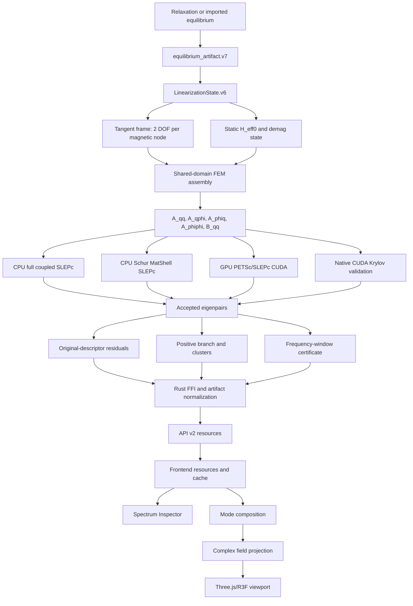

# Audyt wdrożenia FEM eigensolve CPU/GPU w branchu `codex/eigensolve-master-rescue`

**Repozytorium:** `MateuszZelent/fullmag`  
**Branch:** `codex/eigensolve-master-rescue`  
**Data audytu:** 2026-08-20  
**Tryb:** read-only; analiza kodu źródłowego, kontraktów, testów i raportów zapisanych w repozytorium  
**Punkt odniesienia:** `master`, merge-base `d9518082eaee2131c3e7160bd8ae952ed2f45899`  
**Zakres brancha względem `master`:** 121 commitów do przodu, 0 commitów do tyłu, około 207 zmienionych plików

---

## 1. Werdykt wykonawczy

> **NO-GO dla wydania produkcyjnego jako ogólnego solvera FEM eigensolve CPU/GPU.**

Branch nie jest atrapą ani szkieletem. Zawiera rzeczywisty i rozbudowany system obejmujący:

- wersjonowane ABI i FFI;
- budowę `LinearizationState` z artefaktu równowagi;
- lokalne bazy styczne i deskryptor zlinearyzowanego LLG;
- montaż shared-domain FEM dla magnetu i airboxa;
- dynamiczne pole demagnetyzacyjne przez sprzężony problem Poissona;
- CPU SLEPc shift-and-invert, w tym wariant Schura `MatShell`;
- GPU PETSc/SLEPc z `VECCUDA`, `MATAIJCUSPARSE` i HYPRE/BoomerAMG;
- niezależny natywny CUDA Kryłow jako ścieżkę walidacyjną;
- rekonstrukcję pełnego deskryptora i residuale blokowe;
- dwupasmową certyfikację kompletności okna częstotliwości;
- publikację spektrum i zespolonych pól modalnych;
- resource cache, Inspector, wykresy i animowaną wizualizację 3D.

Najważniejsze mechanizmy są zaprojektowane poważnie: wykonanie GPU jest fail-closed, wynik jest sprawdzany na oryginalnych blokach, klastry zdegenerowane są kwalifikowane przez stabilność podprzestrzeni, a artefakty posiadają rozbudowane hashe i provenance.

Całość blokują jednak problemy fundamentalne:

1. **Stan bazowy może zostać zaakceptowany do linearyzacji wyłącznie na podstawie plateau energii. Kod oblicza residual momentu `m0 × H_eff0`, lecz nie egzekwuje jego progu.** Solver może więc linearyzować wokół stanu niestacjonarnego.
2. **Frontend może oznaczyć widmo jako `qualified` tylko dlatego, że wszystkie mody mają pliki pól.** Dostępność pola do renderowania jest mylona z kwalifikacją naukową.
3. **W Inspectorze istnieje sprzeczny fallback konwencji fazowej:** pole może być opisane jako `exp(-i omega t)`, podczas gdy manifest i solver używają `exp(+i omega t)`.
4. **Planner nazywa produkcyjny silnik GPU `GpuModalDeviceKrylov`, choć rzeczywisty produkcyjnie zamierzony adapter K0 to PETSc/SLEPc, a własny CUDA Kryłow jest validation-only.**
5. **Ścieżka GPU nie ma zakończonej, niezależnej kwalifikacji na rzeczywistym operatorze FEM i rzeczywistym sprzęcie.** Test infrastruktury na macierzy 3×3 oraz syntetyczne fixture nie są dowodem produkcyjnym.
6. **Ogólny operator MFEM nie jest jeszcze fizycznie kwalifikowany.** Produkcyjny shared-domain route ma świadomie wąski zakres: K0, `alpha=0`, jednorodna wymiana, statyczne `H_eff0`, dynamiczny demag Poisson; anizotropia i DMI nie są certyfikowane.
7. **Istniejący certyfikat kompletności okna częstotliwości nie jest konsekwentnie przenoszony do artefaktów i UI.** Część metadanych nadal opisuje kompletność jako pending.

### 1.1. Werdykt per podsystem

| Podsystem | Ocena | Decyzja |
|---|---:|---|
| Kontrakt zlinearyzowanego LLG | poprawna architektura, niepełna bramka wejściowa | **NO-GO** do czasu obowiązkowej kontroli równowagi |
| Shared-domain K0: exchange + statyczne `H_eff0` + dynamiczny Poisson demag | dobrze ograniczony zakres, mocne residuale i testy montażu | **Conditional GO** do badań kontrolowanych po P0 |
| Ogólny operator MFEM | brak pełnej kwalifikacji ograniczonego Hessianu | **NO-GO; pozostawić wyłączony** |
| CPU Schur SLEPc | sensowny numerycznie, seryjny i potencjalnie kosztowny | **Conditional GO** dla małych/średnich problemów |
| GPU PETSc/SLEPc | dobra architektura fail-closed i telemetria | **NO-GO produkcyjne** bez kwalifikacji sprzętowej |
| Natywny CUDA Kryłow | wartościowy niezależny oracle | **Validation-only** |
| `frequency_window` | mocny certyfikat z klastrami i refinement | **GO warunkowe**, tylko dla `window_complete=true` |
| `nearest_frequency` | wybrane Ritze blisko targetu | **Nie nazywać kompletnym widmem** |
| Publikacja modów | bogata provenance i residuale | **Conditional GO** |
| Wizualizacja 3D | poprawna obsługa zespolonych pól, kilka błędów semantycznych | **Conditional GO** po P0 |
| Frontend naukowy | fałszywa kwalifikacja i rozjazd konwencji fazowej | **NO-GO** |

### 1.2. Zalecany status produktu

Do czasu zamknięcia P0 funkcję należy oznaczyć jako:

```text
FEM eigensolve — research preview

Qualified scope:
- periodic_airbox_k0,
- alpha = 0,
- homogeneous exchange,
- exact bound static H_eff0 from accepted equilibrium,
- dynamic Poisson demag,
- supported P1 shared-domain mesh,
- explicit CPU or GPU execution lane,
- certified frequency window where requested.

Not qualified:
- generic material/physics operator,
- anisotropy and DMI tangent terms,
- damped/non-normal modal conditioning,
- nonzero Bloch k on production GPU,
- unqualified GPU hardware stacks,
- physical-amplitude mode composition.
```

---

## 2. Metodyka i ograniczenia audytu

Prześledzono przepływ end-to-end:

```text
relaksacja / equilibrium artifact
→ LinearizationState
→ baza styczna i montaż FEM
→ deskryptor L q = lambda B q
→ CPU SLEPc / GPU PETSc-SLEPc / CUDA validation Krylov
→ filtracja, klastry, residuale i certyfikat okna
→ Rust FFI i planowanie wykonania
→ artifacts v2 / API v2
→ resource cache i kontrolery frontendu
→ Inspector, wykres widma i viewport 3D
```

Analiza objęła przede wszystkim:

- `backends/fem/include/frequency_domain/*`
- `backends/fem/src/frequency_domain/*`
- `backends/fem/cpu/frequency_domain/*`
- `backends/fem/gpu/frequency_domain/*`
- `backends/fem/gpu/cuda/frequency_domain/*`
- `backends/fem/tests/frequency_domain/*`
- `crates/fullmag-runner/src/fem/eigen_*`
- `crates/fullmag-api/src/router_v2/handlers/*`
- `apps/control-room/src/kernel/resources/*`
- `apps/control-room/src/kernel/visualization/*`
- `apps/control-room/src/modules/inspector/panels/frequency-domain/*`
- `apps/control-room/src/modules/viewport-3d/model/*`
- odpowiadające testy C++, Rust i TypeScript.

### 2.1. Ograniczenie dowodowe

Audyt nie uruchamiał niezależnie:

- pełnego builda brancha;
- zestawu testów;
- solve na rzeczywistej siatce;
- benchmarków CPU/GPU;
- profilowania Nsight/PETSc;
- testu przeglądarkowego z rzeczywistym artefaktem solvera.

Analiza została wykonana przez interfejs repozytorium GitHub bez lokalnego środowiska build/runtime. Raporty znajdujące się w `.superpowers/sdd/*.md` są traktowane jako raporty własne implementacji, nie jako niezależnie odtworzone dowody. Wnioski o kodzie, algorytmach i kontraktach są bezpośrednie; wnioski o rzeczywistej wydajności i stabilności sprzętowej mają status ryzyka wymagającego pomiaru.

---

## 3. Architektura implementacji



Implementacja zawiera cztery odmienne ścieżki:

1. **CPU full-coupled SLEPc** — pełny deskryptor `(q, phi, eta)`, głównie bounded validation/oracle, `PREONLY + LU`.
2. **CPU Schur MatShell SLEPc** — eliminacja potencjału Poissona, efektywny operator magnetyczny, shift-and-invert; produkcyjnie zamierzona ścieżka K0 CPU.
3. **GPU PETSc/SLEPc** — `VECCUDA`, `MATAIJCUSPARSE`, HYPRE/BoomerAMG i trwały kontekst; produkcyjnie zamierzona ścieżka K0 GPU.
4. **Natywny CUDA Kryłow** — własny Arnoldi/solver liniowy, główne wektory na GPU, lecz projekcja i ekstrakcja Ritz na CPU; ścieżka walidacyjna.

Rozdzielenie jest racjonalne, ale nazwy planner/runner/artifacts nie są obecnie zgodne z rzeczywistym adapterem wykonawczym.

---

## 4. Audyt fizyki

### 4.1. Zlinearyzowane równanie LLG

Dla postaci Gilberta:

\[
\frac{\partial \mathbf m}{\partial t}
=-\gamma_0\mathbf m\times\mathbf H_{\mathrm{eff}}
+\alpha\mathbf m\times\frac{\partial\mathbf m}{\partial t},
\qquad |\mathbf m|=1,
\]

oraz:

\[
\mathbf m=\mathbf m_0+\delta\mathbf m,
\qquad
\mathbf H_{\mathrm{eff}}=\mathbf H_{\mathrm{eff},0}
+\delta\mathbf H_{\mathrm{eff}}[\delta\mathbf m],
\]

pierwszy rząd daje:

\[
\frac{\partial\delta\mathbf m}{\partial t}
=-\gamma_0\left(
\mathbf m_0\times\delta\mathbf H_{\mathrm{eff}}
+\delta\mathbf m\times\mathbf H_{\mathrm{eff},0}
\right)
+\alpha\mathbf m_0\times
\frac{\partial\delta\mathbf m}{\partial t}.
\]

Dla stanu równowagi:

\[
\mathbf m_0\times\mathbf H_{\mathrm{eff},0}=0,
\qquad
\mathbf H_{\mathrm{eff},0}=h_\parallel\mathbf m_0.
\]

Człon statyczny jest zatem niezbędny:

\[
\delta\mathbf m\times\mathbf H_{\mathrm{eff},0}
=-h_\parallel\mathbf m_0\times\delta\mathbf m.
\]

Po projekcji do lokalnej bazy stycznej `delta m = Tq` solver buduje:

\[
Lq=\lambda Bq.
\]

Dla przyjętej konwencji czasowej:

\[
\delta\mathbf m(t)=\Re[\widehat{\delta\mathbf m}e^{+i\omega t}],
\]

w przypadku bez tłumienia zachodzi `lambda = i omega`. Przy tłumieniu `Im(lambda)` określa znak gałęzi i częstotliwość, a `-Re(lambda)` szybkość zaniku.

### 4.2. Konwencja wartości własnej

`mode_kinematics.hpp/.cpp` poprawnie zachowuje znak gałęzi. Kod nie redukuje bezwarunkowo `omega` do `abs(omega)`. Publikowane są między innymi:

- `lambda_real_per_s`;
- `lambda_imag_rad_per_s`;
- `omega_rad_s`;
- `frequency_hz`;
- `decay_rate_per_s`;
- `branch_sign`;
- `stable`;
- `zero_frequency_mode`.

Jest to poprawne i konieczne do rozróżniania gałęzi `+/- omega`, niestabilności oraz modów Goldstone'a.

### 4.3. PHY-01 — CRITICAL: brak obowiązkowej bramki równowagi

**Pliki:**

- `backends/fem/src/frequency_domain/linearization_state.cpp`
- `backends/fem/include/frequency_domain/linearization_state.hpp`

`validate_equilibrium_acceptance_certificate()` dopuszcza dwa typy certyfikatu:

```text
criterion = torque
metric_kind = max_torque_apm
```

lub:

```text
criterion = energy
metric_kind = total_energy_plateau_range_j
```

Następnie `build_linearization_state_from_equilibrium()` oblicza:

\[
r_{\mathrm{eq}}
=\max_i
\frac{|\mathbf m_{0,i}\times\mathbf H_{\mathrm{eff},0,i}|}
{\max(|\mathbf H_{\mathrm{eff},0,i}|,1\ \mathrm{A/m})},
\]

zapisując wynik jako `max_m0_cross_heff0_relative`, lecz nie porównuje go z progiem akceptacji.

Plateau energii nie dowodzi stacjonarności. Może wystąpić przy:

- oscylacji o małej amplitudzie;
- stagnacji integratora;
- źle dobranym kroku;
- lokalnie istotnym momencie przy małej zmianie energii;
- niezgodności pola użytego podczas relaksacji i pola użytego do linearyzacji.

Linearyzacja wokół stanu z `m0 × H_eff0 != 0` nie jest problemem małych drgań wokół równowagi. Jest to blocker wiarygodności całego widma.

**Wymagana naprawa:**

1. dodać obowiązkowy `equilibrium_relative_torque_tolerance`;
2. ponownie obliczać całe `H_eff0` z dokładnie tej samej siatki, materiałów, BC i modeli co operator modalny;
3. wymagać `r_eq <= tolerance`;
4. certyfikat energii traktować jako dowód dodatkowy, nie wystarczający;
5. porównywać pole przeliczone z polem zapisanym w equilibrium artifact;
6. wiązać wynik i próg z `linearization_state_sha256`.

Proponowana początkowa bramka kwalifikacyjna double precision:

\[
r_{\mathrm{eq}}\le 10^{-8},
\]

z późniejszą kalibracją na podstawie zbieżności widma.

### 4.4. PHY-03 — MEDIUM: cicha renormalizacja `m0`

`allow_m0_renormalization` domyślnie wynosi `true`. Kod normalizuje każdy wektor `m0`, lecz wynik nadal odwołuje się do pierwotnego artefaktu i jego identyfikatorów.

Dla błędów floating-point jest to praktyczne, ale naukowo oznacza linearyzację wokół innego pola niż dokładnie zahashowany input.

**Zalecenie:**

- produkcyjnie `allow_m0_renormalization=false`; albo
- utworzyć nowy kanoniczny artefakt po renormalizacji;
- publikować maksymalną korektę, liczbę zmienionych węzłów i nowy digest;
- automatyczną korektę dopuszczać tylko poniżej jawnego, bardzo małego progu.

### 4.5. PHY-04 — MEDIUM: opcje deklarowane, lecz nie w pełni egzekwowane

`LinearizationBuildOptions` zawiera m.in.:

- `periodic_seam_tolerance`;
- `require_symmetric_periodic_mesh`;
- `recompute_h_eff0_and_compare`.

W analizowanej budowie stanu nie widać pełnego, lokalnego egzekwowania wszystkich tych opcji. Nie należy publikować opcji ustawionej na `true`, jeśli odpowiadający test nie został wykonany.

Każda bramka powinna publikować osobny wynik: `passed`, `failed`, `not_run` lub `unsupported`.

### 4.6. Produkcyjny shared-domain K0

Najbardziej dojrzały fizycznie wariant znajduje się w:

- `backends/fem/cpu/frequency_domain/operators/poisson_airbox_shared_domain.hpp`
- `backends/fem/cpu/frequency_domain/operators/poisson_airbox_shared_domain.cpp`

Zakres jest jawnie ograniczony:

- `k = 0`;
- `alpha = 0`;
- jednorodne `A_ex`;
- statyczne całkowite `H_eff0`;
- dynamiczne pole demagnetyzacyjne przez `delta phi`;
- shared-domain magnet + airbox;
- obsługiwane elementy P1 Tet4/Prism6;
- okresowość oparta na certyfikacie siatki;
- brak certyfikowanej anizotropii i DMI.

To dobre podejście: niewspierane przypadki są odrzucane zamiast rozwiązywania niepełnego operatora.

### 4.7. Wymiana

Dla:

\[
\mathbf H_{\mathrm{ex}}
=\frac{2A_{\mathrm{ex}}}{\mu_0M_s}\nabla^2\mathbf m,
\]

słaba postać wykorzystuje macierz sztywności:

\[
K_{ij}=\int_{\Omega_m}\nabla N_i\cdot\nabla N_j\,dV.
\]

`poisson_airbox_shared_domain_test.cpp` tworzy niezależny oracle dla objętości tetraedru i gradientów barycentrycznych P1. To jest wartościowy test matematyczny, nie tylko powtórzenie funkcji produkcyjnej.

### 4.8. Dynamiczny demag Poisson

Sprzężony problem ma postać:

\[
\begin{bmatrix}
A_{qq} & A_{q\phi}\\
A_{\phi q} & A_{\phi\phi}
\end{bmatrix}
\begin{bmatrix}q\\\phi\end{bmatrix}
=\lambda
\begin{bmatrix}
B_{qq} & 0\\0 & 0
\end{bmatrix}
\begin{bmatrix}q\\\phi\end{bmatrix}.
\]

Dla:

\[
\delta\mathbf H_{\mathrm{demag}}=-\nabla\delta\phi,
\qquad
\nabla^2\delta\phi=\nabla\cdot(M_s\delta\mathbf m),
\]

potencjał jest zmienną algebraiczną. Eliminacja Schura jest naturalna, a implementacja rekonstruuje `phi` i sprawdza residual oryginalnych bloków. To istotna zaleta: dobry residual zredukowanego operatora nie wystarcza sam w sobie.

### 4.9. PHY-02 — HIGH, latent: ogólny operator MFEM

W ścieżce ogólnej:

- `mfem_linearized_operator.cpp`;
- `operator_terms.cpp`;
- `zeeman_operator.cpp`;
- `anisotropy_operator.cpp`

widoczne są dynamiczne Hessiany oddziaływań. Nie znaleziono jednak jednego centralnego montażu pełnego ograniczonego operatora:

\[
D\mathbf H_{\mathrm{eff}}[\delta\mathbf m]
-h_\parallel\delta\mathbf m,
\qquad h_\parallel=\mathbf m_0\cdot\mathbf H_{\mathrm{eff},0},
\]

dla sumy wszystkich oddziaływań. Zeeman zawiera odpowiedni reakcyjny wkład, ale nie jest to dowód, że całkowity `h_parallel` jest montowany raz i poprawnie dla anizotropii, DMI i pozostałych energii.

Potencjalny skutek:

- przesunięte częstotliwości;
- błędny limit makrospinu z anizotropią;
- niespójność z Hessianem energii pod ograniczeniem `|m|=1`.

Ścieżka jest obecnie praktycznie zablokowana jako produkcyjna, więc defekt jest latentny. Należy ją pozostawić wyłączoną do czasu centralizacji ograniczonego Hessianu i testów analitycznych.

---

## 5. Audyt numeryczny

### 5.1. Typ problemu

Zlinearyzowany LLG z demag i tłumieniem jest ogólnie:

- uogólniony;
- niesymetryczny;
- nienormalny;
- z parami `+/- omega`;
- z klastrami wynikającymi z symetrii;
- z możliwymi modami bliskimi zeru.

SLEPc i shift-and-invert/Krylov–Schur są właściwym wyborem.

### 5.2. Residual i skalowanie

Implementacja rozdziela:

1. błąd raportowany przez SLEPc;
2. residual przeskalowanego deskryptora;
3. residual zrekonstruowanego, oryginalnego deskryptora;
4. residual bloku magnetycznego;
5. residual bloku Poissona;
6. residual gauge;
7. błąd rekonstrukcji `phi`.

Akceptacja na oryginalnych, nieprzeskalowanych blokach jest poprawna i zapobiega ukrywaniu błędu fizycznego przez korzystne skalowanie transformowanego problemu.

### 5.3. Certyfikowane okno częstotliwości

CPU Schur i GPU PETSc/SLEPc mają rzeczywisty mechanizm certyfikacji `frequency_window`:

- bazowy zestaw podokien;
- drugi, refinement zestaw podokien;
- większe `nev` w refinement;
- deduplikacja modów;
- wykrywanie klastrów;
- porównanie podprzestrzeni niezmienniczych;
- kontrola marginesów pokrycia;
- odrzucenie wyniku, jeśli żądana liczba przecina klaster;
- fail-closed dla uszkodzonego podokna;
- fail-closed dla obciętego JSON certyfikatu;
- publikacja `window_complete` i stabilnego `stop_reason`.

`gpu_k0_modal_petsc_slepc_test.cpp` sprawdza między innymi:

- oddzielone mody;
- dokładnie zdegenerowany klaster rzędu 2;
- odrzucenie żądania dzielącego klaster;
- minimalny overlap podprzestrzeni;
- dodatnie marginesy pokrycia;
- brak CPU fallbacku.

Jest to jeden z najmocniejszych elementów brancha.

### 5.4. NUM-02 — MEDIUM/HIGH: certyfikat nie jest konsekwentnie publikowany

Algorytm kompletności istnieje, lecz semantyka ginie wyżej:

- `eigen_native_artifacts.rs` nadal publikuje `frequency_window_completeness_pending`;
- frontend nie pokazuje `window_complete`, metody, marginesów ani stabilności klastra;
- wykres używa ogólnej nazwy „Eigenfrequency Spectrum”;
- `nearest_frequency` i certyfikowane okno wyglądają podobnie.

API powinno rozróżniać:

```json
{
  "spectrum_scope": "frequency_window",
  "completeness": {
    "status": "certified",
    "method": "shift_nev_refinement_subspace_v1",
    "window_min_hz": 1.0e9,
    "window_max_hz": 10.0e9,
    "coverage_margins_positive": true,
    "min_subspace_overlap": 0.999999,
    "cluster_ranks": [1, 2, 1],
    "truncated": false
  }
}
```

od:

```json
{
  "spectrum_scope": "selected_near_target",
  "completeness": { "status": "not_claimed" }
}
```

### 5.5. NUM-01 — HIGH: brak lewych modów i kondycjonowania

Publikowane są prawe wektory własne i residuale, ale brak:

- lewych wektorów własnych;
- `y^H B x`;
- condition number wartości własnej;
- biortogonalności;
- wrażliwości na perturbacje;
- participation factor względem napędu.

Dla nienormalnego problemu mały residual nie gwarantuje stabilności wartości własnej. Dla lewego modu:

\[
y^\dagger L=\lambda y^\dagger B,
\]

kondycjonowanie zależy m.in. od:

\[
\kappa_\lambda\propto
\frac{\|x\|\|y\|}{|y^\dagger Bx|}.
\]

W trybie tłumionym należy rozważyć two-sided SLEPc i publikować condition estimate. Bez tego `qualified` nie może oznaczać pełnej wiarygodności dla nienormalnych modów.

### 5.6. NUM-03 — MEDIUM: próg modu zerowego

Absolutny próg rzędu `1e-9 rad/s` jest niezależny od skali problemu. Lepsza reguła:

\[
|\omega|\le
\max(\omega_{\mathrm{abs}},\epsilon_{\mathrm{rel}}\omega_{\mathrm{scale}}),
\]

gdzie skala pochodzi z targetu, normy operatora lub pola referencyjnego.

### 5.7. NUM-04 — HIGH, performance: deduplikacja

`mode_deduplication.cpp` liczy overlap z macierzą masy w pętli po parach modów i parach DOF. Dla gęstego widoku koszt może osiągnąć:

\[
O(N_{\mathrm{modes}}^2N_{\mathrm{dof}}^2).
\]

Macierz masy FEM jest rzadka. Należy raz obliczać `w_j = M q_j`, a następnie:

\[
q_i^\dagger M q_j=q_i^\dagger w_j.
\]

Koszt spada do:

\[
O(N_{\mathrm{modes}}\,\mathrm{nnz}(M))
+O(N_{\mathrm{modes}}^2N_{\mathrm{dof}}).
\]

Dla klastrów porównywać podprzestrzenie, nie arbitralne pojedyncze wektory.

### 5.8. NUM-06 — MEDIUM: indeksy CSR

Rozmiary są 64-bitowe, ale `row_offsets` i `column_indices` są 32-bitowe. Ogranicza to problem niezależnie od 64-bitowego `PetscInt`.

Należy:

- jawnie publikować `index_width=32`;
- wykonywać checked cast;
- odrzucać przekroczenia przed alokacją;
- docelowo dodać ABI CSR 64-bit.

---

## 6. Audyt CPU

### 6.1. Full-coupled SLEPc

Pełna ścieżka:

- montuje deskryptor `(q, phi, eta)`;
- używa reprezentacji real-split;
- stosuje shift-and-invert;
- używa LU;
- rekonstruuje pełny wektor;
- liczy residual oryginalnych bloków.

Syntetyczny oracle jest ograniczony do małego problemu (`kMaxPaE2ValidationDofCount = 128`), co poprawnie chroni przed przypadkowym użyciem gęstego rozwiązania na produkcyjnej skali.

### 6.2. Schur MatShell SLEPc

Produkcja shared-domain przechodzi do Schura:

\[
\phi(q)=-A_{\phi\phi}^{-1}A_{\phi q}q,
\]

\[
A_{\mathrm{eff}}q=A_{qq}q+A_{q\phi}\phi(q).
\]

Operator pozostaje `MatShell`, kontekst może być utrzymywany, a wynik odzyskuje `phi` i sprawdza pełny deskryptor.

### 6.3. CPU-01 — HIGH: wykonanie seryjne

Kod używa `PETSC_COMM_SELF`. Oznacza to:

- jeden proces;
- brak rozproszonej siatki;
- brak MPI Kryłowa;
- brak równoległej faktoryzacji Poissona;
- ograniczoną skalowalność pamięciową.

Dla małych/średnich problemów jest to akceptowalne. Dla dużych FEM ograniczeniem będą faktoryzacje, aplikacje Schura, orthogonalizacja i liczba podokien completeness certificate.

### 6.4. CPU-02 — MEDIUM/HIGH: koszt setup i shiftów

Należy raportować osobno:

- czas assembly;
- czas setup Poisson;
- czas setup shift;
- czas EPS;
- operator applies;
- KSP iterations;
- peak memory;
- reuse między podoknami;
- reuse między próbkami sweepu pola.

CPU shared-domain K0 może pełnić rolę reference lane po naprawie równowagi, lecz nie jest jeszcze rozproszonym, ogólnym solverem FEM.

---

## 7. Audyt GPU PETSc/SLEPc

### 7.1. Mocne strony

`backends/fem/gpu/frequency_domain/modal_petsc_slepc.cpp`:

- wymaga PETSc z CUDA;
- tworzy `VECCUDA`;
- wymaga `MATAIJCUSPARSE`;
- sprawdza typ wektorów bazowych SLEPc;
- konfiguruje HYPRE/BoomerAMG;
- publikuje memory location i execution policy HYPRE;
- publikuje stan vendor SpMV/SpGEMM/SpTrans;
- utrzymuje cache kontekstu operatora;
- publikuje setup H2D, final D2H i hot-loop telemetry;
- publikuje operator applies, Poisson solves, KSP iterations i EPS reason;
- może wymagać `device_residency_verified`;
- nie przechodzi po cichu na CPU.

Fail-closed jest poprawną decyzją. Jawne żądanie GPU nie może zwrócić wyniku CPU opisanego jako GPU.

### 7.2. Zakres runtime testu

`gpu_petsc_slepc_runtime_test.cpp` sprawdza:

- inicjalizację CUDA;
- `VECSEQCUDA`;
- dostęp do device array;
- `MATSEQAIJCUSPARSE`;
- `PCHYPRE`;
- eigensolve diagonalnej macierzy 3×3;
- CUDA-resident basis vector.

Jest to test zależności i konfiguracji, nie kwalifikacja FEM. Nie sprawdza rzeczywistego shell operatora, shared-domain Poissona, wielu iteracji KSP, residualu pełnego deskryptora, certyfikowanego okna na realnej siatce ani wydajności.

`gpu_k0_modal_petsc_slepc_test.cpp` jest znacznie silniejszy semantycznie, ale nadal opiera się przede wszystkim na syntetycznym algebraicznym oracle.

### 7.3. GPU-01 — HIGH: brak kwalifikacji sprzętowej

Brakuje reprodukowalnego qualification artifact zawierającego:

- GPU i driver;
- CUDA;
- PETSc/SLEPc;
- HYPRE;
- compiler flags;
- dokładny mesh/operator digest;
- liczbę modów i okno;
- residuale;
- parity CPU/GPU;
- profiler trace;
- cold/warm runtime;
- peak device memory.

Źródła są production-intended, ale wykonanie nie jest production-qualified.

### 7.4. GPU-02 — HIGH: attestation nie zastępuje profilera

Pola `device_residency_verified`, `hot_loop_h2d_bytes`, `hot_loop_d2h_bytes` i `persistent_context_verified` są wartościowe, lecz zero może oznaczać brak pomiaru. Wymagane są:

- PETSc `-log_view`;
- Nsight Systems;
- Nsight Compute dla dominujących kerneli;
- liczba `cudaMemcpy*`;
- liczba synchronizacji;
- timeline CPU/GPU;
- udział Poissona, SpMV, orthogonalizacji i redukcji;
- peak device memory.

### 7.5. GPU-03 — MEDIUM: pojedynczy GPU

`PETSC_COMM_SELF` oznacza single-process/single-GPU. Jest to dopuszczalne dla pierwszej wersji, ale musi być jawnie zapisane w capability metadata. `device_resident` nie oznacza multi-GPU ani distributed solve.

### 7.6. Montaż macierzy

Macierze CUDA są wypełniane hostowymi pętlami `MatSetValue`, a następnie składane. To koszt setup, nie hot loop, lecz może być istotny na dużych macierzach. Docelowo zalecane są bezpośrednie ścieżki CSR, cache niezmiennych bloków i aktualizacja wyłącznie części zależnych od pola.

---

## 8. Natywny CUDA Kryłow

`backends/fem/gpu/cuda/frequency_domain/modal_krylov.cu` jest słusznie opisany w kodzie jako ścieżka walidacyjna.

### 8.1. GPU-04 — HIGH dla użycia produkcyjnego: ortogonalizacja

Arnoldi używa pojedynczej klasycznej ortogonalizacji Grama–Schmidta. Nie widać:

- MGS2;
- DGKS reorthogonalization;
- selektywnej reorthogonalizacji;
- publikowanego `||I - V^H V||`;
- stabilnego implicit/thick restart.

Dla skupionego i nienormalnego widma może to tworzyć ghost Ritz values, duplikaty i błędną multiplicity.

### 8.2. Host/device

Główne wektory są na GPU, ale:

- dot/norm powodują transfer skalaru i synchronizację;
- baza jest kopiowana do hosta do projekcji;
- projected matrices powstają na CPU;
- QR/inverse iteration Ritz działa na CPU;
- diagnostics publikuje `host_ritz_extraction=true`;
- `scalable_selected_spectrum=false`.

Jest to hybrydowy walidator, nie pełny device-resident eigensolver produkcyjny.

### 8.3. Rekomendacja

Zachować nazwę i status:

```text
gpu_native_krylov_validation
```

Używać do małych fixture, testów operator action i niezależnego porównania z PETSc/SLEPc. Nie mapować na `ProductionGpu`.

Jeżeli ma zostać rozwinięty, potrzebne są: block Arnoldi, MGS2/DGKS, thick restart, GEMM-based orthogonalization, device projected solve, async reductions i jawny pomiar utraty ortogonalności.

---

## 9. API, planner, ABI i provenance

### 9.1. API-04 — HIGH: rozjazd nazw silnika

`crates/fullmag-runner/src/fem/eigen_execution_resolution.rs` ma:

```rust
FemEigenEngineIR::GpuModalDeviceKrylov
```

mapowane do `ProductionGpu`, podczas gdy rzeczywisty produkcyjnie zamierzony shared-domain K0 adapter C++ to:

```text
k0_poisson_airbox_gpu_petsc_slepc
```

Natywny `modal_krylov.cu` jest validation-only.

Ryzyka:

- błędna provenance;
- niewłaściwy cache/certificate binding;
- mylące capability metadata;
- przyszłe przypadkowe uruchomienie validation lane jako produkcji.

**Wymagana taksonomia:**

```rust
enum FemEigenEngineIR {
    Auto,
    K0PoissonAirboxCpuSchurSlepc,
    K0PoissonAirboxGpuPetscSlepc,
    GpuNativeKrylovValidation,
}
```

Każdy wynik powinien publikować osobno:

- requested engine;
- resolved engine;
- native adapter;
- PETSc EPS/ST/KSP/PC;
- matrix backend;
- validation-only flag;
- fallback state.

Rozjazd ma kończyć się błędem.

### 9.2. Mocne strony ABI

ABI jest wersjonowane przez:

- `abi_version`;
- `struct_size`;
- frozen by-value result;
- rozszerzenia tail/sidecar;
- testy nieznanych enumów;
- testy krótkiego prefiksu;
- jawne resolved provenance.

To jest dojrzały projekt integracyjny.

### 9.3. Provenance

Warstwa Rust/C ABI zachowuje między innymi:

- equilibrium artifact SHA-256;
- linearization state SHA-256;
- periodic mesh certificate SHA-256;
- relax-to-eigen handoff SHA-256;
- source mesh topology SHA-256;
- operator input signature;
- phase constraint SHA-256;
- assembly kind;
- solver adapter;
- execution lane.

To właściwy kierunek dla solvera naukowego.

### 9.4. ART-01 — HIGH: stale completeness metadata

`eigen_native_artifacts.rs` publikuje dla skalowalnej ścieżki GPU ograniczenie:

```text
frequency_window_completeness_pending
```

mimo że C++ publikuje `window_complete`, `window_certificate_json` i testuje certyfikat. Ograniczenie należy generować dynamicznie:

- `certified_frequency_window`;
- `selected_spectrum_only`;
- `frequency_window_not_certified`.

Nie wolno również domyślnie przyjmować `gpu_scalable_selected_spectrum=true` tylko dlatego, że adapter jest GPU. Brak pola oznacza `unknown/not_attested`.

### 9.5. API-02 — MEDIUM: lifetime callbacków

Request przechowuje surowe wskaźniki operatora, cancellation i progress callbacks. Kontrakt lifetime musi być jawny, solve nie może przeżyć scope caller-owned payloadu, a docelowo warto rozważyć ref-counted opaque handle.

### 9.6. API-03 — MEDIUM/HIGH: obowiązkowa tożsamość pola

Frontend część pól tożsamości porównuje tylko, jeśli odpowiedź je zawiera. Produkcyjny payload powinien obowiązkowo zawierać:

```text
run_id
stage_id
result_id
artifact_revision
artifact_sha256
sample_id
mode_id
field_id
object_id
mesh_topology_sha256
linearization_state_sha256
tangent_frame_sha256
normalization_id
phasor_convention
```

Brak któregokolwiek pola powinien blokować renderowanie jako wynik naukowy.

---

## 10. Spektrum i interpretacja modalna

### 10.1. Znaczenie wyniku

- `nearest_frequency` oznacza ograniczony zbiór zaakceptowanych Ritzów blisko targetu;
- `frequency_window` może uzyskać certyfikat kompletności;
- dodatnia gałąź jest wybierana jawnie;
- mody zerowe są filtrowane według polityki;
- residual jest liczony po pełnej rekonstrukcji;
- publikowane są klastry.

### 10.2. Eigenspectrum nie jest odpowiedzią FMR

Widmo własne określa bieguny układu. Nie mówi automatycznie, który mod jest dominującym rezonansem dla danego napędu. Potrzebne są:

- profil i polaryzacja `h_rf`;
- lewy i prawy mod;
- overlap napędu `y_n^H f`;
- kanał obserwacji;
- tłumienie;
- interferencja modów.

### 10.3. VIS-08 — MEDIUM/HIGH: `primary resonance`

`FmrModalSpectrumInspectorPanel.tsx` traktuje pierwszy rekord jako `primaryModalResonance`. Nie ma kryterium coupling strength ani sortowania po odpowiedzi. Należy użyć `first returned mode`/`lowest displayed mode` albo obliczyć prawdziwy dominant driven resonance.

---

## 11. Audyt wizualizacji modów

### 11.1. Pole zespolone i faza

Frontend pobiera interleaved real/imag:

```text
[Re x, Im x, Re y, Im y, Re z, Im z]
```

Dla `exp(+i omega t)`:

\[
\Re[(a+ib)e^{i\theta}]=a\cos\theta-b\sin\theta.
\]

`modeCompositionViewportProjection.ts` używa `real*cos - imag*sin`, co jest zgodne z solverem.

### 11.2. Faza globalna modu

Wektor własny jest określony z dokładnością do `q -> q exp(i phi0)`. Backend publikuje `phase_constraint_sha256`, lecz UI nie pokazuje rodzaju anchor, węzła/komponentu referencyjnego ani digestu. Utrudnia to porównania CPU/GPU i tracking modów.

### 11.3. VIS-02 — HIGH: normalizacja

API oferuje głównie `raw` i `max_displacement`. `max_displacement` jest użyteczne wizualnie, ale:

- usuwa normę modu;
- uniemożliwia porównanie amplitud między modami;
- nie jest amplitudą fizyczną;
- może ukrywać lokalizację na małej części siatki;
- bez mianownika nie jest odtwarzalne.

Wymagane warianty:

- `raw_dimensioned`;
- `max_abs_delta_m`;
- `mass_norm`;
- `energy_norm`;
- `biorthogonal_norm`;
- `user_visual_scale`.

Payload powinien zawierać normalizację, mianownik, jednostkę, pierwotną normę oraz flagę `physical_amplitude_claimed=false`, o ile amplituda nie pochodzi z driven response.

### 11.4. VIS-03 — HIGH: playback a czas fizyczny

`ModeCompositionPhaseClock.ts` używa około `0.02–4 Hz`, a Inspector uruchamia animację z `animationRateHz=1`. Jest to rozsądna prędkość wizualna, lecz nazwa może sugerować fizyczną częstotliwość modu.

UI powinien rozdzielać:

```text
physical_frequency_hz
playback_cycles_per_second
time_compression_factor
physical_time_ps
visual_phase_rad
```

Przykład:

```text
Physical mode: 9.63 GHz
Playback: 1.00 cycle/s
Time compression: 9.63e9
```

### 11.5. VIS-06 — HIGH: sprzeczny fallback fazy

`EigenModeInspectorPanel.tsx` ma fallback:

```ts
"exp(-i omega t)"
```

podczas gdy manifest i C++ domyślnie używają `exp_i_omega_t`/`exp_plus_i_omega_t`. Brak metadata może więc odwrócić fazę i znak interpretacji zaniku.

**Naprawa P0:**

- jeden enum generowany z OpenAPI;
- brak fallbacku w UI;
- unknown convention = render blocked;
- golden test: dla `m_hat=1+i`, `theta=pi/2` wynik ma być `-1` dla `exp(+i omega t)` i `+1` dla `exp(-i omega t)`.

### 11.6. Wizualizacja wektorów

`buildModeCompositionVectorLayerInput`:

- ogranicza glyphy przez `vector_budget`;
- wybiera punkty stałym stride po indeksach;
- normalizuje strzałki do wspólnej długości;
- przebudowuje segmenty na CPU dla kolejnych faz.

Ryzyka:

- indeksy FEM nie są przestrzennie jednorodne;
- stride może nadpróbkować jeden obszar;
- geometria strzałki nie pokazuje amplitudy;
- każda faza tworzy tablice obiektów i nowy `Float32Array`.

Zalecane:

- sampling przestrzenny voxel/Poisson-disk;
- sampling częściowo ważony amplitudą;
- instanced arrows;
- real/imag w GPU buffer;
- phase rotation w shaderze;
- jawne `arrow_length_encodes=magnitude|uniform`.

### 11.7. Wizualizacja skalarna

Pozytywnie:

- real/imag są preprojektowane do `Float32Array`;
- istnieje `WeakMap` cache;
- faza może być obracana bez ponownego pobierania pola;
- zakres jest symetryczny dla wartości signed;
- phase wykorzystuje `[-pi, pi]`.

Do poprawy:

- cache identity powinno zawierać content digest;
- `Set(nodeIndices)` nie powinien powstawać wielokrotnie;
- Float64 musi pozostać w artefakcie naukowym, nawet jeśli rendering używa Float32;
- `phase_rotated_real` używa bezpiecznego, lecz konserwatywnego maksimum zespolonej amplitudy.

### 11.8. Wnętrze FEM

Obecny workflow jest głównie powierzchniowy. Dla modów objętościowych może ukrywać węzły wewnętrzne, nodal planes i strukturę w grubości. Produkcyjny UX potrzebuje clip planes, dowolnych slice, isosurfaces `|delta m|`, volume sampling i osobnego sterowania magnetem/airboxem.

### 11.9. Superpozycja modów

Mode composition jest liniową wizualizacją:

\[
\delta\mathbf m(t)=\sum_n a_n\Re[\widehat{\delta\mathbf m}_n e^{i(\omega_nt+\phi_n)}].
\]

`amplitude_scale` jest współczynnikiem display, nie amplitudą fizyczną. UI powinien stale informować, że fizyczna amplituda wymaga driven-response normalization i rzeczywistego napędu.

---

## 12. Audyt frontendu

### 12.1. Mocne strony

`ModeCompositionController.ts` i `ModeCompositionFieldLayerController.ts` mają:

- revision counters;
- `AbortController`;
- ochronę przed stale response;
- anulowanie przy zmianie aktywnego wyniku;
- rekonsyliację selekcji;
- walidację finite values;
- stany `absent`, `preparing`, `ready`, `refreshing`, `degraded`, `error`;
- retained buffer podczas odświeżania;
- fallback do bazowej powierzchni;
- ochronę przed podwójnym właścicielem surface pass.

Jest to dobra architektura zarządzania zasobami.

### 12.2. FE-01 / VIS-07 — CRITICAL: fałszywe `qualified`

`FmrModalSpectrumModel.ts` ustala `trust="qualified"`, gdy:

- status nie jest `error`/`unsupported`;
- lista modów nie jest pusta;
- każdy mod ma `modeFieldId` i `modeFieldResourceKey`.

Nie sprawdza:

- residualu;
- equilibrium certificate;
- completeness certificate;
- solver qualification;
- GPU runtime proof;
- CPU/GPU parity;
- zakresu fizyki;
- condition number.

Plik pola jest dowodem renderowalności, nie wiarygodności naukowej.

**Naprawa P0:** oddzielić:

```ts
fieldAvailability: "complete" | "partial" | "none"
```

od:

```ts
type ScientificQualification =
  | { state: "qualified"; certificate: QualificationCertificate }
  | { state: "conditional"; limitations: string[] }
  | { state: "unqualified"; reasons: string[] }
  | { state: "unknown"; reasons: string[] };
```

`qualified` może pochodzić wyłącznie z kanonicznego certyfikatu backendu. Test, w którym wszystkie pola istnieją bez certyfikatu, musi zwracać `unknown`, nigdy `qualified`.

### 12.3. Dwie ścieżki walidacji pól

`ModeFieldOverlayIntent` ma mocny kontrakt identity/topology, a mode composition używa odrębnej ścieżki z częściowo opcjonalnymi porównaniami. Należy utworzyć jeden `validateScientificComplexFieldBinding()` i używać go w obu pipeline'ach.

### 12.4. Resource keys i cache

Klucze zawierają run/stage, artifact revision, sample/mode, field/object, topology hash, normalization i phase. Pozytywnie phase jest kanonizowana modulo `2pi`.

Ryzyka:

- revision może zostać ponownie użyty;
- brak obowiązkowego artifact SHA-256;
- brak tangent-frame SHA-256;
- phase animacji nie może generować nowego resource/network key per frame;
- `sourceId` nie jest automatycznie content digest.

### 12.5. Wykres widma

`buildEigenSpectrumChartModel` publikuje frequency, imaginary part, damping, residual, tangent leakage, branch i link pola. Brakuje:

- completeness status;
- cluster rank;
- condition number;
- equilibrium residual;
- solver qualification;
- CPU/GPU parity;
- mesh convergence/error bars.

Wykres nie powinien używać etykiety `certified spectrum`, jeśli wersja danych i certyfikat są nieznane.

### 12.6. Inspector modu

Inspector pokazuje frequency, imaginary frequency, decay, linewidth, Q, angular frequency, residual, tangent leakage, polarization i dostępność pól. Zakres jest dobry, ale:

- Q/linewidth wymagają jawnych założeń;
- brak condition number;
- brak normalization;
- brak completeness;
- brak phase anchor;
- 1 Hz powinno być opisane jako playback.

---

## 13. Testy i dowody

### 13.1. Mocne strony

Branch ma szeroki zestaw testów, m.in.:

- `frequency_domain_contract.cpp`
- `modal_eigen_contract_test.cpp`
- `linearized_dynamic_pencil_test.cpp`
- `poisson_airbox_modal_eigen_slepc_test.cpp`
- `poisson_airbox_real_split_cpu_test.cpp`
- `poisson_airbox_shared_domain_test.cpp`
- `gpu_hypre_device_policy_test.cpp`
- `gpu_k0_modal_petsc_slepc_test.cpp`
- `gpu_petsc_slepc_runtime_test.cpp`
- `mesh_symmetry_certificate_v6_test.cpp`
- `real_frequency_rotated_pencil_test.cpp`
- liczne testy resource keys, kontrolerów, cache i viewportu.

Szczególnie dobre są testy:

- ABI short prefix i unknown enum;
- braku fallbacku;
- gauge;
- residualu pełnego deskryptora;
- split cluster;
- subspace overlap;
- stale response;
- retained buffer;
- topology mismatch;
- canonicalizacji cache keys.

### 13.2. TEST-01 — HIGH: brak pełnej macierzy fizycznej

Potrzebne benchmarki:

1. **Makrospin/Kittel** — pole, pole + anizotropia, `alpha=0` i `alpha>0`, dokładne zespolone eigenvalues.
2. **Kula/elipsoida** — demag factors i zbieżność airbox.
3. **Standing exchange waves** — `omega(k) ~ k^2`, h-refinement.
4. **Thin-film DE/BV** — Damon–Eshbach i backward volume, `+k/-k`.
5. **Klaster zdegenerowany** — porównanie podprzestrzeni CPU/GPU.
6. **Nienormalny przypadek tłumiony** — left/right modes i condition.
7. **PBC** — K0, a docelowo Bloch `k != 0`.
8. **Mesh convergence** — h-refinement, airbox-size refinement, gauge invariance.

### 13.3. Brakujące testy GPU

- rzeczywisty shared-domain mesh;
- co najmniej trzy rozmiary problemu;
- CPU/GPU parity;
- cold/warm cache;
- profiler trace;
- cancellation podczas KSP;
- OOM i błędy HYPRE;
- test braku pageable scalar readback w hot loop;
- co najmniej jedna karta Ada i jedna Hopper;
- jawna macierz wersji PETSc/SLEPc/HYPRE.

### 13.4. TEST-02 — MEDIUM/HIGH: brakujące testy frontendowe

- wszystkie pola dostępne bez certyfikatu nie mogą dawać `qualified`;
- sprzeczna lub brakująca konwencja fazy musi fail-closed;
- certified window vs selected modes;
- cluster display;
- normalization denominator;
- physical vs playback frequency;
- artifact SHA mismatch;
- tangent-frame mismatch;
- browser E2E z rzeczywistym polem zespolonym;
- animacja 60 s bez nieograniczonego wzrostu cache.

---

## 14. Optymalizacja obliczeniowa

### 14.1. CPU

1. zastąpić gęsty overlap deduplikacji przez sparse mass apply;
2. cache'ować operator po exact content signature;
3. rozdzielić bloki stałe i zależne od pola;
4. reuse faktoryzacji Poissona między shiftami i sweepem;
5. adaptacyjnie dzielić okno według lokalnej gęstości modów, zachowując certyfikat;
6. po stabilizacji single-node dodać `PETSC_COMM_WORLD`, MPIAIJ i distributed HYPRE.

### 14.2. GPU

1. profiler-backed residency proof;
2. bezpośredni CSR upload;
3. persistent matrices/vectors;
4. ograniczenie scalar synchronizations;
5. batch/block operator apply;
6. jawne oddzielenie setup od hot loop;
7. ograniczenie hostowej serializacji dużych diagnostics;
8. mixed precision co najwyżej w preconditionerze, z double-precision residual certification.

### 14.3. Frontend

1. zachować shaderową rotację fazy dla scalar field;
2. przenieść vector phase rotation do instanced shader;
3. cache'ować mapę/set indeksów razem z decoded field;
4. używać content-addressed buffers;
5. worker/WASM dla dekodowania dużych pól;
6. streaming/chunking;
7. jawny memory budget i LRU per viewport;
8. nigdy nie wpisywać fazy bieżącej klatki do network resource key.

---

## 15. Rejestr ustaleń

| ID | Waga | Ustalenie | Skutek |
|---|---|---|---|
| PHY-01 | **Critical** | energy plateau może zaakceptować stan bez bramki momentu | linearyzacja wokół niestacjonarnego stanu |
| FE-01 / VIS-07 | **Critical** | `qualified` zależy od dostępności pól | fałszywa kwalifikacja naukowa |
| PHY-02 | High | ogólny MFEM prawdopodobnie nie ma centralnego pełnego `h_parallel` | błędne częstotliwości dla ogólnej fizyki |
| PHY-05 | High | shared-domain ma wąski zakres, anizotropia/DMI niecertyfikowane | ryzyko nadmiernej obietnicy |
| NUM-01 | High | brak left modes i condition numbers | residual nie mierzy nienormalnej wrażliwości |
| NUM-04 | High | dedup może kosztować `O(M^2 N^2)` | utrata skalowalności |
| CPU-01 | High | `PETSC_COMM_SELF` | brak MPI i ograniczona skala |
| GPU-01 | High | brak kwalifikacji sprzętowej | GPU nie jest production-qualified |
| GPU-02 | High | attestation bez profilera | niewykryte transfery/synchronizacje |
| GPU-04 | High | native Arnoldi bez reorthogonalizacji, host Ritz | validation-only |
| API-04 | High | planner nazywa production route `GpuModalDeviceKrylov` | błędna provenance i routing |
| ART-01 | High | artifact mówi completeness pending mimo certyfikatu | sprzeczna semantyka |
| VIS-02 | High | normalizacja nie zachowuje porównywalności | myląca amplituda |
| VIS-03 | High | playback Hz miesza się z physical Hz | błędna interpretacja czasu |
| VIS-06 | High | fallback `exp(-i omega t)` kontra `exp(+i omega t)` | odwrócona faza/znak |
| TEST-01 | High | brak pełnej macierzy fizycznej CPU/GPU | brak dowodu jakości naukowej |
| PHY-03 | Medium | cicha renormalizacja `m0` | wynik nie jest dokładnie związany z input digest |
| PHY-04 | Medium | opcje walidacyjne nie są w pełni egzekwowane | fałszywe poczucie ochrony |
| NUM-02 | Medium/High | certyfikat nie dociera do UI | certified i selected wyglądają podobnie |
| NUM-03 | Medium | absolutny próg zero mode | problem skali |
| NUM-05 | Medium | matching pojedynczych wektorów w klastrach | niestabilność przy degeneracji |
| NUM-06 | Medium | CSR 32-bit | limit dużych problemów |
| CPU-02 | Medium/High | koszt faktoryzacji i shiftów | pamięć i czas |
| GPU-03 | Medium | single GPU | brak skali rozproszonej |
| API-02 | Medium | surowe callback/context pointers | ryzyko lifetime |
| API-03 | Medium/High | identity metadata częściowo opcjonalna | możliwe błędne przypięcie pola |
| VIS-04 | Medium | CPU vector animation i index-stride sampling | wydajność i bias wizualny |
| VIS-08 | Medium/High | pierwszy mod nazwany primary resonance | błędna interpretacja FMR |
| VIS-09 | Medium | dwie ścieżki walidacji pól | dryf kontraktów |
| TEST-02 | Medium/High | brak E2E semantyki naukowej | regresje UI mogą przejść testy |

---

## 16. Plan naprawczy

### 16.1. P0 — blokery wydania

#### P0.1. Obowiązkowa równowaga

- usunąć możliwość kwalifikacji tylko z plateau energii;
- przeliczać `H_eff0` tym samym operatorem;
- egzekwować relative torque;
- związać wynik z digestem stanu.

#### P0.2. Naprawić `qualified`

- oddzielić scientific qualification od field availability;
- kwalifikacja tylko z backend certificate;
- usunąć heurystykę `modes.every(fieldAvailable)`.

#### P0.3. Ujednolicić konwencję fazy

- jeden enum z API;
- brak fallbacku;
- blokada renderu dla unknown;
- golden tests.

#### P0.4. Ujednolicić engine taxonomy

- osobny PETSc/SLEPc production engine;
- osobny native CUDA validation engine;
- dokładny adapter w provenance;
- fail-closed przy mismatch.

#### P0.5. Propagować completeness

- usunąć `frequency_window_completeness_pending` dla wyniku certyfikowanego;
- UI musi pokazywać certificate state;
- `nearest_frequency` oznaczyć jako selected subset.

#### P0.6. Zachować ogólny MFEM route jako niedostępny

Do czasu centralnego montażu ograniczonego Hessianu i testów anizotropii/DMI.

### 16.2. P1 — kwalifikacja naukowa i GPU

- pełna macierz benchmarków fizycznych;
- CPU/GPU parity;
- profiler-backed residency;
- left/right modes i condition;
- sparse dedup;
- obowiązkowy identity tuple;
- jawna normalizacja modalna;
- cluster/subspace UI;
- mesh/airbox convergence artifacts.

### 16.3. P2 — skala i UX

- MPI/distributed CPU;
- multi-GPU po potwierdzeniu potrzeby;
- GPU vector glyph animation;
- volume/slice mode inspection;
- driven-response participation;
- mode tracking po polu i `k`;
- uncertainty/error bars.

---

## 17. Proponowane bramki akceptacyjne

Poniższe wartości są propozycją kwalifikacyjną, nie obecnym gwarantowanym kontraktem.

### 17.1. Równowaga

\[
\max_i
\frac{|\mathbf m_i\times\mathbf H_{\mathrm{eff},i}|}
{\max(|\mathbf H_{\mathrm{eff},i}|,H_{\mathrm{floor}})}
\le 10^{-8}.
\]

Dodatkowo:

- exact state digest;
- brak nieudokumentowanej renormalizacji;
- recomputed field zgodne z artefaktem.

### 17.2. Residual

Dla każdego publikowanego modu:

\[
\eta_n=
\frac{\|Lx_n-\lambda_nBx_n\|_2}
{\|Lx_n\|_2+|\lambda_n|\|Bx_n\|_2}
\le 10^{-8}.
\]

Osobno muszą przejść residuale magnetic, Poisson, gauge i tangent leakage.

### 17.3. CPU/GPU parity

Dla izolowanych, dobrze uwarunkowanych modów:

\[
\frac{|f_n^{GPU}-f_n^{CPU}|}
{\max(|f_n^{CPU}|,f_{floor})}\le 10^{-6}.
\]

Dla decay proponowany próg względny `1e-5`. Dla klastra:

- identyczny rank;
- `sin(theta_max) <= 1e-5` dla principal angles;
- zgodny multiset wartości własnych;
- brak split cluster.

### 17.4. Kompletność okna

Wymagane:

```text
window_complete = true
certificate.status = certified
truncated = false
base schedule = completed
refinement schedule = completed
coverage margins > 0
perturbation_result = stable
all clusters preserved
no failed subwindow
no fallback
```

### 17.5. GPU

- rzeczywisty shared-domain benchmark;
- `VECCUDA` i `MATAIJCUSPARSE`;
- CUDA-resident SLEPc basis;
- HYPRE device policy;
- measured hot-loop telemetry;
- Nsight/PETSc log jako qualification artifact;
- brak niejawnego CPU fallbacku;
- wyniki co najmniej na jednej karcie Ada i jednej Hopper.

### 17.6. Frontend

- `qualified` wyłącznie z certyfikatu;
- mandatory phase convention;
- physical/playback rozdzielone;
- normalization widoczna;
- completeness i cluster rank widoczne;
- identity digests obowiązkowe;
- stale/cancellation test;
- 60 s animacji bez wzrostu cache zależnego od liczby klatek.

---

## 18. Minimalny bezpieczny zakres pierwszego wydania

Po zamknięciu P0 rekomendowany pierwszy zakres:

```text
Geometry:
- supported shared-domain FEM mesh,
- P1 Tet4/Prism6,
- certified periodic K0 topology,
- explicit magnet and airbox domains.

Physics:
- alpha = 0,
- homogeneous exchange,
- exact static H_eff0,
- dynamic Poisson demag,
- no certified anisotropy,
- no certified DMI,
- no nonzero Bloch k.

Numerics:
- CPU Schur SLEPc reference lane,
- GPU PETSc/SLEPc only on qualified stack,
- original descriptor residual,
- certified frequency_window or explicitly selected nearest target.

Visualization:
- complex Cartesian mode field,
- exact artifact binding,
- explicit phasor convention,
- visual-only amplitude scale,
- no heuristic scientific qualification.
```

---

## 19. Ostateczna decyzja

Największą wartością implementacji są:

1. fail-closed execution routing;
2. residual pełnego oryginalnego deskryptora;
3. dwupasmowy certyfikat kompletności okna;
4. kontrola klastrów przez stabilność podprzestrzeni;
5. rozbudowane identity hashes;
6. mocna architektura zasobów i anulowania frontendu.

Największe ryzyka są fundamentalne:

1. brak obowiązkowej bramki stacjonarności stanu bazowego;
2. fałszywe znaczenie `qualified` w UI;
3. sprzeczna konwencja fazy przy braku metadata;
4. niespójne nazwy produkcyjnego GPU engine;
5. brak kwalifikacji GPU na rzeczywistym operatorze;
6. ogólny operator MFEM nie jest fizycznie gotowy;
7. certyfikat kompletności nie jest konsekwentnie propagowany.

> **Nie scalać brancha jako ukończonego, ogólnego i produkcyjnie kwalifikowanego eigensolvera FEM CPU/GPU.**

Można go scalić jako **research preview za capability flagą**, po zamknięciu wszystkich P0 i przy jawnym prezentowaniu ograniczeń fizycznych oraz statusu kwalifikacji CPU/GPU.

---

## 20. Najważniejsze pliki objęte audytem

### Native FEM / fizyka i kontrakt

- `backends/fem/include/frequency_domain/modal_eigen_request.hpp`
- `backends/fem/include/frequency_domain/modal_eigen_result.hpp`
- `backends/fem/include/frequency_domain/linearized_dynamic_pencil.hpp`
- `backends/fem/include/frequency_domain/linearization_state.hpp`
- `backends/fem/include/frequency_domain/mode_kinematics.hpp`
- `backends/fem/src/frequency_domain/modal_eigen_solver.cpp`
- `backends/fem/src/frequency_domain/linearization_state.cpp`
- `backends/fem/src/frequency_domain/mode_kinematics.cpp`
- `backends/fem/src/frequency_domain/operator_terms.cpp`
- `backends/fem/src/frequency_domain/zeeman_operator.cpp`
- `backends/fem/src/frequency_domain/anisotropy_operator.cpp`

### CPU

- `backends/fem/cpu/frequency_domain/mfem_linearized_operator.cpp`
- `backends/fem/cpu/frequency_domain/poisson_airbox_modal_eigen.cpp`
- `backends/fem/cpu/frequency_domain/poisson_airbox_schur_matshell.cpp`
- `backends/fem/cpu/frequency_domain/mode_filter.cpp`
- `backends/fem/cpu/frequency_domain/mode_deduplication.cpp`
- `backends/fem/cpu/frequency_domain/operators/poisson_airbox_shared_domain.cpp`

### GPU

- `backends/fem/gpu/frequency_domain/modal_petsc_slepc.cpp`
- `backends/fem/gpu/cuda/frequency_domain/modal_krylov.cu`
- `backends/fem/gpu/cuda/runtime/hypre_device_policy.cpp`

### Runner/API

- `crates/fullmag-runner/src/fem/eigen_execution_resolution.rs`
- `crates/fullmag-runner/src/fem/eigen_native_result.rs`
- `crates/fullmag-runner/src/fem/eigen_native_artifacts.rs`
- `crates/fullmag-runner/src/fem/eigen_equilibrium_contract.rs`
- `crates/fullmag-runner/src/fem/eigen_certificate.rs`
- `crates/fullmag-api/src/router_v2/handlers/analysis/frequency_domain.rs`
- `crates/fullmag-api/src/router_v2/handlers/visualization/mode_composition.rs`
- `crates/fullmag-api/src/schemas/mode_composition.rs`

### Frontend

- `apps/control-room/src/kernel/visualization/ModeCompositionController.ts`
- `apps/control-room/src/kernel/visualization/ModeCompositionFieldLayerController.ts`
- `apps/control-room/src/kernel/visualization/ModeCompositionPhaseClock.ts`
- `apps/control-room/src/kernel/visualization/ModeFieldOverlayIntent.ts`
- `apps/control-room/src/kernel/resources/frequencyDomainResourceKeys.ts`
- `apps/control-room/src/kernel/resources/modeCompositionResources.ts`
- `apps/control-room/src/kernel/resources/modeCompositionFieldLayerResources.ts`
- `apps/control-room/src/modules/inspector/panels/frequency-domain/EigenModeInspectorPanel.tsx`
- `apps/control-room/src/modules/inspector/panels/frequency-domain/FmrModalSpectrumInspectorPanel.tsx`
- `apps/control-room/src/modules/inspector/panels/frequency-domain/FmrModalSpectrumModel.ts`
- `apps/control-room/src/shared/domain/analysis/frequencyDomainChartModels.ts`
- `apps/control-room/src/modules/viewport-3d/model/modeCompositionRenderPlan.ts`
- `apps/control-room/src/modules/viewport-3d/model/modeCompositionViewportProjection.ts`
- `apps/control-room/src/modules/viewport-3d/hooks/useViewport3DSceneModel.ts`

### Testy

- `backends/fem/tests/frequency_domain/frequency_domain_contract.cpp`
- `backends/fem/tests/frequency_domain/modal_eigen_contract_test.cpp`
- `backends/fem/tests/frequency_domain/poisson_airbox_shared_domain_test.cpp`
- `backends/fem/tests/frequency_domain/poisson_airbox_modal_eigen_slepc_test.cpp`
- `backends/fem/tests/frequency_domain/poisson_airbox_real_split_cpu_test.cpp`
- `backends/fem/tests/frequency_domain/gpu_k0_modal_petsc_slepc_test.cpp`
- `backends/fem/tests/frequency_domain/gpu_petsc_slepc_runtime_test.cpp`
- `backends/fem/tests/frequency_domain/gpu_hypre_device_policy_test.cpp`
- odpowiadające testy `ModeComposition*`, `frequencyDomainResourceKeys`, `FmrModalSpectrumModel`, `modeCompositionRenderPlan` i `modeCompositionViewportProjection`.

---

**Koniec raportu.**