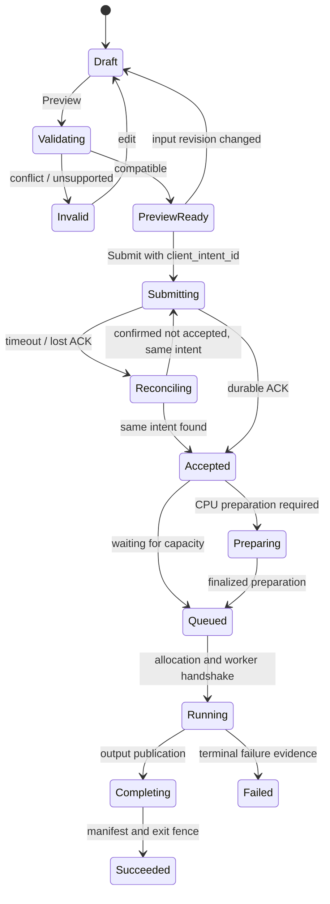

# Settings, Compute environment i wiele urządzeń — projekt interakcji

Status: **projekt docelowy**, 2026-10-04. Makiety opisują proponowany produkt,
nie dzisiejsze możliwości hosta. Obecny zakres odczytowy opisuje
[09-compute-environment](09-compute-environment.md). Kontrakty wykonania:
[compute-resource-execution-v1](../../../specs/compute-resource-execution-v1.md).
Etapy i kryteria: [plan wdrożenia](../../../plans/active/compute-execution-20261004/README.md).

## 1. Gdzie użytkownik podejmuje decyzję

| Miejsce | Decyzja / informacja | Wpływ |
|---|---|---|
| Home → Compute environment | Host, wykryte/udostępnione urządzenia, zajętość, przyczyny niedostępności | Odczyt; przejście do konfiguracji lub kolejki |
| Settings → Compute → Resources | Ile host udostępnia Fullmag, które GPU i rdzenie, rezerwa RAM/UI | Polityka operatora; przyszłe przydziały |
| Settings → Compute → Profiles | Wersjonowane, ponownie używalne wymagania wykonania | Domyślne wartości nowych draftów/runów |
| Study → Execution | Backend, device, precision, tryb, profil, zasoby tego study/kroku | Kanoniczny model study i następny Submit |
| Study → Solver settings | Integrator, tolerancje, preconditioner, demag solver | Numeryka konkretnego kroku; nie ustawienie globalne sprzętu |
| Sweep → Execution | Zasoby na przypadek, równoległe przypadki, zależności i polityka błędów | Cała zaakceptowana kolekcja przypadków |
| Run dialog → Execution preview | Żądane, przewidywane i brakujące zasoby; ile cases może działać | Walidacja przed trwałym przyjęciem |
| Runtime/Jobs Explorer | Kolejka, przydziały, aktualne próby, Pause/Stop/Retry | Istniejący command lifecycle |
| Results / Run details | Faktyczne CPU/GPU/precision i lineage wyniku | Odtwarzalność; nie edycja zakończonego runu |

Pozostaje jeden workspace i viewport. Kolejka rozwija obecne
`modules/explorer/builders/jobExplorerNodes.ts`; nie tworzymy osobnej aplikacji
„GPU mode”. Różnice FDM/FEM są panelami capability w tej samej strukturze.

## 2. Compute environment w dolnej części rail

Przykład: węzeł z czterema kartami, nie pomiar obecnego komputera.

```text
COMPUTE ENVIRONMENT                         Refresh
Local workstation      Connected · 1 running sweep
CPU    16 / 40 allocated cores   48 logical CPUs
RAM    64 / 192 GiB reserved     83 GiB in use

GPU 0 · RTX …     Running · case 03     12 / 24 GiB
GPU 1 · RTX …     Running · case 04     11 / 24 GiB
GPU 2 · RTX …     Available             0 / 24 GiB
GPU 3 · RTX …     Reserved for display

6 queued · 2 running · 8 completed
Configure compute                     View jobs →
```

- W skróconym widoku najwyżej kilka wierszy i „Show all 4”; zachowana obecna
  ograniczona wysokość i przewijanie. Pełne dane są w Settings, nie tooltipie.
- CPU „allocated cores” tylko przy znanej topologii i affinity. Gdy znamy
  jedynie logical CPUs, pokazujemy właśnie tę jednostkę.
- Reserved/allocated pochodzi z ledger; „in use” z telemetry. Nie łączymy ich
  jednym paskiem procentowym. Karta z 0% utilization może nadal być przydzielona.
- Na GPU widać osobno nazwę urządzenia, rolę/lease i pamięć. Numer porządkowy
  pomaga orientacji; wybór zawsze zachowuje UUID. Szczegóły pokazują krótki
  UUID z możliwością skopiowania pełnego identyfikatora.
- Przy current host z poprzedniej implementacji brak RAM pozostaje jawny;
  widget nie zgaduje pojemności i nie tworzy na tej podstawie oferty schedulera.
- „Configure compute” otwiera Settings na wybranym node. „View jobs” otwiera
  istniejący Explorer filtrowany po node/allocation, bez uruchamiania pracy.

## 3. Settings → Compute

W obrębie istniejącej strony Settings pojawia się grupa Compute z podwidokami
**Overview · Resources · Profiles**. Kolejka jest skrótem do Jobs Explorer.
Nie mnożymy top-level modułów. Node selector rozróżnia komputer UI, host API
i host obliczeń; przy jednym węźle jest zwykłym nagłówkiem.

### 3.1 Overview — wykryte fakty

```text
Compute              Local workstation ▾     Connected
Overview | Resources | Profiles                 Jobs →

CPU topology         2 sockets · 48 physical · 96 logical
OS allocation        40 cores available to Fullmag
Memory               256 GiB installed · 192 GiB budget
Storage              Project output policy →

Devices    Model       Memory    Role          Runtime support
GPU 0      …           24 GiB    Compute       FDM: available …
GPU 1      …           24 GiB    Compute       FEM: not qualified …
GPU 2      …           48 GiB    Compute       …
GPU 3      …           16 GiB    Display       Excluded by policy

Solver compatibility    [FDM CPU] [FDM GPU] [FEM CPU] [FEM GPU]
Last inventory: …       Last telemetry: …        Refresh
```

Kompatybilność rozwija się do: runtime version/build, precision, workflow,
algorytm/strategia demag, single-device / task-parallel / distributed,
availability i qualification. „GPU compatible” nie oznacza, że każdy solver
może użyć tej karty. Brak wpisu to „Not reported”, nie „Unavailable”.

Nie wpisujemy haseł „GPU ready” ani mnożników szybkości bez wskazanego
workloadu i dowodów. Drivers/CUDA są wyłącznie faktycznie odczytanymi wersjami.

### 3.2 Resources — uprawniony operator hosta

Formularz ma odczyt polityki, draft i osobną rewizję serwera. **Apply** działa
po walidacji; **Revert** przywraca zapisane wartości. Obecnego komunikatu
„Changes apply immediately” nie wolno użyć dla tej konfiguracji.

| Sekcja/pole | Zachowanie i walidacja |
|---|---|
| CPU capacity | Available physical/logical/quota oddzielnie; jednostka wyboru jawna |
| Reserve for system/UI | Liczba lub Auto z widocznym wyliczeniem; nie może przekroczyć capacity |
| Allowed CPU sets | Domyślnie zarządzane automatycznie; advanced pokazuje NUMA/socket i SMT siblings |
| SMT policy | Physical-first domyślnie; logical explicit; unknown topology blokuje obietnicę physical binding |
| Memory budget | Bajty wewnętrznie, MiB/GiB w edytorze; installed, operator budget, reserved, observed osobno |
| GPU allow-list | Checkbox przy UUID, rola compute/display, obsługiwane runtime; active allocation nie znika |
| GPU sharing | Exclusive domyślnie. MIG/MPS/shared wyłączone bez capability i dowodów izolacji |
| Max active workers | Dodatni limit; informacja, że RAM/VRAM i profile mogą dopuścić mniej |
| Preparation budget | Wspólny CPU/RAM limit z solve; GPU nie jest rezerwowane na CPU meshing |
| Scratch / results | Odnośnik do istniejącej OutputStorage; bez konkurencyjnego katalogu w Compute |
| Admission | Accept new work / Drain; drain nie jest Stop active jobs |

Po obniżeniu budżetu poniżej aktywnego przydziału preview pokazuje np.
„16 cores allocated; new limit 8. New jobs wait until existing jobs finish”.
Apply zapisuje następną politykę i drain nadmiaru. Usunięcie aktywnego GPU
oznacza „draining”, a nie zerwanie istniejącego procesu.

Konflikt If-Match otwiera porównanie server/draft, zachowując draft. Nie ma
automatycznego overwrite. Przy braku uprawnienia użytkownik widzi read-only
politykę i powód, a nadal może wybrać dozwolony profil dla swojego study.

### 3.3 Profiles — wymagania do ponownego użycia

Lista: Name, target/pool, CPU per task, GPU per task, RAM/VRAM, parallelism,
version, użyte przez aktywne/zapisane study. Akcje: New, Duplicate, Inspect,
Publish new version, Archive. Archiwizacja nie usuwa wersji użytych w runach.

Proponowane szablony:

- **Interactive:** lokalny host, jeden przypadek, zasoby zgodne z rezerwą UI.
- **CPU sweep:** niezależne cases, jawna liczba wątków na case i limit cases.
- **GPU sweep:** jedna zgodna karta na case, wybrana pula GPU, helper CPU/RAM.
- **Reproducible run:** przypięta wersja runtime/profilu i opcjonalny node/UUID;
  niespełnione przypięcie blokuje start.
- **Distributed solve:** widoczny jako niedostępny, dopóki wybrany workflow
  nie zgłasza qualified support dla liczby ranków/urządzeń.

Szablony nie zmieniają autorskiej precyzji ani tolerancji. „Set as default”
dotyczy nowych draftów, nie wszystkich istniejących study. Aktualizacja
użytego profilu tworzy wersję; study pokazuje „Update available” z diffem.

## 4. Study → Execution i Solver settings

Obecne `StudyInspectorPanel` ma już backend/device/precision/mode/CPU threads.
Projekt grupuje te istniejące pola i dodaje profil oraz resources; nie tworzy
ich drugiej edytowalnej kopii w Home Settings.

```text
Study: parameter sweep
EXECUTION
Profile            GPU sweep v3             Inspect / Detach
Target             Local compute pool
Backend            FDM
Device             GPU required
Precision          Double
Mode               Strict

Resources per case
GPUs               1
Eligible devices   GPU 0, GPU 1, GPU 2       Choose…
CPU threads        4
RAM reservation    12 GiB
VRAM per GPU       10 GiB                   Estimate details

SCHEDULING
Cases              24 independent
Parallel cases     Auto (up to 3 with current policy)
On failure         Continue independent cases
Retry              Disabled

SOLVER SETTINGS    Existing step-specific solver configuration →
Preview execution                                      Submit
```

- Zablokowane pola profilu pokazują źródło. Jawny override ma oznaczenie
  „Override for this study”; „Reset to profile” jest poleceniem dla tego pola.
- Global study default i per-step override są widoczne jako drzewo dziedziczenia.
  Dla mieszanych kroków podsumowanie mówi „Varies by step”, nie arbitralne GPU.
- Device `auto` nie znika po preview. UI pokazuje „Requested Auto → predicted
  GPU on node A”; faktyczny allocated/executed wybór pojawia się po admission.
- CPU threads: Auto lub dodatnia liczba; zero i ułamek są błędem. Liczba
  dostępnych wątków nie jest jednocześnie deklaracją dostępnego RAM.
- Lista GPU pokazuje VRAM fit, compatible runtime, free/allocated/draining
  i UUID. Zaznaczenie trzech GPU oznacza pulę kandydatów, gdy GPUs per case=1.
  Osobne pole „GPUs used by one solve” wymaga distributed capability.
- Pamięć „Estimate” pokazuje metodę, confidence i margines; „Measured peak”
  jest odrębną informacją z wcześniejszego porównywalnego runu.
- Zmiana study podczas pracy zapisuje draft następnego runu. Aktywny run
  zachowuje accepted snapshot; panel pokazuje różnicę i opcję nowego Submit.

## 5. Sweep editor

Osie mają tabelę parametrów, jednostek, zakresów i sposobu łączenia Cartesian/Zip.
Preview podaje liczbę cases przed materializacją. Limit rozmiaru wymaga
potwierdzenia liczby/outputu, nie ładowania wszystkich cases do React state.

Użytkownik wybiera semantykę:

- **Independent:** identyczne lub jawnie różne initial-state refs; wszystkie
  cases mogą wejść do kolejki po spełnieniu własnych zależności.
- **Continuation:** wynik poprzedniego case jest wejściem następnego.
  Parallel cases wewnątrz łańcucha = 1, z wyjaśnieniem na ekranie.
- **Dependency graph:** podgląd edges i możliwej szerokości grafu; równoległość
  jest ograniczana przez gotowe węzły, nie przez deklarowaną liczbę GPU.

Przykład histerezy: „4 independent angle chains × 100 dependent field points”.
UI proponuje równoległość czterech kątów, nie 400 dowolnych punktów.
Nested sweeps pokazują które osie są niezależne, a które kontynuowane.

Podgląd rozkładu ma dwie skale: **zasoby jednego case** oraz **łączny budżet
równoczesnych cases**. Dla CPU pokazuje iloczyn cases × threads oraz RAM;
dla GPU liczbę wyłącznych kart, ich VRAM i helper CPU. Wartość Auto jest
objaśniona przez limiting factor, np. „2 cases; limited by RAM, not GPU count”.
Nie obiecujemy czasu zakończenia bez dopasowanych danych historycznych.

## 6. Preview → Submit → obserwacja



Preview ma sekcje Requested, Predicted allocation, Unavailable requirements,
Total concurrency, Output policy. Submit jest dostępny dla poprawnego
queued requestu, nawet gdy wszystkie kompatybilne karty są obecnie zajęte.
Niewykonalny request (np. 40 GiB/case i wyłącznie karty 24 GiB) ma wyłączony
Submit z konkretnym powodem. Unknown inventory wymaga świeżej walidacji.

Po ACK UI przechodzi do konkretnego batch/run ID. Nie czeka jednym HTTP
na zakończenie symulacji. Timeout nie tworzy nowego zlecenia. Zapis zmiany
Settings, przyjęcie Submit i faktyczny start mają odrębne stany/komunikaty.

## 7. Jobs Explorer i szczegóły runu

Hierarchia: batch → case → step/task → attempt. Filtry po project, node,
device UUID, lane, status, owner; paginacja i wirtualizacja dużych list.
Kolumny: parameter tuple, status/reason, requested resources, allocation,
elapsed, output status. Progress z solvera ma zakres/znaczenie; brak liczby
postępu nie staje się procentem wymyślonym z elapsed time.

Akcje i nazwy:

- **Pause new cases**: zatrzymaj admission nowych cases, aktywne dokończ.
- **Resume admission**: odblokuj kolejkę bez ponownego Submit.
- **Cancel pending**: anuluj jeszcze nieuruchomione cases.
- **Stop active and cancel pending**: jawny Stop, status „Stopping”, dopiero
  potem terminalne receipts i release; bez kasowania wyników.
- **Retry failed**: dostępne tylko po zakończeniu/zwolnieniu poprzedniej próby;
  pokazuje przyczynę i limit prób. Nie wykonuje automatycznej zmiany fizyki.
- **Observe / Open result**: wybór istniejącego observation source w tym samym
  viewport, bez przejmowania aliasu current przez inny background worker.

Panel szczegółów ma porównanie **Requested / Resolved / Allocated / Executed**.
Przykład: „GPU required → FDM CUDA double → UUID …, CPU set … → confirmed GPU …”.
Gdy backend nie zgłosił faktycznej liczby wątków, Executed pokazuje Not reported.
Readout CPU millis nie jest przemianowywany na liczbę rdzeni bez topologii.

## 8. Błędy, dostępność i stabilność widoku

| Stan | Prezentacja i działanie |
|---|---|
| Initial loading | Szkielet bez 0 GiB/0 GPU; odczyt nie aktywuje konfiguracji |
| Stale same host | Zachowaj ostatnie dane, czas pomiaru i Retry; nie deklaruj zasobów wolnych |
| Host/owner changed | Unieważnij stare bindingi, wskaż zmianę i zażądaj nowego preview |
| Device removed | „Unavailable device UUID …”; profil zachowany, brak automatycznego zastępstwa |
| Busy GPU | „Allocated to …”; można legalnie zakolejkować następny case |
| Unknown process/lease | „Allocation outcome unknown”; read-only diagnostyka, bez przycisku force free |
| Incompatible lane | Powód capabilities; można jawnie edytować wymaganie, nie automatyczny fallback |
| Policy conflict | Zachowany draft, porównanie rewizji i ponowna walidacja |
| No operator rights | Read-only Resources; profile dopuszczone użytkownikowi nadal widoczne |
| Partial batch failure | Osobne liczniki succeeded/failed/canceled/missing; dostęp do gotowych wyników |

Wszystkie przyciski/select/dialogi korzystają z istniejących shared UI primitives.
Semantyczne tokeny Catppuccin, liczby tabular, jednostki przy każdej pamięci.
Status nie jest przekazywany samym kolorem; aria-live ogłasza zmianę stanu,
nie każdą próbkę telemetryczną. Klawiatura zachowuje fokus i otwarty formularz
podczas refresh. Reduced motion wyłącza dekoracyjne przejścia. Wąski widok
składa kolumny, ale nie ukrywa required GPU/CPU ani przyczyny błędu.

## 9. Mapa implementacji UI

| Obecny punkt | Docelowa odpowiedzialność |
|---|---|
| `start/rail/ComputeEnvironmentWidget.tsx` | Skrót inventory + allocation, wejście do Settings/Jobs |
| `start/sections/ComputeEnvironmentSettings.tsx` | Podział Overview/Resources/Profiles; cienkie komponenty |
| `start/model/useComputeProbe.ts` | Migracja do wspólnych platform compute resources; adapter compatibility z terminem usunięcia |
| `start/model/startSettings.ts` | Wyłącznie lokalne preferencje prezentacji; nie scheduler ani budget DB |
| `inspector/panels/StudyInspectorPanel.tsx` | Wspólny execution editor dla study/kroku |
| `inspector/panels/StudyGlobalAuthoringModel.ts` | Walidacja i kanoniczne patchowanie requested intent |
| `explorer/builders/jobExplorerNodes.ts` | Batch/case/task/attempt read-model i istniejące komendy |
| `kernel/api` + `kernel/resources` | Typowane zasoby compute, profile, previews i batch; scope/revision recovery |
| Shared execution form model — nowy | Jedna walidacja formularza/projection profile, reuse przez Study i Run dialog |

Przed wdrożeniem wymagane makiety/render proof: 1/4 GPU, CPU-only,
heterogeniczny RAM/VRAM, NUMA, brak pomiaru, policy conflict, queued run,
partial failure, lost ACK, wąski layout i oba motywy. To jest checklista
przyszłej implementacji; obecny dokument nie twierdzi, że nowe formularze
zostały wykonane lub przeszły browser tests.
