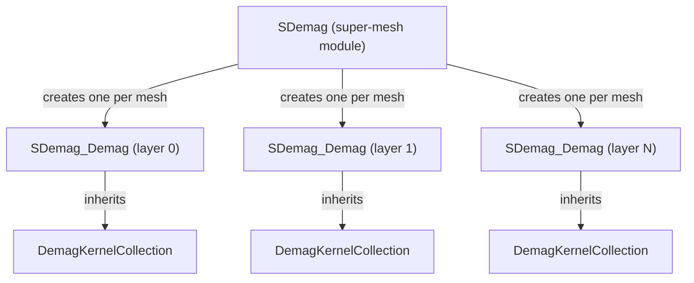

# Boris Multi-Layered Convolution Demag (Supercell)

> **Purpose**: Document Boris's multi-layered convolution approach for variable-resolution
> demagnetization, as basis for future Fullmag implementation.
>
> **References**:
> - Boris source: `SDemag.h`, `SDemag_MConv.cpp`, `DemagKernelCollection.h`
> - Lepadatu, *J. Appl. Phys.* **128** (2020) — convolution-based multi-scale approach

## 1. Problem Statement

Standard FFT-based demag requires a **single uniform grid** across the entire simulation volume.
When a system contains multiple magnetic layers (e.g. SAF stack, spin-valve), each layer
may need different spatial resolution. Boris solves this with two approaches:

| Approach | Description | Trade-off |
|---|---|---|
| **Supermesh** | Single uniform grid covering all meshes; M interpolated to/from it | Simple, but wastes resolution if layers differ in scale |
| **Multi-layered convolution** | Each mesh keeps its own resolution; cross-layer interactions via shifted Newell kernels | More complex, far more efficient for multi-scale |

## 2. Architecture

### 2.1 Module hierarchy



- **`SDemag`**: Top-level module on the super-mesh. Owns the multi-convolution orchestration.
- **`SDemag_Demag`**: Per-mesh module. Each owns a `transfer` VEC for interpolation and inherits
  `DemagKernelCollection` for its kernel set.
- **`DemagKernelCollection`**: Stores N kernels (one per layer in the system) for a single
  destination layer. Each kernel handles the interaction from source layer → this layer.

### 2.2 Key constraint: `n_common`

All layers must share the **same number of cells** `n_common = (Nx, Ny, Nz)`.
The physical cellsize varies per layer (`h_convolution = Rect / n_common`).

- In **3D mode**: all layers have identical `n_common` in all dimensions
- In **2D mode**: all layers share `(Nx, Ny)` but can differ in `Nz=1` (each layer treated as 2D)

When a mesh's own discretization differs from `n_common`, a **transfer mesh** interpolates
between the mesh's native M grid and the convolution grid.

## 3. Kernel Types

Each `DemagKernelCollection` stores N `KerType` objects (one per source layer):

### 3.1 Self-kernel (source == destination)

Standard Newell tensor, same as single-mesh demag. Stored as **real** arrays with full
octant symmetry exploitation:
- `Kdiag_real`: (Nxx, Nyy, Nzz) — only first octant stored
- `Kodiag_real` / `K2D_odiag`: off-diagonal with sign flips

### 3.2 Shifted kernel (source ≠ destination)

When layers are at different z-positions, the Newell tensor is computed with a **z-shift**:
$N_{ij}(\vec{r}) \to N_{ij}(\vec{r} + \Delta z \hat{z})$

Boris uses the shifted/irregular variants of `f`/`g` from `DemagTFunc_fg.cpp`:
- `fill_f_vals_shifted` — precomputes f on grid with z-offset
- `Ldia_shifted` / `Lodia_shifted` — 27-point stencil at shifted positions

**Optimization**: if layers differ only in sign of z-shift, Boris reuses the kernel
with `inverse_shifted = true` and adjusts sign during multiplication.

### 3.3 Irregular kernel (different source/destination cellsizes)

When source and destination layers have **different cell thicknesses** (dz_src ≠ dz_dst),
Boris uses "irregular" kernel functions:
- `Ldia_shifted_irregular_xx_yy` / `Ldia_shifted_irregular_zz`
- `Lodia_shifted_irregular_xy` / `Lodia_shifted_irregular_xz_yz`

These use a 36-point stencil (instead of 27) with contributions from both the regular
`f_vals` and a `f_vals_del` array computed at the delta cellsize.

### 3.4 Storage formats

| Kernel type | Diagonal storage | Off-diagonal storage |
|---|---|---|
| Self (no shift) | Real VEC\<DBL3\> | Real VEC\<DBL3\> or scalar array |
| z-shifted only | Real with symmetry trick | Imaginary in same real array |
| x-shifted only | Complex VEC\<ReIm3\> | Complex VEC\<ReIm3\> |
| General shift | Complex VEC\<ReIm3\> | Complex VEC\<ReIm3\> |

## 4. Runtime Algorithm

```
┌────────────────────────────────────────────────────────┐
│ For each timestep:                                      │
│                                                        │
│ 1. FORWARD FFT (per layer)                             │
│    for layer in layers:                                │
│        if transfer needed:                             │
│            M.transfer_in(layer.transfer_mesh)          │
│        ForwardFFT(layer.M or layer.transfer)           │
│        → result stored in FFT_Spaces_Input[layer]      │
│                                                        │
│ 2. KERNEL MULTIPLICATION (per destination layer)       │
│    for dst in layers (reverse order):                  │
│        KernelMultiplication_MultipleInputs(all_FFTs)   │
│        // For each source:                             │
│        //   self: Nxx*Mx + Nxy*My + Nxz*Mz (real)     │
│        //   shifted: complex tensor multiply           │
│        //   → accumulate into dst's output buffer      │
│                                                        │
│ 3. INVERSE FFT (per layer)                             │
│    for layer in layers:                                │
│        InverseFFT → Hdemag                             │
│        if transfer needed:                             │
│            Hdemag.transfer_out() → layer.Heff          │
│        else:                                           │
│            add directly to layer.Heff                  │
└────────────────────────────────────────────────────────┘
```

**Computational cost**: For L layers, each needs L kernel multiplications → O(L²) tensor
multiplications per timestep. The FFTs are O(L × N log N).

## 5. Boris `KernelMultiplication_MultipleInputs`

The core routine for each destination layer iterates over all source layers:

```cpp
void KernelMultiplication_3D(vector<VEC<ReIm3>*>& Incol, VEC<ReIm3>& Out) {
    for (int idx = 0; idx < kernels.size(); idx++) {
        if (idx == self_contribution_index) {
            KernelMultiplication_3D_Self(*Incol[idx], Out);  // real kernel, sets output
        } else if (kernels[idx]->zshifted) {
            if (inverse_shifted[idx])
                KernelMultiplication_3D_inversezShifted(*Incol[idx], Out, ...);
            else
                KernelMultiplication_3D_zShifted(*Incol[idx], Out, ...);
        } else {
            KernelMultiplication_3D_Complex_Full(*Incol[idx], Out, ...);
        }
    }
}
```

## 6. Kernel Reuse Optimization

Boris avoids recomputing identical kernels across the collection:

```cpp
shared_ptr<KerType> KernelAlreadyComputed(DBL3 shift, DBL3 h_src, DBL3 h_dst);
```

If layer pair (A→B) has the same `|shift|`, `h_src`, `h_dst` as (C→D), they share
the same kernel. For z-only shifts, a kernel computed for `+Δz` can be reused for
`-Δz` with `inverse_shifted = true`.

## 7. Implementation Plan for Fullmag

### Phase 1: Data model
- [ ] Add `Layer` concept to `ExchangeLlgProblem` (rect, cell count, cell size per layer)
- [ ] Add `TransferMesh` for interpolation between native and convolution grids

### Phase 2: Shifted Newell kernels
- [ ] Implement `fill_f_vals_shifted` in `newell.rs` (z-shifted grid)
- [ ] Implement `Ldia_shifted` / `Lodia_shifted` (shifted 27-point stencil)
- [ ] Implement irregular variants for different cellsizes

### Phase 3: Multi-layer convolution
- [ ] Implement `DemagKernelCollection` equivalent (per-layer kernel store)
- [ ] Implement `KernelMultiplication_MultipleInputs` (O(L²) tensor products)
- [ ] Forward FFT / Inverse FFT per layer with transfer meshes

### Phase 4: Optimization
- [ ] Kernel reuse detection (shared_ptr pattern)
- [ ] z-shifted symmetry reuse (inverse_shifted)
- [ ] 2D mode for thin-film stacks
