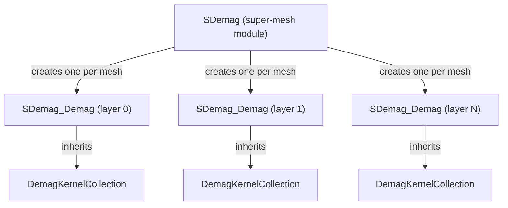

# Boris Multi-Layered Convolution Demag (Supercell)

> **Purpose**: Document Boris's multi-layered convolution approach for variable-resolution
> demagnetization, as basis for future Fullmag implementation.
>
> **References**:
> - Boris source: `SDemag.h`, `SDemag_MConv.cpp`, `DemagKernelCollection.h`
> - Lepadatu, *J. Appl. Phys.* **128** (2020) — convolution-based multi-scale approach

## 1. Problem Statement

Standard FFT-based demag requires a **single uniform grid** across the entire simulation volume.
When a system contains multiple magnetic layers (e.g. SAF stack, spin-valve), each layer
may need different spatial resolution. Boris solves this with two approaches:

| Approach | Description | Trade-off |
|---|---|---|
| **Supermesh** | Single uniform grid covering all meshes; M interpolated to/from it | Simple, but wastes resolution if layers differ in scale |
| **Multi-layered convolution** | Each mesh keeps its own resolution; cross-layer interactions via shifted Newell kernels | More complex, far more efficient for multi-scale |

## 2. Architecture

### 2.1 Module hierarchy


```mermaid
graph TD
    SDemag["SDemag (super-mesh module)"]
    SDemag -->|"creates one per mesh"| SD1["SDemag_Demag (layer 0)"]
    SDemag -->|"creates one per mesh"| SD2["SDemag_Demag (layer 1)"]
    SDemag -->|"creates one per mesh"| SD3["SDemag_Demag (layer N)"]
    SD1 -->|"inherits"| DKC1["DemagKernelCollection"]
    SD2 -->|"inherits"| DKC2["DemagKernelCollection"]
    SD3 -->|"inherits"| DKC3["DemagKernelCollection"]
```

- **`SDemag`**: Top-level module on the super-mesh. Owns the multi-convolution orchestration.
- **`SDemag_Demag`**: Per-mesh module. Each owns a `transfer` VEC for interpolation and inherits
  `DemagKernelCollection` for its kernel set.
- **`DemagKernelCollection`**: Stores N kernels (one per layer in the system) for a single
  destination layer. Each kernel handles the interaction from source layer → this layer.

### 2.2 Key constraint: `n_common`

All layers must share the **same number of cells** `n_common = (Nx, Ny, Nz)`.
The physical cellsize varies per layer (`h_convolution = Rect / n_common`).

- In **3D mode**: all layers have identical `n_common` in all dimensions
- In **2D mode**: all layers share `(Nx, Ny)` but can differ in `Nz=1` (each layer treated as 2D)

When a mesh's own discretization differs from `n_common`, a **transfer mesh** interpolates
between the mesh's native M grid and the convolution grid.

## 3. Kernel Types

Each `DemagKernelCollection` stores N `KerType` objects (one per source layer):

### 3.1 Self-kernel (source == destination)

Standard Newell tensor, same as single-mesh demag. Stored as **real** arrays with full
octant symmetry exploitation:
- `Kdiag_real`: (Nxx, Nyy, Nzz) — only first octant stored
- `Kodiag_real` / `K2D_odiag`: off-diagonal with sign flips

### 3.2 Shifted kernel (source ≠ destination)

When layers are at different z-positions, the Newell tensor is computed with a **z-shift**:
$N_{ij}(\vec{r}) \to N_{ij}(\vec{r} + \Delta z \hat{z})$

Boris uses the shifted/irregular variants of `f`/`g` from `DemagTFunc_fg.cpp`:
- `fill_f_vals_shifted` — precomputes f on grid with z-offset
- `Ldia_shifted` / `Lodia_shifted` — 27-point stencil at shifted positions

**Optimization**: if layers differ only in sign of z-shift, Boris reuses the kernel
with `inverse_shifted = true` and adjusts sign during multiplication.

### 3.3 Irregular kernel (different source/destination cellsizes)

When source and destination layers have **different cell thicknesses** (dz_src ≠ dz_dst),
Boris uses "irregular" kernel functions:
- `Ldia_shifted_irregular_xx_yy` / `Ldia_shifted_irregular_zz`
- `Lodia_shifted_irregular_xy` / `Lodia_shifted_irregular_xz_yz`

These use a 36-point stencil (instead of 27) with contributions from both the regular
`f_vals` and a `f_vals_del` array computed at the delta cellsize.

### 3.4 Storage formats

| Kernel type | Diagonal storage | Off-diagonal storage |
|---|---|---|
| Self (no shift) | Real VEC\<DBL3\> | Real VEC\<DBL3\> or scalar array |
| z-shifted only | Real with symmetry trick | Imaginary in same real array |
| x-shifted only | Complex VEC\<ReIm3\> | Complex VEC\<ReIm3\> |
| General shift | Complex VEC\<ReIm3\> | Complex VEC\<ReIm3\> |

## 4. Runtime Algorithm

```
┌────────────────────────────────────────────────────────┐
│ For each timestep:                                      │
│                                                        │
│ 1. FORWARD FFT (per layer)                             │
│    for layer in layers:                                │
│        if transfer needed:                             │
│            M.transfer_in(layer.transfer_mesh)          │
│        ForwardFFT(layer.M or layer.transfer)           │
│        → result stored in FFT_Spaces_Input[layer]      │
│                                                        │
│ 2. KERNEL MULTIPLICATION (per destination layer)       │
│    for dst in layers (reverse order):                  │
│        KernelMultiplication_MultipleInputs(all_FFTs)   │
│        // For each source:                             │
│        //   self: Nxx*Mx + Nxy*My + Nxz*Mz (real)     │
│        //   shifted: complex tensor multiply           │
│        //   → accumulate into dst's output buffer      │
│                                                        │
│ 3. INVERSE FFT (per layer)                             │
│    for layer in layers:                                │
│        InverseFFT → Hdemag                             │
│        if transfer needed:                             │
│            Hdemag.transfer_out() → layer.Heff          │
│        else:                                           │
│            add directly to layer.Heff                  │
└────────────────────────────────────────────────────────┘
```

**Computational cost**: For L layers, each needs L kernel multiplications → O(L²) tensor
multiplications per timestep. The FFTs are O(L × N log N).

## 5. Boris `KernelMultiplication_MultipleInputs`

The core routine for each destination layer iterates over all source layers:

```cpp
void KernelMultiplication_3D(vector<VEC<ReIm3>*>& Incol, VEC<ReIm3>& Out) {
    for (int idx = 0; idx < kernels.size(); idx++) {
        if (idx == self_contribution_index) {
            KernelMultiplication_3D_Self(*Incol[idx], Out);  // real kernel, sets output
        } else if (kernels[idx]->zshifted) {
            if (inverse_shifted[idx])
                KernelMultiplication_3D_inversezShifted(*Incol[idx], Out, ...);
            else
                KernelMultiplication_3D_zShifted(*Incol[idx], Out, ...);
        } else {
            KernelMultiplication_3D_Complex_Full(*Incol[idx], Out, ...);
        }
    }
}
```

## 6. Kernel Reuse Optimization

Boris avoids recomputing identical kernels across the collection:

```cpp
shared_ptr<KerType> KernelAlreadyComputed(DBL3 shift, DBL3 h_src, DBL3 h_dst);
```

If layer pair (A→B) has the same `|shift|`, `h_src`, `h_dst` as (C→D), they share
the same kernel. For z-only shifts, a kernel computed for `+Δz` can be reused for
`-Δz` with `inverse_shifted = true`.

## 7. Implementation Plan for Fullmag

### Phase 0: Native ABI boundary
- [x] Expose `fullmag_fdm_plan_kind` with explicit `UNIFORM_GRID` and
  `MULTILAYER_CONV` variants.
- [x] Expose `fullmag_fdm_layer_desc_v2` with both native and convolution grids,
  per-layer material, initial magnetization, active mask, and z-offset metadata.
- [x] Expose `fullmag_fdm_tensor_kernel_desc_v2` and
  `fullmag_fdm_multilayer_plan_desc_v2` so Rust can pass precomputed layer-pair
  tensor spectra into the native backend without overloading the legacy
  single-grid plan.
- [x] Add the native v2 creation/validation entrypoint with explicit validation
  errors and a staged execution scope for valid multilayer plans.
- [x] Add the native v2 device upload/staging path for layers and tensor kernels.
- [x] Add the first native CUDA demag owner for identity-grid `push_m`,
  tensor multiplication, and `pull_h` boundaries in fp64/fp32.
- [x] Transform all three vector components through forward and inverse cuFFT in
  the native identity-grid multilayer demag operator before tensor multiply and
  pull-back.
- [x] Batch the three staged v2 multilayer demag component transforms through
  the existing `cufftMakePlanMany(..., batch=3)` workspace, so each tensor
  kernel uses one forward and one inverse cuFFT launch instead of separate
  x/y/z launches.
- [x] Validate native identity transfer against `native_grid == convolution_grid`
  while allowing the tensor-kernel FFT grid to be padded.
- [x] Prepare cached native cuFFT workspaces for staged v2 multilayer tensor
  kernels, keyed by each tensor-kernel `fft_grid`.
- [x] Wire staged v2 handles through `step()` for the first native timestep
  slices: Heun, RK4, and fixed-step RK23 over staged multilayer layers in fp64/fp32 with optional
  demag and layer-local exchange fields; local/exchange-only plans keep
  `H_DEMAG = 0` instead of requiring demag kernels. Adaptive and multistep
  integrators are still rejected explicitly.
- [x] Allow the public multilayer FDM planner and CUDA-assisted multilayer
  runner gate to carry fixed-step RK4 and RK23 into the staged native v2 path instead of
  rejecting them at the older Heun-only public boundary. Adaptive and multistep
  v2 integrators remain explicit non-goals for this slice.
- [x] Split the public fixed-step integrator gate by execution target:
  CPU-reference multilayer execution can carry Heun, RK4, RK23, RK45, and ABM3,
  compatible `cuda_native_multilayer_single_grid` stacks can carry RK23, RK45,
  and ABM3 through the existing native single-grid CUDA backend, while staged
  native v2 multilayer execution carries fixed-step Heun, RK4, and RK23;
  staged adaptive RK23/RK45 and multistep owners remain deferred.
- [x] Add an explicit `fullmag_fdm_backend_refresh_multilayer_demag` ABI so the
  CUDA-assisted identity-grid path refreshes staged v2 demag without using
  `step(0)` as an operator call.
- [x] Expose per-layer v2 `M`, `H_EX`, and `H_DEMAG` copy entrypoints so
  refreshed native multilayer fields are observable outside private `Context`
  state. `H_EX` copies refresh the staged layer-local exchange field on demand
  before host transfer.
- [x] Expose per-layer v2 `H_DMI` copy entrypoints for staged CUDA multilayer
  handles. `Context` owns a layer-local `h_dmi` buffer and refreshes it on
  demand with the same centered interfacial/bulk DMI stencil used by the
  staged v2 explicit-RK RHS.
- [x] Expose per-layer v2 `H_ANI` copy entrypoints for staged CUDA multilayer
  handles. `Context` owns a layer-local `h_ani` buffer and
  `gpu/cuda/interactions/multilayer_anisotropy.cu` refreshes it on demand with
  the same uniaxial/cubic anisotropy field equations used by the staged v2
  explicit-RK RHS.
- [x] Expose per-layer v2 `H_EFF` copy entrypoints for staged CUDA multilayer
  handles. `gpu/cuda/interactions/multilayer_effective_field.cu` assembles
  `H_EX + H_DEMAG + H_DMI + H_ANI + H_EXT` on demand into the existing layer
  `tmp` scratch buffer after refreshing staged `H_EX`, `H_DMI`, and `H_ANI`.
  `H_DEMAG` remains the current staged demag buffer and is refreshed by the
  explicit multilayer demag refresh/timestep boundary, so `H_EFF` is observable
  without adding persistent per-layer field storage.
- [x] Expose per-layer v2 magnetization upload and route identity-grid
  CUDA-assisted multilayer demag through the staged native v2 handle, with
  provenance distinguishing native cuFFT demag from the Rust fallback.
- [x] Carry explicit `transfer_kind` through the native C ABI, Rust FFI, Rust
  runner wrapper, and native `Context` staging so `identity` and `push_pull`
  route through separate native transfer boundaries.
- [x] Add native CUDA `push_pull` transfer kernels with the same V1 semantics as
  `fullmag-fdm-demag`: volume-weighted native-to-convolution `push_m` and
  trilinear convolution-to-native `pull_h` for fp64/fp32 staged v2 demag refresh.
- [x] Precompute staged heterogeneous transfer maps in native `Context` upload:
  sparse push offsets/indices/weights and padded-FFT pull indices/weights are
  consumed by fp64/fp32 CUDA refresh kernels instead of rebuilding overlap maps
  inside the timestep launch.
- [x] Add a layer-local native CUDA exchange field owner for staged v2 layers:
  uniform-A six-neighbor stencil on each layer native grid, open Neumann
  boundary clamping, and active-mask clamping.
- [x] Add native CUDA RK4 timestep ownership for staged v2 layers, using
  per-layer `k1`/`k2`/`k3`/`k4` stage fields and the same optional demag plus
  layer-local exchange RHS as the Heun slice.
- [x] Add fixed-step native CUDA Bogacki-Shampine RK23 ownership for staged v2
  layers, reusing the shared explicit-RK RHS and existing `k1`/`k2`/`k3`
  buffers. `adaptive_timestep` remains rejected; each native step requires a
  positive `dt_seconds`. Embedded-error reduction, FSAL and adaptive
  accept/reject/retry remain deferred.
- [x] Carry the requested uniform external field through
  `fullmag_fdm_multilayer_plan_desc_v2`, Rust FFI, Rust runner wrapper, and
  native `Context`, and include it in the staged v2 explicit-RK RHS alongside
  optional demag and layer-local exchange.
- [x] Carry per-layer uniform uniaxial anisotropy (`Ku1`, `Ku2`, axis) through
  `fullmag_fdm_layer_desc_v2`, Rust FFI, Rust runner wrapper, and native staged
  layer state. The staged v2 explicit-RK RHS uses the same FDM field convention as
  the single-grid backend,
  `H_ani = [2/(mu0 Ms)] [Ku1 (m.u) + 2 Ku2 (m.u)^3] u`, for fp64/fp32 layers.
  Per-cell anisotropy fields remain outside this slice.
- [x] Carry per-layer uniform cubic anisotropy (`Kc1`, `Kc2`, `Kc3`,
  `axis1`, `axis2`) through `fullmag_fdm_layer_desc_v2`, Rust FFI, Rust runner
  wrapper, and native staged layer state. The staged v2 explicit-RK RHS uses the
  existing single-grid native FDM cubic field convention in the local cubic
  basis where `axis3 = axis1 x axis2`; per-cell `kc*_field` inputs remain
  outside this slice.
- [x] Preserve layer-local anisotropy at the public multilayer observation
  boundary: CPU reference observables expose `H_ani`/`E_ani`, CUDA-assisted
  double/single field assembly carries the same derived `H_ani`, and native
  stacked scalar/field reporting reuses layer-local contexts instead of losing
  anisotropy fields at the combined-grid boundary. Staged v2 CUDA handles also
  expose `H_ANI` through the per-layer copy ABI, backed by the layer-local
  `h_ani` device buffer; staged `H_EFF` copy refreshes staged exchange,
  anisotropy, and DMI before scratch-backed effective-field assembly.
- [x] Carry global interfacial and bulk DMI constants through
  `FdmMultilayerPlanIR`, `fullmag_fdm_multilayer_plan_desc_v2`, Rust FFI, Rust
  runner wrapper, and native `Context`. The staged v2 explicit-RK RHS applies the
  same centered finite-difference FDM DMI convention as the single-grid backend
  on each layer native grid, with open/active-mask clamping. Per-layer DMI and
  per-cell DMI fields remain outside this slice; global DMI exposes a separate
  staged `H_DMI` layer copy endpoint.
- [x] Keep CPU reference multilayer and CUDA-assisted/native-stacked
  multilayer execution semantically aligned for global interfacial/bulk DMI:
  per-layer contexts receive the global constants, CPU reference observables and
  RHS include `H_DMI`/`E_DMI`, CUDA-assisted local effective fields include the
  same local DMI term, and the native stacked single-grid plan preserves the DMI
  constants instead of dropping them while composing the global `FdmPlanIR`.
  Native stacked scalar/field reporting also reuses the layer-local contexts, so
  public `H_dmi` snapshots and per-object `e_dmi` are not lost at the combined
  grid observation boundary.
- [x] Reject public multilayer FDM thermal noise, Oersted terms, and
  spin-torque inputs explicitly until staged CPU/GPU multilayer RHS coverage
  exists, so those physics terms cannot be silently dropped from
  `FdmMultilayerPlanIR`.
- [x] Reject public FDM materials with per-cell material fields (`ms_field`,
  `a_field`, `alpha_field`, `ku*_field`, `kc*_field`) until FDM plan material
  realization can carry those payloads. This prevents both single-grid and
  multilayer FDM from silently lowering spatial material fields to uniform
  constants.
- [x] Emit runner field artifacts for multilayer snapshots as per-layer series:
  `fields/<quantity>/manifest.json` records layer IDs, native origins,
  vector shape, value offsets, and per-layer directories; each layer snapshot
  stores only that layer's vector values while retaining the full multilayer
  layout provenance. REST/data-plane layer fetching remains a separate product
  API step.
- [x] Add cached native CUDA per-grid cuFFT workspace planning for staged v2
  demag: mixed `fft_grid` tensor kernels bind a cached
  `DeviceMultilayerFftWorkspace` instead of freeing and recreating the context
  FFT plan/buffers on every grid switch.
- [x] Execute staged v2 multilayer demag cuFFT as one batched x/y/z forward and
  one batched x/y/z inverse per tensor kernel, reusing the cached per-grid
  workspace.
- [x] Key staged v2 `push_pull` pull maps by tensor-kernel `fft_grid`: layer
  push maps remain per source layer because they depend only on
  native/convolution overlap, while each tensor kernel owns the destination
  padded-FFT pull map used by `pull_h`.
- [ ] Finish optimized interpolation backends and remaining local-field RHS
  coverage for thermal noise, Oersted, spin torque,
  per-layer/per-cell DMI and per-cell anisotropy fields, and the remaining v2
  integrators beyond fixed-step Heun/RK4/RK23, including adaptive RK23/RK45
  and multistep ABM3.

### Phase 1: Data model
- [ ] Add `Layer` concept to `ExchangeLlgProblem` (rect, cell count, cell size per layer)
- [ ] Add `TransferMesh` for interpolation between native and convolution grids

### Phase 2: Shifted Newell kernels
- [ ] Implement `fill_f_vals_shifted` in `newell.rs` (z-shifted grid)
- [ ] Implement `Ldia_shifted` / `Lodia_shifted` (shifted 27-point stencil)
- [ ] Implement irregular variants for different cellsizes

### Phase 3: Multi-layer convolution
- [ ] Implement `DemagKernelCollection` equivalent (per-layer kernel store)
- [ ] Implement `KernelMultiplication_MultipleInputs` (O(L²) tensor products)
- [ ] Forward FFT / Inverse FFT per layer with transfer meshes

### Phase 4: Optimization
- [ ] Kernel reuse detection (shared_ptr pattern)
- [ ] z-shifted symmetry reuse (inverse_shifted)
- [ ] 2D mode for thin-film stacks
