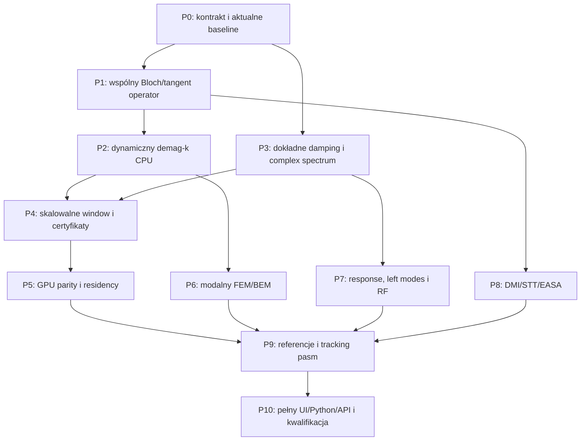

# Plan rozbudowy eigensolve Fullmaga na podstawie TetraX, tetmag, mumax+ i modułu COMSOL

Data: 10.10.2026. **Baza implementacji: `C:/git/fullmag/worktrees/eigensolve-dispersion-plan-20260912`, branch `codex/eigensolve-dispersion-plan-20260912`, odczytany HEAD `1827c3436f80ff17396c285d13c0e269eecf4b25`.** Porównujemy rzeczywiste pliki tego worktree; ich SHA-256 w sekcji 10 wiąże stan także przy równoległych zmianach. Master nie jest bazą oceny gotowości. Plik raportu/planu jest zapisany w bieżącym workspace; nie oznacza to zmiany bazy źródeł.
Status: **plan, implementacja niezlecona; runtime i kwalifikacja nowych funkcji NOT VERIFIED**.
Rewizja R2: poprawiona po niezależnym review fizyki/numeryki. Fragmenty źródłowe i ich tożsamość znajdują się w sekcji 10; rozstrzygnięte decyzje i bramki w sekcjach 4–7.
Poprzedni dokument: [audyt porównawczy](../../audits/2026-10-10-eigensolve-fullmag-tetrax-tetmag-comsol.md).

## 1. Cel, zakres i znaczenie „importu”

Celem jest wspólny, fizycznie spójny operator liniowego LLG dla modów własnych, dyspersji Blocha/Floqueta i wymuszonej odpowiedzi harmonicznej. Musi on obejmować dynamiczny demag dla niezerowego k, dokładne tłumienie Gilberta z zespolonymi częstotliwościami, poprawne warunki brzegowe i wiarygodne pasma. Realizacje FEM CPU/GPU korzystają z tego samego kontraktu naukowego, lecz mają oddzielną implementację i kwalifikację.

„Import” oznacza adaptację metod, fizyki i wzorców weryfikacji do architektury Fullmaga. Nie oznacza kopiowania kodu z `external_solvers` ani zastępowania MFEM/hypre/libCEED przez drugi stos FEM. Referencje pomagają zaprojektować i sprawdzić Fullmag; kanoniczne znaki, jednostki i API pozostają własnością Fullmaga.

Zakres planu obejmuje **P0–P10**. Pierwsza capability S1 to film/antidot FEM P1: periodyczne x/y, otwarte z, magnetostatyczny demag-k, exchange/Zeeman/anisotropy, zaakceptowana równowaga, double. S2 dodaje dokładne α≥0 i rozróżnienie modów oscylacyjnych, nieoscylacyjnych oraz niestabilności. S3 domyka modalny FEM/BEM, RF i DMI/STT/surface anisotropy. P6–P8 są częścią tego planu, a nie pominiętym wymaganiem. Każda capability otrzymuje własną kwalifikację. P11 jest odrębnym dalszym zakresem.

Decyzje implementacyjne R2: **zachowujemy istniejącą trasę pełnych phasorów z quasiperiodic constraints w dedykowanym worktree**; bez dołożenia grad_k do tej samej FE basis. Periodyczna obwiednia+grad_k jest oddzielną referencją porównawczą i geometria waveguide z TetraX, a nie nakazem przepisania istniejącego solvera. Masa/energia składane spójnie elementowo; ewentualny lumped metric ma jawny kontrakt i osobną convergence. Complex algebra rozwija istniejący sparse rotated real-split; completeness ma osobny status. Zmiana reprezentacji wymaga opisania wpływu na dyskretyzację i dowodu, nie wyboru w kernelu.

Ten plik jest wewnętrznym planem z uzasadnieniem fizycznym. Nie zastępuje terminalnych not naukowych ani nie publikuje nowych parametrów. Przed implementacją P0 trzeba uzupełnić istniejących właścicieli w `docs/physics`, ich source maps, publiczne parametry/Python→IR i wymagane walidatory. Nie twórz równoległego zestawu równań w dokumentacji każdego backendu.

## 2. Co już mamy, a co rzeczywiście trzeba uzupełnić

| Obszar | Obecny stan potwierdzony w źródłach | Brakujący wynik |
|---|---|---|
| Dynamiczny demag K0 | Poisson-airbox, shared-domain assembly, CPU Schur i GPU PETSc/SLEPc | Aktualna kwalifikacja fizyczna, zbieżność i parity; nie pisać tego od nowa |
| Floquet/demag-k CPU | Dedykowany worktree ma production routing, native Floquet owner, dynamiczny shared-domain demag i pełne descriptor/seam-frame checks | Domknięcie geometry/exterior certificates, aktualna kwalifikacja runtime/nauki, skalowanie; nie ponowna implementacja całej trasy |
| Skalarne building blocks Blocha | `floquet_bloch_scalar.cpp` ma assembly operatora, constraints i tangent source | Spójny sparse end-to-end payload; reduced operator w obecnym helperze ma typ `DenseMatrix` |
| Tłumienie | DSL i IR mają `ignore` oraz `include`; reference output dodaje korekcję linewidth | Produkcyjny solve z α w pencil i rzeczywistymi zespolonymi eigenvalues |
| Zespolone pola | Są phasory, real-split i mapowanie λ↔ω | Nie utożsamiać zespolonego profilu/pola z dokładnym tłumionym eigenproblemem |
| Selected spectrum | Sparse SLEPc/Krylov–Schur, multi-shift i istniejący contour owner; zakres certificate zależy od adaptera | Integracja count do sparse Floquet, damping region, degeneracje i kwalifikacja; nie implementować ponownie całego contour ownera |
| FEM/BEM | Moduły CPU/GPU demag istnieją w `backends/fem` | Potwierdzony modalny tangent provider, wersja skalowalna i odrębne granice open/periodic |
| DMI/STT | Time-domain i niektóre driven-response paths są szersze niż modalne; reference DMI ma uproszczenia znaku/k | Liniaryzacja, BC i lowering jawnie obsługiwane przez modalny plan; usunąć niedopuszczalne uproszczenia referencji |
| Surface anisotropy | Boundary term istnieje w CPU reference, lecz axis dependence jest uproszczone | Pełna signed tangent Hessian i rozróżnienie dowolnej osi od EASA wzdłuż normalnej |
| Provenance i wyniki | Requested/resolved, equilibrium handoff, artefakty modalne/driven | Dokładność metody damping, lewy/prawy mod, decay/growth, kompletność pasm i wspólne UI/Python |

Ważne doprecyzowanie audytu: `include` już jest tokenem publicznym, ale w CPU reference `eigen_output.rs::damping_imaginary_factor` używa `abs(alpha)/(1+alpha²)`, a opis wskazuje `damping_is_first_order_linewidth_correction`. To **przybliżenie na referencyjnej bazie modów**, a nie dowód produkcyjnego tłumionego solve. Natywne bramki K0 nadal wymagają `Ignore`. Plan nie wprowadza drugiego synonimu `include` bez potrzeby; rozdziela metodę i jej kwalifikację w capability/provenance.

`crates/fullmag-runner/src/fem/eigen_operator.rs` wymaga osobnego uporządkowania w P8: `add_dmi_real`/`add_dmi_2x2` używają sumy wartości bezwzględnych Di/Db, a complex paths upraszczają shift i dla `KSamplingIR::Path` przyjmują k=0. Surface term używa skalarnego średniego czynnika `1-(m0·axis)^2` zamiast ogólnego kierunkowego 2×2 tangent Hessianu. To potwierdzone uproszczenia źródłowe, nie zmierzony tutaj błąd konkretnego wyniku. Nie wolno użyć tych tras jako oracle signed-DMI/EASA bez sprawdzenia fizyki i zakresu.

## 3. Macierz adaptacji z każdego źródła

| Referencja | Co przejmujemy metodologicznie | Zadanie | Co zachowujemy jako odrębne |
|---|---|---|---|
| TetraX: dynamic matrix | Pełny operator liniowego LLG w bazie stycznej, aktualizowany przy zmianie k | P1–P3 | Nasze SI, jawna macierz masy i gyrotropic pencil |
| TetraX: FEM/BEM demag-k | k zależny potencjał, źródło i gradient pola; dynamiczny demag w operatorze | P2, P6 | Geometrie propagujące TetraX nie są dowolnym 3D Bloch crystal |
| TetraX: shift-invert | Silny sparse local/core preconditioner dla pełnego matrix-free operatora | P4 | SLEPc/MFEM zamiast wprowadzania SciPy do produkcji; brak automatycznej zmiany tolerancji |
| TetraX: absorption/linewidth | Modalne sprzężenie RF, eliptyczność, porównanie małego α z dokładnym solve | P3, P7 | Perturbacyjny linewidth jawnie oznaczony; nie zastępuje α w pencil |
| TetraX: k/m modes | Rozdzielenie partnerów, profile, tracking | P9 | Przeciwne k, polaryzacja i degeneracje pozostają fizycznymi informacjami |
| tetmag: FEM/BEM | Open-boundary demag bez objętościowego airboxu; kompresja H2 i reuse | P6 | Open-boundary BEM nie jest automatycznie periodic BEM |
| tetmag: AMG/ILU | Preconditioning potencjału i reusable workspaces | P4, P6 | AMG jest solverem bloku liniowego, nie modalnym eigensolverem |
| tetmag: LLG w czasie | Niezależne ringdown/RF jako kontrola f i decay | P3, P9 | CVODE nie jest zamiennikiem operatorowego eigensolve |
| mumax+: sinc + FFT | Mechanizm kontroli widma czasowo-przestrzennego; nowy zgodny fixture FM dla DE/BV | P9 | Wskazany lokalny test jest AFM i wyłącza demag; nie kwalifikuje DE/BV FM |
| COMSOL: linearized LLG | Zespolone eigenfrequencies z α i spójny statyczny/dynamiczny model | P0–P3 | Manual nie ujawnia algorytmu bibliotecznego solvera |
| COMSOL: Floquet | Wspólna faza δm i δφ, periodyczne komórki, band structure | P1–P2, P9 | Fully 3D periodic K0 wymaga osobnej konwencji pola makroskopowego |
| COMSOL: study workflow | Relax → zaakceptowana równowaga → eigenfrequency albo driven response | P0, P7, P10 | Eigenmode i peak odpowiedzi nie są tym samym produktem |
| COMSOL: DMI/STT/EASA | Rozszerzenie liniaryzacji i fizycznych BC | P8 | Manual sam sygnalizuje lukę frequency-domain DMI BC; wyprowadzamy z energii |
| COMSOL: multiphysics | Sprzężone RF/elastic modes jako osobne rozszerzenie | P11 | Magnetostatyczny dynamic demag nie obejmuje propagacji EM |

Lokalne źródła: TetraX `experiments/eigen/{dynamic_matrix,solve}.py`, `interactions/dipole.py`, `experiments/eigen/postprocessing/absorption.py`; tetmag `main/{DemagField,BEMOperator,LLGIntegrator,AMGCLSolver}.cpp`; mumax+ `external_solvers/plus/src/cmd/spinwave_dispersion.cpp` i `test/test_spinwave_dispersion_atm.py`.

Manual odniesienia: `docs/comsol/Manual_for_Micromagnetics_Module.pdf`, V2.13 z 29.09.2025; rozdziały V i VII.A. Druga lokalna kopia V2.13 z 27.12.2024 jest starsza i ma inną paginację. Nie mieszamy numerów stron między kopiami.

## 4. Fizyka, która musi być wspólna dla całej implementacji

### 4.1 Stan równowagi i liniowy LLG

Przyjmujemy małe zaburzenie wokół zaakceptowanego stanu:

```{math}
:label: plan-eigen-tangent-ansatz
\mathbf m(\mathbf r,t)=\mathbf m_0(\mathbf r)+\operatorname{Re}\left[T(\mathbf r)q(\mathbf r)e^{i\Omega t}\right],
\quad T^{\mathsf T}\mathbf m_0=0,\quad T^{\mathsf T}T=I_2,\quad |\mathbf m_0|=1.
```

To jest zapis **ciągły**. Obecne magnetic P1 assembly Fullmaga używa ram węzłowych i trial field

```{math}
:label: plan-eigen-nodal-lift
\delta\mathbf m_h(\mathbf r)=\sum_a N_a(\mathbf r)T_aq_a.
```

N_a to funkcje kształtu P1, a indeksuje magnetic nodes, h to rozmiar elementu. Nodal tangency jest dokładną więzą dyskretną; nie gwarantuje punktowo m0,h·δm_h=0 wewnątrz elementu. Nie narzucamy więc progu roundoff na quadrature leakage niejednorodnej tekstury: raportujemy je osobno i wykazujemy zbieżność h. Weryfikacja ram: dla dowolnych R_a∈SO(2), T'_a=T_aR_a i q'_a=R_a^Tq_a dają identyczny lift, covariant action i to samo widmo. Dowód aktualnego assembly: [E16](#e16).

Dla czysto Gilbertowskiego równania, przed rozwiązaniem względem pochodnej czasowej:

```{math}
:label: plan-eigen-linearized-llg
(I-\alpha C_0)\partial_t\delta\mathbf m
=-\gamma_0\left[C_0\delta\mathbf H_{\mathrm{eff}}+\delta\mathbf m\times\mathbf H_{\mathrm{eff},0}\right]+\delta\boldsymbol\tau,
\qquad C_0\mathbf v=\mathbf m_0\times\mathbf v.
```

Tutaj δτ oznacza liniaryzację dodatkowej torque w tej **samej** postaci Gilbertowskiej. Jeżeli backend daje już direct RHS po odwróceniu czynnika Gilberta, nie można odwracać go ponownie. To trzeba sprawdzić dla STT/SOT.

Pole statyczne H_eff,0 zawiera statyczny demag i stabilizuje równowagę. Pole dynamiczne jest pochodną Frécheta funkcjonału pola: δH_eff = D H_eff[m0] δm. Obejmuje exchange, anisotropy, demag i jawnie wspierane interakcje. W równowadze bez torque H_eff,0 jest równoległe do m0; człon δm × H_eff,0 nie może zniknąć podczas budowy Hessianu/LLG.

Po poprawnej projekcji i złożeniu FEM obowiązuje istniejący słownik Fullmaga:

```{math}
:label: plan-eigen-canonical-pencil
L_{\mathbf k}q=\lambda B_\alpha q,\qquad \lambda=i\Omega,
\qquad (i\omega B_\alpha-L_{\mathbf k})q=b.
```

Pierwsze równanie daje swobodne mody, drugie odpowiedź na rzeczywiste wymuszenie o częstości ω. L i B_alpha są złożonymi operatorami słabej formy, nie „gołą Hessian matrix” bez masy, precesji i skali gamma. Przy przestrzennie zmiennych Ms, gamma i α trzeba składać ich lokalne wagi. **TetraX nie zastępuje gamma samą średnią:** [E01](#e01) ma unitless_gamma(r) w diagonalnym operatorze, a gamma_average w frequency scale. To nondimensionalization, nie dowód uniform-material approximation. Tak samo trzeba odróżnić jego unitless Ms od utraty pola materiałowego.

**Rozdzielenie Hessianu i generatora.** Przy braku torque i H_eff,0=h0 m0, działanie generatorowe przed odwróceniem Gilberta to −γ0 C0(DH_eff[m0]δm−h0δm). Constrained energy Hessian zawiera natomiast wariację energii i człon geometryczny od |m|=1:

```{math}
:label: plan-eigen-constrained-energy
\delta^2E_c[\delta\mathbf m]
=\delta^2E[\delta\mathbf m]+\int_{\Omega_m}\mu_0M_sh_0|\delta\mathbf m|^2\,dV,
\qquad E_2(q_{real})=\tfrac12 q_{real}^{\mathsf T}K_Eq_{real},
\qquad \overline E_2(q)=\tfrac14 q^{\mathsf H}K_Eq.
```

W nodal formulation mnożniki więzów pochodzą z **tego samego E_h i tej samej quadrature**, nie z osobno interpolowanego continuum h0. K_E jest Hermitian dla konserwatywnej energii; L generatorowego nie wolno uznać za Hermitian. E2 dotyczy rzeczywistej chwilowej perturbacji; Ebar to średnia po fazie przy ustalonej amplitudzie oscylacyjnego phasoru, a nie średnia po skończonym okresie z zanikiem. Overdamped real mode używa chwilowego E2. Energy-Hessian/gyrotropic realization ma inną parę macierzy niż generator realization. P0 zapisuje jawne przekształcenie obu stron pencil i drive, jednostki oraz original residual dla każdego adaptera. Np. fixed Zeeman energy jest liniowa w m, ale jej constrained Hessian jest dodatnia dla stabilnego macrospinu; samo E'' dałoby błędne zero częstości. Dopiero udowodniona Hermitian reformulation z dodatnią masą dopuszcza metody wymagające tego typu problemu; `LOBPCG` nie jest ogólnym solverem (L,B_alpha).

Pasywny model ma test bilansu, oprócz residualu:

```{math}
:label: plan-eigen-gilbert-energy-balance
\frac{dE_2}{dt}=-\int_{\Omega_m}\frac{\mu_0M_s\alpha}{\gamma_0}|\partial_t\delta\mathbf m|^2\,dV,
\qquad
\Gamma\,q^{\mathsf H}K_Eq=\int_{\Omega_m}\frac{\mu_0M_s\alpha}{\gamma_0}|\lambda\delta\mathbf m|^2\,dV.
```

Druga równość dotyczy finite eigenmode i bilansu fazowo uśrednionej energii kwadratowej. Przy positive constrained K_E i α≥0 nie ma wzrostu. Test dwu materiałów z różnymi Ms, gamma0 i α sprawdza właściwe wagi; volume L2 do wizualizacji nie zastępuje energy ani gyrotropic pairing. α=0 zachowuje E2. Te stwierdzenia nie dotyczą modelu z aktywnym STT ani niestabilnej równowagi.

Stan pod prądem musi spełniać stacjonarny **pełny RHS z torque**. Minimum energii bez prądu nie jest automatycznie równowagą pod prądem. Stan periodyczny w czasie wymaga innego, czasowego Floqueta i jest poza pierwszym zakresem.

Właściciele: `docs/physics/0700-frequency-domain-linearized-llg.md`, `0831-fem-dynamic-pencil-modal-response-and-krylov.md`; implementacja: `LinearizedDynamicPencil::{apply_L,apply_B_alpha,apply_Aomega}` w `backends/fem/include/frequency_domain/linearized_dynamic_pencil.hpp`.

### 4.2 Dynamiczny demag: co znaczy „dynamiczny”

W przybliżeniu magnetostatycznym pomijamy retardację EM. „Dynamiczny” oznacza pole generowane przez zaburzenie magnetyzacji, nie propagujące elektromagnetyczne fale w próżni. Przy nieruchomym Ms operator demag jest liniowy; wymaga jednak właściwego dynamicznego źródła i granic.

```{math}
:label: plan-eigen-demag-magnetostatics
\delta\mathbf M=M_s\delta\mathbf m\,\chi_{\Omega_m},\qquad
\delta\mathbf H_d=-\nabla\delta\phi,\qquad
\nabla\cdot(\delta\mathbf H_d+\delta\mathbf M)=0,
\qquad \Delta\delta\phi=\nabla\cdot\delta\mathbf M.
```

Charakterystyka χ rozszerza M przez zero do powietrza. Dywergencja obejmuje źródła objętościowe i skoki na powierzchni. Antidot, interfejs Ms i brzeg próbki nie mogą zostać pominięte przez samo różniczkowanie wewnątrz jednorodnego regionu. Potencjał jest ciągły; normalna składowa H+M jest ciągła, z odpowiednim znakiem skoku pochodnej φ.

W złożonym pencil dynamiczny demag pojawia się jako sprzężenie z potencjałem:

```{math}
:label: plan-eigen-demag-descriptor
\begin{bmatrix}A_{qq}(\mathbf k)&A_{q\phi}(\mathbf k)\\A_{\phi q}(\mathbf k)&P(\mathbf k)\end{bmatrix}
\begin{bmatrix}q\\\phi\end{bmatrix}
=\lambda\begin{bmatrix}B_\alpha&0\\0&0\end{bmatrix}\begin{bmatrix}q\\\phi\end{bmatrix},
\quad L_{\mathbf k}=A_{qq}-A_{q\phi}P^{-1}A_{\phi q}.
```

P^{-1} oznacza rozwiązanie z prawidłowymi BC i ewentualnym gauge, nie gęstą odwróconą macierz. Pole statyczne H_d[m0] nie może zastąpić działania H_d[δm]. Potencjał ma zerowy blok masy: układ jest descriptor system, a nie zwykłym eigenproblemem z dodatnio określoną masą dla wszystkich DOF. Mody nieskończone/constraint-only nie są spin waves. Po Schurze trzeba odtworzyć φ i sprawdzić pełne równania **w dopuszczalnej przestrzeni testowej BC**, przed Schurem.

W macierzy powyżej q/φ oznaczają współrzędne po zgodnej redukcji BC/frame. Dla zrekonstruowanych full fields residual podlega C^H: r_red=C^H r_full. Raw row residual na eliminated periodic DOF może zawierać constraint reaction i nie musi być zerowy; żądanie r_full=0 na każdym takim wierszu byłoby błędnym testem. Oddzielnie weryfikujemy phase/frame seams, integral flux balance i geometry/exterior. Aktualny worktree już ma `full_projected_weak_form_and_periodic_seams` ([W04](#w04)); nie dowodzi to pointwise strong-form flux ani geometric BC qualification.

Dla Robin/Dirichlet nie dodajemy gauge tylko z powodu periodycznych boków. Mean-zero stosujemy wyłącznie przy rzeczywistym stałym nullspace, np. pure Neumann K0. Fully 3D periodic K0 wymaga określenia makroskopowego pola/kształtu otoczenia i pozostaje odrębnie gated.

Właściciele: `0830-fem-poisson-airbox-modal-eigen.md`, `0828-fem-frequency-domain-floquet-demag.md`; kod K0: `solve_poisson_airbox_modal_eigen_cpu_schur`, `evaluate_poisson_airbox_modal_residuals`.

### 4.3 Bloch/Floquet: faza i operator potencjału

Chodzi o **przestrzenny** Floquet dla periodycznej próbki. Ustalamy konwencję przestrzenną zgodną z istniejącym `ExpMinusIKDotDeltaR`:

```{math}
:label: plan-eigen-bloch-ansatz
\delta\mathbf m_{\mathbf k}(\mathbf r)=e^{-i\mathbf k\cdot\mathbf r}\mathbf u_{\mathbf k}(\mathbf r),
\quad \delta\phi_{\mathbf k}(\mathbf r)=e^{-i\mathbf k\cdot\mathbf r}v_{\mathbf k}(\mathbf r),
\quad \nabla_{\mathbf k}=\nabla-i\mathbf k.
```

u i v są periodycznymi obwiedniami. Równanie potencjału w reprezentacji obwiedni:

```{math}
:label: plan-eigen-bloch-demag
\nabla_{\mathbf k}\cdot\nabla_{\mathbf k}v_{\mathbf k}
=\nabla_{\mathbf k}\cdot(M_s\mathbf u_{\mathbf k}\chi_{\Omega_m}),
\qquad \mathbf h_{d,\mathbf k}=-\nabla_{\mathbf k}v_{\mathbf k}.
```

Słaba forma dla periodycznej skalarnej funkcji testowej w:

```{math}
:label: plan-eigen-bloch-weak
\int_D(\nabla_{\mathbf k}w)^*\cdot\nabla_{\mathbf k}v_{\mathbf k}\,dV
+\beta_R\int_{\Gamma_o}w^*v_{\mathbf k}\,dS
=\int_{\Omega_m}(\nabla_{\mathbf k}w)^*\cdot M_s\mathbf u_{\mathbf k}\,dV.
```

Robin jest tutaj jawnym modelem przybliżonej granicy zewnętrznej. Dla k≠0 trzeba zbadać jego błąd i dobór, a nie traktować współczynnika K0 jako dokładnego otwartego otoczenia. W nieskończonym otoczeniu mod filmu o danym bocznym |k| ma charakterystyczny zanik pola; niskie k jest szczególnie wymagające dla wysokości airboxu. Alternatywa to właściwy exterior operator/BEM, z odrębną kwalifikacją.

Równoważna reprezentacja pełnych phasorów używa zwykłego ∇ i quasiperiodic constraints:

```{math}
:label: plan-eigen-floquet-constraints
p=e^{-i\mathbf k\cdot\Delta\mathbf r},\quad
\delta\phi_{dst}=p\delta\phi_{src},\quad
q_{dst}=p\,T_{dst}^{\mathsf T}Q T_{src}q_{src}.
```

Q=I dla translacji. Różne bazy styczne na dwóch stronach nie uprawniają do nałożenia q_dst=p q_src bez frame transport. Odwrotne normalne boków wymagają też spójnego flux check. Redukcja zespolona stosuje C^H A C, z Hermitian transpose constraints, nie C^T A C.

Dla tekstury T zależy od położenia. Pochodna fizycznego zaburzenia to grad_k(Tq), a nie samo T grad_k(q): należy zachować pochodne bazy albo składać operator na fizycznych wektorach i dopiero go rzutować. Inaczej częstotliwości mogą zależeć od arbitralnego wyboru lokalnych ram.

**Jedna reprezentacja na jeden solve:** periodyczne obwiednie + grad_k albo pełny phasor + fazowane constraints. Nie stosujemy tej samej fazy dwukrotnie. W P1 trzeba sklasyfikować obecne scalar helpers i sprawdzić ciągłą równoważność oraz właściwy błąd każdej dyskretyzacji. Połączenie istniejących helperów „bo każdy zna k” grozi podwójnym Bloch shift.

W R2 zachowujemy production **full-phasor constraint route** dedykowanego worktree: zwykły gradient na pełnych FE fields, k w constraint/lift, wspólna faza m/φ. W alternatywnej envelope reference u/v mają zwykłe periodic constraints, a grad_k i przy eksporcie exp(−ik·r) zapewniają właściwy model. Obecny worktree ma już jawny wybór `full_field_phase_constrained` w assembly i `shifted_envelope` w osobnym helperze ([E15](#e15)). Nie opisujemy ich już jako nieklasyfikowanych ani nie zlecamy ponownie istniejącej korekty double shift. `mfem::ComplexOperator::HERMITIAN` opisuje konwencję blokowej reprezentacji; nie jest świadectwem Hermitian/positive definite fizycznej macierzy.

**Ważna poprawka numeryczna:** ciągła równoważność nie oznacza identycznych standardowych FE P1 na tej samej siatce: exp(−ik·r)P1 nie jest przestrzenią P1. Dokładna congruence dotyczy tylko jawnie phase-transformed FE basis. Dla dwóch zwykłych dyskretyzacji wymagamy tej samej granicy przy refinement i zgodności z manufactured wave w zadanym budżecie błędu. Zgodność k i k+G (G reciprocal lattice vector) jest testem continuum/refinement, nie arbitralną dokładną równością każdej skończonej P1 macierzy.

TetraX ma propagacyjny gradient **+ik** ([E04](#e04)); Fullmag używa **−ik**. Porównanie wymaga mapy k_TetraX=−k_Fullmag w tej samej fizycznej osi, spójnego phasoru i polaryzacji. Signed DMI nie może być odwracane przy dopasowaniu wyników. Sama równość |k| jest niewystarczająca dla niereciprocal spectrum.

Dla α=0 bez niekonserwatywnych torque trzeba zachować odpowiednią adjoint/Hessian structure, przejście k→0 oraz spójność narożników. Przy rzeczywistych współczynnikach sprzężenie zespolone wiąże również k z −k. Nie należy automatycznie usuwać wszystkich ujemnych partnerów przy tym samym k, zwłaszcza dla niereciprocal DMI i różnych polaryzacji.

Źródła: `0828-fem-frequency-domain-floquet-demag.md`, `floquet_bloch_scalar.cpp::{assemble_floquet_bloch_scalar_operator,assemble_floquet_bloch_scalar_constraint,assemble_floquet_bloch_scalar_tangent_source}`; COMSOL V.E.3, s. 22–23 (PDF 27–28).

### 4.4 Dokładne tłumienie i zespolone częstotliwości

Gilbert damping zmienia operator przy pochodnej czasowej, a więc B_alpha i mody. Nie sprowadza się ogólnie do dopisania części urojonej do wcześniej policzonego f.

```{math}
:label: plan-eigen-complex-frequency
\lambda=-\Gamma+i\omega_r=i\Omega,\quad \Omega=\omega_r+i\Gamma,
\quad e^{i\Omega t}=e^{-\Gamma t}e^{i\omega_rt},\quad
f_c=\frac{\Omega}{2\pi}.
```

Γ>0 oznacza zanik, Γ<0 wzrost/niestabilność. Dla izolowanego prostego bieguna z wykładniczym zanikiem amplitudy:

```{math}
:label: plan-eigen-linewidth
\tau_{amplitude}=\Gamma^{-1},\qquad
\Delta f_{FWHM}=\frac{\Gamma}{\pi}=2\operatorname{Im}f_c.
```

To szerokość linii mocy pojedynczego rezonansu; nakładające się mody, non-normality i tło RF mogą dać inny kształt mierzonego widma. Nie utożsamiać lifetime amplitudy z lifetime energii ani linewidth z samym Im(f). Dla Γ≤0 lifetime/FWHM zaniku nie wolno publikować przez `abs` jako dodatniej stabilnej linii.

Z prostego kołowego macrospinu z H0 równoległym do m0, α stałym i bez demag wynika benchmark:

```{math}
:label: plan-eigen-damped-macrospin
\omega_r=\frac{\gamma_0 H_0}{1+\alpha^2},\qquad
\Gamma=\frac{\alpha\gamma_0 H_0}{1+\alpha^2}.
```

Sprawdza także realną korektę częstości. Eliptyczny mod ma inny czynnik tłumienia; TetraX daje użyteczny oracle małego α, ale nie ogólny solver. Spatial α i torque mogą dawać nie-Hermitowski, non-normal pencil. Naturalne są wtedy lewe i prawe mody oraz wrażliwość eigenvalues.

TetraX [E06](#e06) zapisuje linewidth Γ/(2π)=αεf. To HWHM pojedynczego bieguna w naszej konwencji decay; FWHM mocy jest dwukrotnie większe. Porównanie zapisów bez tego przeliczenia ma systematyczny błąd ×2. `freq.real` w jego eigensolve i postprocessing α nie są exact damped eigenpairs.

**Mody nieoscylacyjne.** Dla dodatnich transverse field stiffness H1/H2 i stałego α:

```{math}
:label: plan-eigen-elliptic-macrospin
\lambda_\pm=\frac{-\alpha\gamma_0(H_1+H_2)\pm\gamma_0\sqrt{\alpha^2(H_1-H_2)^2-4H_1H_2}}{2(1+\alpha^2)}.
```

Gdy discriminant jest dodatni, obie λ są rzeczywiste i ujemne; Re Ω=0, ale decay rates są różne. S2 zachowuje takie finite modes w wyniku stability analysis, choć nie należą do dodatniego frequency-window. `count` dla istniejącego `add_eigenmodes` nadal oznacza cap oscillatory positive-frequency modes; metadata rejestruje nieoscylacyjne mody, liczbę i powód filtrowania. Osobny proposed stability-search product jest obowiązkiem P0/P10, jeśli użytkownik ma je wybierać bez dodatniego frequency-window. FWHM nie jest dostępne dla takiego nierezonansowego wyniku; lifetime Γ>0 pozostaje dostępny.

**Dokładna realizacja complex pencil przez real arithmetic.** Ustalamy rotated pencil Lq=Ω(iB_alpha)q. Dla dowolnej zespolonej macierzy A:

```{math}
:label: plan-eigen-realification
\mathcal R(A)=\begin{bmatrix}\operatorname{Re}A&-\operatorname{Im}A\\\operatorname{Im}A&\operatorname{Re}A\end{bmatrix},
\quad \mathcal R(L)y=\Omega\mathcal R(iB_\alpha)y,
\quad J_c=\begin{bmatrix}0&-I\\I&0\end{bmatrix},\quad \Pi_+=\tfrac12(I-iJ_c).
```

Eigenvector SLEPc y=(y1,y2) sam może być zespolony, mimo realnej macierzy. Fizyczna rekonstrukcja to q_+=y1+i y2 po projekcji Pi_+; musi mieć niezerową normę i spełniać **oryginalne** Lq_+=iΩB_alpha q_+. Sektor sprzężony q_−=y1−i y2 nie jest drugim modem oryginalnego pencil przy tym samym Ω. Przy α>0 bezwarunkowe λ=iΩ dla każdej eigenpary doubled pencil może stworzyć fałszywy growth. Przy degeneracji wybieramy physical rank całego projected subspace, nie deduplikację po Re Ω. Aktualny worktree już rekonstruuje real-split i kontroluje oryginalny residual dla dopuszczonego undamped scope; P3 **rozszerza i kwalifikuje** to dla dokładnego damping, zamiast zlecać całą rekonstrukcję od nowa ([E17](#e17)).

Odbiór P3: dense **complex** generalized QZ jako oracle dla małego oryginalnego pencil vs doubled real pencil, α=0, α>0, nonzero-k z complex L oraz overdamped case. Błędy frequency/decay i physical rank muszą spełniać sekcję 7. Kierunek targetu: na rotated pencil `EPSSetTarget(omega_target)` jest realnym targetem Ω; na oryginalnym λ-pencil byłby wrong-axis. W real SLEPc complex `STSetShift` nie jest bezpośrednio dostępny; nie przemycać iω do real PetscScalar. Dowód reguł biblioteki: [SLEPc ST](https://slepc.upv.es/release/documentation/manual/st.html). Complex build jest osobnym profilem, nie silent fallbackiem.

**Region dla tłumionego wyszukiwania:** dodatnie f bounds dotyczą Re Ω. Completeness wymaga także jawnego zakresu Im Ω albo dowiedzionego bound na całym finite spectrum. Bez niego szukanie w kilku realnych shiftach nie certyfikuje wszystkich modów z dowolnym Γ. Region/część stabilna i niestabilna, metoda bound i modes excluded by decay-region są fields requested/resolved/search provenance. P4 może zwrócić poprawne `selected` mody z completeness `unknown`, ale nie fałszywe kompletne widmo.

**Granica obecnego residualu:** generic SLEPc adapter liczy `EPSComputeError` na rotated/scaled pencil, a oryginalny coupled descriptor jest certyfikowany osobno w Floquet producerze. Nie rozciągamy tej gwarancji na każdy generic solve. Obecny adapter odrzuca nie-realną rotated Ω i wpisuje lambda_real=0 — P3 musi zmienić ten warunek **tylko dla nowej exact-damping capability**, z physical-sector/original-pencil acceptance, nie przez usunięcie kontroli ze wszystkich istniejących tras. Konkretne fragmenty: [E17](#e17).

Właściciel: `0831-fem-dynamic-pencil-modal-response-and-krylov.md`, sekcja eigenvalue/damping map; kod: `mode_kinematics.cpp::map_eigenvalue`, `real_frequency_rotated_pencil.hpp::original_descriptor_eigenvalue_from_rotated`; manual COMSOL V.A i V.F.

### 4.5 Dynamiczny FEM/BEM i skalowalność

FEM/BEM rozwiązuje ten sam magnetostatyczny problem w otwartej przestrzeni, ale zastępuje objętościowe powietrze operatorem całki na powierzchni magnetycznej. W modalnym solve trzeba zastosować ten operator do δM. Dla geometrii i materiału niezależnych od czasu można używać tych samych geometrycznych operatorów dla Re/Im perturbacji; źródło i odtworzone pole muszą pozostać liniowe.

Dense BEM wymaga O(N_b²) pamięci dla N_b brzegowych DOF. H2/H-matrix/FMM są sposobami przybliżenia działania dalekich oddziaływań z jawną tolerancją i kontrolą błędu. Nie wprowadzać kompresji, która psuje energię, adjoint albo modalny residual bez raportowania tego błędu.

W Fullmagu istnieją `demag_fem_bem_*` oraz moduł GPU; nie zakładamy ich braku. P6 zaczyna się od sprawdzenia operatora tangent, material weights, BC i rezydencji. Open-boundary kernel z izolowanej próbki nie może zostać użyty jako k zależny periodic lattice kernel. Adaptacja okresowego BEM z TetraX wymaga osobnego operatora i benchmarku; nie blokuje airboxowego P2.

Właściciele: `fem_demag_fem_bem.md`, `0870-fem-bem-demag-open-boundary.md`; realizacja: `backends/fem/cpu/mfem/interactions/demag_fem_bem_operator.hpp`, odpowiedni workflow demag oraz `backends/fem/gpu/cuda/demag_fem_bem`.

### 4.6 Wymuszona odpowiedź, modalna absorpcja i mody lewe

RF o polu δh tworzy b = T^T[−γ0(m0×δh)]. Naturalny eigenproblem ma b=0. W odpowiedzi dla nie-Hermitowskiego pencil, przy kompletnym diagonalizowalnym zbiorze finite modes:

```{math}
:label: plan-eigen-modal-response
Lr_\nu=\lambda_\nu B_\alpha r_\nu,\quad
L^{\mathsf H}\ell_\nu=\lambda_\nu^*B_\alpha^{\mathsf H}\ell_\nu,\quad
\ell_\mu^{\mathsf H}B_\alpha r_\nu=\delta_{\mu\nu},\quad
q(\omega)=\sum_\nu\frac{r_\nu\,\ell_\nu^{\mathsf H}b}{i\omega-\lambda_\nu}.
```

Truncated modal expansion jest przybliżeniem; jej błąd trzeba kontrolować przez direct solve i brakujące mody. W defective/near-defective pencil prosta suma może być niewystarczająca: potrzebne są stabilne reprezentacje Schura lub rational ROM. Dla nie-Hermitowskich modów użycie samych prawych eigenvectors i zwykłego dot product jako sprzężenia RF nie jest ogólnie poprawne.

Wzór dotyczy **finite reduced pencil po eliminacji constraint DOF**, z invertible B_alpha i diagonalizable spectrum. Dla pełnego descriptoru możliwa jest algebraiczna/polynomial część odpowiedzi od infinite modes; nie wolno zgubić jej przez sumę finite poles. P7 rekonstruuje potencjał i ewentualny feedthrough z tych samych constraint equations. Dla defective/źle conditioned problemu używamy direct solve albo block Schur/ROM z raportem błędu, bez ogólnej obietnicy biorthogonal normalization. Two-sided MatShell musi mieć rzeczywiste transpose/adjoint actions; samo dodanie flagi EPS nie wystarczy. [SLEPc two-sided](https://slepc.upv.es/release/manualpages/EPS/EPSSetTwoSided.html).

Do P7 adaptujemy z TetraX profil anteny, modal participation i porównanie absorption, a z COMSOL osobny produkt forced response. Piki sweepu pozostają wynikami analizy odpowiedzi; mogą nie ujawnić symmetry-forbidden modów i nie zastępują listy eigenmodes.

### 4.7 DMI, STT i surface anisotropy

**DMI.** Używamy energii i znaków już kanonicznych dla Fullmaga:

```{math}
:label: plan-eigen-dmi-energy
E_b=\int_{\Omega_m}D_b\mathbf m\cdot(\nabla\times\mathbf m)\,dV,
\quad
E_i=\int_{\Omega_m}D_i\left[(\mathbf m\cdot\hat{\mathbf n})\nabla\cdot\mathbf m-\mathbf m\cdot\nabla(\mathbf m\cdot\hat{\mathbf n})\right]dV,
\quad \delta\mathbf H_{DMI}=D\mathbf H_{DMI}[\mathbf m_0]\delta\mathbf m.
```

Normalna strukturalna n_hat i normalna powierzchni ν to różne obiekty. Naturalne exchange+DMI BC wynikają z wariacji energii; modalny BC jest ich pochodną w m0. Przy Floquet konieczne są te same fazy i frame transport dla pochodnych oraz boundary terms. Chirality i niereciprocal dispersion muszą mieć oddzielny test znaku. Nie kopiować nierozstrzygniętego DMI BC z manualu COMSOL.

**STT.** Dla nieruchomego prądu j liniaryzujemy pełną torque, z jej m dependence i przestrzennymi pochodnymi m0. Generic derivative:

```{math}
:label: plan-eigen-stt-jvp
\delta\boldsymbol\tau_{STT}=D_{\mathbf m}\boldsymbol\tau_{STT}[\mathbf m_0,\mathbf j]\delta\mathbf m,
\quad
D_{\mathbf m}\left[\mathbf m\times((\mathbf u\cdot\nabla)\mathbf m)\right]\delta\mathbf m
=\delta\mathbf m\times((\mathbf u\cdot\nabla)\mathbf m_0)+\mathbf m_0\times((\mathbf u\cdot\nabla)\delta\mathbf m).
```

u to prędkość transportu spinów wynikająca z kanonicznego kontraktu Fullmaga. Znaku prądu, prefactorów i tego, czy torque jest Gilbert czy direct RHS, nie ustala się przez przepisanie wzoru z innego solvera. STT może zmienić decay na growth i powodować niereciprocity; `negative damping` nie może zostać ukryte przez wartość bezwzględną.

**Surface anisotropy / EASA.** Proponowany fizyczny kontrakt easy-axis wzdłuż normalnej powierzchni:

```{math}
:label: plan-eigen-surface-anisotropy
E_s=-\int_{\Gamma_s}K_s(\mathbf m\cdot\boldsymbol\nu)^2\,dS,
\qquad
A\mathbf m\times\partial_\nu\mathbf m=K_s(\mathbf m\cdot\boldsymbol\nu)\mathbf m\times\boldsymbol\nu.
```

A jest exchange stiffness w J/m, Ks w J/m². To konwencja fizyczna do zatwierdzenia w canonical owner P8; manual ma znormalizowane współczynniki i nie można przenieść jego jednostki „Ampere” jako Ks Fullmaga. Liniaryzacja BC zawiera zarówno δm×∂νm0, jak i m0×∂νδm oraz pochodną prawej strony. Efekt może zmienić powierzchniowe mody, pinning i stabilność; nie jest równoważny zamrożeniu brzegu δm=0.

Właściciele: `0404-interfacial-dmi.md`, `0405-bulk-dmi.md`, `stt_sign_conventions.md`, `0850-native-fem-stt-and-generalized-oersted-from-prescribed-current.md`. EASA wymaga ustalenia istniejącego właściciela lub nowej kompletnej noty; nie zakładamy gotowego API.

### 4.8 Symbole i jednostki używane w planie

| Token | Znaczenie | SI / reprezentacja |
|---|---|---|
| $\mathbf r,t,\Delta\mathbf r$ | Położenie, czas, translacja komórki | $\mathrm m,\mathrm s,\mathrm m$ |
| $\mathbf m_0,\delta\mathbf m,\mathbf u_{\mathbf k},q,T,Q,C_0,I,I_2,p$ | Równowaga, perturbacja, obwiednia, współrzędne i mapy ram/fazy | $1$ |
| $\mathbf v$ | Dowolny argument operatora C0 | Jednostka argumentu |
| $M_s,\delta\mathbf M,\mathbf H,\mathbf H_d,\delta\mathbf h,H_0$ | Ms i pola/magnetyzacja fizyczna | $\mathrm{A\,m^{-1}}$ |
| $\gamma_0,\gamma,\mu_0,\alpha$ | Stałe gamma dla H/B, przenikalność, damping | $\mathrm{m\,A^{-1}\,s^{-1}},\mathrm{s^{-1}\,T^{-1}},\mathrm{T\,m\,A^{-1}},1$ |
| $\lambda,\Gamma,\omega_r,\Omega,\omega$ | Generator, decay rate, częstości kołowe własne/wymuszona | $\mathrm{s^{-1}}$, częstości w $\mathrm{rad\,s^{-1}}$ |
| $f_c,\Delta f_{FWHM},\tau_{amplitude}$ | Zespolone f, FWHM mocy, lifetime amplitudy | $\mathrm{Hz},\mathrm{Hz},\mathrm s$ |
| $\mathbf k,\nabla,\nabla_{\mathbf k},\partial_\nu$ | Wavevector i pochodne | $\mathrm{rad\,m^{-1}},\mathrm{m^{-1}}$ |
| $\phi,v_{\mathbf k},w$ | Potencjał, jego obwiednia i wybrana funkcja testowa | $\mathrm A,\mathrm A,1$ |
| $\Omega_m,D,\Gamma_o,\Gamma_s,\chi_{\Omega_m},dV,dS$ | Region magnetyczny, shared domain, brzegi, funkcja charakterystyczna i miary | Domeny geometryczne; $1,\mathrm{m^3},\mathrm{m^2}$ |
| $\beta_R,\mathbf j,\mathbf u$ | Robin coefficient, gęstość prądu, prędkość spin transport | $\mathrm{m^{-1}},\mathrm{A\,m^{-2}},\mathrm{m\,s^{-1}}$ |
| $\hat{\mathbf n},\boldsymbol\nu,\delta\boldsymbol\tau$ | Normalna strukturalna, brzegowa i liniowa torque | $1,1,\mathrm{s^{-1}}$ |
| $A,D_i,D_b,K_s,E_i,E_b,E_s$ | Exchange, DMI, surface anisotropy, energie | $\mathrm{J\,m^{-1}},\mathrm{J\,m^{-2}},\mathrm{J\,m^{-2}},\mathrm J$ |
| $L,B_\alpha,A_{qq},A_{q\phi},A_{\phi q},P,b$ | Złożone operatory słabej formy i drive | Jednostki bloków wynikają z FE test/trial scaling; ratio L/B ma $\mathrm{s^{-1}}$; nie dodawać surowych norm różnych bloków |
| $r_\nu,\ell_\nu,\nu,\mu,\delta_{\mu\nu},N_b$ | Prawy/lewy mod, indeksy, delta Kroneckera, liczba boundary DOF | Normalizacja modów zadana jawnie; indeksy/delta/count $1$ |
| $N_a,h,R_a,G,J_c,\Pi_+,y,y_1,y_2,q_+,K_E,E_2,h_0,H_1,H_2$ | FE shape/rozmiar, rotacja ramy, reciprocal vector, real-split maps/vector halves, Hessian/energia i stiffness fields | $1,\mathrm m,1,\mathrm{rad\,m^{-1}}$; mapy/współrzędne $1$; $K_E,E_2$ w $\mathrm J$ dla dimensionless q; pola w $\mathrm{A\,m^{-1}}$ |
| $i,\pi,\operatorname{Re},\exp,(\cdot)^*,(\cdot)^{\mathsf T},(\cdot)^{\mathsf H}$ | Stałe, funkcje i sprzężenia/transpose | $1$ |

Symbol Ω bez indeksu oznacza tutaj zespoloną częstość, a Ω_m region magnetyczny. u bez indeksu k w równaniu STT oznacza prędkość, nie obwiednię magnetyzacji. W API wymagane są pełne nazwy z SI, nie te skróty.

## 5. Kolejność i zależności implementacji



Małe benchmarki P9 i prace kontraktowe UI zaczynają się wcześniej. Diagram pokazuje zależności pełnej kwalifikacji rozszerzonego zakresu; pierwszą kwalifikację P0–P5 można zamknąć bez opcjonalnego okresowego BEM i P11. Nie oznacza to pomijania wymaganych bramek dla funkcji w danym wydaniu.

### P0 — Uzgodnić i zapisać wspólny kontrakt oraz zamrozić baseline

**Wynik:** jedna definicja phasor/gamma/damping/BC, mapa obecnej implementacji i rozdzielenie exact/first-order/reference. Nie wprowadzać drugiego publicznego DSL.

**Pliki/owner:** dokumentacja fizyki `0700`, `0828`, `0830`, `0831`; `docs/specs/capability-matrix-v0.md`, `frequency-domain-artifacts-v2.md`; właściwy istniejący ADR lub nowy scoped ADR dla rozszerzonej semantyki damping/complex spectrum. ADR 0023 nadal rozdziela wyniki solvera i analizę.

**Kroki:** powiązać baseline z SHA i aktualnymi receipts; zinwentaryzować macierze, callbacks, scalar type, constraints i źródła alfa; określić migrację `include` w starych artefaktach; wybrać udowodniony sparse real-split jako pierwszą propozycję realizacji lub jawnie uzasadnić inny profil. Zachować obecne defaults `ignore` i istniejące K0 dopóki nowe ścieżki nie przejdą bramek.

**Odbiór:** kompletna nota z równaniami, SI, publicznymi parametrami/IR, source maps i support matrix; parser/round-trip nie tworzy obietnicy nieistniejącego runtime. Walidatory scientific-documentation-contract po zmianie terminalnych not; build/runtime baseline uruchamiany przez managed recipes, bez kompilowania unit tests w okresie zakazu.

### P1 — Zrewalidować i domknąć istniejący Bloch/frame/FE operator

**Wynik:** jeden kontrakt reprezentacji pełnego phasoru/obwiedni dla magnetyzacji i potencjału, bez podwójnego fazowania.

**Pliki/owner:** w dedykowanym worktree istnieją `backends/fem/cpu/frequency_domain/modal/floquet_modal_solver.{hpp,cpp}`, `backends/fem/include/frequency_domain/floquet_modal_problem.hpp`, shared-domain assembly i constraint owners. `floquet_bloch_scalar.{hpp,cpp}` to osobne helpers, nie domyślna baza zamiast production ownera. Runner: `eigen_policy`, `eigen_capability`, `eigen_shared_domain`, `eigen_certificate`. Numeryka należy do backendu.

**Kroki:** sprawdzić znaczenie k w istniejących helpers; usunąć produkcyjne dense reduction na rzecz sparse/action; złożyć constraints C i C^H A C, spójne vector transport i narożniki; kontrolować magnetic i airbox pair sets; obsłużyć jump/interface Ms i field weights.

**Odbiór:** k=0 odtwarza istniejący problem; mały plane-wave i exchange-only Bloch zgadzają się z analityką po refinement; zmiana lokalnych ram nie zmienia f i odtworzonego pola. Phase-only i envelope mają wspólną continuum limit; dokładny action equality tylko dla jawnie phase-transformed basis. Osobne nodal/quadrature leakage, test k/k+G, negative cycle/translation/pair IDs. Nie odblokowywać demag-k na podstawie samego tego etapu. Źródła i granice adaptacji: [E04](#e04), [E05](#e05), [E15](#e15), [E16](#e16), [C02](#c02).

### P2 — Domknąć kwalifikację i ograniczenia istniejącego dynamicznego demag-k CPU

**Wynik:** kwalifikowana capability istniejącego numerycznego eigensolve z k≠0, z jawnymi ograniczeniami geometrii, pamięci i BC. Dedykowany worktree ma już tę źródłową trasę — plan nie zleca jej napisania od zera.

**Pliki/owner:** scalar helpers z P1; `backends/fem/cpu/frequency_domain/{poisson_airbox_modal_eigen,poisson_airbox_schur_matshell}.{hpp,cpp}`, `backends/fem/include/frequency_domain/{modal_eigen_request,modal_eigen_result}.hpp`; lowering `crates/fullmag-runner/src/fem/{eigen_shared_domain,eigen_capability,eigen_path_guards}.rs` i `native_fem/eigen.rs`.

**Kroki:** zweryfikować istniejące A_qq/A_qφ/A_φq/P/B, reduction i provider, full descriptor/potential checks; uzupełnić rzeczywiście brakujące geometry/exterior certificates oraz source/runtime artifacts. Zinwentaryzować bounded materialization vs large matrix-free action; nie obiecywać skalowalności na podstawie nazw. Cache identyfikować m.in. mesh, materials, equilibrium, k, phase, boundary/gauge i preconditioner profile. Lowering i native routing potwierdzone w [W01](#w01)–[W03](#w03).

**Odbiór:** DE/BV low-k i Γ limit z converged numerics; minimum trzy zagęszczenia h i niezależna zbieżność wysokości/warunku airboxu; kontrola demag energy/action symmetry w konserwatywnym problemie; finite descriptor modes i pełny residual przechodzą bez złagodzenia progów. Production reference selection pozostaje oddzielone od analytic oracle.

**Rozstrzygnięcie exterior/gauge:** S1 to lateral periodic, open-z film. Robin/Dirichlet to oznaczone finite-airbox approximations, wymagające wspólnej granicy dla dwóch BC i z-padding; nie są dokładnym DtN. `mean_zero` wyłącznie gdy test nullspace P·1≈0 oraz source compatibility przejdą w zadanym profile. K→0 sprawdzamy oddzielnie od z-padding, bo oba limity wpływają na błędy. Fully periodic 3D K0 nie jest częścią S1. TetraX inspiruje k-dependent source/field/BEM ([E04](#e04), [E05](#e05)); jego propagacyjna cross-section nie zastępuje naszego periodic-film exterior. COMSOL coupling: [C03](#c03).

### P3 — Rozwiązywać dokładny tłumiony eigenproblem

**Wynik:** α w B_alpha, zespolone λ/Ω oraz jawne stabilne/niestabilne mody. Historyczne linewidth correction nie awansuje automatycznie do exact solver.

**Pliki/owner:** `LinearizedDynamicPencil`, `mode_kinematics.cpp`, `real_frequency_rotated_pencil.hpp` i odpowiadający `.cpp`; CPU SLEPc/Schur adapters; `crates/fullmag-runner/src/fem/{eigen_output,eigen_native_result,eigen_capability}.rs`; `crates/fullmag-ir/src/{study,plan,lib}.rs`; `packages/fullmag-py/src/fullmag/model/study.py`.

**Kroki:** złożyć alpha/mass/gyrotropic term z właściwymi wagami; rozszerzyć transformację i rekonstrukcję complex pencil; targetować fizycznie poprawną oś; zachować decay/growth bez `abs`; serializować complex λ/Ω, frequency_real/imag, damping method i lifetime availability; nie zmieniać interpretacji starych wyników bez schema/provenance migration.

**Odbiór:** complex generalized QZ vs real-split z physical sector gate; circular macrospin α=0/małe/umiarkowane; eliptyczny macrospin także ponad overdamping threshold; nonzero-k complex matrix i α→0. Nonoscillatory modes są zachowane/oznaczone, a FWHM jest unavailable. Test dwóch materiałów sprawdza energy balance i γ/Ms/α weights; nonuniform α jest osobno kwalifikowane. α≥0; gain tylko z zadeklarowanej aktywnej fizyki albo niestabilnej równowagi. `include` na unsupported backend nie daje korekcji udającej exact solve. Źródła: [E06](#e06), [E14](#e14), [E17](#e17), [E20](#e20), [C01](#c01).

### P4 — Skalowalne selected spectrum i prawdziwe window certificates

**Wynik:** eigensolve ma kontrolowany koszt pamięci i jawnie raportuje, które widmo rzeczywiście sprawdzono.

**Pliki/owner:** `production_cpu_modal_eigen.cpp`, `poisson_airbox_schur_matshell.cpp`, sparse-direct/iterative owners pod `backends/fem/cpu/frequency_domain`; `eigen_native_window.rs`, `eigen_projection.rs`, `eigen_output.rs`; spec artefaktów i diagnostics.

**Kroki:** aktualny SLEPc adapter po otrzymaniu CSR jest sparse; **nie ma podstaw do zlecania usunięcia nieistniejącej CSR→dense mass conversion z tego solvera**. Koszt jest wcześniej: `mfem_modal_operator_payload.cpp::assemble_mfem_modal_sparse_operator_payload` tworzy dense N² dynamic operator/mass/tangent mass, a potem zapisuje CSR ([E22](#e22)). Ta ogólna payload trasa wymaga sparse element assembly/action i jawnego budget guard; nie utożsamiać jej z odrębnym direct shared-domain Floquet producerem. Zachować bounded materialized preconditioner jako oznaczoną referencję; dobrać ILU/AMG/block Schur, inner true residual i reuse. Existing two-pass i contour owners pozostają bazą dalszej pracy, nie nowymi dublowanymi solverami.

**Odbiór:** skalowanie RAM/VRAM, czas assembly/factorization/matvec/inner/outer solve i liczby iteracji na kilku rozmiarach; żadnego ukrytego O(n²) w dużej trasie; original residual po solve niezależny od kryterium wewnętrznego. `complete` wyłącznie po spełnieniu zadeklarowanego certificate; osiągnięty count cap lub iteration cap nie jest automatycznie dowodem kompletności okna. Partial wynik zachowuje poprawne mody i diagnostics. MPI jest osobnym rozszerzeniem, nie domyślną obietnicą `COMM_SELF`.

**P4a — Krylov z inexact inverse.** GMRES/lGMRES z tolerancją daje przybliżone inverse action; nie jest dokładnym liniowym OPinv. Krylov–Schur nie staje się flexible metodą przez użycie GMRES. Dla pierwszego profilu przyjmujemy inner true residual ≤min(1e−10, 1e−3·outer_tolerance), sprawdzany niezależnie; outer acceptance zawsze oryginalny pencil. Rozluźnianie inner solves wymaga residual-gap study i właściwego algorithm contract; jeśli to nie przechodzi, pozostaje direct preconditioner/bounded baseline albo odrębna JD/GD trasa, bez nazwania jej Krylov–Schur. Zmiana shiftu, k, materiału, gauge lub linearization invaliduje cache. Adaptacja ILU z TetraX: [E01](#e01)–[E03](#e03), AMGCL z tetmag: [E11](#e11).

**P4b — Co znaczy kompletność.** Istniejąca two-pass zgodność ([E18](#e18)) jest `search_stable`, a nie niezależnym eigenvalue count. Oba starty mogą pominąć ten sam invariant subspace. Rozdzielamy persisted payload `complete` od `spectrum_completeness`: payload może być poprawnie zamknięty, ale lista modów mieć completeness `unknown`/`count_limited`. Nie reinterpretuje to starych artefaktów: P0/P10 wersjonują nowe pola i opisują legacy certificate.

**P4c — Niezależny count i region.** Worktree ma już `contour_interval_solver.cpp` i route dla frequency-window; certificate sprawdza count/rank/zaakceptowane mody i failures. Sparse Floquet shift-invert jawnie nie daje takiego certificate ([E23](#e23)). Domykamy właśnie tę integrację, zamiast twierdzić, że count code nie istnieje. Małe finite fixtures: pełny complex QZ count z physical multiplicity, hidden-block regression. Duży nonnormal problem: existing contour owner albo właściwy region solver (np. CISS), z refinement quadrature, block dimension i residualami, poza startami selected-spectrum. To daje oznaczone `numerically_count_checked`, nie matematyczny dowód z samego rank test. Rigorous completeness wymaga count/error bound; bez niego nie publikujemy `certified_all_modes`. Inertia dopuszczone tylko dla udowodnionej Hermitian reformulation. [SLEPc CISS](https://slepc.upv.es/release/manualpages/EPS/EPSCISS.html).

Dla α=0 region to udowodniona rzeczywista finite-frequency część widma. Dla α>0: region Ω określa Re Ω/2π i Im Ω; bez finite-spectrum bound na Im Ω nie ma obietnicy wszystkich decay rates. Doubled representation liczy także sektor sprzężony, więc count musi być physical projected rank, nie po prostu nconv/2. Test countcap<liczność, double degeneracy, hidden block i damped mode poza regionem jest obowiązkowy.

### P5 — Rozszerzyć FEM GPU z tą samą fizyką

**Wynik:** GPU potrafi obsłużyć konkretne nowe kombinacje k/demag/α, które przeszły CPU reference i managed device proof.

**Pliki/owner:** `backends/fem/gpu/frequency_domain/modal_petsc_slepc.cpp`, `backends/fem/gpu/cuda/frequency_domain/modal_krylov.cu`, GPU demag/Poisson providers; public request/result ABI i `eigen_capability.rs`/`eigen_execution_resolution.rs`.

**Kroki:** sparsity i complex/real-split constraints na GPU; device-resident potential action, preconditioner i pełny residual; reuse i cancellation; końcowy eksport phasorów jako kontrolowany transfer. Odblokowywać osobno undamped demag-k i damped scope; double pierwsze. Nie mapować nielegalnego GPU do CPU bez autoryzowanej polityki `auto`.

**Odbiór:** aktualny runtime identity, GPU model/device, wykazane residency, brak ukrytych host solves, parity widma i subspaces, original descriptor residual, teardown/cancellation i memory bounds. Dopiero po tych dowodach zmiana capability matrix. Stary limit K0/mode count nie znika tylko po zmianie if-a.

**Granica pamięci:** Schur demag ma zadeklarowane sparse blocks/workspace i inner potential solve, a nie hostową materializację całego operatora. Shader/kernel presence nie dowodzi wykonania. GPU qualified tuple obejmuje FE order, scalar representation, BC, k, α field, demag strategy i preconditioner. Kryteria count/region są te same co CPU; hostowy independent oracle może weryfikować wynik offline, ale nie udaje GPU execution. Źródła istniejącego adaptera: [E19](#e19).

### P6 — Podłączyć modalny FEM/BEM i kompresję brzegową

**Wynik:** open-boundary modalne demag bez airboxu, jako osobna strategia z porównywalną fizyką.

**Pliki/owner:** `backends/fem/cpu/mfem/interactions/demag_fem_bem*`, `backends/fem/gpu/cuda/demag_fem_bem`, `LinearizedDynamicPencil`; canonical FEM/BEM noty/spec/capability.

**Kroki:** zinwentaryzować istniejące CPU/GPU APIs; wyprowadzić i sprawdzić tangent action względem dynamiki; uruchomić dense boundary reference, następnie jawnie wybraną kompresję H2/H/FMM w zakresie potwierdzonym backendem; zmierzyć wpływ tolerance na mody. Periodic/Bloch boundary kernel jest oddzielnym podetapem P6b, a nie ponownym użyciem izolowanego Green kernel.

**Odbiór:** sphere/ellipsoid field/energy, directional derivative, otwarty film i porównanie z converged airbox/TetraX/tetmag; frequency/profile/residual zbieżne przy zaostrzaniu compression tolerance. Rezydencja GPU i CPU/GPU parity osobno. Brak implementacji kompresji w host profile to jawna blokada tej capability, nie dense fallback dla dużej próbki.

**Adaptacja:** tetmag ma wyraźny wybór dense/H2 i body-only Poisson/BEM/Laplace ([E08](#e08)–[E10](#e10)); najpierw sprawdzamy już istniejące Fullmag FEM/BEM. Nie uznajemy samego switcha `useH2` za dowód O(N) ani adjoint accuracy. Compression error ma własny budżet ≤10% dopuszczalnego physics frequency error i residual-gap budget; hierarchy/precision/geometry invalidation i apply counts zapisane w provenance. Periodic-k kernel i open kernel są różnymi providers.

### P7 — Udostępnić poprawną modalną odpowiedź RF

**Wynik:** z dokładnych modów można obliczyć udział anteny i ograniczoną modalną absorpcję oraz porównać ją z direct response.

**Pliki/owner:** native `driven_response_solver.cpp`, `LinearizedDynamicPencil` adjoint callbacks; `crates/fullmag-runner/src/frequency_response.rs` i modal participation owners; `packages/fullmag-py/src/fullmag/world.py::add_frequency_response`; spectrum/response schemas.

**Kroki:** zbudować lub jawnie odrzucić unavailable adjoint; policzyć left/right modes i biorthogonal normalization; adaptować antennę/profile observable, nie domyślny dot product dla non-normal pencil; modal truncation error i fallback tylko jako jawnie wybrany direct solve tego samego problemu.

**Odbiór:** isolated damped macrospin/film daje tę samą podatność i linewidth co direct solve; spójny znak RF i moc absorpcji w pasywnym modelu; modal convergence po zwiększeniu liczby modów; symmetry-forbidden eigenmode istnieje mimo braku piku. Results nadal nie jest trzecią rodziną solverów.

TetraX absorption ([E07](#e07)) używa linewidth jako HWHM i prawych modów w swoim konserwatywnym modalnym modelu. To comparison, nie algorytm ogólnego nonnormal/STT response. S2/S3 publikuje left/right residual i condition indicator |ell^H B r|; gdy normalization jest źle conditioned, direct response/block-subspace reduction ma pierwszeństwo przed pojedynczym mode residue.

### P8 — Domknąć modalną liniaryzację DMI, STT i EASA

**Wynik:** każda interakcja ma energię albo torque, JVP, BC, lowering i oddzielną capability; żadnej aktywacji po nazwie obiektu.

**Pliki/owner:** interakcje DMI/STT pod `backends/fem/cpu/mfem/interactions` i GPU counterparts, ich noty naukowe; `linearization_state.hpp`, modal assembly; `crates/fullmag-ir/src/plan.rs::FemEigenPlanIR`, planner `fem.rs`, `eigen_execution.rs`; publiczne canonical classes i export. Nowe pliki EASA ustalić z istniejącym układem właścicieli, nie z nazwą referencyjnego modułu.

**Kroki:** DMI z boundary Hessian i nonzero-k seams; zastąpić reference `abs(D)` i component-sum shift właściwym signed energy derivative, przeliczać rzeczywisty k każdego punktu ścieżki i zachować interface normal. Pełna torque JVP przy zaakceptowanej current-driven equilibrium; zachowanie spin-torque contract i source current identity w planie. Dzisiaj reference handoff w `eigen_execution.rs` jawnie zeruje pola STT — rozszerzenie musi naprawić cały przepływ, nie tylko native kernel. EASA wyprowadzić z SI energy i weak boundary form; istniejący scalar boundary term sprawdzić i zastąpić pełną tangent Hessian tam, gdzie nie jest równoważny. Nie tworzyć drugiej surface-anisotropy interakcji obok istniejącej.

**Odbiór:** JVP vs finite differences oryginalnego field/RHS, energy Hessian dla DMI/EASA, natural BC i chirality tests, k↔−k nonreciprocity, current sign reversal, growth threshold. Time-domain support ani driven DMI Gamma nie kwalifikuje modalnego Floquet DMI/STT. Unsupported combination fail closed. SOT i Oersted pod prądem to osobne rozszerzenia tego samego modelu, nie implicit activation.

Dowód zakresu zmian: signed DMI TetraX [E13](#e13); istniejący simplified Fullmag DMI/surface term [E21](#e21). Nawet przed pełnym S3 P0 musi odrzucić lub oznaczyć approximate oracle, który traci signed D/k, żeby nie użyć go do kwalifikacji S1/S2. EASA test: easy-axis w normalnej i niezależna dowolna oś; pełna 2×2 curvature z constrained energy na brzegu, stabilny aligned case i pinning limit. STT testuje **ten sam current source contract co equilibrium**, z właściwą konwersją direct RHS/Gilbert i bez podwójnego czynnika 1+α².

### P9 — Referencje, branch tracking i pełna kwalifikacja fizyki

**Wynik:** reprodukowalne porównanie częstotliwości, profili, damping i granic z więcej niż jednym niezależnym oracle.

**Pliki/owner:** `crates/fullmag-runner/src/fem/{eigen_sweep,eigen_path,eigen_projection,eigen_path_manifest}.rs`; validators `scripts/verify_fem_frequency_domain_eigen_artifacts.py` i parity/convergence scripts; istniejące `examples/fem_eigenmodes*` oraz fixtures A1. Nowe fixture/validator paths są propozycją do stworzenia w tym etapie.

**Kroki:** tracking po mass-weighted overlap odtworzonego magnetycznego pola, z wyrównaniem arbitrary phase. Degeneracje porównywać jako subspaces przez SVD/principal angles; nie tworzyć stałego branch ID wyłącznie przez sortowanie f. Dla damped modes dodatkowo ocenić left/right conditioning. k ścieżki, eq/material/gamma/BC i model demag muszą być zgodne między programami.

**Odbiór:** przypadki z tabeli walidacyjnej w sekcji 7; rzeczywiste komplety wejść/run receipts i raport błędów; A1 po branch matching, nie porównaniu przypadkowo tych samych numerów kolumn. Analityczny oracle oraz FFT mają odrębny status od numerycznego eigensolve.

**Dokładny zakres mumax+ reference:** [E12](#e12) to test AFM z `enable_demag=False`, nie istniejący FM DE/BV benchmark. Adaptujemy pomysł transient+FFT, a zgodny FM fixture tworzymy z jawnie włączonym demag i tymi samymi Ms/A/H/γ/BC. FFT axes liczymy przez `fftfreq(N,dt)`/`fftfreq(Nx,dx)`; endpoint-inclusive `linspace` wymaga rzeczywistego dt_eff, nie skrótu `1/T`. Zapisujemy T_obs, Nt/Nx, okno, Nyquist i frequency-bin error; zero padding nie poprawia fizycznej rozdzielczości. Ringdown Γ dopasowujemy w czasie, a nie ze znaku/pozycji FFT peak.

### P10 — Domknąć jeden publiczny workflow Python/UI/API

**Wynik:** użytkownik może wybrać legalny demag/BC/damping, zlecić spectrum/window/k-path i obejrzeć complex modes oraz pasma, po czym wyeksportować ten sam edytowalny skrypt.

**Pliki/owner:** `packages/fullmag-py/src/fullmag/{world.py,model/study.py,model/eigen.py,runtime/script_builder.py}`; `crates/fullmag-ir/src/{study,plan,eigen_contract}.rs`, `crates/fullmag-plan/src/fem.rs`; API `router_v2/handlers/analysis/eigen.rs`; typed client/resource hooks oraz `apps/control-room/src/modules/analysis-plots`, study Inspector, istniejący viewport. Przed implementacją UI wczytać resource-first i właściwe frontend skills; plan nie zmienia ich kontraktu.

**Kroki:** jeden schema versioned, pole pochodzenia/stopnia aproksymacji, complex λ/Ω, Γ, linewidth tylko gdy dostępny, stable/unstable, left/right availability, finite-mode i window certificate; binary mode fields. UI renderuje Re[δm exp(iω_rt)] z wybraną fazą; dla eigenmode arbitrary amplitude i global phase są jawne. Renderowanie nie zmienia fizyki ani provenance. Partial/unsupported nie mogą być prezentowane jako kompletne pasma.

**Odbiór:** Python→IR→planner→native→artefakt→API→UI→Python round-trip z tymi samymi SI/k/BC/α; test negatywnych kombinacji i wymuszonego GPU; izolacja wyników według run/stage/revision; Inspector stability i viewport proof (canvas, WebGL context, niezerowy drawing buffer). Backend/API i solver runtime kwalifikowane osobno od browser proof.

### P11 — Dalsze rozszerzenia, poza pierwszym zakresem

| Rozszerzenie | Fizyka i warunek rozpoczęcia |
|---|---|
| Modalny FDM CPU/GPU | Zastosowanie tego samego L/B/gamma/phasor do FDM operatorów, FFT demag i BC; osobny planner/backend contract oraz convergence cross-discretization |
| RF/Maxwell–magnon | Retardacja, pola E/H, cavity losses i otwarte granice EM; nowe DOF i sprzężony pencil, nie rozszerzenie samego magnetostatycznego Poissona |
| Magnetoelastic modes | Displacement/elastic inertia, magnetostriction i derivative względem m/u; hybrid magnon–phonon bands, rozróżnienie dynamicznych DOF i quasistatic eliminacji |
| Antiferromagnet/two-sublattice | Dwa sprzężone wektory magnetyzacji, inter-sublattice exchange i odpowiednia tangent/mass structure |
| Thermal spectra | Deterministyczne mody mogą być bazą dla stochastic response; losowy term nie jest kolejną deterministic eigenfrequency |
| Fully 3D periodic K0 | Najpierw makroskopowa konwencja demag i nullspace, potem solver i benchmark |
| MPI/large distributed spectrum | Distributed mesh/operators/preconditioners i receipts; nie wnioskować z SLEPc name albo wielu CPU threads |

Każde wymaga osobnej kompletnej noty naukowej i planu zależnego od P0–P10. Nie jest warunkiem nazwania konkretnej zwalidowanej capability filmu FEM gotową.

## 6. Kontrakt Python → IR → wykonanie

Istniejące parametry zachowujemy; nowe modele i pola są propozycjami do formalizacji w P0/P10. Nie przedstawiamy tutaj skryptu nowej funkcji jako już wykonalnego.

| Publiczny parametr / istniejący token | Obecny sens i jednostka | Obowiązek planu |
|---|---|---|
| `add_eigenmodes(count=10)` | Cap dodatnich publikowanych modów, count bez jednostki | Zachować requested count; nie oznacza complete window |
| `target='lowest'/'nearest'/'frequency_window'` | Cel widmowy | Ślad resolved search, shift i certificate; nearest nie znika podczas lowering |
| `target_frequency`, `frequency_min`, `frequency_max` | Hz; optional, właściwe dla target | Walidować finite bounds/order; nie pomylić z gamma-scaled eigenvalue |
| `operator='linearized_llg'/'full_2x2'` | Istniejący vocabulary | Wersja fizycznego L/B i approximation provenance, bez ukrytej zmiany operatora |
| `include_demag=True` | Dynamiczna interakcja w operatorze; bounded CPU nonzero-k route już istnieje w dedykowanym worktree | Nie zastępować statycznym Hdemag; wskazać faktyczny tuple support i BC/certificates |
| `equilibrium_source='relax'`, artifact | Źródło zaakceptowanej równowagi | Właściwe mesh/material/static-physics/current signatures |
| `damping_policy='ignore'/'include'` | Istniejące tokeny | Exact vs first-order method i backend support są jawne; alpha pochodzi z modelu materiału |
| `normalization='unit_l2'` | Obecny default | Zdefiniować FE/physical mass weights; mode visualization nie zmienia normalized artifact |
| `k_vector`, `KPoint`, `KPath` | rad/m i uporządkowana ścieżka | Wspólna faza magnetyzacji/potencjału; branch table i requested k zachowane |
| `bc`, `magnetostatic_bc` | Granice spin wave i potencjału | Osobne role; zgodność pair maps; unsupported kombinacja odrzucona |
| `BiasFieldSweep` | Fizyczne H w A/m | Dla każdego H spójna równowaga, nie analityczny model podstawiający wynik |
| Study engine/device/precision | Requested execution | CPU/GPU capabilities osobno; forced GPU nie ma silent fallback |

Mapowanie istnieje przez `Eigenmodes.to_ir` do `StudyIR::Eigenmodes` (`study.rs`) i `FemEigenPlanIR` (`plan.rs`). Kontrolować też `world.py::StudyStagesBuilder.add_eigenmodes` i `runtime/script_builder.py` jako konsumentów, nie edytować wyłącznie low-level klasy. P0 audytuje dzisiejsze validator domains/defaults; P10 publikuje pełną tabelę API dla nowych capability, wraz z wykonanym stage-first przykładem i kanonicznym serialized IR.

Migracja: stare artefakty reference linewidth pozostają czytelne ze swoim solver_model i approximation tag. Nowa kwalifikacja dotyczy tylko wyników exact producer z nowym contract/version, nie odczytu istniejącego JSON. Requested `auto` i rozstrzygnięta realizacja muszą pozostać oddzielne.

## 7. Plan weryfikacji i warunki odbioru

### 7.1 Macierz fizyczna

| Przypadek | Co wykrywa | Niezależne odniesienie |
|---|---|---|
| Macrospin α=0 | Gamma, znaki, Hz/rad/s, dodatni partner | Dokładne linearized LLG |
| Macrospin α>0 | Exact shift częstości, decay i lifetime | Wzór z sekcji 4.4 oraz LLG ringdown |
| Eliptyczny macrospin/film | Damping i polarization zależne od eliptyczności | Mała niezależna macierz; małe α vs TetraX |
| Sphere/ellipsoid | Demag sign, surface source i energy | Znane czynniki demag, FEM/BEM/tetmag field |
| Film K0 periodic/open-z | Shared-domain i gauge/BC | Kittel + mesh/airbox convergence |
| Exchange-only Bloch | Prawidłowy grad_k/constraints i brak double shift | Plane-wave exchange dispersion |
| DE/BV low-k | Pełny k dependent demag, Γ limit | Odpowiednia thin-film analityka w jej zakresie; TetraX |
| Antidot COMSOL A1 | Band structure, degeneracje i tracking | Lokalny CSV plus odtworzony model/BC i numeryczne Fullmag |
| Skyrmion/tekstura | Tangent frame, accepted equilibrium, mode shape | COMSOL workflow lub niezależna dynamika, zgodne interakcje |
| DMI/STT/EASA | Chirality/current sign/BC i instability | JVP, energy variation, time-domain ringdown/response |
| FFT m(t,x) | Niezależne fizyczne piki | mumax+ workflow, sampling/aliasing pod kontrolą |
| CPU/GPU | Ta sama fizyka, normalization i subspaces | Identyczne wejścia i current managed receipts |

A1 opis: a=200 nm, grubość=10 nm, promień antidotu=50 nm, Ms=800 kA/m, Aex=13 pJ/m, gamma0=2.211e5 m/(A s), Bbias=0.1 T. Pełne BC, equilibrium, sampling i wszystkie ustawienia trzeba odtworzyć z lokalnego modelu/opisu; sam CSV nie wystarcza do kwalifikacji.

### 7.2 Kryteria liczbowe

Progi R2 są **ustaloną propozycją dla nowych acceptance fixtures**, nie pomiarem ich przejścia. Mocniejsze istniejące progi obowiązują nadal. Zmiana progu wymaga uzasadnionego budżetu błędów przed benchmarkiem, nie dostrojenia do wyniku.

| Metryka i dziedzina | Próg/warunek R2 |
|---|---|
| Small complex QZ vs analytic macrospin | Eigenvalue error ≤1e−10 w normie z scale s0=gamma0·max(H1,H2); near zero użyć abs(deltaλ)/s0, nie dzielenia przez λ≈0 |
| Physical real-split sector | Po projekcji norm(q+) >1e−8 norm(y) dla isolated eigenpair; cluster physical rank przez SVD, singular cutoff 1e−10 względem największej singular value; original residual ≤1e−10 |
| Passive damping/growth | Reλ≤1e−10·s0 dla positive Hessian i α≥0; nie ukrywać wyjątków przez abs; overdamped case zachowuje dwa finite modes |
| Nodal tangency/frame covariance | Relative nodal leakage/action/lift error ≤1e−10; frames ortonormalne; eigenvalue error ≤1e−10·s0 na małym dense fixture |
| Quadrature tangency w nodal textured P1 | Osobna metryka; minimum 3 h levels i zbieżność do continuum; nie wymagamy roundoff-level na skończonej textured P1 |
| Original modal magnetic/Poisson/gauge residual | Każdy dimensionless block residual ≤1e−8 lub mocniejszy kontrakt; raw legacy backward error także zapisany i sprawdzony |
| Same-FE CPU/GPU | Istniejący K0 verifier: frequency relative 1e−8, residual absolute 1e−8, equilibrium state absolute 1e−9; dla nowych complex modes λ error/s0 ≤1e−8 |
| Degenerate cluster CPU/GPU | Taka sama physical dimension; największy sine principal angle ≤1e−6 po physical volume-L2 orthonormalization; pojedyncze vectors nie są kryterium |
| Physical frequency vs independent converged model | Relative ≤1e−3, plus osobno mesh/exterior/compression contribution; nie używać analytic approximation poza jego domain of validity |
| Γ na fizycznym fixture | Relative ≤1e−2 wobec independent converged model, near-zero absolutne ≤1e−8·s0; mathematical macrospin ma mocniejsze 1e−10·s0 |
| Search_stable vs completeness | Two-pass agreement tylko search_stable; count z niezależnej metody plus physical multiplicity/region; count_limited/unknown nie awansują do certified_all_modes |

Wszystkie shape/frame norms liczymy na lifted magnetic vectors; normalization i overlap używają consistent positive volume L2 mass M_q. Nonuniform-material energy balance i left/right biorthogonality mają własne wagi, nie ten sam domyślny dot product.

**Norma residualu jako kontrakt.** Rekonstruujemy pełne q,φ,η i actions r_q=A_qq q+A_qφ φ−λBq, r_φ=A_φq q+Pφ+cη oraz r_g=c^Hφ, tylko gdy gauge istnieje. Na periodic eliminated DOF kontrolujemy C_q^H r_q oraz C_phi^H r_phi, nie zanik constraint reactions w raw pełnych wierszach. Dla dopuszczalnego weak-row residual r_b stosujemy proposed dual norm sqrt(r_b^H M_b^−1 r_b), gdzie M_b=C_b^H M_full,b C_b jest consistent volume mass odpowiedniego FE test space; constraint/gauge mają własną skalę. Denominator każdego bloku jest sumą takich samych norm jego oryginalnych projected składników. Ratio jest dimensionless, więc **max(e_q,e_φ,e_g)** jest poprawną agregacją, a surowa wspólna norma q/φ nie jest fizycznym porównaniem jednostek. Current native projected max-norm certificate pozostaje osobnym istniejącym kontraktem; proposed dual metric nie jest przedstawiana jako już wykonana zmiana.

Gdy denominator i residual są dokładnie zerowe, e_b=0; przy zero denominator i nonzero residual e_b=∞. Jeśli konieczny absolute floor, musi mieć jednostkę tego bloku, wynikać z jawnej reference action scale i być zapisany z wartością w artefakcie; zabronione uniwersalne dimensionless `1e-30` we wszystkich blokach. Inner mass/Poisson solve użyty przy ewaluacji normy ma tighter tolerance niż acceptance i odrębny residual. P0 wersjonuje nową physical dual-norm metrykę; nie podmienia semantyki istniejącego `modal_original_unscaled_full_descriptor_backward_error`. Raw backward error jest algebraicznym wynikiem w danej reprezentacji, nie samodzielnym świadectwem invariance jednostek.

Testy negatywne obowiązkowe: x-only phase przy niezafazowanym φ; double shift; rotated target na wrong axis; q+≈0 eigenvector; hidden block z seed zero; dwa nierozróżnione degenerate modes; α passive z fake growth; unit conversion H/B; signed D reversal i k path ustawiony na zero; source/BC mismatch i stale operator cache. Każdy ma konkretny expected rejection albo liczbowy oracle opisany powyżej.

### 7.3 Istniejące recepty i dowody do wykorzystania

Plan nie uruchamia żadnej z tych recept. Przed przyszłym wykonaniem sprawdzić aktualny `justfile`, storage resolver/preflight, profil, źródłowy snapshot/SHA, lease i terminal receipt. Pełne FEM buildy przez właściwego managed runnera; nie zastępować ich hostowym cargo/cmake ani własnym Dockerem.

| Trasa z obecnego `justfile` | Rola |
|---|---|
| `verify-fem-frequency-domain-eigen-k0-poisson-airbox-production-cpu` / `...-gpu` | Istniejące K0 baseline execution i provenance |
| `verify-fem-frequency-domain-eigen-k0-kittel-periodic-airbox-convergence-cpu` / `...-gpu` | Istniejące convergence fixtures |
| `verify-fem-frequency-domain-eigen-dispersion-runtime` / `...-dispersion-window-runtime` | Existing dispersion workflow; sprawdzić faktyczny solver_model |
| `verify-fem-frequency-domain-eigen-dispersion-de-bv-low-k-runtime` | Dziś nie może samo kwalifikować demag-k, jeśli wykonuje analytic reference |
| `verify-fem-frequency-domain-eigen-production-gamma-k-path-runtime` | Existing production-path scaffold i fail-closed boundaries |
| `scripts/verify_fem_frequency_domain_eigen_artifacts.py` | Walidacja struktury/provenance, nie samodzielna walidacja fizyki |
| `scripts/verify_fem_eigen_k0_periodic_airbox_cpu_gpu_parity.py --cpu <bundle> --gpu <bundle>` | Istniejący dokładny kontrakt parity K0, do rozszerzenia dla nowych przypadków |

Recepty nazwane `...mode-kinematics`, `...dynamic-pencil`, `...real-frequency-rotated`, `...floquet-bloch-scalar`, `...cpu-slepc`, `...schur-matshell` zawierają kompilację targets kontraktowych. **Nie uruchamiać ich teraz wbrew zakazowi kompilacji testów jednostkowych.** W planie zachować wymagany test design/source regression checks; ich kompilacja i wykonanie czekają na odwołanie zakazu. Zakaz nie zamienia braku dowodów w PASS; każde wymagane nieuzyskane świadectwo pozostaje NOT VERIFIED.

Nowe runtime recipes dla nonzero-k demag i exact damping trzeba dodać jawnie po P0: obecna recepta z nazwą Floquet nie jest automatycznie dowodem całej nowej fizyki. Nie wpisujemy tutaj fikcyjnego gotowego polecenia dla nieistniejącej capability.

## 8. Organizacja przyszłej pracy i definicja ukończenia

Przy rozpoczęciu implementacji: ponownie sprawdzić checkout/SHA/status i rejestr, użyć jednego właściwie zarejestrowanego worktree zgodnie z governance, zachować dirty checkout. Spójne etapy commitować po adekwatnej weryfikacji. Integracja i cleanup zgodnie z obowiązkowym cyklem repo; plan-only nie wykonuje commit/push/PR/merge.

Praktyczny podział: koordynator kontraktu i 1–2 niezależnych workerów. CPU Bloch/demag oraz damping/kinematics mogą działać równolegle po P0, jeśli mają rozłączne pliki i ustalony wspólny ABI. GPU zaczyna pełną realizację po stabilizacji wspólnego operatora; nie duplikować eksploracji ani buildów. Jeden owner stagingu, ABI i kolejki ciężkich prac. Review sprawdza źródła i dowody, nie wykonuje powtórnie wszystkich niezmienionych etapów.

| Realizacja | Docelowy rezultat pierwszego zakresu | Obecny status planu |
|---|---|---|
| FEM CPU | Dynamic demag-k, exact complex modes i selected spectrum, z pełnym residualem | PLANNED / NOT VERIFIED |
| FEM GPU | Ten sam uzgodniony zakres z device proof i parity | PLANNED / NOT VERIFIED |
| FDM CPU | Niezależny time-domain validation oracle; modalny operator dopiero P11 | Modalny import DEFERRED |
| FDM GPU | Time-domain/FFT validation z device identity; modalny operator dopiero P11 | Modalny import DEFERRED |

Ukończenie konkretnego zakresu wymaga: udokumentowanej fizyki i publicznego kontraktu, implementacji z właściwym ownerem, działającego round-trip, current managed runtime, convergence i CPU/GPU parity dla wspieranego GPU, reprodukowalnych artefaktów oraz osobnego dowodu UI dla zmienionego viewportu. Source-visible, kompilacja i schema validation nie kwalifikują fizyki. Pozostałe zakresy muszą być nazwane unsupported/planned, wraz z przyczyną.

## 9. Indeks równań, źródeł i planowanych zmian

| Równanie/kontrakt | Kanoniczny właściciel i obecna implementacja | Etap |
|---|---|---|
| Tangent LLG / L i B_alpha | `0831-fem-dynamic-pencil-modal-response-and-krylov.md`, `LinearizedDynamicPencil` | P0, P3 |
| Dynamic Poisson / Schur / full residual | `0830-fem-poisson-airbox-modal-eigen.md`, `solve_poisson_airbox_modal_eigen_cpu_schur`, `evaluate_poisson_airbox_modal_residuals` | P2 |
| Bloch/faza/frame/gauge | `0828-fem-frequency-domain-floquet-demag.md`, scalar assembly helpers, `eigen_policy.rs::native_cpu_modal_window_has_bloch_floquet_payload_path` | P1–P2 |
| Complex Ω/decay/linewidth | `0831` sekcja 2.3, `mode_kinematics.cpp::map_eigenvalue`, `eigen_output.rs::damping_imaginary_factor` jako legacy approximation | P3 |
| Exact real-split representation | `real_frequency_rotated_pencil.hpp::RealFrequencyRotatedPencil`, `original_descriptor_eigenvalue_from_rotated` | P3 |
| CPU/GPU capability | `eigen_capability.rs::{native_cpu_modal_window_enabled,native_gpu_shared_domain_modal_supported}` | P2–P5 |
| Left/right/response | `LinearizedDynamicPencil` adjoint APIs; canonical `0831`; TetraX absorption jako comparison | P7 |
| FEM/BEM open demag | `fem_demag_fem_bem.md`, `0870`; `demag_fem_bem_operator.hpp` i CPU/GPU providers | P6 |
| DMI energy/boundary derivative | `0404`, `0405`, native DMI weak-residual owners; reference `eigen_operator.rs::add_dmi_real/add_dmi_complex` do uporządkowania | P8 |
| STT/current-driven derivative | `stt_sign_conventions.md`, `0850`, `eigen_execution.rs` current-field lowering | P8 |
| EASA SI energy/boundary Hessian | Propozycja w sekcji 4.7; `eigen_operator.rs::surface_anisotropy_config/triangle_surface_matrix` jako obecna referencja; COMSOL V.E.4 | P8, nowy lub uzupełniony canonical owner |
| Python/IR | `world.py::StudyStagesBuilder.add_eigenmodes`, `model/study.py::Eigenmodes.to_ir`, `study.rs::StudyIR::Eigenmodes`, `plan.rs::FemEigenPlanIR` | P0, P10 |
| Artefakty/UI | `frequency-domain-artifacts-v2.md`, API eigen handler, typed resources, analysis-plots | P9–P10 |

Podstawy literaturowe do wykorzystania w canonical notes: Gilbert, *A phenomenological theory of damping in ferromagnetic materials*, DOI `10.1109/TMAG.2004.836740`; Hernandez/Roman/Vidal, SLEPc, DOI `10.1145/1089014.1089019`; istniejąca bibliografia not demag/FEM-BEM i thin-film dispersion. Manual COMSOL i lokalne źródła zewnętrzne są odniesieniami porównawczymi; wyprowadzenie i kwalifikacja Fullmaga pozostają w jego notach naukowych i wynikach.

## 10. Dokładne odnośniki i fragmenty źródłowe (snapshot R2)

Fragmenty poniżej są dosłownie odczytanymi, ciągłymi zakresami lokalnych plików. Nie są proponowanym kodem Fullmaga. Link lokalny otwiera pierwszą linię; podany zakres i SHA-256 identyfikują cytowany snapshot. `gitlink` identyfikuje wersję zapisaną w superprojekcie, nie dowodzi czystości lokalnego submodułu.

| Referencja | Tożsamość | Granica dowodu |
|---|---|---|
| Fullmag | Dedykowany worktree `C:/git/fullmag/worktrees/eigensolve-dispersion-plan-20260912`; odczytany HEAD `1827c3436f80ff17396c285d13c0e269eecf4b25` | Żywe pliki mają hash; git status nie udał się, nie potwierdzamy clean/zgodności całego checkoutu z HEAD |
| TetraX | Lokalny katalog, `_version.py` deklaruje 2.0.0; brak gitlinku/commita w tym checkoutcie | Reprodukcja przez hash pliku, bez wymyślonego upstream SHA |
| tetmag | gitlink `ab7f266c0d78fff0ed425cc013382e7ab24fa39c` | Hashy używamy dla rzeczywistych lokalnych plików |
| mumax+ | gitlink `14fa37691b247ec4f7eb7f3a0a2fa87810a3b5ea`, lokalny package 1.2.1 | Lokalny HEAD nie został potwierdzony; hash pliku wiąże excerpt |

<a id="e01"></a>

### E01 — TetraX: skala SI, lokalne gamma i action operatora

**Symbol:** `DynamicMatrix.__init__, _matvec`.

<!-- source-evidence {"id": "E01", "part": 1, "root": "C:/git/fullmag/fullmag", "path": "external_solvers/tetrax/tetrax/experiments/eigen/dynamic_matrix.py", "start": 35, "end": 40, "sha256": "606d63550d8fced6b209fb6ab5280008cc224b1cf4f51c81604b9e19080ec165"} -->
Źródło: [external_solvers/tetrax/tetrax/experiments/eigen/dynamic_matrix.py, linie 35–40](C:/git/fullmag/fullmag/external_solvers/tetrax/tetrax/experiments/eigen/dynamic_matrix.py:35). SHA-256: `606d63550d8fced6b209fb6ab5280008cc224b1cf4f51c81604b9e19080ec165`.

```python
        nx = mag.nx
        Msat_average = material["Msat"].average
        gamma_average = material["gamma"].average
        unitless_gamma = material["gamma"].value / gamma_average

        self.frequency_scale = mu_0 * Msat_average * gamma_average / 2 / np.pi
```

<!-- source-evidence {"id": "E01", "part": 2, "root": "C:/git/fullmag/fullmag", "path": "external_solvers/tetrax/tetrax/experiments/eigen/dynamic_matrix.py", "start": 55, "end": 61, "sha256": "606d63550d8fced6b209fb6ab5280008cc224b1cf4f51c81604b9e19080ec165"} -->
Źródło: [external_solvers/tetrax/tetrax/experiments/eigen/dynamic_matrix.py, linie 55–61](C:/git/fullmag/fullmag/external_solvers/tetrax/tetrax/experiments/eigen/dynamic_matrix.py:55). SHA-256: `606d63550d8fced6b209fb6ab5280008cc224b1cf4f51c81604b9e19080ec165`.

```python
        Lambda = unitless_gamma.to_dia_matrix(tiles=2) @ cross_operator(nx)
        self.shape = Lambda.shape

        if magnetic_order is MagneticOrder.FERROMAGNET:
            rotation = get_single_lattice_rotation(mag)
            h0 = inner_product(mag, FlattenedMeshVector(total_equilibrium_field))
            self.h0_operator = h0.to_dia_matrix(tiles=3)
```

<!-- source-evidence {"id": "E01", "part": 3, "root": "C:/git/fullmag/fullmag", "path": "external_solvers/tetrax/tetrax/experiments/eigen/dynamic_matrix.py", "start": 130, "end": 140, "sha256": "606d63550d8fced6b209fb6ab5280008cc224b1cf4f51c81604b9e19080ec165"} -->
Źródło: [external_solvers/tetrax/tetrax/experiments/eigen/dynamic_matrix.py, linie 130–140](C:/git/fullmag/fullmag/external_solvers/tetrax/tetrax/experiments/eigen/dynamic_matrix.py:130). SHA-256: `606d63550d8fced6b209fb6ab5280008cc224b1cf4f51c81604b9e19080ec165`.

```python
    def _matvec(self, vec_loc):
        if self.has_matrix_form:
            return self.matrix_form_contribution @ vec_loc

        else:
            vec_lab = self.inverse_rotation @ vec_loc
            h_lab = self.sparse_tensor_sum @ vec_lab + np.sum(
                [N @ vec_lab for N in self.matrix_free_tensors], axis=0
            )

            return self.leftmulmat @ h_lab
```

**Wniosek i granica adaptacji:** Adaptujemy full action i lokalne material weights; globalna skala Hz nie dowodzi uśrednienia gamma w fizyce. TetraX tensor convention nie jest bezpośrednio naszym L/B. P0/P1/P4.

<a id="e02"></a>

### E02 — TetraX: ILU sparse core i ARPACK shift-invert

**Symbol:** `DynamicMatrix.diagonalize`.

<!-- source-evidence {"id": "E02", "part": 1, "root": "C:/git/fullmag/fullmag", "path": "external_solvers/tetrax/tetrax/experiments/eigen/dynamic_matrix.py", "start": 152, "end": 175, "sha256": "606d63550d8fced6b209fb6ab5280008cc224b1cf4f51c81604b9e19080ec165"} -->
Źródło: [external_solvers/tetrax/tetrax/experiments/eigen/dynamic_matrix.py, linie 152–175](C:/git/fullmag/fullmag/external_solvers/tetrax/tetrax/experiments/eigen/dynamic_matrix.py:152). SHA-256: `606d63550d8fced6b209fb6ab5280008cc224b1cf4f51c81604b9e19080ec165`.

```python
        inverse_dynamic_matrix = None
        if not self.has_matrix_form:
            temp_copy = self.matrix_form_contribution.copy()
            preconditioner = SuperLUInv(spilu(csc_matrix(temp_copy)))
            inverse_dynamic_matrix = InverseDynamicMatrix(
                dynamic_matrix=self,
                k=self.k,
                preconditioner=preconditioner,
                tolerance=self.tolerance_inverse,
                maxiter=self._maxiter_inverse,
            )

        freq, eigenvectors = eigs(
            matrix_to_diagonalize,
            v0=self.v0,
            which="LM",
            k=num_modes * 2,
            tol=tolerance,
            sigma=0,
            OPinv=inverse_dynamic_matrix,
        )
        freq *= self.frequency_scale

        return freq.real, eigenvectors
```

**Wniosek i granica adaptacji:** sigma=0 oraz which=LM dotyczą transformed spectrum wokół zera. 2*num_modes to nadpróbkowanie partnerów, nie count certificate. Dla innego shiftu trzeba przebudować inverse action; nie podmieniamy samego sigma przy OPinv dla D^-1. P4.

<a id="e03"></a>

### E03 — TetraX: przybliżone inverse action

**Symbol:** `InverseDynamicMatrix._matvec`.

<!-- source-evidence {"id": "E03", "part": 1, "root": "C:/git/fullmag/fullmag", "path": "external_solvers/tetrax/tetrax/experiments/eigen/dynamic_matrix.py", "start": 194, "end": 213, "sha256": "606d63550d8fced6b209fb6ab5280008cc224b1cf4f51c81604b9e19080ec165"} -->
Źródło: [external_solvers/tetrax/tetrax/experiments/eigen/dynamic_matrix.py, linie 194–213](C:/git/fullmag/fullmag/external_solvers/tetrax/tetrax/experiments/eigen/dynamic_matrix.py:194). SHA-256: `606d63550d8fced6b209fb6ab5280008cc224b1cf4f51c81604b9e19080ec165`.

```python
    def _matvec(self, x):
        # logging.debug("inverse of {} requested".format(x))
        # reset demag_op so that it recalculates the demag field on first use
        self.dynamic_matrix.counter = 0
        b, info = lgmres(
            self.dynamic_matrix,
            x,
            rtol=self.tol,
            atol=1000 * np.finfo(self.dtype).eps,
            M=self.preconditioner,
            maxiter=int(self.maxiter),
        )
        if info != 0:
            raise InvertError(
                self.k,
                info,
                self.counter,
                "Error inverting dynamic matrix at k = {} : lgmres did not converge (info = {}). "
                "The inverse was already calculated successfully {} times.".format(
                    self.k, info, self.counter
```

**Wniosek i granica adaptacji:** LGMRES i inner tolerance są osobne od eigs tolerance. Adaptacja wymaga inexact-Krylov residual-gap study i original residual, nie tylko zera w info. P4a.

<a id="e04"></a>

### E04 — TetraX: k-dependent source, gradient i znak pola

**Symbol:** `_calculate_dipolar_field; DipoleInteraction.unitless_field`.

<!-- source-evidence {"id": "E04", "part": 1, "root": "C:/git/fullmag/fullmag", "path": "external_solvers/tetrax/tetrax/interactions/dipole.py", "start": 89, "end": 94, "sha256": "dc28bb02a2c32ae50359a2832e1f949224c705014d02aeef9a71c94a154ea546"} -->
Źródło: [external_solvers/tetrax/tetrax/interactions/dipole.py, linie 89–94](C:/git/fullmag/fullmag/external_solvers/tetrax/tetrax/interactions/dipole.py:89). SHA-256: `dc28bb02a2c32ae50359a2832e1f949224c705014d02aeef9a71c94a154ea546`.

```python
        rhs = (
            div_x.dot(unitless_msat * m_x)
            + div_y.dot(unitless_msat * m_y)
            + div_z.dot(unitless_msat * m_z)
            + 1j * k * unitless_msat * m_z * node_volumes
        )
```

<!-- source-evidence {"id": "E04", "part": 2, "root": "C:/git/fullmag/fullmag", "path": "external_solvers/tetrax/tetrax/interactions/dipole.py", "start": 123, "end": 129, "sha256": "dc28bb02a2c32ae50359a2832e1f949224c705014d02aeef9a71c94a154ea546"} -->
Źródło: [external_solvers/tetrax/tetrax/interactions/dipole.py, linie 123–129](C:/git/fullmag/fullmag/external_solvers/tetrax/tetrax/interactions/dipole.py:123). SHA-256: `dc28bb02a2c32ae50359a2832e1f949224c705014d02aeef9a71c94a154ea546`.

```python
    # calculate (negative) lateral dipolar field
    Nm_x = grad_x.dot(psi)
    Nm_y = grad_y.dot(psi) + 1j * m * psi / rho if is_cyl else grad_y.dot(psi)

    # calculate (negative) longitudinal dipolar field
    Nm_z = grad_z.dot(psi) + 1j * k * psi
    return np.array([Nm_x, Nm_y, Nm_z]).flatten()
```

<!-- source-evidence {"id": "E04", "part": 3, "root": "C:/git/fullmag/fullmag", "path": "external_solvers/tetrax/tetrax/interactions/dipole.py", "start": 348, "end": 350, "sha256": "dc28bb02a2c32ae50359a2832e1f949224c705014d02aeef9a71c94a154ea546"} -->
Źródło: [external_solvers/tetrax/tetrax/interactions/dipole.py, linie 348–350](C:/git/fullmag/fullmag/external_solvers/tetrax/tetrax/interactions/dipole.py:348). SHA-256: `dc28bb02a2c32ae50359a2832e1f949224c705014d02aeef9a71c94a154ea546`.

```python
    def unitless_field(self: Self, mag: FlattenedMeshVector) -> MeshVector:  # noqa: D102
        return -FlattenedMeshVector(
            self.N_dip(
```

**Wniosek i granica adaptacji:** Źródło i gradient mają +ik. Tensor N_dip daje +grad Phi; pole efektywne ma osobny minus. Fullmag H_d=-grad phi. Przestrzenny znak k mapujemy jawnie; konwencja czasowa TetraX nie jest potwierdzona w tym lokalnym materiale. P1/P2.

<a id="e05"></a>

### E05 — TetraX: BEM zależy od tego samego k

**Symbol:** `DipoleTensor.set_km`.

<!-- source-evidence {"id": "E05", "part": 1, "root": "C:/git/fullmag/fullmag", "path": "external_solvers/tetrax/tetrax/interactions/dipole.py", "start": 209, "end": 229, "sha256": "dc28bb02a2c32ae50359a2832e1f949224c705014d02aeef9a71c94a154ea546"} -->
Źródło: [external_solvers/tetrax/tetrax/interactions/dipole.py, linie 209–229](C:/git/fullmag/fullmag/external_solvers/tetrax/tetrax/interactions/dipole.py:209). SHA-256: `dc28bb02a2c32ae50359a2832e1f949224c705014d02aeef9a71c94a154ea546`.

```python
    def set_km(self: Self, k: float, m: int) -> None:  # noqa: D102
        self.k = k
        self.m = m
        self.ksquared_mat = k**2 * csr_matrix(diags(self.a_n))
        if m != 0:
            self.ksquared_mat += self.m**2 * csr_matrix(diags(self.a_n / self.rho**2))

        self.dense_k = np.empty((self.nb * self.nb))
        self.dense_k = np.reshape(self.dense_k, (self.nb * self.nb))
        self.compute_dense_matrix(
            self.dense_k,
            self.belm,
            self.boundary_nodes,
            self.xyz,
            self.nv,
            self.pang,
            self.bndint_order,
            self.k,
            self.m,
        )
        self.dense_k = np.reshape(self.dense_k, (self.nb, self.nb))
```

**Wniosek i granica adaptacji:** Nie wystarcza k w wymianie: aktualizowane są potencjał i kernel brzegowy. dense_k pozostaje nb*nb; nie utożsamiać matrix-free full action z O(N) pamięci. To propagacyjna geometria, nie gotowy kernel naszej 2D periodic lattice. P2/P6.

<a id="e06"></a>

### E06 — TetraX: perturbacyjny linewidth jest Gamma/(2pi)

**Symbol:** `linewidth_inhomogeneous_damping`.

<!-- source-evidence {"id": "E06", "part": 1, "root": "C:/git/fullmag/fullmag", "path": "external_solvers/tetrax/tetrax/experiments/eigen/postprocessing/linewidth.py", "start": 63, "end": 68, "sha256": "1d7348acd2dad2a0602918cca4319d2ff4e5cc7f180e126f737add61f13142f1"} -->
Źródło: [external_solvers/tetrax/tetrax/experiments/eigen/postprocessing/linewidth.py, linie 63–68](C:/git/fullmag/fullmag/external_solvers/tetrax/tetrax/experiments/eigen/postprocessing/linewidth.py:63). SHA-256: `1d7348acd2dad2a0602918cca4319d2ff4e5cc7f180e126f737add61f13142f1`.

```python
    r"""
    Calculate the linear linewidth :math:`\Gamma/2\pi` of a given mode.

    This function returns the linear linewidth of a spin-wave mode due to Gilbert damping. The linewidth
    :math:`\alpha\epsilon\omega/2\pi` is calculated by first obtaining the ellipticity factor
    math:`\epsilon` of the mode profile.
```

<!-- source-evidence {"id": "E06", "part": 2, "root": "C:/git/fullmag/fullmag", "path": "external_solvers/tetrax/tetrax/experiments/eigen/postprocessing/linewidth.py", "start": 91, "end": 95, "sha256": "1d7348acd2dad2a0602918cca4319d2ff4e5cc7f180e126f737add61f13142f1"} -->
Źródło: [external_solvers/tetrax/tetrax/experiments/eigen/postprocessing/linewidth.py, linie 91–95](C:/git/fullmag/fullmag/external_solvers/tetrax/tetrax/experiments/eigen/postprocessing/linewidth.py:91). SHA-256: `1d7348acd2dad2a0602918cca4319d2ff4e5cc7f180e126f737add61f13142f1`.

```python
    mode_norm = mode_norm_local(mode_profile, average)
    mode_squared = inner_product(mode_profile.conjugate(), mode_profile)
    linewidh_result = frequency * average(alpha.value * mode_squared) / mode_norm

    return linewidh_result.real
```

**Wniosek i granica adaptacji:** Wynik ma Hz i odpowiada HWHM prostego izolowanego rezonansu przy naszym Gamma amplitude-decay. Do FWHM mocy mnożymy przez 2. Nie jest exact eigenpair ze złożonym B_alpha, ani ogólny nonnormal/STT residue. P3/P7.

<a id="e07"></a>

### E07 — TetraX: modalne RF coupling i szerokość w mianowniku

**Symbol:** `_calculate_absorption`.

<!-- source-evidence {"id": "E07", "part": 1, "root": "C:/git/fullmag/fullmag", "path": "external_solvers/tetrax/tetrax/experiments/eigen/postprocessing/absorption.py", "start": 251, "end": 259, "sha256": "206303f7ca7df5d21406bc5f7f03f3754aa7333030c80eff211c0db8c1404a83"} -->
Źródło: [external_solvers/tetrax/tetrax/experiments/eigen/postprocessing/absorption.py, linie 251–259](C:/git/fullmag/fullmag/external_solvers/tetrax/tetrax/experiments/eigen/postprocessing/absorption.py:251). SHA-256: `206303f7ca7df5d21406bc5f7f03f3754aa7333030c80eff211c0db8c1404a83`.

```python
            chi_nu = (
                np.abs(
                    sample_snapshot.sample.average(
                        inner_product(mode_profile.conjugate(), h_RF_k)
                    )
                    / mode_norm_local(local_profile, sample_snapshot.sample.average)
                )
                ** 2
            )
```

<!-- source-evidence {"id": "E07", "part": 2, "root": "C:/git/fullmag/fullmag", "path": "external_solvers/tetrax/tetrax/experiments/eigen/postprocessing/absorption.py", "start": 268, "end": 277, "sha256": "206303f7ca7df5d21406bc5f7f03f3754aa7333030c80eff211c0db8c1404a83"} -->
Źródło: [external_solvers/tetrax/tetrax/experiments/eigen/postprocessing/absorption.py, linie 268–277](C:/git/fullmag/fullmag/external_solvers/tetrax/tetrax/experiments/eigen/postprocessing/absorption.py:268). SHA-256: `206303f7ca7df5d21406bc5f7f03f3754aa7333030c80eff211c0db8c1404a83`.

```python
                / (
                    (frequency - microwave_frequency)
                    - 1j
                    * linewidth_inhomogeneous_damping(
                        local_profile,
                        sample_snapshot.sample.average,
                        sample_snapshot.sample.material["alpha"],
                        frequency,
                    )
                )
```

**Wniosek i granica adaptacji:** Adaptujemy antenna overlap i kontrolę izolowanego bieguna. Do generic nonnormal pencil potrzebne są left modes/adjoint i feedthrough po constraint elimination. Z minusa w denominator nie wyprowadzamy nieudokumentowanego ansatzu czasu TetraX. P7.

<a id="e08"></a>

### E08 — tetmag: dense albo H2 boundary action

**Symbol:** `BEMOperator::BEMOperator, boundaryIntegral`.

<!-- source-evidence {"id": "E08", "part": 1, "root": "C:/git/fullmag/fullmag", "path": "external_solvers/tetmag/main/BEMOperator.cpp", "start": 41, "end": 49, "sha256": "be36d3b2d5137e32f5a7cbdf1b1fe753021af7d967dccc7190a95684892169c6"} -->
Źródło: [external_solvers/tetmag/main/BEMOperator.cpp, linie 41–49](C:/git/fullmag/fullmag/external_solvers/tetmag/main/BEMOperator.cpp:41). SHA-256: `be36d3b2d5137e32f5a7cbdf1b1fe753021af7d967dccc7190a95684892169c6`.

```cpp
BEMOperator::BEMOperator(const MeshData& msh, size_t nx_, bool useH2) :
		nx(nx_), boundaryNodes(msh.boundaryNodes), dirichletBEM(msh.laplaceBEM) {
	if (!useH2) {
		bnx = dirichletBEM.rows();
		mvp = [this](VectorXd& v) -> VectorXd { return denseMVP(v); };
	} else {
		bnx = getNumberOfVertices();
		mvp = [this](VectorXd& v) -> VectorXd { return h2MVP(v); };
	}
```

<!-- source-evidence {"id": "E08", "part": 2, "root": "C:/git/fullmag/fullmag", "path": "external_solvers/tetmag/main/BEMOperator.cpp", "start": 70, "end": 79, "sha256": "be36d3b2d5137e32f5a7cbdf1b1fe753021af7d967dccc7190a95684892169c6"} -->
Źródło: [external_solvers/tetmag/main/BEMOperator.cpp, linie 70–79](C:/git/fullmag/fullmag/external_solvers/tetmag/main/BEMOperator.cpp:70). SHA-256: `be36d3b2d5137e32f5a7cbdf1b1fe753021af7d967dccc7190a95684892169c6`.

```cpp
	for (size_t i = 0; i < bnx; ++i) {
		u1Boundary(i) = u1(boundaryNodes[i]);
	}
	VectorXd u2Boundary = mvp(u1Boundary);
#ifdef _OPENMP
#pragma omp parallel for
#endif
	for (size_t i = 0; i < bnx; ++i) {
		boundaryValues(boundaryNodes[i]) = u2Boundary(i);
	}
```

**Wniosek i granica adaptacji:** Adaptujemy jawny provider i reuse boundary vectors. To open-boundary kernel bez k; sam switch nie dowodzi accuracy/scaling kompresji. P6.

<a id="e09"></a>

### E09 — tetmag: Poisson + BEM + Laplace

**Symbol:** `DemagCPU::computeRhs, solvePoisson; DemagField::calcField`.

<!-- source-evidence {"id": "E09", "part": 1, "root": "C:/git/fullmag/fullmag", "path": "external_solvers/tetmag/main/DemagCPU.cpp", "start": 64, "end": 72, "sha256": "a5a34d03ac693894039bfc05ff87e1d96c98ed11d50c34420a348b4eb674dd05"} -->
Źródło: [external_solvers/tetmag/main/DemagCPU.cpp, linie 64–72](C:/git/fullmag/fullmag/external_solvers/tetmag/main/DemagCPU.cpp:64). SHA-256: `a5a34d03ac693894039bfc05ff87e1d96c98ed11d50c34420a348b4eb674dd05`.

```cpp
void DemagCPU::computeRhs() {
	divM = ( tGradX * Jx + tGradY * Jy + tGradZ * Jz ) / PhysicalConstants::mu0;
}


void DemagCPU::solvePoisson() {
	neumannSolver->setLoadVector(divM);
	neumannSolver->solve();
	u1 = neumannSolver->result();
```

<!-- source-evidence {"id": "E09", "part": 2, "root": "C:/git/fullmag/fullmag", "path": "external_solvers/tetmag/main/DemagField.cpp", "start": 83, "end": 94, "sha256": "dec43c58b774ebd8e97e9d9e927ef0aa3108a5bbed9b91c2df3b99b10a0e1149"} -->
Źródło: [external_solvers/tetmag/main/DemagField.cpp, linie 83–94](C:/git/fullmag/fullmag/external_solvers/tetmag/main/DemagField.cpp:83). SHA-256: `dec43c58b774ebd8e97e9d9e927ef0aa3108a5bbed9b91c2df3b99b10a0e1149`.

```cpp
	backend->setMagnetization(mag);
	backend->computeRhs();
	backend->solvePoisson();
	u1Timer.add();

	h2Timer.start();
	backend->setBoundaryValues( bem->boundaryIntegral( backend->poissonPotential() ) );
	h2Timer.add();

	u2Timer.start();
	backend->solveLaplace();
	u2Timer.add();
```

**Wniosek i granica adaptacji:** Js/mu0 normalizacja i gradient signs muszą być zmapowane do SI Fullmaga. Ten provider stosujemy do delta M jako tangent action, nie jako stałe H_d[m0]. Brak k w tym fragmencie nie kwalifikuje periodic dynamic demag. P2/P6.

<a id="e10"></a>

### E10 — tetmag: czasowy CVODE, nie eigensolver

**Symbol:** `CPU_Integrator initialization`.

<!-- source-evidence {"id": "E10", "part": 1, "root": "C:/git/fullmag/fullmag", "path": "external_solvers/tetmag/main/LLGIntegrator.cpp", "start": 140, "end": 150, "sha256": "63f17a9c3b9c8fc174b1f8412b88ed9eeac1ff63e1d9890232c671e1d6c093c7"} -->
Źródło: [external_solvers/tetmag/main/LLGIntegrator.cpp, linie 140–150](C:/git/fullmag/fullmag/external_solvers/tetmag/main/LLGIntegrator.cpp:140). SHA-256: `63f17a9c3b9c8fc174b1f8412b88ed9eeac1ff63e1d9890232c671e1d6c093c7`.

```cpp
        cvode_mem_ = CVodeCreate(CV_ADAMS, sunctx_);
        if (cvode_mem_ == NULL)
            return 1;

        flag = CVodeInit(cvode_mem_, CPU_Integrator::rhs, t0, m_);
        if (flag != CV_SUCCESS)
            return 1;

        flag = CVodeSStolerances(cvode_mem_, reltol, abstol);
        if (flag != CV_SUCCESS)
            return 1;
```

**Wniosek i granica adaptacji:** Adaptujemy niezależny ringdown/response benchmark. Tolerancje ODE nie są eigenpair residual ani completeness. P3/P9.

<a id="e11"></a>

### E11 — tetmag: AMG/ILU0 + GMRES

**Symbol:** `AMGSolver typedef`.

<!-- source-evidence {"id": "E11", "part": 1, "root": "C:/git/fullmag/fullmag", "path": "external_solvers/tetmag/main/AMGCLSolver.h", "start": 89, "end": 101, "sha256": "4561bee047dfba3505cfb7e3ff635c3249b91a51589384b9da5413b3208410dd"} -->
Źródło: [external_solvers/tetmag/main/AMGCLSolver.h, linie 89–101](C:/git/fullmag/fullmag/external_solvers/tetmag/main/AMGCLSolver.h:89). SHA-256: `4561bee047dfba3505cfb7e3ff635c3249b91a51589384b9da5413b3208410dd`.

```cpp
typedef amgcl::make_solver<
  amgcl::amg<CPU_Backend,
	     //		amgcl::coarsening::aggregation,
	     amgcl::coarsening::smoothed_aggregation,
	     //		amgcl::coarsening::smoothed_aggr_emin,
	     //		amgcl::relaxation::spai0
	     //		amgcl::relaxation::gauss_seidel
	     //		amgcl::relaxation::damped_jacobi
	     //		amgcl::relaxation::chebyshev
	     amgcl::relaxation::ilu0
	     //	        amgcl::relaxation::ilut
	     >,
  amgcl::solver::gmres<CPU_Backend> > AMGSolver;
```

**Wniosek i granica adaptacji:** To preconditioning bloku liniowego. Fullmag zachowuje własny PETSc/hypre runtime; nie importuje AMGCL stack ani nie nazywa tej metody eigensolverem. P4/P6.

<a id="e12"></a>

### E12 — mumax+: faktyczny AFM/no-demag FFT fixture

**Symbol:** `test_spinwave_dispersion_atm`.

<!-- source-evidence {"id": "E12", "part": 1, "root": "C:/git/fullmag/fullmag", "path": "external_solvers/plus/test/test_spinwave_dispersion_atm.py", "start": 33, "end": 55, "sha256": "ae8a51bec6fcbad5e607ddb75e5e9496dc46c52130cac2e30e01fff12096eaa0"} -->
Źródło: [external_solvers/plus/test/test_spinwave_dispersion_atm.py, linie 33–55](C:/git/fullmag/fullmag/external_solvers/plus/test/test_spinwave_dispersion_atm.py:33). SHA-256: `ae8a51bec6fcbad5e607ddb75e5e9496dc46c52130cac2e30e01fff12096eaa0`.

```python
    # Create the world
    grid_size = (nx, 1, 1)
    cell_size = (dx, dx, dx)

    world = World(cell_size)
    world.bias_magnetic_field = (0, 0, Bz)

    magnet = Altermagnet(world, Grid(size=grid_size))

    magnet.msat = Ms
    magnet.alpha = alpha
    magnet.latcon = dx
    magnet.ku1 = K
    magnet.anisU = (0, 0, 1)

    magnet.afmex_nn = A12
    magnet.afmex_cell = A0
    magnet.alterex_1 = A1
    magnet.alterex_2 = A2
    magnet.alterex_angle = angle

    magnet.enable_demag = False

```

<!-- source-evidence {"id": "E12", "part": 2, "root": "C:/git/fullmag/fullmag", "path": "external_solvers/plus/test/test_spinwave_dispersion_atm.py", "start": 67, "end": 83, "sha256": "ae8a51bec6fcbad5e607ddb75e5e9496dc46c52130cac2e30e01fff12096eaa0"} -->
Źródło: [external_solvers/plus/test/test_spinwave_dispersion_atm.py, linie 67–83](C:/git/fullmag/fullmag/external_solvers/plus/test/test_spinwave_dispersion_atm.py:67). SHA-256: `ae8a51bec6fcbad5e607ddb75e5e9496dc46c52130cac2e30e01fff12096eaa0`.

```python
    nt = 1 + int(T / dt)
    timepoints = np.linspace(0, T, nt)
    outputquantities = {'m': lambda: magnet.sub1.magnetization.eval()}

    # Run solver
    output = world.timesolver.solve(timepoints, outputquantities)

    # Apply the two dimensional FFT
    m = np.array(output['m'], dtype=float)
    my = m[:, 1, 0, 0, :]  # time, ycomp, z, y, x-axis
    my_fft = np.fft.fft2(my)
    my_fft = np.fft.fftshift(my_fft)

    # Find maximum amplitude frequencies of FFT
    real_fft = np.abs(my_fft)**2  # to real
    positive_fft = real_fft[real_fft.shape[0]//2:, :]  # keep positive part
    freq_mumaxplus = 1/T * np.argmax(positive_fft, axis=0)  # maximum of each column
```

**Wniosek i granica adaptacji:** To AFM sub1 i enable_demag=False. Adaptujemy sposób kontroli widma, a nie wynik jako FM DE/BV oracle. Należy zbudować zgodny FM fixture, policzyć fftfreq z actual dt i uzyskać decay z czasowego fitu. P9.

<a id="e13"></a>

### E13 — TetraX: signed DMI, signed k i operator granic

**Symbol:** `BulkDMITensor.set_km; InterfacialDMITensor.set_km`.

<!-- source-evidence {"id": "E13", "part": 1, "root": "C:/git/fullmag/fullmag", "path": "external_solvers/tetrax/tetrax/interactions/dmi_bulk.py", "start": 148, "end": 155, "sha256": "7c8ab67ec2f1f1ff3cdefb83a19f55f01968f591afee015036ea5e3a6da6008a"} -->
Źródło: [external_solvers/tetrax/tetrax/interactions/dmi_bulk.py, linie 148–155](C:/git/fullmag/fullmag/external_solvers/tetrax/tetrax/interactions/dmi_bulk.py:148). SHA-256: `7c8ab67ec2f1f1ff3cdefb83a19f55f01968f591afee015036ea5e3a6da6008a`.

```python
    def set_km(self: Self, k: float, m: int) -> None:  # noqa: D102
        # TODO axial geometry
        self.k = k
        sparse_mat = (
            self.interaction.Dbulk
            / self.interaction.sample.mesh.scale
            * (self.interaction.rot + self.k * self.interaction.Sigma)
        )
```

<!-- source-evidence {"id": "E13", "part": 2, "root": "C:/git/fullmag/fullmag", "path": "external_solvers/tetrax/tetrax/interactions/dmi_interfacial.py", "start": 213, "end": 229, "sha256": "039cd5b80f1607cd0350788eeb6cf5a13dbee7b31070fe1fa211d4e4fb03f8d0"} -->
Źródło: [external_solvers/tetrax/tetrax/interactions/dmi_interfacial.py, linie 213–229](C:/git/fullmag/fullmag/external_solvers/tetrax/tetrax/interactions/dmi_interfacial.py:213). SHA-256: `039cd5b80f1607cd0350788eeb6cf5a13dbee7b31070fe1fa211d4e4fb03f8d0`.

```python
        self.k = k

        # diff_mat includes possible boundary conditions
        sparse_mat = self.interaction.diff_mat + self.k * self.interaction.Pi_mat

        self.sparse_mat_km = (
            dia_matrix(
                (
                    np.tile(
                        2 * Didmi / (mu_0 * Msat * Msat_avrg * self.sample.mesh.scale),
                        3,
                    ),
                    0,
                ),
                shape=self.shape,
            )
            @ sparse_mat
```

**Wniosek i granica adaptacji:** Signed D i k zostają w operatorze; diff_mat obejmuje BC. Fullmag musi zachować canonical chirality/interface normal i pełny weak Hessian, nie używać abs(D) ani sumy komponentów k. P8.

<a id="e14"></a>

### E14 — Fullmag: include w reference jest korekcją

**Symbol:** `damping_imaginary_factor`.

<!-- source-evidence {"id": "E14", "part": 1, "root": "C:/git/fullmag/worktrees/eigensolve-dispersion-plan-20260912", "path": "crates/fullmag-runner/src/fem/eigen_output.rs", "start": 3422, "end": 3427, "sha256": "541f041cb66ce44d3fefa9fb05baa7f8afd1f1eeafef4f94a7d87c2a2d5ea835"} -->
Źródło: [crates/fullmag-runner/src/fem/eigen_output.rs, linie 3422–3427](C:/git/fullmag/worktrees/eigensolve-dispersion-plan-20260912/crates/fullmag-runner/src/fem/eigen_output.rs:3422). SHA-256: `541f041cb66ce44d3fefa9fb05baa7f8afd1f1eeafef4f94a7d87c2a2d5ea835`.

```rust
pub(super) fn damping_imaginary_factor(damping: f64, policy: EigenDampingPolicyIR) -> f64 {
    match policy {
        EigenDampingPolicyIR::Ignore => 0.0,
        EigenDampingPolicyIR::Include => damping.abs() / (1.0 + damping * damping),
    }
}
```

**Wniosek i granica adaptacji:** Ta funkcja nie rozwiązuje damped pencil. Stare artefakty pozostają approximate; nowe exact producer wymagają B_alpha i complex original residual. P0/P3.

<a id="e15"></a>

### E15 — Fullmag: operator k i constraint k są odrębnymi building blocks

**Symbol:** `assemble_floquet_bloch_scalar_operator/constraint/reduced_operator`.

<!-- source-evidence {"id": "E15", "part": 1, "root": "C:/git/fullmag/worktrees/eigensolve-dispersion-plan-20260912", "path": "backends/fem/cpu/frequency_domain/floquet_bloch_scalar.cpp", "start": 48, "end": 65, "sha256": "0cd7c9287400c1cb7042afc2467def76fa1b84d9a37f05e5aa53d7a4f4cf94d9"} -->
Źródło: [backends/fem/cpu/frequency_domain/floquet_bloch_scalar.cpp, linie 48–65](C:/git/fullmag/worktrees/eigensolve-dispersion-plan-20260912/backends/fem/cpu/frequency_domain/floquet_bloch_scalar.cpp:48). SHA-256: `0cd7c9287400c1cb7042afc2467def76fa1b84d9a37f05e5aa53d7a4f4cf94d9`.

```cpp
        const bool shifted_envelope =
            request.representation == FloquetBlochScalarRepresentation::shifted_envelope;
        out_result->k_squared_coefficient =
            std::make_unique<mfem::ConstantCoefficient>(k_squared);
        out_result->k_coefficient =
            std::make_unique<mfem::VectorConstantCoefficient>(k_vector);
        if (request.robin_beta > 0.0) {
            out_result->robin_coefficient =
                std::make_unique<mfem::ConstantCoefficient>(request.robin_beta);
        }
        out_result->form = std::make_unique<mfem::SesquilinearForm>(
            request.scalar_space,
            mfem::ComplexOperator::HERMITIAN);
        out_result->form->AddDomainIntegrator(new mfem::DiffusionIntegrator(), nullptr);
        if (shifted_envelope && k_squared > 0.0) {
            out_result->form->AddDomainIntegrator(
                new mfem::MassIntegrator(*out_result->k_squared_coefficient),
                nullptr);
```

<!-- source-evidence {"id": "E15", "part": 2, "root": "C:/git/fullmag/worktrees/eigensolve-dispersion-plan-20260912", "path": "backends/fem/cpu/frequency_domain/floquet_airbox_operator.cpp", "start": 757, "end": 771, "sha256": "b286ee5bbb41675cf6267019f5d9653c02ba5a34c30bb0c189354a2151acb0ed"} -->
Źródło: [backends/fem/cpu/frequency_domain/floquet_airbox_operator.cpp, linie 757–771](C:/git/fullmag/worktrees/eigensolve-dispersion-plan-20260912/backends/fem/cpu/frequency_domain/floquet_airbox_operator.cpp:757). SHA-256: `b286ee5bbb41675cf6267019f5d9653c02ba5a34c30bb0c189354a2151acb0ed`.

```cpp
        scalar_request.representation =
            FloquetBlochScalarRepresentation::full_field_phase_constrained;
        FloquetBlochScalarAssemblyResult scalar_result{};
        FrequencyDomainStatus status = assemble_floquet_bloch_scalar_operator(
            scalar_request,
            &scalar_result);
        if (status != FrequencyDomainStatus::ok) {
            copy_block_error(out_result, "Floquet scalar operator assembly failed");
            return status;
        }

        FloquetBlochScalarConstraintRequest scalar_constraint_request{};
        scalar_constraint_request.scalar_space = request.scalar_space;
        scalar_constraint_request.entries = scalar_entries.data();
        scalar_constraint_request.entry_count = scalar_entries.size();
```

<!-- source-evidence {"id": "E15", "part": 3, "root": "C:/git/fullmag/worktrees/eigensolve-dispersion-plan-20260912", "path": "backends/fem/cpu/frequency_domain/floquet_airbox_operator.cpp", "start": 794, "end": 805, "sha256": "b286ee5bbb41675cf6267019f5d9653c02ba5a34c30bb0c189354a2151acb0ed"} -->
Źródło: [backends/fem/cpu/frequency_domain/floquet_airbox_operator.cpp, linie 794–805](C:/git/fullmag/worktrees/eigensolve-dispersion-plan-20260912/backends/fem/cpu/frequency_domain/floquet_airbox_operator.cpp:794). SHA-256: `b286ee5bbb41675cf6267019f5d9653c02ba5a34c30bb0c189354a2151acb0ed`.

```cpp
        source_request.representation =
            FloquetBlochScalarRepresentation::full_field_phase_constrained;
        source_request.magnetic_element_mask = request.magnetic_element_mask;
        source_request.magnetic_element_mask_count = request.magnetic_element_count;
        FloquetBlochScalarTangentSourceResult source_result{};
        status = assemble_floquet_bloch_scalar_tangent_source(source_request, &source_result);
        if (status != FrequencyDomainStatus::ok) {
            copy_block_error(out_result, "Floquet magnetic-potential source assembly failed");
            return status;
        }

        if (!eliminate_dirichlet_dofs(
```

**Wniosek i granica adaptacji:** Aktualny worktree jawnie wybiera full_field_phase_constrained w production assembly. Shifted envelope jest osobną reprezentacją; istniejącej korekty nie zlecamy ponownie. HERMITIAN flag to block convention. P1/P2.

<a id="e16"></a>

### E16 — Fullmag: magnetic lift jest nodal FE

**Symbol:** `assemble_native_magnetic_a_qq`.

<!-- source-evidence {"id": "E16", "part": 1, "root": "C:/git/fullmag/worktrees/eigensolve-dispersion-plan-20260912", "path": "backends/fem/cpu/frequency_domain/operators/poisson_airbox_shared_domain.cpp", "start": 1747, "end": 1765, "sha256": "92a4a549954f01b9ebdb54c7fdaf9ec759d87952d852a13e8bb2a3634cdfd4d3"} -->
Źródło: [backends/fem/cpu/frequency_domain/operators/poisson_airbox_shared_domain.cpp, linie 1747–1765](C:/git/fullmag/worktrees/eigensolve-dispersion-plan-20260912/backends/fem/cpu/frequency_domain/operators/poisson_airbox_shared_domain.cpp:1747). SHA-256: `92a4a549954f01b9ebdb54c7fdaf9ec759d87952d852a13e8bb2a3634cdfd4d3`.

```cpp
            std::strcmp(payload.canonical_preimage_sha256,
                        v6_binding.canonical_preimage_sha256) != 0 ||
            std::strcmp(payload.magnetic_class_digest_sha256,
                        v6_binding.magnetic_class_digest_sha256) != 0 ||
            std::strcmp(payload.scalar_class_digest_sha256,
                        v6_binding.scalar_class_digest_sha256) != 0) {
            copy_error(error_message, "periodic_mesh_certificate_v6_binding_digest_mismatch");
            return FrequencyDomainStatus::validation_error;
        }
        std::string canonical_map_binding_digest;
        char canonical_map_binding_error[256]{};
        if (compute_modal_shared_domain_map_binding_digest(
                payload,
                v6_binding,
                magnetic_node_count,
                canonical_map_binding_digest,
                canonical_map_binding_error) != FrequencyDomainStatus::ok) {
            copy_error(error_message, canonical_map_binding_error);
            return FrequencyDomainStatus::validation_error;
```

**Wniosek i granica adaptacji:** trial basis jest N_a*T_a. Nodal tangency/frame covariance nie oznacza exact pointwise tangency na textured P1. Separate quadrature leakage i refinement. P1/P9.

<a id="e17"></a>

### E17 — Fullmag: current mapping scalaru real-split

**Symbol:** `original_descriptor_eigenvalue_from_rotated`.

<!-- source-evidence {"id": "E17", "part": 1, "root": "C:/git/fullmag/worktrees/eigensolve-dispersion-plan-20260912", "path": "backends/fem/src/frequency_domain/real_frequency_rotated_pencil.cpp", "start": 89, "end": 96, "sha256": "c9f716ca6df5af33569f84836674479e2b7dd8f0891b74304e7ce4c262481c89"} -->
Źródło: [backends/fem/src/frequency_domain/real_frequency_rotated_pencil.cpp, linie 89–96](C:/git/fullmag/worktrees/eigensolve-dispersion-plan-20260912/backends/fem/src/frequency_domain/real_frequency_rotated_pencil.cpp:89). SHA-256: `c9f716ca6df5af33569f84836674479e2b7dd8f0891b74304e7ce4c262481c89`.

```cpp
std::complex<double> original_descriptor_eigenvalue_from_rotated(
    std::complex<double> rotated_eigenvalue,
    double angular_frequency_scale) noexcept
{
    return {
        -rotated_eigenvalue.imag() * angular_frequency_scale,
        rotated_eigenvalue.real() * angular_frequency_scale};
}
```

<!-- source-evidence {"id": "E17", "part": 2, "root": "C:/git/fullmag/worktrees/eigensolve-dispersion-plan-20260912", "path": "backends/fem/cpu/frequency_domain/slepc_modal_eigen.cpp", "start": 1265, "end": 1281, "sha256": "d4fab25900727938d29303da26ddd23b7f1c919bd78e8f7a6062c86fdd8c5547"} -->
Źródło: [backends/fem/cpu/frequency_domain/slepc_modal_eigen.cpp, linie 1265–1281](C:/git/fullmag/worktrees/eigensolve-dispersion-plan-20260912/backends/fem/cpu/frequency_domain/slepc_modal_eigen.cpp:1265). SHA-256: `d4fab25900727938d29303da26ddd23b7f1c919bd78e8f7a6062c86fdd8c5547`.

```cpp
        // The rotated pencil has real eigenvalue omega.  Reconstruct the
        // physical gyrotropic eigenvalue as lambda = i*omega before applying
        // the phase-convention mapping; never treat omega as lambda.real.
        const double rotated_omega = petsc_eigenvalue_real_part(kr);
        const double rotated_imaginary = petsc_eigenvalue_imaginary_part(kr, ki);
        if (!std::isfinite(rotated_omega) || !std::isfinite(rotated_imaginary) ||
            std::abs(rotated_imaginary) >
                1.0e-8 * std::max(1.0, std::abs(rotated_omega))) {
            saw_non_real_rotated_eigenvalue = true;
            ++result.non_real_rotated_eigenvalue_count;
            continue;
        }
        const double lambda_real = 0.0;
        const double lambda_imag = rotated_omega;
        const ModeKinematics kinematics = map_eigenvalue(
            {lambda_real, lambda_imag},
            request.phase_convention);
```

<!-- source-evidence {"id": "E17", "part": 3, "root": "C:/git/fullmag/worktrees/eigensolve-dispersion-plan-20260912", "path": "backends/fem/cpu/frequency_domain/slepc_modal_eigen.cpp", "start": 1337, "end": 1343, "sha256": "d4fab25900727938d29303da26ddd23b7f1c919bd78e8f7a6062c86fdd8c5547"} -->
Źródło: [backends/fem/cpu/frequency_domain/slepc_modal_eigen.cpp, linie 1337–1343](C:/git/fullmag/worktrees/eigensolve-dispersion-plan-20260912/backends/fem/cpu/frequency_domain/slepc_modal_eigen.cpp:1337). SHA-256: `d4fab25900727938d29303da26ddd23b7f1c919bd78e8f7a6062c86fdd8c5547`.

```cpp
        candidate.mode_vector.resize(static_cast<std::size_t>(size));
        for (int component = 0; component < size; ++component) {
            candidate.mode_vector[static_cast<std::size_t>(component)] =
                rotated_mode[static_cast<std::size_t>(component)] +
                std::complex<double>(0.0, 1.0) *
                    rotated_mode[static_cast<std::size_t>(size + component)];
        }
```

**Wniosek i granica adaptacji:** Sam mapper scalaru nie wybiera physical sector. Worktree ma oddzielną rekonstrukcję i original-residual gate w undamped scope; P3 rozszerza je dla exact damping i sprawdza physical cluster rank. P3.

<a id="e18"></a>

### E18 — Fullmag: two-pass window certificate

**Symbol:** `solve_poisson_airbox_modal_eigen_cpu_schur`.

<!-- source-evidence {"id": "E18", "part": 1, "root": "C:/git/fullmag/worktrees/eigensolve-dispersion-plan-20260912", "path": "backends/fem/cpu/frequency_domain/poisson_airbox_schur_matshell.cpp", "start": 5598, "end": 5614, "sha256": "ecd731074b676d039ffcc2c1984e5d5f3d5015162ea81180172744269e717124"} -->
Źródło: [backends/fem/cpu/frequency_domain/poisson_airbox_schur_matshell.cpp, linie 5598–5614](C:/git/fullmag/worktrees/eigensolve-dispersion-plan-20260912/backends/fem/cpu/frequency_domain/poisson_airbox_schur_matshell.cpp:5598). SHA-256: `ecd731074b676d039ffcc2c1984e5d5f3d5015162ea81180172744269e717124`.

```cpp
        const bool refinement_local_coverage_complete =
            pass_local_coverage_uncertified_count[1] == 0u;
        aggregate.window_complete =
            !window_failed && !window_interrupted &&
            base_pass_complete && refinement_pass_complete &&
            mode_coverage_complete && !refinement_disagreement &&
            coverage_margins_positive && cluster_json_complete &&
            refinement_local_coverage_complete;
        const char *window_certificate_status = aggregate.window_complete
            ? "certified"
            : (window_failed ? "failed" : "not_certified");
        const char *window_stop_reason = aggregate.window_complete
            ? "window_complete"
            : (window_interrupted
                   ? "cancel_requested"
                   : (window_local_coverage_failed
                          ? "frequency_window_local_coverage_not_certified"
```

**Wniosek i granica adaptacji:** Kod publikuje certified na podstawie refinement/coverage agreement. Nie pokazuje tu niezależnego finite eigenvalue count. P4 rozdziela legacy search stability i numerically_count_checked; hidden-block regression jest obowiązkowy.

<a id="e19"></a>

### E19 — Fullmag: GPU Krylov/GMRES/preconditioner

**Symbol:** `GPU modal PETSc/SLEPc configuration`.

<!-- source-evidence {"id": "E19", "part": 1, "root": "C:/git/fullmag/worktrees/eigensolve-dispersion-plan-20260912", "path": "backends/fem/gpu/frequency_domain/modal_petsc_slepc.cpp", "start": 1932, "end": 1947, "sha256": "b677d66af42bd5b3609e927f8a66cde821485ef8bef6bc43a9285f36a695419e"} -->
Źródło: [backends/fem/gpu/frequency_domain/modal_petsc_slepc.cpp, linie 1932–1947](C:/git/fullmag/worktrees/eigensolve-dispersion-plan-20260912/backends/fem/gpu/frequency_domain/modal_petsc_slepc.cpp:1932). SHA-256: `b677d66af42bd5b3609e927f8a66cde821485ef8bef6bc43a9285f36a695419e`.

```cpp
            MATSEQAIJCUSPARSE,
            shifted_matrix) == PETSC_SUCCESS &&
        MatDuplicate(*shifted_matrix, MAT_COPY_VALUES, unshifted_matrix) == PETSC_SUCCESS &&
        MatAXPY(*unshifted_matrix, shift, mass_matrix, DIFFERENT_NONZERO_PATTERN) == PETSC_SUCCESS;
    if (!destroy_petsc_handle_checked(shifted_shell, MatDestroy)) {
        if (ok && cleanup_failure_was_first != nullptr) {
            *cleanup_failure_was_first = true;
        }
        return false;
    }
    if (!destroy_petsc_handle_checked(context.mass_action, VecDestroy)) {
        if (ok && cleanup_failure_was_first != nullptr) {
            *cleanup_failure_was_first = true;
        }
        return false;
    }
```

<!-- source-evidence {"id": "E19", "part": 2, "root": "C:/git/fullmag/worktrees/eigensolve-dispersion-plan-20260912", "path": "backends/fem/gpu/frequency_domain/modal_petsc_slepc.cpp", "start": 1960, "end": 1967, "sha256": "b677d66af42bd5b3609e927f8a66cde821485ef8bef6bc43a9285f36a695419e"} -->
Źródło: [backends/fem/gpu/frequency_domain/modal_petsc_slepc.cpp, linie 1960–1967](C:/git/fullmag/worktrees/eigensolve-dispersion-plan-20260912/backends/fem/gpu/frequency_domain/modal_petsc_slepc.cpp:1960). SHA-256: `b677d66af42bd5b3609e927f8a66cde821485ef8bef6bc43a9285f36a695419e`.

```cpp
{
    const std::uint64_t requested =
        4u * static_cast<std::uint64_t>(
            std::max<std::uint32_t>(1u, problem.requested_mode_count));
    const PetscInt maximum_nev = dimension - 2;
    return static_cast<PetscInt>(std::min<std::uint64_t>(
        static_cast<std::uint64_t>(maximum_nev),
        requested));
```

<!-- source-evidence {"id": "E19", "part": 3, "root": "C:/git/fullmag/worktrees/eigensolve-dispersion-plan-20260912", "path": "backends/fem/gpu/frequency_domain/modal_petsc_slepc.cpp", "start": 1992, "end": 1996, "sha256": "b677d66af42bd5b3609e927f8a66cde821485ef8bef6bc43a9285f36a695419e"} -->
Źródło: [backends/fem/gpu/frequency_domain/modal_petsc_slepc.cpp, linie 1992–1996](C:/git/fullmag/worktrees/eigensolve-dispersion-plan-20260912/backends/fem/gpu/frequency_domain/modal_petsc_slepc.cpp:1992). SHA-256: `b677d66af42bd5b3609e927f8a66cde821485ef8bef6bc43a9285f36a695419e`.

```cpp
        }
        return false;
    }
    // The Schur A-blocks are already scaled when the cached context is
    // configured.  Do not multiply the split shell a second time.
```

**Wniosek i granica adaptacji:** Rozszerzamy istniejącego ownera GPU; validation-only LAPACK/PREONLY nie staje się production device-resident Krylov. Device proof i tuple capability oddzielne. P5.

<a id="e20"></a>

### E20 — Fullmag: nodewise alpha w mass action

**Symbol:** `apply_tangent_frequency_mass_operator`.

<!-- source-evidence {"id": "E20", "part": 1, "root": "C:/git/fullmag/worktrees/eigensolve-dispersion-plan-20260912", "path": "backends/fem/src/frequency_domain/operator_terms.cpp", "start": 688, "end": 697, "sha256": "5fe19db723831270ca3c8af329c7731c0d425b0c6cf1ee65b63c3f9790561b00"} -->
Źródło: [backends/fem/src/frequency_domain/operator_terms.cpp, linie 688–697](C:/git/fullmag/worktrees/eigensolve-dispersion-plan-20260912/backends/fem/src/frequency_domain/operator_terms.cpp:688). SHA-256: `5fe19db723831270ca3c8af329c7731c0d425b0c6cf1ee65b63c3f9790561b00`.

```cpp
    double max_alpha = alpha;
    for (std::uint64_t node_index = 0; node_index < shape.node_count; ++node_index) {
        const double node_alpha = alpha_per_node != nullptr ? alpha_per_node[node_index] : alpha;
        const double q1 = tangent_delta[node_index * 2];
        const double q2 = tangent_delta[node_index * 2 + 1];
        const double y1 = q1 + node_alpha * q2;
        const double y2 = q2 - node_alpha * q1;
        out_mass_tangent[node_index * 2] = y1;
        out_mass_tangent[node_index * 2 + 1] = y2;
        max_alpha = std::max(max_alpha, node_alpha);
```

<!-- source-evidence {"id": "E20", "part": 2, "root": "C:/git/fullmag/worktrees/eigensolve-dispersion-plan-20260912", "path": "backends/fem/cpu/frequency_domain/mfem_linearized_operator.cpp", "start": 362, "end": 374, "sha256": "597c30ac58bcc7c71d8f15d3208ea1d0cd458439a3b7e411f54b9e91cca454b0"} -->
Źródło: [backends/fem/cpu/frequency_domain/mfem_linearized_operator.cpp, linie 362–374](C:/git/fullmag/worktrees/eigensolve-dispersion-plan-20260912/backends/fem/cpu/frequency_domain/mfem_linearized_operator.cpp:362). SHA-256: `597c30ac58bcc7c71d8f15d3208ea1d0cd458439a3b7e411f54b9e91cca454b0`.

```cpp
    TangentFrequencyMassDiagnostics mass_diagnostics{};
    status = apply_tangent_frequency_mass_operator(
        nodes,
        tangent_in,
        TangentWorkspaceShape{
            descriptor.node_count,
            descriptor.full_dof_count,
            descriptor.tangent_dof_count,
        },
        alpha,
        alpha_per_node,
        out_mass_tangent,
        &mass_diagnostics);
```

<!-- source-evidence {"id": "E20", "part": 3, "root": "C:/git/fullmag/worktrees/eigensolve-dispersion-plan-20260912", "path": "backends/fem/cpu/frequency_domain/mfem_modal_operator_payload.cpp", "start": 289, "end": 297, "sha256": "fdc9212e154df250f139a72250aafe2416021f9c8ae4b505366f067c32ed2b48"} -->
Źródło: [backends/fem/cpu/frequency_domain/mfem_modal_operator_payload.cpp, linie 289–297](C:/git/fullmag/worktrees/eigensolve-dispersion-plan-20260912/backends/fem/cpu/frequency_domain/mfem_modal_operator_payload.cpp:289). SHA-256: `fdc9212e154df250f139a72250aafe2416021f9c8ae4b505366f067c32ed2b48`.

```cpp
    // The dense modal payload is a materialization of the same canonical
    // pencil used by the matrix-free driven JVP: legacy RHS S,M map to
    // L=-S and B_alpha=-M, preserving S q=lambda M q.
    std::vector<std::complex<double>> l(matrix_entry_count);
    std::vector<std::complex<double>> b_alpha(matrix_entry_count);
    for (std::uint64_t index = 0; index < matrix_entry_count; ++index) {
        l[index] = {-problem.out_dynamic_matrix_row_major[index], 0.0};
        b_alpha[index] = {-problem.out_dynamic_mass_matrix_row_major[index], 0.0};
    }
```

**Wniosek i granica adaptacji:** To dowód istnienia Gilbert mass action, nie pełnego damped modal solve. W P3 dołączenie, quadrature/material weights, cache i exact spectrum muszą przejść energy balance/QZ. P3.

<a id="e21"></a>

### E21 — Fullmag: uproszczenia reference DMI i surface curvature

**Symbol:** `add_dmi_real; triangle_surface_matrix`.

<!-- source-evidence {"id": "E21", "part": 1, "root": "C:/git/fullmag/worktrees/eigensolve-dispersion-plan-20260912", "path": "crates/fullmag-runner/src/fem/eigen_operator.rs", "start": 619, "end": 636, "sha256": "c8c8d5852365c0e19a769cf182fba4919950550860641957acb707dd8c8644ad"} -->
Źródło: [crates/fullmag-runner/src/fem/eigen_operator.rs, linie 619–636](C:/git/fullmag/worktrees/eigensolve-dispersion-plan-20260912/crates/fullmag-runner/src/fem/eigen_operator.rs:619). SHA-256: `c8c8d5852365c0e19a769cf182fba4919950550860641957acb707dd8c8644ad`.

```rust
fn add_dmi_real(
    plan: &FemEigenPlanIR,
    topology: &MeshTopology,
    reduction: &ReductionMap,
    stiffness: &mut DMatrix<f64>,
) {
    let scale = plan.interfacial_dmi.map(f64::abs).unwrap_or(0.0)
        + plan.bulk_dmi.map(f64::abs).unwrap_or(0.0);
    if scale <= 0.0 {
        return;
    }
    let coeff =
        scale / (MU0 * plan.material.saturation_magnetisation.max(1e-30) * plan.hmax.max(1e-30));
    for (element_index, element) in topology.elements.iter().enumerate() {
        if !topology.magnetic_element_mask[element_index] {
            continue;
        }
        let gradients = &topology.grad_phi[element_index];
```

<!-- source-evidence {"id": "E21", "part": 2, "root": "C:/git/fullmag/worktrees/eigensolve-dispersion-plan-20260912", "path": "crates/fullmag-runner/src/fem/eigen_operator.rs", "start": 848, "end": 866, "sha256": "c8c8d5852365c0e19a769cf182fba4919950550860641957acb707dd8c8644ad"} -->
Źródło: [crates/fullmag-runner/src/fem/eigen_operator.rs, linie 848–866](C:/git/fullmag/worktrees/eigensolve-dispersion-plan-20260912/crates/fullmag-runner/src/fem/eigen_operator.rs:848). SHA-256: `c8c8d5852365c0e19a769cf182fba4919950550860641957acb707dd8c8644ad`.

```rust
        [area / 12.0, 2.0 * area / 12.0, area / 12.0],
        [area / 12.0, area / 12.0, 2.0 * area / 12.0],
    ];
    let alignment = face
        .iter()
        .map(|node| {
            let m = equilibrium[*node as usize];
            1.0 - dot(m, axis).powi(2)
        })
        .sum::<f64>()
        / 3.0;
    let mut local = [[0.0; 3]; 3];
    for i in 0..3 {
        for j in 0..3 {
            local[i][j] = coefficient * alignment.max(0.0) * local_mass[i][j];
        }
    }
    local
}
```

<!-- source-evidence {"id": "E21", "part": 3, "root": "C:/git/fullmag/worktrees/eigensolve-dispersion-plan-20260912", "path": "crates/fullmag-runner/src/fem/eigen_shared_domain.rs", "start": 1393, "end": 1403, "sha256": "19365b787fe4482c15fda8ab67048f7c5ba7a041c54ff00745c8b4724af8b866"} -->
Źródło: [crates/fullmag-runner/src/fem/eigen_shared_domain.rs, linie 1393–1403](C:/git/fullmag/worktrees/eigensolve-dispersion-plan-20260912/crates/fullmag-runner/src/fem/eigen_shared_domain.rs:1393). SHA-256: `19365b787fe4482c15fda8ab67048f7c5ba7a041c54ff00745c8b4724af8b866`.

```rust
    let unsupported_local_term = unsupported_anisotropy
        || plan.material.a_field.is_some()
        || plan.material.dind_field.is_some()
        || plan.material.dbulk_field.is_some()
        || plan.interfacial_dmi.is_some()
        || plan.bulk_dmi.is_some()
        || plan.spin_wave_bc.surface_anisotropy_ks().is_some();
    if unsupported_local_term {
        return Err(RunError {
            message: "shared-domain modal production scope currently accepts exchange, Zeeman, and dynamic demag only; anisotropy and DMI tangent terms are not yet certified"
                .to_string(),
```

**Wniosek i granica adaptacji:** Utrata znaku D i scalar alignment nie są reference oracle dla generic DMI/EASA. P8 zastępuje je signed constrained Hessian i boundary derivative; P0 ogranicza claims już przed full S3.

<a id="e22"></a>

### E22 — Worktree: dense-to-CSR koszt jest w producerze, nie sparse eigensolverze

**Symbol:** `assemble_mfem_modal_sparse_operator_payload`.

<!-- source-evidence {"id": "E22", "part": 1, "root": "C:/git/fullmag/worktrees/eigensolve-dispersion-plan-20260912", "path": "backends/fem/cpu/frequency_domain/mfem_modal_operator_payload.cpp", "start": 378, "end": 389, "sha256": "fdc9212e154df250f139a72250aafe2416021f9c8ae4b505366f067c32ed2b48"} -->
Źródło: [backends/fem/cpu/frequency_domain/mfem_modal_operator_payload.cpp, linie 378–389](C:/git/fullmag/worktrees/eigensolve-dispersion-plan-20260912/backends/fem/cpu/frequency_domain/mfem_modal_operator_payload.cpp:378). SHA-256: `fdc9212e154df250f139a72250aafe2416021f9c8ae4b505366f067c32ed2b48`.

```cpp
    std::vector<double> dynamic_matrix(static_cast<std::size_t>(matrix_entry_count), 0.0);
    std::vector<double> dynamic_mass_matrix(static_cast<std::size_t>(matrix_entry_count), 0.0);
    std::vector<double> tangent_mass_matrix(static_cast<std::size_t>(matrix_entry_count), 0.0);
    MfemModalDenseOperatorPayloadProblem dense_problem = problem.dense_problem;
    dense_problem.out_dynamic_matrix_row_major = dynamic_matrix.data();
    dense_problem.out_dynamic_mass_matrix_row_major = dynamic_mass_matrix.data();
    dense_problem.out_tangent_mass_matrix_row_major = tangent_mass_matrix.data();
    dense_problem.matrix_capacity = matrix_entry_count;

    MfemModalDenseOperatorPayloadResult dense_result{};
    const FrequencyDomainStatus dense_status =
        assemble_mfem_modal_dense_operator_payload(dense_problem, &dense_result);
```

<!-- source-evidence {"id": "E22", "part": 2, "root": "C:/git/fullmag/worktrees/eigensolve-dispersion-plan-20260912", "path": "backends/fem/cpu/frequency_domain/production_cpu_modal_eigen.cpp", "start": 3908, "end": 3929, "sha256": "8d972cedab4e3c082d60e893b3bf2faf5cb63eba8bf20db79c6ce5d29dd9e92d"} -->
Źródło: [backends/fem/cpu/frequency_domain/production_cpu_modal_eigen.cpp, linie 3908–3929](C:/git/fullmag/worktrees/eigensolve-dispersion-plan-20260912/backends/fem/cpu/frequency_domain/production_cpu_modal_eigen.cpp:3908). SHA-256: `8d972cedab4e3c082d60e893b3bf2faf5cb63eba8bf20db79c6ce5d29dd9e92d`.

```cpp
    SLEPcSparseGyrotropicModalEigenRequest slepc_request{};
    slepc_request.tangent_dof_count =
        static_cast<int>(sparse_modal_tangent_dof_count(request));
    slepc_request.stiffness_csr = request.mfem_sparse_stiffness_csr;
    slepc_request.gyrotropic_csr = request.mfem_sparse_gyrotropic_csr;
    slepc_request.tangent_mass_csr = request.mfem_sparse_mass_csr;
    slepc_request.tangent_mass_action_context = shared_domain_floquet
        ? nullptr : &tangent_mass_context;
    slepc_request.floquet_shared_domain_operator =
        request.floquet_shared_domain_operator;
    slepc_request.requested_mode_count = request.requested_mode_count;
    slepc_request.target_frequency_hz = shift.shift_frequency_hz;
    slepc_request.frequency_min_hz = request.frequency_min_hz;
    slepc_request.frequency_max_hz = request.frequency_max_hz;
    slepc_request.residual_tolerance = request.residual_tolerance;
    slepc_request.max_outer_iterations = request.max_outer_iterations;
    slepc_request.max_linear_iterations = request.max_linear_iterations;
    slepc_request.phase_convention = request.phase_convention;
    slepc_request.cancel_user_data = request.cancel_user_data;
    slepc_request.cancel_requested = request.cancel_requested;
    const SLEPcTinyGyrotropicModalEigenResult slepc_result =
        solve_sparse_modal_spectrum_for_request(request, slepc_request, nullptr);
```

**Wniosek i granica adaptacji:** Generic sparse payload producer materializuje N² buffers przed CSR; późniejszy SLEPc consumer przyjmuje CSR i mass action. P4 naprawia upstream producer i budget; nie przypisuje CSR-to-dense solverowi ani tej samej ścieżki odrębnemu direct shared-domain Floquet assembly.

<a id="e23"></a>

### E23 — Worktree: contour count istnieje, sparse Floquet count pozostaje gated

**Symbol:** `contour interval certificate; sparse window diagnostics`.

<!-- source-evidence {"id": "E23", "part": 1, "root": "C:/git/fullmag/worktrees/eigensolve-dispersion-plan-20260912", "path": "backends/fem/cpu/frequency_domain/contour_interval_solver.cpp", "start": 1183, "end": 1201, "sha256": "a6a05cee33d6119819c91bb6f4ce410492997ae0951729d314ccc38e56e1508a"} -->
Źródło: [backends/fem/cpu/frequency_domain/contour_interval_solver.cpp, linie 1183–1201](C:/git/fullmag/worktrees/eigensolve-dispersion-plan-20260912/backends/fem/cpu/frequency_domain/contour_interval_solver.cpp:1183). SHA-256: `a6a05cee33d6119819c91bb6f4ce410492997ae0951729d314ccc38e56e1508a`.

```cpp
    result.count_certificate =
        stable_contour_count &&
        result.projection_rank >= result.estimated_mode_count &&
        all_estimated_modes_accepted &&
        !result.rank_deficiency_detected &&
        !result.linear_solve_failed;
    result.ok = result.count_certificate || result.accepted_mode_count > 0;
    if (truncated_by_requested_count) {
        result.stop_reason = "requested_count_reached";
    } else if (result.count_certificate && result.estimated_mode_count == 0) {
        result.stop_reason = "window_exhausted";
    } else if (result.count_certificate) {
        result.stop_reason = "converged";
    } else if (!all_estimated_modes_accepted) {
        result.stop_reason = "residual_not_met";
    } else {
        result.stop_reason = "partial_convergence";
    }
    return result;
```

<!-- source-evidence {"id": "E23", "part": 2, "root": "C:/git/fullmag/worktrees/eigensolve-dispersion-plan-20260912", "path": "backends/fem/cpu/frequency_domain/production_cpu_modal_eigen.cpp", "start": 4569, "end": 4573, "sha256": "8d972cedab4e3c082d60e893b3bf2faf5cb63eba8bf20db79c6ce5d29dd9e92d"} -->
Źródło: [backends/fem/cpu/frequency_domain/production_cpu_modal_eigen.cpp, linie 4569–4573](C:/git/fullmag/worktrees/eigensolve-dispersion-plan-20260912/backends/fem/cpu/frequency_domain/production_cpu_modal_eigen.cpp:4569). SHA-256: `8d972cedab4e3c082d60e893b3bf2faf5cb63eba8bf20db79c6ce5d29dd9e92d`.

```cpp
        result.error_message = cancellation_interrupted
            ? "native FEM modal_eigen production CPU sparse CSR multi-shift solve was cancelled"
            : native_floquet_certified_count_unavailable
                ? "native FEM modal_eigen certified_count requires a window count certificate; the sparse Floquet shift-invert adapter does not produce one"
                : "native FEM modal_eigen production CPU sparse CSR multi-shift solve found no accepted modes in the requested window";
```

**Wniosek i granica adaptacji:** Domykamy integrację existing count właściciela z Floquet/rekonstrukcją i damping region. Count stability/rank nie jest bezwarunkowym rigor completeness; nie dublujemy contour solvera od zera.

<a id="w01"></a>

### W01 — Worktree: CPU nonzero-k demag capability

**Symbol:** `native_cpu_modal_window_has_floquet_dynamic_demag_path`.

<!-- source-evidence {"id": "W01", "part": 1, "root": "C:/git/fullmag/worktrees/eigensolve-dispersion-plan-20260912", "path": "crates/fullmag-runner/src/fem/eigen_capability.rs", "start": 92, "end": 116, "sha256": "a7c63045eeda6d8eaff09e2f8fcec36eee767550b4916294edc23e7b06796468"} -->
Źródło: [crates/fullmag-runner/src/fem/eigen_capability.rs, linie 92–116](C:/git/fullmag/worktrees/eigensolve-dispersion-plan-20260912/crates/fullmag-runner/src/fem/eigen_capability.rs:92). SHA-256: `a7c63045eeda6d8eaff09e2f8fcec36eee767550b4916294edc23e7b06796468`.

```rust
pub(crate) fn native_cpu_modal_window_has_floquet_dynamic_demag_path(
    plan: &FemEigenPlanIR,
) -> bool {
    if !plan.enable_demag
        || !plan.operator.include_demag
        || !matches!(plan.operator.kind, fullmag_ir::EigenOperatorIR::Full2x2)
        || !matches!(
            plan.damping_policy,
            fullmag_ir::EigenDampingPolicyIR::Ignore
        )
        || !native_cpu_modal_floquet_target_supported(&plan.target)
        || !matches!(plan.spin_wave_bc.kind(), SpinWaveBoundaryKindIR::Floquet)
        || plan.domain_mesh_mode != fullmag_ir::FemDomainMeshModeIR::SharedDomainMeshWithAir
        || plan.air_box_config.is_none()
        || !plan
            .demag_realization
            .is_some_and(|realization| realization.is_poisson())
        || !native_shared_domain_mesh_metadata_valid(plan)
        || !native_floquet_pair_sets_match(plan)
    {
        return false;
    }

    match plan.k_sampling.as_ref() {
        Some(fullmag_ir::KSamplingIR::Single { k_vector }) => {
```

**Wniosek i granica adaptacji:** To jest istniejący production routing predicate dla Full2x2/Ignore/Floquet/shared-domain airbox/Poisson. Dalsze k/pair checks w tej samej funkcji. Nie mylić fallback rejection reason z brakiem całego operatora. Exact damping i nonzero GPU nadal osobne.

<a id="w02"></a>

### W02 — Worktree: runner kieruje do ProductionCpu

**Symbol:** `execute_native_modal_window`.

<!-- source-evidence {"id": "W02", "part": 1, "root": "C:/git/fullmag/worktrees/eigensolve-dispersion-plan-20260912", "path": "crates/fullmag-runner/src/fem/eigen_execution.rs", "start": 2026, "end": 2052, "sha256": "38d92cd96408cf6404b6fd4e5a5daf13eba0d40ef064176b94dc297feca83fab"} -->
Źródło: [crates/fullmag-runner/src/fem/eigen_execution.rs, linie 2026–2052](C:/git/fullmag/worktrees/eigensolve-dispersion-plan-20260912/crates/fullmag-runner/src/fem/eigen_execution.rs:2026). SHA-256: `38d92cd96408cf6404b6fd4e5a5daf13eba0d40ef064176b94dc297feca83fab`.

```rust
    if native_nonzero_k_shared_domain_provider_requested {
        // Native MFEM owns both the magnetic and magnetostatic sparse blocks.
        // Do not materialize a dense runner K/M pair before crossing this boundary.
        return execute_native_modal_window(
            plan,
            outputs,
            initial_magnetization,
            equilibrium,
            observables,
            relaxation_steps,
            &problem,
            source_artifact.as_ref(),
            source_relax_handoff,
            topology,
            &reduction,
            &bases,
            None,
            progress,
            active_n,
            effective_dof,
            artifact_sample_index,
            state_artifact_sample_index,
            native_fem::NativeModalExecutionTarget::ProductionCpu,
            planned_execution,
            expected_handoff,
            potential_publication,
        );
```

**Wniosek i granica adaptacji:** Ścieżka idzie do native modal owner przed runner dense K/M. To source routing, nie świeże wykonanie ani scientific qualification.

<a id="w03"></a>

### W03 — Worktree: magnetic/potential blocks i full descriptor owner

**Symbol:** `modal_eigen production sparse branch`.

<!-- source-evidence {"id": "W03", "part": 1, "root": "C:/git/fullmag/worktrees/eigensolve-dispersion-plan-20260912", "path": "backends/fem/src/frequency_domain/modal_eigen_solver.cpp", "start": 2229, "end": 2258, "sha256": "1868f44e231844d64b2fc68a8a24b4195cf70a851017a87fd3bddd25131cbcf2"} -->
Źródło: [backends/fem/src/frequency_domain/modal_eigen_solver.cpp, linie 2229–2258](C:/git/fullmag/worktrees/eigensolve-dispersion-plan-20260912/backends/fem/src/frequency_domain/modal_eigen_solver.cpp:2229). SHA-256: `1868f44e231844d64b2fc68a8a24b4195cf70a851017a87fd3bddd25131cbcf2`.

```cpp
        native_floquet_sparse_operator.a_qq =
            &native_floquet_sparse_assembly.floquet_a_qq;
        native_floquet_sparse_operator.b_qq =
            &native_floquet_sparse_assembly.floquet_b_qq;
        native_floquet_sparse_operator.p =
            &native_floquet_sparse_assembly.floquet_p;
        native_floquet_sparse_operator.a_qphi =
            &native_floquet_sparse_assembly.floquet_a_qphi;
        native_floquet_sparse_operator.a_phiq =
            &native_floquet_sparse_assembly.floquet_a_phiq;
        native_floquet_sparse_operator.positive_tangent_mass =
            &native_floquet_sparse_assembly.floquet_positive_tangent_mass;
        native_floquet_sparse_operator.q_complex_dof_count =
            native_floquet_sparse_assembly.floquet_a_qq.row_count;
        native_floquet_sparse_operator.phi_dof_count =
            native_floquet_sparse_assembly.floquet_p.row_count;
        native_floquet_sparse_operator.uniform_transverse_probe_q_y =
            &native_floquet_sparse_assembly.floquet_uniform_transverse_probe_q_y;
        native_floquet_sparse_operator.uniform_transverse_probe_q_z =
            &native_floquet_sparse_assembly.floquet_uniform_transverse_probe_q_z;
        native_floquet_sparse_operator.full_descriptor_assembly =
            &native_floquet_sparse_assembly;
        native_floquet_sparse_operator.k_rad_per_m = floquet_k;
        native_floquet_sparse_operator.mu0_T_m_A =
            request.operator_request.mu0_T_m_A;
        native_floquet_sparse_operator.boundary_kind =
            native_floquet_sparse_assembly.boundary_kind;
        native_floquet_sparse_operator.gauge_policy =
            native_floquet_sparse_assembly.gauge_policy;
        effective_request.floquet_shared_domain_operator =
```

**Wniosek i granica adaptacji:** Native boundary przekazuje Aqq/Bqq/P/Aqphi/Aphiq i full_descriptor_assembly. To rzeczywisty coupled dynamic-demag input; plan P2 domyka brakujące dowody/geometrię, nie tworzy go od zera.

<a id="w04"></a>

### W04 — Worktree: residual jest projected weak form

**Symbol:** `certify_floquet_full_descriptor`.

<!-- source-evidence {"id": "W04", "part": 1, "root": "C:/git/fullmag/worktrees/eigensolve-dispersion-plan-20260912", "path": "backends/fem/cpu/frequency_domain/modal/floquet_modal_solver.cpp", "start": 864, "end": 890, "sha256": "c068bed20853c86a99abed0db8d451d8e2d7cc91a98fdfbd62610e0c54786408"} -->
Źródło: [backends/fem/cpu/frequency_domain/modal/floquet_modal_solver.cpp, linie 864–890](C:/git/fullmag/worktrees/eigensolve-dispersion-plan-20260912/backends/fem/cpu/frequency_domain/modal/floquet_modal_solver.cpp:864). SHA-256: `c068bed20853c86a99abed0db8d451d8e2d7cc91a98fdfbd62610e0c54786408`.

```cpp
    const std::vector<Complex> projected_feedback = mfem_complex_adjoint_matvec(
        *blocks.tangent_constraint,
        magnetic_feedback);
    const std::vector<Complex> projected_b = mfem_complex_adjoint_matvec(
        *blocks.tangent_constraint,
        b_q);
    const std::vector<Complex> projected_potential_residual = mfem_complex_adjoint_matvec(
        *blocks.scalar_constraint,
        potential_residual_full);
    const std::vector<Complex> projected_p_phi = mfem_complex_adjoint_matvec(
        *blocks.scalar_constraint,
        p_phi);
    const std::vector<Complex> projected_source = mfem_complex_adjoint_matvec(
        *blocks.scalar_constraint,
        source_q);
    std::vector<Complex> projected_lambda_b(projected_b.size(), Complex{});
    for (std::size_t index = 0u; index < projected_lambda_b.size(); ++index) {
        projected_lambda_b[index] = lambda * projected_b[index];
    }
    diagnostics.magnetic_relative_residual = relative_residual(
        projected_magnetic_residual,
        projected_a_qq,
        projected_feedback,
        &projected_lambda_b);
    diagnostics.potential_relative_residual = relative_residual(
        projected_potential_residual,
        projected_p_phi,
```

**Wniosek i granica adaptacji:** Residual po full reconstruction jest testowany w dopuszczalnej przestrzeni C^H. Raw eliminated row zawiera constraint reaction; nie wymagamy jego zaniku jak unconstrained strong equation. Geometric/pointwise flux pozostają osobnymi dowodami.

<a id="w05"></a>

### W05 — Worktree: seams i full projected certificate

**Symbol:** `certify_floquet_full_descriptor`.

<!-- source-evidence {"id": "W05", "part": 1, "root": "C:/git/fullmag/worktrees/eigensolve-dispersion-plan-20260912", "path": "backends/fem/cpu/frequency_domain/modal/floquet_modal_solver.cpp", "start": 984, "end": 1007, "sha256": "c068bed20853c86a99abed0db8d451d8e2d7cc91a98fdfbd62610e0c54786408"} -->
Źródło: [backends/fem/cpu/frequency_domain/modal/floquet_modal_solver.cpp, linie 984–1007](C:/git/fullmag/worktrees/eigensolve-dispersion-plan-20260912/backends/fem/cpu/frequency_domain/modal/floquet_modal_solver.cpp:984). SHA-256: `c068bed20853c86a99abed0db8d451d8e2d7cc91a98fdfbd62610e0c54786408`.

```cpp
    diagnostics.scalar_phase_seam_relative_residual = normalized_pair_residual(
        scalar_difference_squared,
        scalar_scale_squared);
    diagnostics.tangent_frame_seam_relative_residual = normalized_pair_residual(
        tangent_difference_squared,
        tangent_scale_squared);
    diagnostics.cartesian_magnetic_seam_relative_residual = normalized_pair_residual(
        cartesian_difference_squared,
        cartesian_scale_squared);
    diagnostics.equilibrium_pair_relative_residual = equilibrium_pair_residual;
    const auto below_tolerance = [tolerance](double value) {
        return std::isfinite(value) && value >= 0.0 && value <= tolerance;
    };
    diagnostics.seam_frame_certified =
        active_magnetic_pair_count > 0u &&
        below_tolerance(diagnostics.scalar_phase_seam_relative_residual) &&
        below_tolerance(diagnostics.tangent_frame_seam_relative_residual) &&
        below_tolerance(diagnostics.cartesian_magnetic_seam_relative_residual) &&
        below_tolerance(diagnostics.equilibrium_pair_relative_residual);
    diagnostics.full_descriptor_certified =
        diagnostics.gauge_policy_satisfied &&
        below_tolerance(diagnostics.magnetic_relative_residual) &&
        below_tolerance(diagnostics.potential_relative_residual) &&
        diagnostics.seam_frame_certified;
```

**Wniosek i granica adaptacji:** Istnieją scalar/tangent/Cartesian/equilibrium seam gates i full projected weak residual. Nie opisujemy ich już jako brakujących. Global geometry/exterior qualification nie wynika z tych booleans.

<a id="w06"></a>

### W06 — Worktree: consistent positive mass

**Symbol:** `positive_tangent_mass_full assembly`.

<!-- source-evidence {"id": "W06", "part": 1, "root": "C:/git/fullmag/worktrees/eigensolve-dispersion-plan-20260912", "path": "backends/fem/cpu/frequency_domain/operators/poisson_airbox_shared_domain.cpp", "start": 2852, "end": 2875, "sha256": "92a4a549954f01b9ebdb54c7fdaf9ec759d87952d852a13e8bb2a3634cdfd4d3"} -->
Źródło: [backends/fem/cpu/frequency_domain/operators/poisson_airbox_shared_domain.cpp, linie 2852–2875](C:/git/fullmag/worktrees/eigensolve-dispersion-plan-20260912/backends/fem/cpu/frequency_domain/operators/poisson_airbox_shared_domain.cpp:2852). SHA-256: `92a4a549954f01b9ebdb54c7fdaf9ec759d87952d852a13e8bb2a3634cdfd4d3`.

```cpp
                        if (positive_tangent_mass_full != nullptr) {
                            // Lift the scalar consistent P1 mass by the
                            // physical dot product of the two nodal tangent
                            // bases. No material or gyromagnetic coefficient
                            // belongs in this inner product.
                            const double scalar_mass_weight =
                                test_sign * trial_sign *
                                shape[local_test] * shape[local_trial] * weight;
                            for (std::uint32_t row_component = 0u; row_component < 2u;
                                 ++row_component) {
                                const double *row_frame = row_component == 0u
                                    ? request.tangent_frames[test_node].e1
                                    : request.tangent_frames[test_node].e2;
                                for (std::uint32_t column_component = 0u;
                                     column_component < 2u;
                                     ++column_component) {
                                    const double *column_frame = column_component == 0u
                                        ? request.tangent_frames[trial_node].e1
                                        : request.tangent_frames[trial_node].e2;
                                    const double frame_dot =
                                        row_frame[0] * column_frame[0] +
                                        row_frame[1] * column_frame[1] +
                                        row_frame[2] * column_frame[2];
                                    positive_tangent_mass_full->add(
```

**Wniosek i granica adaptacji:** Consistent P1 mass jest już składana w aktualnej sparse Floquet trasie. Tangent_lumped_mass w equilibrium artifacts nie oznacza, że ten eigensolver ma lumped modal metric. P1/P4 revalidate/reuse, nie ponownie implementuj.

<a id="c01"></a>

### C01 — COMSOL: równanie, nie dostępny kod solvera

Źródło: [Manual V2.13](C:/git/fullmag/fullmag/docs/comsol/Manual_for_Micromagnetics_Module.pdf), SHA-256 `91f8f602d82bdec0a7b6c6947c1919e127c6d4f1a71c69819e328b7d54a06e2d`. V.A, drukowana s.16 / PDF 21, równania (11)–(13): pełny linearized Gilbert z `m0×deltaH` i `deltam×H0`. V.F, drukowane s.25–26 / PDF 30–31: complex eigenfrequency i profile. Fragmentem referencyjnym jest równanie (13), nie fikcyjny kod zamkniętego solvera. Gamma manualu mapujemy na gamma0 Fullmaga po uwzględnieniu jednostek H. P0/P3.

<a id="c02"></a>

### C02 — COMSOL: przestrzenny Floquet i surface boundary

Ten sam manual, V.E.3, drukowane s.22–23 / PDF 27–28, równanie (20): `delta_m_dst = exp(-i k_F dot (r_dst-r_src)) delta_m_src`. V.E.4, s.23 / PDF 28, równanie (21): exchange/surface anisotropy BC. Warunki i współczynniki normalizowane manualu wymagają mapy do SI, zwłaszcza jego Ks podanego w A. Nie ma dowodu numerycznego z samego opisu. P1/P8.

<a id="c03"></a>

### C03 — COMSOL: statyczny i dynamiczny demag

Ten sam manual, VII.A.2, drukowane s.35–36 / PDF 40–41. Step 1: static m0/H0 z relaxation; Step 2: drugi Magnetic Fields, No Currents związany z dmX/dmY/dmZ, rozwiązujący dynamiczne pole razem z perturbacją. Wzbudzenie RF jest osobnym RHS. Nie jest to udokumentowany preconditioner, stopień FE ani algorytm eigensolvera COMSOL. P2/P7.

### N01 — Oficjalne ograniczenia numeryczne bibliotek

[SLEPc ST](https://slepc.upv.es/release/documentation/manual/st.html): real PetscScalar nie przyjmuje complex shift, a shift-invert wymaga rozwiązywania shifted systems. [STSINVERT](https://slepc.upv.es/release/manualpages/ST/STSINVERT.html): action to `(A-sigma B)^(-1) B`. R2 musi targetować właściwą transformed oś i kontrolować inverse accuracy.

[SLEPc EPS](https://slepc.upv.es/release/documentation/manual/eps.html): real arithmetic może zwracać complex eigenpair; GNHEP i Hermitian requirements są odrębne. To nie dowodzi poprawnej physical-sector rekonstrukcji Fullmaga. [EPSSetTwoSided](https://slepc.upv.es/release/manualpages/EPS/EPSSetTwoSided.html) wymaga także transpose action; [EPSComputeError](https://slepc.upv.es/release/manualpages/EPS/EPSComputeError.html) kontroluje residual pary, nie brakujące mody.

[CISS](https://slepc.upv.es/release/manualpages/EPS/EPSCISS.html) jest metodą contour dla regionu zespolonego, kosztującą wiele shifted solves. Własne finite count, physical sector, tolerancje i rank/region certyfikaty nadal należą do Fullmaga. Dostępność konkretnej metody na host profile trzeba potwierdzić; odczyt dokumentacji release 3.26 nie jest dowodem wersji zainstalowanego runtime.

### V01 — Wykonany check algebraiczny tej rewizji

Wykonano `python tmp/eigen-audit/check_r2_algebra.py`, exit 0, NumPy/SciPy host diagnostic. Cztery circular/elliptic macrospin cases (w tym overdamped), complex-coefficient pencil, physical sector reconstruction, analytic roots i Gilbert energy balance. Max original residual `6.1015e-16`; max energy-balance error `3.7003e-16`. To sprawdza małą algebrę równań R2. Nie wykonuje FEM assembly, native SLEPc, Floquet geometry, COMSOL, GPU, runtime ani convergence qualification.
