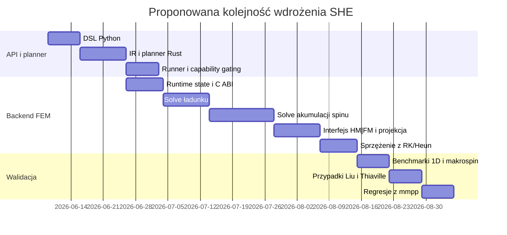
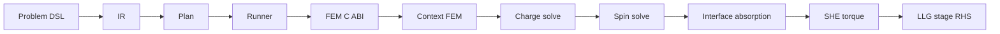

# Implementacja pełnego solvera SHE w Fullmag

## Podsumowanie wykonawcze

Najkrótsza odpowiedź jest taka: **pełny solver SHE w Fullmag warto zaimplementować najpierw w natywnym backendzie FEM**, a nie w FDM. Z architektury repozytorium wynika, że to właśnie ścieżka FEM ma już modularny wzorzec „import planu → stan runtime → operator/interakcja → sprzężenie z krokiem LLG”, z osobnymi modułami dla STT, Oersteda, DMI, demagnetyzacji, pola efektywnego, termiki i relaksacji. Publiczny plan/DSL ma już również zalążki dla transportu prądowego i momentów spinowych, ale **obecnie wykonuje tylko najprostszy przypadek `prescribed_density`**, natomiast `ohmic_poisson` jest nadal ścieżką semantyczną, a `DriftDiffusionSpinTorque` pozostaje placeholderem. To oznacza, że do pełnego SHE trzeba rozszerzyć równocześnie: DSL Pythona, IR/planner w Ruście, runner/capabilities, C ABI oraz natywny backend FEM. citeturn30view2turn16view2turn26view1turn24view0turn45view0turn45view1turn45view2

Od strony fizycznej rekomenduję model **quasi-statycznego dryftu-dyfuzji ładunku i spinu w metalu ciężkim**, ze sprzężeniem interfejsowym HM|FM przez **spin-mixing conductance** i z **backflow** wynikającym z niezerowej akumulacji spinu przy interfejsie. W granicy cienkiego ferromagnetyka i dobrego spin-sinku taki solver musi redukować się do znanej postaci momentów damping-like oraz field-like używanych w efektywnych modelach SOT/SHE. To jest dokładnie poziom modelowania, który spina teorię Valeta–Ferta, późniejsze uogólnienia spin-orbit torque, oraz interpretację eksperymentów Liu i analityki Thiaville’a dla ruchu ścian domenowych napędzanych SHE. citeturn49search11turn49search0turn49search2turn49search17turn50search0

Od strony numerycznej najlepszy pierwszy wariant dla Fullmag to **cztery eliptyczne solve’y FEM na etap Rungego–Kutty**: jeden dla potencjału elektrycznego i trzy dla składowych akumulacji spinu, z warunkiem Robinowskim na interfejsie HM|FM zależnym od bieżącego \(\mathbf m\). Następnie z pochłoniętego prądu spinowego należy zbudować moment i wstrzyknąć go do tej samej ścieżki RHS, którą backend FEM już stosuje dla bezpośrednich momentów STT. To jest znacznie bliższe obecnemu stylowi kodu niż próba „upchnięcia” pełnego transportu SHE do FDM, które dziś nadal ma capability-gated ścieżki nawet dla części pól materiałowych. citeturn36view0turn37view2turn34view3turn19view2turn18view0turn18view1

W praktyce wdrożenie rozbiłbym na trzy etapy: **interfejs API i planner**, **transport FEM + warunki brzegowe HM|FM**, **sprzężenie z LLG, obserwable i walidacja**. To jest projekt wysokiej złożoności, ale dobrze izolowalny modułowo, bo Fullmag ma już bardzo podobny wzorzec dla `stt.*` i `oersted.*`, a `mmpp` może później posłużyć do automatycznej walidacji widm, modów i dyspersji na wynikach zapisanych do `.zarr`. citeturn30view0turn35view1turn48view0

## Zakres źródeł i założenia

Inspekcję kodu przeprowadziłem przede wszystkim na publicznym repozytorium `MateuszZelent/fullmag`, uzupełniając ją o publicznie dostępne `MateuszZelent/mmpp`. W aktualnym środowisku odpowiedzi nie miałem użytecznej ekspozycji konektora GitHub przez `api_tool`, więc analizę wykonałem przez publiczne strony GitHub i surowe pliki repozytoriów. `fullmag` jest workspace’em obejmującym aplikacje, pakiet Python, zestaw crate’ów Rusta i natywne backendy `fdm` oraz `fem`; `mmpp` jest niezależną biblioteką Pythona do postprocessingu wyników mikromagnetycznych w `.zarr`, z obsługą FFT/FMR, modów i dyspersji. citeturn16view0turn39view0turn41view3turn48view0

Jako podstawę teoretyczną przyjąłem przede wszystkim źródła pierwotne i przeglądowe o największym ciężarze merytorycznym dla SHE/SOT: **Valet–Fert** dla równania dyfuzji spinowej i transportu dwukanałowego, **Manchon et al. RMP 2019** dla systematyki momentów spinowo-orbitowych, sprzężenia interfejsowego i poziomów modelowania, **Liu et al. 2012** dla klasycznego eksperymentalnego benchmarku z \(\beta\)-Ta, oraz **Thiaville et al. 2012** dla związku SHE z ruchem chiralnych ścian domenowych i konwencjami znaków. Wczesne prace rodziny Manchon–Zhang są dodatkowo ważne dla rozdzielenia składowych field-like i damping-like. citeturn49search11turn49search0turn49search2turn49search17turn50search0

Przyjmuję kilka jawnych założeń projektowych, bo użytkownik nie sprecyzował języka docelowego backendu, typu siatki i akceptowalnego kosztu obliczeń. Zakładam więc: **pierwszą implementację w natywnym FEM C++/MFEM**, siatkę tetraedralną z przestrzeniami H1 dla \(\phi\) i \(\boldsymbol{\mu}_s\), jednostki SI, transport quasi-statyczny rozwiązywany na każdym etapie RK/Heun, oraz wersję bazową obejmującą HM jako przewodnik spinowy i FM jako odbiornik momentu na interfejsie. Wersję „jeszcze pełniejszą”, z dyfuzją spinową także w FM i z pełnym modelem Valet–Fert po obu stronach interfejsu, traktuję jako rozszerzenie drugiej fazy. Taki wybór jest zgodny z obecną architekturą FEM i z faktem, że w publicznym plannerze transport `ohmic_poisson` nadal nie jest wykonywalny nawet na ścieżce FEM. citeturn45view0turn30view2turn16view2

## Audyt repozytorium Fullmag i mapowanie punktów rozszerzeń

`fullmag` jest repozytorium wielowarstwowym. Na górze znajduje się workspace Rusta z crate’ami takimi jak `fullmag-ir`, `fullmag-plan`, `fullmag-runner`, `fullmag-engine`, crate’ami `*-sys` dla mostków do natywnych backendów, pakietem `packages/fullmag-py`, oraz dwoma natywnymi backendami w `backends/fdm` i `backends/fem`. To praktycznie przesądza, że każda nowa fizyka musi przejść przez trzy poziomy: **frontend modelu**, **planner/runner**, **backend natywny**. citeturn16view0turn39view0turn41view3turn41view4turn43view1turn43view2

Backend FEM jest dziś najsilniejszym kandydatem dla pełnego SHE. Jego `Context` agreguje wydzielone stany runtime dla siatki, materiałów, stanu magnetyzacji, exchange, demag, anisotropy, DMI, Oersteda, STT, termiki, GPU-state, steppera i relaksacji. Konstrukcja kontekstu jest wyraźnie rozbita na etap importu pól planu i etap uruchomienia runtime MFEM/demag/GPU. W katalogu `backends/fem/cpu/mfem/integrators` są już Heun, RK23, RK4, RK45 i moduł adaptacyjnego kroku, a w `interactions` istnieją wydzielone podsystemy dla STT, Oersteda, DMI, exchange, magnetoelastyczności, demagnetyzacji i pola efektywnego. Co szczególnie ważne, `effective_field.hpp` explicite rozdziela składanie \(H_\mathrm{eff}\) od **bezpośrednich momentów w RHS**, a `stt.cpp` agreguje różne rodziny momentów w osobnej ścieżce. To dokładnie ten wzorzec, pod który należy podpiąć pełne SHE. citeturn16view2turn30view2turn24view0turn26view1turn36view0turn30view0turn34view3

Backend FDM jest natywnym C++/CUDA solverem z C ABI, z jawnymi integratorami Heun, RK23, RK4, ABM3 i DP45 dla uchwytów podstawowych oraz Heun/RK4/RK23 dla ścieżki multilayer v2. `Context` FDM przechowuje siatkę prostokątną, parametry materiałowe, pola w układzie SoA na urządzeniu, Oersteda, termikę, DMI, magnetoelastyczność oraz STT. Natomiast sam kod pokazuje też, że nawet niektóre pola materiałowe per-cell są dziś capability-gated i kończą się komunikatem o braku wsparcia. To sprawia, że **FDM jest świetnym miejscem na efektywny model SOT/SHE**, ale nie jest dziś najlepszym pierwszym celem dla „pełnego” solve’a dryft-dyfuzji spinu. citeturn18view0turn18view1turn18view2turn20view0turn20view2turn21view0turn19view2

Frontend i planner już mają bardzo istotne zaczepy. W Pythonie `CurrentTransport` zna dziś `prescribed_density` i `ohmic_poisson`, przy czym dokumentacja klasy mówi wprost, że publicznie wykonywalne jest tylko `prescribed_density`, a `ohmic_poisson` jest placeholderem semantycznym. Z kolei `spin_torque.py` deklaruje, że publicznie wykonywalne są `SlonczewskiSTT`, `ZhangLiSTT` i `SpinOrbitTorque`, natomiast **`DriftDiffusionSpinTorque` jest placeholderem na dalszą roadmapę**. Planner Rusta potwierdza to od drugiej strony: `resolve_current_transports()` rozwiązuje tylko `CurrentTransportModelIR::PrescribedDensity`, a `OhmicPoisson` zwraca błąd „semantic_only” zarówno na ścieżce FDM, jak i FEM. To jest bardzo mocny sygnał, że pełny SHE trzeba dołożyć nie jako „pojedynczy plik w backendzie”, tylko jako **spójny feature przez cały stos**. citeturn45view1turn45view2turn45view0

Poniżej podaję syntetyczną mapę tego, co trzeba rozszerzyć, i gdzie najlepiej to zrobić:

| Warstwa | Stan obecny | Najlepszy punkt rozszerzenia dla SHE |
|---|---|---|
| Python DSL | `CurrentTransport`, `SpinOrbitTorque`, placeholder `DriftDiffusionSpinTorque` | dodać publiczny model `spin_hall_drift_diffusion` oraz uaktywnić `DriftDiffusionSpinTorque` |
| IR / planner Rust | `fullmag-ir`, `fullmag-plan`, `current_transport.rs`, `spin_torque.rs` | nowe warianty IR, walidacja parametrów, lane executable tylko dla FEM |
| Runner | `capabilities.rs`, `dispatch.rs`, `fem/`, `native_fem/` | materializacja planu i routing do C ABI FEM |
| FEM C ABI | `backends/fem/src/api.cpp`, `fullmag_fem.h`, `fullmag-fem-sys` | nowe pola planu, nowe observables, nowe copy/upload funkcje |
| FEM runtime | `Context`, `fem_context_builder.cpp`, `interactions/*`, `runtime/*` | nowy stan `she`, import planu, init runtime, solve transportu, projekcja momentu |
| FDM | istniejący efektywny tor STT/SOT | na razie tylko fallback efektywny, bez pełnego solve’a |

Tę mapę uzasadnia obecna zawartość repozytorium: drzewo crate’ów, układ `fullmag-py`, wydzielony planner `current_transport.rs`, struktura `Context` FEM, i rozdział `interactions`/`integrators`/`runtime` w natywnym solverze FEM. citeturn39view0turn41view3turn43view0turn16view2turn26view1turn24view0

Dodatkowo `mmpp` jest przydatny nie do samej implementacji, lecz do walidacji. Repozytorium jawnie pozycjonuje się jako biblioteka do skanowania, filtrowania i analizy wyników mikromagnetycznych w `.zarr`, z FFT/FMR, wizualizacją modów, dyspersją i analizą transmisji. Jeśli pipeline Fullmag utrzyma eksport do `.zarr` albo jeśli dodasz prosty konwerter, `mmpp` może stać się naturalnym narzędziem regresji funkcjonalnej dla solvera SHE. citeturn48view0

## Model fizyczny pełnego solvera SHE

Najbardziej sensowny poziom „pełnego solvera SHE” dla Fullmag to nie kolejna implementacja efektywnego momentu, lecz **samodzielny solve ładunku i akumulacji spinu** w metalu ciężkim, z interfejsem HM|FM opisanym przez mieszane przewodnictwo spinowe i z momentem działającym na ferromagnetyk wyprowadzanym z pochłoniętego strumienia spinu. Takie podejście łączy bazę transportową Valeta–Ferta z późniejszym formalizmem SOT/SHE, a w odpowiednich granicach redukuje się do znanych członów DL/FL używanych w praktyce mikromagnetycznej. citeturn49search11turn49search0turn49search2turn49search17

W wersji implementacyjnej proponuję zacząć od potencjału elektrycznego \(\phi\) w przewodzącym podobszarze \(\Omega_c\):
\[
\nabla\cdot \mathbf J_c = 0,
\qquad
\mathbf J_c = -\sigma \nabla \phi,
\]
z warunkami Dirichleta na elektrodach albo Neumanna dla zadanego wstrzykiwanego prądu. Jeżeli w pierwszej wersji nie modelujesz magnetorezystancji ani zależności \(\sigma(\mathbf m)\), solve ładunku można traktować jako quasi-statyczny i cache’ować między krokami czasu, dopóki nie zmienią się kontakty, amplituda prądu albo geometria przewodnika. Struktura tego problemu jest dokładnie tym, czego obecny planner jeszcze nie wykonuje dla `ohmic_poisson`. citeturn45view0turn45view1turn49search11

Dla akumulacji spinu w metalu ciężkim \(\Omega_{HM}\) przyjmuję klasyczną postać dryftu-dyfuzji dla wektora potencjału spinowego \(\boldsymbol{\mu}_s=(\mu_{s,x},\mu_{s,y},\mu_{s,z})\). W wygodnej konwencji implementacyjnej:
\[
(J_s)_{i\alpha}
=
-\frac{\sigma}{2e}\,\partial_i \mu_{s,\alpha}
+
\theta_{\mathrm{SH}}\,\frac{\hbar}{2e}\,\varepsilon_{i\alpha j}J_{c,j},
\]
\[
\partial_i (J_s)_{i\alpha}
=
-\frac{\sigma}{2e\lambda_{\mathrm{sf}}^2}\,\mu_{s,\alpha}.
\]
Tutaj \(\lambda_{\mathrm{sf}}\) jest długością dyfuzji spinowej, a \(\theta_{\mathrm{SH}}\) kątem spin Halla. Jeśli w kodzie przechowujesz \(\mu_s\) w [V] zamiast w [J], przeskalowanie przez \(e\) zmienia tylko prefaktory, nie zmieniając operatora Helmholtza ani struktury warunków brzegowych. To bardzo ważne praktycznie: w literaturze te prefaktory bywają rozkładane różnie między \(\mu_s\), \(J_s\), \(g^{\uparrow\downarrow}\) i pola efektywne, ale **operator i logika sprzężenia pozostają te same**. citeturn49search11turn49search0

Na zewnętrznych brzegach izolowanych należy narzucić warunek braku całkowitego wypływu spinu,
\[
\mathbf n\cdot \mathbf J_s = 0,
\]
czyli w praktyce naturalny warunek Neumanna dla całkowitego strumienia, obejmujący zarówno dyfuzję, jak i wkład SHE. Na interfejsie HM|FM \(\Gamma_{HF}\) proponuję użyć warunku absorpcji spinowej opartego o zespolone spin-mixing conductance:
\[
(\mathbf n\cdot \mathbf J_s)_{\Gamma_{HF}}
=
\frac{\hbar}{2e^2}
\left[
g_r^{\uparrow\downarrow}\,\mathbf m\times(\mathbf m\times \boldsymbol{\mu}_s)
+
g_i^{\uparrow\downarrow}\,\mathbf m\times \boldsymbol{\mu}_s
\right].
\]
Część z \(g_r^{\uparrow\downarrow}\) daje moment damping-like, a część z \(g_i^{\uparrow\downarrow}\) moment field-like. **Backflow** nie wymaga tu osobnego heurystycznego członu: pojawia się automatycznie, bo gdy \(\boldsymbol{\mu}_s\) nie jest całkowicie zerowane na interfejsie, część spinu odbija się z powrotem do solve’a dyfuzyjnego przez ten sam warunek Robinowski. citeturn49search0turn49search11

Z pochłoniętego strumienia spinu otrzymujesz moment powierzchniowy, który trzeba przenieść do objętościowego RHS LLG w domenie ferromagnetycznej. W cienkowarstwowej redukcji:
\[
\boldsymbol{\tau}_{\mathrm{SHE}}
=
\frac{\gamma}{M_s t_F}
\frac{\hbar}{2e^2}
\left[
g_r^{\uparrow\downarrow}\,\mathbf m\times(\mathbf m\times \boldsymbol{\mu}_s)
+
g_i^{\uparrow\downarrow}\,\mathbf m\times \boldsymbol{\mu}_s
\right].
\]
W granicy asymptotycznej, dla jednorodnego \(\mathbf J_c\) i dobrego spin-sinku, powinieneś odzyskiwać standardowy zapis efektywnego momentu:
\[
\boldsymbol{\tau}_{\mathrm{eff}}
=
\frac{\gamma\hbar}{2eM_s t_F}\,
\theta_{\mathrm{SH}}J_c
\left[
\xi_{\mathrm{DL}}\,\mathbf m\times(\boldsymbol{\sigma}\times\mathbf m)
+
\xi_{\mathrm{FL}}\,\mathbf m\times\boldsymbol{\sigma}
\right],
\]
gdzie \(\boldsymbol{\sigma}\) jest kierunkiem polaryzacji spinowej wyznaczanym przez geometrię prądu i orientację HM. Ten limit jest krytycznym testem regresyjnym względem istniejących implementacji SOT/STT i względem benchmarków eksperymentalnych. citeturn49search2turn49search17turn49search0

Wreszcie LLG należy pisać w Fullmag dokładnie tak, jak architektura FEM już to sugeruje: pole efektywne i bezpośrednie momenty powinny pozostać rozdzielone. Część \(H_\mathrm{eff}\) powinna dalej obsługiwać exchange, demag, anisotropy, DMI, Zeemana, Oersteda, termikę i magnetoelastyczność, natomiast SHE – analogicznie do STT – powinno wejść jako **bezpośredni dodatek do RHS**. Inaczej mówiąc: technicznie SHE w Fullmag powinno wyglądać bardziej jak nowe `stt_*` niż jak nowe `effective_field_*`. citeturn36view0turn37view2turn30view0turn34view3

Praktycznie warto rozróżnić trzy poziomy modelowania:

| Poziom modelu | Stan zmiennych | Koszt | Co potrafi | Co gubi |
|---|---|---:|---|---|
| Efektywny moment DL/FL | tylko \(\mathbf m\) | niski | szybkie przełączanie, strojenie parametrów | brak crowdingu, backflow, interfejsowego solve’a |
| Zredukowany solver HM w 1D | \(\phi\), \(\mu_s(z)\), \(\mathbf m\) | średni | analityczne benchmarki, poprawny screening po grubości | brak efektów 3D przy kontaktach i geometrii |
| Pełny FEM drift–diffusion SHE | \(\phi\), \(\boldsymbol{\mu}_s(\mathbf r)\), \(\mathbf m(\mathbf r)\) | wysoki | geometria 3D, backflow, kontakty, niejednorodny prąd | największy koszt i najwięcej testów |

Moja rekomendacja jest jednoznaczna: **produkcyjny cel w Fullmag powinien być poziom trzeci na FEM**, ale równolegle trzeba zaimplementować poziom drugi jako test-oracle i bardzo tani benchmark. To minimalizuje ryzyko wdrożenia. citeturn49search0turn49search11turn45view2

## Dyskretyzacja FEM i sprzężenie czasowe z LLG

Dla potencjału ładunkowego \(\phi\) naturalna jest słaba postać w \(H^1(\Omega_c)\): znajdź \(\phi\in H^1\), takie że dla każdego testowego \(v\in H^1\)
\[
\int_{\Omega_c}\sigma \nabla \phi\cdot \nabla v\,d\Omega
=
\int_{\Gamma_N} j_n^{\mathrm{ext}} v\,d\Gamma.
\]
To jest klasyczny problem eliptyczny, dobrze dopasowany do MFEM i do stylu reszty backendu FEM. Ponieważ `Context` FEM i bazowy runtime wyraźnie zakładają przestrzenie H1 oraz uporządkowanie FE przez `fe_order`, pierwsza implementacja powinna trzymać się H1/P1 lub H1/P2 zamiast wchodzić od razu w mieszane \(H(\mathrm{div})\). Ta decyzja nie jest „najbardziej purystyczna” z perspektywy lokalnej konserwatywności, ale jest najlepsza architektonicznie dla tego repozytorium. citeturn30view3turn16view2

Dla każdej składowej akumulacji spinu \(\mu_{s,\alpha}\) dostajesz problem Helmholtza z brzegiem Robinowskim na HM|FM. Słaba postać jest następująca:
\[
\int_{\Omega_{HM}}
\frac{\sigma}{2e}\nabla \mu_{s,\alpha}\cdot\nabla v\,d\Omega
+
\int_{\Omega_{HM}}
\frac{\sigma}{2e\lambda_{\mathrm{sf}}^2}\mu_{s,\alpha}v\,d\Omega
+
\int_{\Gamma_{HF}}
\mathcal B_\alpha(\boldsymbol{\mu}_s,\mathbf m)\,v\,d\Gamma
=
\int_{\partial\Omega_{HM}}
(\mathbf n\cdot \mathbf J_s^{\mathrm{SHE}})_\alpha\,v\,d\Gamma,
\]
gdzie
\[
\mathcal B(\boldsymbol{\mu}_s,\mathbf m)
=
\frac{\hbar}{2e^2}
\left[
g_r^{\uparrow\downarrow}\,\mathbf m\times(\mathbf m\times \boldsymbol{\mu}_s)
+
g_i^{\uparrow\downarrow}\,\mathbf m\times \boldsymbol{\mu}_s
\right].
\]
W praktyce najszybciej wdrożysz to jako **trzy skalarne solve’y H1**, a nie jeden pełny rozwiązywacz blokowy. Masz wtedy prostsze debugowanie, łatwiejsze regresje 1D i dużo czystszą integrację z istniejącym stylem `AoS -> RHS -> observables`. Z punktu widzenia dalszej optymalizacji blokowy solve można dodać później. citeturn49search11turn49search0turn37view2turn30view0

Kluczowy krok implementacyjny nie leży jednak w samym solve’ie PDE, tylko w **projekcji momentu interfejsowego na DOF-y magnetyzacji**. Fullmag FEM pracuje na nodalnych buforach pola i RHS LLG liczonym w układzie AoS, więc najprościej zrobić to w dwóch etapach. Najpierw liczysz powierzchniową gęstość momentu na elementach granicznych \(\Gamma_{HF}\), a potem rzutujesz ją do objętościowego RHS magnetyzacji w \(\Omega_F\) przez masową projekcję albo przez dualne objętości węzłowe sąsiadujące z interfejsem. Dzięki temu nie naruszasz istniejącego `llg_rhs.cpp`, tylko dodajesz nowy człon do już działającej ścieżki „direct torque”. citeturn37view2turn36view0turn34view3

Sprzężenie czasowe z LLG powinno być **etapowe**, nie „raz na krok”. W backendzie FEM są już jawne integratory RK i Heun, a sam kod ma wydzielone warstwy dla `rk_stage_rhs`, `rk_explicit_step`, `backend_step` i podobnych elementów steppera. Dlatego dla etapu \(k\) zalecam następującą sekwencję: przewidź \(\mathbf m^{(k)}\), odśwież warunek interfejsowy zależny od \(\mathbf m^{(k)}\), rozwiąż \(\phi\) jeśli trzeba, rozwiąż trzy składowe \(\boldsymbol{\mu}_s^{(k)}\), policz moment SHE, dołóż go do RHS razem ze STT, a na końcu wykonaj standardowy update etapu RK. Jeżeli prąd ładunkowy nie zależy od \(\mathbf m\), to solve \(\phi\) można cache’ować na cały krok albo nawet na całą sekwencję czasową przy stałym wzbudzeniu; solve akumulacji spinu trzeba jednak wykonywać co etap, bo zależy od \(\mathbf m\) przez interfejs. citeturn24view0turn25view2turn22view3

Jako wybory dyskretyzacyjne polecam następujący wariant startowy. Dla \(\phi\) i \(\mu_{s,\alpha}\): H1/P1 na tej samej siatce konforemnej, której używa magnetyka. Dla momentu interfejsowego: projekcja powierzchni→objętość przez lokalną macierz masy lub dualne objętości. Dla solve’ów liniowych: CG/GMRES z preconditionerem algebraicznym zgodnym z istniejącym stosem MFEM/HYPRE. Dla stabilności: jawne integratory magnetyczne już istnieją; transport jest eliptyczny, więc nie wnosi ograniczenia CFL, tylko koszt solve’ów. Wersję pierwszą warto więc zoptymalizować przez cache geometrii/operatorów, a nie przez agresywną zmianę integratora LLG. To dobrze współgra z obecnym `AdaptiveDtRuntimeState` i z istniejącym rozdziałem `integrators`/`runtime`. citeturn24view0turn25view2turn16view2

Zakresy parametrów startowych powinny być traktowane jako **priory do kalibracji**, nie jako stałe uniwersalne. Dla Pt sensowny start to \(\theta_{SH}\sim 0.05{-}0.12\), dla \(\beta\)-Ta znak jest przeciwny i typowo \(\theta_{SH}\sim -0.1\) do \(-0.2\), a długości dyfuzji spinowej w ciężkich metalach często zaczynają się w paśmie około \(1{-}3\,\mathrm{nm}\). Reala część mieszanej przewodności spinowej bywa rzędu \(10^{14}{-}10^{15}\,\Omega^{-1}\mathrm{m}^{-2}\), a część urojona zwykle jest mniejsza, więc jako parametr startowy można dać \(g_i^{\uparrow\downarrow} \ll g_r^{\uparrow\downarrow}\). Dla testów porównawczych z literaturą warto zacząć od układów z \(\beta\)-Ta i ultracienkim CoFeB/NiFe, bo tam sygnał i znak momentu są dobrze udokumentowane. citeturn49search2turn49search14turn49search0

Walidację rozdzieliłbym na pięć klas. Po pierwsze, test analityczny 1D dla samego HM bez FM, z wykładniczym zanikiem \(\mu_s(z)\). Po drugie, test HM|FM w granicy dobrego spin-sinku, gdzie solver ma odtwarzać moment efektywny z prefaktorem \(1-\mathrm{sech}(t_{HM}/\lambda_{sf})\) w odpowiedniej konwencji. Po trzecie, test znaku i amplitudy względem klasycznych wyników Liu dla \(\beta\)-Ta. Po czwarte, test trendów ruchu ściany domenowej przy połączeniu DMI + SHE w duchu Thiaville’a. Po piąte, testy numeryczne: zbieżność po siatce, po `fe_order`, oraz po wariancie „transport co etap” kontra „transport raz na krok”. Te testy nie tylko sprawdzają kod; one też wykrywają najczęstsze błędy znaków, normalizacji \(\hbar/2e\), orientacji normalnej interfejsu i definicji \(\boldsymbol{\sigma}\). citeturn49search11turn49search2turn49search17turn49search0

## Plan implementacji w Fullmag

Najlepszym wzorcem stylu dla nowego modułu jest para **`stt.cpp`/`stt_*.cpp`** oraz **`oersted.cpp`/`oersted_*.cpp`**. Oba podsystemy mają w Fullmag agregator odpowiedzialny za import planu i dispatch, a szczegóły fizyczne są rozdzielone na podmoduły właścicielskie. Dla SHE zrobiłbym dokładnie to samo: **agregator `she.cpp`** plus podmoduły `she_charge.cpp`, `she_spin_diffusion.cpp`, `she_interface.cpp`, `she_projection.cpp` i opcjonalnie `she_observables.cpp`. W ten sposób nowy feature wpisuje się w istniejący idiom kodu zamiast go łamać. citeturn30view0turn35view1

```mermaid
flowchart LR
    A[Python DSL] --> B[fullmag-ir]
    B --> C[fullmag-plan]
    C --> D[fullmag-runner]
    D --> E[C ABI FEM]
    E --> F[Context FEM]
    F --> G[solve_charge_potential]
    G --> H[solve_spin_accumulation]
    H --> I[apply_interface_mixing]
    I --> J[project_torque_to_rhs]
    J --> K[LLG RK stage]
    K --> L[observables and snapshots]
```



Kolejność prac, którą rekomenduję, jest następująca:

| Zadanie | Ścieżka | Złożoność | Cel techniczny |
|---|---|---|---|
| Uaktywnienie modelu w DSL | `packages/fullmag-py/src/fullmag/model/current_transport.py`, `spin_torque.py` | średnia | nowe pola użytkownika i serializacja do IR |
| Rozszerzenie IR i planera | `crates/fullmag-ir`, `crates/fullmag-plan/src/current_transport.rs`, `spin_torque.rs`, `fem.rs` | wysoka | nowy wariant `spin_hall_drift_diffusion` wykonywalny na FEM |
| Routing w runnerze | `crates/fullmag-runner/src/capabilities.rs`, `dispatch.rs`, `fem/`, `native_fem/` | średnia | capability gating i materializacja planu dla backendu FEM |
| Rozszerzenie C ABI FEM | `fullmag_fem.h`, `backends/fem/src/api.cpp`, `crates/fullmag-fem-sys` | wysoka | pola planu, observables i diagnostyka |
| Stan runtime SHE | `backends/fem/include/context.hpp` | średnia | dodanie `SheTransportRuntimeState` |
| Import planu + init runtime | `backends/fem/core/fem_context_builder.cpp` | średnia | `initialize_she_plan_fields()` i `initialize_she_runtime()` |
| Solve \(\phi\) i \(\mu_s\) | `backends/fem/cpu/mfem/interactions/she_*.cpp` | bardzo wysoka | właściwy solver SHE |
| Sprzężenie z RHS LLG | `rk_stage_rhs.cpp`, `backend_step.cpp` lub analogiczny punkt z obecnego steppera | wysoka | wywołanie solve’a per-stage i dodanie momentu |
| Observables i walidacja | `runtime/field_refresh*`, `snapshot*`, testy, `mmpp` | średnia | eksport \(\mu_s\), \(J_s\), \(\tau_{SHE}\), regresje |

W samym backendzie FEM proponuję dwufazową inicjalizację: najpierw **import pól planu** do `ctx.she` podczas budowy kontekstu, a dopiero po `context_initialize_mfem()` zbudowanie przestrzeni FE, operatorów, list atrybutów i preconditionerów. To jest zgodne z obecnym builderem, który rozdziela import planu od późniejszej inicjalizacji runtime demagnetyzacji i GPU. Dzięki temu parametry z poziomu planu nie zależą od szczegółów MFEM, a runtime może być rekonstruowany czysto i przewidywalnie. citeturn30view2turn22view4

Punkt wpięcia do kroku czasowego powinien wyglądać tak: po złożeniu bieżącej magnetyzacji etapu RK liczysz transport, z transportu budujesz moment, a dopiero potem tworzysz końcowy RHS etapu. Nie zmieniasz samego `llg_rhs.cpp`, bo ten plik już robi jedną rzecz dobrze: liczy Gilbertowski RHS z gotowego \(H_\mathrm{eff}\). Nowy moduł ma więc działać obok STT, nie zamiast LLG. Z punktu widzenia clean architecture to ważne: fizyka transportu zostaje w `interactions`, a logika stepera pozostaje w `integrators`/`runtime`. citeturn37view2turn36view0turn34view3



Poniżej podaję szkic pseudokodu, który jest wprost dopasowany do obecnego stylu Fullmag FEM:

```cpp
struct SheTransportRuntimeState {
  bool enabled = false;

  // Regions / materials
  int hm_region_attr = -1;
  int fm_region_attr = -1;

  // Material parameters
  double sigma_hm = 0.0;
  double theta_sh = 0.0;
  double lambda_sf = 0.0;
  double gmix_real = 0.0;
  double gmix_imag = 0.0;

  // Time dependence / current binding
  bool use_cached_charge = true;
  std::array<double, 3> current_density_am2{0.0, 0.0, 0.0};

  // Host observables
  std::vector<double> phi;
  std::array<std::vector<double>, 3> mu_s;
  std::vector<double> tau_she_xyz;

#if FULLMAG_HAS_MFEM_STACK
  std::unique_ptr<mfem::FiniteElementSpace> charge_fes;
  std::array<std::unique_ptr<mfem::FiniteElementSpace>, 3> spin_fes;
  std::unique_ptr<mfem::GridFunction> phi_gf;
  std::array<std::unique_ptr<mfem::GridFunction>, 3> mu_gf;
  std::unique_ptr<mfem::HypreSolver> charge_solver;
  std::array<std::unique_ptr<mfem::HypreSolver>, 3> spin_solver;
#endif
};

bool initialize_she_plan_fields(
  Context& ctx,
  const fullmag_fem_plan_desc& plan,
  std::string& error);

bool initialize_she_runtime(
  Context& ctx,
  std::string& error);

bool solve_she_transport(
  Context& ctx,
  const std::vector<double>& m_xyz,
  std::string& error);

void add_she_rhs_aos(
  const Context& ctx,
  const std::vector<double>& m_xyz,
  std::vector<double>& rhs_xyz,
  double& max_rhs);
```

Minimalny diff architektoniczny, który polecam, jest taki:

```cpp
// fem_context_builder.cpp
if (!initialize_stt_plan_fields(ctx, plan, error)) return false;
if (!initialize_she_plan_fields(ctx, plan, error)) return false;

// ... po context_initialize_mfem(ctx, error)
if (!initialize_she_runtime(ctx, error)) return false;
```

```cpp
// rk_stage_rhs.cpp albo odpowiednik obecnego stage assembly
std::vector<double> rhs_xyz;
double max_rhs = 0.0;

assemble_effective_field(ctx, m_stage, h_eff_xyz, timings, error);
llg_rhs_aos(m_stage, h_eff_xyz, gamma, alpha, alpha_field, precession, rhs_xyz, max_rhs);

add_stt_rhs_aos(ctx, m_stage, rhs_xyz, max_rhs, ctx.stt.workspace);

if (ctx.she.enabled) {
  if (!solve_she_transport(ctx, m_stage, error)) return false;
  add_she_rhs_aos(ctx, m_stage, rhs_xyz, max_rhs);
}
```

Najważniejsza decyzja nazewnicza: **na zewnątrz** wystawiaj model jako `DriftDiffusionSpinTorque`, bo to odpowiada fizyce, rozszerzalności i obecnemu placeholderowi DSL; **wewnątrz backendu** możesz go nazwać `she_transport`, bo pierwsza implementacja będzie skoncentrowana na źródle SHE w HM. To rozdziela semantykę użytkownika od pierwszego konkretnego źródła prądu spinowego. citeturn45view2turn30view0

## Zawartość proponowanych plików Markdown

Poniższy zestaw plików jest przygotowany tak, aby można go było wprost dodać do repozytorium jako dokumentację implementacyjną. Struktura jest zgodna z wnioskami z audytu: osobny opis fizyki, osobny opis słabej postaci FEM, osobna mapa kodu i plan prac, oraz osobna walidacja. To odpowiada obecnemu podziałowi odpowiedzialności w Fullmag między DSL, planner, runner i backend FEM. citeturn16view0turn30view2turn45view0turn45view2

| Nazwa pliku | Rola |
|---|---|
| `docs/she_solver/README.md` | krótki przewodnik po architekturze i decyzjach projektowych |
| `docs/she_solver/physics_model.md` | wyprowadzenia fizyczne, równania, warunki brzegowe, definicje parametrów |
| `docs/she_solver/fem_weak_form_and_discretization.md` | słabe postacie FEM, dyskretyzacja, algorytm etapowy z LLG |
| `docs/she_solver/fullmag_code_mapping_and_implementation_plan.md` | mapa repozytorium Fullmag, punkty wejścia, zadania, pseudokod |
| `docs/she_solver/validation_and_benchmarks.md` | przypadki testowe, benchmarki, parametry startowe, kryteria akceptacji |

**`docs/she_solver/README.md`**

```md
# Solver SHE w Fullmag

## Cel

Ten dokument opisuje zalecaną implementację pełnego solvera Spin Hall Effect (SHE)
w architekturze Fullmag.

Zakres pierwszej wersji:
- solve potencjału ładunkowego w przewodzącym metalu ciężkim,
- solve akumulacji spinu w formalizmie dryft–dyfuzja / Valet–Fert,
- warunek interfejsowy HM|FM z mieszanym przewodnictwem spinowym,
- moment SHE dodawany bezpośrednio do RHS równania LLG.

## Główna decyzja architektoniczna

Implementacja startowa powinna trafić do natywnego backendu FEM (`backends/fem`),
a nie do FDM.

Powody:
- istnieje modularny wzorzec `aggregate + submodules` dla interakcji (`stt.*`, `oersted.*`),
- istnieje czyste rozdzielenie `H_eff` od bezpośrednich momentów w RHS,
- planner i DSL mają już placeholders dla `current_transport` i `DriftDiffusionSpinTorque`,
- pełny solve 3D lepiej pasuje do MFEM niż do obecnej ścieżki FDM.

## Zakres pierwszej wersji produkcyjnej

Wersja pierwsza:
- HM: solve ładunku i akumulacji spinu,
- FM: równanie LLG, bez osobnego solve dyfuzji spinowej w objętości FM,
- interfejs HM|FM: absorpcja spinowa przez `g_r^{↑↓}`, `g_i^{↑↓}`,
- sprzężenie czasowe: solve transportu na każdym etapie RK/Heun.

Wersja druga:
- pełny Valet–Fert po obu stronach interfejsu,
- current shunting między wieloma przewodnikami,
- spin pumping / spin-memory-loss / SMR,
- ewentualna ścieżka FDM lub redukcja 1D jako akcelerator.

## Nazewnictwo zewnętrzne i wewnętrzne

Warstwa użytkownika:
- `CurrentTransport(model="spin_hall_drift_diffusion", ...)`
- `DriftDiffusionSpinTorque(current_source="drive", ...)`

Warstwa backendu:
- `she.cpp` jako agregator,
- `she_charge.cpp`,
- `she_spin_diffusion.cpp`,
- `she_interface.cpp`,
- `she_projection.cpp`,
- `she_observables.cpp`.

## Diagram przepływu



## Najważniejsze testy akceptacyjne

- test analityczny 1D: zanik akumulacji spinu w HM,
- limit cienkowarstwowy: zgodność z efektywnym momentem DL/FL,
- poprawny znak momentu po odwróceniu:
  - kierunku prądu,
  - znaku `theta_sh`,
  - normalnej interfejsu,
- zgodność trendów z przypadkami typu Ta|FM,
- zbieżność po siatce i po `fe_order`.
```

**`docs/she_solver/physics_model.md`**

```md
# Model fizyczny solvera SHE

## Zakres modelu

Rozważamy układ:
- domena przewodząca HM: `Omega_HM`,
- domena magnetyczna FM: `Omega_FM`,
- interfejs HM|FM: `Gamma_HF`.

W wersji bazowej solve transportu wykonujemy w `Omega_HM`,
a na `Gamma_HF` wyznaczamy strumień pochłoniętego spinu
i odpowiadający mu moment działający na magnetyzację FM.

## Transport ładunku

Szukamy potencjału elektrycznego `phi`:
- `div(J_c) = 0`,
- `J_c = -sigma * grad(phi)`.

Warunki brzegowe:
- Dirichlet na kontaktach napięciowych, albo
- Neumann z zadanym `n · J_c`,
- izolacja na pozostałych granicach: `n · J_c = 0`.

## Transport spinu i formalizm Valet–Fert

Wektor akumulacji spinu:
- `mu_s = (mu_sx, mu_sy, mu_sz)`.

Tensor prądu spinowego:
- `(J_s)_{i a} = -(sigma / (2e)) * d_i(mu_sa)
                 + theta_sh * (hbar / (2e)) * eps_{i a j} * J_cj`

Równanie ciągłości dla każdej składowej:
- `d_i(J_s)_{i a} = -(sigma / (2e * lambda_sf^2)) * mu_sa`

gdzie:
- `sigma` — przewodność HM [S/m],
- `theta_sh` — kąt spin Halla,
- `lambda_sf` — długość dyfuzji spinowej [m].

Uwaga implementacyjna:
literatura używa kilku różnych konwencji jednostek dla `mu_s`.
W kodzie można używać wersji z `mu_s` w [J] albo [V],
o ile wszystkie prefaktory są spójne z definicją `J_s` i `g^{↑↓}`.

## Warunki brzegowe dla spinu

Na zewnętrznych granicach izolowanych:
- `n · J_s = 0`.

Na interfejsie HM|FM:
- `n · J_s = (hbar / (2 e^2)) * [ g_r * m x (m x mu_s) + g_i * (m x mu_s) ]`

Interpretacja:
- część proporcjonalna do `g_r` daje wkład damping-like,
- część proporcjonalna do `g_i` daje wkład field-like,
- backflow pojawia się automatycznie, gdy `mu_s` na interfejsie nie jest wymuszone do zera.

## Gęstość momentu i związek z LLG

Moment powierzchniowy zamieniamy na wkład do RHS LLG.

Dla cienkiego FM:
- `tau_SHE = (gamma / (Ms * t_F)) * (hbar / (2 e^2))
             * [ g_r * m x (m x mu_s) + g_i * (m x mu_s) ]`

Równanie LLG przyjmuje postać:
- `dm/dt = -gamma/(1+alpha^2) [ m x H_eff + alpha * m x (m x H_eff) ] + tau_STT + tau_SHE`

W Fullmag `tau_SHE` powinno wejść jako bezpośredni moment do RHS,
analogicznie do istniejącej ścieżki STT.

## Granica efektywnego momentu

W granicy:
- jednorodnego prądu,
- cienkiego FM,
- dobrego spin-sinku,

pełny solver powinien redukować się do:
- `tau_eff = (gamma * hbar / (2 e Ms t_F)) * theta_sh * J_c
             * [ xi_DL * m x (sigma_hat x m) + xi_FL * m x sigma_hat ]`

To jest kluczowy test regresyjny.

## Słownik parametrów

- `sigma_hm` — przewodność HM [S/m]
- `theta_sh` — kąt spin Halla [-]
- `lambda_sf` — długość dyfuzji spinowej [m]
- `gmix_real` — `Re(g^{↑↓})` [1/(Ohm m^2)]
- `gmix_imag` — `Im(g^{↑↓})` [1/(Ohm m^2)]
- `t_f` — efektywna grubość FM [m]
- `Ms` — namagnesowanie nasycenia [A/m]
- `alpha` — tłumienie Gilberta [-]
- `gamma` — moduł współczynnika giromagnetycznego [rad/(s T)]

## Rekomendowany porządek komplikacji modelu

Start:
- HM transport + interfejsowy transfer spinu + LLG w FM

Potem:
- solve dyfuzji spinowej w FM,
- spin pumping,
- spin memory loss,
- magnetorezystancyjna modyfikacja solve'a ładunku,
- wielowarstwowe przewodniki i kilka interfejsów HM|FM.
```

**`docs/she_solver/fem_weak_form_and_discretization.md`**

```md
# Słaba postać FEM i dyskretyzacja

## Przestrzenie i siatka

Zakładamy jedną konforemną siatkę tetraedralną z atrybutami domen:
- HM: domena przewodząca,
- FM: domena magnetyczna,
- powietrze: jeśli już istnieje dla demag.

Pierwsza wersja:
- `phi` w H1/P1 lub H1/P2,
- `mu_sx`, `mu_sy`, `mu_sz` jako trzy osobne pola H1,
- magnetyzacja `m` pozostaje w istniejącej reprezentacji Fullmag.

## Słaba postać dla potencjału

Znajdź `phi in V_phi`, takie że:
- `a_phi(phi, v) = l_phi(v)` dla każdego `v in V_phi`

gdzie:
- `a_phi(phi, v) = integral_Omega sigma * grad(phi) · grad(v) dOmega`
- `l_phi(v)      = integral_GammaN jn_ext * v dGamma`

## Słaba postać dla akumulacji spinu

Dla każdej składowej `a in {x,y,z}` znajdź `mu_a in V_s`, takie że:
- `a_s(mu_a, v) + b_int(mu_vec, m, v) = l_s(v)`

z:
- `a_s(mu_a, v) = integral_OmegaHM (sigma/(2e)) * grad(mu_a) · grad(v) dOmega
                  + integral_OmegaHM (sigma/(2e*lambda_sf^2)) * mu_a * v dOmega`

- `b_int(mu_vec, m, v) = integral_GammaHF B_a(mu_vec, m) * v dGamma`

- `B(mu_vec, m) = (hbar/(2e^2)) * [ g_r * m x (m x mu_vec) + g_i * (m x mu_vec) ]`

- `l_s(v) = integral_Gamma (n · J_s^SHE)_a * v dGamma`

Uwaga:
w praktyce wygodnie jest traktować wkład SHE jako część całkowitego strumienia
w warunku naturalnym. Trzeba konsekwentnie utrzymać znak i orientację normalnej.

## Projekcja momentu do RHS LLG

Mając strumień pochłoniętego spinu na interfejsie, budujemy pole momentu:
- najpierw na elementach granicznych,
- potem rzut do objętościowych DOF-ów magnetyzacji.

Praktyczny wariant:
- obliczyć `tau_gamma` na kwadraturze interfejsu,
- złożyć lokalny wektor obciążeń na ścianach `Gamma_HF`,
- przenieść go do nodalnego `rhs_xyz` przez masową projekcję.

## Sprzężenie z integratorami czasu

Dla każdego etapu RK/Heun:
1. przewidź `m_stage`,
2. odśwież zależny od `m_stage` warunek interfejsowy,
3. jeśli trzeba, rozwiąż `phi`,
4. rozwiąż `mu_sx`, `mu_sy`, `mu_sz`,
5. oblicz `tau_SHE`,
6. zbuduj końcowy RHS:
   - LLG z `H_eff`,
   - plus STT,
   - plus SHE,
7. wykonaj standardowy update etapu.

## Cache i koszty

Można cache’ować:
- macierze wynikające z geometrii i materiałów,
- solve ładunku, jeśli `sigma` i kontakty nie zależą od `m`,
- mapowanie interfejsu i listy DOF-ów.

Nie należy cache’ować ślepo:
- warunku Robinowskiego na HM|FM,
- chwilowego momentu SHE,
- observabli zależnych od bieżącego `m`.

## Wybory startowe

Rekomendacja:
- `fe_order = 1` w pierwszej wersji,
- solve skalarne dla 3 składowych spinu,
- osobne obserwable:
  - `spin_accumulation_x/y/z`,
  - `spin_torque_she`,
  - `spin_current_interface`.

## Kryteria zbieżności

- test h-refinement: `||tau_h - tau_{h/2}|| / ||tau_{h/2}||`,
- test po `fe_order`,
- test po jakości sprzężenia etapowego:
  - transport raz na krok,
  - transport co etap,
- test energii i stabilności w stanie bez pola zewnętrznego.
```

**`docs/she_solver/fullmag_code_mapping_and_implementation_plan.md`**

```md
# Mapa kodu Fullmag i plan implementacji

## Gdzie rozszerzać frontend

Python:
- `packages/fullmag-py/src/fullmag/model/current_transport.py`
- `packages/fullmag-py/src/fullmag/model/spin_torque.py`

Do dodania:
- nowy model transportu `spin_hall_drift_diffusion`,
- nowy publiczny executable path dla `DriftDiffusionSpinTorque`,
- walidacja parametrów:
  - `theta_sh`,
  - `lambda_sf_m`,
  - `gmix_real`,
  - `gmix_imag`,
  - `solve_region`,
  - `interface_region` albo `target_magnet`.

## Gdzie rozszerzać planner i IR

Rust:
- `crates/fullmag-ir/src/model.rs`
- `crates/fullmag-plan/src/current_transport.rs`
- `crates/fullmag-plan/src/spin_torque.rs`
- `crates/fullmag-plan/src/fem.rs`
- `crates/fullmag-runner/src/capabilities.rs`
- `crates/fullmag-runner/src/dispatch.rs`
- `crates/fullmag-runner/src/fem/`
- `crates/fullmag-runner/src/native_fem/`

Do dodania:
- wariant IR dla solve'a SHE,
- lane executable tylko dla FEM,
- capability gating,
- routing nowych observabli.

## Gdzie rozszerzać backend FEM

Pliki istniejące:
- `backends/fem/include/context.hpp`
- `backends/fem/core/fem_context_builder.cpp`
- `backends/fem/src/api.cpp`

Nowe pliki:
- `backends/fem/cpu/mfem/interactions/she.hpp`
- `backends/fem/cpu/mfem/interactions/she.cpp`
- `backends/fem/cpu/mfem/interactions/she_charge.hpp`
- `backends/fem/cpu/mfem/interactions/she_charge.cpp`
- `backends/fem/cpu/mfem/interactions/she_spin_diffusion.hpp`
- `backends/fem/cpu/mfem/interactions/she_spin_diffusion.cpp`
- `backends/fem/cpu/mfem/interactions/she_interface.hpp`
- `backends/fem/cpu/mfem/interactions/she_interface.cpp`
- `backends/fem/cpu/mfem/interactions/she_projection.hpp`
- `backends/fem/cpu/mfem/interactions/she_projection.cpp`

Opcjonalnie:
- `she_observables.*`

## Proponowany stan runtime

```cpp
struct SheTransportRuntimeState {
  bool enabled = false;

  int hm_attr = -1;
  int fm_attr = -1;

  double sigma_hm = 0.0;
  double theta_sh = 0.0;
  double lambda_sf = 0.0;
  double gmix_real = 0.0;
  double gmix_imag = 0.0;

  bool cache_charge = true;

  std::vector<double> phi_xyz_scalar;
  std::array<std::vector<double>, 3> mu_s_xyz_scalar;
  std::vector<double> tau_she_xyz;
};
```

## Punkty wywołania

W builderze:
- `initialize_she_plan_fields(ctx, plan, error)` po imporcie materiałów i STT,
- `initialize_she_runtime(ctx, error)` po `context_initialize_mfem(ctx, error)`.

W kroku czasowym:
- solve transportu na etapie RK/Heun,
- `add_she_rhs_aos(...)` po `add_stt_rhs_aos(...)`.

## Pseudokod

```cpp
bool initialize_she_plan_fields(Context& ctx,
                                const fullmag_fem_plan_desc& plan,
                                std::string& error);

bool initialize_she_runtime(Context& ctx,
                            std::string& error);

bool solve_she_transport(Context& ctx,
                         const std::vector<double>& m_xyz,
                         std::string& error);

void add_she_rhs_aos(const Context& ctx,
                     const std::vector<double>& m_xyz,
                     std::vector<double>& rhs_xyz,
                     double& max_rhs);
```

## ABI i observables

C ABI powinno dostać:
- nowe pola planu,
- nowe observables,
- nowe komunikaty błędów.

Rekomendowane observables:
- `FULLMAG_FEM_OBSERVABLE_SPIN_ACCUM_X`
- `FULLMAG_FEM_OBSERVABLE_SPIN_ACCUM_Y`
- `FULLMAG_FEM_OBSERVABLE_SPIN_ACCUM_Z`
- `FULLMAG_FEM_OBSERVABLE_SHE_TORQUE`
- `FULLMAG_FEM_OBSERVABLE_CHARGE_CURRENT`
- `FULLMAG_FEM_OBSERVABLE_SPIN_CURRENT_INTERFACE`

## Złożoność

Najtrudniejsze elementy:
- poprawne prefaktory jednostek,
- znak momentu przy różnych orientacjach normalnej,
- projekcja momentu powierzchniowego na DOF-y objętościowe,
- wydajny reuse operatorów FEM między etapami RK,
- regresja do istniejącego modelu efektywnego w granicy cienkowarstwowej.
```

**`docs/she_solver/validation_and_benchmarks.md`**

```md
# Walidacja i benchmarki solvera SHE

## Cel walidacji

Walidacja ma odpowiedzieć na trzy pytania:
- czy solve transportu jest matematycznie poprawny,
- czy sprzężenie HM|FM ma poprawne znaki i prefaktory,
- czy otrzymany moment jest zgodny z granicą efektywnego modelu SOT/SHE.

## Testy analityczne

### HM bez FM

Geometria:
- jednowymiarowa warstwa HM o grubości `t_HM`,
- jednorodny prąd `J_c` wzdłuż `x`,
- brak wypływu spinu na obu granicach.

Oczekiwanie:
- `mu_sy(z)` o profilu kombinacji `sinh/cosh`,
- wykładniczy screening z długością `lambda_sf`.

### HM z idealnym spin-sinkiem

Warunek:
- `mu_s = 0` na interfejsie HM|FM.

Oczekiwanie:
- odzyskanie klasycznego tłumienia strumienia SHE po grubości HM,
- zgodność ze wzorem typu `1 - sech(t_HM / lambda_sf)` w przyjętej konwencji.

## Testy znaku i symetrii

Po odwróceniu:
- `J -> -J`,
- `theta_sh -> -theta_sh`,
- `n -> -n`,
- `m -> -m`,

solver powinien dawać przewidywalne transformacje:
- DL zmienia znak przy `J` i `theta_sh`,
- FL zmienia znak zgodnie z definicją `g_i` i orientacją `n`,
- energia i norma `m` pozostają poprawnie zachowane przez integrator.

## Testy względem modelu efektywnego

Porównanie:
- pełny solve FEM SHE,
- istniejący model efektywnego momentu DL/FL.

Przypadek:
- prosty HM|FM,
- jednorodny prąd,
- cienki FM,
- brak skomplikowanych kontaktów.

Akceptacja:
- momenty średnie objętościowo zgodne do zadanego progu,
- zgodność trendów po `t_HM`, `lambda_sf`, `theta_sh`, `gmix_real`.

## Testy inspirowane literaturą

### Przełączanie typu Ta|FM

Cele:
- poprawny znak momentu dla `beta-Ta`,
- sensowna skala amplitud,
- zgodny trend po zmianie gęstości prądu.

### DW + DMI + SHE

Cele:
- zgodny jakościowo kierunek napędu ściany domenowej,
- poprawna współpraca z interfacial DMI,
- brak niepoprawnych artefaktów numerycznych na interfejsie.

## Testy numeryczne

- zbieżność po `h`,
- zbieżność po `fe_order`,
- wpływ solve'a transportu:
  - co krok,
  - co etap RK,
- profil czasu:
  - udział solve'a ładunku,
  - udział solve'a spinu,
  - udział projekcji momentu.

## Parametry startowe

Startowe wartości do strojenia:
- Pt:
  - `theta_sh = +0.08`
  - `lambda_sf = 1.5e-9`
  - `sigma = 4e6`
- beta-Ta:
  - `theta_sh = -0.15`
  - `lambda_sf = 1.5e-9`
  - `sigma = 0.8e6`
- interfejs:
  - `gmix_real = 5e14`
  - `gmix_imag = 0.05 * gmix_real`

## Kryteria akceptacji wersji pierwszej

- wszystkie testy analityczne przechodzą,
- limit efektywny zgadza się z modelem DL/FL,
- znak momentu dla Pt i Ta jest poprawny,
- solver nie destabilizuje integratorów Heun/RK23/RK4,
- observables są możliwe do eksportu i porównania post-processingu.
```

Ten zestaw dokumentów odpowiada stanowi obecnego repozytorium i temu, jak Fullmag jest już zorganizowany: Python i Rust przechowują semantykę modelu, runner rozwiązuje wykonalność i dispatch, a natywny FEM nosi właściwą fizykę, integratory i obserwable. Najbardziej praktyczna decyzja projektowa brzmi więc: **wdrażaj pełne SHE jako nowy moduł transportowo-momentowy w `backends/fem`, a istniejący model efektywny traktuj jako limit regresyjny i fallback dla FDM**. citeturn45view1turn45view2turn45view0turn16view2turn36view0turn19view2