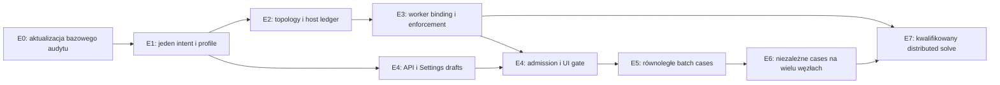

# Compute environment → Settings → solver → równoległe wykonanie

Data: 2026-10-04. Status: **implementacja zlecona, w toku**.
Użytkownik polecił wprowadzać zmiany bezpośrednio na współdzielonym `master`,
bez nowego worktree. Ta instrukcja ma pierwszeństwo przed domyślną izolacją.
Stan etapów i dowody: [checkpoint implementacji](implementation-checkpoint.md).
Poniższe etapy określają zakres docelowy; nie są deklaracją ich ukończenia.
Źródła badano na współdzielonym `master`; nie kompilowano testów, nie budowano
runtime i nie uruchamiano solverów. Zakaz kompilowania testów jednostkowych
pozostaje w mocy również przy przyszłym dobieraniu bramek.

## 1. Dokumenty i wynik projektowania

| Dokument | Zawartość |
|---|---|
| [Audyt źródeł](source-audit.md) | Znalezione ustawienia justfile/CLI/env/Python, obecne pule i scheduler, luki, źródła COMSOL/CST |
| [Specyfikacja](../../../specs/compute-resource-execution-v1.md) | Własność, pierwszeństwo, modele danych, bilans zasobów, placement, recovery, API, sweeps i distributed solve |
| [Projekt UI](../../../design/start-screen/docs/10-compute-settings-and-multi-device.md) | Settings, rail, Study, Run preview, queue, wyniki, stany i makiety |
| [ADR 0052](../../../adr/0052-compute-resource-placement-and-parallel-sweeps.md) | Przyjęta decyzja architektoniczna, alternatywy, migracja |
| [Manifest źródeł](source-manifest.json) | HEAD oraz SHA-256 badanych plików ze współdzielonego checkoutu |
| [Weryfikacja projektu](design-verification.md) | Kontrola odnośników, źródeł, nazw recept i uwagi review |

**Rekomendowana pierwsza dostawa:** niezależne cases uruchamiane na jednej
karcie lub ograniczonej grupie CPU każdy, ze wspólnym bilansem hosta,
kanonicznym żądaniem zasobów i widocznym rzeczywistym przydziałem. Jeden solve
na wielu kartach/węzłach ma dalszy, osobny etap numeryczny. W obu trybach
obowiązuje ten sam produkt: Compute environment, Settings, Study i Jobs.

## 2. Ustalenia, od których zależy wdrożenie

1. Kontrole CPU/GPU już istnieją. Trzeba je scalić semantycznie, zachowując
   kompatybilne wejścia; nie zastępować działającego schedulera nowym.
2. Wątki kompilacji, control plane, przygotowania siatki i solvera są osobne.
   Użytkownik ustawia zasoby solvera/case, a worker adapter konfiguruje
   Rayon/OpenMP/BLAS/Gmsh zgodnie z fazą i allocation.
3. `gpu_count` jednego solve'a nie określa liczby równoległych cases.
   Cztery niezależne GPU jobs nie wymagają rozproszonego operatora demag.
4. Profil jest wersjonowanym wejściem resolvera. Nie może istnieć niezależnie
   edytowany run-level device sprzeczny z materializowanym profilem kroku.
5. Obecne exact-ID leases chronią jeden store. Przed współbieżnym wykonaniem
   przez wiele store'ów potrzebny jest wspólny bilans fizycznego hosta.
6. UI nie modyfikuje justfile, zmiennych globalnego API ani aktywnych pul
   solvera. Zmiany ustawień dotyczą nowych draftów/admission; aktywne runy
   zachowują snapshot i przydział.
7. `auto` jest zachowanym żądaniem. `gpu` nie dopuszcza cichego CPU fallbacku;
   brak urządzenia, runtime lub kwalifikacji daje konkretną przyczynę.

To są decyzje projektu. Przed wdrożeniem należy potwierdzić aktualną tożsamość
źródeł i rozstrzygnąć ewentualne zmiany kontraktów powstałe po tym audycie.
Nie wymaga to ponownego wymyślania architektury ani powtarzania aktualnych dowodów.

## 3. Kolejność i zależności

E1/E2/E3 zawierają fundamenty wymagane przed zwiększeniem domyślnego
concurrency usługi. Interfejs może wcześniej prezentować read-only inventory
i edytowalny draft profilu, ale nie może odblokować niegotowego wykonania.
Etapy dostarcza się spójnymi, zweryfikowanymi fragmentami na wskazanym przez
użytkownika `master`. Zachowujemy cudze dirty zmiany; checkpoint nie upoważnia
do objęcia ich stagingiem/commitem ani do resetu wspólnego checkoutu.

### E0 — utrwalenie bazowej architektury i kontraktów

**Właściciel:** dokumentacja/kontrakty; bez zmian runtime.

- Odczytać manifest i aktualny diff wymienionych źródeł. Potwierdzić reuse
  P3-43/45/50/51/52/55/56/58 oraz ADR 0035/0037/0049/0051.
- Przyjąć albo skorygować ADR 0052. Zachować rozdział stanu źródeł i runtime.
- Zidentyfikować aktualny schema version i migrator Study/RunSpecification,
  nie wprowadzać drugiej ścieżki deserializacji starych projektów.
- Nazwane nowe typy/zasoby specyfikacji są propozycjami. Uzgodnić ich finalne
  nazwy z generatorami OpenAPI i kanonicznym Python DSL przed edycją kodu.

**Odbiór:** brak sprzeczności między authoring, profilem, RunSpec, capability,
OutputStorage i planem. Wersje kontraktów mają właściciela i migrację.

### E1 — jeden resolver żądania wykonania

**Właściciel:** authoring/IR/planner/application. Główne istniejące punkty:

- `packages/fullmag-py/src/fullmag/world.py`, `model/problem.py`;
- `crates/fullmag-authoring/src/study_contract.rs`;
- `crates/fullmag-plan/src/study_catalog.rs`, `study_lowering.rs`;
- `crates/fullmag-application/src/run_spec.rs`;
- `crates/fullmag-runtime-control/src/study.rs`.

**Praca:**

1. Wprowadzić typed execution request, materializację wersji profilu i origin
   dla każdego pola. Rozwiązać backend/device/precision/mode per task;
   wyprowadzać run summary z tych samych danych.
2. Oddzielić `cpu.threads`, placement CPU i nested pool policy od liczby
   równoległych cases; GPU selector od `devices_per_task` i rank count.
3. Publiczny Python otrzymuje typowane, eksportowalne odpowiedniki profilu,
   execution request i batch specification. Istniejące `.threads()`,
   `.device()` i `cuda:N` pozostają wejściami zgodności, zgodnie ze specyfikacją.
   Finalną sygnaturę nowych konstruktorów zatwierdza kontrakt Python/IR;
   projekt nie przedstawia ich jako już działającego API.
4. UI→Python→IR→StudyPlan zachowuje jawne Auto, jednostki, precision i origin.
   Sprzeczne jawne wartości powodują błąd z obiema lokalizacjami.
5. Justfile/CLI importuje legacy env przez allowlist do tego samego resolvera.
   Odróżnić runtime request od ograniczeń operatora i widoczności kontenera.
   Emitować deprecation dopiero przy dostępnej równoważnej ścieżce migracji.

**Odbiór:** tabela pierwszeństwa sprawdzona dla jawnego/Auto/nieobecnego pola;
profile pin/version/hash nie zmieniają zaakceptowanych runów; forced GPU
sprawdzane dla każdego solver taska. Preparation może korzystać z CPU jako
odrębna faza, bez fałszywego deklarowania solver fallbacku.

### E2 — topologia, polityka hosta i wspólny ledger

**Właściciel:** runtime-control/session/runtime owner. Punkty rozszerzenia:

- `crates/fullmag-runtime-control/src/local_resources.rs`, `scheduler.rs`;
- `crates/fullmag-session/src/runtime_service.rs`, `store.rs`;
- `crates/fullmag-api/src/resource_pool_main.rs`, `runtime_service_main.rs`;
- nowy moduł topologii i ledger w istniejących warstwach, bez nowej kolejki.

**Praca:**

1. Publikować NodeSnapshot z CPU topology/NUMA/SMT/OS constraints, GPU UUID,
   powiązaniami MIG, pojemnością pamięci, runtime capabilities i świeżością.
2. Zastąpić równe dzielenie CPU/RAM przez liczbę ofert wspólnym bilansem
   hosta. Oferta GPU nie mnoży RAM ani rdzeni hosta.
3. Wersjonować NodePolicy; udostępnione rdzenie/karty, rezerwa pamięci/UI,
   admission limits i uprawnienia operatora nie należą do localStorage.
4. Wprowadzić composite allocation, host owner fencing i protokół
   tentative→store claim→committed→spawn. Recovery obejmuje każdy punkt awarii.
5. Politykę stosować do preparation i solve oraz wszystkich podłączonych
   store'ów. Niezintegrowane procesy/builder uwzględniać konserwatywnie;
   nie deklarować pełnej kontroli obcych procesów.
6. Zachować durable fairness/priority/backpressure; dodać batch fairness
   i all-or-nothing gang admission bez częściowego trzymania kart.
7. Wersjonować konfigurację limitów compute/preparation w istniejącym
   `RuntimeServiceConfig` i jej zastosowanie przez `runtime_service_main`.
   Obecne reuse APPLICATION.json i cap=1 muszą mieć jawną migrację; samo
   discovery wielu ofert nie zwiększa tego cap. Zmianę spiąć z NodePolicy,
   owner lifecycle i drain, bez resamplingu trwałego budżetu z free RAM.

**Odbiór:** dwa store'y, prep i solve nie dostają kolidujących CPU/GPU;
nie ma double counting RAM; restart ownera i stale epoch nie podwajają
allocation. Utrata heartbeat pozostawia unknown/quarantine do uzgodnienia.

### E3 — wiarygodne wykonanie zasobów w workerze

**Właściciel:** supervisor/worker i istniejące adaptery backendów.

- `crates/fullmag-api/src/accepted_study_supervisor.rs`, `accepted_study_worker.rs`;
- `crates/fullmag-runner/src/lib.rs`, `dispatch.rs`;
- `backends/fem/cpu/mfem/runtime/cpu_threads.cpp`;
- adapter FDM, Gmsh `_gmsh_infra.py`, managed wrapper
  `scripts/export_fem_gpu_runtime.sh`, właściwe launchery Windows/Compose.

**Praca:**

1. Budować izolowane per-child env z allocation; usuwać sprzeczne odziedziczone
   FDM/FEM/generic indices i thread overrides. Nie zmieniać process-global env API.
2. GPU UUID→visibility mask→local ordinal; potwierdzić native UUID/precision.
   Receipt z inną kartą niż allocation odrzuca publikację sukcesu.
3. Konfigurować Rayon/OpenMP/BLAS/Gmsh adekwatnie do fazy i rezerwacji.
   Ustalić adapter nested parallelism, zamiast mnożenia N×N wątków.
4. Wprowadzić affinity i dostępne OS limits: Windows processor groups/CPU sets,
   Linux cgroup/cpuset/quota. Raportować actual enforcement; wymaganego hard
   limit nie zastępuje advisory lub sama zmienna środowiskowa.
5. Potwierdzać requested/resolved/allocated/executed w receipt; release dopiero
   po exit proof. Brak raportu backendu jest `unreported`.

**Odbiór:** żądane 4 threads/case nie tworzy dwóch jednoczesnych pul po całym
hoście. GPU 1 wybrane po UUID pozostaje tą samą kartą przy zmianie enumeracji.
Tożsamość runtime, precision i ewentualny fallback są zweryfikowane osobno
dla każdej z czterech lane'ów. Nieobjęta lane pozostaje niedostępna.

### E4 — typed API, Settings i Compute environment

**Właściciel:** API schemas/handlers → generated client → facade/resource hooks
→ istniejące start/inspector/explorer. Główne punkty:

- `crates/fullmag-api/src/router_v2/mod.rs`, `schemas/`, `router_v2/handlers/`;
- `apps/control-room/src/kernel/resources/runtimeExplorerResources.ts`;
- `apps/control-room/src/modules/start/model/useComputeProbe.ts`,
  `computeTelemetry.ts`, `sections/ComputeEnvironmentSettings.tsx`,
  `rail/ComputeEnvironmentWidget.tsx`;
- `apps/control-room/src/modules/inspector/panels/StudyInspectorPanel.tsx`;
- `apps/control-room/src/modules/explorer/builders/jobExplorerNodes.ts`.

**Praca:**

1. Udostępnić zasoby inventory/policy/profiles/allocations/queue oraz preview
   z rewizjami i kontraktem błędów specyfikacji; wygenerować klient i typy.
2. Oddzielić telemetry sampling od inventory i allocation. Obecny index/name
   telemetry nie jest UUID schedulera; połączyć je po trwałej tożsamości,
   zachowując `unmapped`, gdy powiązania nie da się udowodnić.
3. Wdrożyć Overview/Resources/Profiles, draft+Apply/Cancel, conflict refresh,
   uprawnienia, stany unavailable/stale, przyczyny unsupported i drain.
4. Study Execution używa tego samego modelu; Solver settings zachowuje
   własne tolerancje/metody. Profile nie edytują aktywnej symulacji.
5. Rail pokazuje faktyczne allocated/reserved/use osobno, link do wybranego
   node i Jobs. Wyniki pokazują rzeczywiste execution receipt.
6. API timeout po mutacji uzgadnia intent; ACK nie oznacza ukończenia.
   Invalidations i cache key uwzględniają node/owner epoch/revisions.

**Odbiór:** round-trip ustawień, read-only user, profile conflict, refresh bez
utraty draftu, brak przecieku między node/session epoch. Browser proof obejmuje
rail/Settings/Study/Jobs, klawiaturę, light/dark i wąski ekran. Gdy zmieniony
jest viewport/observation source, wymagane visible canvas, contextLost=false
i niezerowy drawing buffer; same testy komponentów nie zamykają tej bramki.

### E5 — batch expansion, równoległe cases i wyniki

**Właściciel:** application batch catalog + runtime scheduler + API/UI.

- Rozszerzyć istniejący submit projektu i RunSpecification, katalog session,
  task scheduler i cancellation; nie tworzyć endpointu bez durable intent.
- `crates/fullmag-cli/src/step_utils.rs` pozostaje punktem kompatybilności
  istniejącego narrow parameter macro. Nowy independent batch jawnie
  materializuje child RunIds, stable CaseIds i manifest ekspansji.
- Wdrożyć Cartesian/zip validation, liczbę cases, seed policy, max concurrency,
  failure policy, bounded expansion, dependency chains i retry attempts.
- Wyniki używają CAS i OutputStorage: osobne ścieżki, brak kolizji, indeks
  ukończonych/failed/canceled cases, publikacja przed completed receipt.
  Batch przypina OutputStorage snapshot przy Submit; istniejący owner
  OutputStorage rezerwuje ścieżki powiązane z case/attempt. Zmiana workspace
  defaults podczas ekspansji nie zmienia policy późniejszych child Runów.
- UI oferuje resources per case i parallel cases, preview limitującego
  zasobu, kolejkę z filtrem batch i partial results.

**Odbiór:** 24 przypadki na 4 GPU wykonują się w maksymalnie 4 niezależnych
workerach przy zgodnych budżetach; CPU sweep dzieli udostępnione rdzenie.
Dowód czterech jednoczesnych workerów wymaga jawnego service compute cap=4
lub większego oraz batch cap≥4. Admission nigdy nie przekracza cap usługi;
sprawdzić także celową serializację przy service cap=1 i batch cap=4.
Histereza wykonuje zależne punkty w kolejności, ale pozwala rozdzielić
niezależne zewnętrzne łańcuchy. Cancel/retry jednego case nie niszczy innych
wyników; restart usługi zachowuje kolejkę i nie powtarza ukończonych przypadków.

### E6 — kilka węzłów / adapter klastra

**Właściciel:** istniejący runtime owner z node providerami; application i UI
korzystają z tych samych request/allocation/receipt.

- Dodać autoryzowane dołączanie node, identity/epoch, runtime compatibility,
  transfer CAS z digest/resume, własny scratch i staging state.
- Zewnętrzny scheduler przyznaje zasoby adapterowi; Fullmag widzi wyłącznie
  ten przydział. Persistować provider job ID i uzgadniać timeout/ACK/requeue.
- UI wybiera pool/requirements, nie arbitralną komendę SSH. Utrata node
  nie zwalnia automatycznie urządzeń i nie uruchamia zdublowanej próby.

**Odbiór:** niezależne cases na dwóch węzłach, reconnect, host reboot,
stale credentials/epoch, przerwany transfer i dokładna tożsamość wyników.
Nie zakładać, że identyczna ścieżka Windows/Linux oznacza wspólny plik.

### E7 — jeden solve na wielu urządzeniach

**Właściciel:** obecne native backend owners + planner/capability; scheduler
rezerwuje gang, ale nie partycjonuje równań.

Przed implementacją operatorów uzupełnić odpowiednie noty naukowe: podział
FDM/FEM, demag strategy, global reductions, boundary/ghost semantics,
precyzję, collective checkpoint i deterministyczność. Wymagania §11
specyfikacji stanowią kontrakt tego etapu, nie deklarację obecnego wsparcia.

**Odbiór:** osobno dla FDM CPU/FDM GPU/FEM CPU/FEM GPU oraz workflow:
parity z pojedynczym urządzeniem, zbieżność, energia/obserwable, failure ranka,
complete manifest shards, brak cichego fallbacku i rzeczywiste wykorzystanie
przydzielonych urządzeń. Zachować istniejące benchmarki projektu, w tym
500×500×10 nm Py sinc-layer przy odpowiedniej kwalifikacji FEM/BEM.
Usunięcie walidatora `gpu_count > 1` jest ostatnim skutkiem otwarcia konkretnej
capability, nigdy pierwszym krokiem implementacji.

## 4. Macierz weryfikacji przyszłej implementacji

Wszystkie poniższe wykonawcze bramki mają teraz status **NOT VERIFIED**.
Projekt opisuje wymagane dowody; nie uruchamia ich w zadaniu planistycznym.

| Bramka | Wymagany dowód | Etap |
|---|---|---|
| Kontrakt authoring | Python↔IR↔UI, precedence, profile version, Auto, per-step conflicts, stary dokument | E1 |
| Zasoby | Suma CPU/RAM/scratch, UUID/MIG collision, SMT/NUMA, stale inventory, dwa store'y | E2 |
| Recovery | Crash przed/po każdym prepare/claim/commit/spawn/publish/release; reconciliation bez duplicate spawn | E2–E3 |
| Worker CPU | Rzeczywiste native thread counts i affinity, nested pools, OS constraints i enforcement level | E3 |
| Worker GPU | Fizyczny UUID, maska, local ordinal, precision, runtime digest, nonempty terminal receipt | E3 |
| API | Generated schema zgodna z Rust, revision conflicts, auth, idempotency, invalidations, bounded paging | E4 |
| UI | Browser proof, stabilny draft, odczyt versus rezerwacja, host identity, accessibility | E4–E5 |
| Batch | Deterministic case expansion/seeds, max concurrency, fairness, continuation, retry/cancel, partial results | E5 |
| OutputStorage | Brak kolizji wyników/tmp; poprawny writer i publikacja przed completion | E5 |
| Remote | CAS integrity, provider job reconciliation, reconnect i fencing | E6 |
| Distributed science | Lane/workflow-specific partition, convergence/parity/energy i rank failure | E7 |

Istniejące recepty stanowią punkty reuse, nie automatycznie kompletną walidację:
`check-api-source`, `check-api-resource-pool`,
`verify-api-accepted-scheduler-parallel-resources-e2e`,
`verify-api-accepted-scheduler-dynamic-resource-pool-e2e`,
`verify-api-accepted-scheduler-retry-e2e`,
`verify-api-resource-discovery-runtime`,
`verify-api-accepted-fem-preparation-runtime`,
`verify-api-accepted-fdm-gpu-runtime`.
Przed użyciem odczytać aktualną receptę: jeśli kompiluje unit tests, pozostaje
zablokowana do odwołania zakazu. Pełne buildy wymagają zatwierdzonej managed
trasy i obowiązującego storage preflight/lease/receipt.

Fixture z czterema GPU może sprawdzić placement, ale nie dowodzi wykonania
na czterech kartach. Host z jedną kartą zamyka single-GPU gate i nie zamyka
multiGPU. CPU proof nie zastępuje GPU, FDM nie zastępuje FEM, a zielony build
nie zastępuje browser proof ani nauki. Dowody zawierają SHA źródeł i pakietu,
requested/resolved device/precision, przydziały, receipts i artefakty wyników.

## 5. Migracja, rollout i rollback

- Nowe optional request fields są wersjonowane. Historyczne runy zachowują
  niepełną proweniencję jako `legacy/unreported`, bez dopisywania zmyślonych
  UUID i rzeczywistych wątków.
- Dotychczasowe static/dynamic pool IDs mapują się do topologii wyłącznie
  przy potwierdzonym physical identity. Konflikt/nieznany mapping blokuje
  multi-worker admission; nie powiela pojemności przez utworzenie nowego ID.
- Funkcje włączać kolejno: read-only inventory → intent/profile → allocation
  i worker enforcement → Settings mutation → independent batch concurrency
  → remote → workflow-qualified distributed solve.
- Rollback wyłącza nowe admission przez flagę/policy drain. Nie cofa schema
  aktywnych runów, nie zabija workerów i nie usuwa journalu, CAS ani wyników.
  Stary runtime odmawia otwarcia nowego niewspieranego schema version.
- Zmiana profilu lub policy nie przepisuje istniejących immutable RunSpecs.
  Zmienione wymagania tworzą nowy jawny request z lineage do poprzedniego.

## 6. Pokrycie zlecenia projektowego

| Wymaganie użytkownika | Odpowiedź projektu |
|---|---|
| Odnaleźć wcześniejsze CPU/GPU/thread controls | Audyt S01–S14 z konkretnymi konsumentami i pierwszeństwem |
| Połączyć z solver settings | Spec §3–4 i UI §1: execution oddzielone od numeryki, wspólny resolver |
| Zaprojektować Settings | UI §3: Overview/Resources/Profiles; polityka operatora, draft/apply, wersje |
| Rozwinąć Compute environment | UI §2 i spec §4/8: hardware/runtime/allocations/telemetry i jawne braki |
| Kilka GPU w jednym węźle | Spec §5–6: UUID, per-worker isolation, host ledger, fit, VRAM, receipt |
| Kilka CPU / wiele rdzeni | Spec §4–6: socket/core/logicalCPU/NUMA, budżet per case, affinity/nested pools |
| Sweeps na kilka kart/grup CPU | Spec §7, E5, UI sweep/preview/Jobs; niezależność i continuation |
| Jeden solve na wielu GPU | Spec §11 i E7: pełny osobny kontrakt numeryczny i kwalifikacja |
| Analogicznie do COMSOL/CST | Audyt §5: sprawdzone źródła producentów i jawne decyzje adaptacji |
| Dokładny plan realizacji | E0–E7, właściciele, zależności, bramki, recovery, rollout i migracja |

Ukończenie tej macierzy oznacza kompletność projektu. Nie zmienia statusu
przyszłych bramek wykonawczych. Przyjęcie ADR nie jest dowodem ich spełnienia.
