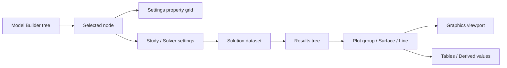
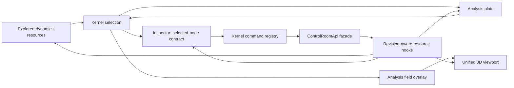
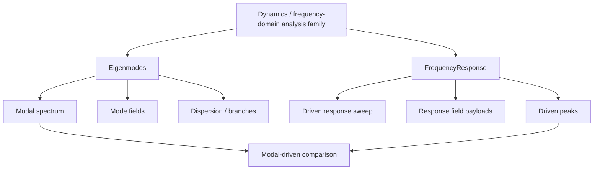
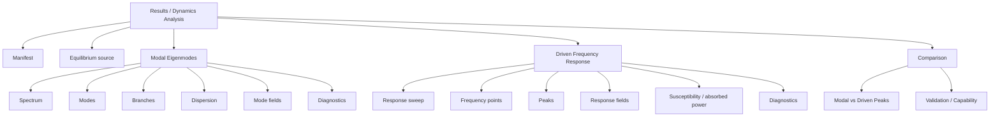
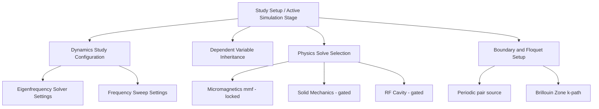
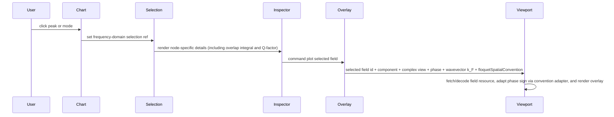
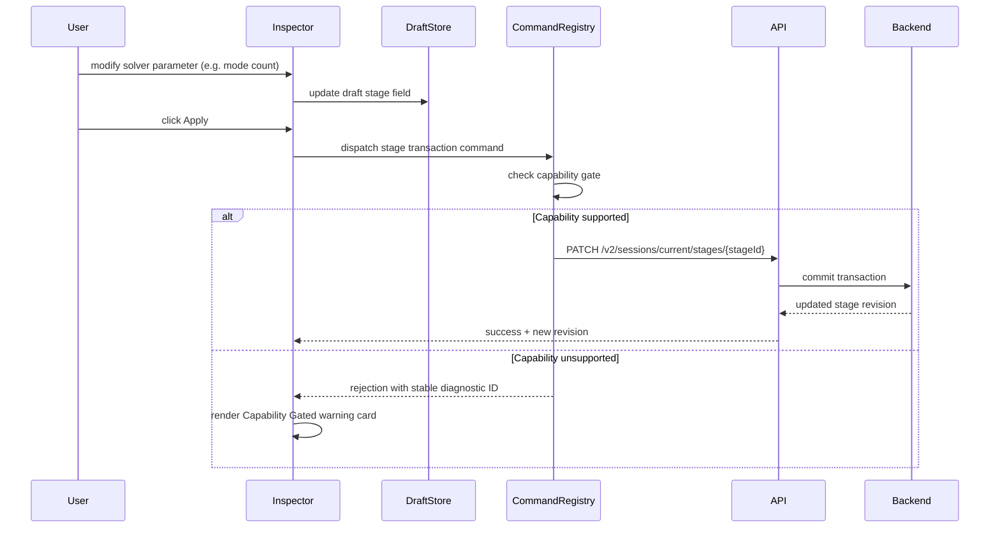
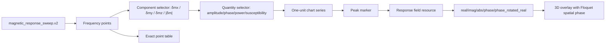
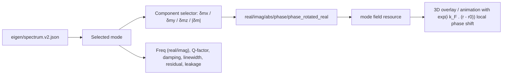
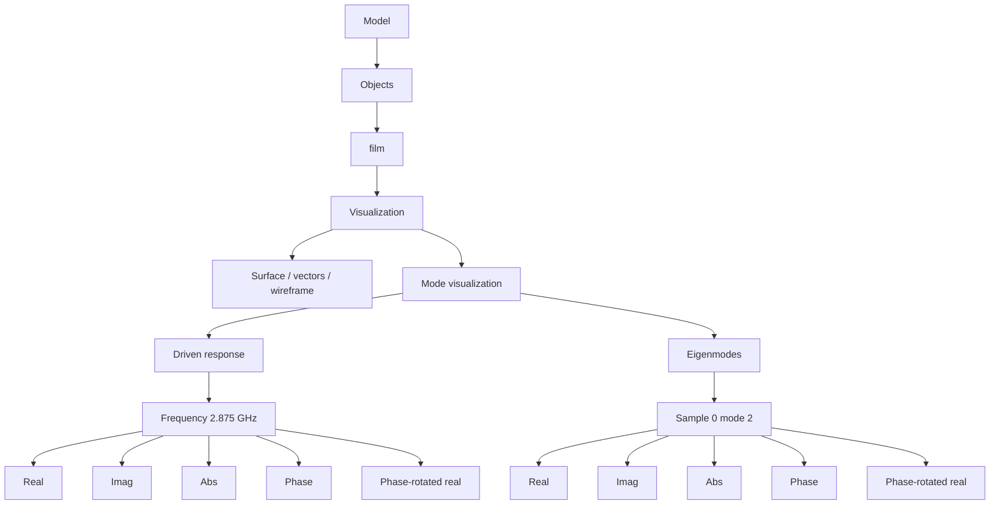

# 03 - Schematics

These diagrams are original Fullmag schematics derived from the COMSOL interface
pattern. They intentionally do not copy COMSOL screenshots.

## COMSOL Construction Pattern

## Fullmag Dynamics Workbench Pattern

## Solver Product Split

## Explorer Node Families

## Study Setup Explorer Node Families

> **Note:** All Study Setup nodes are **Phase 2** — they require backend stage transaction schemas (`stage.study_type`, `stage.solver.*`, `stage.dependencies.*`, `stage.physics.*`) that do not yet exist.

## Inspector And Viewport Handoff

## Study Setup Transaction Handoff

> **Note:** The PATCH endpoint and backend transaction schemas are **Phase 2** and do not yet exist.

## Response Spectrum Controls

## Modal Spectrum Controls

## Mode Visualization Under Model Tree

> **Implementation status:** The Explorer tree nodes and `SelectionRef` types for mode visualization **already exist** in the codebase (`buildModelTree.ts`, `selectionTypes.ts`, `explorerSelection.ts`). The **missing piece** is inspector panel registration — `object.mode_visualization*` kinds fall through to `PlaceholderPanel`.
