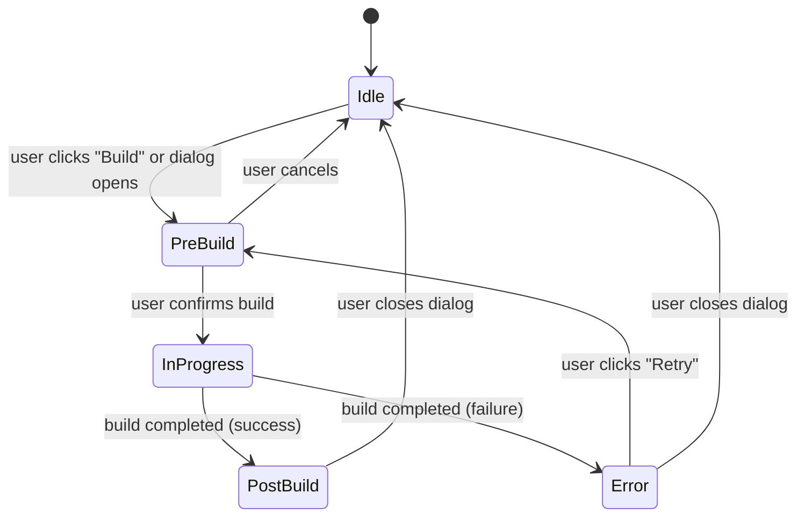

# Faza 2: MeshBuildDialog — Pełny Redesign

Data: 2026-06-06
Status: DRAFT — do akceptacji przed implementacją
Parent: [mesh-build-ui-overhaul-masterplan-2026-06-06-pl.md](./mesh-build-ui-overhaul-masterplan-2026-06-06-pl.md)

---

## 1. Cel

Przebudować `MeshBuildDialog` z prostego overlay statusowego na **pełnoprawne okno budowy meshu** z trzema fazami widoku:

1. **Pre-Build** — podsumowanie: co się zmieni (parametry before/after).
2. **In-Progress** — live monitoring: pipeline stepper + streaming log.
3. **Post-Build** — wynik: statystyki meshu, quality metrics, potwierdzenie dostarczenia do viewport.

---

## 2. Docelowy wygląd

### 2.1 Pre-Build (przed kliknięciem Build)

```
┌─────────────────────────────────────────────────────────────────┐
│  Mesh Build                                            [×]      │
├─────────────────────────────────────────────────────────────────┤
│                                                                 │
│  ▸ Parameter Changes                                  Modified  │
│  ┌─────────────────────────────────────────────────────────┐    │
│  │ Parameter              │ Current      │ New             │    │
│  │─────────────────────────────────────────────────────────│    │
│  │ Max element size       │ 20 nm        │ 10 nm     ↓    │    │
│  │ Min element size       │ 5 nm         │ 2 nm      ↓    │    │
│  │ Growth rate            │ 1.4          │ 1.3       ↓    │    │
│  │ Algorithm 3D           │ Delaunay     │ Delaunay  =    │    │
│  │ Mesh strategy          │ auto         │ sweep     ✎    │    │
│  └─────────────────────────────────────────────────────────┘    │
│                                                                 │
│  ▸ Current Mesh Summary                                         │
│  ┌─────────────────────────────────────────────────────────┐    │
│  │ Nodes: 12,345   Elements: 45,678   Faces: 8,901       │    │
│  │ Min edge: 1.8 nm   Max edge: 25 nm   Mean: 8.2 nm     │    │
│  │ Quality γ_min: 0.42   SICN p05: 0.31   Avg: 0.78      │    │
│  └─────────────────────────────────────────────────────────┘    │
│                                                                 │
│  ▸ Build Target                                                 │
│  ┌─────────────────────────────────────────────────────────┐    │
│  │ Target: shared-domain mesh                              │    │
│  │ Scene revision: 12                                      │    │
│  │ Policy revision: 7 → 8 (pending apply)                  │    │
│  │ Objects: arch_waveguide (1 magnetic + 1 airbox)         │    │
│  └─────────────────────────────────────────────────────────┘    │
│                                                                 │
├─────────────────────────────────────────────────────────────────┤
│  [Cancel]                              [Apply & Build Mesh]     │
└─────────────────────────────────────────────────────────────────┘
```

### 2.2 In-Progress (budowa trwa)

```
┌─────────────────────────────────────────────────────────────────┐
│  Mesh Build — Building...                              [×]      │
├─────────────────────────────────────────────────────────────────┤
│                                                                 │
│  ▸ Pipeline                                        45% ████░░  │
│  ┌─────────────────────────────────────────────────────────┐    │
│  │ ✓ Queued                                    12 ms      │    │
│  │ ✓ Script materialization                    340 ms      │    │
│  │ ✓ Geometry realization                      150 ms      │    │
│  │ ● Size field planning          60%          ...        │    │
│  │ ○ Gmsh meshing                              pending     │    │
│  │ ○ Quality analysis                          pending     │    │
│  │ ○ Topology delivery                         pending     │    │
│  └─────────────────────────────────────────────────────────┘    │
│                                                                 │
│  ▸ Build Console                                    24 entries  │
│  ┌─────────────────────────────────────────────────────────┐    │
│  │ 14:21:05 INFO  gmsh: initializing OCC kernel           │    │
│  │ 14:21:05 INFO  mesh build: creating airbox geometry     │    │
│  │ 14:21:06 INFO  gmsh: fusing volumes (2 objects)         │    │
│  │ 14:21:06 INFO  meshing: applying edge size field        │    │
│  │ 14:21:07 INFO  meshing: applying corner size field      │    │
│  │ 14:21:07 INFO  gmsh: generating 3D mesh (Delaunay)      │    │
│  │ ...                                    ▼ auto-scroll    │    │
│  └─────────────────────────────────────────────────────────┘    │
│                                                                 │
│  Elapsed: 2.3 s                                                 │
│                                                                 │
├─────────────────────────────────────────────────────────────────┤
│  [Open Diagnostics]           [Keep Running]          [Close]   │
└─────────────────────────────────────────────────────────────────┘
```

### 2.3 Post-Build (zakończone)

```
┌─────────────────────────────────────────────────────────────────┐
│  Mesh Build — Completed ✓                              [×]      │
├─────────────────────────────────────────────────────────────────┤
│                                                                 │
│  ┌─────────────────────────────────────────────────────────┐    │
│  │ ✓ Mesh built successfully                               │    │
│  │   Viewport updated with new topology (rev 42)           │    │
│  │   Duration: 5.2 s                                       │    │
│  └─────────────────────────────────────────────────────────┘    │
│                                                                 │
│  ▸ Mesh Statistics: Before → After                              │
│  ┌─────────────────────────────────────────────────────────┐    │
│  │ Metric           │ Before      │ After       │ Δ       │    │
│  │─────────────────────────────────────────────────────────│    │
│  │ Nodes            │ 12,345      │ 28,901      │ +16,556 │    │
│  │ Elements         │ 45,678      │ 98,234      │ +52,556 │    │
│  │ Boundary faces   │ 8,901       │ 12,345      │ +3,444  │    │
│  │ Min edge         │ 1.8 nm      │ 0.9 nm      │ -0.9    │    │
│  │ Max edge         │ 25 nm       │ 12 nm       │ -13     │    │
│  │ Mean edge        │ 8.2 nm      │ 4.1 nm      │ -4.1    │    │
│  │ γ_min            │ 0.42        │ 0.45        │ +0.03   │    │
│  │ SICN p05         │ 0.31        │ 0.38        │ +0.07   │    │
│  │ Avg quality      │ 0.78        │ 0.82        │ +0.04   │    │
│  └─────────────────────────────────────────────────────────┘    │
│                                                                 │
│  ▸ Quality Gates                                        3 / 3 ✓ │
│  ┌─────────────────────────────────────────────────────────┐    │
│  │ ✓ min_gamma ≥ 0.1                          0.45        │    │
│  │ ✓ sicn_p05 ≥ 0.2                           0.38        │    │
│  │ ✓ max_edge ≤ hmax                          12 nm       │    │
│  └─────────────────────────────────────────────────────────┘    │
│                                                                 │
│  ▸ Build Console                                  24 entries ▾  │
│                                                                 │
├─────────────────────────────────────────────────────────────────┤
│  [View Details in Inspector]                          [Close]   │
└─────────────────────────────────────────────────────────────────┘
```

### 2.4 Error state

```
┌─────────────────────────────────────────────────────────────────┐
│  Mesh Build — Failed ✗                                 [×]      │
├─────────────────────────────────────────────────────────────────┤
│                                                                 │
│  ┌─────────────────────────────────────────────────────────┐    │
│  │ ✗ Mesh build failed                                     │    │
│  │   Error: Gmsh failed with exit code 1                   │    │
│  │   Phase: gmsh_meshing                                   │    │
│  │   Duration: 1.2 s                                       │    │
│  └─────────────────────────────────────────────────────────┘    │
│                                                                 │
│  ▸ Last Build Console                             12 entries ▾  │
│  ┌─────────────────────────────────────────────────────────┐    │
│  │ 14:21:07 ERROR gmsh: invalid geometry                   │    │
│  │ 14:21:07 ERROR mesh build: build aborted                │    │
│  └─────────────────────────────────────────────────────────┘    │
│                                                                 │
├─────────────────────────────────────────────────────────────────┤
│  [Open Diagnostics]          [Retry Build]            [Close]   │
└─────────────────────────────────────────────────────────────────┘
```

---

## 3. Architektura komponentów

### 3.1 Nowa struktura plików

```
modules/overlay/mesh-build/
├── MeshBuildDialog.tsx              ← główny dialog (state machine)
├── MeshBuildDialogModel.ts          ← state machine: pre/in-progress/post/error
├── MeshBuildDialogModel.test.ts     ← testy state machine
├── MeshBuildPreBuildView.tsx         ← widok pre-build z parameter diff
├── MeshBuildInProgressView.tsx       ← widok in-progress z stepper + log
├── MeshBuildPostBuildView.tsx        ← widok post-build z stats + gates
├── MeshBuildErrorView.tsx            ← widok błędu
├── MeshBuildParameterDiff.tsx        ← tabela parameter changes
├── MeshBuildPipelineStepper.tsx      ← stepper z ikonkami ✓/●/○
├── MeshBuildLiveConsole.tsx          ← streaming log (bez limitu)
├── MeshBuildStatisticsTable.tsx      ← before/after statistics
└── index.ts
```

### 3.2 State machine



```typescript
// MeshBuildDialogModel.ts

export type MeshBuildDialogPhase = "idle" | "pre-build" | "in-progress" | "post-build" | "error";

export interface MeshBuildDialogState {
  phase: MeshBuildDialogPhase;
  // Pre-build
  parameterDiff: ParameterDiffRow[] | null;
  currentMeshSummary: MeshSummarySnapshot | null;
  buildTarget: MeshBuildTarget;
  // In-progress
  pipelinePhases: MeshPipelinePhase[];
  logEntries: EngineLogEntry[];
  startedAtMs: number | null;
  // Post-build
  previousMeshStats: MeshStatisticsSnapshot | null;
  newMeshStats: MeshStatisticsSnapshot | null;
  qualityGates: QualityGateRow[];
  buildDurationMs: number | null;
  topologyDelivered: boolean;
  // Error
  errorMessage: string | null;
  errorPhase: string | null;
  // Command tracking
  commandId: string | null;
  commandStatus: string;
}

export interface ParameterDiffRow {
  parameter: string;
  currentValue: string;
  newValue: string;
  changed: boolean;
  direction: "increased" | "decreased" | "unchanged" | "modified";
}

export interface MeshStatisticsSnapshot {
  nodeCount: number | null;
  elementCount: number | null;
  boundaryFaceCount: number | null;
  minEdge: number | null;
  maxEdge: number | null;
  meanEdge: number | null;
  gammaMin: number | null;
  sicnP05: number | null;
  avgQuality: number | null;
}

export interface MeshSummarySnapshot {
  meshName: string | null;
  meshRevision: number | null;
  sceneRevision: number | null;
  policyRevision: number | null;
  stats: MeshStatisticsSnapshot;
}
```

### 3.3 Parameter diff — źródło danych

`MeshBuildParameterDiff` porównuje:

1. **Stored policy** (z API: `api.meshing.objectPolicy(objectId)`) — "current".
2. **Draft policy** (z `ObjectMeshPolicyPanelModel` dirty state) — "new".

Kluczowe parametry do porównania (top 15 najważniejszych):

| Parameter | Klucz API | Format |
|---|---|---|
| Max element size | `maximum_element_size` | formatLength (nm/µm) |
| Min element size | `minimum_element_size` | formatLength |
| Growth rate | `maximum_element_growth_rate` | ×1.XX |
| Curvature factor | `curvature_factor` | numeric |
| Mesh strategy | `mesh_strategy` | string |
| Algorithm 2D | `algorithm_2d` | string |
| Algorithm 3D | `algorithm_3d` | string |
| Edge max size | `edge_maximum_element_size` | formatLength |
| Corner max size | `corner_maximum_element_size` | formatLength |
| Transition distance | `transition_distance` | formatLength |
| Boundary layer count | `boundary_layer_count` | integer |
| Through-thickness elements | `through_thickness_elements` | integer |
| Size preset | `size_preset` | string |
| Smoothing steps | `smoothing_steps` | integer |
| Order | `order` | integer |

Parametry które się nie zmieniły → szary tekst. Zmienione → bold + kolor (zielony jeśli lepsze, pomarańczowy jeśli gorsze, niebieski jeśli neutralne).

"Lepsze/gorsze" to heurystyka:
- Mniejszy max element size → lepsze (↑ rozdzielczość).
- Mniejszy growth rate → lepsze (↑ gładkość).
- Więcej boundary layers → lepsze.
- Zmiana algorytmu → neutralne.

### 3.4 Live console — implementacja

Obecne ograniczenie: `entries.filter(isMeshBuildLogEntry).slice(-8)`.

Nowe podejście:

```typescript
// MeshBuildLiveConsole.tsx

export function MeshBuildLiveConsole({
  entries,
  maxVisible = 200,
}: {
  entries: readonly EngineLogEntry[];
  maxVisible?: number;
}) {
  // 1. Nie filtrujemy po keyword — pokazujemy WSZYSTKIE entries
  //    z opcjonalnym togglem "Show mesh-related only"
  // 2. Bez limitu 8 — max 200 z virtual scrolling
  // 3. Auto-scroll na dół gdy nowe entries (z disable na scroll up)
  // 4. Monospace font, ciemne tło (jak terminal)
  // 5. Kolorowanie level: ERROR → czerwony, WARN → żółty, INFO → szary
  
  const containerRef = useRef<HTMLDivElement>(null);
  const [autoScroll, setAutoScroll] = useState(true);
  const [filterMeshOnly, setFilterMeshOnly] = useState(false);
  
  const visibleEntries = filterMeshOnly
    ? entries.filter(isMeshBuildLogEntry).slice(-maxVisible)
    : entries.slice(-maxVisible);
  
  useEffect(() => {
    if (autoScroll && containerRef.current) {
      containerRef.current.scrollTop = containerRef.current.scrollHeight;
    }
  }, [autoScroll, visibleEntries.length]);
  
  // ...render
}
```

### 3.5 Pipeline stepper — implementacja

```typescript
// MeshBuildPipelineStepper.tsx

const CANONICAL_PHASES = [
  { id: "queued", label: "Queued" },
  { id: "script_materialization", label: "Script Materialization" },
  { id: "geometry_realization", label: "Geometry Realization" },
  { id: "size_field_planning", label: "Size Field Planning" },
  { id: "gmsh_meshing", label: "Gmsh Meshing" },
  { id: "quality_analysis", label: "Quality Analysis" },
  { id: "topology_delivery", label: "Topology Delivery" },
] as const;

export function MeshBuildPipelineStepper({
  phases,
}: {
  phases: readonly MeshPipelinePhase[];
}) {
  // Merge backend phases z canonical — pokazuj canonical nawet jeśli
  // backend nie opublikował danej fazy (status: "pending")
  const mergedPhases = CANONICAL_PHASES.map(canonical => {
    const backendPhase = phases.find(p => p.id === canonical.id);
    return backendPhase ?? {
      id: canonical.id,
      label: canonical.label,
      status: "pending",
      detail: "",
      durationMs: null,
      progressPercent: null,
      progressLabel: null,
    };
  });
  
  // ... render z ikonkami:
  // completed → ✓ (zielony)
  // active → ● (żółty, animowany pulse)
  // pending → ○ (szary)
  // failed → ✗ (czerwony)
}
```

---

## 4. Integracja z istniejącym kodem

### 4.1 Event bus — rozszerzenie

Obecne events:
- `command:submitted` — otwiera dialog
- `command:completed` — aktualizuje status

Nowe events (opcjonalne — można inferować z resource changes):
- `mesh:build-phase-changed` — pipeline stepper update
- `mesh:build-completed-with-stats` — post-build summary

Alternatywnie (bez nowych events): dialog polling `useMeshBuildCurrent()` z `refetchInterval: 1000` w fazie in-progress. To prostsze i nie wymaga zmian w event bus.

### 4.2 Resource hooks

Nowe/zmienione hooki:

```typescript
// Istniejące (bez zmian):
useMeshBuildCurrent()        → active build status, pipeline phases
useMeshBuildLatestSuccessful()  → last success stats
useMeshSummaryResource()     → summary (node/element counts)
useEngineLogResource()       → engine log entries

// Nowe:
useMeshBuildHistory()        → build history (already exists in MeshDetailsPanel)
                               Re-use normalizeMeshBuildHistory()
```

### 4.3 Migracja ze starego MeshBuildDialog

1. Stary `MeshBuildDialog.tsx` → rename do `LegacyMeshBuildDialog.tsx` (tymczasowo zachować).
2. Nowy `mesh-build/MeshBuildDialog.tsx` → nowa implementacja.
3. W `OverlayModule.tsx` (lub gdzie dialog jest montowany) → podmienić import.
4. Po weryfikacji → usunąć `LegacyMeshBuildDialog.tsx`.

---

## 5. Stylowanie

### 5.1 CSS classes (fm- prefix)

```css
/* Dialog container */
.fm-mesh-build-dialog { }
.fm-mesh-build-dialog--pre-build { }
.fm-mesh-build-dialog--in-progress { }
.fm-mesh-build-dialog--post-build { }
.fm-mesh-build-dialog--error { }

/* Parameter diff table */
.fm-mesh-param-diff { }
.fm-mesh-param-diff__row { }
.fm-mesh-param-diff__row--changed { }
.fm-mesh-param-diff__cell--current { }
.fm-mesh-param-diff__cell--new { }
.fm-mesh-param-diff__delta { }
.fm-mesh-param-diff__delta--better { color: var(--fm-green); }
.fm-mesh-param-diff__delta--worse  { color: var(--fm-peach); }
.fm-mesh-param-diff__delta--neutral { color: var(--fm-blue); }

/* Pipeline stepper */
.fm-mesh-pipeline-stepper { }
.fm-mesh-pipeline-step { }
.fm-mesh-pipeline-step--completed { }
.fm-mesh-pipeline-step--active { }
.fm-mesh-pipeline-step--pending { }
.fm-mesh-pipeline-step--failed { }
.fm-mesh-pipeline-step__icon { }
.fm-mesh-pipeline-step__label { }
.fm-mesh-pipeline-step__duration { }

/* Live console */
.fm-mesh-console { font-family: var(--fm-font-mono); }
.fm-mesh-console__body { overflow-y: auto; max-height: 200px; }
.fm-mesh-console__entry { }
.fm-mesh-console__entry--error { color: var(--fm-red); }
.fm-mesh-console__entry--warn { color: var(--fm-yellow); }
.fm-mesh-console__entry--info { color: var(--fm-subtext0); }

/* Statistics table */
.fm-mesh-stats-table { }
.fm-mesh-stats-table__row { }
.fm-mesh-stats-table__delta { }
.fm-mesh-stats-table__delta--positive { color: var(--fm-green); }
.fm-mesh-stats-table__delta--negative { color: var(--fm-red); }

/* Completion banner */
.fm-mesh-build-banner { }
.fm-mesh-build-banner--success { border-color: var(--fm-green); }
.fm-mesh-build-banner--error { border-color: var(--fm-red); }
```

### 5.2 Dialog sizing

- **Min width**: 560px (nie mniejsze — tabele wymagają przestrzeni).
- **Max width**: 720px.
- **Max height**: 80vh z overflow scroll na body.
- **Responsive**: na < 560px → full-width, log console staje się collapsible.

---

## 6. Testy

### 6.1 Unit tests — MeshBuildDialogModel

```typescript
describe("MeshBuildDialogModel", () => {
  it("transitions idle → pre-build on dialog open", () => { });
  it("transitions pre-build → in-progress on confirm build", () => { });
  it("transitions in-progress → post-build on success", () => { });
  it("transitions in-progress → error on failure", () => { });
  it("transitions error → pre-build on retry", () => { });
  it("captures current mesh stats snapshot for post-build diff", () => { });
  it("computes parameter diff from stored vs draft policy", () => { });
});
```

### 6.2 Unit tests — MeshBuildParameterDiff

```typescript
describe("MeshBuildParameterDiff", () => {
  it("marks unchanged parameters as unchanged", () => { });
  it("detects decreased element size as 'better'", () => { });
  it("detects increased growth rate as 'worse'", () => { });
  it("formats length values with SI units", () => { });
  it("handles missing/null values gracefully", () => { });
});
```

### 6.3 Unit tests — MeshBuildPipelineStepper

```typescript
describe("MeshBuildPipelineStepper", () => {
  it("shows all canonical phases even when backend publishes fewer", () => { });
  it("marks completed phases with ✓", () => { });
  it("marks active phase with ● and pulse animation", () => { });
  it("shows duration for completed phases", () => { });
  it("shows progress percent for active phase with progress bar", () => { });
});
```
