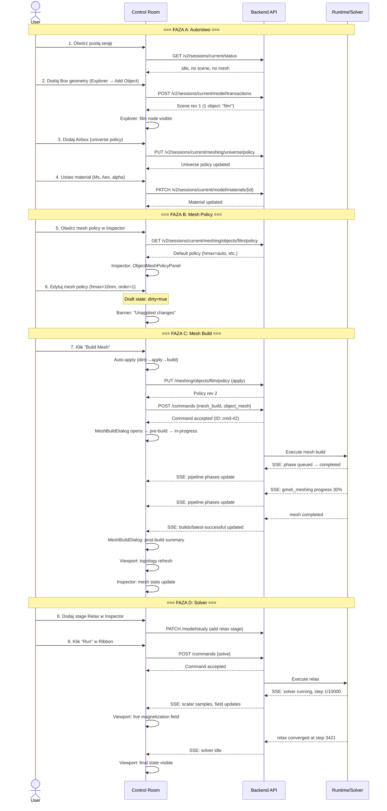

# Faza 4: Lifecycle End-to-End — Od Pustej Symulacji do Solvera

Data: 2026-06-06
Status: DRAFT — do akceptacji przed implementacją
Parent: [mesh-build-ui-overhaul-masterplan-2026-06-06-pl.md](./mesh-build-ui-overhaul-masterplan-2026-06-06-pl.md)

---

## 1. Cel

Opisać i zweryfikować **pełny flow** od uruchomienia pustej sesji Control Room do zakończenia symulacji z widocznymi wynikami. Celem jest zapewnienie, że mesh build UI jest spójne z resztą lifecycle i nie ma "czarnych dziur" gdzie użytkownik nie wie co się dzieje.

---

## 2. Pełny Lifecycle — 12 Kroków



---

## 3. Analiza Każdego Kroku — Stan Obecny vs Docelowy

### Krok 1: Otwórz pustą sesję

| Aspekt | Stan obecny | Stan docelowy |
|---|---|---|
| Explorer tree | Pokazuje szkielet: Model, Mesh, Study | Bez zmian |
| Inspector | Pusty lub "No selection" | Pokazuje "Getting Started" panel z kolejnymi krokami |
| Viewport | Pusty canvas | Bez zmian |
| Ribbon | Wszystkie meshing buttons disabled | Bez zmian (poprawne zachowanie) |

> [!TIP]
> **Opcjonalna mejora**: Getting Started panel w inspektorze z checklistą:
> ```
> □ Add geometry object
> □ Configure material
> □ Configure mesh policy
> □ Build mesh
> □ Add solver stage
> □ Run simulation
> ```
> To jest nice-to-have, nie blokuje masterplan.

### Krok 2: Dodaj Box geometry

| Aspekt | Stan obecny | Stan docelowy |
|---|---|---|
| Explorer | Node "film" pojawia się pod Model | Bez zmian |
| Inspector | Przechodzi do Object Inspector | Bez zmian |
| Viewport | Box wireframe visible | Bez zmian |
| Mesh status | "No mesh" indicator | Dodać widoczny status: "Mesh: not built" w Explorer badge |

### Krok 3: Dodaj Airbox

| Aspekt | Stan obecny | Stan docelowy |
|---|---|---|
| Inspector | Universe Mesh Policy panel | Bez zmian |
| Viewport | Airbox wireframe visible | Bez zmian |
| Explorer | Mesh → Shared Domain node | Badge: "not built" |

### Krok 4: Ustaw materiał

| Aspekt | Stan obecny | Stan docelowy |
|---|---|---|
| Inspector | Material panel z Ms/Aex/alpha | Bez zmian |
| Walidacja | Geometry validation sprawdza materiał | Bez zmian |

### Krok 5: Otwórz mesh policy

| Aspekt | Stan obecny | Stan docelowy |
|---|---|---|
| Inspector | ObjectMeshPolicyPanel z draft fields | Bez zmian |
| Data source | GET /meshing/objects/{id}/policy | Bez zmian |

### Krok 6: Edytuj mesh policy

| Aspekt | Stan obecny | Stan docelowy |
|---|---|---|
| Draft indicator | ❌ Brak | ✅ Banner "Unapplied changes" |
| Build button state | Enabled (misleading) | "Build" → "Apply & Build" gdy dirty |
| Visual feedback | Brak | Zmienione pola podświetlone kolorem |

### Krok 7: Build Mesh

| Aspekt | Stan obecny | Stan docelowy |
|---|---|---|
| Auto-apply | ❌ Nie istnieje | ✅ Automatycznie apply → build |
| Dialog content | Tylko status + 8 log entries | ✅ Pełny dialog (Faza 2) |
| Parameter diff | ❌ Brak | ✅ Tabela before/after |
| Pipeline stepper | Częściowy (zależy od backendu) | ✅ Pełna lista 7 faz |
| Live log | Filtrowany, limit 8 | ✅ Streaming, bez limitu |
| Post-build summary | ❌ Brak | ✅ Stats + quality gates + viewport confirmation |

### Krok 8: Dodaj stage

| Aspekt | Stan obecny | Stan docelowy |
|---|---|---|
| Inspector | Study/Stage panel | Bez zmian (nie w scope tego planu) |

### Krok 9: Run solver

| Aspekt | Stan obecny | Stan docelowy |
|---|---|---|
| Precondition check | ✅ Sprawdza mesh_revision > 0 | Bez zmian |
| Error message | ✅ "Build a shared-domain mesh before running" | Bez zmian |
| Live feedback | ✅ Scalar samples, field updates | Bez zmian (nie w scope) |

---

## 4. Gaps w Aktualnym Lifecycle

### Gap L1: Brak wskazówek dla nowego użytkownika

Pusta sesja nie daje użytkownikowi żadnego guidance. Nie wie, że powinien:
1. Najpierw dodać geometrię.
2. Potem skonfigurować mesh.
3. Potem uruchomić solver.

**Propozycja**: Getting Started panel w Inspector (deferred, nice-to-have).

### Gap L2: Mesh status nie jest widoczny w Explorer tree

Explorer node "Mesh → Shared Domain" nie pokazuje aktualnego statusu meshu (built/not built/stale/building).

**Propozycja**: Badge na nodzie:
- 🔴 "Not built" → czerwony
- 🟡 "Building..." → żółty
- 🟢 "Built (45k elements)" → zielony
- 🟠 "Stale (outdated)" → pomarańczowy

### Gap L3: Viewport nie potwierdza odświeżenia topologii

Po budowie meshu viewport automatycznie się odświeża (przez invalidację topology resource), ale użytkownik nie widzi żadnego wizualnego potwierdzenia.

**Propozycja**: Toast notification:
```
✓ Mesh topology updated — 28,901 nodes, 98,234 elements
```
Wyświetlany na 5 sekund w dolnym rogu viewport.

### Gap L4: Brak kontroli kolejności — build vs solve

Użytkownik może próbować uruchomić solver bez zbudowania meshu. Backend poprawnie blokuje to (krok 9), ale UI mogłoby:
- Podświetlić przycisk "Build Mesh" gdy solver jest niedostępny z powodu braku meshu.
- Dodać tooltip na disabled "Run": "Build a mesh first → [Build Now]" z linkiem do akcji.

### Gap L5: Stale mesh po edycji geometrii

Po zmianie geometrii (np. resize Box) mesh staje się stale, ale:
- Explorer nie pokazuje ostrzeżenia.
- MeshDetailsPanel ma banner, ale tylko jeśli użytkownik jest w tym panelu.
- Ribbon "Run" jest disabled z poprawnym communication, ale brak proaktywnego powiadomienia.

**Propozycja**: Toast notification po każdej zmianie geometrii gdy mesh istnieje:
```
⚠ Mesh is outdated — geometry changed. Rebuild to synchronize.  [Rebuild Now]
```

---

## 5. Implementacja Gaps

### 5.1 Explorer mesh status badge (Gap L2)

W [buildModelTree.ts](file:///home/kkingstoun/git/fullmag/fullmag/apps/control-room/src/modules/explorer/builders/buildModelTree.ts):

Dodać do mesh-related nodes:

```typescript
// W buildMeshSubtree():
{
  id: "model:mesh:shared-domain",
  label: "Shared Domain",
  badge: resolveMeshExplorerBadge(meshBuildStatus, meshSummary),
  // ...
}

function resolveMeshExplorerBadge(
  buildStatus: string,
  summary: MeshSummaryResource | null,
): ExplorerNodeBadge | null {
  if (meshPipelineStatusIsActive(buildStatus)) {
    return { label: "Building...", tone: "warning" };
  }
  if (!summary || summary.node_count == null) {
    return { label: "Not built", tone: "danger" };
  }
  // Check staleness from MeshDetailsPanel logic
  return {
    label: `${formatCount(summary.element_count)} elements`,
    tone: "success",
  };
}
```

### 5.2 Viewport topology toast (Gap L3)

W `RealtimeInvalidationBridge.ts` lub w `MeshBuildDialog`:

Po `invalidateMeshBuildCompletionDependents()` — emitować event na bus:

```typescript
this.options.bus?.emit("mesh:topology-delivered", {
  revision,
  source: "mesh-build-completion",
});
```

W viewport module — listener na bus:

```typescript
kernel.bus.on("mesh:topology-delivered", ({ revision }) => {
  kernel.notifications.show({
    message: "Mesh topology updated",
    duration: 5000,
    tone: "success",
  });
});
```

> [!IMPORTANT]
> To wymaga systemu notyfikacji (toast). Jeśli taki jeszcze nie istnieje w control-room, trzeba go stworzyć lub użyć istniejącego pattern.

### 5.3 Stale mesh warning toast (Gap L5)

W `geometryLifecycleCommandContributions.ts`, po commit transaction:

```typescript
// Po udanej transakcji geometrii:
if (sceneRevision > meshSourceSceneRevision) {
  kernel.bus.emit("mesh:became-stale", {
    currentSceneRevision: sceneRevision,
    meshSourceSceneRevision,
  });
}
```

---

## 6. Test plan — Lifecycle E2E

### 6.1 Playwright full lifecycle test

```typescript
test("full lifecycle: empty session → geometry → mesh → relax", async ({ page }) => {
  // 1. Otwórz pustą sesję
  await page.goto("/");
  await expect(page.locator(".fm-explorer-tree")).toBeVisible();
  
  // 2. Dodaj Box geometry
  await page.click('[data-command="model.create-object"]');
  await page.fill('[data-field="name"]', "film");
  await page.click('[data-action="confirm"]');
  await expect(page.locator('.fm-explorer-node[data-id="film"]')).toBeVisible();
  
  // 3. Konfiguruj mesh policy
  await page.click('.fm-explorer-node[data-id="film:mesh-policy"]');
  await page.fill('[data-field="maximum_element_size"]', "10e-9");
  
  // 4. Build mesh
  await page.click('[data-command="mesh.build-selected"]');
  await expect(page.locator('.fm-mesh-build-dialog')).toBeVisible();
  
  // 5. Wait for completion
  await expect(page.locator('.fm-mesh-build-banner--success')).toBeVisible({ timeout: 30000 });
  
  // 6. Verify stats visible
  await expect(page.locator('.fm-mesh-stats-table')).toContainText(/Nodes/);
  await expect(page.locator('.fm-mesh-stats-table')).toContainText(/Elements/);
  
  // 7. Close dialog
  await page.click('.fm-mesh-build-dialog [data-action="close"]');
  
  // 8. Verify viewport updated
  const canvas = page.locator('canvas');
  await expect(canvas).toBeVisible();
  // Canvas should have rendered content (non-zero drawing buffer)
  
  // 9. Run relax
  await page.click('[data-command="runtime.solve"]');
  await expect(page.locator('.fm-solver-status')).toContainText(/running/i, { timeout: 10000 });
});
```

### 6.2 Acceptance criteria

| ID | Kryterium | Weryfikacja |
|---|---|---|
| E2E-1 | Pusta sesja → geometry → mesh → solve działa end-to-end | Playwright |
| E2E-2 | Explorer mesh badge aktualizuje się: not built → building → built | Visual |
| E2E-3 | Stale mesh warning pojawia się po edycji geometrii | Manual |
| E2E-4 | Solver disabled z poprawnym komunikatem bez meshu | Unit test |
| E2E-5 | Auto-apply + build w jednym kliknięciu | Manual |
| E2E-6 | Dialog przechodzi przez 4 fazy: idle → pre → in-progress → post | Unit test |

---

## 7. Pliki do zmiany/dodania — podsumowanie Fazy 4

### Nowe pliki

| Plik | Opis |
|---|---|
| `shared/notifications/ToastProvider.tsx` | System toast notifications (jeśli nie istnieje) |
| `shared/notifications/useToast.ts` | Hook do emitowania toastów |

### Modyfikowane pliki

| Plik | Zmiana |
|---|---|
| `explorer/builders/buildModelTree.ts` | Badge na mesh nodes |
| `kernel/realtime/RealtimeInvalidationBridge.ts` | Emit `mesh:topology-delivered` event |
| `kernel/authoring/geometryLifecycleCommandContributions.ts` | Emit `mesh:became-stale` event |
| `kernel/events/eventTypes.ts` | Nowe event types |

---

## 8. Poza scope tego planu

Następujące elementy są **poza scope** tego masterplan:

1. **Solver UI overhaul** — stage editor, convergence monitoring, scalar/field live view.
2. **Geometry creation UX** — object creation wizard, parametric editor.
3. **FDM grid** — to jest osobny pipeline, nie shared-domain FEM mesh.
4. **Region-owned mesh** — opisane w [region-owned-mesh-material-texture-plan](./region-owned-mesh-material-texture-plan-2026-06-04-pl.md).
5. **Import/export flow** — STL import, STEP import, mesh export.
