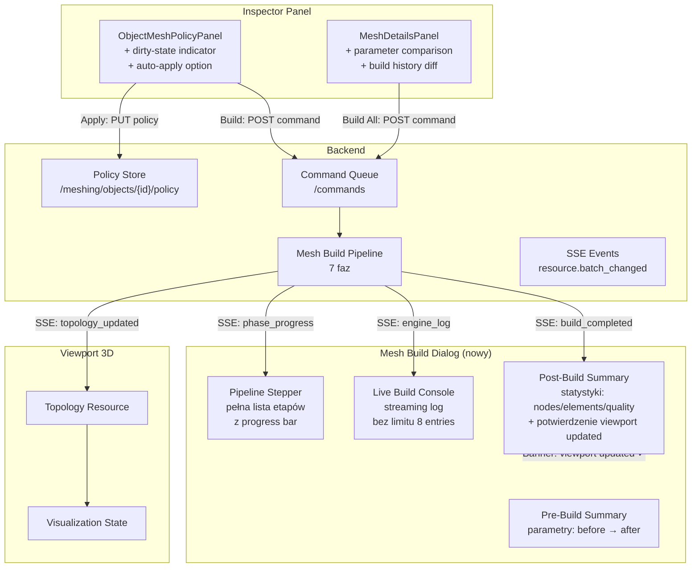
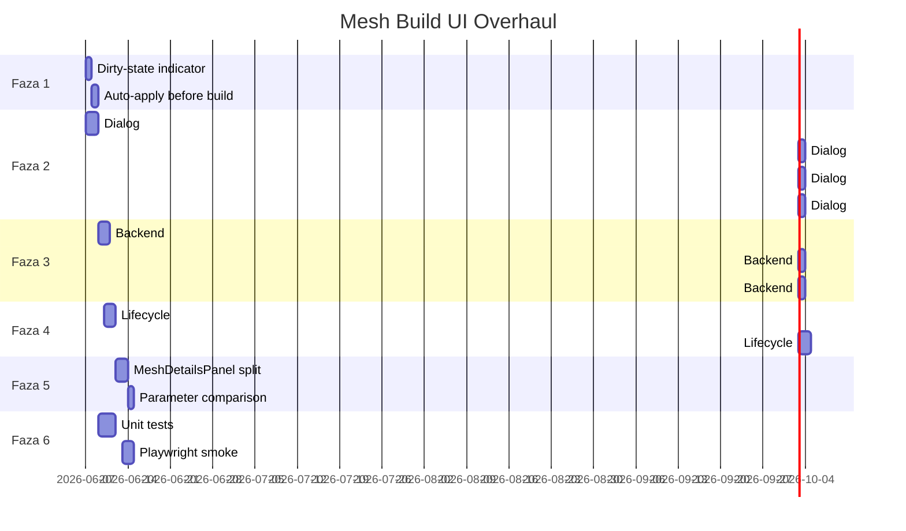

# Masterplan: Przebudowa Architektury Mesh Build UI

Data: 2026-06-06
Status: DRAFT — do akceptacji przed implementacją
Zależności:
- [mesh-build-ui-architecture-audit.md](file:///home/kkingstoun/.gemini/antigravity-ide/brain/86a01a5b-fcdc-4585-a919-a2fbbb8c1d01/mesh-build-ui-architecture-audit.md)
- [fem-meshing-production-readiness-plan-2026-05-30.md](file:///home/kkingstoun/git/fullmag/fullmag/docs/plans/active/fem-meshing-production-readiness-plan-2026-05-30.md)

Uzupełnienia:
- [Faza 2: MeshBuildDialog](file:///home/kkingstoun/git/fullmag/fullmag/docs/plans/active/mesh-build-ui-dialog-redesign-2026-06-06-pl.md)
- [Faza 4: Lifecycle End-to-End](file:///home/kkingstoun/git/fullmag/fullmag/docs/plans/active/mesh-build-ui-lifecycle-e2e-2026-06-06-pl.md)

---

## 1. Cel

Naprawić i rozbudować architekturę UI budowania meshu tak, aby:

1. Użytkownik **widział dokładnie co się zmienia** (parametry przed/po w formie tabelarycznej).
2. Okno budowy meshu było **kompletne**: pełny log, wszystkie etapy pipeline, statystyki meshu, potwierdzenie sukcesu.
3. Użytkownik **nie mógł przypadkowo zbudować mesh ze starymi parametrami** (dirty-state indicator + auto-apply).
4. Backend **potwierdzał** budowę meshu i aktualizację wizualizacji 3D.
5. Cały flow od **pustej symulacji** → tworzenie geometrii w UI → konfiguracja mesh policy → budowa meshu → uruchomienie solvera — działał spójnie i był w pełni widoczny w UI.

---

## 2. Docelowa architektura — diagram



---

## 3. Fazy implementacji — przegląd

| Faza | Nazwa | Priorytet | Pliki szczegółów |
|---|---|---|---|
| **1** | Dirty-state + auto-apply | 🔴 Krytyczny | ten plik §4 |
| **2** | MeshBuildDialog redesign | 🔴 Krytyczny | [mesh-build-ui-dialog-redesign](file:///home/kkingstoun/git/fullmag/fullmag/docs/plans/active/mesh-build-ui-dialog-redesign-2026-06-06-pl.md) |
| **3** | Backend enrichments | 🟡 Ważny | ten plik §5 |
| **4** | Lifecycle end-to-end | 🟡 Ważny | [mesh-build-ui-lifecycle-e2e](file:///home/kkingstoun/git/fullmag/fullmag/docs/plans/active/mesh-build-ui-lifecycle-e2e-2026-06-06-pl.md) |
| **5** | MeshDetailsPanel consolidation | 🟠 Poprawa | ten plik §6 |
| **6** | Testy i acceptance gates | 🟡 Ważny | ten plik §7 |

---

## 4. Faza 1: Dirty-State + Auto-Apply

### 4.1 Problem

`ObjectMeshPolicyPanel` pozwala edytować draft parametrów meshu, ale:
- Nie pokazuje czy draft różni się od zapisanej policy.
- Przycisk "Build Mesh" nie wymusza Apply — użytkownik może zbudować mesh ze starymi parametrami.
- Brak wizualnego feedbacku "masz niezapisane zmiany".

### 4.2 Rozwiązanie

#### 4.2.1 Dirty-state indicator

W `ObjectMeshPolicyPanelModel.ts` dodać funkcję:

```typescript
export function isObjectMeshPolicyDirty(
  draft: ObjectMeshPolicyDraft,
  baseDraft: ObjectMeshPolicyDraft,
): boolean {
  // Porównanie field-by-field z coercion (np. "" vs "0" to to samo)
  return !objectMeshPolicyDraftsEqual(draft, baseDraft);
}

function objectMeshPolicyDraftsEqual(
  a: ObjectMeshPolicyDraft,
  b: ObjectMeshPolicyDraft,
): boolean {
  // Porównanie istotnych pól: maximum_element_size, minimum_element_size, 
  // growth_rate, algorithm_2d, algorithm_3d, mesh_strategy, etc.
  // Ignoruje whitespace, trailing zeros w stringach numerycznych.
}
```

W `ObjectMeshPolicyPanel.tsx`:
- Dodać banner nad formularzem gdy `isDirty === true`:
  ```
  ┌──────────────────────────────────────────────────────────┐
  │ ⚠ Unapplied changes — Apply Policy before building      │
  │ or enable auto-apply.                                     │
  └──────────────────────────────────────────────────────────┘
  ```
- Kolor borderu sekcji zmienia się na `--fm-yellow` gdy dirty.
- Badge `Modified` obok tytułu sekcji.

#### 4.2.2 Auto-apply przed build

W `handleBuildMesh()` w `ObjectMeshPolicyPanel.tsx`:

```typescript
async function handleBuildMesh() {
  if (isDirty) {
    // Automatycznie apply policy przed buildem
    const applyResult = await handleApplyPolicy();
    if (!applyResult.success) {
      // Pokaż error — nie buduj
      return;
    }
  }
  // Teraz build
  await commands.execute("mesh.build-selected", commandContext);
}
```

#### 4.2.3 Pliki do zmiany

| Plik | Zmiana |
|---|---|
| [ObjectMeshPolicyPanelModel.ts](file:///home/kkingstoun/git/fullmag/fullmag/apps/control-room/src/modules/inspector/panels/ObjectMeshPolicyPanelModel.ts) | `isObjectMeshPolicyDirty()`, `objectMeshPolicyDraftsEqual()` |
| [ObjectMeshPolicyPanel.tsx](file:///home/kkingstoun/git/fullmag/fullmag/apps/control-room/src/modules/inspector/panels/ObjectMeshPolicyPanel.tsx) | Dirty banner, auto-apply w `handleBuildMesh()` |
| Nowy test: `ObjectMeshPolicyPanelModel.test.ts` → rozszerzyć o testy dirty-state |

---

## 5. Faza 3: Backend Enrichments

### 5.1 Problem

Backend nie publikuje wystarczających danych do UI:
1. Pipeline phases są niekompletne — brakuje pełnej listy oczekiwanych etapów.
2. Brak potwierdzenia "mesh dostarczony do viewport" — frontend inferuje to z invalidation.
3. Brak provenance: "mesh zbudowany z policy revision X, scene revision Y".

### 5.2 Rozwiązanie

#### 5.2.1 Kanoniczny pipeline z pełną listą faz

Backend powinien zawsze publikować kompletną listę faz w `mesh_pipeline_status`, nawet tych jeszcze nierozpoczętych:

```json
{
  "mesh_pipeline_status": [
    { "id": "queued",               "status": "completed", "duration_ms": 12 },
    { "id": "script_materialization","status": "completed", "duration_ms": 340 },
    { "id": "geometry_realization",  "status": "completed", "duration_ms": 150 },
    { "id": "size_field_planning",   "status": "active",    "progress_percent": 60 },
    { "id": "gmsh_meshing",          "status": "pending" },
    { "id": "quality_analysis",      "status": "pending" },
    { "id": "topology_delivery",     "status": "pending" }
  ]
}
```

> [!IMPORTANT]
> To jest zmiana kontraktu backend → frontend. Wymaga modyfikacji w Rust/Python mesh build pipeline.

#### 5.2.2 Build provenance w response

`MeshActiveBuildResource` powinien zawierać:

```json
{
  "active_build": { ... },
  "build_provenance": {
    "source_policy_revision": 7,
    "source_scene_revision": 12,
    "requested_at_unix_ms": 1717680000000,
    "completed_at_unix_ms": 1717680005000,
    "build_duration_ms": 5000
  }
}
```

#### 5.2.3 Topology delivery confirmation

Po zakończeniu budowy meshu, backend powinien emitować dodatkowy event SSE:

```json
{
  "type": "resource.batch_changed",
  "payload": {
    "changes": [
      {
        "resource": "mesh_build",
        "resource_id": "topology_delivered",
        "revision": 42,
        "recommended_fetch": "/v2/sessions/current/meshing/builds/latest-successful"
      }
    ]
  }
}
```

Frontend `RealtimeInvalidationBridge` już obsługuje ten pattern — `invalidateMeshBuildCompletionDependents()` invaliduje scene, manifest, visualization state, topology. Potrzebna jest jedynie pewność, że event `resource_id: "topology_delivered"` jest emitowany **po** zapisaniu topologii.

#### 5.2.4 Pliki do zmiany (backend)

| Plik | Zmiana |
|---|---|
| `crates/fullmag-api/src/router_v2/handlers/meshing/mesh.rs` | Build provenance, pełna lista faz |
| `packages/fullmag-py/src/fullmag/meshing/mesh_build_report.py` | `build_provenance` w raporcie |
| `packages/fullmag-py/src/fullmag/runtime/managed_meshing.py` | Emisja `topology_delivered` event |
| OpenAPI spec | Nowe pola w `MeshActiveBuildResource` |

---

## 6. Faza 5: MeshDetailsPanel Consolidation

### 6.1 Problem

`MeshDetailsPanel` (939 linii) jest bardzo kompletny, ale:
- Jest za duży — jeden monolityczny komponent.
- Nie ma widoku porównawczego "przed buildem vs po buildzie".
- Build history comparison istnieje, ale jest schowane i nie łączy się z MeshBuildDialog.

### 6.2 Rozwiązanie

1. **Ekstrakcja subkomponentów** — każda `*Section` (już wyodrębniona) zostaje w osobnym pliku:
   ```
   panels/mesh-details/
   ├── MeshOverviewSection.tsx
   ├── SolverMeshIdentitySection.tsx
   ├── MeshCountsExtentsSection.tsx
   ├── MeshBuildPipelineSection.tsx
   ├── MeshBuildHistorySection.tsx
   ├── MeshQualityGatesSection.tsx
   ├── MeshQualityStatisticsSection.tsx
   ├── RealizedSizeFieldsSection.tsx
   ├── OperationStatusesSection.tsx
   ├── ThinFilmDiagnosticsSection.tsx
   └── index.ts  (re-export)
   ```

2. **Shared data hook** — `useMeshDetailsModel()` zamyka 20 resource hooks w jeden model:
   ```typescript
   export function useMeshDetailsModel(selection: InspectorPanelProps["selection"]) {
     // ... all resource hooks
     return {
       buildHistoryEntries,
       buildStatus,
       edgeLength,
       gateRows,
       meshFreshness,
       meshIsStale,
       // ... etc
     };
   }
   ```

3. **Parameter comparison view** — nowa sekcja `MeshParameterComparisonSection`:
   - Pokazuje tabelę: parameter | current value | pending value | delta
   - Łączy się z `ObjectMeshPolicyDraft` dirty-state z Fazy 1.

### 6.3 Pliki do dodania

| Plik | Opis |
|---|---|
| `panels/mesh-details/MeshOverviewSection.tsx` | Wyekstrahowane z MeshDetailsPanel |
| `panels/mesh-details/useMeshDetailsModel.ts` | Shared model hook |
| `panels/mesh-details/MeshParameterComparisonSection.tsx` | Nowa sekcja porównawcza |

---

## 7. Faza 6: Testy i Acceptance Gates

### 7.1 Testy jednostkowe

```bash
# Dirty-state detection
vitest run apps/control-room/src/modules/inspector/panels/ObjectMeshPolicyPanelModel.test.ts

# Build pipeline normalization
vitest run apps/control-room/src/shared/domain/mesh/buildPipeline.test.ts

# Build history comparison
vitest run apps/control-room/src/shared/domain/mesh/meshBuildHistory.test.ts
```

### 7.2 Testy integracyjne

- **Dirty-state test**: zmień parametr w inspektorze → dirty banner widoczny → Apply → banner znika.
- **Auto-apply test**: zmień parametr → klik Build → policy automatycznie applied → build uruchomiony.
- **Build dialog test**: uruchom build → dialog otwiera się → pipeline stepper progresuje → po zakończeniu: statystyki + banner sukcesu.
- **Log streaming test**: uruchom build → dialog pokazuje log entries w real-time → brak limitu 8 entries.
- **Lifecycle test**: pusta sesja → dodaj Box → ustaw materiał → ustaw mesh policy → build mesh → potwierdzenie → uruchom relax → solver działa.

### 7.3 Playwright smoke checks

```typescript
test("mesh build dialog shows completion summary", async ({ page }) => {
  // 1. Otwórz sesję z preloaded geometry
  // 2. Klik "Build Shared-Domain Mesh" w ribbon
  // 3. Assert: dialog widoczny
  // 4. Wait: pipeline fazy → "completed"
  // 5. Assert: statystyki (nodes > 0, elements > 0)
  // 6. Assert: banner "Mesh built successfully"
  // 7. Assert: viewport topology refreshed
});
```

### 7.4 Acceptance gates

| Gate | Kryterium |
|---|---|
| G1 | Dirty-state banner pojawia się po zmianie dowolnego parametru |
| G2 | Auto-apply działa: Build po zmianie parametru → policy zaktualizowana |
| G3 | Dialog pokazuje ≥5 pipeline faz (nie tylko fazy opublikowane przez backend) |
| G4 | Dialog pokazuje ≥20 log entries (nie limit 8) |
| G5 | Po zakończeniu budowy: dialog pokazuje nodes + elements + quality |
| G6 | Po zakończeniu budowy: banner "Mesh built — viewport updated" |
| G7 | MeshDetailsPanel zawiera parametr comparison (current vs pending) |
| G8 | Pełny lifecycle pusta sesja → solve działa bez błędów |

---

## 8. Kolejność implementacji



---

## 9. Open Questions

> [!IMPORTANT]
> **Q1**: Czy chcesz auto-apply jako domyślne zachowanie (Build zawsze automatycznie aplikuje policy), czy jako opcję (checkbox "Auto-apply before build")?

> [!IMPORTANT]
> **Q2**: Czy backend enrichments (Faza 3) — w szczególności pełna lista faz pipeline — powinny być zaimplementowane w tym samym sprint co frontend, czy mogą poczekać? Frontend może fallback'ować na "unknown phases" do czasu wdrożenia backendu.

> [!IMPORTANT]
> **Q3**: Czy MeshBuildDialog powinien być overlay (jak teraz — Dialog), czy sidebar/panel (jak Inspector)? Dialog ma tę wadę, że blokuje dostęp do reszty UI. Panel mógłby działać jako live monitor w footer area.

> [!WARNING]
> **Q4**: Ekstrakcja `MeshDetailsPanel` do podkatalogów (Faza 5) to refactor ~939 linii. Czy to priorytet, czy może poczekać na kolejny sprint? Funkcjonalnie panel działa poprawnie, jest tylko zbyt duży.
