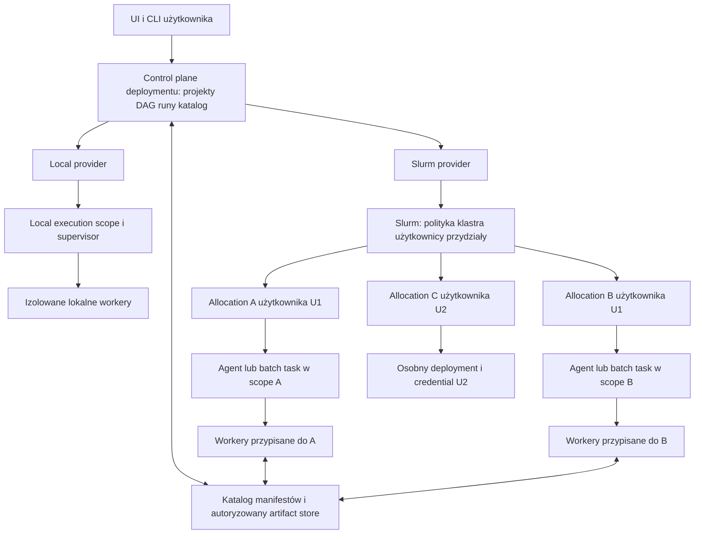
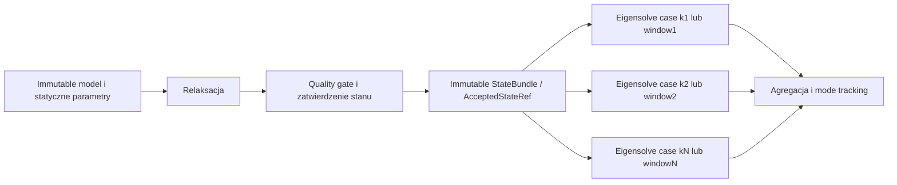

# Fullmag na workstation i HPC — korekta architektury, Slurm i współdzielony stan eigensolve

Data: 05.10.2026. Status: **audyt źródłowy i propozycja R2; implementacja oraz kwalifikacja pozostają otwarte**.
Rozwinięcie i korekta [audytu kart projektów](multi-project-tabs-20261005.md). Użytkownik wskazał **Slurm jako pierwszy adapter HPC**.
Odczyt rozpoczęto na `master`, HEAD `25a449c44dda53684b63c5281c6bc59c6b49ab87`, z lokalnymi zmianami oraz konfliktami integracji w frontendzie i wygenerowanym OpenAPI. Nie rozwiązywano tych konfliktów i nie traktowano tych plików jako dowodu poprawnego kontraktu runtime. Ten etap zmienia wyłącznie dokumentację audytu.

## 1. Werdykt po ponownej analizie

Poprzedni kierunek — wspólny control plane i izolowane wykonanie — pozostaje właściwy, ale **globalny owner/ledger na fizyczny host nie jest poprawną granicą produktu HPC**. Granicą jest autoryzowany deployment, a dla wykonania klastrowego konkretny przydział zasobów od Slurma. Różni użytkownicy i kilka zadań jednego użytkownika mogą współistnieć na tym samym węźle.

Rekomenduję modułowy control plane Fullmaga oraz providerów wykonania, z zachowaniem uruchomienia przez zewnętrzny dispatcher:

1. **Local provider:** lokalna usługa użytkownika i izolowane procesy workerów; dobre domyślne zachowanie desktopu.
2. **External allocation execution:** zewnętrzny dispatcher, np. Microlab lub skrypt batch, uruchamia `fullmag task.py --headless` we własnej alokacji. Fullmag nie wymaga wtedy swojego stale działającego koordynatora ani własnego submitu do klastra.
3. **Slurm batch/array provider:** pierwszy zintegrowany adapter HPC dla kampanii sterowanych z Fullmaga; przyjęte przypadki są wykonywane jako zwykłe zadania/tablice zadań Slurma. UI może się odłączyć.
4. **Slurm allocation-pool provider:** następny zakres dla dużej liczby krótkich/podobnych przypadków; jedna przyznana alokacja, agent i pula workerów. Agent rozdziela wyłącznie zasoby alokacji.

Te tryby używają tego samego Study DAG, RunSpec, CaseId/TaskId/AttemptId, typed artifact refs, provenance i danych wynikowych. API, autorstwo dokumentu i planowanie zależności nie muszą być oddzielnymi mikroserwisami. Proces solvera pozostaje izolowany; odrębny fizyczny „orchestrator node” nie jest obowiązkowym elementem instalacji.

To rozwija istniejący [HPC Cluster Execution v1](../../specs/hpc-cluster-execution-v1.md), który już przyjmuje external-dispatch-first i Slurm jako pierwszy scheduler. Optional orchestration jest rozszerzeniem produktu, nie warunkiem podstawowego headless HPC. Starsze sformułowanie „one session” należy pogodzić w H0 z wieloma dokumentami, zachowując jeden model semantyczny, a nie jeden singleton procesu.

**Dla przykładu użytkownika właściwy przepływ to:** jedna relaksacja → zatwierdzony niezmienny stan równowagi → wiele niezależnych eigensolve cases czytających ten sam stan → agregacja i śledzenie modów. Nie kopiujemy żywego obiektu solvera ani jego wskaźników GPU między procesami.

### 1.1 Co zmienia się względem poprzedniej rekomendacji

| Wcześniejsze uproszczenie | Obowiązujące rozstrzygnięcie R2 |
|---|---|
| Jeden owner na host | Jeden owner danego execution scope; wiele scope'ów na węźle |
| Jeden wspólny ledger fizycznego hosta | Local: ledger uprawnionej lokalnej domeny. HPC: Slurm przyznaje envelope, Fullmag subalokuje go |
| Jeden application store | Jeden autorytatywny katalog deploymentu/tenant scope; nie baza wszystkich użytkowników węzła |
| Multi-node dopiero później | Provider/identity/artifact contracts od początku; adapter Slurma jest pierwszą implementacją HPC |
| UUID namespace rozwiązuje izolację | UUID zapobiega kolizjom; authorization, ACL i resource enforcement są odrębnymi obowiązkami |
| Wiele procesów to distributed solver | Independent cases i pojedynczy MPI/distributed solve mają osobne kontrakty i kwalifikację |
| Stan relaksacji można po prostu podać wszystkim | Potrzebne immutable manifest, quality/compatibility gate, transport, pins i task-local mutable kopie |

## 2. Granice odpowiedzialności

| Warstwa | Odpowiada za | Nie uzyskuje przez to prawa do |
|---|---|---|
| Slurm / administrator klastra | Account/QoS/partition, kolejkę globalną, allocation, OS enforcement i czas życia jobów | Definiowania fizyki Fullmaga |
| Control plane Fullmaga | Dokumenty, study dependencies, immutable submit, przypadki, retry policy i katalog naukowy | Rezerwowania obcych CPU/GPU poza provider allocation |
| Execution provider | Tłumaczenie żądań, submit/query/cancel/reconcile, staging i provider receipts | Drugiego niezależnego źródła prawdy o study |
| Allocation agent | Lokalny supervisor, podział envelope i heartbeat przypisanych workerów | Discovery całego hosta jako dostępnej puli |
| Worker/attempt | Weryfikację wejścia, solver, output publication i execution receipt | Modyfikacji immutable wejścia lub publikacji w cudzym runie |
| UI / karty | Widok projektu i statusów | Własności jobów, klastra albo stateful native Context |

Fullmag planuje **gotowość i semantykę** zadań. Slurm planuje **prawo do fizycznych zasobów i czas startu**. Scheduler DAG nie znika, ale nie konkuruje z globalnym schedulerem klastra. Preparation, staging, solve i postprocessing też zużywają przydział; nie są darmową pracą wykonywaną poza nim.

### 2.1 Trzy konkretne przypadki współistnienia

**Dwaj użytkownicy na tym samym węźle.** Każdy ma swój principal, deployment/store, credentials i przyznane zasoby. U1 nie może odczytywać projektów U2, przyłączać jego workerów, zwalniać jego lease, anulować joba ani sprzątać jego tmp. Hostname i loopback nie określają użytkownika.

**Trzy osobne joby tego samego użytkownika.** Mogą należeć do jednego deploymentu i kampanii, ale mają różne provider allocation identities, attempts, scratch, logs i output reservations. Katalog kampanii łączy ich wyniki; nie scala mutable runtime'ów. Jeśli są to trzy niezależne uruchomienia Fullmaga, dostają odrębne deployment/execution scopes i mogą później importować autoryzowane immutable wyniki.

**Trzy workery wewnątrz jednej alokacji.** Alokacja ma jednego suballocatora, albo zasoby kroków przydziela Slurm przez job steps. Workery nie tworzą trzech ofert pełnej RAM/CPU/GPU tej samej alokacji. Przy niejednoznacznym discovery kolejny spawn jest odrzucony.

### 2.2 Co potwierdza aktualny kod

| Obszar / źródło i symbol | Stan źródłowy | Wniosek |
|---|---|---|
| `crates/fullmag-session/src/runtime_service.rs:100`, `RuntimeServiceOwner` | Jeden `runtime-services/OWNER.lock` per SessionStore; descriptor ma hostname/PID/process token/target | Już teraz nie jest to host-global lock. Dwa store'y mogą równolegle rezerwować tę samą pojemność; dwa targety w jednym store nadal dzielą jeden owner lock |
| `crates/fullmag-runtime-control/src/local_resources.rs:10`, `application_service_config` | `native-local`, compute/preparation CPU offers, GPU budget 0; RAM z `/proc/meminfo` | Lokalna inicjalizacja nie opisuje resource envelope joba Slurm; nie promować jej na HPC allocation discovery |
| `crates/fullmag-api/src/resource_pool_main.rs:118`, local discovery | Możliwe UUID/VRAM przez nvidia-smi i lokalne budżety | Wykryty GPU i wolna pamięć nie dowodzą prawa użycia przez konkretny job |
| `crates/fullmag-api/src/runtime_service_main.rs:240`, publisher; `accepted_scheduler_main.rs:359` | Usługa publikuje zapisane oferty, scheduler obserwuje generację puli | `--discover-resources` nie oznacza odkrycia uprawnionych zasobów Slurma |
| `crates/fullmag-api/src/accepted_study_supervisor.rs:704`, worker device binding | Dziecko ma GPU mask/UUID i ordinal 0 | Zachować, ale poprzedzić walidacją pochodzenia lease z allocation; maska nie może rozszerzać grant Slurma |
| `crates/fullmag-runtime-control/src/accepted_store.rs:4`, `store_binding`; `:49`, `scoped_submit_store_root` | Hash lokalnej ścieżki i optional UUID namespace | Przydatne scoping/attach, bez principal/allocation authority i bez roli security credential |
| `crates/fullmag-session/src/types.rs:2301`, `FmsResourceLease` | Run/task/attempt/ownership epoch/token w store-local modelu | Dodać binding authority/scope/node incarnation bez utraty istniejącego fencing |
| `crates/fullmag-ir/src/compute_resources.rs:44`, `ComputeTargetIR` | Requested Local/Node/Pool, nie przyznane zasoby | Requested target i resolved provider allocation pozostają odrębnymi typami/provenance |
| `crates/fullmag-session/src/writer.rs:331`, `require_local_filesystem` | Wymagana kwalifikowana lokalna trasa lock/durability | Shared FS transport wymaga nowego adaptera/dowodów, nie wyłączenia guarda |
| `crates/fullmag-api/src/main.rs:2589`, listener construction | Domyślne 8081 oraz bind `0.0.0.0`; prywatny service control jest innym kanałem loopback | Przed multi-user node potrzebna jawna endpoint/auth boundary i discovery bez kolizji portów; kod nie dowodzi ograniczeń zapory hosta |
| `crates/fullmag-cli/src/control_room.rs`, `runtime_state_root` | Unix wybiera XDG/HOME, a przy ich braku pozostaje fallback `temp_dir()/fullmag` | HPC wymaga jawnego private root. Nie twierdzić, że zwykły Unix zawsze ignoruje HOME; problem dotyczy fallbacku i braku allocation scope |
| `docs/plans/active/compute-execution-20261004/README.md`, E2/E6; `implementation-checkpoint.md` | Host ledger/provider transfers pozostają etapami planu | Nie uznawać opisanej architektury za zaimplementowany Slurm provider |

Przegląd wykonawczych modułów API/runtime-control/session/CLI nie znalazł adaptera `sbatch/srun/SLURM_*` ani provider job reconciliation. Nie jest to stwierdzenie o zewnętrznych skryptach ośrodka; audyt dotyczy produktowej ścieżki Fullmaga. W przejrzanym routerze nie potwierdzono modelu request principal/RBAC; same instance UUID/store binding nie dają dowodu multi-user auth. H0 obejmuje pełne inventory wejść zamiast zakładania zabezpieczenia przez listener/port.

## 3. Tożsamość, uprawnienia i nazwy

Poniższe nazwy nowych pól są propozycją kontraktu, wymagającą ADR/schema, a nie opisem gotowych typów:

| Tożsamość | Znaczenie |
|---|---|
| `AuthorityId` / `ClusterId` | Zweryfikowana domena providera; job ID jest lokalny dla klastra |
| `PrincipalId` | Tożsamość wyprowadzona z uwierzytelnienia/OS/site mapping, nie z dowolnego parametru UI |
| `DeploymentId` | Katalog projektów i control plane danego użytkownika lub jawnie skonfigurowanego zespołu |
| `ExecutionScopeId` | Zakres jednego lokalnego wykonawcy lub provider allocation |
| `ProviderAllocationRef` | Cluster, job/array element, submit/start/incarnation i restart generation; job ID może być ponownie użyty |
| `StepId` / `WorkerId` + boot token | Konkretna instancja wykonawcza wewnątrz scope |
| `ProjectId`, `RunId`, `CaseId`, `TaskId`, `AttemptId`, ownership epoch | Dotychczasowa semantyka dokumentu, kampanii i wykonania; nie zastępuje principal/scope |
| `ArtifactRef` | Hash/codec/shape/semantics plus autoryzowane pochodzenie; sam hash nie daje prawa odczytu |

Namespace operacyjny wyprowadza się z zatwierdzonego rootu użytkownika/deploymentu i scope/attempt. Przykładowa **struktura logiczna**, bez nowych hardcoded rootów: `deployment / scope / run / task / attempt / {scratch,logs,staging}`. Nie używać samego PID, nazwy projektu, użytkownika tekstowego ani sekundowego timestampu do izolacji. Wspólna instalacja binariów może być readonly; mutowalne pliki są poza współdzielonym repo/install tree.

- Local socket/discovery musi sprawdzać właściciela i uprawnienia. Na Unix preferowany kanał lokalny z weryfikacją peer credentials; odpowiednik Windows wymaga właściwych ACL. TCP loopback nie chroni przed innymi kontami na tym samym hoście.
- Endpoint HTTP/WS i worker attach wymagają uwierzytelnienia i autoryzacji scope. Worker dostaje krótkotrwały, ograniczony credential do swojego attemptu i do wskazanych input/output refs; bez tokenu administratora/coordinatora w bundle.
- Na HPC połączenie użytkownika przechodzi przez zatwierdzony adapter/tunel/site gateway. Remote worker kanał wymaga uwierzytelnionego transportu i rotacji/revocation; otwarte porty węzłów nie są założeniem wdrożenia.
- Credential i ACL są niezależne od `x-fullmag-session-scope`, UUID store binding oraz `SLURM_JOB_ID`. Zmienne procesu są źródłem kontekstu, nie samodzielnym dowodem autoryzacji zdalnego klienta.
- Same-UID namespaces izolują przypadkowe kolizje. Nie stanowią bariery bezpieczeństwa wobec złośliwego procesu tego samego konta, który zgodnie z OS może czytać pliki lub sygnalizować procesy. Silniejsza granica wymaga wsparcia administratora/OS/container policy; Fullmag nie deklaruje jej przez losową nazwę katalogu.
- Cleanup, Cancel, attach i lease release wymagają dokładnej tożsamości scope/attempt i dowodu ownership; nigdy operacji „wszystkie procesy fullmag na tym węźle”.

Pierwszy produkt HPC może być **single-principal per deployment**, z wieloma jobami. Centralny wieloużytkownikowy serwer Fullmaga to osobny tryb wdrożenia z RBAC, audit log, delegacją tożsamości i quotas. Nie jest wymagany, aby dwóch użytkowników bezpiecznie uruchomiło własne instancje na tym samym węźle.

## 4. Efektywny przydział sprzętu

Resource envelope jest przecięciem: przydział providera ∩ ograniczenia OS/cgroup/affinity/device visibility ∩ polityka operatora ∩ żądanie taska. Hardware telemetry jest diagnostyką; nie może powiększyć envelope.

Agent publikuje: dozwolone CPUs/NUMA i limity czasu CPU, RAM/swap policy, GPU UUID/MIG identity i widoczny ordinal, scratch quota, walltime/deadline oraz enforcement level. Rezerwuje również koszty agenta, serializacji/decode i staging. Pamięć na węźle nie jest pamięcią przyznaną jobowi; quota cgroup i CPU affinity mogą być węższe od wykrytego sprzętu.

Slurm pozwala konfigurować egzekwowanie CPU, RAM i urządzeń przez cgroups; skuteczność zależy od konfiguracji ośrodka. Capability negotiation musi odróżniać rzeczywiste enforcement od deklaracji budżetu. [Slurm cgroup.conf](https://slurm.schedmd.com/cgroup.conf.html).

GPU należy rozwiązać **wewnątrz rzeczywistego job step**. Slurm ustawia `CUDA_VISIBLE_DEVICES`, a ordinal widoczny w jobie może różnić się od numeracji hosta. Receipt zachowuje provider allocation, UUID/MIG, lokalny ordinal i wykonany backend/precision. Nie zdejmować maski odziedziczonej od Slurma. [Slurm GRES](https://slurm.schedmd.com/gres.html).

W allocation-pool trybie każdy step otrzymuje jawne zasoby. Semantyka `srun --exact` ogranicza step do żądanej części alokacji; `--exclusive` zależy od tego, czy tworzymy nowy job, czy step istniejącego joba. Adapter musi kwalifikować konkretne argumenty/site version, a nie składać uniwersalną komendę z intuicji. `--overlap` nie jest domyślnym sposobem przyspieszenia. [Slurm srun](https://slurm.schedmd.com/srun.html).

Wymuszony GPU nadal nie przechodzi na CPU. Migracja do większego zgodnego GPU po OOM wymaga nowego zaakceptowanego przydziału w granicach intentu; nie zmienia precision, siatki, liczby modów ani fizyki. Wyłączność GPU w lokalnym Fullmagu dotyczy kontrolowanej domeny; nie jest obietnicą wyłączności nad arbitralnymi obcymi procesami OS.

## 5. Orchestrator i worker nodes — tak, z dwoma trybami

### 5.1 Pierwszy zakres: Slurm batch / job arrays

Zachować także samodzielne wykonanie wewnątrz już otrzymanej alokacji. Node-local headless nie startuje browsera, nie zajmuje domyślnego publicznego portu dla każdego case i nie wymaga dostępności workstation API. Używa istniejącej application/runtime-control granicy immutable acceptance i własnego execution scope; transport bundle/receipt nie tworzy drugiego solver entrypointu omijającego planner lub provenance.

Control plane przygotowuje immutable campaign/case manifest i execution bundles, zapisuje intent, a provider zleca joby Slurmowi. Workery nie wymagają stale uruchomionego serwera Fullmaga na każdym compute node. Klastry bez połączeń przychodzących do węzłów mogą używać staged bundles i per-attempt output receipts.

Przypadki o tych samych wymaganiach początkowych tworzą array; różne memory/GPU/walltime classes dostają osobne arrays/jobs. Każdy `CaseId` ma trwałe mapowanie na array element, a nie na kolejność startu lub ukończenia. Limit jednoczesnych elementów jest jawną polityką użytkownika/providera. Slurm wspiera array concurrency cap i nie gwarantuje kolejności job IDs względem indeksów. [Slurm job arrays](https://slurm.schedmd.com/job_array.html).

Dla ustalonego DAG można wyrazić coarse dependencies w Slurm. Exit zero producenta musi oznaczać także zakończoną publikację wymaganego manifestu, inaczej `afterok` byłoby zbyt słabą bramką. Konsument zawsze sam weryfikuje hash, kontrakt i quality. Slurm dependencies są optymalizacją uruchomienia; nie zastępują walidacji naukowych dependency refs Fullmaga.

Po błędzie części array agregator uruchamia się jako finalizer zgodnie z polityką zależności i rejestruje także braki/failed/canceled cases. Nie oznacza niepełnego sweepu jako pełnego sukcesu. `afterany` pozwala zareagować na zakończenie z błędami, podczas gdy `afterok` wymaga sukcesu odpowiednich poprzedników. [Slurm dependencies](https://slurm.schedmd.com/job_array.html#job-dependencies).

**Zalety teraz:** wykorzystanie accounting, QoS, limits, requeue i logów ośrodka; niewielka liczba nowych long-lived usług; naturalna izolacja jobów. **Koszt:** scheduler latency i ponowne załadowanie stanu; duża liczba bardzo krótkich cases wymaga grupowania.

### 5.2 Następny zakres: allocation pool / pilot

Provider prosi Slurma o jedną ograniczoną alokację. W niej działa lekki koordynator/agent i worker pool rozłożony na przyznanych węzłach. Zadania mogą być przypisywane dynamicznie, a immutable cache stanu/siatki ma affinity do workerów/węzłów. To sensowny wariant dla adaptacyjnych lub krótkich eigensolve cases, ale tylko po pomiarze kosztów batch mode.

Koordynator jest **rolą procesu**, nie obowiązkowym osobnym węzłem. Potrzebuje zadeklarowanej części CPU/RAM i połączeń do workerów zgodnych z polityką klastra. Rezerwowanie całego node tylko dla lekkiego control plane wymaga uzasadnienia. Zakończenie walltime kończy allocation scope; musi mieć bezpieczny drain/checkpoint/publication plan. Nie obiecujemy, że agent przeżyje zakończenie joba Slurma.

W tym trybie Fullmag ma jednego ownera subalokacji wewnątrz przyznanego envelope. Rozdziela zadania i rozlicza zasoby, a Slurm nadal kontroluje zewnętrzną alokację i egzekwuje jej ograniczenia. Nie tworzyć niezależnych host-global daemonów ani wdrożenia Kubernetes tylko po to, żeby uruchomić ten sweep.

### 5.3 Wybór trybu na podstawie kosztu

Mierzyć osobno: queue latency, start/runtime load, input staging, assembly/preconditioner build, solve, publikację outputu i idle allocation time. Dla N przypadków porównać **czas do wyniku i łączny koszt core/GPU-hours**, a nie sam czas solvera.

Grupowanie kilku cases w jednym workerze może amortyzować ładowanie stanu. Każdy case nadal ma oddzielny claim/receipt, a reuse native Context wymaga dowodu resetu i compatibility. Worker pool nie oznacza współdzielenia mutable Context między jednoczesnymi taskami. Unikać ani jednego joba na kilkumilisekundową operację, ani jednego ogromnego joba blokującego tysiące rdzeni podczas małego etapu relaksacji.

**Domyślnie:** job arrays dla dłuższych niezależnych cases; bounded chunking dla małych podobnych cases; allocation pool dopiero po wykazaniu korzyści i po lifecycle/security proof. Użytkownik widzi jedną kampanię i jej zasoby, bez konieczności rozumienia worker daemonów.

### 5.4 Odniesienie do komercyjnych solverów

COMSOL rozdziela Parametric Sweep, Distributed Parametric Sweep, Batch Sweep i Cluster Sweep. Batch/Cluster uruchamiają niezależne procesy, a wyniki mogą być synchronizowane z modelem. Jest to użyteczny wzorzec rozdzielenia niezależnych przypadków, wspólnego wyniku i pojedynczego distributed solve. Nie jest dowodem gotowości Fullmaga ani argumentem za kopiowaniem konkretnej implementacji. [COMSOL — rodzaje sweepów](https://www.comsol.com/support/knowledgebase/1250), [COMSOL — Cluster Sweep](https://doc.comsol.com/6.4/doc/com.comsol.help.comsol/comsol_ref_solver.36.043.html).

Profesjonalność wdrożenia wynika z reproducibility, poprawnej izolacji, recovery, diagnostyki i kwalifikacji, a nie z liczby usług lub nazwania procesu orchestrator.

## 6. Sweep eigensolve ze wspólnego stanu

**Audyt źródłowy:** fundamenty już istnieją, ale portable fan-out nie jest gotowy.

| Źródło i symbol | Co można wykorzystać / czego nie dowodzi |
|---|---|
| `crates/fullmag-application/src/run_spec.rs:262`, `RunDependency`; `:314`, `RunSpecification` | Exact project/study hash, typed pinned artifact i StepOutput z case ID; sam typ/in-memory ledger nie jest trwałym schedulerem |
| `crates/fullmag-authoring/src/study_contract.rs:74`, `StudyInputSource`; `:324`, `StudyPlan::validate` | Jawne dependencies, kontrola port/data kind i topological order; brak zależności od ruchomego latest/current |
| `crates/fullmag-plan/src/study_catalog.rs:78`, `StudyProblemCatalogEntry` | Immutable ProblemIR per step; case expansion wymaga rozwinięcia istniejącego E5, nie wynika z samej listy kroków |
| `crates/fullmag-quantities/src/accepted_state.rs:100`, `AcceptedStateId`; `:168`, `AcceptedStateRef` | Tożsamość i digests/generacje. Payload jest osobnym artifact/CAS ref, nie zawartością tego ID |
| `crates/fullmag-application/src/study_artifact.rs:105`, `decode_study_artifact`; `:233`, `decode_magnetization_state` | Digest/units/layout validation. Obecna FEM reprezentacja tego kodeka to H1 P1 nodal samples, a nie uniwersalny checkpoint dowolnego FE order |
| `crates/fullmag-runner/src/fem/equilibrium_identity.rs:86`, `EquilibriumIdentitySignaturesV1::from_relax_plan`; `:113`, `from_eigen_plan`; `:168`, modal identity | Istnieje rozdzielenie static equilibrium i modal/operator fingerprint; rozszerzyć tę semantykę, nie tworzyć równoległego porównywania stanu po samej tablicy m |
| `crates/fullmag-runner/src/fem/equilibrium_identity.rs:202`, `validate_supported_relax_source`; `:221`, `validate_supported_material` | Obecna identity scope odmawia m.in. anisotropy/DMI i części danych regionalnych; nie wolno promować tego handoffu jako uniwersalnego reuse każdego modelu |
| `crates/fullmag-runner/src/fem/eigen_equilibrium_contract.rs:92`, `AcceptedFemRelaxStageHandoff`; `:365`, single-k guard | Handoff wymaga accepted/converged certificate i exact mesh/topology/indexing/m-content; target Path jest na tej granicy odrzucany |
| `crates/fullmag-runner/src/eigen/orchestrator.rs:35`, `run_path_or_single`; `:52` | Iteracja po próbkach jest obecnie sekwencyjna; sama konfiguracja ścieżki k nie daje distributed case dispatch |
| `crates/fullmag-runner/src/fem/eigen_path.rs:231`, cached handoff; `crates/fullmag-runner/src/eigen/tracking.rs:46`, branch tracking | Reuse w pamięci procesu i uporządkowane sąsiednie wektory; potrzebny serialized handoff oraz osobny ordered fan-in |
| `crates/fullmag-runner/src/fem/eigen_path_manifest.rs:689–706`, lane reporting | Rozróżnia ograniczone GPU K0 od gated nonzero-k/Floquet/demag-k i szerokiego GPU modal solve; CPU gamma-equivalent path nie dowodzi nonzero-k dyspersji. First proof musi użyć faktycznie wspieranej/kwalifikowanej lane |
| `crates/fullmag-quantities/src/solution_set.rs:91`, `SolutionMember`; `:137`, `SolutionSet`; `crates/fullmag-session/src/solution_set_catalog.rs:774`, `validate_successor` | Istnieją case/attempt identities, assessment, coverage i monotoniczne rewizje; zdalny retry/pinning/aggregate success policy wymagają proof |

Pierwszą ograniczoną reprezentacją fan-outu może być N jawnych eigen steps odwołujących się do jednego relax output; nie traktować tego jako ukończonego batch/case compiler. Docelowy E5/H4 generuje immutable case map, zachowuje stabilne CaseId i unika nieograniczonego rozwijania ogromnej kampanii w pamięci.

### 6.1 Co rzeczywiście można współdzielić

Wspólne wejście to content-addressed, zamknięty zestaw danych: m0 i jego reprezentacja, geometria/siatka/DOF ordering, materiały i statyczne oddziaływania/warunki brzegowe, units, constraint definitions, dependency refs, quality oraz producer provenance. „StateBundle” jest nazwą projektową logicznego zestawu istniejących typed refs, nie automatycznie nowym konkurencyjnym formatem checkpointu.

Stan przyjęty przez runtime i stan potwierdzony jako równowaga są różnymi faktami. Receipt success/hash/accepted step nie dowodzi zbieżności relaksacji. Quality gate dla eigensolve wiąże statyczny operator, kryterium torque/residual/constraints i rzeczywisty stop reason. `max_steps` bez spełnienia wymaganego kryterium daje niezakwalifikowane wejście, nie cichy PASS. Ekspercki wyjątek może istnieć wyłącznie jawnie w workflow/provenance.

W bieżącym kodzie certyfikowany handoff ma ograniczony identity scope exchange/demag/Zeeman; walidatory odmawiają m.in. anisotropy i DMI. Jest to ograniczenie **tego kontraktu przekazania równowagi**, a nie ogólne stwierdzenie o wszystkich możliwościach solvera. Dla szerszych modeli H4 musi rozszerzyć preimages, materializację i dowody odpowiednich interakcji; usunięcie guarda albo dopisanie parametru do etykiety provenance nie wystarcza.

Każdy worker otrzymuje ten sam immutable state ref, ale własne mutable bufory, linearized operator context, solver workspace i output. Native pointer, PETSc object, CUDA allocation, communicator ani pamięć procesu nie są przenośnym stanem. Checkpoint służący do dokładnego restartu ma ostrzejszą zgodność niż fizyczny input do nowego eigensolve.

Portable handoff wymaga rozdzielenia immutable identity siatki/przestrzeni od nowej worker-local runtime generation. Dzisiejszy guard sprawdza exact mesh generation/topology/indexing; nie należy go wyłączyć, gdy świeży worker utworzy własny runtime. Wersjonowany adapter musi udowodnić mapowanie do dokładnie tego samego przygotowanego domain/DOF/material layout albo wykonać jawny transfer. Sam zgodny rozmiar tablic nie jest tym dowodem.

### 6.2 Kiedy jedna relaksacja wystarcza

| Zmiana w case | Reguła reuse |
|---|---|
| Inny k przy niezmienionym statycznym problemie i dopuszczonej linearizacji | Możliwe wspólne m0; dynamiczny operator/Bloch/demag jest właściwy dla danego k |
| Inne okno/target shift/liczba szukanych modów tego samego operatora | Możliwe wspólne m0; wykonanie/coverage i duplikaty modów wymagają kontroli |
| Inny parametr, który wpływa na statyczny operator/równowagę | Nowa relaksacja albo ponowna jawna certyfikacja właściwej równowagi; brak ślepego reuse |
| Inna geometria, mesh, discretization lub representation | Jawny istniejący transfer z walidacją; nie reinterpretacja tych samych bajtów |
| Continuation/histereza | Sekwencyjne zależności wewnątrz gałęzi; równolegle tylko niezależne gałęzie |
| Ten sam fizyczny stan, inny CPU/GPU backend | Tylko przez obsługiwany codec/transfer i compatibility gate; brak obietnicy binary checkpoint parity |

Potrzebne są dwa różne fingerprinty, z reuse istniejących `EquilibriumIdentitySignaturesV1` i modal signatures: **equilibrium dependency fingerprint** dla statycznych danych wymaganych do reuse oraz **case execution fingerprint** obejmujący pełny immutable problem, k/window/solver policy, backend, precision i runtime. Sam pełny Project hash byłby zbyt restrykcyjny dla dozwolonych wariantów; sam hash tablicy m0 byłby zbyt słaby dla zgodności fizycznej. Dozwolone zależności wyznacza typowany planner, nie heurystyka nazwy parametru w UI.

Istniejące noty pozostają właścicielami nauki: [FEM eigenmodes](../../physics/0600-fem-eigenmodes.md), [linearized LLG](../../physics/0700-frequency-domain-linearized-llg.md), [Floquet demag](../../physics/0828-fem-frequency-domain-floquet-demag.md), [state transfer](../../physics/0532-fem-fdm-magnetization-state-transfer.md). Orkiestracja nie otwiera niezakwalifikowanych nonzero-k lub GPU capabilities.

### 6.3 Artefakty i locality

1. Producer publikuje dane i kompletny immutable manifest; dopiero potem konsumenci stają się ready.
2. Manifest/pins obejmują wszystkie wymagane dependencies. Garbage collection uwzględnia queued cases, aktywne attempts, retry i historyczne wyniki; zamknięcie karty nie unpinuje wejścia kampanii.
3. Najpierw zweryfikowane shared storage lub transfer do node-local cache. Cache jest per trust domain i content hash, publikowany atomowo przez kontrolowanego ownera; readers są readonly.
4. Można staged state dostarczyć raz na węzeł/pulę, a nie pobierać od nowa do każdego taska. Slurm ma `sbcast` do dystrybucji plików na węzły **przydzielone jobowi**; jest opcjonalnym narzędziem staging, nie globalnym cache managerem. [Slurm sbcast](https://slurm.schedmd.com/sbcast.html).
5. Każdy worker sprawdza rozmiar/hash/codec i compatibility, następnie tworzy własne mutable state. Jedna kopia pliku na dysku nie oznacza jednej kopii native/GPU pamięci; admission musi policzyć rezydentne kopie wszystkich workerów.
6. Duże read-only tablice mogą korzystać z mmap/page cache po dowodzie kompatybilności. Wspólna pamięć procesów/GPU IPC nie jest wymaganiem pierwszego zakresu.
7. Mesh/static coefficients można cache'ować po pełnym odpowiednim kluczu. Faktoryzacja/preconditioner zależy od operatora, k/shift, kolejności DOF, biblioteki i precision; nie wolno zakładać jej reuse tylko dlatego, że m0 jest wspólne.

### 6.4 Agregacja i mode tracking

Wyniki są mapowane po trwałym CaseId/k-point ID/window i pełnym input ref, nie po kolejności zakończenia, worker ID ani Slurm index bez mapowania. Każdy case publikuje residuals, count/coverage, normalizację, units i requested/resolved/executed metadata.

Mode tracking jest odrębnym etapem zależnym od zakończonych wyników: sortuje po zadanej ścieżce, porównuje właściwe overlap/subspaces i raportuje degeneracje, brakujące punkty oraz niepewne dopasowania. Samo sortowanie częstotliwości nie daje poprawnych gałęzi przy crossings. Parallel eigensolve nie może zakładać istnienia poprzedniego wektora jako obowiązkowego warm-start; jeśli algorytm go wymaga, zależność jest jawna albo kwalifikuje się niezależny variant.

Partial result pozostaje użyteczny: zachować ukończone cases i indeks braków, retry wyłącznie brakującego/failed przypadku. Publikacja pełnej dyspersji wymaga deklarowanego coverage i quality; nie interpolować braków tak, jakby zostały policzone. Fan-in nie scala jednoczesnych writerów do tego samego HDF5/Zarr. Tworzy indeks per-case outputs albo osobny writer zbiorczego artefaktu po zamknięciu źródeł.

## 7. Stan trwały i komunikacja w HPC

### 7.1 Nie udawać rozproszonej bazy przez współdzielony katalog

Obecny SessionStore/WRITER.lock i owner records mają konkretny lokalny kontrakt. Przeniesienie ich na NFS/Lustre/GPFS bez kwalifikacji lock/durability/recovery nie tworzy poprawnej bazy wielu węzłów. Workerzy HPC nie powinni otwierać jednego mutable SessionStore do zapisu z każdego node.

Zachować rozdział:

- **Control metadata:** jeden autorytatywny writer/katalog deploymentu, journal i fenced commit. W pierwszym zakresie obecny store na wspieranym trwałym filesystemie kontrolera; HA/shared transactional backend jest osobnym rozszerzeniem.
- **Artifacts:** immutable input/output bundles i manifesty, transportowane przez zatwierdzony shared storage/object/artifact provider. To kontrakt publikacji danych, nie luźny współdzielony writer lock.
- **Worker scratch:** node-local, scope/attempt-owned, z osobnym limitem i cleanup po potwierdzonym zakończeniu. Nie jest źródłem trwałego wyniku.
- **Recovery outbox:** unikalny per-attempt, trwały output bundle/receipt pozwalający później zaimportować rezultat, gdy control plane był offline. Manifest oznacza kompletność dopiero po właściwym dla providera potwierdzeniu publikacji.

Jeżeli ośrodek nie udostępnia trwałego local storage dla kontrolera, pierwszy tryb batch musi użyć kwalifikowanego artifact transportu i trwałego campaign/submit journal export/import lub zatwierdzonego metadata service. Brak takiej ścieżki blokuje gwarancję recovery; nie należy obchodzić lokalnego filesystem guard. Node-local tmp znikające po jobie nie może być jedynym miejscem immutable intentu i wyników.

### 7.2 Online i disconnected execution

W trybie online worker używa scope-authorized kanału do koordynatora. Przy ograniczeniach sieci HPC może wykonywać przypięty bundle bez ciągłego dostępu do API i publikować receipt do transportowego outboxu. Worker nadal egzekwuje immutable task/attempt oraz deadline; pełna kontrola live jest wtedy ograniczona i jawna. Batch query/cancel pozostaje możliwe przez Slurm.

Brak connectivity nie oznacza końca obliczeń. Widok pokazuje osobno status providera, stan wykonania, freshness obserwacji i stan dostępności artefaktów. Succeeded w Slurm nie zastępuje manifest/quality/completion barrier Fullmaga. Po reconnect idempotent importer przyjmuje wynik tylko dla zgodnego attemptu; nie otwiera nowego runu.

### 7.3 Retry, preemption i koordynator

- Intent i fingerprint zapisuje się **przed** submit; provider job ref dopina się po ACK. Unknown outcome nie powoduje natychmiastowego drugiego `sbatch`.
- Adapter utrwala unikalny submission correlation ID i rekoncyliuje z danymi providera dostępnymi dla tego principal. Nazwa joba nie jest wystarczającym fencing. Jeśli ośrodek nie pozwala jednoznacznie odnaleźć wyniku submitu, stan pozostaje submission_unknown do jawnego reconciliation.
- Slurm requeue uruchamia skrypt ponownie; należy mapować jego generację do nowego uzgodnionego attempt/ownership epoch. Stary worker/output nie może zostać zaakceptowany przez nową generację. [Slurm sbatch](https://slurm.schedmd.com/sbatch.html).
- Exactly-once commit wyniku osiąga się przez fingerprint/attempt fencing/idempotent publication. Nie obiecywać exactly-once fizycznego compute przy partition/awarii.
- Brak heartbeat nie uprawnia do ponownej alokacji sprzętu. Provider query/terminal state i cleanup/exit receipts wyznaczają recovery. Canceled w API jest żądaniem, dopóki Slurm i worker lifecycle nie potwierdzą właściwego zakończenia.
- Preemption/walltime signal pozwala checkpointować wyłącznie obsługiwany stan. Checkpoint compatibility określa runtime; brak supportu oznacza interrupted/retry od legalnego inputu, nie „resume” od losowego output file.
- Pierwszy coordinator ma jednego aktywnego leadera, trwały journal i restart recovery. HA z kilkoma writerami wymaga transakcyjnego backendu/consensus i fencing, nie dwóch kopii procesu nad tym samym folderem. Nie jest blokadą pierwszego batch/array zakresu.

Slurm REST może być adapterem zamiast lokalnych narzędzi klienta, gdy ośrodek go udostępnia. Wymaga site authentication/proxy i wersjonowania; nie wystawiać slurmrestd bezpośrednio z aplikacji. Preferowany pierwszy adapter to zatwierdzony klient Slurma działający jako właściwy użytkownik, z typowanymi argumentami i parsowalnym wynikiem, bez składania dowolnego shell z pól UI. [Slurm REST](https://slurm.schedmd.com/rest.html).

### 7.4 Pakowanie i zgodność wykonania

Zachować [managed runtime distribution](../../specs/runtime-distribution-and-managed-backends-v1.md) i HPC v1: przypięty runtime pack albo zatwierdzony w ośrodku obraz Apptainer/Singularity/OCI; moduły site są jawnym adapterem zgodności. Nie zakładać Docker daemon na compute node. Binarne biblioteki, schemat, ABI/codec, precision, native backend i obraz mają manifest/digest; tag bez digestu nie identyfikuje odtwarzalnego buildu.

Worker przed wykonaniem sprawdza zgodność pakietu, architektury CPU, GPU i wymaganego driver/runtime z rzeczywistym targetem. Container pack nie zawiera automatycznie odpowiedniego host drivera ani prawa do urządzenia. Instalacja/transfer pakietu jest stagingiem o jawnym stanie, nie kompilacją backendu po każdym case. Aktualizacja control plane nie podmienia bibliotek działających prób; worker pool jest jednorodny w zadeklarowanej compatibility class albo jawnie rozdzielony na klasy.

Study output zapisuje intended/resolved/executed runtime oraz naukowy assessment niezależnie od samego exit code. Pierwsza integracja Slurma nie promuje MPI partition ani multi-GPU solve; to osobny E7 nawet wtedy, gdy dystrybucja zawiera PETSc/SLEPc/MPI.

## 8. API, Python i UI

Projekt i karta nie posiadają allocation. Jedna kampania może mieć przypadki w kilku allocations; jedna allocation-pool może wykonać wiele przypadków dopuszczonych przez jej ownera. UI wybiera Execution Target i profil zasobów, przedstawia plan przypadków/dependencies i dane, które zostaną współdzielone.

Do istniejącego typed OpenAPI należy dodać zasoby uprawnionych targetów, provider capabilities, allocations/job refs, campaigns/cases, artifact transfer i scope-aware execution status. Cache keys oraz event envelopes zawierają authority/deployment/scope i dotychczasową session/project/run identity. Zmiana targetu nie przenosi automatycznie danych ani działającego runu.

Publiczny Python zachowuje jeden DSL/ProblemIR i kanoniczny study graph. Orkiestracja korzysta z typowanych dependencies i execution policy; nie osadza w modelu fizycznym raw `sbatch`, login credentials ani ścieżek node-local. Profile Slurma/partition/QoS należą do adaptera i zatwierdzonej konfiguracji wykonania; wymagania numeryczne pozostają w solver config.

Run dialog rozróżnia: liczbę niezależnych cases, maksymalną liczbę równoległych cases, zasoby **jednego** case i ewentualny distributed solve. Nie traktować `GPU count=4` jako jednoznacznej instrukcji „cztery eigensolve” albo „jeden solver na czterech GPU”.

Jobs pokazuje jedną kampanię z grafem Relax → eigen cases → aggregate, partial/complete coverage, przydziały, kolejkę klastra, failure reason i koszt/zużycie. Backend credentials i techniczne owner tokens nie trafiają do zwykłego UI. Pełne diagnostyki są dostępne osobno, z redakcją sekretów.

## 9. Plan realizacji R2

Etapy H0–H2 są częścią **obecnego projektowania**, żeby późniejsze HPC nie wymagało ponownego refaktoru scope. Wdrożenie pozostaje etapowe i korzysta z MT oraz compute E1–E6. Nie budować drugiego workflow engine, CAS, schedulera sweepów ani Python DSL.

| Etap | Zakres i właściciel plików | Zależność / odbiór |
|---|---|---|
| **H0 — kontrakt authority/scope** | ADR, aktualizacja P7/compute spec; `fullmag-application` identity/RunSpec, `fullmag-session` owner records, API auth/scope; nowe pola są wersjonowane | Przed MT-1/2: jednoznaczne ownership dla dwóch users i trzech allocations; legacy single-user binding ma ograniczony adapter |
| **H1 — provider i allocation envelope** | Istniejący `fullmag-runtime-control`, local resource discovery, runtime service/startup, provider adaptery; user identity i site config | Effective cpuset/RAM/GPU/deadline nie przekracza allocation; dwa agents nie subalokują tego samego scope bez ownera |
| **H2 — immutable execution/state bundles** | `fullmag-application` typed artifacts/dependencies; `fullmag-session` CAS/catalog/reachability; worker input/output bridge i istniejące accepted-state owners | Remote task nie zależy od writable wspólnego SessionStore; hash/codec/quality/ACL, resumable staging, durable outbox i pins |
| **H3 — Slurm submit/query/cancel/reconcile** | Nowy provider moduł w istniejącej warstwie runtime; CLI target/profile config, schemas/OpenAPI/facade/resources | Lost submit ACK, requeue, precise cancel i multi-user namespace mają process/provider proof; brak ślepego retry |
| **H4 — relax→eigen fan-out** | Obecny Study compiler, state/artefact adapters, eigensolve case dispatch, typed aggregation i mode-tracking owners | Jedna zgodna relaksacja, N stable cases, niezależny fan-out z tym samym input hash i poprawny fan-in; quality/coverage |
| **H5 — produkt local + Slurm arrays** | MT-3/4/6/7, Jobs/campaign view, restore, OutputStorage, distribution profiles | Desktop i HPC mają ten sam kontrakt; UI disconnect/reopen nie dubluje jobs i zachowuje wyniki |
| **H6 — allocation pool** | Provider agent/protocol/supervisor, bounded worker pool, node cache i transport | Dopiero po pomiarze H3–H5; poprawne walltime/drain, worker loss, zasoby steps, koszt idle i cache eviction |
| **H7 — kwalifikacja produkcyjna** | Repozytoryjne managed recipes, receipts, fault/security/performance/physics matrices | Osobne local/Slurm i cztery lane'y, pełny scope zadeklarowanych capabilities; brak „skip=pass” |

Kolejność: `H0 → H1/H2 → H3 → H4/H5 → H7`; H6 może dojść później po osobnych bramkach. MT-0/1/2 trzeba projektować wspólnie z H0/H1. Local provider można dostarczyć wcześniej, ale nie utrwalać host-global IDs, lookupów i store'ów. Pierwszy science demonstrator wykorzystuje kwalifikowaną lane i same-space accepted state; nie trzeba czekać na distributed solver jednego problemu ani wdrażać niekwalifikowanego nonzero-k.

### 9.1 Granice pierwszego release i następnych rozszerzeń

**Pierwszy release:** lokalne karty, poprawna izolacja contextów, scoped control plane, private per-principal deployment, Slurm batch/arrays, immutable state fan-out dla obsługiwanych eigensolve cases, wynik częściowy, recovery i właściwe zasoby. Może początkowo ograniczać liczbę aktywnych cases lub obsługiwane lane'y, ale ograniczenia muszą być jawne.

Zachować basic external-dispatch/headless z [HPC v1](../../specs/hpc-cluster-execution-v1.md); pełny integrated submit/Jobs adapter jest rozszerzeniem. W H0 uzgodnić ten starszy dokument, [compute execution §10](../../specs/compute-resource-execution-v1.md#10-wiele-hostów-i-scheduler-zewnętrzny), ADR 0049/0052 oraz P7-C. Nie tworzyć nowego równoległego kontraktu dla Microlab i innego dla własnego adaptera Slurm.

**Następne rozszerzenia:** adaptive pool, długotrwały worker reuse, site/team service, HA control plane, inne schedulery. MPI/distributed pojedynczy solve pozostaje oddzielnym E7 z podziałem operatorów, communicatorami, kolektywami i kwalifikacją numeryczną; nie wynika z obecności PETSc/SLEPc ani kilku worker nodes.

### 9.2 Weryfikacja i operacje

W tym audycie nie uruchamiano żadnego joba HPC. Kompilowanie testów jednostkowych nadal jest zabronione; plan nie odwołuje tego zakazu. Przyszłe bramki powinny być repozytoryjnymi managed recipes z resolverem, źródłami, preflight i receipts; brakująca trasa lub policy-blocked unit gate pozostaje jawnie otwarta.

| Bramka | Scenariusz | Wymagany dowód |
|---|---|---|
| HPC-01 | Dwa różne UID/principals na jednym węźle | Odmowa obcego attach/read/cancel/cleanup, prywatne ACL i namespaces |
| HPC-02 | Trzy joby jednego usera z tego samego checkoutu/binary | Oddzielne allocation/attempt/log/tmp/output; brak kolizji portów/ownerów |
| HPC-03 | Trzy workers w jednym allocation | Suma suballocations w envelope, kontrola CPU/RAM/GPU i agent overhead |
| HPC-04 | GPU host ordinal różny od step ordinal | Zgodny UUID/MIG i native execution receipt; zachowane maski |
| HPC-05 | Lost sbatch ACK i opóźnione accounting | Submission_unknown i reconciliation tego samego intentu, bez duplicate joba |
| HPC-06 | Slurm requeue/preemption/node loss | Nowy fenced attempt, odrzucenie starego outputu, legalne resume lub retry |
| HPC-07 | Zamknięte UI/control plane offline | Ukończone outputs w trwałym outboxie, idempotent import i prawdziwy status po reconnect |
| HPC-08 | N eigen cases z jednego equilibrium bundle | Ten sam input ref, własne mutable buffers, zgodna nauka i niezależne outcomes |
| HPC-09 | Zmienione pole/material/mesh lub uszkodzony state | Brak niewłaściwego reuse; wymagany transfer/relaxation lub explicit rejection |
| HPC-10 | Case failure, retry i brakujący k-point | Zachowane dobre przypadki, partial coverage i deterministyczna agregacja/mode tracking |
| HPC-11 | GC/cache eviction podczas queued/active consumers | Pinned dependencies nie znikają; cache miss powoduje zweryfikowany reload |
| HPC-12 | Współdzielony filesystem i dwa control writers | Kwalifikowana granica store/transport, odrzucenie niebezpiecznej konfiguracji, fencing leadera |
| HPC-13 | Równoległe HDF5/Zarr i cleanup | Oddzielni writerzy i tmp, brak nadpisania; final aggregate publikowany dopiero kompletnie |
| HPC-14 | 1/2/4/N workers i arrays vs pool/chunking | Wall time, queue/start/stage/solve/publish, total core/GPU-hours, pamięć, throughput i reproducibility |
| HPC-15 | Wygasły credential / obcy CAS hash / zmieniony runtime | Fail closed, redacted logs i brak publikacji; zgodność wersji/runtime manifest |
| HPC-16 | Local oraz Slurm dla tej samej wspieranej lane | Zgodne wejścia/units, residual/convergence/artefacts w tolerancji; brak ukrytej zmiany precision lub GPU fallbacku |
| HPC-17 | Zewnętrzny dispatcher bez aktywnego Fullmag API | Headless działa w otrzymanym scope, bez kolizji domyślnego portu/ownera; kompletne canonical artefakty i provenance |
| HPC-18 | Handoff z nową runtime generation albo nieobsługiwaną anisotropy/DMI | Exact content/space mapping lub jawna odmowa; żaden guard nie jest pomijany przez eksport/import |

Nie wystarczy pokazać kilku uruchomionych procesów. Trzeba potwierdzić faktyczne nakładanie czasu solve, poprawność wyników, przydział zasobów i izolację awarii. Wydajność ocenia się przy tych samych modelach/tolerancjach; przezroczyste obniżenie jakości nie jest optymalizacją.

## 10. Decyzja „co jest najlepsze teraz”

Zachować i rozszerzyć istniejące warstwy Fullmaga. Już teraz poprawić scope/authority oraz typed state dependencies, ponieważ dotyczą także zwykłego desktopu. Jako pierwszy HPC provider wdrożyć Slurm batch/arrays. Zaprojektować adapter allocation pool tak, aby nie zmieniał publicznego DAG ani artefaktów, lecz wdrażać go po profilu obciążenia i fault tests.

Nie potrzebujemy na start infrastruktury centralnej dla całego klastra ani osobnego daemon managera na każdym węźle. Potrzebujemy natomiast produkcyjnego protokołu z poprawnymi ownerami, niezmiennymi wejściami, autoryzacją, jednoznacznym recovery oraz istniejącym schedulerem ośrodka jako źródłem przydziału. To pozwala osiągnąć opisany przez użytkownika fan-out bez zamykania drogi do większej instalacji usługowej.

## 11. Dowody i stan dokumentu

Audyt objął trzy niezależne zakresy: izolacja/owner/resources HPC, typed state i eigensolve fan-out oraz integracja providerów i kontraktów produktu. Wniosek o topologii deploymentów jest rekomendacją; źródła nie dowodzą działającego adaptera Slurma, zdalnego state transfer ani gotowej wieloużytkownikowej usługi.

Zweryfikowano aktualne dokumentacje pierwotne Slurma i COMSOL, wskazane przy twierdzeniach. Odniesienie do komercyjnego solvera dotyczy modelu workflow; nie przenosi jego wyników wydajności, fizyki ani licencjonowania na Fullmaga. Nie ma pomiaru pozwalającego już dziś wybrać allocation pool zamiast arrays dla wszystkich workloadów.

Ten dokument oraz skorygowany audyt kart są planem R2, nie zatwierdzonym nowym ADR ani zmianą istniejącego API. H0 ma zaktualizować właściwe kontrakty po uzgodnieniu implementacyjnych szczegółów. W bieżącym etapie nie wykonywano zadań klastra, testów kompilowanych, zmian uprawnień, restartów procesów ani commitów. Kontrole dokumentu obejmują istnienie lokalnych odsyłaczy/pełnych ścieżek źródeł i spójność etapów/scenariuszy.

### 11.1 Mapa kontraktów wymagających aktualizacji w H0

| Dokument / właściciel | Wymagana zmiana |
|---|---|
| [HPC Cluster Execution v1](../../specs/hpc-cluster-execution-v1.md) | Zachować external-dispatch-first; zaktualizować stare singleton/session-first sformułowania, opisać optional integrated provider i allocation scope |
| [Compute resources §5 i §10](../../specs/compute-resource-execution-v1.md) | Ograniczyć host-ledger do właściwej authority, wprowadzić allocation identity/envelope i niepowielanie zasobów |
| [ADR 0049](../../adr/0049-native-runtime-owner-control.md) | Rozdzielić deployment coordinator od per-allocation execution owner; bez mnożenia ownerów tego samego local store |
| [ADR 0052](../../adr/0052-compute-resource-placement-and-parallel-sweeps.md) | Doprecyzować granicę local vs scheduler-owned przydziałów, bez drugiej kolejki compute |
| [ADR 0035](../../adr/0035-typed-study-artifact-manifest-and-worker-boundary.md) | Zdefiniować portable worker input/output, dependency pins, remote staging i idempotent import |
| [ADR 0051](../../adr/0051-project-output-storage.md) | Scope/attempt root i site artifact provider; zachować jedną OutputStorage i zakaz cudzego cleanup |
| [P7/P8 plan](refactor_runtime/final/03-plan-refaktoryzacji.md) | Powiązać MT-0/2 i P7-C z H0/H1; Slurm już jest uzgodnionym zakresem projektowym tej analizy |
| [E1–E6 plan](compute-execution-20261004/README.md) | Reuse profile/materializer/admission, H3 jako pierwszy provider E6, H4 jako konkretna specjalizacja case DAG E5 |

Przed zmianą naukowej semantyki identity/transfer lub poszerzeniem supported interactions należy uzupełnić właściwą istniejącą notę fizyczną i jej mapę źródeł; nie opisywać tych rozszerzeń wyłącznie w dokumencie schedulera.

### 11.2 Fingerprint wybranych źródeł R2

Hashy odczytano przy zamknięciu audytu. Identyfikują konkretne pliki dirty checkoutu; nie stanowią atomowego snapshotu wszystkich równoległych zmian ani dowodu kompilacji.

| Plik | SHA-256 |
|---|---|
| `crates/fullmag-session/src/runtime_service.rs` | `37c4722f81d34dbc365aa9bbd2079b2892f9bda24011a78b88ab2a2cdb65e9c2` |
| `crates/fullmag-runtime-control/src/accepted_store.rs` | `72ea825a7d269c609f25c192de4013216773dcb83e7eeb9169ba8262c805e102` |
| `crates/fullmag-runtime-control/src/local_resources.rs` | `744ed42369449280f94c700a35e3aa7edb3286494d47edaffe20d060ea583063` |
| `crates/fullmag-api/src/main.rs` | `0c41d8daad87a3d2d2252b44a00914c9804bb986571b7d4afa0d636d347fb3e1` |
| `crates/fullmag-session/src/writer.rs` | `fac40892940ad3411d20d7162e1b60a38a3e750411347abc7c74e2065c01ba48` |
| `crates/fullmag-runner/src/fem/equilibrium_identity.rs` | `60bcde0218f5ebf824f0f134ab8e0615b0cd2bc65ca9045153c4f7873e1440c0` |
| `crates/fullmag-runner/src/fem/eigen_equilibrium_contract.rs` | `08133b13ce1625c4872c4adfee025ca344780a60449b66e5240ea8ee0918f421` |
| `crates/fullmag-runner/src/eigen/orchestrator.rs` | `b98c8051eeda5cfbb05d9f133cf7b29dd570d7f7765ce981c825a632c7b4d6df` |
| `crates/fullmag-runner/src/fem/eigen_path_manifest.rs` | `229f47f1f3e1dcf09284c5af1d6b6c1babe80b131c35ec5723e3ea617b69a111` |
| `docs/specs/hpc-cluster-execution-v1.md` | `bbe2472c45586eb151eb092c13d5a9e532bfdd794f9afdf37a2bf8191877564d` |

