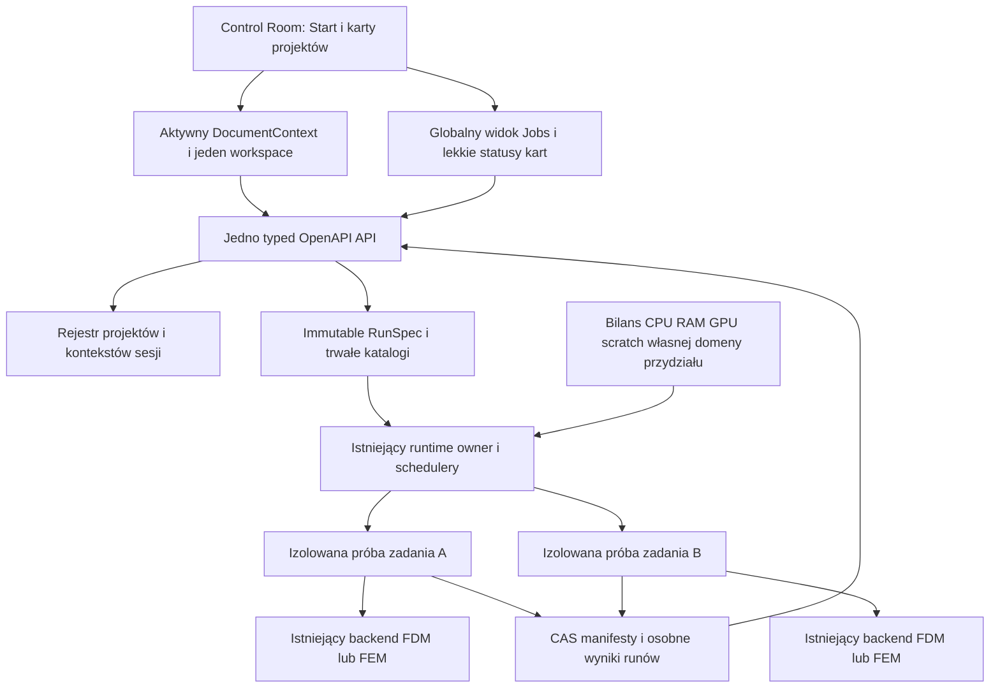
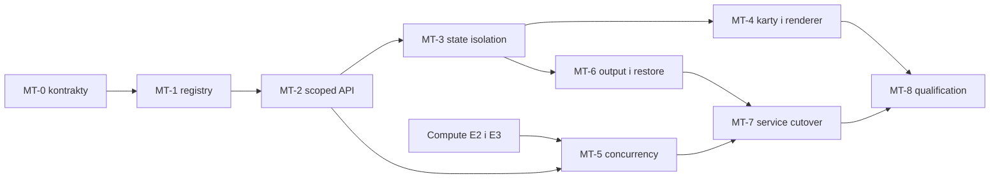

# Wiele projektów w kartach Fullmag — audyt architektury i plan wdrożenia

Data: 05.10.2026. Status: **propozycja architektury i plan; implementacja nie rozpoczęta**.
Zakres: karty dokumentów/projektów w jednym Control Room, niezależne sesje i równoległe obliczenia.
Aktualizacja R2: wymagania HPC, wielu użytkowników i kilku alokacji tego samego użytkownika zmieniają granicę własności zasobów. **Slurm jest wybranym przez użytkownika pierwszym adapterem.** Uzupełnienie i obowiązujące rozstrzygnięcia: [HPC, izolacja i fan-out eigensolve](multi-project-hpc-execution-20261005.md). Rozdziały poniżej skorygowano, aby „jeden owner” nie oznaczał globalnego singletona na fizycznym węźle.
Baza odczytu: `master`, HEAD `f7500b82dc56234ededf0132a22955a90584e7e5`, współdzielony dirty checkout.
Stan lokalnych zmian jest częścią audytu; sam HEAD nie identyfikuje wszystkich odczytanych źródeł.
Nie uruchamiano buildów, solverów, testów ani restartu działającego workspace. Ustalenia są dowodem źródłowym, a nie kwalifikacją wykonania.

## 1. Rekomendacja

**Jeden frontend i spójne API w obrębie uprawnionego deploymentu użytkownika, wiele izolowanych kontekstów projektów oraz izolowane procesy wykonawcze.** Lokalnie nadzoruje je runtime owner; w HPC adapter Slurma i agenci ograniczeni do konkretnych alokacji. Kilka deploymentów/użytkowników może działać na tym samym węźle.

Karta reprezentuje otwarty dokument. Nie tworzy własnego serwera HTTP, portu ani schedulera. Projekt może być edytowany bez procesu solvera; przyjęty run może trwać po zamknięciu jego karty. Proces wykonawczy należy do konkretnej próby zadania, ewentualnie do jawnie wspieranego interaktywnego runtime'u, a nie do czasu życia komponentu React.

Współdzielimy kontrolę, katalogi, odczyt i bilans zasobów. Izolujemy mutable model, szkice, historię, komendy, wyniki i natywną pamięć solvera. Nie umieszczamy wszystkich obliczeń jako niezależnych wątków w procesie serwera API.

Diagram pokazuje lokalną realizację. Jeden owner dotyczy **konkretnego autoryzowanego deploymentu/execution scope**, a nie wszystkich użytkowników fizycznego hosta. API, usługa, scheduler, supervisor, preparer i worker mają różne role. W HPC fizyczne zasoby przyznaje Slurm; Fullmag dzieli wyłącznie otrzymany envelope. Dwa obce deploymenty lub trzy alokacje tego samego użytkownika nie współdzielą domyślnie owner record, writer lock, credential, portu ani scratch. Proces API per karta nadal jest niewłaściwą granicą; niezależne instancje aplikacji są prawidłowym przypadkiem wdrożenia.

### 1.1 Rozważone warianty

| Wariant | Zalety | Główne koszty i ryzyka | Wniosek |
|---|---|---|---|
| N kart, N pełnych backendów/API | Mały początkowy zakres zmiany obecnego `current` | N portów i ownerów, powielone zasoby, niezależne kolejki konkurujące o GPU, trudne przywracanie | Nie wybierać jako produktowej architektury |
| Jedno API i wszystkie solvery w jego procesie | Bez IPC, prostsze wskaźniki w pamięci | Native crash/OOM/globalne biblioteki mogą uszkodzić wszystkie projekty; trudna izolacja Python/CUDA | Nie wybierać jako domyślnej realizacji |
| Jedno API + runtime owner + izolowane procesy wykonawcze | Izolacja awarii, wspólny admission, trwałe runy, reuse istniejących ownerów | Wymaga jawnej tożsamości i transportu oraz domknięcia lifecycle usługi | **Rekomendowane** |
| Kontener/usługa zdalna na każde zadanie | Mocniejsza izolacja i skalowanie | Koszt startu i dystrybucji; niepotrzebna zależność dla lokalnego Windows | Adapter targetu w kolejnych etapach, nie warunek kart |

To rekomendacja dopasowana do istniejących właścicieli Fullmag, nie wynik benchmarku wariantów. Optymalizacja procesu/puli workerów wymaga osobnego pomiaru. Ponowne użycie workera między projektami dopiero po dowodzie pełnego resetu native/Python/CUDA i fencing; pierwsza realizacja zachowuje izolację prób.

## 2. Co już istnieje i czego brakuje

### 2.1 Fundamenty potwierdzone w źródłach

| Fundament | Dowód | Znaczenie dla kart |
|---|---|---|
| Projekt ma tożsamość oddzielną od sesji | `crates/fullmag-application/src/project.rs:14`, `ProjectId` | Karta nie musi tworzyć runtime'u |
| Run przechwytuje dokładną rewizję i hash definicji | `crates/fullmag-application/src/run_spec.rs:64`, `ProjectSnapshot` | Edycja B lub nowszej rewizji A nie zmienia uruchomionego A |
| Repozytorium projektu jest niezależne od SessionStore | `crates/fullmag-application/src/file_repository.rs:4`, `repository.rs:51` | `.fms` pozostaje dokumentem, a nie ownerem procesu |
| Zapis archiwum ma lock i kontrolę rewizji/tożsamości | `file_repository.rs:118`, `file_repository.rs:142` | Dwie karty/okna nie mogą po cichu nadpisać tej samej wersji |
| Scheduler obsługuje pulę runów i kilka aktywnych workerów | `crates/fullmag-api/src/accepted_scheduler_main.rs:429`, `:442` | Nie trzeba tworzyć drugiego schedulera kart |
| Admission zachowuje claim, attempt, epoch i lease | `crates/fullmag-runtime-control/src/claim.rs:18`, `:107` | Potrzebne fencing i kontrolowany release już mają właścicieli |
| SessionStore serializuje publikacje przez native writer lock | `crates/fullmag-session/src/writer.rs:1`, `:76` | Równoległe obliczenia nie oznaczają dowolnych równoległych zmian katalogu |
| Dane wynikowe i tmp są rezerwowane per wykonanie | `crates/fullmag-runner/src/project_storage.rs:18`, `:108` | Zachować jedną OutputStorage i prywatne tmp |
| Cleanup wymaga zakończenia dzieci i poprawnej tożsamości tmp | `project_storage.rs:172`, `:190` | Zamknięcie karty nie jest cleanupem działającego runu |
| Python ma izolowany authoring context | `packages/fullmag-py/src/fullmag/world.py:2682`, `ExecutionContext` | Reuse podstawy P2-C, bez tworzenia drugiego DSL |
| Workspace zapisanych wyników nie wymaga sesji | [ADR 0039](../../adr/0039-project-workspace-without-runtime-session.md) | Karty readonly mogą działać bez workerów |
| Powierzchnie środka workspace mają active-only lifecycle | [ADR 0016](../../adr/0016-center-viewport-tabbed-surfaces.md) | Karty projektów nie mogą mnożyć ukrytych canvasów |

### 2.2 Otwarte ograniczenia wykonania

Najważniejsza luka nie jest w wyglądzie paska kart: obecny publiczny model sesji jest singletonem.

| Ustalenie audytu | Dowód źródłowy | Skutek / pilność |
|---|---|---|
| Jeden procesowy `current_live_state` i wspólne command queues/ledger, display/workspace, replay/QoS, preparation receipt | `crates/fullmag-api/src/types.rs:109`, `:137–205` | Krytyczna blokada wielu niezależnych sesji; rozdzielić SessionContext i shared platform state |
| Kolekcja sesji jest projekcją 0/1 tego slotu, nie rejestrem wielu sesji | `crates/fullmag-api/src/router_v2/mod.rs:1253–1305` | Nie zakładać, że sama nazwa `/sessions` oznacza multi-session |
| Create konfliktuje albo zastępuje istniejący slot | `router_v2/handlers/sessions/create.rs:28–64` | New tab wymaga nowej semantyki Create, nie tylko usunięcia potwierdzenia Replace |
| Reset usuwa wspólne zasoby i zwiększa epoch | `crates/fullmag-api/src/main.rs:3189–3233` | Zamknięcie B nie może uruchamiać globalnego reset A |
| Scratch Create dopuszcza obecnie FDM/FEM CPU/double | `handlers/sessions/create.rs:99–113` | Authoring session nie jest dowodem GPU dispatchu ani kwalifikacji lane'u |
| SessionStore ma immutable manifest generations i jeden `CURRENT` | `crates/fullmag-session/src/store.rs:1–17`, `:253–295` | Rozdzielić historyczny wskaźnik persistence od rejestru żywych kontekstów |
| Scope header jest opcjonalny i chroni bieżący slot | `middleware/session_scope.rs:9–35`, `main.rs:4493–4573` | Dobra baza fencing, ale nie utrzymuje A po zastąpieniu przez B; multi-document mutacje wymagają pełnego scope |
| Runner publikuje przez jeden internal-live/current bridge; drugi session ID jest odrzucany | `crates/fullmag-cli/src/control_room.rs:2385–2600`, `crates/fullmag-api/src/main.rs:3718–3782` | Scoped HTTP reads nie wystarczą: migracja producerów i binary data plane jest konieczna |
| Internal update niesie session ID, ale nie pełny worker incarnation token | `crates/fullmag-api/src/types.rs:1184–1215`, `:1255–1293` | Dodać owner/attempt/generation fence, aby stary worker nie publikował do odtworzonego kontekstu |
| WS sender/replay i display/workspace state są wspólne | `types.rs:159–200`, `handlers/platform/realtime.rs:29–54` | Oddzielić event scope oraz view-local presentation; dwa okna nie mogą nadpisywać sobie widoku |

Otwarcie archiwum jest już runtime-free (`handlers/persistence/projects.rs:752–785`), a wyniki projektów/runów mają adresowane zasoby (`router_v2/mod.rs:1108–1114`). Rozwijamy te granice zamiast odtwarzać dokument jako obowiązkową żywą sesję.

1. `accepted_scheduler_main.rs:286` otwiera **jeden** `store_root`. Obsługa kilku runów w tym store nie jest dowodem wspólnego przydziału fizycznego hosta między wieloma niezależnymi store'ami.
2. `crates/fullmag-api/src/runtime_service_main.rs:376` uruchamia schedulery z `--max-concurrency 1`. Podniesienie samej wartości nie zapewnia budżetów RAM, VRAM, scratch i CPU ani poprawnego podziału preparation/solve.
3. `crates/fullmag-runtime-control/src/local_resources.rs:15` buduje lokalne oferty compute/preparation z obserwowanej pojemności. To nie jest jeszcze host-wide ledger dla wszystkich ownerów i store'ów.
4. [Compute execution E2–E3](compute-execution-20261004/README.md) obejmuje wspólny ledger, enforcement i potwierdzenie urządzenia przez worker. W [checkpoincie](compute-execution-20261004/implementation-checkpoint.md) te etapy pozostają otwarte. Nie przypisujemy im gotowości na podstawie specyfikacji.
5. [Natywna usługa](../../specs/native-runtime-service-v1.md) i [ADR 0049](../../adr/0049-native-runtime-owner-control.md) rozdzielają ownera i UI, ale mają różne historyczne opisy stanu produktowego attach/start. Źródłowe istnienie nie dowodzi, że wszystkie zwykłe ścieżki launchera już utrzymują runy po zamknięciu UI. To osobna bramka MT-7.

### 2.2.1 Frontend: istniejące zabezpieczenia i miejsca wymagające migracji

| Obszar | Dowód źródłowy | Wniosek dla wielu kart |
|---|---|---|
| Viewport tabs wybierają jeden moduł, nie dokument | `apps/control-room/src/kernel/layout/ViewportTabHost.tsx:31`, `:76`; `WorkspaceContentScope.tsx:5` rozróżnia tylko project/session | Dodać nadrzędny document scope; nie zmieniać powierzchni 3D w projekt tabs |
| Kernel tworzy pojedyncze project/history/forms/selection/layout controllers | `apps/control-room/src/kernel/KernelProvider.tsx:129–147` | Podzielić globalne usługi i document-scoped instances, zachowując registry |
| Facade i confirmed identity wskazują current session | `kernel/api/ControlRoomApi.ts:1075`, `kernel/resources/useSessionStatus.ts:85`, `sessionResourceIdentity.ts:3` | Reuse identity ID/epoch/request epoch; rozszerzyć routing, nie zgubić obecnego fencing |
| Cache jest dzielony po API-client scope i session key; unknown identity może użyć klucza bez scope | `kernel/resources/ResourceRuntimeStore.ts:848`, `useResource.ts:95`, `useSessionScopedResourceKey.ts:6` | Dodać project/run/target identities; brak identity nie uprawnia do mieszania zasobów sesji w default key |
| Canonical path invalidation propaguje do wszystkich scoped kluczy o tym path | `kernel/resources/ResourceInvalidationController.ts:39–45`, `:71–90` | Przy wielu sesjach event A nie może odświeżać/revision-fence cache B; jawny originating scope, osobna reguła globalnego platform invalidation |
| Komendy mają session stale predicate i pamiętają przejście A→B→A | `kernel/commands/commandTypes.ts:49`, `CommandRegistry.ts:218`, `commandContext.ts:9` | Zachować monotoniczny fence, dodać document/run origin i completion routing; samo przełączenie z powrotem nie legalizuje starej operacji |
| Controller dokumentu, undo stacks i stores mają pojedynczą mutable instancję | `kernel/persistence/ProjectDocumentController.ts:130`, `:208`; `kernel/authoring/AuthoringHistoryController.ts:145`; `modules/explorer/explorerStore.ts:101`; `modules/viewport-3d/viewport3dStore.ts:558` | Szkice/undo/selekcja/view state wymagają oddzielnych ownerów; nie resetować wszystkich store'ów przy wyborze karty |
| Run outcome korzysta z aktualnego kontrolera i globalnego viewport thumbnail | `kernel/persistence/RunOutcomeConnector.tsx:34–50`, `ProjectDocumentController.ts:522–574` | Istnieją reservation/revision/pending guards; dla nowych contextów trzeba jawnie wiązać origin project/run i thumbnail source, także po 400 ms settle. Nie uznawać tego za dowiedziony obecny błąd pojedynczego workspace |
| 3D cache ma byte budgets, worker runtime ma lease/disposal | `modules/viewport-3d/viewport3dResources.ts:61`, `:758`; `viewport3dWorkerRuntime.ts:91`, `:147` | Rozszerzyć istniejące bounded lifecycle; nie tworzyć N hidden rendererów |
| Decode scheduler jest współdzielonym client/pending map | `kernel/api/binaryDecodeScheduler.ts:66`; `modules/field-map/FieldMapModule.tsx:344` broni last-good identity | Decode completion wymaga document/source generation; close zwalnia payload/listener, retention nie przekracza identity |

Wszystkie skrócone ścieżki w tej tabeli są względne do `apps/control-room/src/`. To inventory migracji i ryzyk przy wprowadzeniu wielu contextów, a nie twierdzenie, że obecny pojedynczy workspace już miesza dwie aktywne sesje. Existing client scope/cache byte budgets/revision guards są zasobem do zachowania.

### 2.3 Relacja z istniejącymi planami

To uszczegółowienie **P7-B**, nie nowy równoległy masterplan: [plan refaktoryzacji, P7](refactor_runtime/final/03-plan-refaktoryzacji.md#12-p7--złożone-studies-wiele-projektów-i-targety) już wymaga wielu projektów, osobnych szkiców, contextów widoku i ograniczonych kolejek decode/cache.

| Istniejący zakres | Reuse / zależność |
|---|---|
| P1 — dokument i repozytorium | Trwała definicja, Save/Save As/Close i konflikty zapisu |
| P2-C — Python context | Izolacja authoringu i stale-handle fencing |
| P3/P5 — accepted runs, worker protocol i recovery | Wykonanie i journale zamiast nowego run engine |
| P3a — resource contexts | Rozszerzenie istniejących scope'ów o jawne dokumenty i sesje |
| P6 — pinned datasets / ViewDocument | Kamera, porównania i wyniki pozostają przypięte do źródła |
| P7-B | Właściciel kart i odseparowanych kontekstów frontendowych |
| P7-C / ADR 0049 | Niezależna usługa, discovery, attach/detach, reconnect |
| P8 — cutover `current` i restart | Usunięcie globalnego mutable current, wersje i bezpieczna migracja |
| Compute execution E1–E3 / ADR 0052 | Profile, materializacja, admission i zasoby współdzielone |
| ADR 0051 | Jedna polityka output/tmp/formatów; bez nowej hierarchii storage kart |

Wiele otwartych dokumentów można wdrożyć przed pełną współbieżnością workerów. Równoległe wykonanie odblokowuje się dopiero po domknięciu admission dla obsługiwanego targetu/lane'u. Distributed solve jednego problemu, porównanie w dwóch viewportach i współedycja wielu użytkowników nie są częścią tej zmiany.

## 3. Docelowe granice i tożsamość

### 3.1 Karta, projekt, sesja i run są różnymi obiektami

| Obiekt | Właściciel | Czas życia / relacja |
|---|---|---|
| `UiDocumentId` — proponowany lokalny uchwyt karty | Kernel UI | Otwarcie karty; nie jest ID fizyki ani ścieżką pliku |
| `ProjectId` + definition revision/hash | Aplikacja i repozytorium | Trwały dokument, możliwe wiele immutable rewizji i runów |
| DocumentContext — proponowane usługi dokumentu | Kernel/aplikacja | Szkice, historia, wybór widoku i opcjonalny uchwyt sesji; brak tablic pól w store |
| `SessionId` + session epoch | Runtime/API | Jawnie adresowana sesja interaktywna/authoring; może jej nie być przy readonly projekcie |
| `RunId` / `TaskId` / `AttemptId` / ownership epoch | Accepted runtime | Niezmienny submit, wykonawcze zadania i próby; niezależne od aktywnej karty |
| `TargetId` i incarnation API/runtime | Runtime discovery | Cel wykonania i jego aktualna instancja; restart wymaga rewalidacji |
| Principal / Deployment / ExecutionScope | Autoryzowany control plane i provider | Oddzielają użytkowników oraz kilka alokacji jednego użytkownika; identyfikator nie zastępuje uprawnień |
| Dataset / observation source | Data/analysis resources | Konkretne run/stage/artifact/frame i rewizje; nie ruchome „ostatnie dane” |

Nie narzucamy relacji 1 karta = 1 proces = 1 run. Jeden projekt może mieć wiele runów. Domyślnie jeden edytowalny kontekst dla konkretnego dokumentu w danym oknie; drugi widok wyników to istniejąca powierzchnia/źródło w projekcie, a nie klon solvera.

Otwarcie tego samego pliku w tym samym oknie aktywuje istniejącą kartę po weryfikacji canonical file identity. Zbieżny `ProjectId` w dwóch różnych plikach nie uprawnia do automatycznego scalenia. Konflikt kopii jest jawny: otwórz readonly albo utwórz nową tożsamość projektu przez kontrolowany fork. Osobne okna zachowują optimistic revision checking; bez założeń o globalnym active tab.

### 3.2 Jeden kernel aplikacji, scoped usługi dokumentów

Pozostają jeden ModuleRegistry, jeden model komend, jedna implementacja ribbonu i unified workspace dla FDM/FEM. Kernel ma globalne usługi platformy, a ich immutable scope factories tworzą zależności konkretnego dokumentu. React context przekazuje usługi i tożsamość; mutable dane nie trafiają do contextu.

| Zakres | Przykładowa zawartość |
|---|---|
| Globalny w danym UI/deploymencie | Theme, preferencje nowych projektów, capabilities uprawnionych targetów, rejestr kart, Jobs, widok przydziałów własnych scope'ów, transport/discovery |
| Dokumentu | Selekcja, historia/undo, pending intent, Inspector drafts, expanded nodes, layout/ViewDocument, kamera, pinned dataset, stan odwiedzin Start |
| Sesji/runu — zasób serwera | Status, scene, mesh, fields, revision pointers, command journal, runs, logs i manifesty |
| Renderera | WebGL/Three/ECharts, decoded buffers, workers, observers, object URLs; jawny lifecycle i disposal |

`activeDocumentId` jest wyborem klienta/okna. Nigdy nie przestawia globalnego `current` na serwerze. Przełączenie A→B nie wykonuje Create/Open/Reset runtime'u ani Cancel/Stop.

### 3.3 API i fencing

Wprowadzić jawnie adresowane zasoby sesji, koncepcyjnie `/v2/sessions/{session_id}/...`, oraz adresowane mutacje i odczyty projektu. Dokładne nowe route/schema names są **propozycją**, wymagają inventory istniejących tras i ADR/OpenAPI przed implementacją. Nie dopisywać URL-i w komponentach.

- Jedna generowana warstwa transportu; scoped facades otrzymują niezmienną tożsamość przy tworzeniu. Polecenie nie czyta „obecnie aktywnej karty” po `await`.
- Każda mutacja wiąże projekt/sesję, expected revision, epoch i `client_intent_id`; backend sprawdza powiązanie projektu z sesją. Błędny scope jest jawnym odrzuceniem, nie przekierowaniem.
- Capture scope przed submit. Spóźnione ACK/HTTP/worker decode może aktualizować zasób A, ale nie UI B. Abort fetch jest optymalizacją; generation fencing jest granicą poprawności.
- Resource keys zawierają target/instancję, session ID/epoch albo project snapshot/dataset ID, family/revision, oraz właściwą domain/topology generation. `UiDocumentId` izoluje draft/view state; nie wymusza duplikowania identycznych immutable danych w cache.
- Invalidation niesie originating scope. Globalny platform resource może odświeżać wszystkich świadomych subskrybentów; rewizja zasobu sesji A nie może propagować się do B przez sam canonical path. Unknown session identity blokuje session reads, zamiast wybierać cache bez scope.
- HTTP jest właścicielem snapshotów, recovery, komend i binary data plane. Events WS niosą scope, sequence i invalidations, nie całe pola. Po luce/reconnect klient pobiera jawnie scoped snapshot.
- Globalna kolekcja Jobs/statusów kart musi być stronicowana i revision-driven. Ciężkie pola/topologia są pobierane dla aktywnego widoku, nie przez globalny status.
- Dla kilku okien/browser tabs: token instancji, optimistic concurrency i scoped commands; kliknięcie aktywnej karty w jednym oknie nie zmienia drugiego.

Migracja musi objąć również **producentów**: obecny private `/v1/internal/live/current/...` bridge CLI/runnera nie może dalej publikować wszystkich snapshotów do jednego slotu. Zachować go tylko jako nazwany adapter pojedynczej sesji; docelowy private protocol wiąże session/run/attempt oraz worker/owner incarnation i routing do właściwego kontekstu. Nie tworzyć publicznego frontend fallbacku v2→v1.

View state wymaga osobnej tożsamości, koncepcyjnie `ViewId` dla document view/okna. Lokalne camera/selection/quantity preferences mają ownera UI/ViewDocument. Tam, gdzie API musi przechowywać display state, obliczać przekrój albo rozliczać client ACK, wymaga view-scoped resource i lifecycle. Nie zachować jednego server-global display selection jako sposobu obsługi dwóch niezależnych widoków tej samej sesji. Kanoniczne pola i ich availability pozostają zasobem session/run; zmiana quantity wybiera już opublikowane dane, nie steruje solverem.

Wspólna sesja wymaga jawnej polityki sterowania: jeden control owner albo revision-CAS i idempotent queue serialization dla wspieranych komend. Sam identyczny scope header dwóch klientów nie przyznaje im niezależnej własności runtime'u. Przekazanie/utrata uprawnienia sterowania nie zmienia readonly dostępu do wyników.

`/sessions/current` pozostaje czasowo adapterem wyłącznie dla historycznych konsumentów pracujących w trybie jednej sesji. Nie może sterować multi-project UI. Gdy istnieje kilka sesji, operacja bez jednoznacznego scope odmawia; kompatybilność ma jawny owner, inwentaryzację użyć i kryterium usunięcia.

### 3.4 Authoring a wykonanie

Edycja i podgląd dokumentu nie rezerwują GPU solvera. Submit tworzy immutable snapshot i RunSpec; dalej scheduler rozstrzyga placement. Zmiana geometrii lub parametrów podczas runu tworzy następną rewizję dokumentu, nie mutuje zaakceptowanego wejścia.

Live steering, jeśli dany workflow je wspiera, jest osobną komendą konkretnego run/task/attempt z journalem i potwierdzeniem segmentu zastosowania. Nie wolno przenieść ogólnej mutacji authoringu na działający solver tylko dlatego, że jego karta jest aktywna. Historyczny/pinned wynik nie przyjmuje live steering ani automatycznego przełączenia na nowy run.

Python korzysta z jednego DSL i istniejącego ExecutionContext. Niezależne skrypty wykonuje się w izolowanych procesach; contextvars authoringu nie dowodzą bezpieczeństwa równoległego native runtime'u w jednym interpreterze. Nie zmieniać globalnie cwd/env API/Pythona przy wyborze karty. Zwykłe `fullmag skrypt.py` zachowuje sąsiedni `skrypt.zarr` i obecną politykę kolizji; UI/CLI przyjętego runu przechodzą przez ten sam resolver execution/output.

## 4. Równoległość, pamięć i dane

### 4.1 Admission i bilans hosta

Zachować istniejące schedulery, preparation/solve leases, immutable claims i owner fencing. Współbieżność wynika z ograniczeń targetu i ledger-a **własnej domeny przydziału**, nie z liczby kart. Dla HPC globalnym arbitrem zasobów jest Slurm; nie powstaje konkurujący z nim host-wide scheduler Fullmaga.

Warunek admission obejmuje jednocześnie: legalny backend/device/precision, CPU thread/affinity budget, RAM, GPU UUID i VRAM, scratch/disk reserve oraz limity aktywnych zadań. Suma rezerwacji mieści się w uprawnionym przydziale: lokalnej polityce ownera albo allocation/step envelope Slurma. Nie wolno użyć całej pamięci/CPU/GPU węzła tylko dlatego, że telemetry je widzi. Liczba logicznych CPU nie dowodzi liczby fizycznych rdzeni; natywne BLAS/OpenMP/MFEM/CUDA muszą potwierdzić skuteczny przydział. Telemetria wolnej pamięci nie zastępuje rezerwacji ani twardego OS enforcement.

Pierwsza lokalna ścieżka korzysta z autorytatywnego application SessionStore **jednego deploymentu użytkownika** i katalogów wielu ProjectId/RunId. Output folders pozostają odrębne. Store nie jest globalną bazą wszystkich użytkowników węzła. Prace dzielące ten sam przydział używają jednego admission/ledger; oddzielne alokacje Slurma mają oddzielne envelopes i wykonawcze namespaces, nawet przy wspólnym katalogu kampanii. Mutable SessionStore nie staje się współdzielonym network database przez umieszczenie go na NFS/Lustre. Model staging/CAS i trwałość koordynatora opisuje uzupełnienie HPC. Nie tworzyć ownera/store na kartę jako obejścia admission.

| Zestaw prac | Polityka domyślna |
|---|---|
| Dwa runy CPU | Równolegle tylko przy egzekwowanym budżecie wątków, RAM i scratch |
| Run CPU + run GPU | Możliwe równolegle; GPU worker też rezerwuje CPU, RAM i I/O |
| Dwa runy na różnych GPU | Równolegle po przydziale konkretnych UUID i wspólnej rezerwie hosta |
| Dwa runy na tym samym GPU | Exclusive lease: drugi oczekuje; brak cichego przejścia na CPU |
| Meshing i solve | Odrębne lifecycle/leases, wspólna pojemność hosta; GPU meshing także wymaga właściwego GPU lease |
| Nieznany/stale stan ownera | Reconciling/blocked; brak nowego admission na niepotwierdzonym zasobie |

Współdzielenie jednego GPU przez kilka procesów nie zapewnia przyspieszenia. NVIDIA opisuje narzut wielu kontekstów i przełączania; MPS/streams nie są uniwersalną zamienną dla obecnych workerów. Współdzielenie GPU wymaga osobnej opt-in polityki, adapterów, memory accounting i kwalifikacji. Źródło: [CUDA Best Practices, Multiple contexts](https://docs.nvidia.com/cuda/cuda-c-best-practices-guide/index.html#multiple-contexts). Rekomendacja exclusive lease jest decyzją produktu, nie twierdzeniem o niemożliwości współbieżności GPU.

Izolacja procesu chroni pamięć i błędy lokalnego workera; nie gwarantuje izolacji awarii sprzętu/sterownika. Przy utracie urządzenia jego allocation i stan targetu przechodzą do reconciling/quarantine zgodnie z istniejącym ownerem, a nowe admission jest zamknięte do potwierdzenia stanu. Nie obiecywać, że reset wspólnego GPU/hosta nie wpłynie na inne zadania. Worker OOM i OS-kill także wymagają potwierdzenia exit, integralności katalogu i odzyskania zasobów, a nie automatycznego re-spawnu.

Fairness Fullmaga obejmuje uprawnione projekty i runy we własnym scope, żeby sweep A nie blokował każdego Submit B. Polityka między użytkownikami/alokacjami HPC należy do Slurma. Rozwinąć istniejący round-robin i bounded queue; zachować zależności continuation/histerezy. Priorytet aktywnej karty może podnosić priorytet odczytu/decode, nie samoczynnie zmieniać immutable compute priority ani zabierać urządzenia działającemu A.

### 4.2 Trwałość i pliki

- Metadane aplikacji/runów: jeden autorytatywny store/catalog namespace, krótkie serializowane transakcje; nie trzymać WRITER.lock przez cały solve ani dekodowanie dużego pola.
- Duże dane: worker publikuje staged payload → CAS/manifest → completion barrier zgodnie z istniejącym protokołem. Wspólne immutable CAS może deduplikować dane; pin/GC uwzględnia wszystkie projekty, aktywne próby i otwarte historyczne źródła.
- OutputStorage zachowuje requested i resolved paths. Każdy RunId/attempt/case ma wyłączność swojego wyniku i prywatnego tmp. Globalne defaults są kopiowane do nowego draftu; ich zmiana nie przestawia otwartych ani przyjętych runów.
- Dwa równoległe uruchomienia z identycznym żądanym katalogiem rozstrzyga obecna atomowa rezerwacja/kolizja. Nie opierać unikalności tylko na nazwie projektu i timestampie.
- Jeden writer per plik HDF5 / logiczny output. SWMR ma warunki formatu i lifecycle, więc nie obiecywać live odczytu aktualnie zapisywanego HDF5 bez wdrożenia i dowodu. Źródło: [h5py SWMR](https://docs.h5py.org/en/stable/swmr.html).
- Nie zakładać, że format Zarr automatycznie rozwiązuje konflikty zapisu. Zarr v2 dokumentuje synchronizację między procesami zależną od filesystemu. Pierwszy zakres zachowuje odrębne outputs i writer ownership, bez wspólnego mutable output wielu runów. Źródło: [Zarr v2, Parallel computing and synchronization](https://zarr.readthedocs.io/en/support-v2/tutorial.html#parallel-computing-and-synchronization).
- Closing tab nie usuwa tmp, outputów, CAS ani lease. Cleanup wykonuje owner dopiero po dowodzie zakończenia dzieci i writerów. Crash zachowuje niepewne dane do recovery według OutputStorage; brak age/PID-only takeover.
- Save As/fork przechodzi przez obecny repository contract; nie fabrykować nowego ProjectId przy samym przełączeniu lub odtworzeniu karty. Stare archiwa pozostają czytelne, bez obowiązkowego przepisywania.

### 4.3 Renderer i ciężkie zasoby

W oknie montujemy **jeden aktywny workspace dokumentu** i tylko jego aktywną ciężką powierzchnię. Pozostałe karty zachowują mały stan UI i zasobowe referencje, a nie ukryte R3F/ECharts/WebGL drzewa.

Kamera, wybór obiektu, layout, pinned source, zoom wykresu i Inspector drafts żyją poza rendererem. Przy zmianie dokumentu stary scope jest natychmiast odłączony; heavy subscriptions, buffers, geometries, workers i URLs są zwalniane lub trafiają do ograniczonego LRU. Nowy renderer otrzymuje jawny snapshot własnego view state. Reuse canvasu jest dopuszczalny tylko przy sprawdzonym reset/disposal i generation fencing; prostszy pierwszy zakres montuje nowy renderer dla innego dokumentu. Krótka wizyta Start w obrębie tej samej sesji pozostaje osobną interakcją od przełączenia A→B.

Każdy cache ma budżet **bajtów i concurrency**, a nie tylko liczby wpisów. Oddzielić decoded CPU memory, GPU buffers/textures, scalar histories, thumbnails i pending decode queues. Ciężkie pola nie trafiają do localStorage/IndexedDB/Zustand. Immutable server cache może być wspólny po pełnej tożsamości; LRU odrzuca nieaktywne dane bez usuwania canonical artefaktów.

Nieaktywne karty nie odpytują pól/topologii i nie wysyłają display ACK. Widoczne lekkie summary statusy aktualizuje kolekcja Jobs/kart. Pobieranie/decode aktywnego widoku ma bounded priority; częstotliwość postępu jest ograniczona, bez fałszowania pomiarów. Nowy projekt nie czeka na decode ciężkiego wyniku starego projektu, aby umożliwić edycję.

## 5. Zachowanie produktu

Pasek kart dokumentów znajduje się nad workspace, oddzielony od zakładek narzędzi ribbonu oraz powierzchni `3D Scene / Field Map / Analysis`. Nie wykorzystujemy tych samych etykiet i mechanizmu do trzech odmiennych zakresów.

- **Start** jest globalnym widokiem otwierania projektów i działań New/Open. Powrót aktywuje ostatni dokument; nie istnieje karta Home w każdym projekcie.
- **New/Open** domyślnie dodaje nową kartę zamiast zastępować aktywną sesję. Polecenie Replace pozostaje osobną jawną operacją.
- Karta ma nazwę, dirty marker i rzeczywisty status pracy: queued/preparing/running/reconciling/failed/finished. Kilka runów pokazuje liczbę i rozwinięcie; nie ukrywa błędu starszego runu za sukcesem nowszego.
- Globalne **Jobs** pokazuje także runy zamkniętych dokumentów. Kliknięcie joba otwiera/aktywuje właściwy projekt i przypięty wynik.
- Zamknięcie dirty dokumentu: Save / Discard draft / Cancel. Discard dotyczy niezapisanego authoringu, nie wyników ani zaakceptowanego snapshotu.
- Zamknięcie karty z działającym runem: wyraźne „obliczenia pozostaną w Jobs”. Standardowe zamknięcie odłącza widok. Osobna akcja „Zatrzymaj obliczenia i zamknij” żąda scoped Stop i czeka na terminalny wynik, nie interpretuje ACK jako zakończenia.
- Nieznany wynik Create/Submit/Save po timeout: reconciliation tego samego intentu; bez drugiego utworzenia, Submitu i automatycznego podnoszenia timeoutu.
- Przy utracie API karta zachowuje własne last-good dane z jawnym stale status. Nie adoptuje danych innej sesji. Mutacje wymagające serwera pozostają niedostępne; lokalny draft może trwać w wyraźnym stanie offline.
- Run kończący się w tle publikuje badge/toast powiązany z dokumentem; nie przełącza sam widoku i nie kradnie focusu.
- Klawiatura: przewidywalne następna/poprzednia karta, wybór indeksu, zamknięcie aktywnej karty i menu overflow. Dokładne skróty uzgodnić z istniejącym registry oraz skrótami przeglądarki; nie przechwytywać ich bez zasad focus/scope.

Przywracanie aplikacji zapisuje listę referencji kart i ich mały view state, nie runtime state. Trwały niezapisany dokument/draft, jeśli ma być odzyskiwany, należy do wersjonowanego recovery journal/autosave aplikacji. Nie deklarujemy niezapisanego projektu „saved” po zapisie layoutu. Restore najpierw potwierdza projekty, ownera i run catalogs; brak pliku/targetu jest jawną kartą niedostępną, nie pustą nową symulacją.

Obietnica pracy po zamknięciu całego okna jest dostępna dopiero po bramce MT-7 dla danego targetu. W demonstratorze MT-4 nie wolno publikować komunikatu o przeżywaniu runu, jeśli launcher nadal posiada jego proces. Brak potwierdzonego detach jest jawnym ograniczeniem/capability, z bezpiecznym flow zamknięcia, a nie ukrytym kill ani pozornym „continued in background”. Samo przełączenie i zamknięcie widoku dokumentu nigdy nie wykonuje Stop.

## 6. Plan wdrożenia i zależności

### MT-0 — inwentaryzacja, ADR i kontrakty

**Właściciel:** architektura/API. **Zależność:** niniejszy audyt i reconciliation równoległych zmian.

R2: przed zamrożeniem interfejsów przyjąć H0/H1 z uzupełnienia HPC: Principal/Deployment/ExecutionScope, authority resources oraz provider contract. Pierwszy desktop może mieć jeden scope, ale nie może zakodować fizycznego hosta jako globalnej granicy ownera.

Pliki: nowy ADR o wielu dokumentach i scoped sessions, `docs/specs/resource-first-control-room-api-v2.md`, `docs/specs/session-run-api-v1.md`, frontend `01/02/04/05`, istniejący plan P7 i compute execution. Backend masterplan aktualizować wyłącznie w zakresie rzeczywiście zmienionych ownerów runtime.

Zadania: zatwierdzić słownik; inventory `current`, globalnych writerów, scope headers i endpointów; rozdzielić project APIs/runtime APIs; wskazać compatibility owner/removal; ustalić format restore journal i expected revision. Ten dokument jest propozycją ADR, nie aktualizuje sam zaakceptowanych kontraktów.

**Odbiór:** macierz każdego resource/command/event z ownerem i pełną tożsamością, brak konfliktu z ADR 0016/0039/0049/0051/0052; żadna nowa kolejka lub DSL.

### MT-1 — rejestr dokumentów i sesji po stronie aplikacji

**Właściciel:** application/session/API. **Zależność:** MT-0.

Pliki: `crates/fullmag-application/src/project.rs`, `repository.rs`, `file_repository.rs`; `crates/fullmag-api/src/types.rs`, `main.rs`, `router_v2/handlers/sessions/`, `router_v2/handlers/persistence/`; `crates/fullmag-session/src/store.rs`. W razie potrzeby nowe małe moduły registry/scoped contexts w istniejących warstwach.

Zastąpić pojedynczy mutable kontekst jawnie adresowanymi rekordami. Create/Open dodają rekord bez zatrzymywania starego. Zachować readonly projekt bez sesji, single-writer transakcje, ograniczone zasoby per context i stale-handle fencing. Rozdzielić Close document / detach view / delete session / stop run. Nie wystawiać produkcyjnych wielu editable sesji, jeśli jeszcze korzystają z jednego runtime command busu.

**Odbiór:** A i B mają oddzielny authoring/revision; utworzenie i zamknięcie B nie modyfikuje A; równoległy Save ma jawny konflikt; restart rejestru odtwarza tożsamość bez uruchamiania solvera.

### MT-2 — jawny scope transportu, komend i danych

**Właściciel:** API + facade/resource runtime. **Zależność:** MT-1.

Pliki: `crates/fullmag-api/src/router_v2/`, `schemas/`, `openapi_v2.rs`; generowane `apps/control-room/src/kernel/api/generated/`; `ControlRoomApi.ts`, `apiPaths.ts`, `apiTypes.ts`; `kernel/resources/ResourceInvalidationController.ts` i pozostałe resource owners, `kernel/realtime/`, `kernel/commands/`, `kernel/api/binaryDecodeScheduler.ts`.

Dodać explicit session/project/run/view routing i weryfikację revision/epoch. Regenerować transport z OpenAPI. Zamrozić scope każdej operacji asynchronicznej, websocket subscription i decode request; scopes muszą rozróżniać restart API. Zmienić też producer bridge w `fullmag-cli/src/control_room.rs` i istniejących publisherach runnera oraz rozdzielić globalne display selection/client ACK. Przenieść `current` do nazwanego, ograniczonego adaptera. Wprowadzić lekką kolekcję dokumentów/jobs, paginację i event recovery.

**Odbiór:** delayed A response/ACK/decode po zmianie na B nie zmienia B; A i B mogą równocześnie wykonywać poprawnie adresowane komendy; dwa okna nie zmieniają sobie scope; mismatch jest rejected i ma diagnostykę.

### MT-3 — konteksty frontendowe i izolacja stanu

**Właściciel:** kernel/state. **Zależność:** MT-2; bez zmiany solverów.

Pliki: `KernelProvider.tsx`, `kernel/types.ts`, `kernel/layout/`, `kernel/persistence/`, `kernel/authoring/`, `kernel/selection/`, `kernel/history/` jeśli występuje; modułowe stores/drafts. Dokładne inventory ownerów ma powstać w MT-0; nie tworzyć pustego katalogu tylko dla nazwy z planu.

Globalny registry i scoped factories zastępują singleton mutable document state. Zachować jedną implementację kernel/module API i command registry. Przenieść selekcję, undo/redo, drafty, pinned source i view preferences na document identity. Globalne theme/settings nie są duplikowane. Pierwszy render SSR i hydration pozostają zgodne.

`RunOutcomeConnector` rejestruje wynik w originating document context po idempotentnym RunId i weryfikuje source thumbnail. Background completion bez zamontowanego właściwego viewportu nie pobiera miniatury z aktywnego B; używa zweryfikowanego artefaktu/ostatniej miniatury A albo jawnego braku miniatury. Nie porzuca pending outcome A przy zamknięciu jego widoku.

**Odbiór:** A→B→A odtwarza dane widoku i niezapisane drafty; undo A nie dotyka B; Save/Export wskazuje dokument captured at dispatch; refresh ACK nie remountuje Inspectora ani nie zmienia unrelated pending controls.

### MT-4 — pasek kart i active-only rendering

**Właściciel:** layout/viewport/product. **Zależność:** MT-3.

Pliki: `kernel/layout/WorkspaceShellClient.tsx`, `AppMenuBar.tsx`, `WorkspaceDockLayout.tsx`, nowy document tabs host; `modules/start/`, `modules/ribbon/`, `modules/viewport-3d/`, `modules/field-map/`, `modules/analysis-plots/`, `modules/live-charts/`; `design/styles/`.

New/Open dodaje kartę; dedup istniejącego pliku; globalny Start; Close i Jobs zachowują opisaną semantykę. Zachować osobne center surface tabs i ribbon tabs. Active renderer only, explicit teardown/source handoff, bounded CPU/GPU/cache/decode budgets i persisted view state. Najpierw typowy pojedynczy aktywny canvas; split compare osobno.

**Odbiór:** 10 otwartych dokumentów, jeden aktywny 3D canvas albo zero dla powierzchni bez 3D; brak heavy subscriptions/ACK nieaktywnych dokumentów; stabilny Inspector Object/Airbox i keyboard/focus; browser smoke po 100 zmianach kart i zamknięciu dokumentów.

### MT-5 — równoległe wykonanie z zasobami hosta

**Właściciel:** istniejący runtime/scheduler + compute execution E2–E3. **Zależność:** MT-2 oraz pełne admission/enforcement, niezależna od estetyki MT-4.

Pliki: `crates/fullmag-api/src/runtime_service_main.rs`, `accepted_scheduler_main.rs`, `accepted_fem_preparation_scheduler_main.rs`, `accepted_study_supervisor.rs`; `fullmag-runtime-control/src/scheduler.rs`, `claim.rs`, `local_resources.rs`; `fullmag-session/src/runtime_service.rs`, `store.rs`; worker adapters według E3.

Nie implementować drugi raz E2/E3. Dodać wersjonowane service caps i ledger/politykę własnego przydziału, sumowanie preparation+solve+live allocations, fairness między projektami, thread/UUID enforcement i receipt. W HPC envelope pochodzi od Slurma i ogranicza agenta; E2 nie może rezerwować zasobów obcych alokacji. Zwiększenie max concurrency następuje tylko dla zadeklarowanych obsługiwanych lane'ów. Niewdrożona lane/polityka pozostaje unsupported lub queued.

**Odbiór:** rzeczywiste dwa runy CPU z rozdzielonym budżetem; CPU+GPU; dwa GPU na różnych UUID; dwa runy na jednym UUID kolejkują; Cancel A nie zatrzymuje B; crash/OOM A nie niszczy katalogu B; brak release przed potwierdzeniem zakończenia A.

### MT-6 — output, Python i przywracanie dokumentów

**Właściciel:** persistence/Python/output. **Zależność:** MT-3, protocol/receipt MT-2; współbieżność output proof po MT-5.

Pliki: `fullmag-runner/src/project_storage.rs`, accepted artifacts/CAS owners; `fullmag-application/src/file_repository.rs`; `packages/fullmag-py/src/fullmag/world.py`, `model/output_storage.py`, `runtime/output_storage_lowering.py`; frontend `kernel/persistence/` i obecna baza preferencji.

Zachować defaults i zwykły CLI, per-run/attempt writer i tmp, resolved paths oraz collision safety. Restore katalogu kart i dirty recovery journal nie tworzy nowego runu. Zweryfikować Save As/fork i duplikaty ProjectId/file identity. Każdy równoległy skrypt ma swój context/process bez globalnego cwd/env. Okno może odtworzyć readonly projekt bez targetu runtime.

**Odbiór:** UI→Python→projekt zachowuje definicję i storage; dwa skrypty o tej samej nazwie w różnych folderach oraz dwa jednoczesne runy do tej samej requested ścieżki nie nadpisują danych; cleanup A nie usuwa tmp B; crash przed/po Save/rezerwacji/publication ma jednoznaczne recovery.

### MT-7 — runtime niezależny od UI, restart i cutover

**Właściciel:** P7-C/P8 launcher/service. **Zależność:** MT-2, MT-5/6 dla deklarowanej współbieżności.

Pliki: `crates/fullmag-cli/src/control_room.rs`, `control_room/`, `development_restart.rs`; `fullmag-runtime-control/src/application_attach.rs`, `application_service_status.rs`; runtime service/startup; `scripts/windows/run_fullmag.ps1`, `runtime_lease.py`, `runtime_bundle.py`.

Dokończyć default attach/discovery i sprawdzanie żywego ownera, model detach/close/shutdown, receipt i version handshake. Frontend restart/reload oraz Build backend nie przerywają obliczeń. Kontrolowana zmiana runtime generation wymaga drain/reconnect albo zachowania starej wersji dla jej prób; nie restartować workerów po samym końcu builda. Reopen nie respawnuje zaakceptowanego runu.

**Odbiór:** zamknięcie wszystkich kart/okna podczas dwóch runów; powrót do istniejących RunId i outputów; crash API bez utraty żywych workerów; crash runtime owner daje prawdziwe reconciling/interrupted i fenced recovery; brak podwójnego spawnu po timeout. Natywny Windows bez WSL i ręcznego uruchamiania N backendów.

### MT-8 — bramki, migracja i odbiór produktu

**Właściciel:** integracja/review. **Zależność:** MT-0–7 w deklarowanym zakresie.

Migracja jest addytywna: domyślny stary workspace staje się pierwszym DocumentContext; istniejące archiwa i run catalogs są czytelne. Feature gate ma ownera i warunki usunięcia. Etap „wiele dokumentów, jeden worker” jest uczciwym przyrostem. Nie promować go jako ukończonej równoległości obliczeń.

Rollback wyłącza tworzenie nowych contextów/nowe admission. Zachowuje wszystkie accepted runs, snapshots, outputy, katalogi i leases. Nie degraduje wielu aktywnych sesji do ruchomego `current`; zapewnia scoped readonly odczyt i Jobs do zakończenia/drain. Nie niszczy nowych dokumentów w celu powrotu do poprzedniego UI.

**Odbiór:** poniższa macierz, brak nieoznaczonych mutable current consumers, source identity i receipts, review granic autorstwa, kwalifikacja obsługiwanych lane'ów. Zmiana orkiestracji nie zmienia równań; istniejące naukowe bramki i parity pozostają wymagane dla promowanej realizacji.

### 6.1 Kolejność i bezpieczny pierwszy przyrost

Pierwszy demonstrator: dwa projekty, jawne API, osobne drafty/undo/kamery, jeden aktywny renderer i jeden worker z uczciwą kolejką. Dopiero później produkcyjna współbieżność. Implementacja może iść równolegle w ownerach MT-1/2, MT-3/4 i E2/E3 po ustaleniu interfejsów; wspólne OpenAPI, staging i ekskluzywne zasoby builda są serializowane. Nie ma podstaw do wiarygodnej daty zakończenia bez MT-0 inventory i pomiaru bramek.

## 7. Macierz dowodów przyszłej implementacji

W tym audycie wszystkie poniższe bramki runtime/browser są **NOT VERIFIED**.

| Bramka | Scenariusz | Oczekiwany dowód |
|---|---|---|
| T-01 | A i B: te same object names, inne geometrie/materials | Oddzielne immutable ObjectId/ProjectId/revision i poprawne resource scopes |
| T-02 | A→B podczas opóźnionego fetch/ACK/decode A | Zero zastosowań danych A do UI B; A może poprawnie odświeżyć własny zasób; CAE-42 |
| T-03 | Edit/undo/draft A, switch B, return A | Zachowana historia, draft, selection, scroll/focus; brak wpływu na B |
| T-04 | Dwa okna, różne aktywne dokumenty | Scoped mutacje/WS; brak globalnego current switch i konfliktu widoków |
| T-05 | 10 dokumentów, 100 przełączeń i zamykania | 0/1 właściwy canvas, contextLost=false, nonzero drawing buffer, bounded RAM/VRAM, disposal/listeners/ACK; CAE-55 |
| T-06 | 2 CPU runy, CPU+GPU, 2 GPU UUID | Rzeczywiste nakładanie czasu wykonania w receiptach, zachowane intended/resolved/executed i przydziały |
| T-07 | 2 runy na jednym GPU / niedostatek RAM | Queued/blocked z powodem, bez fallbacku i bez podwójnej alokacji |
| T-08 | Cancel/worker crash/OOM A przy działającym B | B działa; A typed terminal lub reconciling; brak przejęcia niezwolnionego lease; CAE-66 |
| T-09 | UI zamknięte, API restart, utracony heartbeat ownera | Żywe RunId potwierdzone po attach albo prawdziwy interrupted/reconciling; brak duplicate spawn; FINAL-16 |
| T-10 | Wiele runtime store'ów na tym samym hoście | W obrębie wspólnego przydziału jeden ledger wyklucza podwójny przydział; osobne Slurm allocations/user namespaces zachowują własne ograniczenia i nie przejmują obcego ownera |
| T-11 | Identyczne output paths, równoległy cleanup/crash | Rozłączne wyniki/tmp, zachowane receipts i integrity hashing; żadnego nadpisania/cudzego cleanup |
| T-12 | Zapis/Save As/restore dirty dokumentu i braki plików | Revision conflict/durability; brak fikcyjnego saved i automatycznego nowego runu |
| T-13 | Historyczny dataset B podczas live A | Pinned source/kamera B stabilne; CAE-43 |
| T-14 | 2 konteksty Python i 2 skrypty | Izolacja authoringu/capture/handles i process-local cwd/env; CAE-52 |
| T-15 | Duży sweep A i nowy B | Bounded queue, fairness i zachowane ordered dependencies, bez zmiany priority przez wybór karty |
| T-16 | Hydration, keyboard, Inspector Object/Airbox | Brak SSR mismatch, scoped shortcuts, stabilny panel i unrelated fields podczas ACK |
| T-17 | Loopback/malformed scope/file traversal/version mismatch | Odmowa z diagnostyką; brak dowolnego retargetingu, restartu ownera i nieautoryzowanych ścieżek |
| T-18 | Dotychczasowy pojedynczy workspace i ordinary CLI | Zachowane podstawowe scenariusze i `skrypt.zarr`; stare dokumenty/runy czytelne |
| T-19 | Realtime invalidation A, globalna zmiana platformy, outcome A przy widocznym B | Scoped cache B nie dostaje rewizji A; globalny resource odświeża właściwych konsumentów; wynik i miniatura pozostają związane z A |

Odbiór współbieżności obejmuje oddzielnie **FDM CPU, FDM GPU, FEM CPU, FEM GPU** w rzeczywiście wspieranych packaged targetach. Nieobsługiwana lane jest jawnie zamknięta; nie zastępuje się jej CPU ani statycznym fixture. Source checks, browser i runtime receipts nie zastępują walidacji naukowej istniejących solverów.

### 7.1 Narzędzia i obowiązujący zakaz kompilacji testów

Obecnie obowiązuje zakaz kompilowania testów jednostkowych. Plan nie jest jego odwołaniem. Podczas przyszłej implementacji można zachować wykonywalne regresje jako interpretowane sprawdzenia production-source i zarządzane process/browser scenariusze bez unit bundles; obowiązkowe testy wymagające kompilacji pozostają oznaczone policy-blocked do odwołania zakazu, bez pozornego PASS.

Istniejące lekkie recepty, do uruchomienia wyłącznie dla zmienionych źródeł: `just check-api-source`, `just check-control-room-production-source`, `just check-control-room-api-hygiene`, `just verify-control-room-resource-client-cache`, `just lint-control-room-source`, `just doctor-control-room-source`. Są to gate źródeł, nie dowód dwóch solverów ani izolacji viewportu.

Dla multi-document race/lifecycle i concurrency potrzebne są nowe lub rozszerzone **repozytoryjne, zarządzane recepty** T-01–19 z resolverem, preflight, leases i terminal receipt. Ich nazwy/profil należy dodać w implementacji; audyt nie twierdzi, że już istnieją. Full builds zgodnie z kolejką runnera lub zatwierdzoną trasą native Windows; FEM/MFEM przez obowiązującą managed trasę. Build runner nie jest schedulerem obliczeń.

Kryteria wydajności ustalić w MT-0 na dwóch klasach projektu i tym samym host/target: latency switch/fetch/decode, peak/steady RAM, VRAM, liczba listeners/requests i idle CPU. Proponowany warunek: przełączenie chrome/szkiców nie zależy od ukończenia heavy decode; po rozgrzaniu 100 zmian nie powoduje monotonicznego wzrostu pamięci, a wykorzystanie mieści się w jawnie zadeklarowanych budżetach. Konkretne ms/MiB ustala baseline, nie przypadkowe liczby w planie.

## 8. Ryzyka i decyzje do domknięcia w MT-0

| Ryzyko | Ochrona / decyzja |
|---|---|
| Mylenie projektu z live runtime | Oddzielne ID i lifecycle, brak solvera dla samego dokumentu |
| Globalny current przekierowuje komendy | Explicit scope i capture przed await; adapter single-session do usunięcia |
| Jeden process-native crash wpływa na wszystkich | Izolowane workers; API i authoring poza procesem numeryki |
| N ukrytych canvasów / unbounded fields | Active-only renderer, bytes budget i bounded decode queues |
| Nadsubskrypcja CPU/RAM/VRAM między store'ami | Ledger własnego scope oraz E2/E3; w HPC zewnętrzna allocation authority; telemetry nie jest lease |
| Close/timeout jako Cancel lub cleanup | Oddzielne command IDs, reconciliation i potwierdzenie terminalnego procesu |
| Utrata szkiców przy przełączeniu/restore | Scoped draft/history i trwały recovery journal z prawdziwym stanem zapisu |
| Fikcyjne survive/resume po restarcie | Live owner handshake, katalogi, compatibility i fenced recovery |
| Konflikt wielu kopii tego samego projektu | File identity, revision CAS, jawny readonly/fork; bez auto-merge |
| Rozjazd z równoległym compute/P8 | Wspólne owner interfaces, dependency checkpoints, ponowny scoped diff przed implementacją |

Rekomendowane domyślne zachowania zostały opisane powyżej; nie wymagają teraz zatrzymywania audytu. Przed kodem rozstrzygnąć: konkretny format/adresowanie registry i endpoints; zakres trwałości dirty recovery; supported target/lane matrix pierwszego concurrency release; service cap i limity UI/cache wynikające z baseline. Publiczne route/epoch/migration semantics należy utrwalić w ADR, nie wybrać doraźnie w komponencie paska kart.

## 9. Status audytu

Ukończony zakres: analiza źródeł i istniejących planów, rekomendacja granic procesów, izolacji dokumentów, admission, storage, Python, renderowania, restore i migracji; plan etapów z właścicielami i kryteriami odbioru.

Brak deklaracji: działających kart wielu projektów, równoległych solverów w aktualnym UI, przeżywania wszystkich runów po zamknięciu desktopu, GPU/FEM parity ani gotowości release. Te fakty wymagają opisanych przyszłych bramek.

### 9.1 Metoda, źródła i ograniczenia

Przegląd był podzielony na niezależne zakresy: backend/API sesji, frontend/state/lifecycle oraz scheduler/storage/Python i istniejące plany. Każdy zakres pozostał tylko do odczytu; zapisano wyłącznie ten dokument. Wnioski odróżniają implementację, przyjęte kontrakty i propozycje. Odsyłacze `plik:linia` opisują stan dirty checkoutu z dnia audytu i wymagają ponownego scoped odczytu przed implementacją.

Porównanie fingerprintów 21 kluczowych źródeł podczas składania raportu wykazało 20 niezmienionych plików i zmianę `packages/fullmag-py/src/fullmag/world.py`. Ponownie odczytano `ExecutionContext`; definicja i granica materializacji pozostały zgodne, a linia przesunęła się z 2680 do 2682. To nie jest atomowy snapshot całego współdzielonego checkoutu. Poniższy fingerprint dokumentuje stan kontroli, nie wynik kompilacji ani dowód runtime.

| Źródło | SHA-256 przy kontroli końcowej |
|---|---|
| `crates/fullmag-api/src/accepted_scheduler_main.rs` | `4c379c4f41daba308f0c75ae923d8155465ab71c4f50516db8800d60d653a095` |
| `crates/fullmag-api/src/runtime_service_main.rs` | `9f7290f253f19e19dcf4b5764c4ca797aed65841260a4d27815903a68f0ed765` |
| `crates/fullmag-session/src/store.rs` | `d24e902b782d1e9471d63ee6c9b388835eb4a84c31c829fdcc24f92609bdcb76` |
| `crates/fullmag-session/src/writer.rs` | `fac40892940ad3411d20d7162e1b60a38a3e750411347abc7c74e2065c01ba48` |
| `crates/fullmag-session/src/runtime_service.rs` | `37c4722f81d34dbc365aa9bbd2079b2892f9bda24011a78b88ab2a2cdb65e9c2` |
| `crates/fullmag-application/src/project.rs` | `17232ea6094276f3fbe13424a9fd5402b6baf494d6e50f6342180a72c33880a4` |
| `crates/fullmag-application/src/run_spec.rs` | `a6bab6704c4e9529a35a1e59a5e643fd23cdb7ea5120c8900f163d7e6dfeb56f` |
| `crates/fullmag-application/src/file_repository.rs` | `4499760c9c4eda30a801055d0575add0a7e24cd084e14b5d8ffbdabe0ecd315e` |
| `crates/fullmag-runtime-control/src/scheduler.rs` | `78c4706e6131d0f5c4371342b042a3948c7a80d19c165433c70e5815782efcae` |
| `crates/fullmag-runtime-control/src/claim.rs` | `ce0b1a2e30b4f6dbd545094c94b32468f247883735cc876ea72018aa53d1e65d` |
| `crates/fullmag-runner/src/project_storage.rs` | `b694380ff60de04e2f7ed8a77ec16d6888ff709079f46bab6d2db0dd77d84ab5` |
| `packages/fullmag-py/src/fullmag/world.py` | `384f0ad6dc9cf30d115390bf0d2598709c6686c4c2eb23715df5415524d6107d` |
| `apps/control-room/src/kernel/KernelProvider.tsx` | `641fdf2208ca4a58e3431964fb6a05596a833c369d572b5841afe62b1041aa33` |
| `apps/control-room/src/kernel/layout/WorkspaceShellClient.tsx` | `ee17793a05fda25387a1a2b43bde6e73abcf6497c986b8389305c323802ab06c` |
| `apps/control-room/src/kernel/persistence/ProjectDocumentController.ts` | `0fc0cde6a669e16b9995c5eedf753181fe93686143ebb443a9870eb516229eab` |
| `apps/control-room/src/kernel/resources/ResourceRuntimeStore.ts` | `b8a5f347db8c0ee7e314cbbc14b477b33d248782a4364fc50795a73c15cd3254` |
| `apps/control-room/src/kernel/resources/useSessionStatus.ts` | `c8cfe5ab718fe111fea7f668fbca35585439a5954c5ccddac94d5d0d4a21cce2` |
| `apps/control-room/src/kernel/resources/sessionResourceIdentity.ts` | `f061d51c1fd9c32f1483d3ee8fff06d822b85feb363530e302e1049c7790aa7e` |
| `apps/control-room/src/kernel/api/ControlRoomApi.ts` | `ae7909f520f0cae9ab2a7e87914de2e280e32719ff351b2c7697be8b4b8a588b` |
| `docs/plans/active/refactor_runtime/final/03-plan-refaktoryzacji.md` | `b330ff6144f4d87b9f7eb0907f6c5d265af40eb313cf2d269d0aaf909da54315` |
| `docs/plans/active/compute-execution-20261004/implementation-checkpoint.md` | `f9a97949192f401f5deaf6bd044deca554de2ae1f878dde7ad7b42618c4e0ba6` |
