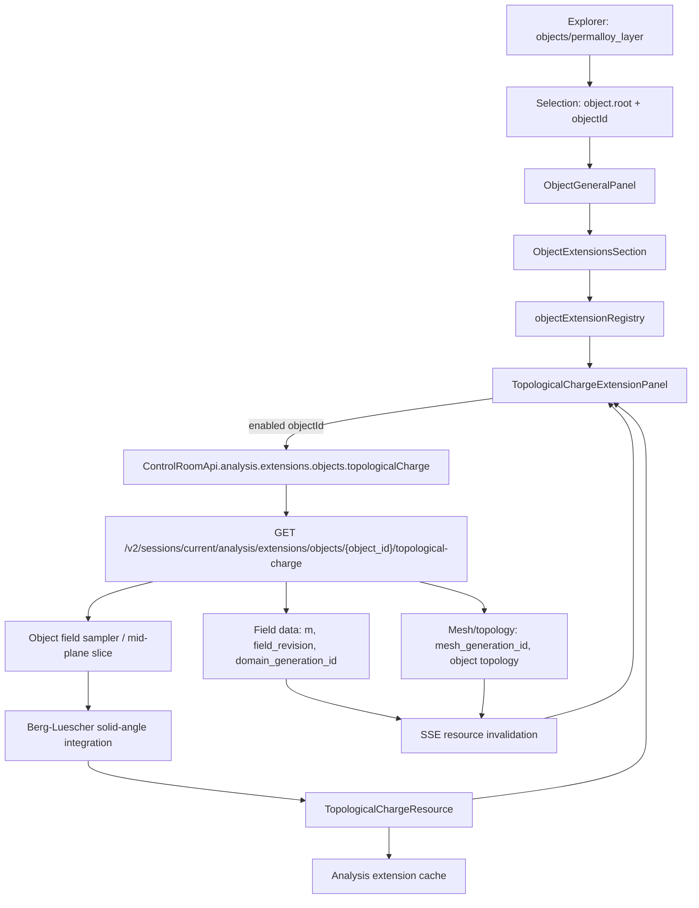

# Object Extensions + Topological Charge - plan implementacji

- Data: 2026-06-26
- Status: SUPERSEDED 2026-07-11 - v1 jest niekwalifikowane produkcyjnie
- Zakres: Control Room object inspector, runtime analysis resources, mesh/field data path

> Ten dokument zachowuje historyczny plan v1 i nie jest instrukcją dalszej
> implementacji. Kanoniczna fizyka znajduje się w
> `docs/physics/0940-topological-charge-observable.md`. Zastępujący plan
> produkcyjny znajduje się w
> `docs/superpowers/plans/2026-07-11-planar-topological-charge-production.md`.
> W szczególności nie wolno dalej implementować opisanych niżej założeń o
> dowolnej ścianie FEM, pochodnej `polarity`, globalnym FDM ani niejawnych
> fallbackach preview.

> Dla agentow implementujacych: przed dotykaniem kodu uzyj `superpowers:subagent-driven-development` albo `superpowers:executing-plans`. To jest plan produkcyjny, nie lista luźnych pomyslow. Kazda faza ma zostawic dzialajacy, testowalny stan.

---

## 1. Cel

Dodać do glownego inspektora obiektu sekcje **Extensions**, widoczna po kliknieciu obiektu typu `objects/permalloy_layer`, w ktorej uzytkownik moze wlaczac moduly analityczne dla konkretnego obiektu.

Pierwszym modulem ma byc **Topological Charge** dla skyrmionow:

1. Uzytkownik klika obiekt w drzewie Explorer, np. `objects/permalloy_layer`.
2. W glownym inspektorze obiektu na dole pojawia sie sekcja `Extensions`.
3. Uzytkownik wlacza modul `Topological Charge`.
4. Backend liczy liczbe topologiczna z rzeczywistego pola magnetyzacji `m` i aktualnego meshu/domeny obiektu.
5. UI pokazuje wynik `Q`, najblizsza liczbe calkowita, blad od calkowitosci, status danych i ostrzezenia.

Kluczowe zalozenie: to **nie jest funkcja shadera ani wizualizacji 3D**. UI tylko aktywuje modul i wyswietla resource. Obliczenie ma byc po stronie runtime/API na danych polowych i mesh/domain metadata.

---

## 2. Aktualny stan kodu

| Obszar | Aktualny mechanizm | Wniosek dla planu |
|---|---|---|
| Glowny inspector obiektu | `apps/control-room/src/modules/inspector/InspectorModule.tsx` wybiera panel przez `resolveInspectorPanel(selection)`. `object.root` mapuje sie w `inspectorRegistry.tsx` na `ObjectGeneralPanel`. | `Extensions` nalezy dodac do `ObjectGeneralPanel`, nie do `GeometryObjectPanel`. |
| Selection object | `selectionTypes.ts` ma selection ref z `objectId`, `nodeId`, `type: "scene-object"` i `visualizationTargetId`. | Kontrakt Extensions moze byc kluczowany po `objectId`. |
| ObjectGeneralPanel | Panel ma juz sekcje accordion: `summary`, `energies`, `resource`, `actions`, `validation`; korzysta z `useObjectMetricsResource(objectId)`. | Dodac dolna sekcje `extensions` jako kolejny model/panel, bez mieszania z metrykami obiektu. |
| UI sections | `InspectorSection.tsx` jest lokalnym prymitywem sekcji. | Zachowac spojny wyglad inspektora, bez nowego systemu kart. |
| Runtime object metrics | `ControlRoomApi.simulation.objects.metrics(objectId)` oraz backend route `/v2/sessions/current/simulation/objects/:object_id/metrics`. | Wzor dla resource-first object-level analysis. |
| Field data path | `FieldVectorQuery` obsluguje `scope_kind=object`, `scope_id`, snapshoty, komponenty, `max_samples`. | Topological Charge ma korzystac z podobnego scope/provenance, ale nie moze byc liczony w React. |
| Mesh/topology path | Backend ma endpointy topologii meshu obiektu i czesci, m.in. `/v2/sessions/current/meshing/meshes/objects/:object_id/topology`. | Modul musi walidowac, ze mesh/domain revision zgadza sie z polem. |
| Analysis namespace | `ControlRoomApi.analysis` i backend `router_v2` maja juz namespace dla analiz. | Nowy resource powinien wejsc do `analysis/extensions/...`, nie do `simulation/objects/metrics`. |
| Cache danych | `QuantityDataPlaneStore` i `BinaryCache` pokazuja wzor cache po revision/domain/scope. | Dodac osobny cache analysis albo rozszerzyc data-plane cache o male JSON resources. |

---

## 3. Granice v1

### W v1 robimy

- Sekcja `Extensions` w glownym inspektorze obiektu.
- Frontendowy registry modulow obiektowych.
- Stan aktywacji modulu per `{objectId, extensionId}`.
- Backendowy resource `TopologicalChargeResource`.
- Obliczenie `Q` dla pola magnetyzacji `m` na pojedynczym obiekcie.
- Walidacja revision: field revision, domain generation, mesh generation.
- Cache wyniku i poprawna invalidacja po zmianie field/mesh/domain.
- Testy numeryczne, API i UI model/panel.

### W v1 nie robimy

- Region-level topological charge.
- Mapy gestosci topologicznej jako overlay w viewport.
- Batch compute dla wielu obiektow.
- Marketplace/SDK extensionow dla zewnetrznych pluginow.
- Zapisu aktywacji extensionow do fizycznego modelu symulacji.
- Naprawy brakujacych faces w renderowanym surface mesh jako czesci tej funkcji. Modul ma wykrywac niespojne mesh/topology dane i raportowac `unavailable` albo `stale`, nie zgadywac wyniku z dziurawej powierzchni.

---

## 4. Architektura docelowa



Najwazniejszy podzial odpowiedzialnosci:

| Warstwa | Odpowiedzialnosc |
|---|---|
| Inspector UI | Pokazuje liste modulow, aktywacje, stan requestu, wynik i ostrzezenia. |
| Frontend model | Decyduje, ktore moduly sa dostepne dla selection i formatuje statusy. |
| API facade | Typowany dostep do resource, bez logiki numerycznej. |
| Backend route | Waliduje obiekt, pole, mesh/domain revisions i obsluguje cache. |
| Analysis kernel | Liczy `Q` z probek pola magnetyzacji. |
| Mesh/field sampler | Dostarcza spojna siatke 2D probek dla obiektu, niezaleznie od surface shadera. |

---

## 5. Kontrakt Extensions w frontendzie

### 5.1 Nowe pliki

| Plik | Rola |
|---|---|
| `apps/control-room/src/modules/inspector/extensions/objectExtensionTypes.ts` | Typy `ObjectExtensionDefinition`, `ObjectExtensionRuntimeState`, `ObjectExtensionPanelProps`. |
| `apps/control-room/src/modules/inspector/extensions/objectExtensionRegistry.ts` | Registry modulow dostepnych dla object inspector. |
| `apps/control-room/src/modules/inspector/extensions/ObjectExtensionsSection.tsx` | Dolna sekcja w `ObjectGeneralPanel`. |
| `apps/control-room/src/modules/inspector/extensions/ObjectExtensionsSectionModel.ts` | Czysty model: dostepnosc, sortowanie, statusy, teksty. |
| `apps/control-room/src/modules/inspector/extensions/useObjectExtensionActivation.ts` | Stan aktywacji per object/module. |
| `apps/control-room/src/modules/inspector/extensions/topological-charge/TopologicalChargeExtensionPanel.tsx` | UI pierwszego modulu. |
| `apps/control-room/src/modules/inspector/extensions/topological-charge/topologicalChargeModel.ts` | Formatowanie wyniku, warningow i statusow. |

### 5.2 Minimalny typ modulu

```ts
export type ObjectExtensionDefinition = {
  id: "topological_charge";
  label: string;
  description: string;
  isAvailable(selection: InspectorSelectionRef): boolean;
  defaultEnabled: boolean;
  Panel: React.ComponentType<ObjectExtensionPanelProps>;
};

export type ObjectExtensionPanelProps = {
  objectId: string;
  enabled: boolean;
  onEnabledChange(enabled: boolean): void;
};
```

W v1 registry jest statyczne i lokalne. Nie dodajemy dynamicznego systemu pluginow, bo pierwszy modul ma byc produkcyjny, a nie framework dla nieznanych przypadkow.

### 5.3 Stan aktywacji

Rekomendacja: aktywacja extensionow jest **stanem UI workspace**, a nie czescia modelu fizycznego ani skryptu study.

Format klucza:

```ts
type ObjectExtensionActivationKey = `${objectId}:${extensionId}`;
```

Zasady:

- Domyslnie wszystkie moduly sa wylaczone.
- Wlaczenie modulu powoduje fetch resource.
- Wylaczenie modulu anuluje/ignoruje request i chowa szczegoly, ale moze zostawic zwarty status ostatniego wyniku.
- Stan jest per obiekt, nie globalny.
- Persistencja do session/workspace moze zostac dodana pozniej; v1 nie zapisuje aktywacji do Python DSL ani modelu symulacji.

### 5.4 Integracja z `ObjectGeneralPanel`

Do `ObjectGeneralPanel` dodac sekcje na koncu:

```tsx
<ObjectExtensionsSection selection={selection} objectId={model.objectId} />
```

Zasady UI:

- Sekcja jest na dole, po `validation`.
- Gdy brak dostepnych modulow, sekcja jest ukryta albo pokazuje zwarty pusty stan tylko w trybie debug.
- Gdy sa moduly, header pokazuje `Extensions` oraz liczbe aktywnych modulow.
- Lista modulow uzywa prostych wierszy z toggle, statusem i wynikiem; bez zagniezdzonych kart.
- `Topological Charge` po wlaczeniu pokazuje wynik i provenance, a nie instrukcje obslugi.

---

## 6. Kontrakt API i backend resource

### 6.1 Endpoint

Nowy endpoint:

```text
GET /v2/sessions/current/analysis/extensions/objects/{object_id}/topological-charge
```

Query params:

| Parametr | Typ | Domyslnie | Znaczenie |
|---|---|---|---|
| `quantity_id` | string | `m` | Pole magnetyzacji uzywane do obliczen. |
| `plane` | `auto`, `xy`, `xz`, `yz` | `auto` | Plaszczyzna probkowania. `auto` wybiera plaszczyzne prostopadla do najcienszego wymiaru obiektu. |
| `resolution` | `auto` albo integer | `auto` | Rozdzielczosc siatki probek w dluzszym wymiarze, ograniczona limitem backendu. |
| `snapshot_id` | string | latest | Snapshot/stage field data, jesli UI wskazuje konkretny stan. |
| `method` | string | `berg_luescher_grid` | Algorytm; w v1 tylko jedna wartosc produkcyjna. |

### 6.2 Response schema

```rust
pub struct TopologicalChargeResource {
    pub object_id: String,
    pub quantity_id: String,
    pub revision: u64,
    pub status: TopologicalChargeStatus,
    pub charge: Option<f64>,
    pub nearest_integer: Option<i64>,
    pub integer_error: Option<f64>,
    pub polarity: Option<String>,
    pub method: String,
    pub plane: String,
    pub sample_grid: Option<TopologicalChargeSampleGrid>,
    pub sample_count: usize,
    pub valid_sample_count: usize,
    pub field_revision: Option<u64>,
    pub domain_generation_id: Option<String>,
    pub mesh_generation_id: Option<String>,
    pub mesh_revision: Option<u64>,
    pub computed_at_unix_ms: u64,
    pub warnings: Vec<TopologicalChargeWarning>,
}
```

Statusy:

| Status | Kiedy |
|---|---|
| `ready` | Wynik jest policzony i zgodny z aktualnym field/mesh/domain revision. |
| `field_missing` | Brak pola `m` dla obiektu. |
| `mesh_missing` | Brak meshu/topologii obiektu potrzebnej do probkowania. |
| `stale` | Field, mesh albo domain revision nie zgadzaja sie z aktualnym stanem. |
| `unsupported_geometry` | Nie da sie wyznaczyc stabilnej plaszczyzny/samplera dla obiektu. |
| `insufficient_samples` | Zbyt malo waznych probek po maskowaniu obiektu. |
| `error` | Blad obliczen z kontrolowanym komunikatem. |

Ostrzezenia:

| Kod | Znaczenie |
|---|---|
| `low_resolution` | Auto-resolution jest ponizej rekomendacji dla rozmiaru obiektu/meshu. |
| `boundary_samples_missing` | Czesc probek przy brzegu obiektu zostala odrzucona. |
| `non_unit_magnetization` | Wektor `m` wymagal normalizacji albo mial zbyt mala norme. |
| `mesh_surface_incomplete` | Surface topology ma niespojnosci; wynik oparto na volume/slice samplerze albo zwrocono `unsupported_geometry`. |
| `field_mesh_revision_mismatch` | Dane pola i meshu nie pochodza z tego samego generation/revision. |

### 6.3 Lokalizacja w backendzie

| Plik | Zmiana |
|---|---|
| `crates/fullmag-api/src/router_v2/mod.rs` | Dodac route w namespace `analysis/extensions/objects`. |
| `crates/fullmag-api/src/router_v2/handlers/analysis/extensions.rs` | Nowy handler endpointu. |
| `crates/fullmag-api/src/schemas/analysis_extensions.rs` | Schematy `TopologicalChargeResource`, statusy, warningi, query. |
| `crates/fullmag-api/src/openapi_v2.rs` | Rejestracja path i schemas. |
| `crates/fullmag-api/src/types.rs` | Dodac analysis extension cache/store do `AppState`. |
| `crates/fullmag-api/src/analysis/topological_charge.rs` | Czysty kernel numeryczny i unit testy. |
| `crates/fullmag-api/src/analysis/object_field_sampling.rs` | Sampler obiektowy 2D z field/mesh/domain provenance. |

---

## 7. Algorytm Topological Charge

### 7.1 Definicja

Dla znormalizowanego pola magnetyzacji `m(x, y)`:

```text
Q = 1 / (4*pi) * integral m dot (partial_x m cross partial_y m) dA
```

W produkcyjnym v1 nie liczymy tego przez roznice skonczone w React ani przez dane shadera. Backend probkuje pole i uzywa dyskretnego algorytmu solid-angle.

### 7.2 Dyskretyzacja

Rekomendowany algorytm: Berg-Luescher / suma katow brylowych po trojkatach siatki 2D.

Dla kazdego zorientowanego trojkata z wektorami jednostkowymi `m1`, `m2`, `m3`:

```text
Omega = 2 * atan2(
  dot(m1, cross(m2, m3)),
  1 + dot(m1, m2) + dot(m2, m3) + dot(m3, m1)
)

Q = sum(Omega) / (4*pi)
```

Zalety:

- Stabilniejszy dla skyrmionow niz proste pochodne numeryczne.
- Naturalnie daje wynik bliski liczbie calkowitej przy dobrze rozdzielonej teksturze.
- Mozna go latwo testowac na analitycznych polach syntetycznych.

### 7.3 Probkowanie obiektu

`plane=auto`:

1. Pobierz bounds obiektu z aktualnego realized geometry/mesh metadata.
2. Znajdz najciensza os.
3. Ustaw plaszczyzne srodkowa prostopadla do tej osi.
4. Dla cienkich filmow `permalloy_layer` zwykle oznacza to `xy` w polowie grubosci.

Sciezki probkowania:

| Backend | Probkowanie |
|---|---|
| FDM / regular grid | Uzyc natywnej siatki pola, ograniczonej do `scope_kind=object`. |
| FEM / tetra mesh | Uzyc istniejacej logiki slice/interpolacji tetra linear, nie surface faces. |
| Brak zgodnego samplera | Zwrocic status `unsupported_geometry` z warningiem. |

Zasady:

- Kazda probka `m` jest normalizowana przed algorytmem.
- Probki o normie ponizej progu sa odrzucane i raportowane.
- Komorki z niekompletnymi probkami nie wchodza do sumy.
- Wynik jest `ready` tylko gdy `valid_sample_count` przekracza prog i pokrycie obiektu jest wystarczajace.
- Przy cienkim filmie nie sumujemy top i bottom surface, bo to mogloby podwoic albo zniesc wynik. Liczymy jedna srodkowa plaszczyzne.

---

## 8. Cache i invalidacja

### 8.1 Cache key

```text
topological_charge:
  object_id
  quantity_id
  field_revision
  domain_generation_id
  mesh_generation_id
  mesh_revision
  snapshot_id
  plane
  resolution
  method
```

Cache jest maly, JSON-owy i moze miec osobny LRU store, analogiczny stylem do `QuantityDataPlaneStore`, ale bez mieszania z binarnymi payloadami field/vector.

### 8.2 Invalidacja

Endpoint musi byc invalidowany po:

- nowym compute fields dla `m`,
- zmianie snapshot/stage,
- przebudowie meshu,
- zmianie `domain_generation_id`,
- zmianie geometrii obiektu,
- zmianie material/texture, jesli powoduje nowy field revision albo wymaga recompute.

SSE/resource invalidation powinno emitowac resource path:

```text
analysis/extensions/objects/{object_id}/topological-charge
```

Frontend nasluchuje jak dla innych resource. Jesli modul jest wlaczony, odswieza wynik; jesli wylaczony, nie robi requestu.

---

## 9. Doswiadczenie UI

### 9.1 Sekcja `Extensions`

Docelowy uklad:

```text
Object: permalloy_layer
...
Validation

Extensions                                           Active: 1
  [x] Topological Charge                     ready   Q = -0.997
      nearest: -1   error: 0.003
      m · xy mid-plane · 192 x 192 samples
      field rev 42 · mesh gen 18
```

Stany modulu:

| Stan | UI |
|---|---|
| Wylaczony | Jeden wiersz z toggle i zwarta etykieta modulu. |
| Loading | Spinner/status przy module, bez blokowania calego panelu. |
| Ready | `Q`, nearest integer, error, plane, resolution, provenance. |
| Missing field | Zwarty komunikat i akcja prowadzaca do compute fields, jesli taka akcja istnieje w kontekście. |
| Stale | Wynik wyszarzony, status `stale`, informacja ktory revision sie rozjechal. |
| Unsupported | Krotki powod z backendu; bez fallbacku do danych shadera. |
| Error | Kontrolowany komunikat, retry button. |

### 9.2 Optymalizacja UX

- Request startuje dopiero po wlaczeniu modulu.
- Zmiana selection na inny obiekt nie kasuje aktywacji poprzedniego obiektu.
- Sekcja nie przeladowuje calego `ObjectGeneralPanel`; request jest lokalny do modulu.
- Wynik nie powoduje re-renderu viewportu.
- Nie dodajemy drugiego colorbara ani zadnych efektow w 3D.

---

## 10. Fazy implementacji

### Faza 1 - Frontend scaffold bez obliczen

| Krok | Zmiana | Acceptance |
|---|---|---|
| 1.1 | Dodac typy i statyczny `objectExtensionRegistry`. | Registry zwraca `Topological Charge` tylko dla `object.root` z `objectId`. |
| 1.2 | Dodac `ObjectExtensionsSection` do `ObjectGeneralPanel`. | Po kliknieciu `objects/permalloy_layer` widac sekcje na dole. |
| 1.3 | Dodac per-object activation store. | Toggle dziala per obiekt i nie mutuje study/modelu. |
| 1.4 | Dodac placeholder resource state `disabled/not_configured`. | Brak requestow API przy wylaczonym module. |
| 1.5 | Testy modelu i panelu. | Test pokrywa dostepnosc, toggle i brak requestu przy disabled. |

### Faza 2 - Kontrakt API i typed facade

| Krok | Zmiana | Acceptance |
|---|---|---|
| 2.1 | Dodac backend schemas dla query/response/status/warnings. | OpenAPI generuje nowe typy bez recznej edycji artefaktow. |
| 2.2 | Dodac route `analysis/extensions/objects/{object_id}/topological-charge`. | Endpoint zwraca kontrolowane `field_missing`/`mesh_missing`, nie 500. |
| 2.3 | Dodac `ControlRoomApi.analysis.extensions.objects.topologicalCharge`. | Frontend korzysta z jednej typed facade. |
| 2.4 | Dodac frontend hook/resource fetch. | Modul pobiera resource tylko gdy jest wlaczony. |

### Faza 3 - Kernel numeryczny i testy syntetyczne

| Krok | Zmiana | Acceptance |
|---|---|---|
| 3.1 | Dodac `analysis/topological_charge.rs` z solid-angle integration. | Uniform magnetization daje `abs(Q) < 1e-6`. |
| 3.2 | Dodac generator analitycznego skyrmionu na gridzie. | Skyrmion daje `Q` blisko `+1` albo `-1` zgodnie z orientacja. |
| 3.3 | Obsluzyc zero-length/non-unit vectors. | Test potwierdza warning i brak panic. |
| 3.4 | Dodac tolerancje zalezne od resolution. | Testy sa stabilne bez bardzo gestych siatek. |

### Faza 4 - Object field sampler i mesh/domain provenance

| Krok | Zmiana | Acceptance |
|---|---|---|
| 4.1 | Podlaczyc latest field `m` dla `scope_kind=object`. | Endpoint rozroznia `field_missing` od `mesh_missing`. |
| 4.2 | Dodac wybor plaszczyzny `auto`. | `permalloy_layer` wybiera mid-plane cienkiej osi. |
| 4.3 | Dla FDM uzyc natywnej regularnej siatki. | Wynik dla syntetycznego FDM fixture jest poprawny. |
| 4.4 | Dla FEM uzyc slice/interpolation path po tetra/volume data. | Nie ma zaleznosci od surface faces ani Three.js geometry. |
| 4.5 | Zwrocic `mesh_surface_incomplete` dla niespojnej topologii, jesli sampler wykryje problem. | Backend nie liczy wyniku z uszkodzonego surface-only path. |

### Faza 5 - Cache, invalidacja i stale-state

| Krok | Zmiana | Acceptance |
|---|---|---|
| 5.1 | Dodac LRU cache dla `TopologicalChargeResource`. | Drugi request dla tego samego key nie przelicza kernela. |
| 5.2 | Dodac cache key z field/domain/mesh revision. | Zmiana revision wymusza nowy wynik. |
| 5.3 | Emitowac invalidation dla extension resource po compute fields i mesh rebuild. | Wlaczony modul odswieza wynik bez recznego reloadu. |
| 5.4 | UI pokazuje `stale`, jesli backend zglosi rozjazd revisions. | Nie wyswietlamy starego `Q` jako aktualnego. |

### Faza 6 - Produkcyjny UX i live smoke

| Krok | Zmiana | Acceptance |
|---|---|---|
| 6.1 | Dopolerowac statusy, empty states i warningi w panelu. | Panel jest zwarty i pasuje do reszty object inspector. |
| 6.2 | Dodac smoke fixture dla skyrmionu. | Command/just recipe uruchamia skyrmion field i sprawdza `Q≈integer`. |
| 6.3 | Dodac Playwright/RTL test flow: click object, enable extension, see result. | UI flow jest pokryty bez recznego klikania. |
| 6.4 | Sprawdzic brak regresji viewport/colorbar. | Wlaczenie modulu nie dodaje colorbara i nie zmienia 3D render state. |

---

## 11. Test plan

| Warstwa | Test |
|---|---|
| Rust unit | Uniform field -> `Q=0`; analityczny skyrmion -> `Q≈±1`; reversed polarity/sign; non-unit vectors; missing samples. |
| Rust API | Missing object, missing field, missing mesh, stale revisions, successful resource, cache key invalidation. |
| OpenAPI | Nowe schemas i route obecne w `openapi-v2`. |
| Frontend model | Registry, activation per object, status formatting, warning mapping. |
| Frontend panel | Sekcja w `ObjectGeneralPanel`, toggle, fetch only when enabled, ready/missing/stale/error states. |
| Integration smoke | Skyrmion example/headless run -> endpoint zwraca `ready` i `abs(Q - round(Q)) < tolerance`. |
| Regression viewport | Wlaczenie extension nie zmienia colorbarow, quantity coloring ani viewport render state. |

Minimalne komendy weryfikacyjne po implementacji:

```text
pnpm --dir apps/control-room test
pnpm --dir apps/control-room typecheck
pnpm --dir apps/control-room lint
cargo test -p fullmag-api topological_charge
just run-topological-charge-skyrmion-smoke cpu
```

Jesli repo nie ma jeszcze ostatniej recipe, faza 6 ma ja dodac jako lekki smoke zamiast uruchamiac pelny, dlugi pipeline meshu.

---

## 12. Ryzyka i zabezpieczenia

| Ryzyko | Zabezpieczenie |
|---|---|
| Wynik policzony z danych renderera zamiast fizyki. | Obliczenia tylko backend; UI nie ma kernela numerycznego. |
| Brakujace faces w surface mesh falszuja wynik. | FEM path korzysta z volume/slice interpolation; surface-only niespojnosc daje warning/status. |
| Field i mesh pochodza z roznych rewizji. | Resource zawiera field/domain/mesh provenance i cache key po revisions. |
| Modul odpala kosztowne obliczenia dla kazdego zaznaczenia. | Fetch tylko po wlaczeniu; cache po key; limit resolution. |
| Extension state zanieczyszcza model symulacji. | Aktywacja zostaje w UI workspace state, nie w Python DSL/study IR. |
| Top/bottom surface cienkiego filmu podwaja wynik. | Domyslnie jedna mid-plane slice, nie suma powierzchni. |
| Za gruba siatka daje niecalkowity wynik. | Warning `low_resolution`, `integer_error`, ustawialne `resolution`. |

---

## 13. Definicja gotowosci

Funkcja jest gotowa dopiero gdy:

1. `objects/permalloy_layer` pokazuje sekcje `Extensions` w glownym inspectorze.
2. `Topological Charge` mozna wlaczyc i wylaczyc per obiekt.
3. Endpoint backendowy zwraca typowany resource dla aktualnego pola `m`.
4. Obliczenie `Q` przechodzi testy syntetyczne `0` i `±1`.
5. Resource niesie field/mesh/domain provenance.
6. Zmiana field/mesh invaliduje albo przelicza wynik.
7. UI rozroznia `ready`, `missing`, `stale`, `unsupported`, `error`.
8. Wlaczenie modulu nie zmienia viewportu, shadera ani colorbarow.
9. Live smoke dla skyrmionu potwierdza wynik bliski liczbie calkowitej.
10. Dokumentacja kontraktu API i OpenAPI sa aktualne.

---

## 14. Kolejnosc startu dla implementacji

Najbezpieczniejsza kolejnosc:

1. Zrobic Faze 1, bo daje miejsce w UI bez ryzyka numerycznego.
2. Zrobic Faze 2 z endpointem zwracajacym kontrolowane statusy, jeszcze bez pelnego kernela.
3. Zrobic Faze 3 na czystych danych syntetycznych.
4. Dopiero potem laczyc kernel z realnym field/mesh samplerem w Fazie 4.
5. Na koncu cache/invalidation i live smoke.

Taka kolejnosc zapobiega sytuacji, w ktorej UI wyglada na gotowe, ale wynik `Q` jest liczony z przypadkowego snapshotu, starego meshu albo danych surface renderera.
