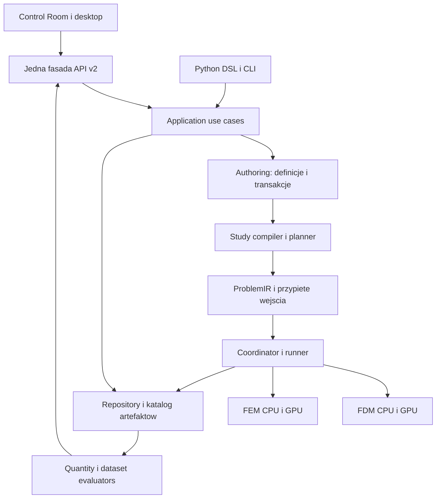

# Architektura i kontrakty finalnego planu Fullmag

Status: **PROPOSED**. To specyfikacja docelowa, nie dokumentacja istniejącego SDK. Nazwy nowych typów i zasobów oznaczają proponowane kontrakty. Rejestr zgodności z istniejącymi ADR: [05](05-dowody-i-adr.md). Niniejszy dokument scala K01–K18 [kontraktów wejściowych](../02-kontrakty.md), zachowując ich zakres i wprowadzając rozstrzygnięcia poniżej.

## 1. Granice produktu i kodu

Projekt CAE jest dokumentem użytkownika. Repozytorium źródeł/build storage jest infrastrukturą hosta. `ProjectId` identyfikuje dokument CAE; `worktree_id` identyfikuje źródła builda. Żaden z tych identyfikatorów nie zastępuje drugiego. Nie zmieniamy `FULLMAG_PROJECT_STORAGE_ROOT`; ścieżki wyprowadza istniejący resolver z konfiguracji hosta. Eksport użytkownika jest jawną operacją, nie nowym domyślnym katalogiem buildów.

Powstaje jedna biblioteka `fullmag-application`, bez zależności od HTTP, React i pętli numerycznych. Jej wewnętrzni właściciele to use cases definicji, przyjęcie komend, koordynacja wykonania i publikacja katalogu. Implementacje storage i workerów są podłączane przez porty. Nie przenosimy całego `orchestrator.rs` do `ProjectManager`.

| Właściciel | Zakres | Granica |
|---|---|---|
| `fullmag-authoring` | Project/Model/Component, parametry, geometria, selekcje, przypisania, semantic commands | Nie uruchamia solve przy edycji. |
| `fullmag-ir` / `fullmag-plan` | Problem fizyczny, walidacja, plan, capabilities | Jedna semantyka dla Python i UI; bez stanu docków. |
| `fullmag-application` — nowy | Create/Open/Save/Submit/Cancel, coordinator, katalog | Jeden writer danego agregatu; trwały ACK. |
| `fullmag-session` | CAS, working store, manifesty, profile `.fms`, recovery i checkpoint | Ewolucja istniejącego formatu; oryginały zachowane. |
| `fullmag-runner` | Przypięte wejścia, wywołania backendów, obserwacja, provenance | Nie czyta mutable current jako wejścia runu. |
| `backends/fem` | MFEM/hypre/libCEED; numeryka CPU/GPU | Właściciele operatorów i workflows poza `Context`/bridge. |
| `backends/fdm`, `fullmag-engine`, `fullmag-fdm-demag`, sys crates | Istniejące realizacje i granice FDM | Konflikt opisu CPU rozstrzyga P0-D; brak automatycznej relokacji. |
| `fullmag-quantities` | Katalog, deskryptory, ewaluacja i redukcje | Jeden właściciel semantyki wielkości, bez URL i komponentów UI. |
| `fullmag-api` | Zasoby i komendy v2, schema, błędy | Adapter use cases, bez drugiego schedulera. |
| `fullmag-cli`, `fullmag-py-core`, `fullmag-py` | Entry points, binding, DSL i kompatybilność skryptów | Headless nie wymaga serwera GUI. |
| `apps/control-room` | Jeden kernel, klient, resource hooks, adaptery i workspace | Jeden system renderowania dla primitives/FDM/FEM. |
| `apps/desktop` | Hostowanie, okna, otwieranie plików, lifecycle procesu | Ten sam application kernel i te same dane co web. |
| `fullmag-build-info`, `fullmag-bench`, `native`, `scripts` | Identyfikacja źródeł, pomiary, packaging i managed execution | Zachować istniejące receipts i kontrolę storage. |

## 2. K01–K03: definicje, wykonania i widoki

Projekt zawiera wiele modeli, studies, konfiguracji solvera, profili wykonania, przypiętych bibliotek oraz receptur wynikowych. Model zawiera komponenty, geometrię, selekcje, fizykę i receptury dyskretyzacji. Component nie oznacza osobnego solve: oddziaływania między komponentami pozostają w wspólnym problemie.

`SceneDocument` jest wejściem migracji i projekcją dla obecnych klientów. W okresie przejściowym tylko jeden aggregate jest zapisywalną prawdą. Nie utrzymujemy synchronizowanych dwukierunkowo kopii „nowy model ↔ stara scena ↔ skrypt”. `ProblemIR` pozostaje granicą rozstrzygniętej fizyki; nie gromadzi draftów i historii UI.

Rozdzielamy:

- **Definicję**: ID, schema version, revision, semantyczny journal, immutable snapshots.
- **Run**: RunId, przypięty snapshot, plan, cases, wykonane próby i ich dziennik.
- **Artefakt**: immutable manifest i dane, osobny katalog referencji oraz retention.
- **Widok**: ViewId, kamera/target, dataset, przekrój, warstwy, paleta i display units. Odtwarzalne ustawienia żyją poza lifecycle renderera.

Kamera, selection i focus są niezależne. Zmiana prezentacji może zapisać wersję ustawień widoku, ale nie zmienia fingerprintu fizyki ani wejścia działającego runu.

### Tożsamości i cztery różne epoki

| Pojęcie | Znaczenie | Nie zastępuje |
|---|---|---|
| DefinitionRevision / SnapshotId | Wersja authoringu i przypięte wejście | Kroku solvera. |
| `AcceptedStateRef` z ADR-0025 | Content-bound run/stage/step + digests clock/state/domain/plan; lokalna generation | Task ownership. |
| OwnershipEpoch | Prawo próby do publikowania wyniku | Runtime epoch ani UI session epoch. |
| RuntimeEpoch + accepted revision | Guard polecenia do rezydentnego runtime | Trwałego content ID. |
| UI context/session epoch | Odrzucanie odpowiedzi poprzedniego kontekstu | Dowodu własności workera. |

Rozwijamy `sessionScopedResourceKey`, nie reinterpretujemy jego epoki jako fencing. Klucz zasobu docelowo obejmuje odpowiedni podzbiór ProjectId, RunId/SolutionId, resource ID/revision, context epoch oraz carrier/space identity. Nie wszystkie zasoby muszą mieć RunId: definicja istnieje bez runu. Weryfikacja tokena odbywa się po HTTP, po dekodowaniu w workerze i przed zastosowaniem danych przez renderer.

## 3. K04–K05 i K17: edycja, jednostki i Compute

Komenda edycji zawiera ProjectId, `expected_revision`, `client_intent_id` i typowany payload. Serwer zapisuje digest żądania i rezultat. Powtórzenie zgodnej komendy zwraca pierwotny rezultat; ponowne użycie klucza z innym payloadem daje konflikt. Zależne zmiany w jednym projekcie są transakcją. Konflikt rewizji zwraca aktualną rewizję i diagnostykę; nie nadpisuje nowszej pracy.

Undo/Redo jest kolejną semantyczną transakcją z kontrolą konfliktów. Preview przeciągania jest odraczany i anulowalny; zatwierdzony gest daje jeden wpis. Undo nie anuluje runu i nie usuwa jego danych.

ParameterContext rozstrzyga scope `project → model/component → study override → case`. AST przechowuje symbol IDs, wymiary, oryginalny zapis i zależności; wykonanie używa SI. Brak `eval` arbitralnego kodu. Cykle i niezgodne jednostki dają dokładną ścieżkę błędu. Funkcje czasowe/przestrzenne mają frame, zakres i zasady interpolacji. Materiał wskazuje przypiętą wersję biblioteki.

Oryginalna jednostka wyrażenia należy do definicji. Preferencja wyświetlania może być zapisana w metadanych prezentacji parametru i nadpisana per ViewId; nie wchodzi do fingerprintu numerycznego. `H` w A/m oraz `B` w T są różnymi wielkościami. Projekcja `μ₀H` wymaga jawnej etykiety i konwersji, nie podmiany jednostki.

Niekompletny model jest zapisywalny. Niedokończony tekst `sin(` jest draftem formularza, nie poprawnym AST. Save zachowuje definicję i osobny recovery draftów. Compute najpierw uzgadnia właściwe drafty, oczekuje ACK i dopiero przypina rewizję. Alternatywne „Compute last committed version” musi pokazać pominięte zmiany. Close dokumentu nie jest Cancel runu.

## 4. Geometria, dyskretyzacja i selektywne unieważnianie

Zachowujemy cztery grafy: zależności definicji, powiązania fizyczne, plan wykonania study oraz zależności artefaktów. Drzewo Explorer jest ich projekcją użytkową; nie staje się uniwersalnym wykonawcą dowolnego JSON graph.

`GeometryArtifact`, `DisplayArtifact` oraz `DiscretizationArtifact` mają osobne tożsamości. Build Geometry, Build Grid, Build Mesh i Compute są jawnymi akcjami. Błąd przygotowania pozostawia definicję i ostatni poprawny artefakt wraz z jego pochodzeniem.

GeometryFeature zachowuje ID, typ, wejścia, parametry i nazwane wyjścia. Najpierw migrujemy istniejące prymitywy, CSG, Translate, waveguides i importy. `rotation_quat`/`scale` są zachowane bezstratnie; nieobsługiwana realizacja daje diagnostykę przed Compute. Nie obiecujemy dowolnego B-Rep ani nowego jądra CAD. Selekcja po split/merge ma lineage i certyfikat albo jawne ambiguity; sam indeks ściany nie jest trwałym ID.

| Zmiana | Domyślne unieważnienie |
|---|---|
| Nazwa, kamera, display units | Wyłącznie metadane/prezentacja. |
| Geometria, siatka, frame selekcji | Zależna topologia/membership/space i dalsze artefakty. |
| Materiał `Ms`/`Aex` | Coefficients/operators/solution; mesh tylko przy jawnej zależności receptury, np. kalibracji długością wymiany. |
| Initial magnetization / tekstura | Initial state/solution; bez automatycznego remesh. |
| Frozen Spins activation | Przypięty source state, support i activation; zgodnie z ADR-0026. |
| Nowy punkt frequency response | Zależny solve; reuse tylko zgodnych operatorów. |
| Plot component/scale/cut | Receptura datasetu/prezentacja, gdy zapisano wystarczające dane. |

Punktem wyjścia jest `classify_region_realization_impact`; rozszerzamy jego zależności, certyfikaty i producentów. Nieznane zależności blokują reuse. Przeniesienie stanu na nowy mesh jest jawnym transferem z błędem/provenance; nie jest ExactResume.

## 5. K06–K09: studies, immutable run i worker

StudyStep ma typowane input/output ports, model, solver config, discretization, acceptance policy i acquisition policy. Dopuszczalne źródła to authored initial state, pinned artifact, step output z case mapping albo explicit continuation. „Latest” widziane w UI musi zostać rozstrzygnięte do konkretnego źródła podczas Submit.

RunSpecification przypina snapshot, study plan version, parametry/seedy, immutable assets i requested execution. Brak przyszłego equilibrium/meshu jest typowaną zależnością, nie pustym polem później wypełnianym z current. `ResolvedTaskInput` wiąże finalne artefakty i plan przed uruchomieniem konsumenta. Preflight semantyczny poprzedza kosztowne przygotowanie; finalna walidacja sprawdza rzeczywistą topologię, przestrzeń, target i certyfikaty.

Independent sweep zachowuje niezależne przypadki. Continuation/histereza używa wyjścia poprzedniego punktu. Failed predecessor nie dostarcza domyślnego stanu. Pętle sprzężeń mają własną metodę i kryterium zbieżności; nie stają się przypadkową kolejnością tasków frontendowych.

Coordinator zapisuje accepted intent przed ACK, deduplikuje żądania, przydziela TaskId/AttemptId/OwnershipEpoch i resource lease. Po awarii najpierw reconciliation, potem ewentualny retry z nowym AttemptId. Dostarczenie at-least-once nie jest obietnicą exactly-once obliczeń. Publikacja efektów jest fenced i idempotentna.

Stan tasku: accepted/queued/preparing/running/stopping/succeeded/failed/cancelled/interrupted. `blocked` jest osobnym stanem gotowości z przyczynami. Stan obserwacji live/stale/disconnected/reconciling nie zmienia automatycznie stanu procesu. Ocena naukowa converged/tolerance_not_met/limit_reached/invalid/unassessed pozostaje odrębna.

W pierwszym wdrożeniu jeden aktywny lease compute na fizyczne GPU, również dla kosztownego historycznego materializera. Wyższa współbieżność wymaga pomiaru peak memory i jawnej polityki. Lease obejmuje tożsamość urządzenia, budżet i epokę. Utrata heartbeat nie dowodzi zwolnienia VRAM: przed ponownym przydziałem potwierdzić zatrzymanie starego procesu albo odizolowanie urządzenia. Admission obejmuje RAM, storage i procesy meshingu. OOM nadal musi mieć jawną obsługę; limit współbieżności nie gwarantuje jego braku.

Rezydentny LiveRuntime zachowuje rezerwację pamięci/urządzenia także między krokami. Kolejny zgodny task może użyć tej samej rezerwacji; niezgodny czeka na jawne close lub udany kontrolowany swap zgodnie z ADR-0025. Scheduler nie zwalnia lease tylko dlatego, że stage skończył się, i nie stosuje ukrytego eviction. UI pokazuje powód oczekiwania oraz dozwoloną akcję zwolnienia runtime; historyczny materializer na tym samym GPU również respektuje ten budżet.

## 6. Numeryka i K13: accepted state, obserwacja, restart

Nie wprowadzamy nowej fizyki przez refaktor. Parametry, pola/weak forms, energie, residuals, BC, constraints i observables pozostają przy właścicielach oddziaływań. Workflows run/relax/eigen/response używają ich przez kontrolowane interfejsy. Warstwa application nie dostaje callbacku JSON/Python na każdą komórkę lub timestep.

FEM zachowuje jawne strategie: `poisson_airbox_dirichlet`, `poisson_airbox_robin`, `poisson_airbox_pbc_reduced`, `fem_bem_fredkin_koehler`; BEM/FMM/mapped exterior pozostają zgodnie z faktycznym zakresem wsparcia. Wspólny interfejs nie pozwala zamieniać modelu demag ani dodawać airboxa jako ukrytego fallbacku. CPU nie wymaga GPU residency; forced GPU nie przechodzi do `hybrid_cpu_poisson`.

AcceptedStateRef konsumuje ADR-0025. Integrator publikuje wyłącznie zaakceptowany krok; odrzucenie przywraca wymagany stan RNG, historii, constraints i nośników sprzężonych. Steering jest komendą do konkretnego accepted state, stosowaną w safe point. ACK określa faktyczny krok/czas i nowy segment. Zmiana draftu nie jest steeringiem.

AcceptedStateRef jest obecnie nazwanym kontraktem ADR, nie potwierdzonym istniejącym API o tej nazwie w `crates`. Zachowujemy istniejące lane-local commit/rollback i field revisions jako adaptery; ich obecność nie dowodzi wspólnego durable publishera ani fencing.

LiveRuntime zachowuje kompatybilne operatory do jawnego close/swap lub awarii. ObservationRuntime działa na przypiętym stanie historycznym bez mutacji live i bez jego publishera. Odczyt istniejących wyników nie uruchamia solve. Jawne obliczenie brakujących derived quantities jest osobną operacją z kontrolą primary carriers, admission i capability; nie może udawać zwykłego GET.

Checkpoint rozróżnia ExactResume, LogicalResume, InitialConditionImport, ConfigOnly i zachowuje restart ABI oraz problem/plan/layout/discretization identity. Pełny checkpoint obejmuje wymagane przez lane primary/aux state, zegar, integrator, RNG, constraints i transport. Brak danych obniża klasę lub odrzuca operację z wyjaśnieniem. Nie ma automatycznego exact resume między urządzeniami.

## 7. K10 i K14: trwałość, publikacja, GC, migracja

Publikacja ma kolejność: zapis danych do unikalnego staging → zamknięcie i potwierdzenie trwałości według profilu filesystemu → checksum/coverage → kontrola ownership i kontraktu → commit manifestu/katalogu → event invalidacji. Manifest jest markerem kompletności; checkpoint state musi istnieć przed jego publikacją. Sam `rename` albo `flush` nie jest dowodem odporności na power loss.

Pierwsza kwalifikacja zapisu obejmuje wspierane lokalne filesystemy. SMB nie dostaje automatycznie trybu writable: do czasu dowodu blokady i durability read-only albo kontrolowana odmowa. Nie zakładamy przenośności POSIX directory fsync na Windows. Warstwa platformowa określa dostępne gwarancje oraz błąd dla nieobsługiwanej operacji. Przerwanie procesu i utrata zasilania mają odrębne klasy dowodów.

GC domyślnie przygotowuje plan bez usuwania. Mark obejmuje całe transitive closure projektów, runów, solutions, checkpoint descriptors/chunks, dokumentów, recovery, eksportów i aktywnych/pinned leases. Uszkodzony korzeń lub nieznany schema oznacza niepełny skan i brak sweep. Plan apply wiąże generation katalogu i leases; przed usunięciem ponownie waliduje stan, aby uniknąć wyścigu mark–sweep. Apply wymaga jawnego zakresu i autoryzacji. Testy pracują wyłącznie na syntetycznym store.

Ten sam typed walker referencji obsługuje GC, eksport i weryfikację restore. Capture zapisuje materialne powiązania primary/aux blobs, nie sam opis „conceptually referenced”. Archiwum bez wszystkich wymaganych payloadów nie jest Solved/Resume. ID w JSON manifestu podlega walidacji zanim stanie się fragmentem ścieżki; poprawne nazwy wpisów ZIP nie zastępują containment repository. Wszystkie ścieżki writerów, w tym `commit_session` i `write_document`, sprawdzają granicę storage i symlink/junction escape.

Docelowe `fullmag session gc` startuje zawsze jako dry-run; fizyczny sweep wymaga `--apply`, scope, ważnego owner/GC lease i aktualnego mark. Nie może pozostać boczna destrukcyjna ścieżka starego `SessionStore::gc`. Acquire jest atomowy (native exclusive lock albo poprawny create-new protocol), zawiera owner token, host i process-start identity; heartbeat/expiry nie pozwalają przejąć zasobu od nieuzgodnionego żywego workera. Unlock sprawdza token. Foreign-host lock jest rozstrzygany kontrolowaną procedurą, nie lokalnym PID probe.

Trwały manifest referuje zasoby przez semantic identity/content hashes/output ports. Nowy writer nie zapisuje routowalnego `current`. Zakaz dotyczy referencji wykonawczych, nie np. DOI, opisowego provenance lub źródłowego URL importu. Transport wylicza adres z przypiętej identity, nigdy z właśnie aktywnego projektu UI.

Stare manifesty z `*_resource_key` migrujemy do nowych obiektów: source hash → parser wersji → immutable refs → nowy manifest/hash → migration report → nowy root. Oryginały i hash-addressed blobs pozostają niezmienione. Nieznany klucz daje zachowanie payloadu i brak legalnej referencji, nie globalny string replace. Migracja jest restartowalna i idempotentna. Stary klient nie zapisuje nowego formatu; rollback używa starej kopii lub read-only.

Hash wejścia jest liczony z dokładnych bajtów `.fms`; oryginał pozostaje pod pierwotną ścieżką. Wynik ma nową ścieżkę, publikowaną przez staging i zweryfikowany durable rename, oraz mapę old-hash→new-hash. Inwentarz obejmuje też `session_id="current"`, `run_id="current"` i `run:current`. Brak prawdziwej identity w starych danych wymaga ograniczenia odczytu lub jawnego mapowania z dowodem, nie zgadywania na podstawie aktywnego UI.

CAS pozostaje dla immutable obiektów; istniejący zapis chunkowany trajektorii nie jest przepisywany do monolitycznych blobów. Nie ustalamy progu 1 GB ani nie obiecujemy zero-copy bez profilu. Integrity verification pozostaje obowiązkowa; można przesunąć koszt poza krytyczną pętlę i amortyzować go przed publikacją. Przenośne `.fms` oraz working store są odrębne; autosave nie przepakowuje ZIP przy Apply.

## 8. K11–K12 i K18: pola, wyniki i analiza

Zachowujemy `fullmag-quantities` oraz rozdział dataset/axis/sample/item/branch/field z ADR-0029. `DatasetDefinition` jest recepturą; zmaterializowany wynik receptury ma własne immutable ID/revision. Receptura nie zastępuje istniejącej tożsamości datasetu artefaktu.

FieldDescriptor wiąże quantity, jednostki, rank, frame, sample location, support, topology/carrier, function space/basis, DOF order/layout, axes i normalization. FunctionSpaceDescriptor przenosi także family/order, vector dimension, ordering, constraints/partition oraz orientację/mapowanie, jeśli wymaga ich realizacja. Duże indeksy DOF i mapy są binary references, nie ciężkim JSON. Pole z tego samego DOF count, ale innym space/layout jest odrzucane.

Pierwszy format zespolony zachowuje istniejący model real/imag i jawne metadata: precision, storage layout/endianness, component axis, harmonic convention, basis i normalization. Nie wymagamy automatycznego dodania C64/C128. Każdy producer/consumer przechodzi roundtrip; późniejsze dtype rozszerza wersjonowany schema. `object_ref` wskazuje obiekt, checksum opisuje dokładnie zadany payload/range; dla pełnego obiektu CAS zgodność musi być sprawdzana, a sprzeczność odrzucona.

Modal coefficients wymagają basis + equilibrium/linearization source i reguły rekonstrukcji. Amplituda animacji nie jest fizyczną amplitudą odpowiedzi wymuszonej. Nie wprowadzamy z raportowych makiet nowych algorytmów ani etykiet „RK4 Dormand–Prince”, „S21 z dowolnej FFT” czy niesprawdzonych parametrów.

DerivedValueDefinition określa źródło, operator, miarę całkowania/support, resolution i approximation policy. `PreviewOnly` nie zasila ilościowego wyniku. Porównanie FDM/FEM wymaga jawnej projekcji i metryk błędu. Braki not_recorded/not_applicable/not_yet_computed/unsupported/missing/corrupt są odróżnione od zera. PlotDefinition zmienia wyłącznie recepturę prezentacji.

## 9. API i frontend

Rozszerzenie projektu jest migracją istniejącego resource-first API. Przed zmianą publicznej powierzchni aktualizujemy ADR-0011, spec i odpowiednie instrukcje wskazujące dziś `/sessions/current`. OpenAPI, generowane typy/transport, fasada, hooks, event envelopes i codecs zmieniają się razem.

Najpierw wprowadzamy wewnętrzny `ResolvedRequestContext`: scope jest przypięty podczas przyjęcia żądania i przekazywany przez wszystkie await/publikacje. Następnie migrujemy rodziny do docelowych IDs. Nie wymagamy kompletnej pośredniej kopii 239 unikalnych ścieżek `sessions/current` pod `/sessions/{id}`: stworzyłaby drugi cutover bez dowodu korzyści. Liczby 293/288 oznaczają wszystkie/current adnotacje handlerów, a 246/239 wszystkie/current unikalne klucze `paths` OpenAPI. Wąski adapter identyfikowanej sesji jest dopuszczalny, jeśli pilotaż wykaże niezbędnego klienta; ma właściciela i kryterium usunięcia.

HTTP jest autorytatywnym źródłem snapshotów/komend/binary data. WS przekazuje invalidacje i lifecycle events; gap/reconnect prowadzi do scoped reconciliation. GET nie uruchamia solve. Zakres odpowiedzi historycznej nie zależy od aktualnego wyboru UI.

Stała powłoka utrzymuje layout, menu, drzewo i diagnostykę bez solvera. Aktywny moduł zmienia kontekst narzędzi, nie aplikację. Odmontowanie nieaktywnego 3D pozostaje wymagane przez ADR-0016. Stan ViewDocument przeżywa unmount; canvas, workers, subscriptions, RAF i GPU buffers są zwalniane. Powrót może pobrać zasoby ponownie, jeśli bounded cache wygasł; nie obiecujemy bezwarunkowo zerowego transferu.

| Kontekst w drzewie | Prezentacja | Akcja wykonawcza |
|---|---|---|
| GeometryFeature | Geometria/podświetlenie/gizmo | Build tylko jawnie. |
| Selection/Region | Zbiór, scope, kardynalność, ambiguity | Repair jako komenda. |
| Discretization | Grid/mesh i właściwe metryki jakości | Build Grid/Mesh. |
| Physics/Source/Constraint | Zakres i parametry | Compute przez study, nie wybór węzła. |
| Study/Run | Plan, wejścia, konfiguracja, status | Compute/Cancel/Resume według capabilities. |
| Dataset/Plot | Przypięte dane i ich własna geometria | Brak przejęcia przez live update. |

Explorer rozwija istniejące Model/Study/Results i wspólne komendy; nie jest jedyną dozwoloną powierzchnią authoringu. Menu, ribbon, skrót, gizmo i Python korzystają z tych samych use cases. Operations, Problems, log i wskaźnik w drzewie są projekcjami jednego dziennika, a nie nowymi task stores. Postęp procentowy jest pokazany tylko z mierzalnym mianownikiem.

UI używa obecnych ResourceRuntimeStore, modularnych stores i useSyncExternalStore. Nie wprowadza nowej biblioteki stanu tylko z powodu refaktoru. Zachowuje tokeny Catppuccin Mocha/Latte, shadcn primitives, klawiaturę, focus, reduced motion, jednostki i czytelne dane. Wykresy mają bounded histories, paging/decimation, legendy i odrębne osie jednostek. WebGL context loss pozostawia powłokę i pokazuje diagnostykę; rekonstrukcja używa ViewDocument, bez ingerencji w run.

## 10. Python, desktop i kompatybilność

Publiczny workflow pozostaje stage-first `fm.study(...).stages`, z kompatybilnością istniejących jawnych run/build. Raportowe `fm.Project(...)` jest pseudokodem, nie obietnicą nowego publicznego API. Obiektowy kontekst ma jednoznacznego właściciela; ContextVar może jedynie wybierać aktywny binding. Skopiowany kontekst nie może współdzielić mutowalnego `_WorldState`; niezależne tasks tworzą własny stan, a zagnieżdżone wejście resetuje token także po wyjątku.

Deklaratywny model roundtripuje semantycznie. Generator Python jest osobną jawną operacją; arbitralny program pozostaje script-owned z zachowanym źródłem. Open nie wykonuje skryptu. Eksport odtwarza normalized definitions i accepted steering history, nie deklaruje zachowania dowolnych komentarzy.

Desktop file-open, web i CLI korzystają z tego samego repository. Zamknięcie okna ma jawny kontrakt dla aktywnych runów; przetrwanie wymaga rzeczywistego nadzorcy. Negocjacja schema/ABI i requested/resolved/executed metadata obejmuje cały pakiet. Zdalny target bez autoryzacji, bez zgodności protokołu lub wymaganych capabilities daje odmowę; nie wymaga budowania pełnej usługi HPC w tym refaktorze.
