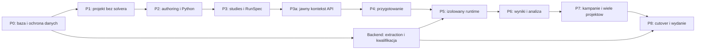

# Produkcyjny plan refaktoryzacji całego Fullmaga

Data: 20.09.2026. Status wszystkich pakietów: **PLANNED**. Baza audytu: `14c8e73a6f3c55f4fc080835a6156f2a4db8f111`. Docelowe zachowanie: [architektura i kontrakty](02-architektura-i-kontrakty.md); wymagane dowody: [kwalifikacja](04-kwalifikacja-i-scenariusze.md).

## 1. Wynik i granice wykonania

Wynikiem ma być jeden projektowy produkt CAE: New/Open/Edit/Save bez solvera; powtarzalne studies na przypiętych danych; bezpieczna edycja podczas obliczeń; niezależne wyniki i postprocessing; jedna ścieżka Python/IR/API/UI; jawne cztery realizacje obliczeń. Modularizacja obejmuje również native backendy, referencyjny engine, ABI, launchery i packaging, a nie tylko usunięcie modalu.

Nie rozszerzamy automatycznie fizyki do wszystkich lane’ów. Istniejące funkcje są zachowane lub jawnie migrowane; brak kwalifikacji pozostaje widoczny. Nowe B-Rep/CAD, solver multiphysics, adjoint, optimizer, CRDT i konkretny scheduler HPC są rozszerzeniami po tym refaktorze. Kontrakty przewidują ich porty, lecz realizacja nie jest warunkiem ukończenia lokalnej wersji w istniejącym zakresie funkcjonalnym.

Pakiety poniżej są granicami logicznych przyrostów, nie narzuconą liczbą PR. Każdy przyrost zawiera kontrakt, właściciela, konsumentów, migrację i dowód. Sam nowy typ lub katalog nie zalicza etapu. Szacowanie czasu nastąpi po P0 na podstawie inventory i pilotażu; raportowe czasy startu oraz liczba linii nie są estymacją.

## 2. Zależności i kamienie odbioru

Jawny ProjectId istnieje już w P1. P3a oznacza ukończenie migracji tożsamości wykonawczej rodzin API, nie pierwszy moment adresowania projektu. Minimalny trwały katalog runów/artefaktów powstaje w P3; P6 rozwija jego semantykę wynikową. Prace backendowe można prowadzić równolegle po P0, ale zmienionego lane’u nie włącza się do P5/P8 bez jego dowodów.

| Kamień | Widoczny wynik | Warunek |
|---|---|---|
| M1 po P1 | Otwieranie i zapis niekompletnego projektu bez GPU/solvera | Bezpieczny storage i browser flow. |
| M2 po P4 | Parametry, Undo, osobne studies i jawne przygotowanie | Roundtrip i typowane wejścia. |
| M3 po P5 | Edycja podczas solve, cancel/recovery i steering | Izolacja, fencing, accepted state i wymagane lane’y. |
| M4 po P7 | Historyczne wyniki, porównania, kampanie i kilka projektów | Dataset identity, zasoby i kolejność zależności. |
| M5 po P8 | Produkcyjny cutover | Wykonane bramki, migracja/rollback, dokumentacja i integracja. |

## 3. Reguły prowadzenia implementacji

Przed implementacją odczytać aktualne `AGENTS.md`, skill `using-git-worktrees` i cykl integracji z `docs/guides/fullmag-build-storage-governance.md`. Sprawdzić registry i źródła, wybrać jedno izolowane worktree zadania, zapisać pełny base SHA oraz właściciela. Nie wracać automatycznie do starej bazy planu i nie wykonywać automatycznego fetch/pull jako części audytu.

Spójne zweryfikowane przyrosty commitować na branchu zadania według reguł projektu; staging obejmuje wyłącznie własny zakres. Integracja: wymagane testy/review → push → PR do master → wymagane kontrole → merge → weryfikacja głównego checkoutu → bezpieczne usunięcie dokładnie własnego worktree i wpis końcowy. Blokadę CI, review, aktywnego mountu lub dirty checkoutu zapisać jawnie; nie wymuszać cleanup.

Historyczna wersja tego planu zawierała zakaz kompilowania testów jednostkowych i tryb plan-only. Zostało to odwołane jawną zgodą użytkownika na implementację i testowanie; bieżący checkpoint P0/P1 zachowuje osobne dowody źródłowe, managed, browserowe i runtime. Każdy kolejny etap nadal wymaga właściwej bramki dla swojej warstwy, a brakujący dowód pozostaje `NOT VERIFIED`.

Pełne buildy na hoście z Fullmag_build_runner idą przez istniejącą kolejkę, z jawnym źródłem i profilem. Build runner nie jest nowym schedulerem naukowych RunId. Nowy execution coordinator współpracuje z istniejącym zarządzaniem zasobami; nie zastępuje kolejki buildów. Brak zdrowej trasy lub profilu oznacza blokadę, nie ręczny ciężki fallback. Recepty i ich zależności sprawdzać przed uruchomieniem, również pod kątem zakazu testów.

## 4. P0 — baza, ryzyka i kontrakty blokujące

Właściciele: application/storage lead, solver lead, API/frontend lead. Wejście: bieżący checkout i materiały audytu. Zmiany naprawcze są osobnymi przyrostami przed zmianą rootu danych.

| Pakiet | Pliki/punkty wejścia | Zadanie i wyjście | Dowód / bramka |
|---|---|---|---|
| P0-A | `Cargo.toml`, `justfile`, `docs/adr`, `docs/specs`, wszystkie entry points | Utworzyć inventory: source SHA, dirty state, schema/ABI, endpoint-method-operationId, producenci/consumers manifestów, macierz funkcji × lane. Przypiąć SHA/hash 18 materiałów wejściowych. | Inventory obejmuje web/desktop/CLI/Python/headless/scratch/attach/import/resume; brak nieokreślonego właściciela. |
| P0-B | `fullmag-session/src/store.rs`, `cas.rs`, `capture.rs`, `fms.rs`; `fullmag-cli/src/main.rs`, `args.rs` | Najpierw zamknąć destrukcyjny GC za dry-run/odmową; następnie wspólny traversal dla GC, eksportu i restore. Naprawić capture: blob musi mieć materialną referencję, także aux/RNG/backend state. Nie uruchamiać GC na danych użytkownika. | Syntetyczny store z descriptor/chunks/recovery/pin/live lease; unreachable garbage rozpoznany, live nieusunięte; eksport/import zachowuje faktyczne dane pola i aux; unknown/corrupt root blokuje apply. CAE-47/62, FINAL-17. |
| P0-C | `fullmag-session/src/store.rs`, `cas.rs`, `fms.rs` | Unikalny staging, właściwa kolejność state→manifest, single-writer lock z host/process identity, platformowa durability policy, recovery niedokończonej publikacji. | Fault injection na wspieranym local FS; drugi writer odrzucony; power-loss nie jest uznany za sprawdzony po samym kill procesu. CAE-45/64/65. |
| P0-D | `docs/adr`, backend masterplan, `.agents/instructions/backend.md`, frontend/API spec | Uzgodnić ADR wg 05. Rozstrzygnąć FDM CPU authority zgodnie z kodem i zaakceptowanym scoped ADR; konsumować ADR-0025 bez drugiego accepted-state modelu. Zapisać rozdział build storage/CAE Project. | Zmiana kontraktu poprzedza zależny kod. Brak cichej zmiany backendu lub nowego zestawu sprzecznych instrukcji. |
| P0-E | Istniejące scenarios i runtime receipts; `fullmag-bench`, `fullmag-build-info` | Zabezpieczyć fixtures i poprawne referencje. Rozdzielić znane błędy od normatywnego zachowania: nie zamrażać destrukcyjnego GC jako golden. Zmierzyć baseline operacji i transferów tam, gdzie pozwalają trasy. | Dla brakującego pomiaru NOT_RUN z przyczyną. Source identity każdego fixture/receipt i tabela progów przed pomiarem nowej wersji. |
| P0-F | `fullmag-session/src/fms.rs::preflight_fms/unpack_fms`, `store.rs::commit_session/write_document` | Walidować także ID pochodzące z treści manifestu przed użyciem w ścieżce. Walidacja nazw ZIP nie chroni późniejszego `root.join(manifest.session_id)`. Wymusić typed IDs i containment w granicy repository dla wszystkich writerów. | Izolowane fixtures: separator, absolute path, traversal, platform-specific reserved names i symlink/junction escape; odmowa przed pierwszym zapisem poza staging. CAE-57, FINAL-18; blokuje import P1. |

Wyjście P0: bezpieczne uruchamianie następnych prac, jawny model authority i rejestr dowodów. Błąd storage nie blokuje samego odczytu dokumentów, ale blokuje promocję nowego writera. Nie przenosić napraw GC na koniec P6.

Doprecyzowania P0-D: bieżący `FdmEngine` rozróżnia `CpuReference` i `CudaFdm`; nie zakładać gotowego pełnego native CPU zamiennika. Zaktualizować scoped kontrakt ADR-0025 D07 (Open dokumentu versus RestoreRuntime) i ADR-0009 (jawne Compute z PreparationPlan versus ręczne Build Mesh) przed zależną implementacją. Uzgodnić reporting capabilities FEM/FK z istniejącymi planner/runtime branches bez awansu statusu naukowego na podstawie samych źródeł. Istniejący `try_lock` nie dowodzi ochrony writerów; P0-C obejmuje także podłączenie protokołu do wszystkich operacji zapisu i GC.

## 5. P1 — pierwszy pionowy przekrój projektu bez solvera

Zależności: P0-B/C/D. Właściciele: application + persistence + shell.

| Pakiet | Pliki/punkty wejścia | Zmiana | Odbiór |
|---|---|---|---|
| P1-A | Nowy `crates/fullmag-application`; `fullmag-authoring/src/scene.rs`, `adapters.rs`; `fullmag-session` | Create/Open/Save/Save As/Close, ProjectDefinition, ProjectRepository i single-writer transactions. scene.v2 jako adapter wejściowy. | Create/Save/Reopen bez RuntimeSession i bez wywołania meshera/solvera. |
| P1-B | `fullmag-session/src/types.rs`, `fms.rs`; persistence handlers | Versioned project root, adapter legacy, raport migracji, preserved unknown fields/assets; oryginał immutable. Rozdzielić Open projektu od jawnego Restore runtime. | CAE-02/03/04/50/51/57/58/60; obrót i skala nie znikają; nieznany schema nie trafia do starego writera. |
| P1-C | `WorkspaceShellClient.tsx`, `EmptyWorkspace.tsx`, `SimulationStartupOverlay.tsx`, KernelProvider, persistence facade | Stała powłoka z New/Open/Save, lokalnymi błędami i statusem zapisu. Zachować ograniczenie niebezpiecznych mutacji starego runtime. | CAE-01/02/41; brak globalnego unmount od preparation/disconnect. Nie zmieniać ADR-0016 dla nieaktywnego 3D. |
| P1-D | `apps/desktop`, CLI file-open, Python binding entry points | Ten sam use case Open i jawna polityka zamknięcia przy aktywnym wykonaniu. | Desktop/browser/CLI odczytują tę samą kopię; Open bez kodu i solve; drugi writer read-only/odmowa. |

Rollback P1: wyłączyć nowy writer dla nowych komend, zachować reader; legacy kopie pozostają czytelne. Nie cofać ochrony GC ani durability. UI może przywrócić adapter starego modelu, lecz nie pisać nowego schema starym writerem.

## 6. P2 — authoring, Python i historia edycji

Zależność: P1. Właściciele: authoring/Python + frontend model tools.

| Pakiet | Pliki/punkty wejścia | Zmiana | Odbiór |
|---|---|---|---|
| P2-A | `fullmag-authoring` scene/builder/adapters/physics_graph; IR canonicalization; Python model/problem | Parametry AST/SI, stable references, versioned libraries, Model/Component/PhysicsConfiguration. Display units poza numerical hash. | CAE-05/06/07/49; deterministic canonicalization, cycle diagnostics i roundtrip. |
| P2-B | Geometry IR/meshing adapters, selections, `region_revisions.rs` | Feature sequence dla istniejących geometrii, selection lineage/ambiguity, jawne transform support; rozszerzyć selective invalidation. | CAE-08–16/68; materiał domyślnie nie remesh; geometry/display/simulation identities odrębne. |
| P2-C | `world.py`, `fullmag-py-core`, `model/problem.py` | Per-context state z kompatybilnym flat DSL; jawny study/run; rozdzielić definicję i kosztowną materializację. Nie wprowadzać nieistniejącego `fm.Project` jako gotowego API. | CAE-49/50/52, zagnieżdżone contexts/exception/async/thread; żadnego cross-project mutable default. |
| P2-D | Explorer tree adapters, Inspector, command registry, gizmo i field drafts | Semantic Apply/Undo/Redo, pending-form registry, tree commands oraz wspólne menu/ribbon/shortcut; preserve selection vs focus. | CAE-03/10/12/20/44; stabilny Inspector Object/Airbox, jeden commit gestu, error focus. |

Publiczne zmiany Python/IR wymagają dokumentacji parametru, jednostki, domyślnej wartości, walidacji, lowering i statusu lane. Przed nowym zachowaniem numerycznym uzupełnić kanoniczną notę naukową. Nie duplikować fizyki w nowym katalogu planu.

Rollback P2: zachować semantic migration readers i aktualne dane; shadow porównuje tylko lowering, nie uruchamia drugiego solve. Nie trzymać dwóch aktywnych writerów definicji.

## 7. P3 i P3a — studies, trwałe przyjęcie i adresowanie

Zależność: P2; identity plumbing można przygotować od P1. Właściciele: planner/application/API i resource runtime.

| Pakiet | Pliki/punkty wejścia | Zmiana | Odbiór |
|---|---|---|---|
| P3-A | `fullmag-authoring/src/builder.rs`, `fullmag-ir`, `fullmag-plan` | Typed steps/ports/config references; migracja primitive/macro/group; oddzielić study, solver preset i execution profile. | CAE-17/18/21/22/25; unsupported payload zachowany i blokowany, nie silently dropped. |
| P3-B | `fullmag-application`, `fullmag-session` manifests; runner input boundary | Durable idempotent Submit, RunSpec, ResolvedTaskInput, minimalny run/artifact catalog i output publication. Wrapper starego wykonawcy z jawnym limitem współbieżności. | CAE-30/31/32/48; dwa runy i utrata ACK; powtórzenie payloadu nie tworzy nowych obliczeń. |
| P3a-A | `fullmag-api/src/router_v2`, application ports; wywołania w CLI/runner | Wewnętrzny immutable request context przechodzi przez wszystkie awaits. Pilotaż: definition read/edit, compute, binary field read, persistence i events. | Zmiana current podczas każdego opóźnienia nie zmienia celu; write do cudzego ProjectId odrzucony. |
| P3a-B | OpenAPI generated files, `apiPaths.ts`, facade, resources/realtime, scripts | Migrować po rodzinach: model/persistence/workspace → simulation/commands → meshing → data/visualization → analysis/diagnostics. Context identity w cache i decode, regenerated contract. | CAE-42/43/44/61/70; coverage endpointów z inventory, tests + browser. |
| P3a-C | Compatibility alias, generated client consumers, skrypty smoke i CLI | `current` wiązany raz przy przyjęciu. Publiczny pośredni session-ID adapter tylko dla wykazanego konsumenta, bez pełnej kopii API. | Każda legacy trasa ma owner, client list, write policy i removal gate; jedna kolejka i jeden writer. |

Regeneracja API nie jest całą migracją frontendu. Rejestr musi obejmować klucze cache, invalidation events, headers, request correlation, command completion, workers, binary envelopes, scope i Consumers. Liczyć unikalne paths oraz metody osobno; licznik literalów nie jest Definition of Done.

Rollback P3/P3a: alias deleguje do tego samego use case i zachowuje pinned context. Nowe accepted runy pozostają w katalogu; nie uruchamiać ich ponownie przy powrocie starego UI.

## 8. P4 — przygotowanie i dyskretyzacja

Zależność: P3/P3a; współpraca z B-FEM/B-FDM.

| Pakiet | Pliki/punkty wejścia | Zmiana | Odbiór |
|---|---|---|---|
| P4-A | `fullmag-plan`, `simulation_preparation.rs`, Python meshing/problem cache | PreparationPlan i typowani producenci Geometry/Display/Grid/Mesh/Space. Opakować istniejące realizatory. | CAE-13/14/15; FDM bez wymuszania FEM policy/Gmsh; lokalne błędy tasków. |
| P4-B | Mesh certificates, `region_revisions.rs`, native mesh/space adapters | Producer/version fingerprints, quality/marker/cell/space validation i selective reuse. Osobny transfer stanu. | CAE-09/11/16/27/68; niezgodny marker/space blokuje publikację; mesh reuse nie implikuje operator reuse. |
| P4-C | Mesh Inspector, Explorer badges, Operations/Problems, viewport adapters | Jawne Build Geometry/Grid/Mesh/Compute, kontekstowe availability i zachowanie ostatniego dobrego artefaktu. | Błąd meshu nie niszczy edytora; UI pokazuje revision i pochodzenie, bez procentu zmyślonego z etapów. |

Brama P4: preparation receipt jest przypięty do runu/receptury i nie może pochodzić z innego draftu. Rollback pozostawia ostatni poprawny artefakt z jego tożsamością; nie promuje niezweryfikowanego kandydata.

## 9. Strumień B — modularizacja całego backendu

Start po P0; kończy się przed P8. Każdy pakiet ma jawny wykaz właścicieli interakcji/workflows i lane’ów. Nie łączyć zmiany równania z mechaniczną ekstrakcją. Nowe ścieżki docelowe projektować po odczycie konsumentów, bez tworzenia pustych struktur dla spełnienia schematu.

| Pakiet | Obecne obszary | Granica docelowa | Wymagany dowód |
|---|---|---|---|
| B-CORE | `fullmag-engine`, `fullmag-fdm-demag`, IR/plan/sys | Reference/production dispatch rozstrzygnięty w P0-D; jednoznaczne params/state/operators/workflows/observables. Zachować jawne oracles i provenance. | Test dispatch + ta sama reference semantics; brak zmiany CPU implementacji ukrytej pod rename. |
| B-FDM | `backends/fdm`, `fullmag-fdm-sys`; CPU właściciel wskazany przez P0-D | Rozdzielić state/workspace, local interactions, nonlocal demag/carriers, RHS/integrators i workflows. Zachować GPU fused kernels oraz endpoint caches przy zgodności kontraktu. | CPU/GPU double parity, PBC/multilayer carrier, energia/field consistency, rollback rejected step, finite fields, profiling transfer/allocations. |
| B-FEM | `backends/fem/core`, `cpu/mfem`, `gpu/cuda`, `src`, `include`; `fullmag-fem-sys` | `Context`/`mfem_bridge.cpp` jako ownership/ABI facade; mesh/space, materials, interactions, integrators, workflows i diagnostics mają węższych właścicieli. | Native ABI/ownership, destruction order, CPU bez GPU dependency, GPU residency, mixed topology/markers i BC. |
| B-DEMAG | FEM demag strategy trees; FDM demag | Zachować odrębne strategie i ich mesh/BC/solver policy/realization. Wspólny interface bez wspólnego policy fallbacku. | Analityczny demag, symmetry/energy checks, refinement/convergence, source/mesh/residual provenance, strict GPU reject. |
| B-WORKFLOW | Runner `lib.rs`, `fem`, `eigen`, `response`; native workflows | Runner odpowiada za orkiestrację/ABI/artifacts; native owns numerykę FEM. Run/relax mają osobne stop policy; eigen/response wspólny operator, odrębne rozwiązanie i evidence. | Kryterium equilibrium, eigen residuals, harmonic convention i response reference; dense solver tylko mały reference scope. |
| B-STATE | Integrators, constraints, thermal/transport carriers, observation | Accepted-state transactional boundary, RNG/history/FSAL/constraints, full checkpoint compatibility i isolated history materialization. | CAE-34/35/36/56 i zero live mutation; actual runtime receipts per touched lane. |
| B-ABI | `fullmag-fdm-sys`, `fullmag-fem-sys`, `fullmag-py-core`, native include/packaging | Wersjonowany ABI, lifecycle handles, error/status mapping, kompatybilne scalar/field descriptors. | Nieznana wersja odrzucona przed alokacją; malformed payload i failure cleanup; bez host-device move ukrytego w getterze. |
| B-OBS | `fullmag-quantities`, runner observation/artifacts/autosave, profiler | Jeden materializer/cache per source i one-owner quantities; bounded handoff solver→publisher; telemetry fizycznego kroku i publikacji odrębne. | Slow-reader/backpressure, source-step timestamps, capture freshness, UI-off throughput i quantitative results. |

Każda z istniejących rodzin fizyki z inventory P0 otrzymuje wiersz: canonical note, Python/IR fields, planner capability, CPU/GPU implementation, energy/field/torque/observables, regression fixture, scientific receipt. Dotyczy także DMI, anizotropii, źródeł regionalnych, Frozen Spins, thermal, STT/SOT, transportu, Oersteda i istniejących sprzężeń. Wiersze niezaimplementowane pozostają jawne; refaktor nie podnosi ich statusu.

Nie usuwamy Rust reference ani native interakcji dlatego, że funkcję przeniesiono między katalogami. Stary owner można usunąć dopiero po wskazaniu wszystkich konsumentów i przejściu właściwej bramki. Nie używamy limitu 1000 linii jako automatycznego kryterium podziału.

## 10. P5 — bezpieczny runtime i edycja podczas obliczeń

Zależność: P4, P3-B, właściwe pakiety B-STATE/B-ABI/B-OBS. Właściciele: runtime + application + frontend commands.

| Pakiet | Pliki/punkty wejścia | Zmiana | Odbiór |
|---|---|---|---|
| P5-A | `scratch_runtime.rs`, `orchestrator.rs`, runner workers | Własność przypiętego runu zamiast scene_revision. Wydobywać use cases etapami; dla typowanego authoringu usunąć zbędny roundtrip przez skrypt na dysku. | CAE-29/69; zgodna numeryka i source identity, pomiar zimnego startu vs reuse. Script-owned nadal może używać Pythona. |
| P5-B | Coordinator journal/resource leases; worker protocol | Fencing, sequence/dedup, cancellation races, retry, orphan reconciliation, admission CPU/RAM/GPU/storage. | CAE-30–33/46/48/59/66; stary worker nie publikuje i nie zajmuje równolegle ponownie przydzielonego GPU. |
| P5-C | ADR-0025 realization, checkpoint providers, live commands | Safe-point steering, segments, immutable accepted source; isolated observation i bounded demand. | CAE-34–36/54/56; rejected step i checkpoint spójne; no fallback. |
| P5-D | Inspector, command availability, Operations/Problems, realtime | Odblokować edycję draftu dopiero po izolacji. Oddzielić „Edit” i „Apply live”; close/disconnect nie anuluje. | CAE-20/29/35/41/44; wszystkie powierzchnie komend przestrzegają tego samego scope. |

Rollback P5: ograniczyć mutacje/live controls dla danego adaptera i zachować odczyt projektu oraz wyniki. Nie przywracać zależności już przyjętego runu od mutable draftu ani historycznego swapu do LiveRuntime.

## 11. P6 — trwałe wyniki i kompletny frontend analityczny

Zależność: minimalny katalog P3, publikacja P5 i quantities/space contracts.

| Pakiet | Pliki/punkty wejścia | Zmiana | Odbiór |
|---|---|---|---|
| P6-A | Runner `eigen/artifacts`, `fmr.rs`, pozostałe writers; session manifests | Identity-only references; migration legacy resource keys copy-on-write; SolutionSet catalog, coverage i scientific assessment. | CAE-04/37/61/70; artifacts portable bez aktywnego runtime, oryginalne hashe zachowane. |
| P6-B | `fullmag-quantities`, field descriptors, codecs, dataset/slice API | DatasetDefinition, materialized dataset, DerivedValue i PlotDefinition ponad istniejącym Results; typed axes/sample/item/branch. | CAE-22–24/27/38–40; real/imag roundtrip, function-space mismatch rejection, unavailable ≠ zero. |
| P6-C | `autosave_zarr.rs`, session CAS, binary partial reads, analysis consumers | Bounded/chunked I/O, pagination/slices, integrity przed publikacją, jawny koszt derived compute. | Duży dataset z ograniczoną pamięcią, partial/corrupt, slow-reader i brak niejawnego solve. |
| P6-D | Results/Analysis/Field Map/Live Charts, Explorer i ViewDocument | Pinned historical source, porównania, plot/export recipes, camera persistence poza rendererem. Zachować ADR-0016 i quantities units. | CAE-37–43/55/63/67; zero nieaktywnych canvasów, aktywny WebGL z niezerowym bufferem; bounded cache. |
| P6-E | Project/solver Inspector, Problems, UI primitives | Authored/resolved/executed obok siebie, source links, status quality, keyboard/focus, accessible legends, Mocha/Latte. | Odbiór scenariuszy klawiaturą, readable units, brak wzajemnego przejmowania datasetów i draftów. |

Nie tworzyć drugiego Results Explorer od zera ani nowego globalnego UI store. Nie usuwać integrity hashing dla wydajności. Rollback P6 wyłącza nowy evaluator/adapter widoku, zachowując read-only katalog i nowe manifesty; brak podmiany nieobsługiwanego pola na `m`.

## 12. P7 — złożone studies, wiele projektów i targety

Zależność: P5/P6. Właściciele: planner/runtime + kernel context + analysis.

| Pakiet | Zakres | Wynik | Odbiór |
|---|---|---|---|
| P7-A | Study compiler, hysteresis/eigen/response/sweeps | Equilibrium→eigen/response, case mapping, seed policy, ordered continuation, cancellation subtree. | CAE-21–28; błąd poprzednika blokuje konsumenta; seedy i mapping stabilne po retry. |
| P7-B | Kernel context, project tabs, resource/decode queues | Wiele otwartych projektów, osobne drafty/view contexts; wyniki i kolejka bez przejmowania active source. | CAE-42/43/52/55/66; praca w B nie zmienia runu A; brak nieograniczonego cache. |
| P7-C | ExecutionTarget adapters, desktop/service lifecycle, packaging | Ten sam protokół capability/lease/receipt dla wspieranych targetów; single-worker kolejkuje. Konkretny HPC adapter poza zakresem bez osobnego zadania. | CAE-48/59; version mismatch/reconnect/orphan; rzeczywisty supervisor albo jawne interrupted. |
| P7-D | Reports/export, measurement import, library refs | Reprodukowalne raporty z pinned datasets/figures; pomiary z jednostkami i źródłem, bez wymyślonej niepewności. | Reopen/regen daje te same wejścia; brakujący asset raportowany; headless/UI zgodne. |

Rollback P7 ogranicza admission nowych kampanii/targetów; nie porzuca działających runów ani ich leases. Wiele dokumentów może pozostać otwarte nawet przy pojedynczym workerze.

## 13. P8 — cutover, dystrybucja i zamknięcie

| Pakiet | Zadanie | Dowód ukończenia |
|---|---|---|
| P8-A | Usunąć mutable current writers, globalny workspace gate, dual-truth authoring i zbędne adaptery. Zachować nazwane import/CLI compatibility readers. | Inventory tras/metod i symboli bez nieoznaczonych legacy consumers; kompletne namespace contexts, jeden writer/queue. |
| P8-B | Zaktualizować backend masterplan, ADR/spec, canonical physics/source maps, Python examples i public docs. | Link/parser/source-map checks; odpowiednie przykłady i docs render; żadnej planned capability opisanej jako qualified. |
| P8-C | Zbudować i sprawdzić pakiety Windows/desktop i wspierany managed Linux; version handshake Rust/Python/API/native. | Managed build receipts, source identity, nonempty artifacts; clean install/open/upgrade/rollback smoke. |
| P8-D | Przeprowadzić macierz CAE i lane qualification; fault/recovery/performance/soak. | Raport 04 z wykonanymi required rows, bez „skip=pass”; jawne unsupported poza release scope. |
| P8-E | Wymagane review/CI/PR/merge oraz lokalna weryfikacja i cleanup zadania. | Pełny wynikowy SHA, PR, status CI/review, registry i dokładny cleanup lub konkretny blocked. |

Wydanie może promować wyłącznie zakres wskazany w macierzy kwalifikacji. Jeżeli refaktor zmienia wszystkie cztery lane’y, każda potrzebuje dowodu; sukces CPU lub frontend smoke nie zastępuje GPU/FEM. Zamknięcie planu nie następuje przez przemianowanie brakującego lane’u na „poza zakresem”.

## 14. Rejestr decyzji empirycznych i reguły awarii

| Eksperyment | Termin | Wymagany artefakt | Gdy wynik negatywny |
|---|---|---|---|
| Local FS durability/lock; SMB osobno | P0-C przed writable P1 | Fault matrix z recovery i platform profile | Read-only/odmowa niekwalifikowanej trasy, bez fallbacku storage. |
| ADR/FDM CPU authority | P0-D | Scoped decision + current dispatch mapping | Wstrzymać relokację CPU; zachować current behavior. |
| API identity pilot | P3a-A | 5 rodzin pionowego przepływu + clients inventory | Poprawić identity boundary przed rozszerzeniem. |
| Python capture/context isolation | P2-C | Cases declarative/generator/script-owned + concurrency | Jawnie ograniczony import; brak obietnicy arbitrary roundtrip. |
| Selection lineage/transform | P2-B/P4-B | Split/merge/rotation/scale fixtures | Ambiguity/unsupported blokuje zależne Compute. |
| Worker reuse/residency/checkpoint | B-STATE/P5 | Dwa runy, stale cache reject, lane receipts, transfer profile | Osobne próby/procesy z jawnym kosztem; brak fałszywego ExactResume. |
| CAS/chunk size/partial reads | P6-C | Cold/warm time, peak RAM, throughput i checksum cost | Zachować integrity i bounded I/O; zmienić batching/layout, nie naukę. |
| FDM/FEM projections i derived values | P6-B | Referencje, error bounds i units | Refuse incompatible data; bez wizualnego parytetu. |
| WebGL/CUDA memory i device sharing | P5-B/P6-D | Measured peak, context-loss recovery, device leases | Kolejka/typed resource error; bez zmiany urządzenia/precyzji. |

Nowe odkrycie wymaga wpisu z wpływem na pakiet/bramkę i aktualizacji macierzy. Nie redefiniuje automatycznie całego planu. Zakończony etap zachowuje pełny commit, wejścia i ważne dowody; powtarzać testy po zmianie lub nowej przyczynie, nie rytualnie.
