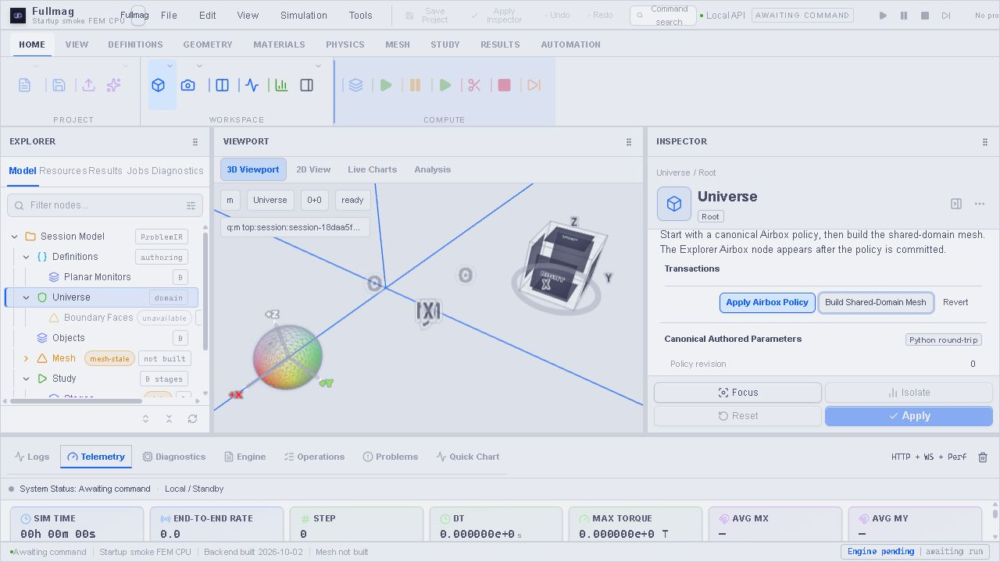

# P1 — produkcyjny build i pusty edytor w przeglądarce

Data: 02.10.2026. Wynik: **build PASS, startup częściowo PASS; wykryto błąd przejścia sesji**.

| Scenariusz | Wynik | Dowód |
|---|---|---|
| Managed build `fem-cpu-release` nr 197 | PASS | Terminal `succeeded`, exit 0; 119 artefaktów, trzy etapy exit 0. |
| Start UI bez sesji i projektu | PASS | Create simulation / New project / Open project; brak blokującego modalu. |
| Create → pusty FDM CPU double | PASS | Workspace, Explorer, Inspector i viewport; Objects=0, mesh not built, solver step=0. |
| Selekcja Universe w pustym FDM | PASS | Inspector reaguje; brak `inert`. |
| New Problem → zastąpienie FDM pustym FEM | **FAIL** | POST sessions=201, GET sessions=200; backend ma nową sesję, UI pozostaje na Checking for sessions. |
| Odświeżenie → pusty FEM CPU double | PASS | Nowa sesja FEM, działający viewport, Universe i ustawienia FEM Airbox. |
| Kontrolki FEM przed zbudowaniem siatki | PASS | Apply Airbox Policy dostępne; fokus przechodzi do Build Shared-Domain Mesh. Nie wykonano tych mutacji. |
| Długi build siatki i dostęp do edytora w trakcie | NOT VERIFIED | Nie uruchamiano meshera. Kod pełnoekranowego modalu nadal wymaga osobnego domknięcia. |
| Solver, fizyka, GPU, Tauri | NOT VERIFIED | Pusty authoring i browser startup, bez obliczeń. |

## Źródła i pakiet

- Job: `4275d899553b40ddb5b4fcf1a11caf2a`.
- Commit: `5d91ed2aa6337c2001abf2a208b0b6586125a3a7`.
- Source digest: `1e05bb1ce17d4dbb9701267b410a0ee60e8918c394e09c89617d0d97970d0d50`.
- Native snapshot: `7ade44be2c01b1d1f7611c70b06358028bc94b0ed60a526b57c2310f3f60d2a1`.
- Build receipt SHA256: `d36276ecc1b3b1b1bbe4e36cdd252260bc71b5d3a5708c3f71e30c05a222d2db`.

Późniejszy commit `207c9c062b0b9e42e67811fa91e02cdda9363be6` zmieniał Pythonowy
sterownik bramki scope i dokumentację, nie backend ani frontend tego pakietu.
Nie włączono niezacommitowanych zmian współdzielonego checkoutu do buildu.
Nie kompilowano natywnych unit tests. Produkcyjny frontend przeszedł kompilację
i TypeScript; lekkie regresje launchera: **11 pytest PASS**.

## Rzeczywisty runtime

Uruchomiono `just run-managed-browser` z tym job ID i commitem, port **3104**.
Launcher weryfikuje terminalny receipt, wymagane artefakty, operatorową kapsułę,
digest obrazu, startup stamp i faktyczny kontener. API i statyczny frontend
pochodzą z jednego pakietu. Źródła/pakiet są read-only, stan jest prywatny.
Nie zastępowano wspólnego runtime ani konfiguracji runnera.

Container ID: `06c37c71c83f8a910619c244b530b673e8f1a5ece971cb3ebee0d123b36c4a1a`.
Katalog runu: `C:\git\fullmag\storage\builds\fullmag-0950f4dca4ffe38f\managed-browser-cpu\runs\68f9526f82f34cf7808a04abd05da108`.
Receipt: `receipt.json` w tym katalogu. Aplikację pozostawiono uruchomioną,
z sesją FEM i bez aktywnego solve. Po początkowym teście pustej sceny użytkownik dodał obiekt; bieżącej sesji nie resetowano. Zatrzymanie dokładnie tego
kontenera zachowuje dane; kolejny start wymaga sprawdzenia poprzedniego runtime.

Pierwsza próba launchera zatrzymała się przed startem błędem interpolacji
Compose; poprawiono escaping. Druga wykazała wyczerpanie puli nowych sieci
Dockera. Launcher korzysta teraz z istniejącego `bridge`, publikując port
wyłącznie na loopback. Nie usuwano sieci, kontenerów ani cache innych zadań.
Receipty nieudanych prób zachowano w runach `b8ff5e8b18294b02bbf21247ebe77ea6`
i `79a31ddc93f8448e81656ab81150b844`.

## Browser i WebGL

Widoczny canvas FDM: drawing buffer **526×318**, `contextLost=false`.
FEM po odświeżeniu: **549×318**, `contextLost=false`.
W obu otwartych workspace: zero blokujących preparation overlays i zero
paneli `inert`. Nie przygotowywano siatki ani nie wykonywano kroków solvera.
Puste problemy umożliwiają konfigurację; Compute Study pozostaje niedostępne,
dopóki nie istnieje obiekt magnetyczny i wymagane przygotowanie.

## Otwarta regresja przejścia sesji

Po zastąpieniu FDM przez FEM UI pozostaje w Checking for sessions mimo
udanego utworzenia i odczytu kolekcji. Żądania starego scope zwracają 409;
odświeżenie odzyskuje nową tożsamość i workspace. Nie zaliczamy tego przejścia
dzięki reloadowi. Wymagana jest naprawa odświeżania tożsamości zasobów po
Create/Replace, regresja i ponowny browser smoke bez ręcznego odświeżenia.

Dowód maszynowy: [receipt](10-browser-empty-startup.json).

## Aktualizacja po zgłoszeniu błędów konsoli

| Żądanie | Przyczyna i stan |
|---|---|
| preparation / runs/current — 404 | Brak przygotowania i aktywnego runu w nowej sesji; nie jest dowodem awarii solvera. |
| visualization/client-acks — 400 | Brak request_scope_epoch w scope wysyłanym przez frontend. Poprawka używa kanonicznego klucza i pełnej tożsamości; nowy build/browser jeszcze NOT VERIFIED. |
| persistence/checkpoints — 500 na 3104 | Pierwotny launcher używał symlinka .fullmag; guard repozytorium prawidłowo go odrzucił. |
| persistence/checkpoints — 500 na 3114 | Zwykły katalog usuwa pierwszy błąd, ale magazyn Docker Desktop ma typ 9p (0x1021997), którego writer sesji nie kwalifikuje. Trwały storage nadal BLOCKED. |
| Replace sesji | Poprawka invalidacji używa session_id zamiast resetowanego state_version. Nowy build/browser jeszcze NOT VERIFIED. |

Próba 3114: run `7269bea96d1b44f4a86b65cd154e5c16`, kontener
`ad29ee2f84e75ad09e9b2bddacb9ce193fe3d30541f0ed9392a6c2a5e2169489`.
Pusty FEM otwiera edytor; nie zaliczamy checkpointów ani całego startupu.
Launcher sprawdza teraz typ filesystemu i odrzuca nieobsługiwany magazyn;
nie wyłączono guardu i nie utworzono alternatywnego wolumenu Docker.

Kontrole źródeł: API hygiene i architecture hygiene PASS. Dodano regresje
frontendowe, ale nie kompilowano unit tests zgodnie z obowiązującym zakazem.
Stan runnera podczas przygotowania poprawek: worker_alive=true,
accepting_jobs=true, wolne 6 650 871 808 B, poniżej guardu 8 GiB.
Koordynator zgłasza też Existing Fullmag container must finish before queued build.
Aktywna sesja użytkownika na 3104 pozostaje zachowana. Nie zaliczamy poprawionego
frontendu na podstawie starego pakietu nr 197.

Poprawki frontendowe zapisano w commicie
`d2b95dc5d9d1d339db73bc566af31f8131638b53` (6 plików, bez zmian backendu).
Hook React Doctor: 81/100, ostrzeżenie html-label-has-single-control
w istniejącej kontrolce debugowej viewportu. Ten fragment jest identyczny
w poprzednim commicie; nie jest skutkiem poprawki ACK. Kontrole źródeł nie
zastępują oczekującego buildu i dowodu browser.

Zachowano lokalny snapshot aktualnej sceny 3104: revision=1, objects=1,
SHA256 `d685edcd638ccc814308d96e9747fbfce02e0bb10fd5c097857736bbebdaeed6`.
Plik `user-scene-preserved.json` znajduje się w prywatnym katalogu runu 3104;
nie jest checkpointem, backupem niezastosowanych draftów ani dowodem restore.
