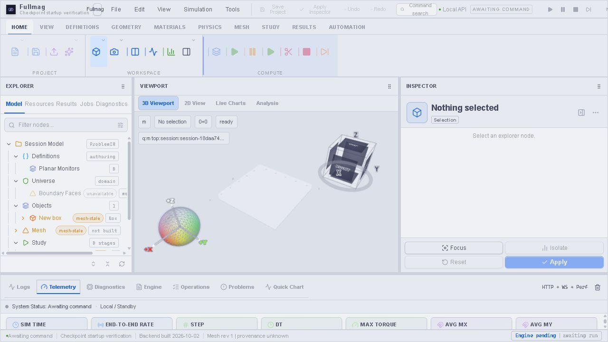

# Startup — ponowne zlecenie buildu nr 200

Data: 02.10.2026. Stan: build SUCCEEDED (exit 0); pełny startup/persistence NOT VERIFIED.

Poprzednia blokada pojemności zniknęła: worker_alive=true,
accepting_jobs=true, brak worker_error, wolne 43 795 341 312 B podczas preflight.
Koordynator został wcześniej wymieniony przez operatora; nie wykonywano
w tej pracy restartu runnera, zmiany profilu ani cleanupu.

- Job: `7295501a0e4847039a7ae806f780dcdc`, sequence 200.
- Profil: `fem-cpu-release`.
- Źródło: commit `18e816e7a0e4020c260730db0affc20c3db19312`.
- Source digest: `3e371f63467c61119d026aa571f0262049137d404dece840a56878ff0f3a9602`.
- Capture: `8cc4cd0fa7a244baae26f6fe29554dac`.
- Native snapshot: `bfeb6f2a68f8ff1c3ed06d33d61d62be5ee4648548b21c9dc3a0402f44982ca5`.
- Snapshot clean; obce dirty backendy checkoutu nie są źródłem tego buildu.

API runnera początkowo potwierdziło prepare=running. Worker zakończył
przygotowanie i opublikował native-build start; kompilacja jest w trakcie.
Brak terminalnego receipt nie jest PASS ani failure.
Nie zgłaszamy ponownie tego samego zadania po timeout obserwatora.

Późniejszy terminalny receipt potwierdził succeeded/exit 0. Launcher
zweryfikował trusted documents, clean commit i hash inventory pakietu;
build receipt SHA256: fc388fc12dd3ebc01291f5655b4e65cb84088e230cc1ecdeb7aeca68f19efd69.

## Przeglądarka nowego pakietu — dowód częściowy

Osobny port 3124, run 8d6b9d1d0fa046ba8a552c7319805448,
container a0122c2160f98c1681e0e454383dab17366dbe1a2c5cef1c4cb59a3a980e18eb.
Image/mount/loopback attestation PASS. Launcher zakończył się exit 1,
zachowując kontener: filesystem 9p/0x1021997 odrzucony przez guard.
Nie zaliczamy pełnego startu ani persistence.

UI: utworzenie pustego FDM HTTP 201; zastąpienie własnej pustej sesji
przez FEM HTTP 201 bez reloadu. Nagłówek i workspace pokazują Startup 200 FEM,
Objects 0, Mesh not built; brak blokującego modalu. Stare scope zwróciło 409,
nowe status/solver/status zwróciło 200. Oba rzeczywiste client-acks mają
pełne request_scope_epoch i HTTP 200, więc wcześniejsze ACK 400 usunięto.
Payload ACK nadal zgłasza failed: visualization render adoption timed out;
to odrębny nierozwiązany problem przyjęcia pustej sceny, nie render PASS.
Canvas istnieje, contextLost=false, drawing buffer 554x337.
Checkpoints nadal HTTP 500; preparation i runs/current HTTP 404 przy pustej
sesji. Nie uruchomiono meshera/solvera, nie restartowano sesji 3104.
Dowody: [sieć](13-startup-200-network.json),
[widok](13-startup-200-browser.jpg).

Decyzja operatora: produkt Windows bez Docker/WSL/Linux. Wolumen nie jest
rozwiązaniem produktu; P8-C rozszerzono o jawną bramkę natywnej dystrybucji.

Sesja 3104 pozostaje dostępna: jeden obiekt, brak aktywnego solvera.
Dwie karty przeglądarki odczytano bez reloadu. W widocznym Inspectorze Universe
pola numeryczne są puste, advanced authored policy JSON = {}, grading auto.
Nie mutowano sesji i nie wykonano meshera. Odczyt DOM nie dowodzi braku
ukrytych draftów innych paneli.

Naprawy ACK/replacement są w kodzie tego joba. Checkpointy wymagają odrębnego
rozstrzygnięcia [adaptera storage](11-desktop-session-storage-proposal.md).
Pytanie operatorowe jest oczekujące; provisionowanie nie rozpoczęło się.

## Import definicji do prywatnej sesji — PASS

Na 3114 sprawdzono PUT model/scene z pełnym canonical request scope.
Pierwszy PUT z revision=1 przy pustym target revision=0 zwrócił prawidłowy
409 scene_stale_revision. Ponowny GET potwierdził brak mutacji, a jawne
użycie target revision=0 zakończyło się 200.
GET docelowy: objects=1, revision=1; objects i cała scena poza revision
zgadzają się ze źródłem. Ponowny GET oryginału 3104 zgadza się z jego
wartością sprzed importu. Przeglądarka 3114 pokazuje Objects 1 / New box.
Nie zaliczamy tego jako checkpoint ani restore po restarcie.

## Bootstrap ponownego startu — PASS fragmentu

Naprawiono świeży-only mkdir w launcherze. Na kontenerze prywatnego 3114
wykonano dokładny skrypt bootstrapu w nowych probe roots: pierwszy i drugi
start bootstrapu exit 0; konflikt linku źródłowego, symlink workspace i
symlink .fullmag exit 2. Nie restartowano API, nie mutowano sesji ani źródeł.
Probe directories zachowano. Dowód: [receipt](12-bootstrap-probe.json).
11 lekkich regresji Python PASS. Ten fragment nie zalicza odtworzenia aktywnej
sesji po restarcie, trwałości storage ani checkpointów.

Dodatkowy odczyt model/script na obecnym 3104 zwrócił 400: active local live workspace does not expose a script path. Nie zachowano przez ten endpoint skryptu; backup/import powyżej dotyczy SceneResource, nie kompletnego resume/FMS. Nie należy przedstawiać tej kopii jako backupu wszystkich stanów runtime.
