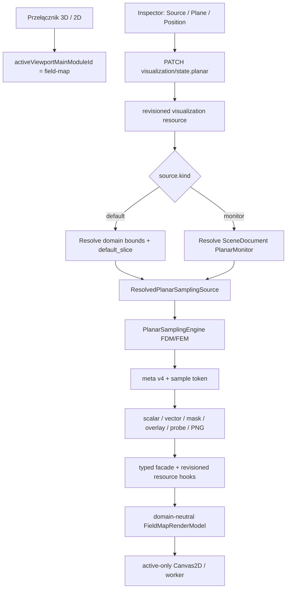
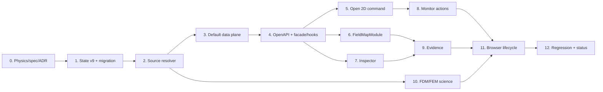

# Domyślny przekrój 2D bez wymaganego monitora — szczegółowy plan implementacji

> **Status dokumentu:** zatwierdzony kierunek produktowy i plan wykonawczy; żadna opisana niżej zmiana nie jest jeszcze potwierdzeniem implementacji ani kwalifikacji produkcyjnej.
>
> **Stan źródeł użyty do analizy:** Fullmag `28a953c515212fbda76fbd372e14264ca672d519`, 2026-08-16. Analiza obejmuje aktualny `master`, istniejący plan refaktoryzacji 2D, kontrakty API/viewport oraz bieżące implementacje `field-map`, Inspectora i `PlanarSamplingEngine`.
>
> **For agentic workers:** REQUIRED SUB-SKILL: use `test-driven-development`, `physics-publication`, `scientific-documentation-contract`, `resource-first-api-check`, `frontend-v2-state-hygiene`, `frontend-v2-viewport-lifecycle`, `adr-check`, `requesting-code-review` and `verification-before-completion`. Use `capability-matrix-check` if lane legality or exposed capability vocabulary changes.

**Cel:** przełączenie z widoku 3D do 2D ma natychmiast otwierać przekrój całego układu, bez tworzenia trwałego monitora. Domyślnie jest to płaszczyzna `xy` pośrodku zakresu `z`; Inspector pozwala wybrać `xy`, `xz` lub `yz` oraz przesuwać współrzędną normalną. Gdy istnieją monitory użytkownika, jedno pole wyboru zawiera pozycję `Default` oraz wszystkie zapisane monitory.

**Architektura:** `Default` jest sesyjnym, serwerowo rozwiązywanym źródłem próbkowania planarnego. Nie jest `PlanarMonitorIR`, nie trafia do `SceneDocument`, Python DSL ani eksportowanego skryptu. Backend syntetyzuje jego target, ramę, extent i operator z kanonicznego stanu wizualizacji oraz aktualnych metadanych domeny, po czym przekazuje je do tego samego `PlanarSamplingEngine`, którego używają trwałe monitory.

**Tech Stack:** Rust/Axum/Serde/Utoipa, OpenAPI v2, wygenerowany TypeScript transport, React 19/Next.js 16, Zustand wyłącznie dla lokalnego stanu UI, Canvas2D/worker `field-map`, Vitest/Testing Library, managed `just` recipes, Playwright/browser smoke.

## Global Constraints

1. `Default` nie może być automatycznie zapisanym monitorem, elementem `ProblemIR`, wpisem Explorera ani fragmentem canonical Python export.
2. `Default` i trwały monitor muszą korzystać z jednego backendowego samplera i tych samych zasad FDM/FEM; frontend nie oblicza interpolacji, przecięć komórek, wag FEM ani redukcji.
3. Stan źródła 2D należy do serwerowego `visualization/state.planar`; nie wolno przywracać `activeMonitorId`, osi ani położenia do lokalnego store modułu.
4. `Default` oznacza cały opublikowany `domain`, a nie bieżące zaznaczenie. Zawężenie do mesh part, warstwy lub airboxa pozostaje osobną, jawną operacją `view_scope` i nie może wystąpić przez przypadek.
5. Początkowy stan to `plane=xy` i `position_fraction=0.5`. Wartość fizyczna jest rozwiązywana w SI z aktualnych `DomainMeta.bounds`.
6. Slider zapisuje bezwymiarową pozycję w przedziale `[0,1]`; Inspector równolegle pokazuje i pozwala edytować rozwiązaną współrzędną w wybranej jednostce długości. Backend pozostaje właścicielem finalnej pozycji w metrach i clampowania.
7. Płaszczyzny mają stabilną, prawoskrętną bazę zgodną z `PlanarFrameIR::axis_preset`: `xy → n=+z`, `xz → n=-y`, `yz → n=+x`.
8. Zmiana osi lub położenia unieważnia tylko zasoby zależne od źródła planarnego. Nie zmienia sceny, siatki, pól, kamery 3D ani trwałych monitorów.
9. Przełączenie ciężkich powierzchni nadal ma lifecycle active-only: w 2D nie pozostaje R3F/WebGL, po powrocie do 3D kontekst jest zdrowy, a nieaktywny `field-map` nie utrzymuje workera, RAF, observerów ani dużych buforów.
10. Każdy status należy raportować osobno jako: zaplanowane, zaimplementowane, wykonywalne, zweryfikowane źródłowo, zweryfikowane naukowo, zweryfikowane w przeglądarce albo zakwalifikowane produkcyjnie.

---

## 1. Problem potwierdzony w aktualnym kodzie

Dzisiejsza implementacja wymusza trwały monitor w czterech kolejnych miejscach:

1. `apps/control-room/src/modules/field-map/fieldMapCommands.ts::field-map.open` pobiera kolekcję monitorów; gdy jest pusta, wywołuje `beginPlanarMonitorDraft(...)`, zaznacza `model.planar.monitor.draft` i zwraca komunikat „Apply the Midplane draft to render the 2D field.”
2. `apps/control-room/src/modules/field-map/FieldMapModule.tsx::FieldMapModule` odczytuje `active_monitor_id`, automatycznie wybiera pierwszy trwały monitor i bez ID pokazuje „Select a planar monitor to open the 2D view.”
3. `apps/control-room/src/modules/inspector/visualization/PlanarVisualizationSection.tsx::PlanarVisualizationSection` wystawia pustą pozycję „Select monitor” oraz uruchamia zasoby wyłącznie, gdy ID ma niezerową długość.
4. `crates/fullmag-api/src/router_v2/handlers/data/planar_fields.rs::build_planar_field` wyszukuje ID wyłącznie w `scene.monitors.planar` i zwraca `404`, gdy trwała encja nie istnieje.

To zachowanie jest również zapisane jako wymóg w `docs/specs/frontend-v2/15-viewport-2d-module.md`, sekcja „Planar Monitor Authoring Flow”, oraz jako pusty stan w głównym planie `viewport-2d-refactor-audit-and-implementation-plan.md`, sekcja 8.1. Oba miejsca muszą zostać jawnie zmienione; sama poprawka komponentu pozostawiłaby sprzeczny kontrakt.

## 2. Decyzja produktowa i odrzucone warianty

### 2.1 Wariant rekomendowany — sesyjne źródło `Default`

`visualization/state.planar` wskazuje źródło przez jawny discriminated union:

```rust
#[serde(tag = "kind", rename_all = "snake_case")]
pub enum PlanarSourceSelectionState {
    Default,
    Monitor { monitor_id: String },
}

pub struct DefaultPlanarSliceState {
    pub plane: PlanarAxisPlane,
    pub position_fraction: f64,
    pub operator: DefaultPlanarOperatorState,
}
```

Backend rozwiązuje `Default` do efemerycznej definicji samplera. Nie zapisuje jej do sceny. Trwałe monitory nadal przechodzą przez Python → `ProblemIR` → `SceneDocument` i pozostają jedynymi encjami authoringowymi.

Zalety:

- natychmiastowy widok 2D bez mutacji modelu;
- brak sztucznego monitora w skrypcie i Explorerze;
- jeden serwerowy właściciel osi, pozycji i źródła;
- identyczne próbkowanie FDM/FEM jak dla monitora;
- jednoznaczna migracja i obsługa usunięcia aktywnego monitora;
- możliwość późniejszego dodania jawnej akcji „Save Default as monitor” bez zmiany znaczenia `Default`.

### 2.2 Wariant odrzucony — automatyczny `PlanarMonitorIR`

Automatyczne dodanie monitora do `SceneDocument` pozwoliłoby wykorzystać istniejące endpointy bez większej zmiany, ale jest błędne produktowo:

- samo otwarcie widoku mutowałoby fizyczny model;
- Python export zawierałby encję, której użytkownik nie utworzył;
- powstałyby pytania o nazwę, ID, undo, dirty state, konflikt rewizji i możliwość usunięcia „wymaganego” monitora;
- każdy nowy projekt zaczynałby z artefaktem authoringowym zależnym od UI;
- round-trip przestałby odróżniać intencję użytkownika od domyślnej prezentacji.

### 2.3 Wariant odrzucony — syntetyczny monitor tylko w React

Frontend mógłby zbudować ramę z `DomainMeta.bounds` i wysłać ją jako query, ale naruszyłby resource-first API oraz rozdzielenie odpowiedzialności:

- klient musiałby znać fizyczny target, extent i konwencję bazy;
- identity/ETag nie miałoby serwerowego właściciela;
- FDM i FEM mogłyby otrzymać różne, przypadkowe semantyki;
- eksport PNG, probe i zasoby binarne nie miałyby jednego canonical source;
- wiele klientów mogłoby widzieć różne przekroje mimo wspólnego stanu sesji.

## 3. Docelowy model pojęciowy

### 3.1 Źródło planarnego widoku

`Planar source` odpowiada na pytanie „skąd bierze się fizyczna definicja przekroju?” i ma dwa warianty:

| Wariant | Właściciel | Trwałość | Python/ProblemIR | UI label |
|---|---|---:|---:|---|
| `default` | `visualization/state.planar.default_slice` + aktualna domena | sesja | nie | `Default` |
| `monitor` | `SceneDocument.monitors.planar[]` | model | tak | nazwa monitora |

Nie wolno kodować tej różnicy przez `active_monitor_id = "default"`. Magiczny string może kolidować z ID użytkownika, zaciera typ źródła i utrudnia migrację metadanych.

### 3.2 Rozwiązanie ramy `Default`

Backend pobiera `DomainMeta.bounds = [min,max]`, oblicza środek `c=(min+max)/2` i fizyczną współrzędną:

```text
q = clamp(position_fraction, 0, 1)
position_m = normal_min_m + q * (normal_max_m - normal_min_m)
```

Następnie buduje ramę i jawny extent względem środka domeny:

| Plane | `origin_m` | `u_axis` | `v_axis` | `normal` | `bounds_uv_m` |
|---|---|---|---|---|---|
| `xy` | `[cx, cy, z(q)]` | `[1,0,0]` | `[0,1,0]` | `[0,0,1]` | `[-Lx/2,+Lx/2,-Ly/2,+Ly/2]` |
| `xz` | `[cx, y(q), cz]` | `[1,0,0]` | `[0,0,1]` | `[0,-1,0]` | `[-Lx/2,+Lx/2,-Lz/2,+Lz/2]` |
| `yz` | `[x(q), cy, cz]` | `[0,1,0]` | `[0,0,1]` | `[1,0,0]` | `[-Ly/2,+Ly/2,-Lz/2,+Lz/2]` |

`Lx`, `Ly`, `Lz` pochodzą z fizycznych bounds, nie z liczby węzłów. Extent jest jawnie rozwiązany i nie korzysta z obecnie nie w pełni zakwalifikowanych dynamicznych polityk `target_bounds`, `magnetic_domain` ani `universe` trwałego monitora.

### 3.3 Target i occupancy

`Default` używa targetu `domain`, ponieważ użytkownik oczekuje całego układu. To nie oznacza fabrykowania wartości tam, gdzie wielkość fizyczna nie istnieje:

- FDM wykorzystuje pełny opublikowany carrier domeny oraz canonical membership/empty mask;
- FEM wykorzystuje opublikowany carrier pola i elementy domeny zgodne z bieżącym scope;
- `m` poza materiałem magnetycznym jest masked/empty zgodnie z kontraktem samplera;
- pola airboxa są dostępne tylko wtedy, gdy quantity catalog i carrier jawnie je publikują;
- nie wolno zastępować braku danych zerami, chyba że wybrany operator ma jawną politykę `include_air_as_zero`.

### 3.4 Operator domyślnego źródła

Pierwszy obowiązkowy zakres obejmuje:

- `plane_sample` — domyślny operator;
- `slab_average` — istniejąca semantyka uśredniania przez grubość, z `thickness_m > 0` w stanie sesyjnym.

`depth_projection` i `surface_projection` pozostają w pierwszej iteracji dostępne przez trwałe monitory. Powód: projekcja głębokości nie używa jednego położenia normalnego, a projekcja powierzchni wymaga boundary selector. Dodanie ich do `Default` bez osobnego projektu Inspectora uczyniłoby slider dwuznacznym.

Docelowy typ:

```rust
#[serde(tag = "kind", rename_all = "snake_case")]
pub enum DefaultPlanarOperatorState {
    PlaneSample,
    SlabAverage { thickness_m: f64 },
}
```

Zmiana operatora jest stanem prezentacji/sesji, ale wynik samplingowy oraz jego identity muszą uwzględniać pełny operator.

### 3.5 Jeden selektor źródła w Inspectorze

Pole `Source` zastępuje dzisiejsze `Monitor`:

```text
Source
  Default
  ─ Monitors ─
  Midplane
  Contact slice
  Probe volume
```

Reguły:

1. `Default` jest zawsze pierwsze i zawsze dostępne, gdy `DomainMeta` jest ready.
2. Pusta kolekcja monitorów nie daje pustego selecta i nie uruchamia draftu.
3. Dla `Default` Inspector pokazuje `Plane`, `Position`, `Sampling` i — dla slab — `Thickness`.
4. Dla trwałego monitora Inspector pokazuje read-only skrót `plane/frame/operator` oraz akcję przejścia do panelu definicji monitora; nie nadpisuje jego geometrii stanem default.
5. Quantity, component, palette, range, opacity, layers, quiver, quality, probe i provenance pozostają wspólne dla obu źródeł.
6. Usunięcie aktywnego monitora atomowo przełącza źródło na `Default`, zamiast wybierać arbitralnie „pierwszy monitor”.
7. Utworzenie nowego monitora może po udanym commicie wybrać `monitor:{returned_id}`; użytkownik zawsze może wrócić do `Default`.

### 3.6 Zachowanie przełącznika 3D/2D

Kliknięcie `2D` w `VisualizationContextSwitch` wykonuje wyłącznie zmianę aktywnego modułu na `field-map`. Nie pobiera kolekcji monitorów, nie tworzy draftu i nie otwiera panelu authoringowego.

Przypadki:

| Stan przed kliknięciem | Wynik |
|---|---|
| nowa scena, brak monitorów, source nieustawione po migracji | `Default`, `xy`, środek `z` |
| aktywny `Default` z `xz` i `q=0.25` | ten sam `Default`, `xz`, `q=0.25` |
| aktywny trwały monitor | ten sam monitor |
| ID monitora usunięte lub nieistniejące | fail-closed naprawa do `Default` + diagnostic reason |
| brak `DomainMeta` | deterministyczny loading/error, bez draftu i bez fallbacku klienta |

## 4. Docelowy kontrakt API i identity

### 4.1 Stan wizualizacji v9

`PlanarVisualizationState` zmienia właściciela identity z nullable ID na jawne źródło:

```rust
pub struct PlanarVisualizationState {
    pub source: PlanarSourceSelectionState,
    pub default_slice: DefaultPlanarSliceState,
    // istniejące: view_scope, quantity_id, component, colormap, range,
    // raster_opacity, display_unit, resolution, quality, layers,
    // vector_style, interaction
}
```

`PlanarVisualizationPatch` otrzymuje `source` i `default_slice`; publiczny zapis `active_monitor_id` zostaje usunięty. Nie wolno dual-write obu pól.

Domyślna wartość serwera:

```json
{
  "source": { "kind": "default" },
  "default_slice": {
    "plane": "xy",
    "position_fraction": 0.5,
    "operator": { "kind": "plane_sample" }
  }
}
```

Walidacja PATCH:

- `position_fraction` musi być skończone i należeć do `[0,1]`;
- `thickness_m` musi być skończone i dodatnie;
- `monitor_id` musi być niepuste i istnieć w aktualnej scenie albo serwer zwraca stabilny `planar_source_monitor_not_found`;
- `default` wymaga dostępnej domeny podczas materializacji danych, ale sam PATCH może zostać zapisany przed publikacją domeny;
- nieznane pola są odrzucane przez `deny_unknown_fields`.

### 4.2 Migracja persistence v8 → v9

`DISPLAY_PRESENTATION_SCHEMA_VERSION` rośnie z `8` do `9`.

Jednokierunkowa migracja:

```text
v8 active_monitor_id = "plane-1"
  -> v9 source = {kind:"monitor", monitor_id:"plane-1"}

v8 active_monitor_id = null
  -> v9 source = {kind:"default"}

brak default_slice
  -> {plane:"xy", position_fraction:0.5, operator:{kind:"plane_sample"}}
```

Po restore należy sprawdzić istnienie monitora. Stale ID nie może blokować sesji; resolver wybiera `Default` i publikuje diagnostic `planar_source_repaired_missing_monitor`. Dokument persistence pozostaje niezmieniony do chwili jawnego zapisu v9.

### 4.3 Rodzina danych dla `Default`

Nie należy używać magicznego `{monitor_id}=default`. Wprowadzić równoległą, typed rodzinę:

```text
GET /v2/sessions/current/data/fields/{quantity_id}/planar-default/meta
GET /v2/sessions/current/data/fields/{quantity_id}/planar-default/scalar
GET /v2/sessions/current/data/fields/{quantity_id}/planar-default/vectors
GET /v2/sessions/current/data/fields/{quantity_id}/planar-default/empty-mask
GET /v2/sessions/current/data/fields/{quantity_id}/planar-default/mesh-overlay
GET /v2/sessions/current/data/fields/{quantity_id}/planar-default/probe
GET /v2/sessions/current/data/fields/{quantity_id}/planar-default/render.png
```

Istniejąca rodzina `/planar-monitors/{monitor_id}/...` pozostaje kanoniczna dla trwałych monitorów. Obie rodziny mają cienkie handlery i wywołują jeden `build_planar_field_from_source(...)`. Nie powstaje endpoint `preview`, klientowy payload ramy ani drugi sampler.

### 4.4 Metadane `planar_sample_meta.v4`

Meta musi opisywać źródło bez udawania monitora:

```rust
#[serde(tag = "kind", rename_all = "snake_case")]
pub enum PlanarSampleSourceResource {
    Default {
        default_slice_hash: String,
        default_slice_revision: u64,
        domain_generation_id: String,
    },
    Monitor {
        monitor_id: String,
        monitor_hash: String,
        monitor_revision: u64,
    },
}
```

`PlanarFieldMetaResource` publikuje `source`, resolved frame, operator i bounds. Dotychczasowe wymagane pola `monitor_id`, `monitor_hash`, `monitor_revision` stają się częścią wariantu `monitor`; nie wolno wpisywać do nich fikcyjnych wartości dla `Default`.

Sample identity obejmuje co najmniej:

- session ID;
- source kind;
- hash/revision źródła;
- domain generation;
- resolved frame i operator;
- target fingerprint;
- scope kind/ID;
- quantity/component;
- quantity revision i field generation;
- carrier/mesh revision;
- resolution/quality/vector budget/include mesh;
- stage/snapshot identity.

Token należy wersjonować jako `planar-sample-v3:*`. Zasoby potomne przyjmują wyłącznie token odpowiadający temu samemu source, a linki w meta są jedyną canonical instrukcją dalszych żądań.

### 4.5 ETag i invalidacja

Zmiana tylko palette/range/opacity nie zmienia sample identity i nie może ponownie uruchamiać samplera. Zmiana plane, position, operator, thickness, view scope, quantity, component, resolution lub source musi dać nowe identity.

Minimalne klucze cache:

```text
(session, source_identity, target, scope, quantity_revision,
 carrier_revision, component, resolution, operator, include_mesh)
```

WebSocket publikuje wyłącznie invalidation/revision. Nie przesyła ramek, suwaka ani dużych pól.

## 5. Docelowy przepływ danych



## 6. Plan implementacji krok po kroku

Każde zadanie rozpoczyna się testem RED. Commity należy rozdzielić według kontraktu; nie łączyć migracji API, backendowego resolvera, generated artifacts i UI w jeden nieprzeglądalny commit.

### Task 0 — zaktualizować kontrakt dokumentacyjny przed kodem

**Pliki:**

- modyfikacja: `docs/physics/0970-planar-monitor-sampling-and-projection.md`;
- modyfikacja: `docs/physics/0970-planar-monitor-sampling-and-projection.source-map.json`;
- modyfikacja: `docs/adr/0020-planar-field-map-and-monitor.md`;
- modyfikacja: `docs/specs/frontend-v2/05-viewport-architecture.md`;
- modyfikacja: `docs/specs/frontend-v2/15-viewport-2d-module.md`;
- modyfikacja: `docs/specs/resource-first-control-room-api-v2.md`;
- modyfikacja: `docs/plans/active/viewport-2d-refactor-2026-08-12/viewport-2d-refactor-audit-and-implementation-plan.md`;
- modyfikacja: niniejszy plik, tylko w zakresie statusu wykonania i dowodów.

**Test RED:** dodać kontraktowy test dokumentacji, który wykrywa stare zdania „opening 2D in a scene without monitors creates an editable monitor draft” oraz „field-map pokazuje pusty stan”. Test ma zawieść na bieżącym HEAD.

**Implementacja:**

1. W fizyce rozdzielić `authored PlanarMonitor` od `session-resolved default planar source`.
2. Zapisać, że równania, interpolacja i miarowo ważona redukcja są wspólne; różni się wyłącznie pochodzenie target/frame/operator.
3. Dodać pełne SI i walidację `position_fraction`, `position_m` oraz `thickness_m`.
4. Uzupełnić macierz FDM CPU/FDM GPU/FEM CPU/FEM GPU bez rozszerzania kwalifikacji na podstawie samego projektu.
5. W ADR zmienić decyzję z „monitor jest zawsze wymaganym źródłem” na „planar sampling source jest default albo authored monitor”.
6. W specyfikacji viewport usunąć automatyczne tworzenie draftu przy wejściu do 2D.
7. W głównym planie oznaczyć sekcję 8.1 oraz kryteria `active_monitor_id` jako zastąpione niniejszym dokumentem.
8. W source map dodać przyszłe symbole `PlanarSourceSelectionState`, `DefaultPlanarSliceState` i `resolve_default_planar_source` dopiero w tym samym commicie, w którym symbole istnieją; wcześniej source map nie może wskazywać fikcyjnych symboli.

**Weryfikacja:**

```bash
python3 .agents/skills/scientific-documentation-contract/scripts/validate_scientific_docs.py \
  docs/physics/0970-planar-monitor-sampling-and-projection.source-map.json --repo-root .
python3 -m unittest discover \
  -s .agents/skills/scientific-documentation-contract/scripts -p 'test_*.py'
```

**Gate:** dokumentacja jednoznacznie mówi, że `Default` nie jest authoringiem i nie zmienia `ProblemIR`.

### Task 1 — wprowadzić typed stan źródła i migrację v9

**Pliki:**

- modyfikacja: `crates/fullmag-api/src/schemas/visualization_state.rs`;
- modyfikacja: `crates/fullmag-api/src/router_v2/handlers/visualization/display.rs`;
- modyfikacja: `crates/fullmag-api/src/session_persistence.rs`;
- modyfikacja: `crates/fullmag-api/src/router_v2/tests.rs`;
- modyfikacja: `crates/fullmag-api/src/openapi_v2.rs`.

**Testy RED:**

1. `visualization_default_planar_source_is_xy_midplane` — fresh state publikuje `source.default`, `xy`, `0.5`, `plane_sample`.
2. `visualization_planar_source_patch_selects_authored_monitor` — PATCH zapisuje typed monitor selection.
3. `visualization_planar_default_position_rejects_non_finite_or_out_of_range` — `NaN`, infinity, `-0.01`, `1.01` są odrzucone.
4. `visualization_planar_default_slab_rejects_non_positive_thickness`.
5. `display_presentation_v8_null_monitor_migrates_to_default_source`.
6. `display_presentation_v8_monitor_id_migrates_to_monitor_source`.
7. `display_presentation_v9_round_trips_without_legacy_active_monitor_id`.
8. `public_planar_patch_rejects_legacy_active_monitor_id` — migracja jest persistence-only.

**Implementacja:**

1. Dodać `PlanarSourceSelectionState`, `DefaultPlanarSliceState`, `PlanarAxisPlane` i `DefaultPlanarOperatorState`.
2. Zastąpić `active_monitor_id` polami `source` i `default_slice` w publicznym state/patch.
3. Ustawić default w `default_planar_visualization_state()`.
4. Rozszerzyć `apply_planar_patch` w `display.rs` o pełną walidację i atomową aktualizację.
5. Podnieść `VisualizationStateResource.schema_version` i `DISPLAY_PRESENTATION_SCHEMA_VERSION` do `9`.
6. Dodać prywatną migrację v8 → v9; zachować istniejące migracje v6 → v7 → v8 → v9.
7. Nie pozwalać, aby brak aktualnej sceny uniemożliwiał zapis default state; rozwiązywanie geometrii następuje w data plane.

**Weryfikacja:**

```bash
cargo test -p fullmag-api visualization_default_planar_source_is_xy_midplane
cargo test -p fullmag-api display_presentation_v8_null_monitor_migrates_to_default_source
cargo test -p fullmag-api public_planar_patch_rejects_legacy_active_monitor_id
```

Hostowy `cargo test` jest testem kontraktu Rust, nie dowodem managed FEM/GPU.

### Task 2 — zbudować wspólny resolver `ResolvedPlanarSamplingSource`

**Pliki:**

- nowy: `crates/fullmag-api/src/planar_sampling/source.rs`;
- modyfikacja: `crates/fullmag-api/src/planar_sampling/mod.rs`;
- modyfikacja: `crates/fullmag-api/src/router_v2/handlers/data/planar_fields.rs`;
- modyfikacja: `crates/fullmag-api/src/schemas/planar_fields.rs`;
- testy przy `planar_sampling/source.rs` oraz route integration w `crates/fullmag-api/src/router_v2/tests.rs`.

**Docelowy wewnętrzny typ:**

```rust
pub struct ResolvedPlanarSamplingSource {
    pub identity: ResolvedPlanarSourceIdentity,
    pub target: MonitorTargetIR,
    pub frame: PlanarFrameIR,
    pub operator: PlanarOperatorIR,
}
```

**Testy RED:**

1. `default_xy_midpoint_resolves_from_offset_domain_bounds` — domena niecentrowana w zerze.
2. `default_xz_and_yz_frames_are_right_handed` — jawne sprawdzenie `u × v = n`.
3. `default_position_fraction_resolves_to_physical_coordinate` — `q=0`, `0.5`, `1`.
4. `default_extent_covers_complete_domain_aabb` — każda płaszczyzna ma poprawne u/v bounds.
5. `default_slab_uses_existing_measure_weighted_operator`.
6. `default_source_does_not_require_scene_planar_monitor`.
7. `authored_monitor_resolution_is_unchanged`.
8. `missing_authored_monitor_fails_with_stable_reason_code`.
9. `default_source_hash_changes_for_plane_position_and_operator_but_not_palette`.
10. `default_source_identity_changes_when_domain_generation_changes`.

**Implementacja:**

1. Wyciągnąć wyszukiwanie trwałego monitora z `build_planar_field` do resolvera source.
2. Dodać czystą funkcję `resolve_default_planar_source(domain_meta, default_slice)`.
3. Budować jawny `PlanarExtentIR::Explicit`; nie używać dynamic extent dla `Default`.
4. Przepuścić oba warianty przez istniejące `resolve_spatial_target(...)` i sampler.
5. Dodać stabilny hash resolved definition i małą rewizję derived z hasha.
6. Nie obejmować style-only state hashem źródła.
7. Zapewnić, że source resolver nie przetrzymuje locka live state podczas kosztownego samplingu.

**Weryfikacja:** focused unit tests oraz wszystkie dotychczasowe testy authored monitor sampling pozostają zielone.

### Task 3 — dodać typed data-plane dla `planar-default`

**Pliki:**

- modyfikacja: `crates/fullmag-api/src/router_v2/handlers/data/planar_fields.rs`;
- modyfikacja: `crates/fullmag-api/src/router_v2/handlers/data/mod.rs`;
- modyfikacja: `crates/fullmag-api/src/router_v2/mod.rs`;
- modyfikacja: `crates/fullmag-api/src/openapi_v2.rs`;
- modyfikacja: `crates/fullmag-api/src/schemas/planar_fields.rs`;
- modyfikacja: `crates/fullmag-api/src/router_v2/tests.rs`.

**Testy RED:**

1. Wszystkie siedem endpointów `planar-default` istnieje w OpenAPI i ma structured `400/404/409/422`.
2. `meta` zwraca `planar_sample_meta.v4`, `source.kind=default`, resolved frame/operator i canonical linki.
3. Potomny scalar odrzuca token authored monitora i odwrotnie.
4. Zmiana pozycji daje nowy token i ETag; zmiana palette nie daje nowego sample token.
5. Probe zwraca world coordinate zgodne z resolved frame.
6. PNG i binary resources korzystają z dokładnie tej samej identity co meta.
7. Brak domeny zwraca stabilny `planar_default_domain_unavailable`, nie `monitor not found`.

**Implementacja:**

1. Zostawić istniejące handlery monitorowe jako kompatybilne wejście do wspólnego buildera.
2. Dodać cienkie handlery default bez kopiowania logiki scalar/vector/mask/overlay/probe/PNG.
3. Zastąpić monitor-only identity typed `PlanarSampleSourceResource`.
4. Podnieść wersję metadanych do v4 i tokenu do v3.
5. Uwzględnić `source.kind` i source hash w kluczu cache/ETag.
6. W linkach meta publikować dokładną rodzinę source.

**Weryfikacja:**

```bash
cargo test -p fullmag-api planar_default
cargo test -p fullmag-api planar_monitor
```

Oczekiwany wynik: nowe testy default i istniejące monitor route tests przechodzą; brak duplikacji samplera w review.

### Task 4 — zregenerować OpenAPI i zbudować frontendowy adapter source

**Pliki:**

- generowany: `apps/control-room/src/kernel/api/generated/openapi-v2.json`;
- generowany: `apps/control-room/src/kernel/api/generated/openapi-v2-types.ts`;
- generowany: `apps/control-room/src/kernel/api/generated/openapi-v2-client.ts`;
- generowany: `apps/control-room/src/kernel/api/generated/openapi-v2-paths.ts`;
- modyfikacja: `apps/control-room/src/kernel/api/apiPaths.ts`;
- modyfikacja: `apps/control-room/src/kernel/api/apiTypes.ts`;
- modyfikacja: `apps/control-room/src/kernel/api/ControlRoomApi.ts`;
- modyfikacja: `apps/control-room/src/kernel/api/fieldQueryIdentity.ts`;
- modyfikacja: `apps/control-room/src/kernel/resources/planarFieldResources.ts`;
- modyfikacja: `apps/control-room/src/kernel/resources/planarFieldResources.test.ts`;
- modyfikacja: `apps/control-room/src/kernel/api/openapiV2GeneratedContract.test.ts`.

**Frontendowy typ wejściowy:**

```typescript
export type PlanarFieldSource =
  | { kind: "default" }
  | { kind: "monitor"; monitorId: string };
```

**Testy RED:**

1. `planarFieldResourceKey` rozróżnia default i monitor o nazwie/ID `default`.
2. Meta linki default są same-origin, należą do default family i mają identyczny token.
3. Monitor meta linki nie mogą wskazywać default family.
4. Resource hook nie pobiera danych przy nieaktywnym `field-map`.
5. Zmiana presentation-only nie zmienia data resource key.
6. Generated contract zawiera typed source union i wszystkie endpointy.
7. Żaden komponent/moduł nie zawiera raw stringu `/v2/.../planar-default`.

**Implementacja:**

1. Uruchomić generator, nie edytować ręcznie plików generated.
2. W `ControlRoomApi.data.fields.planar` przyjmować `PlanarFieldSource` i dispatchować wyłącznie w typed facade.
3. Zmienić resource hooks oraz query identity z `monitorId` na `source`.
4. Po meta nadal walidować canonical linki i sample token fail-closed.
5. Rozszerzyć inactive viewport policy o default family.

**Weryfikacja:**

```bash
pnpm --dir apps/control-room generate:api
pnpm --dir apps/control-room exec vitest run \
  src/kernel/api/openapiV2GeneratedContract.test.ts \
  src/kernel/resources/planarFieldResources.test.ts
pnpm --dir apps/control-room typecheck
```

### Task 5 — uprościć komendę otwarcia 2D i usunąć automatyczny draft

**Pliki:**

- modyfikacja: `apps/control-room/src/modules/field-map/fieldMapCommands.ts`;
- modyfikacja: `apps/control-room/src/modules/field-map/fieldMapCommands.test.ts`;
- modyfikacja: `apps/control-room/src/modules/inspector/visualization/VisualizationContextSwitch.tsx`;
- modyfikacja: `apps/control-room/src/modules/inspector/visualization/VisualizationContextSwitch.test.tsx`.

**Testy RED:**

1. `field-map.open` przy pustej kolekcji monitorów nie wywołuje `planarMonitors.list`, `data.domain.meta` ani `beginPlanarMonitorDraft`.
2. Komenda tylko aktywuje `field-map` i focus `viewport-main`.
3. Kliknięcie `2D` nie zmienia selection na draft i nie otwiera panelu definition.
4. Powrót `2D → 3D → 2D` zachowuje source/default slice.
5. Skrót `2` działa identycznie jak przełącznik Inspectora.

**Implementacja:**

1. Usunąć blok pustej kolekcji z `field-map.open`.
2. Nie dodawać zastępczego efektu w `VisualizationContextSwitch`; źródło pochodzi z server default state.
3. Pozostawić `planar-monitor.create` jako jawną, niezależną komendę authoringową.
4. Usunąć tekst „Apply the Midplane draft to render the 2D field.” z tej ścieżki.

**Weryfikacja:** focused Vitest; source scan nie znajduje automatycznego `beginPlanarMonitorDraft` w `field-map.open`.

### Task 6 — przepiąć `FieldMapModule` z monitor ID na source

**Pliki:**

- modyfikacja: `apps/control-room/src/modules/field-map/FieldMapModule.tsx`;
- modyfikacja: `apps/control-room/src/modules/field-map/FieldMapModule.test.tsx`;
- modyfikacja: `apps/control-room/src/modules/field-map/model/fieldMapDataPlan.ts`;
- modyfikacja: `apps/control-room/src/modules/field-map/model/fieldMapDataPlan.test.ts`;
- modyfikacja: `apps/control-room/src/modules/field-map/model/fieldMapEvidence.ts`;
- modyfikacja: `apps/control-room/src/modules/field-map/model/fieldMapEvidence.test.ts`;
- modyfikacja: `apps/control-room/src/modules/field-map/fieldMapExport.ts`;
- modyfikacja: `apps/control-room/src/modules/field-map/fieldMapExport.test.ts`.

**Testy RED:**

1. Fresh state renderuje default bez kolekcji monitorów.
2. Moduł nie auto-wybiera pierwszego monitora.
3. Przejście `default → monitor → default` daje trzy różne source/sample identities bez starego rastra.
4. Loading po zmianie source nie może zachować evidence status `ready` poprzedniego source.
5. Default nie uruchamia `usePlanarMonitorResource`.
6. Authored monitor nadal pobiera model resource potrzebny do nazwy/operatora.
7. Export PNG dla default ma nazwę zawierającą `default-xy` i resolved coordinate; monitor zachowuje nazwę monitora.
8. DOM evidence publikuje source kind/source identity, nie fikcyjny monitor ID.

**Implementacja:**

1. Usunąć efekt wybierający pierwszy monitor.
2. Zbudować `PlanarFieldSource` z canonical `planar.source`.
3. Przekazać source przez data plan, hooks, evidence i export.
4. Czyścić pinned probe/render evidence przy zmianie source identity.
5. Zastąpić pusty stan „Select a planar monitor” stanem loading/error tylko dla braku domeny lub danych.
6. Zachować SSR/client hydration parity: pierwszy klientowy render nie czyta local storage ani live-only identity.

**Weryfikacja:**

```bash
pnpm --dir apps/control-room exec vitest run \
  src/modules/field-map/FieldMapModule.test.tsx \
  src/modules/field-map/model/fieldMapDataPlan.test.ts \
  src/modules/field-map/model/fieldMapEvidence.test.ts \
  src/modules/field-map/fieldMapExport.test.ts
```

### Task 7 — przebudować Source/Plane/Position w Inspectorze 2D

**Pliki:**

- modyfikacja: `apps/control-room/src/modules/inspector/visualization/PlanarVisualizationSection.tsx`;
- modyfikacja: `apps/control-room/src/modules/inspector/visualization/PlanarVisualizationSection.test.tsx`;
- nowy: `apps/control-room/src/modules/inspector/visualization/DefaultPlanarSourceSection.tsx`;
- nowy: `apps/control-room/src/modules/inspector/visualization/defaultPlanarSourceModel.ts`;
- nowe testy obok obu nowych plików;
- modyfikacja CSS wyłącznie w istniejącym tokenowym systemie `apps/control-room/src/design/styles/*` i tylko jeśli shared primitives nie wystarczą.

**Układ Inspectora dla `Default`:**

1. `Source`: `Default` + optgroup `Monitors`.
2. `Plane`: segmented control `XY | XZ | YZ`.
3. `Position`: slider `0…100%` oraz numeric input resolved coordinate w jednostce osi.
4. `Sampling`: `Plane sample | Slab average`.
5. `Thickness`: tylko dla slab; numeric input + opcjonalny slider ograniczony do zakresu osi.
6. Dalej istniejące Quantity, Component, Color map, Display unit, Range, Raster opacity, Geometry layers, Vector style, Quality, Interaction i Provenance.

**Testy RED:**

1. `Default` jest zaznaczone bez monitorów.
2. Monitory są pokazane pod osobną grupą i mają stabilne wartości typed selection.
3. Zmiana `XY → XZ` patchuje tylko `default_slice.plane`.
4. Slider patchuje `position_fraction`; etykieta i numeric input pokazują physical `z/y/x`.
5. Numeric input konwertuje przez aktualne bounds i unit bez utraty SI.
6. Wartości poza bounds są clampowane przez jawny model i sygnalizowane użytkownikowi; `NaN` nie wysyła patcha.
7. `Thickness` pojawia się tylko dla slab i odrzuca `<=0`.
8. Wybranie monitora ukrywa kontrolki default i nie mutuje definicji monitora.
9. Usunięcie aktywnego monitora przełącza select na `Default`.
10. Wszystkie kontrolki mają label, keyboard access i focus visible; slider ma `aria-valuetext` z osią i jednostką.
11. Pierwszy client render jest zgodny z SSR.

**Implementacja:**

1. Zastąpić `monitorId` przez typed `source`.
2. Użyć shared `SegmentedControl`, `FormField`, `Button` i tokenów `--fm-*`; wszystkie nowe klasy mają prefiks `fm-`.
3. Wyodrębnić czyste funkcje `resolvedAxisCoordinate`, `positionFractionFromCoordinate`, `normalAxisForPlane` do modelu i pokryć je testami.
4. Nie kopiować danych domeny do Zustand; czytać `useDomainMetaResource`.
5. Podczas drag slidera ograniczyć częstotliwość PATCH/requests: lokalny transient preview może istnieć jako mała wartość w komponencie/ref, ale canonical commit następuje co najwyżej raz na frame i bez dużych danych w state.
6. Po pointer-up wysłać finalną wartość i zachować revision-driven reconciliation.
7. Nie zmieniać wspólnych sekcji prezentacji 2D poza przyjęciem source-aware provenance.

**Weryfikacja:** focused component tests, keyboard interaction test i typecheck.

### Task 8 — naprawić akcje monitorów oraz przypadki stale/deletion

**Pliki:**

- modyfikacja: `apps/control-room/src/modules/field-map/fieldMapCommands.ts`;
- modyfikacja: `apps/control-room/src/modules/field-map/fieldMapCommands.test.ts`;
- modyfikacja: `apps/control-room/src/modules/inspector/panels/PlanarMonitorDraftInspectorPanel.tsx`;
- modyfikacja: odpowiadające testy panelu;
- modyfikacja: backendowa walidacja/normalizacja source w `display.rs` lub dedykowanym resolverze.

**Testy RED:**

1. Commit nowego monitora wybiera `source.monitor(returned_id)`.
2. Duplicate wybiera zwrócone ID, nie zakłada nazwy/ID klienta.
3. Delete aktywnego monitora patchuje `source.default` atomowo po udanym DELETE.
4. Delete nieaktywnego monitora nie zmienia source.
5. Monitor usunięty przez innego klienta jest naprawiany do default z diagnostic, bez pętli `404`.
6. Rename nie zmienia identity ani wyboru.
7. `Default` nie oferuje Rename/Duplicate/Delete/Show persistent frame.

**Implementacja:**

1. Zmienić helper `queuePlanarMonitorSelection` na `queuePlanarSourceSelection`.
2. Wszystkie ścieżki używają returned resource ID.
3. Repair stale selection ma jednego właściciela po stronie serwera; komponent może tylko wyświetlić diagnostic.
4. Nie wybierać automatycznie następnego/pierwszego monitora po delete.

### Task 9 — rozszerzyć provenance, diagnostics i acknowledgements

**Pliki:**

- modyfikacja: `crates/fullmag-api/src/schemas/planar_fields.rs`;
- modyfikacja: `apps/control-room/src/modules/field-map/model/fieldMapEvidence.ts`;
- modyfikacja: `apps/control-room/src/modules/inspector/visualization/PlanarPresentationSections.tsx`;
- modyfikacja: `apps/control-room/scripts/smoke-viewport-2d.mjs`;
- modyfikacja: testy evidence/provenance.

**Wymagane dowody w DOM/report:**

- source kind;
- source ID albo `default`;
- default plane i position fraction;
- resolved physical coordinate;
- operator kind i thickness;
- source hash/revision;
- domain generation;
- quantity/component/unit;
- field/carrier/mesh revision;
- sample token;
- raster checksum/range;
- glyph count i overlay counts;
- status `loading | ready | error`;
- backend/device/precision źródła pola, jeśli runtime je publikuje.

**Testy RED:** smoke musi odrzucić:

1. stary raster po zmianie pozycji;
2. source monitor, gdy oczekiwano default;
3. default o złej osi lub pozycji;
4. token sprzed zmiany domeny;
5. `ready` bez scalar identity;
6. wektory włączone z zerowym glyph count, gdy fixture wymaga niezerowych;
7. powrót do 3D z utraconym WebGL context.

### Task 10 — manufactured validation dla FDM i FEM

**Pliki:**

- nowe testy w `crates/fullmag-api/src/planar_sampling/*_tests.rs` zgodnie z istniejącym podziałem;
- modyfikacja route tests w `crates/fullmag-api/src/router_v2/tests.rs`;
- nowe fixture:
  - `examples/viewport_2d_default_slice_fdm_smoke.py`;
  - `examples/viewport_2d_default_slice_fem_smoke.py`;
- modyfikacja: `scripts/analysis/validate_planar_monitor_sampling.py`, z zachowaniem monitorowych bramek kompatybilności.

**Macierz naukowa:**

| Gate | FDM | FEM | Oczekiwany wynik |
|---|---:|---:|---|
| stałe pole, XY/XZ/YZ | tak | tak | stała wartość w occupied bins |
| pole liniowe w osi normalnej | tak | tak | wartość zgodna z resolved coordinate |
| `q=0,0.5,1` | tak | tak | poprawne pozycje i kontrola granicy |
| offset/non-origin domain | tak | tak | brak założenia środka w `[0,0,0]` |
| slab average | tak | tak | miarowo poprawna średnia |
| refinement invariance slab | tak | tak | wynik w ustalonej tolerancji |
| occupancy/empty mask | tak | tak | brak node-count/cell-center fallbacku |
| vector `u/v/normal` | tak | tak | zgodna baza i znaki |
| whole-domain extent | tak | tak | pełny AABB w metrach |
| default vs równoważny authored monitor | tak | tak | zgodne wartości, różna source identity |

**Ważne ograniczenia:**

- source compatibility nie jest GPU execution proof;
- jeśli planar sampling pozostaje CPU post-processingiem transportowanego pola GPU, provenance musi to powiedzieć;
- FDM GPU, FEM GPU i browser qualification mają osobne wyniki;
- brak wspieranej quantity/carriera kończy się stabilnym błędem, nie fallbackiem CPU ani zerami.

### Task 11 — managed browser smoke i lifecycle 3D↔2D

**Pliki:**

- modyfikacja: `justfile`;
- modyfikacja: `apps/control-room/scripts/smoke-viewport-2d.mjs`;
- ewentualny nowy, wąski skrypt lifecycle obok istniejącego smoke;
- raporty generowane pod `.fullmag/reports/viewport-2d-default-slice-smoke/` — nie commitować artefaktów runtime, chyba że polityka repo jawnie tego wymaga.

**Nowa receptura:**

```text
just run-viewport-2d-default-slice-smoke <backend> <device>
```

Powinna uruchamiać fixture bez `PlanarMonitor`, a następnie:

1. otworzyć workspace w 3D i potwierdzić widoczny canvas, `gl.isContextLost() == false`, drawing buffer > 0;
2. kliknąć `2D` dokładnie raz;
3. potwierdzić `Source=Default`, `Plane=XY`, `q=0.5` i `ready` zgodne z meta;
4. przesunąć `z` na co najmniej dwie znane pozycje i sprawdzić nowe tokeny/wartości analityczne;
5. przełączyć `XZ` i `YZ`, sprawdzić osie, signs i bounds;
6. przełączyć plane → slab, ustawić thickness i sprawdzić wynik;
7. utworzyć trwały monitor jawną komendą, wybrać go, a następnie wrócić do `Default`;
8. wykonać PNG export dla obu source i sprawdzić identity;
9. wykonać 100 cykli `3D ↔ 2D`;
10. po każdym unmount sprawdzić liczbę canvas/worker/listener/observer/RAF;
11. po finalnym powrocie do 3D ponownie potwierdzić zdrowy WebGL i niezerowy drawing buffer;
12. zapisać screenshoty i JSON evidence dla wszystkich osi oraz monitora.

**Wymagane uruchomienia:**

```bash
just run-viewport-2d-default-slice-smoke fdm cpu
just run-viewport-2d-default-slice-smoke fem cpu
just run-viewport-2d-default-slice-smoke fem gpu
```

FDM GPU należy dodać dopiero, gdy istniejący managed launcher i field carrier jawnie dowodzą wymuszonego GPU bez fallbacku. Do tego czasu wynik ma być `not_qualified`, nie pominięty zielony test.

### Task 12 — pełna regresja, review i aktualizacja statusu

**Source/API/UI verification:**

```bash
pnpm --dir apps/control-room exec vitest run \
  src/modules/field-map \
  src/modules/inspector/visualization/PlanarVisualizationSection.test.tsx \
  src/modules/inspector/visualization/VisualizationContextSwitch.test.tsx \
  src/kernel/resources/planarFieldResources.test.ts \
  src/kernel/api/openapiV2GeneratedContract.test.ts
pnpm --dir apps/control-room typecheck
pnpm --dir apps/control-room test
rg 'fetch\\(' apps/control-room/src
rg '/v2/' apps/control-room/src/modules apps/control-room/src/kernel/resources
```

**Review checklist:**

1. Brak `active_monitor_id` poza prywatną migracją v8.
2. Brak magicznego source ID `default` w monitor route.
3. Brak automatycznego draftu przy `field-map.open` i kliknięciu `2D`.
4. Brak default monitor w `SceneDocument`, Python export i Explorerze.
5. Jeden source resolver i jeden sampler dla default/monitor.
6. Żadnych raw endpointów w komponentach.
7. Żadnych large arrays ani server resources w Zustand/React state.
8. Style-only patch nie resampluje.
9. Source/geometry patch nie pokazuje starego rastra jako ready.
10. FDM/FEM i CPU/GPU mają osobne, uczciwe statusy.
11. Browser smoke dowodzi zarówno 2D, jak i odzyskania zdrowego 3D WebGL.

**Aktualizacja dokumentów statusowych:** wolno wpisać `production-qualified` tylko dla lane, która ma świeży managed runtime report, manufactured science pass oraz browser/WebGL pass na tym samym source snapshot. Zielony Vitest/typecheck oznacza najwyżej `source-tested`.

## 7. Kolejność zależności



Bezpieczne równoległe lane po Task 4:

- UI command/switch;
- `FieldMapModule` + evidence;
- Inspector + pure coordinate model;
- manufactured FDM/FEM tests.

Nie wolno równolegle zmieniać tego samego generated OpenAPI ani persistence migration w kilku worktree bez jawnego właściciela integracji.

## 8. Strategia commitów

Rekomendowany podział:

1. `docs(planar): define session default slice source`
2. `test(api): specify planar source v9 migration`
3. `feat(api): add typed planar source state`
4. `test(planar): specify default source resolution`
5. `feat(planar): resolve default slice through shared sampler`
6. `feat(api): expose planar-default resource family`
7. `chore(control-room): regenerate planar OpenAPI client`
8. `refactor(field-map): consume typed planar source`
9. `feat(inspector): control default plane and position`
10. `fix(field-map): repair monitor deletion to default source`
11. `test(planar): qualify default slices for FDM and FEM`
12. `test(control-room): qualify default 2D lifecycle and WebGL return`

Przed każdym commitem w brudnym współdzielonym worktree trzeba osobno uruchomić `git diff --cached --name-only` i narrow-stage wyłącznie pliki danego zadania.

## 9. Kryteria akceptacji produktu

- [ ] Kliknięcie `2D` w nowej scenie nie tworzy draftu ani monitora.
- [ ] 2D otwiera się z `Source=Default`, `Plane=XY`, `Position=50% z`.
- [ ] Slider i numeric input zmieniają fizyczną współrzędną `z`, `y` albo `x` zależnie od płaszczyzny.
- [ ] `XY`, `XZ`, `YZ` mają poprawne bazy, bounds i znaki komponentu normalnego.
- [ ] `Default` obejmuje cały domain i nie zgaduje wartości poza supportem quantity.
- [ ] `Plane sample` i `Slab average` używają istniejącego, miarowo poprawnego samplera.
- [ ] Lista Source zawsze zawiera `Default`, a po nim zapisane monitory.
- [ ] Wybór monitora nie niszczy ustawień default; powrót przywraca poprzedni default plane/position.
- [ ] Utworzenie monitora jest wyłącznie jawną akcją authoringową.
- [ ] Usunięcie aktywnego monitora prowadzi deterministycznie do `Default`.
- [ ] `Default` nie występuje w `ProblemIR`, canonical Python, SceneDocument ani Explorerze.
- [ ] Quantity, component, raster/shader, palette, range, unit, opacity, mesh, bounds, points, contours, quiver, probe i quality działają dla obu source tam, gdzie capability jest legalna.
- [ ] Meta/provenance rozróżnia default od authored monitor bez fikcyjnego ID.
- [ ] FDM CPU i FEM CPU przechodzą manufactured tests i managed browser smoke.
- [ ] Każda kwalifikowana GPU lane ma własny dowód source device/precision i brak fallbacku.
- [ ] Po 100 przełączeniach nie rośnie liczba workerów/listenerów/canvasów, nie ma idle RAF, a 3D WebGL jest zdrowy.
- [ ] OpenAPI, generated transport, facade i hooks są spójne; komponenty nie składają URL-i.
- [ ] Dokumentacja i statusy nie mylą implementacji z kwalifikacją produkcyjną.

## 10. Jawnie odroczone rozszerzenia

Poniższe elementy nie należą do pierwszej implementacji i wymagają osobnej decyzji:

1. `Save Default as monitor` — sensowne, ale jest nową akcją authoringową i wymaga projektu nazwy/ID/undo.
2. Dowolnie obrócona rama dla `Default` — tę potrzebę pokrywają trwałe monitory.
3. `depth_projection` dla `Default` — wymaga UI bez aktywnego suwaka pozycji.
4. `surface_projection` dla `Default` — wymaga jawnego boundary selector.
5. Osobne zapamiętanie pozycji dla każdej osi — pierwsza wersja zachowuje jeden `position_fraction`; ewentualne trzy wartości są preferencją UX, nie fizyką.
6. Per-client prywatny default slice — obecny kontrakt jest sesyjny i synchronizowany; prywatne widoki wymagają osobnego modelu współpracy.

## 11. Definicja ukończenia

Implementacja jest ukończona dopiero wtedy, gdy:

1. wszystkie zadania 0–12 mają powiązane testy i dowody;
2. nie istnieje żadna ścieżka wejścia do 2D, która automatycznie tworzy monitor;
3. backend potwierdza identity default source i authored monitor tym samym rygorem;
4. manufactured wyniki FDM/FEM zgadzają się z równoważnym authored monitorem;
5. realny browser smoke potwierdza UX, canvas, evidence, cleanup i zdrowy powrót do WebGL;
6. dokumenty źródłowe, ADR, specyfikacje i główny plan nie zawierają starego, sprzecznego kontraktu;
7. każda lane ma uczciwy status kwalifikacji, bez wnioskowania GPU/browser z testów źródłowych.

Do tego momentu poprawne określenie stanu brzmi: **plan zatwierdzony, implementacja nieukończona**.
