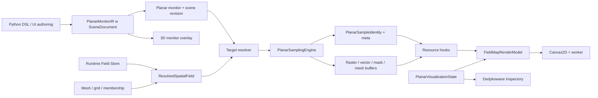
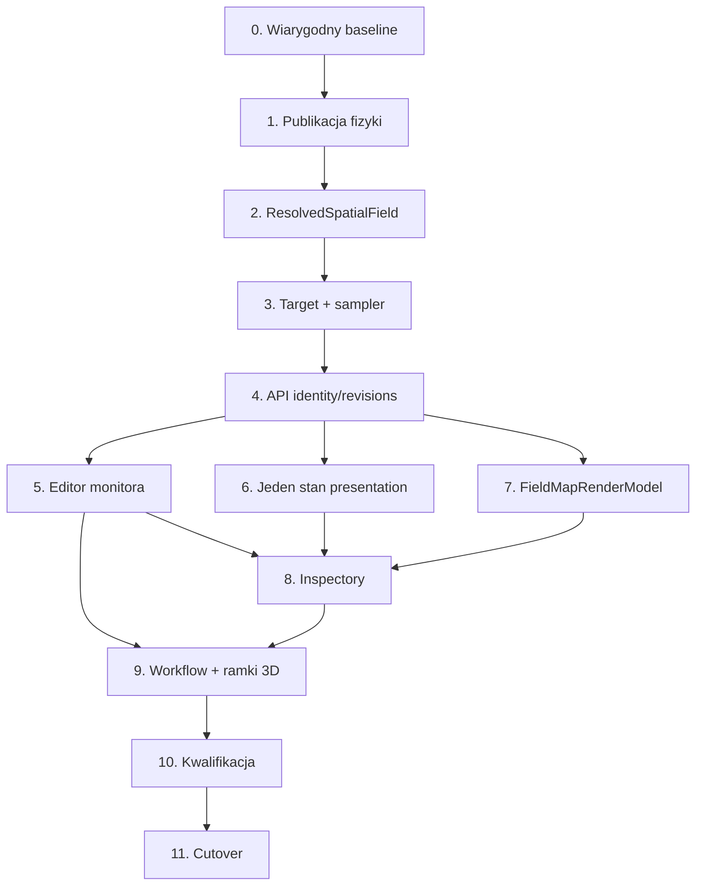

# Refaktoryzacja widoku 2D i monitorów planarnych — audyt oraz plan implementacji

> **Status dokumentu:** plan wykonawczy po audycie kodu; nie jest potwierdzeniem kwalifikacji produkcyjnej.
>
> **Stan źródeł:** Fullmag `4474f035c9a6b051df7f444551dcb4bd2642000a`, A‑MuMax `03c9bf19a5266e64db5658d6d118db10a6a4c78f`, 2026-08-12.
>
> **Dla wykonawców:** przed implementacją obowiązkowo użyć `physics-publication`, `scientific-documentation-contract`, `test-driven-development`, `resource-first-api-check`, `frontend-v2-state-hygiene`, `frontend-v2-viewport-lifecycle` i `verification-before-completion`. Zmiany kontraktu ProblemIR wymagają także `problem-ir-design`, a zmiany ADR lub macierzy możliwości odpowiednio `adr-check` i `capability-matrix-check`.

**Cel:** doprowadzić przełączany widok 3D/2D oraz wiele monitorów planarnych do jednego, spójnego i naukowo poprawnego przepływu dla FDM i FEM, z pełnym sterowaniem w dedykowanych Inspectorach.

**Rekomendowana architektura:** zachować osobny renderer 2D Canvas2D/worker i istniejący `PlanarSamplingEngine`, ale zasilać go wspólnym z widokiem 3D, backendowo neutralnym nośnikiem pola oraz jednym serwerowym stanem wizualizacji. Nie próbować emulować 2D przez kamerę ortograficzną i clipping w rendererze 3D.

**Granica tego dokumentu:** jest to audyt i plan. W tej zmianie nie naprawiono runtime'u, API ani UI i nie wykonano świeżej kwalifikacji FDM/FEM w przeglądarce.

---

## 1. Wynik audytu w skrócie

Fullmag ma już większość elementów potrzebnych do dobrego widoku 2D:

- publiczny `PlanarMonitor` w Python DSL i ProblemIR,
- CRUD monitorów i stan wizualizacji w API v2,
- eksplorator, Inspector monitora i podgląd ramki w 3D,
- operatory `plane_sample`, `slab_average`, `depth_projection` i `surface_projection`,
- sampler FDM/FEM z miarowo ważonym całkowaniem,
- osobny moduł `field-map` z rendererem Canvas2D,
- binarne zasoby rastra, wektorów i przecięcia siatki.

To nie jest jednak jeden działający produkt. Obecna ścieżka 2D powiela rozwiązywanie pól i stan UI, przez co rozjechała się z produkcyjną ścieżką 3D. Najpoważniejsze znalezione problemy to:

1. kompaktowe pola FEM, akceptowane przez Field Store i widok 3D, mogą zostać odrzucone przez planar jako „niezmaterializowane”;
2. target obiektu FDM wybiera wszystkie aktywne komórki zamiast komórek wybranego obiektu;
3. frontend wysyła globalną rewizję pola zamiast rewizji wybranej wielkości, więc poprawne żądanie może dostać `409`;
4. lokalny store `field-map` dubluje aktywny monitor, wielkość i komponent z serwerowym `PlanarVisualizationState`;
5. Inspector 2D nie wystawia większości istniejącego kontraktu warstw, wektorów, jakości i interakcji;
6. renderer przekazuje bufor rastra do workera, a potem próbuje z tego samego bufora liczyć kontury;
7. wektory są rysowane w jednostkach fizycznych jako przesunięcia pikselowe bez skali wizualnej;
8. dotychczasowy smoke test uznawał za sukces dowolny niepusty stary obraz canvasa, nawet gdy nowy monitor nadal wyświetlał „Loading planar field…”.

Wniosek: nie należy dodawać kolejnego „przełącznika 2D” ani łatać pojedynczych pól. Trzeba scalić nośnik danych, stan i semantyczne kontrolki prezentacji, zachowując osobne realizacje renderera 3D i 2D.

## 2. Kryteria sukcesu i granica kwalifikacji

Zmiana jest zakończona dopiero, gdy wszystkie poniższe warunki są prawdziwe:

1. przełączenie `viewport-3d ↔ field-map` zachowuje zaznaczenie, aktywny monitor, wielkość i ustawienia prezentacji oraz nie psuje stanu kamery 3D;
2. użytkownik może utworzyć, zduplikować, edytować i usunąć wiele monitorów oraz zobaczyć ich dokładne ramki/objętości w 3D;
3. monitor ma jawny target, układ lokalny, rozmiar i operator; grubość jest edytowalna dla `slab_average`;
4. FDM i FEM korzystają z tego samego kontraktu nośnika pola, ale zachowują właściwe dla siebie mapowania siatki/topologii;
5. widok 2D obsługuje te same semantyczne opcje prezentacji co 3D tam, gdzie mają sens: raster/shader, wireframe/mesh, punkty próbkowania, quiver, obrys, zakres, jednostkę i przezroczystość;
6. wartości w tooltipach i probe pozostają fizyczne; długość i kolor glyphów są osobnymi, opisanymi transformacjami prezentacyjnymi;
7. test przeglądarkowy dowodzi adopcji dokładnego monitora, operatora, wielkości i rewizji pola, a nie tylko obecności niepustego canvasa;
8. osobne dowody runtime powstaną dla FDM CPU, FEM CPU i FEM GPU; FDM GPU pozostanie niezakwalifikowane, dopóki nie przejdzie własnej bramki;
9. WebGL widoku 3D pozostaje zdrowy po cyklicznym przełączaniu, a ukryty widok 2D nie pozostawia workerów, listenerów ani pętli renderującej;
10. dokumenty statusowe odróżniają: zaimplementowane, wykonywalne, zweryfikowane naukowo, zweryfikowane interaktywnie i zakwalifikowane produkcyjnie.

Nie są kryterium sukcesu:

- sama obecność typów OpenAPI lub kodu samplera;
- zielone testy z syntetycznym pełnym polem FEM, jeżeli produkcja publikuje kompaktowy nośnik;
- screenshot bez powiązania z monitor ID i field revision;
- użycie hostowego builda jako dowodu dla managed FEM/GPU;
- wizualnie podobny obraz bez kontroli jednostek, źródła danych i operatora redukcji.

## 3. Korekta modelu pojęciowego: monitor nie wybiera po prostu „węzłów w ramce”

Sformułowanie „wszystkie węzły FDM lub FEM wewnątrz ramki” jest intuicyjne, ale nie może zostać publiczną definicją naukową.

- Dla `plane_sample` wartość w punkcie płaszczyzny powstaje przez interpolację. Płaszczyzna ma zerową grubość.
- Dla `slab_average` monitor jest zorientowanym prostopadłościanem, a wynik jest średnią ważoną miarą objętości przecięcia, nie liczbą węzłów lub komórek.
- Dla `depth_projection` redukcja przebiega przez głębokość targetu zgodnie z jawną regułą operatora.
- Dla `surface_projection` źródłem jest wybrana powierzchnia/granica, a nie dowolne węzły w pobliżu.

W FEM wybieranie samych węzłów dawałoby wynik zależny od lokalnego zagęszczenia siatki. W FDM proste liczenie środków komórek psułoby częściowe przecięcia przy obróconym monitorze. UI może mówić o „objętości monitora”, lecz Inspector i metadane muszą jawnie podawać operator, efektywną grubość, zajętą miarę i zasady pustych binów.

## 4. Źródła prawdy i zbadany zakres

### 4.1 Obowiązujące dokumenty Fullmaga

- `docs/physics/0970-planar-monitor-sampling-and-projection.md` — istniejąca fizyka próbkowania i projekcji;
- `docs/adr/0020-planar-field-map-and-monitor.md` — decyzja o osobnym module 2D i monitorach jako encjach;
- `docs/specs/frontend-v2/05-viewport-architecture.md` — wspólna architektura powierzchni;
- `docs/specs/frontend-v2/14-viewport-3d-module.md` — kontrakt widoku 3D;
- `docs/specs/frontend-v2/15-viewport-2d-module.md` — kontrakt mapy planarnej;
- `docs/specs/frontend-v2/13-inspector-and-property-editing.md` — własność edycji przez Inspector;
- `docs/specs/resource-first-control-room-api-v2.md` — zasoby v2 i podział control/data plane;
- `docs/architecture/backend-golden-masterplan.md` — własność backendów i obowiązkowa kwalifikacja managed runtime;
- `docs/plans/active/viewport-2d-planar-monitor-production-masterplan-2026-07-18-pl.md` — historyczny plan, obecnie nie może być traktowany jako dowód wykonania;
- `docs/status/2d-slice-capabilities.md` — status wymagający ponownej kwalifikacji.

### 4.2 Główne zbadane ścieżki implementacji

| Warstwa | Istniejąca ścieżka / symbol | Obserwacja |
|---|---|---|
| ProblemIR | `crates/fullmag-ir/src/planar_monitor.rs` | Model operatorów jest zasadniczo właściwy. |
| API schema | `crates/fullmag-api/src/schemas/planar_monitors.rs`, `planar_fields.rs` | Kontrakt ma więcej możliwości niż obecny UI. |
| Planar route | `crates/fullmag-api/src/router_v2/handlers/data/planar_fields.rs` | Powiela rozwiązywanie pól i scope względem głównej ścieżki field resources. |
| Field resolution | `field_resolution.rs`, `resolved_vector_field.rs`, `fields.rs` | Istnieją różne, niespójne mapowania nośnika FEM/FDM. |
| Sampler | `crates/fullmag-api/src/planar_sampling/*` | Właściwe miejsce dla dyskretyzacji i redukcji, nie dla polityki UI. |
| Draft UI | `apps/control-room/src/kernel/workspace/crossSectionWorkspace.ts` | Draft nie obejmuje pełnego ProblemIR i zawsze tworzy `plane_sample`. |
| Inspector definicji | `PlanarMonitorDraftInspectorPanel.tsx`, `PlanarMonitorInspectorPanel.tsx` | Brak pełnej edycji targetu, rozmiaru, orientacji, operatora i grubości. |
| Inspector prezentacji | `PlanarVisualizationSection.tsx` | Wystawia tylko część istniejącego `PlanarVisualizationState`. |
| 3D presentation | `ObjectVisualizationPanel.tsx` | Bogate kontrolki 3D są całkowicie zastępowane ubogą sekcją planar. |
| Moduł 2D | `apps/control-room/src/modules/field-map/FieldMapModule.tsx` | Dubluje aktywną tożsamość widoku i używa globalnej rewizji pola. |
| Surface | `apps/control-room/src/modules/field-map/renderer/PlanarSurface.tsx` | Błąd własności bufora i brak pełnej obsługi warstw/interakcji. |
| Renderer | `apps/control-room/src/modules/field-map/renderer/planarRenderer.ts` | Wektory nie mają jawnej transformacji fizyczna wartość → długość glyphu. |
| Kernel | `KernelProvider.tsx` | Pozostał stary typ `viewport-2d` zamiast kanonicznego `field-map`. |
| Smoke | `apps/control-room/scripts/smoke-viewport-2d.mjs` | Nie dowodzi adopcji nowego zasobu. |

### 4.3 Stan dowodów w chwili audytu

- Skupione testy frontendowe obecnej implementacji przeszły: 19 plików, 46 testów.
- Próba `cargo test -p fullmag-api planar_sampling` nie rozpoczęła testów z powodu braku prawa zapisu do `target/debug`. Nie jest to dowód awarii samplera ani dowód jego poprawności.
- Nie wykonano świeżego managed runtime ani świeżego browser smoke dla aktualnego HEAD.
- Raporty z lipca 2026 są historyczne. Jeden screenshot FEM pokazuje nadal `Loading planar field…` mimo `pass: true`, co potwierdza fałszywie dodatnią bramkę.

W konsekwencji bieżący status powinien brzmieć: **częściowo zaimplementowane, niezakwalifikowane na aktualnym HEAD**.

## 5. Analiza A‑MuMax

### 5.1 Faktyczna implementacja

Zbadano lokalny solver `external_solvers/amumax`, w szczególności:

- `frontend/src/lib/preview/Preview.svelte`;
- `frontend/src/lib/preview/preview2D.ts` i `preview3D.ts`;
- `frontend/src/lib/preview/inputs/Layer.svelte`;
- `Component.svelte` i `QuantityDropdown.svelte`;
- `frontend/src/lib/components/Slider.svelte`;
- `frontend/src/api/incoming/preview.ts`;
- `src/api/sec_preview.go`.

A‑MuMax oferuje szybki wybór quantity, komponentu i warstwy `z`. Gdy wybrano wektor trójskładowy oraz tryb `3D`, frontend pokazuje strzałki Three.js na jednej warstwie. Pozostałe komponenty są renderowane jako mapa 2D w ECharts. Backend wycina pojedynczą warstwę przez `cuda.Resize(..., s.Layer)`, a suwaki X/Y ograniczają ilość danych.

Ważne: tryb „3D” A‑MuMax nie jest pełnym widokiem objętościowym domeny. To przestrzenne glyphy wektorowe osadzone na jednej płaszczyźnie FDM. Nie ma tam:

- dowolnie zorientowanego monitora;
- wielu trwałych monitorów;
- FEM;
- średniej po grubości;
- projekcji przez głębokość ani powierzchnię;
- docelowego scope obiektu/regionu/airboxa;
- jawnej miary zajęcia i provenance redukcji.

### 5.2 Wzorce warte przeniesienia

1. Natychmiastowa i czytelna zmiana trybu bez przechodzenia do osobnego workflow.
2. Quantity, komponent i pozycja warstwy są widoczne razem, blisko wizualizacji.
3. Suwak daje szybką odpowiedź, a wartość da się skorygować precyzyjnie.
4. Decymacja wektorów jest ograniczona budżetem, więc UI pozostaje responsywne.
5. Tryb prezentacji nie zmienia fizycznego źródła danych.

### 5.3 Wzorce, których nie należy kopiować

1. Indeks warstwy `z` jako publiczna geometria — Fullmag potrzebuje SI, ramy lokalnej i dowolnej orientacji.
2. Globalny, mutowalny stan preview po stronie serwera — Fullmag ma sesje, zasoby, rewizje i wiele monitorów.
3. Normalizacja długości wektora bez jawnej provenance — wartość fizyczna i styl glyphu muszą być rozdzielone.
4. Założenia czystego, regularnego FDM — FEM wymaga interpolacji i miarowego całkowania.
5. Związek „komponent 3D = renderer 3D” — w Fullmagu quiver jest warstwą prezentacji dostępną w obu widokach.

## 6. Diagnoza przyczyn źródłowych

### 6.1 P0 — nośnik pola FEM

`extract_fem_field` w planarnej ścieżce oczekuje liczby próbek równej liczbie wszystkich węzłów siatki. Jednocześnie Field Store jawnie akceptuje kompaktowy wektor tylko na węzłach magnetycznych, a główna ścieżka zasobów potrafi go rozwinąć przez `global_node_ids` / `fem_magnetic_node_indices`.

Skutek: pole może być legalne, widoczne w 3D i niedostępne w 2D. Naprawa jednego quantity byłaby błędem architektonicznym. Planar musi konsumować ten sam rozstrzygnięty nośnik co pozostałe zasoby.

### 6.2 P0 — scope obiektu FDM

Obecny resolver sprawdza, czy object ID istnieje, ale następnie przyjmuje wszystkie komórki z membership różnym od wartości pustej. To wybiera wszystkie obiekty.

Docelowo nośnik FDM musi dostarczyć jednoznaczne mapowanie komórka → obiekt/region. `region_legend` może być użyty tylko wtedy, gdy jawnie mapuje regiony na dany obiekt. Komórki domyślne lub nieprzypisane muszą mieć określoną własność albo żądanie ma zakończyć się kontrolowanym błędem; nie wolno zgadywać.

### 6.3 P0 — rewizja wybranej wielkości

Backend sprawdza dokładną `field_quantity_revision`. `FieldMapModule` wysyła globalne `status.resources.field_revision`, które może być maksymalną rewizją innego pola.

Skutek: poprawne żądanie wybranego quantity może dostać `409 stale_field_revision`. Frontend powinien używać rewizji z deskryptora/metadanych dokładnie wybranego quantity albo nieprzezroczystego tokenu próbki otrzymanego z API.

### 6.4 P0 — test nie dowodzi zmiany obrazu

`waitForCanvasPaint` przechodzi, gdy dowolny piksel canvasa ma niezerową alfę. Po przełączeniu monitora stary obraz spełnia ten warunek natychmiast. Test nie sprawdza:

- aktywnego monitor ID;
- operatora;
- quantity i component;
- field/mesh revision;
- zakończenia loading;
- checksum/zakresu nowego rastra;
- liczby glyphów;
- obecności siatki lub konturu;
- poprawnego probe.

Najpierw trzeba naprawić dowód, potem kod. Inaczej dalsza praca może ponownie produkować zielone, ale fałszywe raporty.

### 6.5 P1 — extent targetu FEM

Elementy są filtrowane przez scope, lecz dynamiczny extent jest liczony ze wszystkich węzłów siatki. Dla obiektu, regionu lub airboxa rama może więc objąć cały wszechświat zamiast wybranego targetu.

Extent należy liczyć wyłącznie z węzłów referencjonowanych przez wybrane elementy.

### 6.6 P1 — airbox FDM

Planarna ścieżka odrzuca target airbox, mimo że główna ścieżka pól ma `load_fdm_multilayer_airbox_carrier`. Obsługa powinna zależeć od faktycznej możliwości quantity/carriera, a nie od globalnego zakazu FDM.

### 6.7 P1 — stan UI ma dwóch właścicieli

`fieldMapStore` przechowuje aktywny monitor, quantity i component równolegle do `PlanarVisualizationState`. Pierwszy monitor oraz niektóre komendy aktualizują tylko lokalny store, podczas gdy Inspector czyta stan serwerowy.

To tworzy niemożliwe do wyjaśnienia kombinacje: inny monitor w Inspectorze, inny w module i inny w żądaniu zasobu. Stan tożsamości widoku musi mieć jednego właściciela.

### 6.8 P1 — niewykorzystany kontrakt prezentacji

Schema ma warstwy `raster`, `contours`, `mesh`, `boundaries`, `vectors`, `probes`, styl wektora, zoom/pan, resolution i quality. UI i renderer obsługują tylko podzbiór. W planar context `ObjectVisualizationPanel` całkowicie zastępuje kontrolki 3D ubogą sekcją.

Rozwiązaniem nie jest skopiowanie JSX z panelu 3D. Należy wydzielić wspólne semantyczne sekcje kontrolek, a adapter 2D ma mapować je na właściwe warstwy Canvas2D.

### 6.9 P1 — własność bufora i kontury

`PlanarSurface` przekazuje `values.buffer` do workera kolorującego, co w prawdziwym Workerze odłącza bufor. Następnie próbuje z tych samych wartości policzyć marching squares.

Testy z mockiem workera nie odtwarzają transferu. Najprostsza poprawna kolejność to policzenie konturów przed transferem. Lepsza architektura długoterminowa to jeden worker tworzący raster i kontury z jednego immutable wejścia.

### 6.10 P1 — quiver miesza fizykę z geometrią ekranu

Końcówka strzałki jest liczona z surowych `u/v` pola jako przesunięcie po komórkach. Dla A/m lub T prowadzi to do glyphów poza ekranem. Brakuje też pełnego stylu, arrowheadów i poprawnego kodowania komponentu normalnego.

Renderer potrzebuje osobnego `VectorGlyphTransform`:

- fizyczna wartość pozostaje w tooltipie/probe;
- kierunek wynika ze składowych w bazie monitora;
- długość używa `constant`, `normalized` lub udokumentowanej skali;
- kolor używa jawnego `color_mode`;
- liczba glyphów respektuje budżet;
- składowa normalna ma znak i czytelny symbol, a nie przypadkową kreskę.

### 6.11 P2 — blokada cache

Mutex cache próbek jest trzymany podczas kosztownego obliczenia. Równoległe żądania serializują się. Należy rozdzielić lookup, obliczenie i insert albo użyć single-flight per klucz.

### 6.12 P2 — dryf nazewnictwa

W audytowych typach `KernelProvider` nadal występuje `viewport-2d`, podczas gdy kanoniczny moduł nazywa się `field-map`. To ma zostać usunięte przy cutoverze, aby nie powstała trzecia tożsamość tej samej powierzchni.

## 7. Rozważone warianty architektury

### Wariant A — łatanie obecnego `field-map`

Zakres: naprawić kompaktowy FEM, kilka kontrolek i smoke bez zmiany własności danych.

Zaleta: najmniejszy krótkoterminowy diff.

Wada: pozostawia dwa resolvery pól, dwóch właścicieli stanu i dwa słowniki presentation. Każda następna zmiana w polach lub scope może ponownie popsuć 2D.

**Decyzja:** odrzucony jako rozwiązanie docelowe; pojedyncze poprawki mogą wystąpić tylko jako test-first krok migracji.

### Wariant B — wspólny nośnik przestrzenny, osobne renderery

Zakres:

- jeden backendowo neutralny `ResolvedSpatialField` / `SpatialFieldCarrier`;
- jeden resolver targetu i mapowań encji;
- istniejący `PlanarSamplingEngine` jako właściciel operatorów 2D;
- jeden serwerowy profil wizualizacji;
- wspólne semantyczne kontrolki Inspectora;
- osobny WebGL 3D i osobny Canvas2D/worker.

Zalety:

- usuwa przyczyny dryfu zamiast objawów;
- zachowuje naukowo poprawne redukcje;
- nie obciąża widoku 2D cyklem życia WebGL;
- wspiera FDM i FEM bez udawania, że mają taki sam layout;
- pozostaje zgodny z ADR 0020 i resource-first API.

Koszt: wymaga migracji backendu, UI i testów w skoordynowanych etapach.

**Decyzja:** rekomendowany.

### Wariant C — widok 2D jako kamera ortograficzna/clipping renderera 3D

Zaleta: pozornie najpłynniejsza zmiana wizualna i łatwe współdzielenie shaderów.

Wady:

- clipping nie wykonuje `slab_average` ani projekcji miarowej;
- utrudnia dokładny raster, kontury, probe i eksport;
- zwiększa ryzyko lifecycle WebGL;
- miesza renderowanie z operatorem naukowym;
- łamie przyjęty podział modułów.

**Decyzja:** odrzucony. Kamera ortograficzna może być pomocniczym presetem 3D, ale nie realizacją mapy planarnej.

## 8. Docelowy model produktu

### 8.1 Płynne przełączanie 3D/2D

Kanoniczna kontrolka przełącza aktywną powierzchnię `viewport-3d` i `field-map`. Musi być dostępna:

- w grupie View na ribbonie;
- w nagłówku centralnej powierzchni jako segmented control;
- przez komendę/skrót klawiaturowy;
- z akcji „Open in 2D” na monitorze.

Przełączenie:

1. nie tworzy nowego monitora automatycznie, jeżeli istnieje aktywny;
2. zachowuje aktywny quantity/component;
3. zachowuje osobno kamerę 3D i zoom/pan 2D;
4. zaznacza ten sam monitor w Explorerze i Inspectorze;
5. nie utrzymuje ukrytej pętli renderowania;
6. może zachować immutable cache ostatniego rastra, ale musi zweryfikować jego sample identity przed pokazaniem.

Jeżeli nie ma monitora, `field-map` pokazuje pusty stan z akcjami „New monitor from current view” i „Choose existing monitor”, a nie milczący fallback do środkowej warstwy.

### 8.2 Monitor jako encja sceny

Monitor ma cztery niezależne grupy właściwości:

| Grupa | Kanoniczne dane |
|---|---|
| Target | domain, magnetic domain, object, region, mesh part lub airbox — tylko gdy capability na to pozwala |
| Rama | origin, ortonormalne osie `u/v/n`, jawny preset XY/XZ/YZ lub orientacja arbitralna |
| Obszar | extent `u/v`, opcjonalny padding, reguła dynamicznego dopasowania do targetu |
| Operator | plane sample, slab average + thickness, depth projection, surface projection + boundary selector |

Quantity, component, colormap, quiver i range nie należą do definicji monitora. Są ustawieniami prezentacji sesji. Dzięki temu ten sam monitor może oglądać `m`, `H_demag` i `Ms` bez duplikowania geometrii.

### 8.3 Wizualizacja ramki w 3D

- `plane_sample`: prostokąt i półprzezroczysta płaszczyzna, bez sugerowania niezerowej grubości;
- `slab_average`: dokładny zorientowany prostopadłościan o rzeczywistej grubości;
- `depth_projection`: rama oraz oznaczenie pełnego przedziału targetu wzdłuż `n`;
- `surface_projection`: podświetlona wybrana powierzchnia i jej atlas/układ lokalny;
- aktywny monitor ma wyraźny stan selected/hover;
- pozostałe monitory są widoczne opcjonalnie jako oszczędne wireframe;
- kolor monitora pochodzi z tokenów `--fm-*` i jest ten sam w Explorerze, Inspectorze, 3D i 2D.

W pierwszym wydaniu edycja może odbywać się w Inspectorze z natychmiastowym preview. Uchwyty/gizmo w 3D należy dodać dopiero po stabilizacji transakcji i testów orientacji; nie mogą być jedynym sposobem precyzyjnej edycji.

### 8.4 Sposoby tworzenia monitora

1. **New monitor from current view** — rama przechodzi przez pivot kamery, a normalna jest zgodna z kierunkiem patrzenia.
2. **Preset XY/XZ/YZ** — środek targetu oraz jawna pozycja w SI lub procentach jego aktualnego extentu.
3. **Z kontekstu Explorer/Viewport** — domain, object, region, mesh part lub airbox staje się targetem.
4. **Convert clip plane to monitor** — kopiuje bieżącą płaszczyznę clippingu, ale tworzy trwałą encję sceny.
5. **Duplicate monitor** — zachowuje ramę/operator i nadaje nową nazwę.

Każda ścieżka kończy się tym samym `PlanarMonitorDraft` i tym samym edytorem. Nie wolno implementować pięciu niezależnych payloadów.

### 8.5 Suwak grubości

Suwak pojawia się wyłącznie dla `slab_average`.

- ma pole liczbowe z jednostką długości oraz slider;
- minimum i krok wynikają z rozdzielczości przestrzennej/nośnika, lecz użytkownik może wpisać dokładną wartość SI;
- maksimum wynika z rozstrzygniętego extentu targetu wzdłuż normalnej;
- podczas przeciągania frontend pokazuje anulowalny, debounced preview w niższej jakości;
- zapis do SceneDocument następuje przy commit/pointer-up lub Apply, nie dla każdego piksela ruchu;
- UI pokazuje wartość żądaną, efektywnie przecięty przedział oraz occupied measure;
- przejście do dokładnie zerowej grubości zmienia operator na `plane_sample` tylko po jawnej akcji, a nie przez ukryty próg.

### 8.6 Inspector definicji monitora

Dedykowany panel „Planar Monitor” powinien mieć sekcje:

1. **Identity:** name, enabled, color/label.
2. **Target:** universe/magnetic/object/region/mesh-part/airbox z capability-based options.
3. **Frame:** preset, origin, position, normal, roll/rotation, flip normal.
4. **Extent:** width `u`, height `v`, fit-to-target, padding.
5. **Sampling operator:** kind, thickness, reduction, boundary selector, empty-bin policy.
6. **Resolution preview:** przewidywana liczba binów i koszt; sama resolution należy do presentation.
7. **Actions:** Apply, Discard, Duplicate, Delete, Open in 2D, Show in 3D.
8. **Diagnostics:** scene revision, target resolution, capability errors, last sample identity.

Committed monitor musi używać tego samego edytora co draft, tylko z transakcją optimistic concurrency. Obecny read-only Inspector nie spełnia tego kontraktu.

### 8.7 Inspector wizualizacji 2D

Panel „2D Visualization” jest stanem prezentacji, nie częścią ProblemIR:

| Sekcja | Sterowanie |
|---|---|
| Source | monitor, quantity, component, live/persisted sample |
| Scalar style | shader/colormap, display unit, auto/manual/symmetric range, opacity |
| Geometry | raster, bounds, mesh/wireframe, sample points, boundaries |
| Contours | visible, level count lub jawne poziomy, color, width |
| Vectors | visible, quiver style, density/budget, length mode, scale, color mode, normal-component symbol |
| Probe | hover/pinned, interpolation mode, coordinates globalne i `u/v`, occupancy |
| Quality | resolution, interactive/final quality, decimation budget |
| View | zoom, pan, fit, reset, aspect lock |
| Provenance | backend/device, quantity unit, operator, thickness, field/mesh/scene revision, cache/source |

### 8.8 Parzystość semantyczna 3D i 2D

Parzystość nie oznacza współdzielenia kodu renderera jeden do jednego. Oznacza wspólny język prezentacji:

| Pojęcie 3D | Realizacja 2D |
|---|---|
| surface/quantity shader | raster z tym samym quantity, komponentem, colormapą i range |
| wireframe | dokładne linie przecięcia FEM lub grid/bounds FDM |
| points | rzeczywiste centra próbek/węzły z provenance |
| vectors/quiver | składowe w bazie `u/v/n` z jawnie skalowaną długością |
| bounds | obrys supportu monitora i targetu |
| opacity | kompozycja warstw planar, niezależna od wartości fizycznej |
| selection | ten sam target i monitor w Explorerze/Inspectorze |

Kontrolki należy współdzielić na poziomie semantycznych komponentów Inspectora. Adapter modułu decyduje, czy dana capability ma sens i jak mapuje się na renderer.

## 9. Docelowa architektura danych



### 9.1 `ResolvedSpatialField`

Nowy wewnętrzny kontrakt backendowy powinien zawierać co najmniej:

- quantity ID, kind, canonical unit i component semantics;
- source: live/persisted/preview oraz backend/device provenance;
- field generation i rewizję dokładnie tej wielkości;
- storage layout: FDM cells, FEM full nodes, FEM compact nodes, element data lub airbox carrier;
- wartości bez utraty precyzji;
- grid/topology oraz jawne mapowanie lokalny indeks → globalna encja;
- membership/scope carrier;
- mesh/grid revision;
- capability flags dla legalnych targetów i operatorów.

Nie musi być publicznym JSON-em. Ma być jedynym wejściem danych przestrzennych zarówno do planar sampling, jak i adapterów zasobów 3D. Backend FDM i FEM wciąż realizują własne mapowania; współdzielony jest kontrakt, nie layout.

### 9.2 Rozstrzygnięcie targetu

`ResolvedSpatialTarget` powinien zwracać:

- wybrane komórki/elementy/encje źródłowe;
- dokładny target kind i target ID;
- bounds liczone wyłącznie z wybranych encji;
- occupancy/membership;
- diagnostykę pustego targetu;
- capability dla airboxa i powierzchni;
- stabilny fingerprint do cache.

### 9.3 Tożsamość próbki

Każdy wynik musi mieć immutable identity obejmującą:

- session ID;
- monitor ID i monitor revision;
- scene revision;
- target fingerprint;
- quantity ID i component;
- field quantity revision/generation;
- mesh/grid revision;
- operator wraz z parametrami;
- resolution i quality;
- source/provenance.

Frontend nie może uznać starego canvasa za wynik nowej identity. Loading, error i ready są stanami konkretnej identity.

### 9.4 Własność stanu

| Stan | Jedyny właściciel |
|---|---|
| definicje monitorów | SceneDocument / ProblemIR |
| aktywna powierzchnia | workspace layout/kernel |
| aktywny monitor, quantity, component, layers, style, resolution | serwerowy `PlanarVisualizationState` |
| field/mesh data i rewizje | runtime resource store |
| zaznaczenie obiektu/monitora | centralny selection store |
| hover, bieżący drag i uchwyty workera | lokalny stan komponentu |
| kamera 3D i pan/zoom 2D | odpowiedni adapter surface state z hydration-safe snapshot |

Po migracji `fieldMapStore` nie może przechowywać aktywnego monitora, quantity ani component. Może zniknąć całkowicie lub pozostać wyłącznie dla efemerycznego hoveru, jeżeli nie da się go utrzymać lokalnie w surface.

### 9.5 Cache i współbieżność

- klucz cache opiera się na sample identity, nie na częściowym zestawie rewizji;
- lock służy tylko do lookup/insert;
- kosztowne sampling wykonuje się poza lockiem;
- identyczne równoległe żądania mogą używać single-flight;
- zmiana grubości anuluje poprzedni preview request;
- cache z niższej interactive quality nie może zostać błędnie pokazany jako final quality;
- limity pamięci i eviction są mierzalne w diagnostics.

## 10. Kontrakty backendowe FDM i FEM

### 10.1 FDM

Wymagane:

1. regularny grid z centers/spacing/counts i jawny active mask;
2. membership jednoznacznie wiążący komórkę z object/region;
3. osobny carrier airboxa dla quantity, które rzeczywiście istnieją na rozszerzonej siatce;
4. częściowe przecięcie obróconego slab z komórką;
5. grid overlay odpowiadający faktycznie próbkowanym komórkom;
6. fail-closed dla niejednoznacznej własności komórki.

Nie wolno interpretować `active mask` jako przynależności do wybranego obiektu.

### 10.2 FEM

Wymagane:

1. pełne i kompaktowe pola węzłowe z jawnie rozwiązaną mapą global node IDs;
2. target element set oraz bounds z węzłów użytych przez ten set;
3. przecięcie płaszczyzny/slab z elementami i miarowo ważone całkowanie;
4. zachowanie regionów, parts i airbox topology;
5. jawne pochodzenie CPU/GPU pola nawet wtedy, gdy planar sampling jest CPU post-processingiem;
6. kontrolowany błąd dla nieobsługiwanych elementów wyższego rzędu.

Nie wolno cicho traktować wyższego rzędu jak P1.

### 10.3 Wspólna semantyka, osobna realizacja

Równania, jednostki, znaki, komponenty `u/v/n` i metadane operatora są wspólne. Algorytmy wyszukiwania elementów, layout pamięci i carrier airboxa są backendowe. To odpowiada zasadzie Fullmaga: wspólny kontrakt fizyczny, odrębne realizacje numeryczne.

## 11. Zmiany API i OpenAPI

Istniejące resource families należy zachować. Plan nie wprowadza alternatywnego endpointu „preview”.

Wymagane zmiany:

1. odpowiedzi metadata zwracają pełną sample identity lub nieprzezroczysty `sample_token`;
2. binarne linki rastra/wektorów/siatki są związane z tą samą identity;
3. oczekiwana rewizja pola dotyczy wybranego quantity;
4. `PlanarVisualizationState` pozostaje jedynym stanem presentation i udostępnia cały istniejący kontrakt warstw/stylu/interakcji;
5. CRUD monitora wspiera pełny model target/frame/extent/operator, bez draft-only skrótu;
6. błędy rozróżniają: quantity unavailable, target unsupported, empty target, stale scene, stale field, unsupported element order i ambiguous membership;
7. eventy revision-driven unieważniają tylko właściwe zasoby;
8. frontend korzysta z wygenerowanego klienta i resource hooks; komponenty nie składają URL-i ręcznie.

Jeżeli sample identity wymaga rozszerzenia publicznego JSON, trzeba zaktualizować:

- `crates/fullmag-api/src/openapi_v2.rs`;
- `apps/control-room/src/kernel/api/generated/openapi-v2.json` oraz generowane typy/klient;
- schematy Rust;
- wygenerowane typy/transport frontendowy;
- testy kontraktu i fixture;
- ADR 0020, jeżeli zmienia się utrwalona decyzja, a nie tylko jej realizacja.

## 12. Plan implementacji

Każde zadanie zaczyna się od testu, który zawodzi na obecnym kodzie. Commity powinny być małe i rozdzielać kontrakt, backend, UI oraz kwalifikację.

### Task 0 — zamrozić prawdziwy baseline

**Pliki:**

- modyfikacja: `apps/control-room/scripts/smoke-viewport-2d.mjs`;
- modyfikacja: `docs/status/2d-slice-capabilities.md`;
- modyfikacja: `docs/plans/active/viewport-2d-planar-monitor-production-masterplan-2026-07-18-pl.md`;
- nowy fixture produkcyjnego compact FEM i multi-object FDM w istniejącym katalogu smoke.

**Kroki:**

1. Oznaczyć lipcowe raporty jako historyczne, nie jako dowód aktualnego HEAD.
2. Dodać do DOM/test API: monitor ID, operator kind, sample identity, status ready/error, field revision, raster checksum/range, glyph count i overlay counts.
3. Napisać test, w którym stary canvas jest niepusty, nowy request nadal loading, a asercja musi zawieść.
4. Dodać fixture kompaktowego FEM oraz FDM z co najmniej dwoma obiektami.
5. Uruchomić obecny smoke i zachować oczekiwane czerwone wyniki jako baseline.

**Weryfikacja:** raport nie może mieć `pass: true`, jeżeli screenshot lub telemetry nadal wskazują loading albo inną identity.

### Task 1 — uzupełnić publikację fizyki przed kodem

**Pliki:**

- modyfikacja: `docs/physics/0970-planar-monitor-sampling-and-projection.md`;
- nowy: `docs/physics/0970-planar-monitor-sampling-and-projection.source-map.json`;
- modyfikacja: `docs/adr/0020-planar-field-map-and-monitor.md`, tylko jeśli zmienia się decyzja kontraktowa;
- modyfikacja: odpowiednie wpisy macierzy możliwości.

**Kroki:**

1. Dopisać formalną definicję oriented plane/slab/depth/surface support.
2. Oddzielić wybór supportu od interpolation/integration i od presentation.
3. Zdefiniować grubość, occupied measure, empty-bin policy, komponenty `u/v/n` oraz jednostki.
4. Dodać mapę source path + stable symbol dla FDM, FEM, API i UI.
5. Ustalić legalność target/operator per backend/device.
6. Oznaczyć bieżącą implementację jako niezakwalifikowaną do czasu przejścia nowych bramek.

**Weryfikacja:** walidatory dokumentacji naukowej, MathJax/MyST, source-map i capability matrix przechodzą.

### Task 2 — wprowadzić wspólny nośnik pola

**Pliki:**

- nowy: `crates/fullmag-api/src/router_v2/handlers/data/resolved_spatial_field.rs`;
- modyfikacja: `field_resolution.rs`;
- modyfikacja: `resolved_vector_field.rs`;
- modyfikacja: `fields.rs`;
- modyfikacja: `crates/fullmag-api/src/router_v2/handlers/data/mod.rs`;
- testy jednostkowe przy resolverze oraz integracyjne w `crates/fullmag-api/src/router_v2/tests.rs`.

**Testy najpierw:**

- `compact_fem_field_resolves_global_node_ids`;
- `full_fem_field_keeps_identity_mapping`;
- `fdm_object_scope_selects_only_requested_object`;
- `fdm_ambiguous_default_membership_fails_closed`;
- `fdm_airbox_quantity_uses_airbox_carrier`;
- `quantity_revision_is_not_global_field_revision`.

**Implementacja:**

1. Zbudować `ResolvedSpatialField` z istniejących, sprawdzonych mapowań.
2. Przenieść rozstrzyganie compact/full FEM do jednego miejsca.
3. Udostępnić jawny carrier membership i airbox.
4. Przepiąć obecne zasoby pola na adapter nowego kontraktu bez zmiany odpowiedzi publicznej.
5. Dopiero potem przepiąć planar.

**Weryfikacja:** stare testy field resources oraz nowe testy carrier przechodzą; nie ma one-off branchy dla `H_demag`.

### Task 3 — naprawić target resolver i sampler

**Pliki:**

- modyfikacja: `crates/fullmag-api/src/router_v2/handlers/data/planar_fields.rs`;
- modyfikacja: `crates/fullmag-api/src/planar_sampling/*`;
- modyfikacja: cache planarny w stanie API;
- testy: istniejące moduły `planar_sampling/tests.rs` i route integration.

**Testy najpierw:**

- bounds FEM tylko z wybranych elementów;
- plane/slab na compact FEM równe full FEM;
- target object FDM nie zawiera sąsiedniego obiektu;
- airbox działa tylko dla quantity z legalnym carrierem;
- stałe pole pozostaje stałe po obrocie i zmianie rozdzielczości;
- średnia slab jest niezmienna przy refinement;
- lock cache nie obejmuje czasu obliczenia;
- dwie różne quantity revisions nie współdzielą wpisu cache.

**Implementacja:**

1. Usunąć stare `extract_fdm_field` / `extract_fem_field` z planar route.
2. Wprowadzić `ResolvedSpatialTarget`.
3. Liczyć dynamic extent ze scope, nie z całej siatki.
4. Włączyć legalny carrier airboxa.
5. Zbudować pełną sample identity.
6. Zwolnić mutex przed samplingiem i opcjonalnie dodać single-flight.

**Weryfikacja:** manufactured-field tests i route tests przechodzą dla FDM oraz FEM.

### Task 4 — uszczelnić API rewizji i zasobów

**Pliki:**

- modyfikacja: `crates/fullmag-api/src/schemas/planar_fields.rs`;
- modyfikacja: `crates/fullmag-api/src/schemas/planar_monitors.rs`;
- modyfikacja: route metadata/link handlers;
- modyfikacja: OpenAPI v2 i wygenerowane typy klienta;
- testy: OpenAPI contract, stale revision i resource invalidation.

**Kroki:**

1. Dodać sample identity/token do meta.
2. Powiązać każdy binary resource link z tą identity.
3. Przyjmować expected revision dokładnie wybranego quantity.
4. Dodać stabilne kody błędów.
5. Upewnić się, że event nowego pola unieważnia odpowiednią kombinację quantity/monitor.

**Weryfikacja:** test generacji klienta oraz test `409` rozróżniają scenę, mesh i quantity field revision.

### Task 5 — pełny edytor definicji monitora

**Pliki:**

- modyfikacja: `apps/control-room/src/kernel/workspace/crossSectionWorkspace.ts`;
- nowy: `apps/control-room/src/modules/inspector/panels/PlanarMonitorDefinitionEditor.tsx`;
- modyfikacja: `PlanarMonitorDraftInspectorPanel.tsx`;
- modyfikacja: `PlanarMonitorInspectorPanel.tsx`;
- modyfikacja: scene transaction/API facade;
- testy komponentów obu paneli.

**Testy najpierw:**

- draft round-tripuje każdy target/frame/operator do ProblemIR;
- slab pokazuje i zapisuje thickness, plane jej nie pokazuje;
- edycja committed monitora obsługuje Apply/Discard i konflikt rewizji;
- niedostępny target jest disabled z powodem capability;
- duplicate tworzy nowy ID;
- wartości SI i jednostka wyświetlana konwertują się bez utraty.

**Implementacja:**

1. Zastąpić zredukowany `PlanarMonitorDraft` modelem odpowiadającym pełnemu IR.
2. Współdzielić jeden edytor draft/committed.
3. Dodać target, arbitrary frame, extent i pełny operator.
4. Dodać transient preview grubości i commit na zakończenie interakcji.
5. Zachować SSR/client hydration parity.

**Weryfikacja:** UI round-trip → SceneDocument → canonical Python export zachowuje monitor bez dryfu.

### Task 6 — ustanowić jednego właściciela stanu prezentacji

**Pliki:**

- modyfikacja: `apps/control-room/src/modules/field-map/fieldMapStore.ts`;
- modyfikacja: `FieldMapModule.tsx`;
- modyfikacja: komendy `field-map` i resource hooks;
- modyfikacja: `KernelProvider.tsx`;
- testy store/module/hydration.

**Testy najpierw:**

- zmiana monitora z Inspectora, Explorera i command palette daje ten sam active ID;
- pierwszy monitor jest aktywowany serwerowo;
- quantity/component nigdy nie wracają z lokalnego fallbacku;
- SSR first client render używa server snapshot;
- stary `viewport-2d` nie jest akceptowany jako module ID.

**Implementacja:**

1. Wszystkie akcje patchują `PlanarVisualizationState` przez typed facade.
2. Resource hooks czytają wyłącznie stan serwerowy.
3. Usunąć identity fields z `fieldMapStore`.
4. Pozostawić lokalnie tylko hover/drag/worker handles.
5. Usunąć dryf `viewport-2d` → `field-map`.

**Weryfikacja:** jeden trace zmiany monitora pokazuje jedną transakcję i jedną revision-driven invalidację.

### Task 7 — rozbudować `FieldMapRenderModel` i naprawić renderer

**Pliki:**

- modyfikacja: `apps/control-room/src/modules/field-map/model/fieldMapRenderModel.ts`;
- modyfikacja: `apps/control-room/src/modules/field-map/renderer/PlanarSurface.tsx`;
- modyfikacja: `apps/control-room/src/modules/field-map/renderer/planarRenderer.ts`;
- modyfikacja: `apps/control-room/src/modules/field-map/renderer/vectorGlyphs.ts`;
- modyfikacja: worker/colorizer i marching squares w tym samym katalogu `renderer`;
- testy: `renderer/PlanarSurface.test.tsx`, `renderer/planarRenderer.test.ts`, `renderer/vectorGlyphs.test.ts` oraz test realnego transferu ArrayBuffer.

**Testy najpierw:**

- contours powstają po realnym transferze do Workera;
- wyłączenie raster/contours/mesh/vectors rzeczywiście usuwa warstwę;
- display unit zmienia osie/tooltip, lecz nie dane canonical;
- manual/symmetric range daje deterministyczne kolory;
- quiver nie wychodzi poza komórkę dla ogromnej wartości fizycznej;
- normal component zachowuje znak;
- Enter/Space pinują środek rzeczywistych bounds, nie `0.5 m`;
- pan/zoom/fit działają z DPR i resize.

**Implementacja:**

1. Rozbudować istniejący `FieldMapRenderModel` tak, aby łączył data resources i presentation w jeden immutable model renderowania.
2. Uporządkować własność bufora; preferować jeden worker raster + contours.
3. Wprowadzić `VectorGlyphTransform` i budżet glyphów.
4. Zastosować wszystkie layer flags, range, colormap, opacity i jednostki.
5. Dodać pan/zoom, poprawne osie i dostępny keyboard probe.
6. Renderować tylko po zmianie modelu/interaction, nigdy w idle loop.

**Weryfikacja:** testy pikselowe/geometryczne oraz browser screenshoty dla każdej warstwy.

### Task 8 — współdzielone kontrolki prezentacji i dedykowane Inspectory

**Pliki:**

- nowy lub refaktoryzowany zestaw w `apps/control-room/src/modules/inspector/visualization/*`;
- modyfikacja: `ObjectVisualizationPanel.tsx`;
- modyfikacja: `PlanarVisualizationSection.tsx`;
- testy Inspectora oraz manifestu modułu.

**Testy najpierw:**

- 2D pokazuje tylko capability-legal controls;
- wireframe, points i vectors mapują się na właściwe layer flags;
- styl quiver jest zachowany przy 3D → 2D, jeśli semantyka jest wspólna;
- ustawienie specyficzne tylko dla 3D nie jest fałszywie pokazywane w 2D;
- ukrycie warstwy działa natychmiast.

**Implementacja:**

1. Wydzielić małe, semantyczne sekcje: FieldSource, ScalarStyle, GeometryLayers, VectorStyle, RangeUnit, Quality, Provenance.
2. Dostarczyć adapter 3D i adapter planar.
3. Rozbudować dedykowany Inspector 2D o cały kontrakt.
4. Zachować klasy `fm-*`, tokeny `--fm-*` i shadcn/ui primitives.

**Weryfikacja:** brak duplikacji definicji opcji, a każdy control ma test zasobu docelowego.

### Task 9 — workflow tworzenia i ramki 3D

**Pliki:**

- modyfikacja: ribbon/module commands;
- modyfikacja: Explorer context actions;
- modyfikacja: `apps/control-room/src/modules/viewport-3d/*`;
- modyfikacja: overlay monitora;
- testy commands, selection oraz viewport lifecycle.

**Testy najpierw:**

- pięć ścieżek tworzenia kończy się tym samym canonical draft;
- rama plane nie udaje slab;
- grubość slab w 3D odpowiada wartości w Inspectorze;
- kliknięcie ramki wybiera właściwy monitor;
- ukryty overlay nie ma listenerów;
- 100 przełączeń nie traci kontekstu WebGL i nie mnoży workerów.

**Implementacja:**

1. Dodać ribbon/segmented switch i komendy.
2. Dodać creation presets, context actions, clip-to-monitor i duplicate.
3. Renderować dokładny support operatora w 3D.
4. Dodać Inspector-driven preview.
5. Rozważyć gizmo dopiero po przejściu bramek 1–4.

**Weryfikacja:** browser smoke potwierdza widoczny canvas WebGL, `gl.isContextLost() === false` i niezerowy drawing buffer po przełączeniach.

### Task 10 — kwalifikacja naukowa i runtime

**Pliki:**

- modyfikacja/nowe fixture w `apps/control-room/scripts` i testach API;
- nowe raporty w dedykowanym `.fullmag/reports` generowane przez recepturę;
- aktualizacja statusu dopiero po otrzymaniu dowodów.

**Macierz obowiązkowa:**

| Oś | Wartości |
|---|---|
| Lane | FDM CPU, FEM CPU, FEM GPU; FDM GPU jako osobny gate/no-go |
| Frame | XY, XZ, YZ, arbitralna |
| Operator | plane, slab, depth; surface tam, gdzie legalny |
| Target | domain, magnetic, object, region/part, airbox tam, gdzie legalny |
| Quantity | `m` scalar/magnitude/vector, `H_eff`, `H_demag`, co najmniej jedno scalar material |
| Layer | raster, contour, wireframe/mesh, points, quiver, bounds, probe |
| Source | live oraz persisted snapshot |

**Testy naukowe:**

1. stałe pole — każdy niepusty bin ma tę samą wartość;
2. liniowe pole — znany przekrój i analityczna średnia slab;
3. refinement — wynik średniej nie zależy od liczby węzłów;
4. obrócony monitor — zachowana baza i znaki `u/v/n`;
5. FDM/FEM parity na wspólnej geometrii;
6. object isolation — brak przecieku sąsiedniego obiektu;
7. airbox provenance — pole pochodzi z właściwego carriera;
8. kompaktowe FEM — wynik identyczny z równoważnym pełnym polem.

**Weryfikacja runtime:**

Najpierw sprawdzić aktualną definicję receptury w `justfile`, następnie uruchomić:

```bash
just run-viewport-2d-planar-monitor-smoke fdm cpu
just run-viewport-2d-planar-monitor-smoke fem cpu
just run-viewport-2d-planar-monitor-smoke fem gpu
```

Dla FEM/MFEM/CUDA obowiązuje managed/container-backed `just`. Hostowy build lub test jest wyłącznie diagnostyką.

Każdy raport musi zawierać:

- HEAD i runtime bundle identity;
- backend/device requested i resolved;
- monitor/operator/target/quantity;
- scene/mesh/field/sample revisions;
- screenshot 3D ramki oraz 2D każdej wymaganej warstwy;
- assertion dokładnej sample identity;
- wartości probe i oczekiwany oracle;
- stan WebGL, worker count i pamięć po cyklach;
- wynik pass/fail per case, bez zbiorczego maskowania.

### Task 11 — cutover i usunięcie starych ścieżek

**Pliki:**

- usunięcie osieroconych fragmentów `fieldMapStore`;
- usunięcie starych `extract_*_field` dla planaru;
- usunięcie aliasów `viewport-2d`;
- aktualizacja `docs/status/2d-slice-capabilities.md`;
- aktualizacja source map i dokumentów specs/ADR, jeżeli implementacja zmieniła symbole.

**Warunek wejścia:** wszystkie bramki z zadania 10 przechodzą na aktualnym HEAD.

**Kroki:**

1. `rg` po starych identyfikatorach i ścieżkach.
2. Usunąć tylko orphan code utworzony przez migrację.
3. Ponownie wygenerować OpenAPI/client.
4. Uruchomić pełny frontend typecheck/test oraz właściwe Rust/API tests.
5. Powtórzyć trzy managed runtime smoke.
6. Dopiero wtedy zmienić status na qualified dla konkretnej lane.

## 13. Zależności i kolejność



Zadania 5–7 mogą być rozwijane równolegle dopiero po ustabilizowaniu kontraktu z zadania 4. Nie należy prowadzić równoległych zmian w tych samych plikach Inspectora lub `FieldMapModule` bez jawnego podziału własności.

## 14. Bramki jakości

### 14.1 Gate A — kontrakt

- physics note kompletna i z source map;
- ProblemIR/Python/UI round-trip bez utraty;
- OpenAPI i generated client zgodne;
- capability matrix nie reklamuje nieobsługiwanej lane.

### 14.2 Gate B — nauka

- manufactured solutions przechodzą;
- slab jest miarowo ważony;
- compact/full FEM parity;
- FDM object isolation;
- jednostki i znaki komponentów udokumentowane oraz testowane.

### 14.3 Gate C — interakcja

- przełączenie 3D/2D jest natychmiastowe i zachowuje kontekst;
- wszystkie Inspectory sterują rzeczywistym zasobem;
- suwaki mają preview, anulowanie i final commit;
- keyboard probe oraz dostępność kontrolek przechodzą;
- żaden hidden target nie ma aktywnych listenerów/pętli.

### 14.4 Gate D — renderer

- każda warstwa ma osobny dowód;
- canvas przedstawia dokładną sample identity;
- quiver ma ograniczony budżet i jawny scale;
- DPR/resize/pan/zoom nie zniekształcają współrzędnych;
- WebGL 3D pozostaje zdrowy.

### 14.5 Gate E — produkcja

- FDM CPU, FEM CPU i FEM GPU przechodzą na świeżym managed runtime;
- raport identyfikuje runtime bundle i urządzenie;
- nie ma stale ABI/export-lock ani fallbacku ukrytego jako sukces;
- status lane jest aktualizowany osobno;
- FDM GPU nie dziedziczy kwalifikacji FDM CPU.

## 15. Ryzyka, blokery i jawne decyzje do zamknięcia

| Ryzyko / decyzja | Stan | Gate |
|---|---|---|
| Własność domyślnych komórek FDM bez regionu | Nie wolno zgadywać; wymaga kontraktu membership | Zadanie 2 |
| Higher-order FEM | Poza bieżącym zakresem; fail-closed | Zadanie 3 |
| Surface projection dla złożonego atlasu | Wymaga jawnego capability i source mapping | Zadanie 1/3 |
| FDM GPU | Nie ma prawa dziedziczyć statusu CPU | Zadanie 10 |
| Interaktywne gizmo 3D | Etap drugi po stabilnym Inspectorze i transakcjach | Zadanie 9 |
| Live field zmienia się podczas slider drag | Anulowanie + immutable sample identity | Zadanie 4/7 |
| Bardzo duże mapy | Worker, bounded resolution, decimation i cache budget | Zadanie 7 |
| Stare lipcowe raporty | Historyczne, niekwalifikujące aktualnego HEAD | Zadanie 0 |
| Managed FEM runtime lock/ABI | Bloker kwalifikacji, nie powód do hostowego obejścia | Zadanie 10 |

## 16. Weryfikacja podczas implementacji

Skupione testy w iteracji:

```bash
env TMPDIR=/tmp pnpm --dir apps/control-room exec vitest run \
  src/modules/field-map \
  src/modules/inspector/panels/PlanarMonitorDraftInspectorPanel.test.tsx \
  src/modules/inspector/panels/PlanarMonitorInspectorPanel.test.tsx \
  src/modules/inspector/visualization/PlanarVisualizationSection.test.tsx

pnpm --dir apps/control-room typecheck
```

Rust/API:

```bash
cargo +nightly test -p fullmag-api planar_sampling
cargo +nightly test -p fullmag-api router_v2
```

Jeżeli wspólny `target` nie jest zapisywalny, trzeba użyć zatwierdzonej repozytoryjnej konfiguracji storage/test, a nie tworzyć wielogigabajtowego targetu w workspace ani obchodzić managed FEM. Te testy Rust są dowodem kontraktu API, nie zastępują runtime.

Końcowo:

```bash
just check
just test
pnpm --dir apps/control-room typecheck
env TMPDIR=/tmp pnpm --dir apps/control-room test
```

oraz trzy receptury runtime z zadania 10. Dla zmian React uruchomić także React Doctor, a dla viewportu obowiązkowy browser smoke z WebGL/drawing-buffer assertions.

## 17. Definition of Done

- [ ] Jeden `ResolvedSpatialField` obsługuje produkcyjne nośniki FDM/FEM.
- [ ] Compact FEM działa w 2D bez specjalnego fallbacku.
- [ ] FDM object scope wybiera wyłącznie wskazany obiekt.
- [ ] Airbox działa capability-based i ma provenance.
- [ ] Monitor ma pełny, edytowalny target/frame/extent/operator.
- [ ] Slab thickness ma precyzyjne pole, slider, preview i commit.
- [ ] Istnieje wiele monitorów i są poprawnie widoczne/wybieralne w 3D.
- [ ] 3D/2D switch zachowuje kontekst bez wycieku zasobów.
- [ ] Stan presentation ma jednego właściciela.
- [ ] Inspector 2D wystawia raster, shader, range, units, mesh, points, contours, quiver, probe, quality i provenance.
- [ ] Renderer respektuje każdą warstwę i nie używa odłączonego bufora.
- [ ] Quiver rozdziela wartość fizyczną od długości glyphu.
- [ ] Smoke czeka na dokładną sample identity.
- [ ] Manufactured-field tests przechodzą.
- [ ] FDM CPU ma świeży dowód interaktywny i naukowy.
- [ ] FEM CPU ma świeży dowód interaktywny i naukowy.
- [ ] FEM GPU ma świeży managed-runtime proof.
- [ ] FDM GPU jest jawnie qualified albo jawnie no-go.
- [ ] WebGL 3D pozostaje aktywny i zdrowy po cyklach przełączania.
- [ ] Dokumentacja statusowa nie wyprzedza dowodów.
- [ ] Stare store'y, aliasy i resolvery nie pozostają po cutoverze.

## 18. Rekomendacja końcowa

Najbezpieczniejszy kierunek to nie „dokończenie obecnego 2D” punktowymi łatami, tylko kontrolowana migracja do wspólnego nośnika danych i jednego stanu prezentacji. A‑MuMax jest dobrym wzorem natychmiastowej obsługi, lecz nie wzorem naukowego modelu. Fullmag powinien zachować tę płynność i dodać to, czego A‑MuMax nie ma: trwałe, dowolnie zorientowane monitory, miarowo poprawne operatory, FEM, wiele targetów, provenance, precyzyjne Inspectory i osobną kwalifikację każdej lane.

Pierwszym wdrażanym commitem powinien być test wykazujący fałszywie dodatni smoke oraz fixture compact FEM/multi-object FDM. Pierwszym commitem produkcyjnym — wspólny `ResolvedSpatialField`. Dopiero po przejściu tych dwóch bramek ma sens rozbudowa UI, ponieważ inaczej Inspector będzie sterował zasobem, którego poprawności nadal nie potrafimy dowieść.

## 19. Ledger wykonania — stan na 2026-08-13

Poniższy wpis aktualizuje stan wykonania planu; nie podnosi statusu żadnej lane do
`qualified` bez świeżego dowodu managed runtime i browser/WebGL.

| Obszar | Stan | Dowód / następna bramka |
|---|---|---|
| Audyt i kontrakt refaktoryzacji 2D | wykonane | niniejszy plan, macierz Task 10 i przeglądy Task 7–9 |
| Harness kwalifikacyjny Task 10 | zaimplementowany, zreviewowany | branch `codex/viewport-2d-task10`, commit `c437e4197`, 31/31 testów; kwalifikacja runtime nadal `NO-GO` |
| Source snapshot `.worktrees` | zintegrowane i przetestowane | commit `1497ffa20`, 25/25 testów capture/policy; materializacja i verify przechodzą, a managed preflight dociera do kolejnego etapu storage |
| Managed native storage | ext4 dostępne, host root pełny | Host-level read-only audit z 2026-08-13 potwierdza `/mnt/fullmag-zfn2-native` jako `rw,noatime` (94 GiB, ok. 8,7 GiB wolne) oraz `/zfn2` jako `rw` (ok. 12 TiB wolnego), ale `/dev/sdd` dla workspace/root ma 0 bajtów wolnego (`100%`). Nie wykonano kasowania, remountu ani restartu; kolejne managed smoke wymagają zatwierdzonego odzyskania miejsca. |
| Warstwy 2D `points` i `bounds` | zaimplementowane i zintegrowane | commit `b36fe10d7` w fast-forward `master` `7dd98795f`; canonical state/OpenAPI/migracja v7→v8/capability/render model/Inspector/evidence, focused Vitest 64/64 i typecheck PASS |
| FDM wireframe/mesh | zaimplementowane i zintegrowane kontraktowo | commit `dd8c4e697` (fast-forward z worktree `codex/fdm-planar-grid-overlay`); proceduralny `FMFG v1` dla strukturalnej siatki FDM, lazy endpoint, `geometry_source`, capability gating i overlay-only evidence; Rust 5/5, route FDM 1/1, FEM `FMCS v4` regression 1/1, OpenAPI 1/1, Vitest 19/19, typecheck i ESLint PASS; managed/browser qualification nadal nieprzeprowadzone |
| Task 10 kwalifikacja runtime | zablokowana po świeżych fixture, compact/full PASS | FDM CPU doszedł do API, lecz canonical planner odrzucił nieobsługiwany multilayer z drugim obiektem (4 jawne przyczyny: regiony, długości sampled-field, nakładanie warstw); `mat_ms` 404 i browser timeout są wtórne. FEM CPU zbudował siatkę i API, ale dirty snapshot `4a4a8812…`, host `/dev/sdd` był pełny (`ENOSPC`), science `blocked`, a browser miał tylko częściowy PASS (raster/boundaries; contours/mesh blocked). `just verify-viewport-2d-planar-compact-full-contract` nadal exit 0 (`1 passed; 0 failed`), lecz nie kwalifikuje żadnej lane; FEM GPU nie uruchomiono. |
| Task 11 cutover | niewykonany | `fieldMapStore` jest orphanem, ale usunięcie wejść wymaga przejścia Task 10; compatibility `extract_*_field` i FEM slab nie są jeszcze orphanami |

Status całego celu pozostaje częściowy. Integracja kontraktów, harnessu i FDM
wireframe/grid jest już na `masterze` (`HEAD=4c24e65598d259e61f9948faacebf72cb7e65b37`,
`origin/master=bab0254d72e1049abe6da932beb1d7587e30f1bf`, origin jest przodkiem
HEAD; runtime evidence poniżej zebrano jeszcze na `0777d7e1e7645bda365b3610296dc154bc99c185`). Zdalny master został pobrany; merge/rebase nie był potrzebny. Runtime
ujawnił dwa realne blokery: nielegalny obecnie fixture multilayer FDM oraz pełny
hostowy root filesystem podczas FEM. Do zamknięcia nadal wymagane są: naprawa i
rozdzielenie fixture'ów FDM, odzyskanie miejsca zgodnie z polityką storage,
świeże managed smoke FDM/FEM CPU/GPU na czystym snapshotcie, browser/WebGL
evidence, dowody naukowe każdej lane oraz dopiero potem cutover starych ścieżek.
