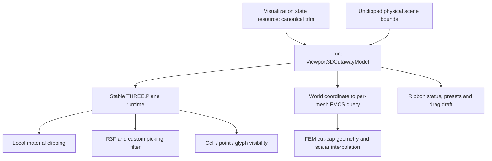

# Mechanizm clipping / cutaway w widoku 3D — Implementation Plan

> **For agentic workers:** REQUIRED SUB-SKILL: Use `subagent-driven-development` (recommended) or `executing-plans` to implement this plan task-by-task. Steps use checkbox (`- [ ]`) syntax for tracking.

**Cel:** Dostarczyć w jednym widoku R3F przewidywalny, odtwarzalny i poprawny topologicznie mechanizm przekrojów 3D: pojedynczą płaszczyznę, połówkę, warstwę, section box oraz rzeczywiste wycięcie krawędzi lub narożnika, z poprawnym airboxem, shaderami, pickingiem i powierzchniami cięcia.

**Architektura:** Kanoniczny stan sesji pozostaje w `VisualizationStateResource.trim`; starsze `clip` staje się wyłącznie dokładną projekcją zgodności dla przypadku jednej płaszczyzny. Frontend buduje z `trim` jeden czysty model półprzestrzeni, przekazuje lokalne płaszczyzny tylko do materiałów danych sceny i używa tego samego predykatu dla renderowania, pickingu oraz filtrowania glyphów. Zamknięte przekroje są osobną warstwą danych: FEM korzysta z poligonów FMCS, a FDM z pełnych, wyrównanych do komórek przekrojów.

**Tech Stack:** Next.js 16.2.11, React, TypeScript, React Three Fiber 9.6.0, Three.js 0.183.2, Drei 10.7.7, Vitest 4.1.5, Playwright 1.62.1, Rust/Axum/OpenAPI v2.

## Global Constraints

- Funkcja jest `visualization-only`: nie zmienia fizyki, `ProblemIR`, planera ani wyników solvera.
- `trim` jest jedynym kanonicznym stanem cutaway; nowy frontend nie zapisuje `clip`.
- `clip` nie może być drugim źródłem prawdy ani stratnie udawać wielopłaszczyznowego `trim`.
- Maksymalna liczba efektywnych płaszczyzn wynosi sześć, bo kontrakt ma po dwie granice dla osi X, Y i Z; nie zakładamy nieudokumentowanego limitu WebGL „8 planes”.
- `WebGLRenderer.clippingPlanes` pozostaje pustą tablicą; clipping danych sceny jest lokalny dla materiałów, przy `localClippingEnabled = true` ustawionym raz podczas konfiguracji renderera.
- Jeden viewport, jeden canvas R3F i jeden wspólny model renderowania obsługują FDM oraz FEM; nie powstają osobne drzewa sceny ani osobne kontrolki dla backendów.
- Canvas zachowuje `frameloop="demand"`; po ustaleniu stanu liczba klatek idle i requestów idle wynosi zero.
- Stan zasobu nie jest kopiowany do Zustand, React Context ani `localStorage`; lokalny może być wyłącznie nietrwały draft aktywnego przeciągania.
- Aktualizacja pozycji płaszczyzny nie pobiera ponownie topologii ani pola i nie przebudowuje niezmiennej geometrii bazowej.
- Skalarna powierzchnia z `ShaderMaterial` musi być kwalifikowana w prawdziwym WebGL; test obecności tekstu chunków nie jest wystarczającym dowodem.
- Picking, hover i inspect muszą używać dokładnie tej samej semantyki półprzestrzeni co materiały.
- Airbox surface, points, vectors i pełny volume-wireframe są danymi sceny i podlegają cięciu; cienka zewnętrzna rama bounds pozostaje nieciętym odniesieniem. Pełny volume-wireframe zachowuje hidden-edge semantics, a jego opacity pozostaje niezależne od opacity powierzchni airboxu.
- View cube, orientation HUD, floor grid, dimension frame, cutaway guides, manipulatory i DOM overlays nigdy nie są cięte.
- Nie obniżamy domyślnej jakości, liczby glyphów ani dokładności topologii jako sposobu na spełnienie bramek wydajności.
- Wszystkie klasy CSS w `apps/control-room` mają prefiks `fm-` i używają istniejących `--fm-*` tokenów oraz współdzielonych prymitywów ribbon/shadcn.
- Pliki wygenerowane OpenAPI zmienia wyłącznie `pnpm --dir apps/control-room generate:api`; nie edytujemy ich ręcznie.
- Każda zmiana canvasa kończy się browser smoke: canvas widoczny, `gl.isContextLost() === false`, drawing buffer ma dodatnie wymiary.
- Ten plik jest wewnętrznym planem wdrożenia, a nie kanoniczną publikacją fizyczną; nie wymaga sąsiedniego source-map ani notatki w `docs/physics/`.

---

## 1. Rozstrzygnięcia względem szkicu wejściowego

Szkic z `D:\git\fullmag\docs\plans\active\viewport-3d-clipping-cutaway-plan-2026-08-23.md` trafnie wskazywał luki shadera, globalnego clippingu, pickingu i capów, ale trzy założenia wymagały korekty:

1. **`clip` i `trim` nie są niezależnymi mechanizmami.** Backend już opisuje `trim` jako stan kanoniczny, a `clip` jako zgodnościową projekcję jednej płaszczyzny. Utrzymywanie obu aktywnych naraz tworzy dwa źródła prawdy.
2. **Box trim nie realizuje wycięcia narożnika.** Przecięcie zakresów X/Y/Z zachowuje wnętrze pudełka albo oktantu. Usunięcie wybranego narożnika jest różnicą boolowską i wymaga jawnej operacji `subtract_intersection`.
3. **Clipping fragmentów nie tworzy przekroju.** Otwarta powłoka WebGL może być etapem bazowym, ale naukowo czytelny środek FEM wymaga poligonów cięcia powiązanych z elementami, a FDM wymaga granicy wyrównanej do komórek albo jawnego stanu degraded.

Nie wprowadzamy arbitralnego limitu długości plików. Obecne duże pliki są dzielone tylko tam, gdzie nowa odpowiedzialność ma własny interfejs i testy.

## 2. Audyt stanu obecnego

| Obszar | Stan i dowód w kodzie | Konsekwencja |
|---|---|---|
| Kontrakt stanu | `TrimVisualizationState` w `crates/fullmag-api/src/schemas/visualization_state.rs`; `clip` jest opisany jako compatibility projection | Renderer i UI muszą zacząć czytać `trim` |
| Projekcja zgodności | `compatibility_clip_from_trim` i `apply_compatibility_clip_to_trim` w `crates/fullmag-api/src/router_v2/handlers/visualization/display.rs` | Obecna projekcja wybiera pierwszą oś i gubi pozostałe granice |
| Persystencja | `DisplayPresentationState.visualization_trim` oraz `.visualization_clip` w `crates/fullmag-api/src/types.rs` | PUT/import mogą zachować sprzeczne kopie |
| Ribbon | `buildClipAction` działa na `clip`; submenu `layers:trim` w `ribbonContributions.tsx` ma stałe wartości | Widoczny kontrakt `trim` nie jest funkcją frontendową |
| Renderer | `ClipPlaneLayer.tsx` wpisuje jedną płaszczyznę do `gl.clippingPlanes` | Cięte są również niepowiązane materiały i chrome sceny |
| Shader skalarny | `createScalarSurfaceShaderMaterial` w `viewport3dScalarSurfaceShader.ts` nie włącza clippingu ani chunków GLSL | Powierzchnia tego samego mesha zachowuje się inaczej zależnie od trybu kolorowania |
| Picking | R3F i niestandardowy raycast `FdmCuboidLayer` nie filtrują trafień półprzestrzeniami | Niewidoczna geometria pozostaje interaktywna |
| Przekrój FEM | `useCrossSectionResource` oraz FMCS v2 dostarczają poligony, world vertices, parent element IDs, edge node IDs i parametr `t` | Dla `tet4` można zbudować dokładny cap i interpolować pole |
| Topologia mieszana | endpoint FMCS zwraca `mixed_topology_not_supported` | Sam clipping nadal działa, ale cap musi jawnie przejść w degraded |
| Airbox | `BoundsLayers.tsx` oraz model full-volume wireframe implementują hidden edges | Nie wolno zastąpić go samym obrysem zewnętrznym ani związać opacity z surface |
| Lifecycle | `Viewport3DModule` używa demand rendering i własnych trackerów | Cutaway musi wejść do istniejącego invalidation/resource lifecycle |

Istnieje dodatkowy błąd ramy: frontend wylicza płaszczyznę z połączonych bounds sceny, natomiast endpoint FMCS interpretuje `position_percent` względem bounds mesha FEM. Nie wolno wysyłać do FMCS tego samego procentu bez przeliczenia przez wspólną współrzędną świata.

## 3. Semantyka produktu i model matematyczny

### 3.1 Terminologia użytkowa

Jedna globalna funkcja w UI nazywa się **Cutaway** i ma następujące tryby/presety:

| Tryb | Operacja kanoniczna | Znaczenie |
|---|---|---|
| Off | `trim.enabled = false` | Efekt wyłączony, ostatnie poprawne ustawienia zachowane |
| Plane | `keep_inside`, jedna granica | Zachowaj jedną stronę płaszczyzny |
| Half | preset Plane przy 50% | Sześć wariantów: ±X, ±Y, ±Z; geometryczne 50% nie jest po cichu przesuwane |
| Slab / Layer | `keep_inside`, min i max jednej osi | Zachowaj warstwę; wariant FDM jest wyrównany do granic komórek |
| Section box | `keep_inside`, 2–6 granic | Zachowaj wnętrze osiowego pudełka |
| Cut corner / edge | `subtract_intersection`, po jednej granicy na 2–3 osiach | Usuń wspólną część półprzestrzeni, czyli krawędź albo jeden z ośmiu narożników |

„Cut corner” oznacza usunięcie narożnika i odsłonięcie wnętrza. Zachowanie samego oktantu jest nadal dostępne przez preset Section box, ale nie może mieć tej samej etykiety.

### 3.2 Półprzestrzenie

Dla płaszczyzny $i$ definiujemy odległość ze znakiem:

$$
d_i(\mathbf{x}) = \mathbf{n}_i \cdot \mathbf{x} + c_i.
$$

| Symbol | Znaczenie | Jednostka |
|---|---|---|
| $\mathbf{x}$ | punkt w układzie sceny/topologii | jednostka współrzędnych mesha, zwykle $\mathrm{m}$ |
| $\mathbf{n}_i$ | znormalizowana normalna płaszczyzny | $1$ |
| $c_i$ | stała płaszczyzny | ta sama co $\mathbf{x}$ |
| $d_i$ | odległość ze znakiem | ta sama co $\mathbf{x}$ |
| $\varepsilon$ | tolerancja testów CPU/pickingu | ta sama co $\mathbf{x}$ |

Granica minimalna osi ma normalną dodatnią i zachowuje $x_a \ge q_a$; granica maksymalna ma normalną ujemną i zachowuje $x_a \le q_a$.

- `keep_inside`: punkt jest widoczny wtedy i tylko wtedy, gdy dla każdej płaszczyzny $d_i(\mathbf{x}) \ge -\varepsilon$.
- `subtract_intersection`: punkt jest usunięty tylko wtedy, gdy dla każdej płaszczyzny $d_i(\mathbf{x}) < -\varepsilon$; jest widoczny, gdy co najmniej jedna odległość nie jest ujemna.

W Three.js odpowiada to `clipIntersection = false` dla `keep_inside` i `clipIntersection = true` dla `subtract_intersection`. Picking stosuje jawny predykat CPU, nie zachowanie raycastera.

### 3.3 Aktywne granice i walidacja

- `min_percent = 0` nie tworzy dolnej płaszczyzny.
- `max_percent = 100` nie tworzy górnej płaszczyzny.
- W `keep_inside` aktywna oś może mieć jedną albo dwie granice i musi spełniać `0 <= min_percent < max_percent <= 100`.
- W `subtract_intersection` każda aktywna oś ma dokładnie jedną niebrzegową granicę: `min_percent > 0 XOR max_percent < 100`. Dwie granice tej samej osi tworzyłyby pustą część wspólną i są odrzucane.
- Aktywny `trim` musi tworzyć co najmniej jedną efektywną płaszczyznę.
- Serwer odrzuca liczby nieskończone, `NaN`, wartości poza 0–100, zakres odwrócony i konflikt `trim`+`clip`; nie naprawia ich po cichu ani nie wymusza arbitralnej szczeliny 1%.

### 3.4 Rama współrzędnych

`Viewport3DCutawayFrame` powstaje z nieprzyciętych bounds wszystkich fizycznych targetów sceny, w tym airboxu, ale bez gridu podłogi, HUD, guides i dimension frames. Dla osi $a$:

$$
q_a = b_{a,\min} + \frac{p_a}{100}\left(b_{a,\max}-b_{a,\min}\right).
$$

Każda warstwa otrzymuje tę samą współrzędną $q_a$. Zapytanie FMCS przelicza ją na procent lokalnych bounds mesha FEM:

$$
p_{a,\mathrm{FEM}} = 100\frac{q_a-m_{a,\min}}{m_{a,\max}-m_{a,\min}}.
$$

Jeżeli $q_a$ leży poza meshem FEM, cap tej płaszczyzny nie jest pobierany. Nie klamrujemy zapytania do 0 lub 100, bo powstałby cap w niewłaściwym miejscu.

## 4. Architektura docelowa



Nie używamy kontekstu React do przenoszenia zmiennej tablicy płaszczyzn. `useViewport3DSceneModel` zwraca czysty, serializowalny `Viewport3DCutawayModel`; `Viewport3DScene` tworzy runtime Three i jawnie przekazuje go do warstw. Referencja tylko-do-odczytu udostępniona fabryce event managera zapewnia, że centralny filtr pickingu zawsze widzi ostatni model bez drugiego store.

### 4.1 Podział odpowiedzialności plików

| Plik | Odpowiedzialność |
|---|---|
| `clipping/viewport3DCutawayModel.ts` | Czyste `trim -> planes`, rama, operacja boolowska, widoczność punktu, dokładna projekcja jednej płaszczyzny |
| `clipping/useViewport3DClippingRuntime.ts` | Zamiana opisów na stabilne `THREE.Plane[]`, strukturalny klucz wariantu programu |
| `clipping/viewport3DMaterialClipping.ts` | Jednolita aplikacja/cleanup lokalnego clippingu do materiału lub tablicy materiałów |
| `clipping/viewport3DClippingPicking.ts` | Filtr posortowanych intersections i adaptery dla custom/FDM hitów |
| `clipping/viewport3DCutCapModel.ts` | Triangulacja FMCS, winding, atrybuty pola i ograniczenie capu pozostałymi półprzestrzeniami |
| `clipping/useViewport3DCutCapResources.ts` | Sześć stałych hooków zasobowych, przeliczenie world→mesh percent, abort/cache/revision |
| `layers/FemCutCapLayer.tsx` | Render/dispose capów FEM oraz ich picking |
| `layers/ClipPlaneLayer.tsx` | Wyłącznie guide/outline/markery; bez mutacji renderera |
| `viewport3dEventManager.ts` | Centralne odrzucanie trafień niewidocznej geometrii |
| `ribbon/cutawayRibbonModel.ts` | Presety i pełne kanoniczne patche `trim` bez JSX i bez sieci |

### 4.2 Macierz warstw

| Warstwa | Clipping | Strategia |
|---|---:|---|
| FEM surface i fallback topology | tak | lokalne planes na built-in/custom material |
| FEM magnetic wireframe/points/vectors | tak | materiał + filtrowanie całego glyphu po anchorze |
| FEM cut cap | tak, z wyjątkiem własnej płaszczyzny | FMCS; ograniczenie pozostałymi półprzestrzeniami |
| FDM cell cuboids | tak | preview materiałowy; stan ustalony filtruje pełne komórki |
| FDM points/vectors | tak | filtr całego punktu/glyphu po anchorze |
| Airbox surface/points/vectors | tak | ten sam model globalny |
| Airbox full-volume wireframe | tak | pełna topologia źródłowa, hidden edges i niezależna opacity |
| Outer bounds/reference frame | nie | zachowuje orientację domeny po cutaway |
| Region fill/mesh highlight | tak | nie może świecić po usuniętej stronie |
| Selection highlight powierzchni | tak | nie może tworzyć ghost outline |
| Frozen spins, hysteresis replay, mesh-size highlight, periodic-pair overlay | tak | dane/diagnostyka przestrzenna; całe glyphy filtrowane po anchorze |
| FDM outside-support overlay | tak | przestrzenna część targetu, nie chrome |
| Floor grid, dimension frame, HUD, view cube | nie | chrome/reference |
| Cutaway guide, handles, monitor preview | nie | kontrola musi pozostać widoczna |

## 5. Powierzchnie cięcia i uczciwe stany degraded

### FEM `tet4`

FMCS v2 jest wystarczający do capu:

- `intersectionWorld` daje pozycje w 3D,
- `polygonOffsets` wyznacza trójkąty/czworokąty przekroju,
- `parentElementIds` wiąże cap z elementem i pickingiem,
- `intersectionEdgeNodeIds` oraz `intersectionEdgeT` pozwalają interpolować pole węzłowe liniowo,
- pole elementowe używa wartości `parentElementId`.

Każdy cap jest generowany dla jednej aktywnej płaszczyzny. Dla `keep_inside` zachowuje dodatnie półprzestrzenie pozostałych płaszczyzn. Dla `subtract_intersection` zachowuje ujemne półprzestrzenie pozostałych płaszczyzn, czyli dokładnie granicę usuwanego narożnika. Własna płaszczyzna nie może odrzucać capu. Normalna widocznej powierzchni capu wynosi zawsze $-\mathbf{n}_i$, czyli wskazuje z zachowanej objętości do części usuniętej. Geometrii nie przesuwamy; `polygonOffset` rozwiązuje z-fighting bez fałszowania współrzędnych.

### FEM prism/pyramid/mixed

Materiałowy clipping, picking i guides pozostają aktywne. Brak FMCS polygon support zwraca osobny status `cut_surface: degraded`, z kodem `mixed_topology_not_supported`; nie psuje całego viewportu i nie wyłącza samego cutaway. Rozszerzenie FMCS dla mixed topology jest oddzielnym przedsięwzięciem backendowym i nie jest ukrywane przez neutralny, pozornie dokładny cap.

### FDM

Shaderowe przecięcie instancji jest dobrym płynnym preview, ale nie tworzy brakującej ściany wewnątrz sześcianu. Preset `Layer` zapisuje granice wybrane po indeksach komórek. Pozostałe tryby zachowują dokładny procent globalny i przechodzą na pełne komórki tylko wtedy, gdy każda ich płaszczyzna już pokrywa się z granicą danego gridu; nie przesuwamy po cichu globalnej płaszczyzny `Half` ani `Corner`. W stanie aligned `FdmCuboidLayer` zachowuje/usuwa całe komórki. Dzięki temu odsłonięta ściana jest istniejącą ścianą zamkniętego voxela i ma poprawną wartość komórkową.

Dla ogólnego procentu, wielu siatek FDM o różnych krokach albo `subtract_intersection` bez wspólnej granicy, UI pokazuje `open cut surface`; clipping nadal działa, ale nie deklaruje zamkniętego capu. FMFG zawiera segmenty, a nie poligony, więc nie jest podstawą do udawania capu FDM.

### Authored primitives bez mesha

Powłoka primitive jest przycinana materiałowo i ma poprawny picking. Nie otrzymuje capu naukowego, dopóki nie istnieje mesh/topologia. Stencil może zostać użyty tylko w osobnym spike dla neutralnego podglądu zamkniętej bryły; nie jest bramką produkcyjną, bo nie przenosi wartości pola, parent IDs ani semantyki transparentnego airboxu.

## 6. UX i przepływ stanu

- Akcja `Cutaway` znajduje się w globalnej grupie View/Display, nie w `Selected Display`.
- Menu pokazuje tryb, operację, wybraną granicę, dokładny procent i przeliczoną współrzędną świata.
- Presety zawsze wysyłają pełny, deterministyczny `trim`; nie dziedziczą starego `flipped` ani nieaktywnych osi.
- Slidery korzystają z obecnego modelu draft-on-change/commit-on-pointer-up w `RibbonMenuRenderer`; jeden gest daje dokładnie jeden PATCH.
- `Create planar monitor from cutaway` jest dostępne wyłącznie, gdy `trim` redukuje się do dokładnie jednej płaszczyzny `keep_inside`.
- Brak capu ma osobny status od samego clippingu: „Cutaway active; exact cut surface unavailable for mixed topology”.
- Sekcja `Clipping & Section` w inspectorze obiektu przestaje wyświetlać stałe „Off”. Jest tylko odczytowym statusem globalnego cutaway; edycja pozostaje w jednym miejscu w ribbonie.
- Guide 3D pokazuje jedną aktualnie wybraną granicę. Drag zmienia lokalny draft, Escape anuluje, pointer-up wysyła jeden PATCH, a orbit controls są blokowane tylko na czas capture.
- Klawiatura w ribbonie pozostaje pełnym sposobem obsługi; gizmo nie jest jedyną drogą.

---

### Task 0: Ujednolicić kanoniczny kontrakt `trim`

**Files:**
- Modify: `crates/fullmag-api/src/schemas/visualization_state.rs`
- Modify: `crates/fullmag-api/src/router_v2/handlers/visualization/display.rs`
- Modify: `crates/fullmag-api/src/router_v2/tests.rs`
- Modify: `crates/fullmag-api/src/types.rs`
- Modify: `crates/fullmag-api/src/session_persistence.rs`
- Modify: `docs/specs/resource-first-control-room-api-v2.md`
- Modify: `docs/adr/0011-resource-first-api.md`
- Regenerate: `apps/control-room/src/kernel/api/generated/openapi-v2.json`
- Regenerate: `apps/control-room/src/kernel/api/generated/openapi-v2-types.ts`

**Interfaces:**
- Consumes: istniejący `TrimVisualizationState`, `TrimVisualizationPatch`, `DisplayPresentationState`.
- Produces: `TrimOperation`, walidowany stan v11 i dokładną, wyliczaną projekcję `clip`.

```rust
#[derive(Debug, Default, Serialize, Deserialize, ToSchema, Clone, Copy, PartialEq, Eq)]
#[serde(rename_all = "snake_case")]
pub enum TrimOperation {
    #[default]
    KeepInside,
    SubtractIntersection,
}

pub struct TrimVisualizationState {
    pub enabled: bool,
    #[serde(default)]
    pub operation: TrimOperation,
    pub axes: TrimAxisVisualizationAxes,
}

pub struct TrimVisualizationPatch {
    pub enabled: Option<bool>,
    pub operation: Option<TrimOperation>,
    pub axes: Option<TrimAxisVisualizationAxesPatch>,
}
```

- [ ] **Step 1: Dodać czerwone testy API dla semantyki i migracji**

  W `router_v2/tests.rs` dodać osobne testy o nazwach: `visualization_trim_rejects_invalid_ranges`, `visualization_trim_subtract_rejects_two_bounds_on_one_axis`, `visualization_trim_multiplane_disables_legacy_clip_projection`, `visualization_single_plane_projects_exact_legacy_clip`, `visualization_patch_rejects_trim_and_clip_together`. W `session_persistence.rs` dodać `display_presentation_v10_migrates_trim_operation_and_canonicalizes_clip`.

  Oczekiwane kody błędów: `invalid_visualization_trim` dla domeny wartości i `conflicting_visualization_clip_trim` dla jednego requestu zawierającego oba pola.

- [ ] **Step 2: Uruchomić testy i potwierdzić RED**

  Run: `cargo test -p fullmag-api visualization_trim -- --nocapture`

  Expected: nowe testy nie kompilują się bez `TrimOperation` albo failują na obecnym klamrowaniu/projekcji pierwszej osi.

- [ ] **Step 3: Dodać `TrimOperation` i walidację kandydata po scaleniu PATCH**

  Implementować walidację jako czyste funkcje `effective_trim_boundaries`, `validate_trim_visualization` i `exact_compatibility_clip_from_trim`. Najpierw scalić patch z bieżącym stanem, potem zwalidować cały kandydat, a dopiero później zapisać. Usunąć ciche `clamp` oraz wymuszenie przedziału 1%.

  Projekcja legacy zwraca `clip.enabled = true` tylko dla `keep_inside` i dokładnie jednej efektywnej granicy. Dla wielu granic lub `subtract_intersection` zwraca stan wyłączony, zamiast wybierać pierwszą oś.

- [ ] **Step 4: Usunąć podwójne źródło prawdy w PUT/PATCH/import**

  `PATCH clip` tłumaczy wejście do pełnego pojedynczego `trim`, po czym odpowiedź wylicza `clip`. `PATCH trim` zapisuje tylko kanoniczny kandydat. Request z oboma polami zwraca 400. PUT/import preferuje obecny `trim`; historyczny dokument bez `trim`, ale z `clip`, jest tłumaczony raz podczas migracji.

  Na `visualization_clip` w `DisplayPresentationState` zastosować odczyt historyczny bez zapisu bieżącej kopii; po restore wartość odpowiedzi zawsze pochodzi z `visualization_trim`.

- [ ] **Step 5: Podnieść persistence i resource schema do 11**

  `DISPLAY_PRESENTATION_SCHEMA_VERSION` oraz `VisualizationStateResource.schema_version` ustawiają 11. Migracja v10 dodaje `operation: "keep_inside"`, kanonizuje historyczny `clip`, zachowuje warning w ograniczonej liście, gdy historyczne pola były sprzeczne.

- [ ] **Step 6: Wygenerować typy i sprawdzić diff**

  Run: `pnpm --dir apps/control-room generate:api`

  Expected: wygenerowane typy mają wymagane `trim.operation: "keep_inside" | "subtract_intersection"`; brak ręcznych różnic poza generator output.

- [ ] **Step 7: Uruchomić bramki kontraktu**

  Run: `cargo test -p fullmag-api visualization_trim -- --nocapture`

  Run: `cargo test -p fullmag-api display_presentation_v10 -- --nocapture`

  Run: `pnpm --dir apps/control-room check:api-hygiene`

  Expected: PASS, a dokumenty v2 opisują schema 11, źródło prawdy `trim` i warunek dokładnej projekcji `clip`.

- [ ] **Step 8: Commit**

  ```bash
  git add crates/fullmag-api/src/schemas/visualization_state.rs crates/fullmag-api/src/router_v2/handlers/visualization/display.rs crates/fullmag-api/src/router_v2/tests.rs crates/fullmag-api/src/types.rs crates/fullmag-api/src/session_persistence.rs docs/specs/resource-first-control-room-api-v2.md docs/adr/0011-resource-first-api.md apps/control-room/src/kernel/api/generated/openapi-v2.json apps/control-room/src/kernel/api/generated/openapi-v2-types.ts
  git commit -m "feat(api): make trim the canonical cutaway state"
  ```

### Task 1: Zbudować czysty model cutaway i ramę świata

**Files:**
- Create: `apps/control-room/src/modules/viewport-3d/clipping/viewport3DCutawayModel.ts`
- Create: `apps/control-room/src/modules/viewport-3d/clipping/viewport3DCutawayModel.test.ts`
- Modify: `apps/control-room/src/modules/viewport-3d/hooks/useViewport3DSceneModel.ts`
- Modify: `apps/control-room/src/shared/domain/mesh/crossSectionQuery.ts`
- Create: `apps/control-room/src/shared/domain/mesh/crossSectionQuery.test.ts`

**Interfaces:**
- Consumes: `VisualizationStateResource["trim"]`, `Viewport3DBounds`.
- Produces: poniższy serializowalny model, bez importu `three`.

```ts
export type CutawayAxis = "x" | "y" | "z";
export type CutawayBoundary = "min" | "max";

export interface Viewport3DCutawayPlane {
  id: `${CutawayAxis}-${CutawayBoundary}`;
  axis: CutawayAxis;
  boundary: CutawayBoundary;
  normal: readonly [number, number, number];
  constant: number;
  worldCoordinate: number;
}

export interface Viewport3DCutawayModel {
  enabled: boolean;
  operation: "keep_inside" | "subtract_intersection";
  planes: readonly Viewport3DCutawayPlane[];
  structureKey: string;
}

export function buildViewport3DCutawayModel(
  trim: VisualizationStateResource["trim"] | null | undefined,
  bounds: Viewport3DBounds | null,
): Viewport3DCutawayModel;

export function isPointVisibleAfterCutaway(
  point: readonly [number, number, number],
  model: Viewport3DCutawayModel,
  epsilon?: number,
): boolean;
```

- [ ] **Step 1: Napisać tabelaryczne testy normalnych, stałych i boolowskiej widoczności**

  Testy obejmują X/Y/Z min i max, 0/100 pomijane, sześć płaszczyzn section box, jedną płaszczyznę half, usunięcie narożnika `+X,+Y,+Z`, punkt na płaszczyźnie oraz brak bounds. Dla bounds `center=[0,0,0], size=[10,20,30]` granica `x.min=25%` ma `normal=[1,0,0]`, `worldCoordinate=-2.5`, `constant=2.5`.

- [ ] **Step 2: Uruchomić test i potwierdzić RED**

  Run: `pnpm --dir apps/control-room test -- src/modules/viewport-3d/clipping/viewport3DCutawayModel.test.ts`

  Expected: FAIL, moduł jeszcze nie istnieje.

- [ ] **Step 3: Zaimplementować model i stabilny porządek płaszczyzn**

  Porządek jest zawsze `x-min, x-max, y-min, y-max, z-min, z-max`; `structureKey` ma format `${operation}:${planeIds.join(",")}` i nie zawiera pozycji. Model nie klamruje niepoprawnego stanu serwera — w development rzuca błąd kontraktu, a w production zwraca disabled z diagnostyką trackera.

- [ ] **Step 4: Ustalić jedyne bounds fizycznej sceny**

  W `useViewport3DSceneModel.ts` wyodrębnić `cutawayBounds` z nieprzyciętych topology/primitive/airbox bounds. Nie dodawać guide/cap do tych bounds. Zwrócić `cutawayModel` w propsach sceny zamiast `clip` jako źródła renderowania.

- [ ] **Step 5: Zastąpić query oparte na legacy `clip` dokładną projekcją `trim`**

  `resolveCrossSectionQueryFromVisualizationState` ma zwracać query wyłącznie dla dokładnie jednej płaszczyzny `keep_inside`; dla innych stanów zwraca slice/default zgodnie z jawnym parametrem źródła. Dodać osobną funkcję `worldCoordinateToMeshPercent`, która zwraca `null` poza bounds, bez klamrowania.

- [ ] **Step 6: Uruchomić testy**

  Run: `pnpm --dir apps/control-room test -- src/modules/viewport-3d/clipping/viewport3DCutawayModel.test.ts src/shared/domain/mesh/crossSectionQuery.test.ts`

  Expected: PASS dla wszystkich znaków normalnych i obu operacji.

- [ ] **Step 7: Commit**

  ```bash
  git add apps/control-room/src/modules/viewport-3d/clipping apps/control-room/src/modules/viewport-3d/hooks/useViewport3DSceneModel.ts apps/control-room/src/shared/domain/mesh/crossSectionQuery.ts apps/control-room/src/shared/domain/mesh/crossSectionQuery.test.ts
  git commit -m "feat(viewport): derive cutaway planes from canonical trim"
  ```

### Task 2: Przenieść clipping na materiały i naprawić shader skalarny

**Files:**
- Create: `apps/control-room/src/modules/viewport-3d/clipping/useViewport3DClippingRuntime.ts`
- Create: `apps/control-room/src/modules/viewport-3d/clipping/useViewport3DClippingRuntime.test.ts`
- Create: `apps/control-room/src/modules/viewport-3d/clipping/viewport3DMaterialClipping.ts`
- Create: `apps/control-room/src/modules/viewport-3d/clipping/viewport3DMaterialClipping.test.ts`
- Modify: `apps/control-room/src/modules/viewport-3d/viewport3dVisualProfile.ts`
- Modify: `apps/control-room/src/modules/viewport-3d/viewport3dVisualProfile.test.ts`
- Modify: `apps/control-room/src/modules/viewport-3d/viewport3dScalarSurfaceShader.ts`
- Modify: `apps/control-room/src/modules/viewport-3d/viewport3dScalarSurfaceShader.test.ts`
- Modify: `apps/control-room/src/modules/viewport-3d/layers/ClipPlaneLayer.tsx`

**Interfaces:**

```ts
export interface Viewport3DClippingRuntime {
  clipIntersection: boolean;
  planes: readonly THREE.Plane[];
  structureKey: string;
}

export type Viewport3DClippingRole = "scene-data" | "reference-guide";

export function applyViewport3DMaterialClipping(
  material: THREE.Material | readonly THREE.Material[],
  runtime: Viewport3DClippingRuntime,
  role: Viewport3DClippingRole,
): () => void;
```

- [ ] **Step 1: Napisać czerwone testy kontraktu materiału i renderera**

  Testy wymagają: `gl.localClippingEnabled === true`, `gl.clippingPlanes` pozostaje puste, `scene-data` otrzymuje planes/operation, `reference-guide` ma `clippingPlanes = null`, cleanup przywraca poprzedni stan współdzielonego materiału, a `needsUpdate` zmienia się wyłącznie przy zmianie liczby planes lub `clipIntersection`.

- [ ] **Step 2: Napisać czerwony test wszystkich wariantów GLSL**

  Każdy vertex shader zawiera `#include <clipping_planes_pars_vertex>`, lokalne `vec4 mvPosition`, `#include <clipping_planes_vertex>` i oblicza `gl_Position` z `mvPosition`. Każdy fragment shader zawiera pars oraz `#include <clipping_planes_fragment>` na początku `main`. `ShaderMaterial.clipping` wynosi `true`.

- [ ] **Step 3: Potwierdzić RED**

  Run: `pnpm --dir apps/control-room test -- src/modules/viewport-3d/clipping/useViewport3DClippingRuntime.test.ts src/modules/viewport-3d/clipping/viewport3DMaterialClipping.test.ts src/modules/viewport-3d/viewport3dScalarSurfaceShader.test.ts`

  Expected: FAIL na globalnych planes i brakujących chunkach.

- [ ] **Step 4: Skonfigurować renderer raz**

  W `configureViewport3DRenderer` ustawić `renderer.localClippingEnabled = true` i `renderer.clippingPlanes = []`. `ClipPlaneLayer` traci `useThree(gl)`, `applyRendererClipping`, `restoreRendererClipping` i efekt cleanup; zachowuje wyłącznie guide/outline/markery.

- [ ] **Step 5: Zaimplementować runtime i helper materiałów**

  Runtime tworzy `THREE.Plane` z normalnych i stałych modelu. Zmiana pozycji nie ustawia `material.needsUpdate`; zmiana `structureKey` ustawia ją raz, bo zmienia wariant `NUM_CLIPPING_PLANES` lub operator. Cleanup jest idempotentny i nie wywołuje `dispose` materiału, którego nie jest właścicielem.

- [ ] **Step 6: Włączyć standardowe chunki Three we wszystkich shaderach skalarnych**

  Użyć chunków Three, nie własnej kopii równania discard. `#include <clipping_planes_fragment>` umieścić przed kosztowną mapą kolorów. Zachować istniejące warianty orientation/complex oraz ich atrybuty.

- [ ] **Step 7: Uruchomić testy jednostkowe**

  Run: `pnpm --dir apps/control-room test -- src/modules/viewport-3d/clipping/useViewport3DClippingRuntime.test.ts src/modules/viewport-3d/clipping/viewport3DMaterialClipping.test.ts src/modules/viewport-3d/viewport3dVisualProfile.test.ts src/modules/viewport-3d/viewport3dScalarSurfaceShader.test.ts`

  Expected: PASS; global plane count wynosi zero.

- [ ] **Step 8: Commit**

  ```bash
  git add apps/control-room/src/modules/viewport-3d/clipping apps/control-room/src/modules/viewport-3d/viewport3dVisualProfile.ts apps/control-room/src/modules/viewport-3d/viewport3dVisualProfile.test.ts apps/control-room/src/modules/viewport-3d/viewport3dScalarSurfaceShader.ts apps/control-room/src/modules/viewport-3d/viewport3dScalarSurfaceShader.test.ts apps/control-room/src/modules/viewport-3d/layers/ClipPlaneLayer.tsx
  git commit -m "fix(viewport): use local clipping in scalar materials"
  ```

### Task 3: Podłączyć wszystkie warstwy według jawnych ról

**Files:**
- Modify: `apps/control-room/src/modules/viewport-3d/layers/Viewport3DScene.tsx`
- Modify: `apps/control-room/src/modules/viewport-3d/layers/MeshPartLayer.tsx`
- Modify: `apps/control-room/src/modules/viewport-3d/layers/FallbackTopologyMeshLayer.tsx`
- Modify: `apps/control-room/src/modules/viewport-3d/layers/FdmCuboidLayer.tsx`
- Modify: `apps/control-room/src/modules/viewport-3d/layers/PrimitiveObjectLayer.tsx`
- Modify: `apps/control-room/src/modules/viewport-3d/layers/VectorFieldLayer.tsx`
- Modify: `apps/control-room/src/modules/viewport-3d/layers/BoundsLayers.tsx`
- Modify: `apps/control-room/src/modules/viewport-3d/layers/FrozenSpinsOverlay.tsx`
- Modify: `apps/control-room/src/modules/viewport-3d/layers/HysteresisReplayGlyphLayer.tsx`
- Modify: `apps/control-room/src/modules/viewport-3d/layers/MeshSizeHighlightLayer.tsx`
- Modify: `apps/control-room/src/modules/viewport-3d/layers/PeriodicPairsOverlayLayer.tsx`
- Modify: `apps/control-room/src/modules/viewport-3d/layers/RegionMeshOverlayLayer.tsx`
- Modify: `apps/control-room/src/modules/viewport-3d/layers/RegionOverlayLayer.tsx`
- Modify: `apps/control-room/src/modules/viewport-3d/layers/viewport3DLayerPassInputs.test.ts`
- Modify: `apps/control-room/src/modules/viewport-3d/layers/viewport3DLayerSettings.test.ts`

**Interfaces:**
- Consumes: `Viewport3DClippingRuntime`, `applyViewport3DMaterialClipping`.
- Produces: jawny role assignment każdej materialnej warstwy z macierzy w sekcji 4.2.

```ts
export interface Viewport3DClippableLayerProps {
  clipping: Viewport3DClippingRuntime;
  clippingRole: Viewport3DClippingRole;
}

const cutawayRoleByLayer = {
  "airbox-volume-wireframe": "scene-data",
  "dimension-frame": "reference-guide",
  "mesh-surface": "scene-data",
  "orientation-hud": "reference-guide",
} as const satisfies Record<string, Viewport3DClippingRole>;
```

- [ ] **Step 1: Rozszerzyć test kontraktu warstw o pełną macierz**

  Test ma wymieniać każdą warstwę z sekcji 4.2 i failować, jeśli nowa materialna warstwa nie deklaruje roli. Szczególne asercje: airbox volume wireframe jest `scene-data`; outer bounds jest `reference-guide`; opacity wireframe nie pochodzi od surface opacity.

- [ ] **Step 2: Potwierdzić RED**

  Run: `pnpm --dir apps/control-room test -- src/modules/viewport-3d/layers/viewport3DLayerPassInputs.test.ts src/modules/viewport-3d/layers/viewport3DLayerSettings.test.ts`

  Expected: FAIL, runtime nie jest jeszcze propagowany.

- [ ] **Step 3: Utworzyć runtime raz w `Viewport3DScene` i przekazać go jawnie**

  `Viewport3DScene` wywołuje `useViewport3DClippingRuntime(cutawayModel)`. Nie zapisuje planes w scene modelu ani w store. Każda warstwa otrzymuje `clipping` albo literalny `clippingRole="reference-guide"`.

- [ ] **Step 4: Podłączyć built-in i imperatywne materiały**

  Dla JSX materials przekazać `clippingPlanes` i `clipIntersection`; dla materiałów tworzonych w `useMemo` użyć helpera z cleanup. Materiał nie może przejąć własności tablicy planes ani jej dispose. Multi-material stosuje tę samą rolę do każdego elementu.

- [ ] **Step 5: Zachować osobne kontrakty airboxu**

  Clipping obejmuje surface, points, vectors i pełny interior volume wireframe. Outer extent/bounds pozostaje widoczny jako cienka rama. Test przeglądarkowy ma rozróżniać te dwa passy, a wireframe opacity nie może dziedziczyć surface opacity.

- [ ] **Step 6: Uruchomić testy modułu 3D**

  Run: `pnpm --dir apps/control-room test -- src/modules/viewport-3d/layers/viewport3DLayerPassInputs.test.ts src/modules/viewport-3d/layers/viewport3DLayerSettings.test.ts src/modules/viewport-3d/Viewport3DModule.test.ts`

  Expected: PASS i brak globalnego clippingu w source contract.

- [ ] **Step 7: Commit**

  ```bash
  git add apps/control-room/src/modules/viewport-3d
  git commit -m "feat(viewport): apply cutaway roles across 3d layers"
  ```

### Task 4: Uzgodnić picking, hover i inspect z cutaway

**Files:**
- Create: `apps/control-room/src/modules/viewport-3d/clipping/viewport3DClippingPicking.ts`
- Create: `apps/control-room/src/modules/viewport-3d/clipping/viewport3DClippingPicking.test.ts`
- Modify: `apps/control-room/src/modules/viewport-3d/viewport3dEventManager.ts`
- Modify: `apps/control-room/src/modules/viewport-3d/viewport3dEventManager.test.ts`
- Modify: `apps/control-room/src/modules/viewport-3d/Viewport3DModule.tsx`
- Modify: `apps/control-room/src/modules/viewport-3d/layers/FdmCuboidLayer.tsx`
- Modify: `apps/control-room/src/modules/viewport-3d/layers/Viewport3DScene.tsx`
- Modify: `apps/control-room/src/modules/viewport-3d/layers/PrimitiveObjectLayer.tsx`
- Modify: `apps/control-room/src/modules/viewport-3d/layers/regionOverlayPicking.ts`
- Modify: `apps/control-room/src/modules/viewport-3d/layers/regionOverlayPicking.test.ts`
- Modify: `apps/control-room/src/modules/viewport-3d/layers/viewport3DPickPriority.ts`
- Modify: `apps/control-room/src/modules/viewport-3d/layers/viewport3DPickPriority.test.ts`

**Interfaces:**

```ts
export function filterVisibleIntersections<T extends { point: THREE.Vector3 }>(
  intersections: readonly T[],
  model: Viewport3DCutawayModel,
): T[];

export function createViewport3DEventManager(
  store: RootStore,
  getCutawayModel: () => Viewport3DCutawayModel,
): EventManager<HTMLElement>;
```

- [ ] **Step 1: Napisać czerwone testy ghost-pick**

  Przypadki: ukryty pierwszy hit i widoczny drugi hit, punkt na granicy, oba operatory, Mesh/Line/Points/InstancedMesh, FDM projected fallback oraz region hit. Wynik musi zachować kolejność i pozwolić dotrzeć do dalszego widocznego hitu; `ghostPickCount = 0`.

- [ ] **Step 2: Potwierdzić RED**

  Run: `pnpm --dir apps/control-room test -- src/modules/viewport-3d/clipping/viewport3DClippingPicking.test.ts src/modules/viewport-3d/viewport3dEventManager.test.ts`

  Expected: FAIL, obecny event manager nie ma filtra.

- [ ] **Step 3: Dodać centralny filtr R3F z aktualnym getterem modelu**

  `Viewport3DModule` utrzymuje `useRef` ostatniego czystego modelu i tworzy stabilną fabrykę `events`. `manager.filter` odrzuca niewidoczne intersections przed dispatch. Ref nie jest store i nie inicjuje renderów.

- [ ] **Step 4: Podłączyć niestandardowy picking**

  W `FdmCuboidLayer` filtrować zarówno `raycaster.intersectObjects`, jak i `resolveProjectedFdmInspectHit`. W region/primitive handlers sprawdzać world point przed `stopPropagation` i przed aktualizacją selection/inspect.

- [ ] **Step 5: Uruchomić testy**

  Run: `pnpm --dir apps/control-room test -- src/modules/viewport-3d/clipping/viewport3DClippingPicking.test.ts src/modules/viewport-3d/viewport3dEventManager.test.ts src/modules/viewport-3d/layers/FdmCuboidLayer.test.ts`

  Expected: PASS; dalszy widoczny hit jest wybierany.

- [ ] **Step 6: Commit**

  ```bash
  git add apps/control-room/src/modules/viewport-3d
  git commit -m "fix(viewport): reject picks behind cutaway planes"
  ```

### Task 5: Zastąpić stub jedną globalną akcją Cutaway

**Files:**
- Create: `apps/control-room/src/modules/ribbon/cutawayRibbonModel.ts`
- Create: `apps/control-room/src/modules/ribbon/cutawayRibbonModel.test.ts`
- Modify: `apps/control-room/src/modules/ribbon/ribbonContributions.tsx`
- Modify: `apps/control-room/src/modules/ribbon/ribbonTabViews.tsx`
- Modify: `apps/control-room/src/modules/ribbon/ribbonStructure.test.ts`
- Modify: `apps/control-room/src/modules/inspector/panels/ObjectVisualizationOverview.tsx`
- Modify: `apps/control-room/src/modules/inspector/panels/ObjectVisualizationPanel.tsx`
- Modify: `apps/control-room/src/modules/inspector/panels/ObjectVisualizationOverview.test.tsx`
- Modify: `apps/control-room/src/modules/inspector/panels/ObjectVisualizationPanel.accessibility.test.tsx`
- Modify: `apps/control-room/src/modules/inspector/panels/ObjectVisualizationPanel.performance.test.ts`
- Modify: `apps/control-room/src/modules/inspector/panels/airbox/airboxDisplay.test.tsx`
- Modify: `apps/control-room/src/modules/inspector/panels/airbox/airboxInspectorPanels.performance.test.ts`

**Interfaces:**

```ts
export type CutawayPresetId =
  | "off"
  | "half-x-negative" | "half-x-positive"
  | "half-y-negative" | "half-y-positive"
  | "half-z-negative" | "half-z-positive"
  | "slab-x" | "slab-y" | "slab-z"
  | "section-box"
  | `cut-corner-${"nnn" | "nnp" | "npn" | "npp" | "pnn" | "pnp" | "ppn" | "ppp"}`;

export function cutawayPresetPatch(
  preset: CutawayPresetId,
): VisualizationStatePatch["trim"];

export function canCreatePlanarMonitorFromTrim(
  trim: VisualizationStateResource["trim"],
): boolean;
```

- [ ] **Step 1: Napisać test dokładnych payloadów wszystkich presetów**

  Każdy preset ustawia `enabled`, `operation` i pełne X/Y/Z z wartościami domyślnymi dla nieużywanych osi. Osiem corner presets używa `subtract_intersection`; `section-box` używa `keep_inside`. Test dowodzi, że żaden preset nie dziedziczy historycznego `clip.flipped`.

- [ ] **Step 2: Potwierdzić RED**

  Run: `pnpm --dir apps/control-room test -- src/modules/ribbon/cutawayRibbonModel.test.ts src/modules/ribbon/ribbonStructure.test.ts`

  Expected: FAIL, istnieje tylko `buildClipAction` i statyczny trim.

- [ ] **Step 3: Zaimplementować czysty model menu i podmienić dwie stare powierzchnie**

  Usunąć statyczne `layers:trim` oraz globalny clip z grupy Selected Display. Dodać jedną akcję `Cutaway` w globalnym View/Display. Wszystkie komendy używają `visualizationStateCommandInput({ trim: ... })`; nowy frontend nie wysyła `clip`.

- [ ] **Step 4: Podłączyć suwaki do obecnego commit lifecycle**

  `onChange` aktualizuje draft renderera menu; pointer-up/blur/Enter wysyła jeden pełny patch. Min nie może przekroczyć max; błędna wartość nie jest wysyłana. `Reset axis` zapisuje `enabled=false,min=0,max=100`; `Reset all` zapisuje pełny domyślny trim.

- [ ] **Step 5: Ograniczyć Planar Monitor do dokładnej jednej płaszczyzny**

  Komenda jest disabled dla slab, box i corner z jawnym powodem. Dla jednej płaszczyzny źródło monitora powstaje z dokładnej projekcji `trim`, a nie z potencjalnie nieaktualnego pola `clip`.

- [ ] **Step 6: Naprawić prawdę w Inspectorze bez drugiego edytora**

  Obiekt i Airbox pokazują read-only: Off/Plane/Slab/Box/Cut corner oraz status exact/degraded cap. Nie dodawać targetowego patcha dla globalnego stanu. Test stabilności sprawdza zachowanie root identity, scroll i focus oraz brak opacity animation podczas pending/ACK wywołanego z ribbonu.

- [ ] **Step 7: Uruchomić testy UI i dostępności**

  Run: `pnpm --dir apps/control-room test -- src/modules/ribbon/cutawayRibbonModel.test.ts src/modules/ribbon/ribbonStructure.test.ts src/modules/inspector/panels/ObjectVisualizationOverview.test.tsx src/modules/inspector/panels/ObjectVisualizationPanel.accessibility.test.tsx`

  Expected: PASS; jedna globalna akcja, brak placeholdera „Section: Off”.

- [ ] **Step 8: Commit**

  ```bash
  git add apps/control-room/src/modules/ribbon apps/control-room/src/modules/inspector
  git commit -m "feat(control-room): add canonical cutaway controls"
  ```

### Task 6: Zaimplementować dyskretną semantykę FDM i całe glyphy

**Files:**
- Create: `apps/control-room/src/modules/viewport-3d/clipping/viewport3DFdmCutaway.ts`
- Create: `apps/control-room/src/modules/viewport-3d/clipping/viewport3DFdmCutaway.test.ts`
- Modify: `apps/control-room/src/modules/viewport-3d/layers/FdmCuboidLayer.tsx`
- Modify: `apps/control-room/src/modules/viewport-3d/layers/fdmCuboidBuildModel.ts`
- Modify: `apps/control-room/src/modules/viewport-3d/layers/fdmCuboidBuildModel.test.ts`
- Modify: `apps/control-room/src/modules/viewport-3d/layers/vectorGlyphBuildModel.ts`
- Modify: `apps/control-room/src/modules/viewport-3d/layers/vectorGlyphBuildWorker.ts`
- Modify: `apps/control-room/src/modules/viewport-3d/layers/vectorGlyphDerivedBufferRuntime.tsx`
- Modify: `apps/control-room/src/modules/viewport-3d/layers/vectorGlyphDerivedBufferRuntime.test.ts`
- Modify: `apps/control-room/src/modules/viewport-3d/layers/viewport3DLayerPerformanceContracts.test.ts`

**Interfaces:**

```ts
export function snapCutawayPlaneToFdmBoundary(
  coordinate: number,
  axis: CutawayAxis,
  grid: { origin: readonly [number, number, number]; cellSize: readonly [number, number, number]; shape: readonly [number, number, number] },
): { cellBoundaryIndex: number; worldCoordinate: number };

export function resolveFdmCutawayAlignment(
  model: Viewport3DCutawayModel,
  grid: { origin: readonly [number, number, number]; cellSize: readonly [number, number, number]; shape: readonly [number, number, number] },
):
  | { status: "aligned"; model: Viewport3DCutawayModel }
  | { status: "open-surface"; reason: "fdm_plane_not_cell_aligned" };

export function visibleFdmOrdinals(
  anchors: Float32Array,
  model: Viewport3DCutawayModel,
): Uint32Array;
```

- [ ] **Step 1: Napisać czerwone testy granic komórek, alignment i atomowych glyphów**

  Pokryć nieparzystą/parzystą liczbę komórek, wszystkie osie, oba kierunki, aligned corner remove, niealigned Half przy nieparzystym gridzie i punkt dokładnie na granicy. Dowieść, że Half pozostaje przy 50%, a niealigned wynik ma `open-surface`. Glyph z anchor po stronie widocznej pozostaje cały; glyph po stronie usuniętej znika cały.

- [ ] **Step 2: Potwierdzić RED**

  Run: `pnpm --dir apps/control-room test -- src/modules/viewport-3d/clipping/viewport3DFdmCutaway.test.ts`

  Expected: FAIL, helper nie istnieje.

- [ ] **Step 3: Zaimplementować wyrównanie i kompaktowy indeks widoczności**

  Nie kopiować wartości pola. Budować bounded `Uint32Array` ordinals wyłącznie dla stanu `aligned`, a podczas drag preview używać samych planes. Dla jednego grida preset Layer zapisuje dokładny procent wynikający z boundary index i pokazuje index/world coordinate w menu. Half/Corner/Box zachowują procent globalny; helper jedynie klasyfikuje ich alignment.

- [ ] **Step 4: Podłączyć pełne komórki, punkty i glyphy**

  Dla stanu `aligned` `FdmCuboidLayer` mapuje instancje przez ordinals po commit; picking mapuje instance ID z powrotem do source ordinal. Dla `open-surface` cuboids używają material clipping bez fałszywego capu. Vector shafts i heads w obu stanach używają jednego anchor predicate, więc nie powstają półstrzałki. Topology/field buffers oraz resource keys pozostają niezmienne.

- [ ] **Step 5: Dodać jawny degraded dla wielu niezgodnych gridów**

  Gdy nie ma jednej wspólnej granicy komórek, nie snapować globalnego stanu osobno per target. Zachować material preview/open surface i opublikować read-only reason `fdm_cell_boundary_not_shared`.

- [ ] **Step 6: Uruchomić testy i mikrobenchmark**

  Run: `pnpm --dir apps/control-room test -- src/modules/viewport-3d/clipping/viewport3DFdmCutaway.test.ts src/modules/viewport-3d/layers/FdmCuboidLayer.test.ts`

  Expected: PASS; zero zmiany topologii i zero field GET, maksymalnie jeden rebuild ordinals/glyph visibility na commit.

- [ ] **Step 7: Commit**

  ```bash
  git add apps/control-room/src/modules/viewport-3d
  git commit -m "feat(viewport): align fdm cutaways to complete cells"
  ```

### Task 7: Utwardzić FMCS i pobrać zasoby capów dla sześciu granic

**Files:**
- Modify: `apps/control-room/src/kernel/api/codecs/crossSectionCodec.ts`
- Modify: `apps/control-room/src/kernel/api/codecs/crossSectionCodec.test.ts`
- Create: `apps/control-room/src/modules/viewport-3d/clipping/useViewport3DCutCapResources.ts`
- Create: `apps/control-room/src/modules/viewport-3d/clipping/useViewport3DCutCapResources.test.tsx`
- Modify: `apps/control-room/src/modules/viewport-3d/hooks/useViewport3DSceneModel.ts`

**Interfaces:**

```ts
export interface Viewport3DCutCapResource {
  planeId: Viewport3DCutawayPlane["id"];
  status: "disabled" | "loading" | "ready" | "degraded" | "error";
  data: DecodedCrossSection | null;
  reason: string | null;
}

export function useViewport3DCutCapResources(
  model: Viewport3DCutawayModel,
  femMeshBounds: Viewport3DBounds | null,
): readonly Viewport3DCutCapResource[];
```

- [ ] **Step 1: Napisać czerwone testy fail-closed dekodera**

  Odrzucać: niefinityczne vertices/segments/world/t, `t < 0` lub `t > 1`, kind poza 0/1, odwrócone bounds, poligon z mniej niż trzema wierzchołkami, parent ID poza element count podczas budowy modelu i końcowy offset różny od vertex count.

- [ ] **Step 2: Potwierdzić RED dekodera**

  Run: `pnpm --dir apps/control-room test -- src/kernel/api/codecs/crossSectionCodec.test.ts`

  Expected: przynajmniej nowe przypadki niefinityczne i niepoprawne `t/kind` są obecnie akceptowane.

- [ ] **Step 3: Zaimplementować walidację bez zmiany formatu FMCS v2**

  Walidować typed arrays po utworzeniu widoków, przed zwrotem obiektu. Nie ucinać danych i nie podstawiać zera za zły float. Błąd zawiera nazwę pola oraz indeks, bez dumpowania całego payloadu.

- [ ] **Step 4: Napisać czerwony test sześciu stałych hooków**

  Test zapewnia: hook order nie zależy od liczby planes; nieaktywne query nie robią requestu; world coordinate jest przeliczany na lokalny mesh percent; zmiana tylko `x-min` abortuje/stale-ignoruje poprzedni `x-min`, ale nie odświeża pozostałych; 409 mixed topology daje `degraded`, nie globalny error viewportu.

- [ ] **Step 5: Zaimplementować resource hook bez pętli warunkowych React**

  Wywołać dokładnie sześć `useCrossSectionResource` w stałej kolejności z `enabled`. Query używa `includePolygons=true`, `includeWireframe=false`. Podczas drag draft nie zmienia kanonicznego resource key; request powstaje dopiero po commit.

- [ ] **Step 6: Uruchomić testy**

  Run: `pnpm --dir apps/control-room test -- src/kernel/api/codecs/crossSectionCodec.test.ts src/modules/viewport-3d/clipping/useViewport3DCutCapResources.test.tsx`

  Expected: PASS; błędny FMCS nie dociera do WebGL.

- [ ] **Step 7: Commit**

  ```bash
  git add apps/control-room/src/kernel/api/codecs/crossSectionCodec.ts apps/control-room/src/kernel/api/codecs/crossSectionCodec.test.ts apps/control-room/src/modules/viewport-3d/clipping apps/control-room/src/modules/viewport-3d/hooks/useViewport3DSceneModel.ts
  git commit -m "feat(viewport): load validated fem cut surfaces"
  ```

### Task 8: Zbudować dokładny cap FEM z kolorem i pickingiem

**Files:**
- Create: `apps/control-room/src/modules/viewport-3d/clipping/viewport3DCutCapModel.ts`
- Create: `apps/control-room/src/modules/viewport-3d/clipping/viewport3DCutCapModel.test.ts`
- Create: `apps/control-room/src/modules/viewport-3d/layers/FemCutCapLayer.tsx`
- Create: `apps/control-room/src/modules/viewport-3d/layers/FemCutCapLayer.test.tsx`
- Modify: `apps/control-room/src/modules/viewport-3d/layers/Viewport3DScene.tsx`
- Modify: `apps/control-room/src/modules/viewport-3d/viewport3dTypes.ts`
- Modify: `apps/control-room/src/modules/viewport-3d/viewport3dDiagnostics.ts`

**Interfaces:**

```ts
export interface Viewport3DCutCapGeometry {
  positions: Float32Array;
  indices: Uint32Array;
  scalarValues: Float32Array | null;
  parentElementIds: Uint32Array;
}

export function buildViewport3DCutCapGeometry(input: {
  crossSection: DecodedCrossSection;
  plane: Viewport3DCutawayPlane;
  model: Viewport3DCutawayModel;
  nodalScalars: Float32Array | null;
  elementScalars: Float32Array | null;
  elementCount: number;
}): Viewport3DCutCapGeometry;
```

- [ ] **Step 1: Napisać czerwone testy geometrii i interpolacji**

  Przypadki: trójkąt, quad rozcięty na dwa trójkąty, zgodny winding dla min/max, zero-area odrzucony, współpłaszczyznowe duplikaty deduplikowane, parent mapping, nodal `v=(1-t)v0+t*v1`, element scalar, brak zgodnego carrier daje `scalarValues=null`. Każdy vertex spełnia `abs(distance) <= max(1e-9, 1e-6*diagBounds)`.

- [ ] **Step 2: Potwierdzić RED**

  Run: `pnpm --dir apps/control-room test -- src/modules/viewport-3d/clipping/viewport3DCutCapModel.test.ts`

  Expected: FAIL, builder nie istnieje.

- [ ] **Step 3: Zaimplementować triangulację i ograniczenie pozostałymi planes**

  Triangulować wypukłe poligony FMCS wachlarzem po walidacji windingu. Cap material otrzymuje lokalne planes pozostałych granic: oryginalne znaki dla `keep_inside`, odwrócone dla `subtract_intersection`, zawsze `clipIntersection=false`; własna plane jest pomijana. Dzięki temu pełny FMCS slice renderuje tylko rzeczywistą powierzchnię usunięcia.

- [ ] **Step 4: Zaimplementować warstwę R3F z pełnym lifecycle**

  `BufferGeometry`, atrybuty i material powstają w memo dla revision/model structure, są śledzone i dispose na cleanup. Aktualizacja samej palety/uniformu nie przebudowuje positions/indices. Użyć `polygonOffset`, nie przesunięcia vertexów. Neutralny cap ma etykietę degraded i nie udaje wartości pola.

- [ ] **Step 5: Podłączyć picking capu do parent element**

  Face index mapuje do `parentElementIds`; selection/inspect zwraca istniejący target/element. Dla capu również stosować pozostałe półprzestrzenie, aby niewidoczna część pełnego slice nie była pickowalna.

- [ ] **Step 6: Dodać diagnostykę osobną od statusu viewportu**

  Trackować `cut-cap-ready`, `cut-cap-degraded`, liczbę poligonów/triangles i reason. 409 mixed topology nie ustawia ogólnego `failed`, gdy surface clipping nadal działa.

- [ ] **Step 7: Uruchomić testy**

  Run: `pnpm --dir apps/control-room test -- src/modules/viewport-3d/clipping/viewport3DCutCapModel.test.ts src/modules/viewport-3d/layers/FemCutCapLayer.test.tsx`

  Expected: PASS; triangulacja i interpolacja mają deterministyczne wyniki.

- [ ] **Step 8: Commit**

  ```bash
  git add apps/control-room/src/modules/viewport-3d
  git commit -m "feat(viewport): render exact fem cutaway caps"
  ```

### Task 9: Dodać guide i drag bez sieciowego spamowania

**Files:**
- Create: `apps/control-room/src/modules/viewport-3d/clipping/useViewport3DCutawayDrag.ts`
- Create: `apps/control-room/src/modules/viewport-3d/clipping/useViewport3DCutawayDrag.test.tsx`
- Modify: `apps/control-room/src/modules/viewport-3d/layers/ClipPlaneLayer.tsx`
- Modify: `apps/control-room/src/modules/viewport-3d/layers/Viewport3DScene.tsx`
- Modify: `apps/control-room/src/modules/viewport-3d/Viewport3DModule.tsx`

**Interfaces:**

```ts
export interface CutawayDragController {
  draftPercent: number | null;
  onPointerDown(event: ThreeEvent<PointerEvent>): void;
  onPointerMove(event: ThreeEvent<PointerEvent>): void;
  onPointerUp(event: ThreeEvent<PointerEvent>): void;
  cancel(): void;
}
```

- [ ] **Step 1: Napisać czerwone testy transakcji drag**

  Testy: pointer capture, ruch tylko wzdłuż normalnej, clamp 0–100 w drafcie, zero PATCH podczas move, dokładnie jeden PATCH na pointer-up, Escape/lost capture przywraca stan serwera, orbit disabled tylko podczas drag, unmount nie wysyła patcha.

- [ ] **Step 2: Potwierdzić RED**

  Run: `pnpm --dir apps/control-room test -- src/modules/viewport-3d/clipping/useViewport3DCutawayDrag.test.tsx`

  Expected: FAIL, kontroler nie istnieje.

- [ ] **Step 3: Zaimplementować lokalny draft i wybraną granicę**

  Wybrana granica i draft są lokalne w komponencie guide. Draft nadpisuje tylko renderowany model w scenie; zasób i cache pozostają nietknięte. Pointer-up emituje `visualizationStateCommandInput({ trim: fullTrimWithBoundary })`.

- [ ] **Step 4: Zachować niecięty, czytelny guide**

  Guide renderuje tylko aktualnie wybraną granicę, używa tokenów accent, `depthWrite=false` i jawnego render order. Nie wpisuje planes do renderera. Keyboard i ribbon działają bez guide.

- [ ] **Step 5: Uruchomić testy i test demand render**

  Run: `pnpm --dir apps/control-room test -- src/modules/viewport-3d/clipping/useViewport3DCutawayDrag.test.tsx src/modules/viewport-3d/layers/clipPlaneModel.test.ts`

  Expected: PASS; po pointer-up/cancel tracker wraca do zera klatek idle.

- [ ] **Step 6: Commit**

  ```bash
  git add apps/control-room/src/modules/viewport-3d
  git commit -m "feat(viewport): add transactional cutaway plane dragging"
  ```

### Task 10: Dodać kwalifikację browser, performance i dokumentację architektury

**Files:**
- Create: `apps/control-room/scripts/smoke-viewport-3d-cutaway.mjs`
- Create: `apps/control-room/scripts/smoke-viewport-3d-cutaway.test.mjs`
- Create: `apps/control-room/scripts/audit-viewport-3d-cutaway-performance.mjs`
- Modify: `apps/control-room/package.json`
- Modify: `docs/specs/frontend-v2/05-viewport-architecture.md`
- Modify: `docs/specs/frontend-v2/14-viewport-3d-module.md`
- Modify: `docs/specs/frontend-v2/17-performance-memory-profiler.md`
- Modify: this plan, checking completed boxes only after evidence exists

**Interfaces:**
- Consumes: stabilne `data-*` diagnostics z viewportu oraz seeded FEM/FDM fixtures.
- Produces: `smoke:viewport-3d-cutaway` i `audit:viewport-3d-cutaway-performance`.

```ts
interface CutawayBrowserEvidence {
  canvasVisible: boolean;
  contextLost: false;
  drawingBuffer: { width: number; height: number };
  ghostPickCount: 0;
  idleFrameCount: 0;
  idleRequestCount: 0;
  removedRoiLeakRatio: number;
}
```

- [ ] **Step 1: Napisać test kontraktu skryptu przed skryptem**

  Test source contract wymaga scenariuszy FEM i FDM, X/Y/Z, min/max, Plane/Slab/Box/Corner, built-in surface, scalar shader, wireframe, points, vectors, airbox, cap/degraded oraz ghost-picking. Każdy screenshot jest wykonywany po osobnym settled commit, nie w stanie pośrednim.

- [ ] **Step 2: Zaimplementować browser smoke z pikselowym ROI**

  Dla każdej kluczowej sceny sprawdzić: canvas visible; kontekst nieutracony; drawing buffer > 0; niepusty obraz; udział pikseli po usuniętej stronie nie przekracza 0,1% po wyłączeniu pasa antyaliasingu 2 px; klik po stronie usuniętej nie zmienia selection/inspect; klik retained wybiera oczekiwany target/part/instance.

- [ ] **Step 3: Dodać macierz lifecycle i postprocess**

  Wykonać 120 zmian enable/position/operation, zmianę visual profile, tab unmount/remount i context restore. Sprawdzić AO/Bloom, transparentny airbox i scalar shader. `contextLost=0`, drawing buffer pozostaje dodatni.

- [ ] **Step 4: Dodać bramki wydajności i pamięci**

  Po rozgrzaniu: `topologyBuildDelta=0`, field/topology GET delta `=0`, drugi cykl tych samych structural variants nie zwiększa program count, settled R3F frames `=0`, idle requests `=0`. Po GC/settle wzrost heap nie przekracza `max(25 MiB, 35% baseline)`, a materiały/geometrie/listenery/workery wracają do baseline po unmount.

- [ ] **Step 5: Uruchomić pełne bramki frontendowe**

  Run: `pnpm --dir apps/control-room test`

  Run: `pnpm --dir apps/control-room typecheck`

  Run: `pnpm --dir apps/control-room lint`

  Run: `pnpm --dir apps/control-room check:architecture-hygiene`

  Run: `pnpm --dir apps/control-room check:api-hygiene`

  Run: `pnpm --dir apps/control-room smoke:viewport-3d`

  Run: `pnpm --dir apps/control-room smoke:viewport-3d-cutaway`

  Run: `pnpm --dir apps/control-room audit:idle-performance`

  Run: `pnpm --dir apps/control-room audit:viewport-3d-memory-churn`

  Run: `pnpm --dir apps/control-room audit:viewport-3d-cutaway-performance`

  Expected: wszystkie komendy kończą się kodem 0; smoke raportuje `canvasVisible=true`, `contextLost=false` i dodatni drawing buffer.

- [ ] **Step 6: Uruchomić React Doctor i naprawić wyłącznie regresje z tego diffu**

  Zastosować workflow `.agents/skills/react-doctor/SKILL.md`. Nie wykonywać drive-by refactorów. Powtórzyć testy dotkniętych plików po każdej korekcie.

- [ ] **Step 7: Zaktualizować dokumentację**

  Specy opisują źródło prawdy `trim`, oba operatory, local material clipping, role warstw, bounds frame, exact/degraded caps, picking, lifecycle i bramki performance. Nie opisywać mixed-topology cap jako dostępnego, dopóki odpowiedni endpoint i browser evidence nie istnieją.

- [ ] **Step 8: Commit**

  ```bash
  git add apps/control-room/scripts apps/control-room/package.json docs/specs/frontend-v2 docs/plans/active/viewport-3d-clipping-cutaway-plan-2026-08-23.md
  git commit -m "test(viewport): qualify 3d cutaway rendering"
  ```

---

## 7. Kolejność dostarczania i punkty stop/go

1. **Release A — spójne otwarte cięcie:** Tasks 0–5. Wydanie jest dopuszczalne tylko, gdy shader scalar, wszystkie role warstw i picking przejdą browser smoke. UI oznacza brak capu jako `open cut surface`.
2. **Release B — wnętrze dyskretne:** Task 6. FDM Layer/Half uzyskuje pełne ściany komórek; niezgodne multi-grid pozostaje jawnie degraded.
3. **Release C — dokładny cap FEM tet4:** Tasks 7–8. Wydanie wymaga spójności mesh revision/field revision i testów interpolacji/pickingu.
4. **Release D — manipulacja i kwalifikacja:** Tasks 9–10. Gizmo wchodzi dopiero po stabilnym modelu zasobu i pickingu.

Każdy release może być reviewowany niezależnie, ale nie wolno promować `Cut corner` przed Task 0 ani `exact cut surface` przed Task 8.

## 8. Definition of Done

- [ ] `trim` jest jedynym kanonicznym stanem; legacy `clip` jest dokładną, wyliczaną projekcją jednej płaszczyzny.
- [ ] Plane, Half, Slab/Layer, Section box oraz usunięcie wszystkich ośmiu narożników mają deterministyczne presety i round-trip sesji.
- [ ] Globalne `renderer.clippingPlanes` jest puste; wszystkie fizyczne warstwy mają jawne role materiałowe.
- [ ] Built-in i custom scalar materials pokazują identyczną stronę cięcia na X/Y/Z min/max.
- [ ] Airbox surface, data i full-volume wireframe są przycinane, outer bounds pozostaje widoczny, hidden-edge i opacity contracts są zachowane.
- [ ] Vectors/points/FDM cells nie zostają przecięte w mylące pół-glyphy w stanie ustalonym.
- [ ] Ghost picking nie występuje; dalszy widoczny hit pozostaje osiągalny.
- [ ] FEM tet4 ma dokładny cap z parent mappingiem i poprawną interpolacją aktywnego skalaru albo jawny neutral/degraded reason przy braku zgodnego carrier.
- [ ] Mixed topology, primitive-only i niezgodne FDM multi-grid są opisane jako degraded bez awarii podstawowego clippingu.
- [ ] Slider i gizmo wysyłają jeden PATCH na commit; podczas drag nie ma requestów FMCS ani mutacji resource cache.
- [ ] Po ustaleniu stanu nie ma klatek ani requestów idle; plane move nie pobiera topologii/pola.
- [ ] Canvas smoke potwierdza widoczność, zdrowy WebGL i dodatni drawing buffer dla FEM i FDM.
- [ ] Testy, typecheck, lint, architecture/API hygiene, memory i performance gates przechodzą na bieżącym revision.

## 9. Ryzyka i mitigacje

| Ryzyko | Mitigacja / bramka |
|---|---|
| Recompile przy zmianie liczby planes lub operatora | `structureKey`; brak `needsUpdate` dla samego ruchu; drugi cykl wariantów bez wzrostu program count |
| Niejednoznaczny znak min/max | Tabelaryczne unit testy plus pixel ROI dla wszystkich sześciu kierunków |
| Procent sceny różny od procentu FMCS | Jedna world coordinate i jawne world→mesh percent; brak clamp poza meshem |
| Cap z innej rewizji niż pole/mesh | Resource keys zawierają revision; nie renderować mieszanych rewizji |
| Transparentny airbox i cap mają zły porządek | Osobne role/pass, `polygonOffset`, browser matrix z opacity; bez przesuwania geometrii |
| Niewidoczna geometria przechwytuje event | Centralny R3F filter przed dispatch i identyczny helper dla custom hitów |
| Sześć FMCS requestów podczas drag | Resource queries zmieniają się tylko po kanonicznym commit; stałe hooki i abort starych requestów |
| Zbyt duży cache capów | Istniejący bounded ResourceCache, pomiar po 120 zmianach, brak lokalnej drugiej kopii payloadu |
| Stencil wygląda poprawnie, lecz nie niesie danych | Nie używać jako produkcyjnego capu naukowego; dopuszczalny tylko oznaczony spike |

## 10. Źródła techniczne i indeks kodu

Dokumentacja Three.js:

- [Material.clippingPlanes i clipIntersection](https://threejs.org/docs/pages/Material.html)
- [ShaderMaterial.clipping](https://threejs.org/docs/pages/ShaderMaterial.html)
- [Oficjalny przykład stencil clipping](https://threejs.org/examples/webgl_clipping_stencil.html) — wyłącznie punkt odniesienia dla spike, nie dowód poprawności capu danych.

Stabilne źródła implementacyjne do ponownego sprawdzenia podczas wykonania:

- `crates/fullmag-api/src/schemas/visualization_state.rs` — `VisualizationStateResource`, `TrimVisualizationState`, `ClipVisualizationState`.
- `crates/fullmag-api/src/router_v2/handlers/visualization/display.rs` — `default_trim_visualization`, `compatibility_clip_from_trim`, `apply_compatibility_clip_to_trim`.
- `crates/fullmag-api/src/session_persistence.rs` — `DISPLAY_PRESENTATION_SCHEMA_VERSION`, `restore_display_presentation`.
- `apps/control-room/src/modules/viewport-3d/layers/ClipPlaneLayer.tsx` — obecny właściciel globalnego clippingu i guide.
- `apps/control-room/src/modules/viewport-3d/layers/clipPlaneModel.ts` — obecna rama jednej płaszczyzny i markery FMCS.
- `apps/control-room/src/modules/viewport-3d/viewport3dScalarSurfaceShader.ts` — `createScalarSurfaceShaderMaterial`, `updateScalarSurfaceShaderMaterial`.
- `apps/control-room/src/modules/viewport-3d/viewport3dEventManager.ts` — `createViewport3DEventManager`.
- `apps/control-room/src/modules/viewport-3d/layers/FdmCuboidLayer.tsx` — instanced rendering i własny inspect raycast.
- `apps/control-room/src/kernel/resources/crossSectionResources.ts` — `useCrossSectionResource`, bounded cache i revision keys.
- `apps/control-room/src/kernel/api/codecs/crossSectionCodec.ts` — `decodeCrossSection` dla FMCS v2.
- `crates/fullmag-api/src/fem_cross_section.rs` — `serialize_cross_section_fmcs`.
- `apps/control-room/src/modules/ribbon/ribbonContributions.tsx` — `buildClipAction` i obecny stub `layers:trim`.
