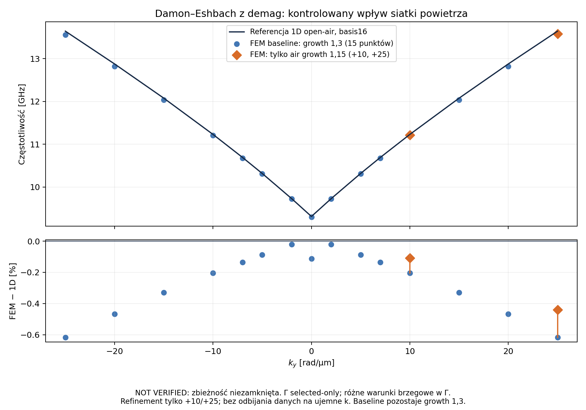

# DE: dwie kontrolowane próby siatki powietrza

Odczyt 2026-10-04T12:26:25.407609+00:00. **Oba punkty +10 i +25 rad/µm mają zaakceptowane rzeczywiste wyniki z demag. Zmiana samego air growth 1,3→1,15 przybliża je do referencji 1D.** Pozostała różnica i zbieżność przestrzenna nadal wymagają wyjaśnienia; pełna kwalifikacja solvera pozostaje **NOT VERIFIED**.

| k [rad/µm] | Baseline [GHz] | Air 1,15 [GHz] | Referencja 1D [GHz] | Różnica baseline [%] | Różnica air 1,15 [%] | Pełny residual |
| ---: | ---: | ---: | ---: | ---: | ---: | ---: |
| +10 | 11.205285324 | 11.216153905 | 11.228265980 | -0.204668 | -0.107871 | 2.312e-11 |
| +25 | 13.557589546 | 13.581679730 | 13.641746354 | -0.616906 | -0.440315 | 2.473e-11 |

Różnica procentowa to 100·(f_FEM/f_1D−1). Referencja open-air 1D basis16 zawiera profile po grubości i off-diagonal demag; jest osobną metodą Galerkina. Nie jest eksportem COMSOL. Open-air i finite Dirichlet różnią się warunkami brzegowymi, co w Γ nie może być traktowane jako sam błąd dyskretyzacji.

[PDF wykresu](assets/de-signed15-20261004/de-signed15-air-refinement.pdf). Linia referencji łączy jej próbkowane wartości. Punkty FEM są rzeczywistymi obliczeniami; refinement wykonano tylko dla dodatnich +10/+25, bez interpolacji i symetrycznego odbijania. Historyczny [jednorodny baseline](2026-10-04-de-signed15-runtime.md) i [szczegółowa izolacja +10](2026-10-04-de-air-grading-isolation.md) pozostają zachowane.

## Warunki i kontrola

Film DE 40×40×10 nm, B₀=0,1 T, Ms=800000 A/m, Aex=1,3e−11 J/m, γ₀=221100 m/(A·s), μ₀=1,2566370614359173e−6 T·m/A. M₀=x, k=y, normalna z; PBC x/y, full-field Floquet exp(−ik·Δr), demag włączony. Finite Dirichlet air padding 2 µm na stronę; body L2/3, target5 nm, air cap100 nm. Okno8,5–16 GHz, EPS/KSP1e−9, FGMRES restart8, próg pełnego residualu1e−8 bez zmian.

Obie niezależne kontrole postsolve sprawdziły receipts/source/model binds, full projected weak form i periodic seams, true residual KSP, pola potencjału i faktyczne rozstrzygnięcie air growth w czterech miejscach metadata. Sam exit0 nie był kryterium akceptacji.

Izolacja geometryczna i statyczna PASS w obu punktach: ten sam film396węzłów/1476tet,4płaszczyzny z, kanoniczne coordinates/connectivity przy jawnej tolerancji porównania1e−20m. Max surowa różnica współrzędnych3,309e−24m; max różnica m₀4,784e−20 przy tolerancji porównania1e−12. Pola statyczne różnią się maksymalnie3,620e−11 A/m (demag) i2,037e−9 A/m (effective). Cała siatka6138→7524węzłów,30012→36900tet; planes z62→76. Są to tolerancje porównania, nie nowe progi solvera ani zamiana hashy artefaktów.

Squared consistent-P1-mass overlap² baseline/refinement: +10=0.999999942484, +25=0.999999813703. Air z-schedule faktycznie się zmienił. Częstotliwości wzrosły odpowiednio o 10.868580 i 24.090184 MHz. To dowód wkładu siatki powietrza; nie dowodzi jedynej przyczyny rozbieżności ani zbieżności growth1,15. Overlap nie certyfikuje kompletności widma.

## Tożsamość i pozostałe bramki

Managed runtime228/job8df582e52a54410bae0387d2eaecd6a9, source57182911c6e8e721b8ee9705aa7f70491c70fe94, digest1635883ea717cc5892970fabb872c70e6d94648da2b57234d6d3c857bbc9d326. Standalone input38fc4420bbc02454c4b74896ce8bd014b70643f5, model SHA2560b67ee80b71acf12f95061c0940d1cdb0b4b53a0ead2620239664e0b7e538d0e. Nie było kolejnego buildu. Runtime/Python są capsule-bound i odrębne od wersjonowanego wejścia. Kapsuła ma historyczne LinearizationState.v6/EquilibriumArtifact.v7; próby nie kwalifikują nowszych migracji źródeł.

Managed run trwał81,399s dla+10 i97,907s dla+25; to pomiar tych prób, nie benchmark skalowania CPU. [Manifest](assets/de-signed15-20261004/two-air-trials-manifest.json) wiąże raw output i dowody kontroli hashami; same hashe nie są kwalifikacją naukową.

Następne kroki: dalszy kontrolowany poziom siatki powietrza (bez uznawania1,15 za zbieżny), body/thickness i niezależne padding/mode-count convergence. Γ228 full window failed7/50 nadal OPEN; selected-only Γ227 tego nie zastępuje. Wspólny native signed15, serial/adaptive parity i zasoby CPU/RAM, live GUI, A1/COMSOL, S09/provider/typecheck/GPU oraz integracjaPR97 nadal OPEN. Testów kompilowanych nie uruchamiano.
