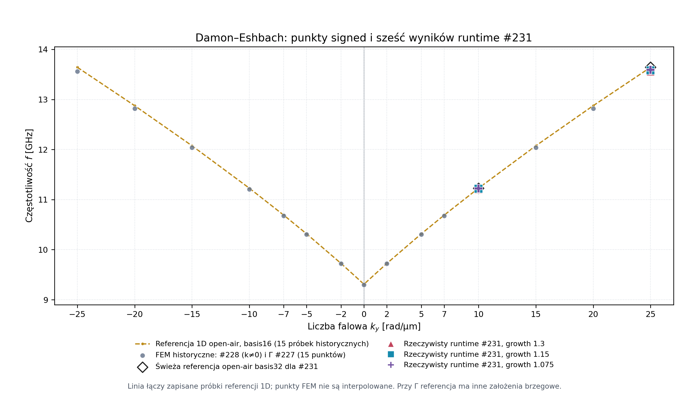
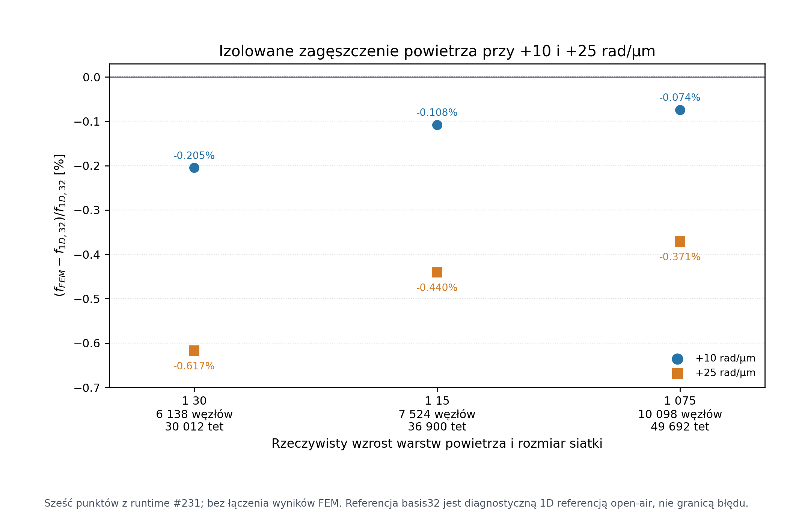

# Kontrolowana macierz zagęszczenia powietrza DE — rzeczywiste punkty runtime #231

**Wynik:** zapisano sześć rzeczywistych punktów FEM dla $k_y=+10$ i $+25\,\mathrm{rad/\mu m}$ oraz wzrostu warstw powietrza 1,30, 1,15 i 1,075. Wszystkie sześć przechodzi preflight wiersza i ma pełny względny residual poniżej $10^{-8}$. W każdym przypadku kompletność okna własnego pozostaje **niecertyfikowana** (window_complete=false, not_certified), a cały S00–S12 pozostaje **OPEN**.

Eksperyment izoluje harmonogram siatki powietrza: dla każdego porównania baseline 1,30 z refinementem zgadzają się kanoniczne współrzędne i tetraedry filmu, a pozostałe zapisane kontrole modelu są takie same. Trend częstotliwości w tej małej macierzy jest widoczny względem świeżej referencji grubościowej 1D; nie jest to formalna granica błędu FEM ani dowód pełnej zbieżności.

## Model i stałe kontrole

Jednolity film Damon–Eshbach ma wymiary $40\times40\times10\,\mathrm{nm}$. $\mathbf M_0$ jest wzdłuż $x$, wektor falowy wzdłuż $y$, a normalna filmu wzdłuż $z$. Demag jest włączony. Wszystkie wiersze pochodzą z tego samego poświadczonego runtime #231 i wersjonowanego wejścia [examples/fem_de_smoke_numeric.py](../../examples/fem_de_smoke_numeric.py) z commit 4b34ec7b91dadb18ac87d7f8b98b3a2cf5c8f574 (SHA-256 wejścia: 408492f3f19c852ff992776a6fb3b2d3934ac69a33dc668b740ebbe26a6f5b8b).

| Wielkość lub kontrola | Wartość |
| --- | ---: |
| Indukcja zewnętrzna $B_0$ | $0{,}1\,\mathrm T$ |
| Nasycenie $M_s$ | $800\,\mathrm{kA/m}$ |
| Sztywność wymiany $A$ | $13\,\mathrm{pJ/m}$ |
| $\gamma_0$ | $221100\,\mathrm{m/(A\,s)}$ |
| Okres komórki w płaszczyźnie $xy$ | $40\,\mathrm{nm}$ |
| Warunki brzegowe | okresowe w $xy$, Dirichlet dla potencjału na zewnętrznej granicy powietrza |
| Padding powietrza | $2\,\mathrm{\mu m}$ po każdej stronie |
| Siatka filmu | L2, docelowy rozmiar $5\,\mathrm{nm}$, 3 elementy przez grubość, 4 płaszczyzny $z$ w filmie |
| Wyszukiwane okno | $8{,}5$–$16\,\mathrm{GHz}$; żądany 1 mod |
| EPS | rtol=1e-8, maks. 2000 iteracji zewnętrznych |
| KSP wewnętrzny | FGMRES, rtol=1e-9, atol=1e-50 |
| Próg akceptacji pełnego residualu | $10^{-8}$ |

Przełączanym parametrem jest wyłącznie rzeczywisty wzrost grubości kolejnych warstw powietrza. Dla sześciu przypadków objętość i podmesh filmu wynoszą $1{,}6\times10^{-23}\,\mathrm{m^3}$, 396 węzłów magnetycznych i 1476 magnetycznych tetraedrów. Pełne kontrole wejścia i skróty dla poszczególnych artefaktów znajdują się w [manifeście dowodów](assets/de-air-matrix-20261004/manifest.json).

## Rzeczywiste wyniki runtime #231

Wartość $\Delta f_{32}$ to $f_{FEM}-f_{1D,32}$ względem świeżo przeliczonej referencji opisanej niżej. Referencja jest niezależnym, otwartym w powietrzu oracle grubościowym, a nie wynikiem FEM ani granicą błędu.

| $k_y$ [rad/µm] | growth | $f$ [GHz] | Pełny residual względny | $\Delta f_{32}$ [MHz] | $\Delta f_{32}/f_{1D,32}$ [%] | Węzły / tet: razem [film / powietrze] |
| ---: | ---: | ---: | ---: | ---: | ---: | ---: |
| +10 | 1,30 | 11,205285324 | $1{,}568185\times10^{-11}$ | −22,980655 | −0,204668 | 6138 / 30012 [1476 / 28536] |
| +10 | 1,15 | 11,216153905 | $2{,}312096\times10^{-11}$ | −12,112075 | −0,107871 | 7524 / 36900 [1476 / 35424] |
| +10 | 1,075 | 11,219934615 | $1{,}571388\times10^{-11}$ | −8,331365 | −0,074200 | 10098 / 49692 [1476 / 48216] |
| +25 | 1,30 | 13,557589546 | $1{,}651249\times10^{-11}$ | −84,156803 | −0,616906 | 6138 / 30012 [1476 / 28536] |
| +25 | 1,15 | 13,581679730 | $2{,}473288\times10^{-11}$ | −60,066619 | −0,440315 | 7524 / 36900 [1476 / 35424] |
| +25 | 1,075 | 13,591128077 | $1{,}542637\times10^{-11}$ | −50,618273 | −0,371054 | 10098 / 49692 [1476 / 48216] |

Wszystkie sześć residuali dotyczy wybranego modu i pełnego rzutowanego słabego sformułowania z okresowymi seamami. Zakres wynosi $1{,}543\times10^{-11}$–$2{,}473\times10^{-11}$ przy progu $10^{-8}$. CSV zachowuje niezaokrąglone częstotliwości, residuale, liczniki siatki, referencje i skróty głównych wejść.



[PDF: signed dispersion](assets/de-air-matrix-20261004/de-dispersion-runtime231.pdf)

Wykres pokazuje 15 starszych punktów numerycznych z [historycznego raportu runtime #227/#228](2026-10-04-de-signed15-runtime.csv) oraz sześć dodatnich punktów runtime #231. Starsze 15 punktów nie należy do bieżącego pakietu. Linia referencyjna basis16 łączy zapisane historyczne próbki 1D; FEM pozostaje punktami bez interpolacji. Dwa puste romby to świeże referencje basis32 dla +10 i +25. Nie dodano ujemnych refinementów ani odbitych punktów. Przy $k=0$ stara referencja i FEM mają inne założenia brzegowe, więc różnica w tym punkcie nie jest miarą błędu siatki FEM.



[PDF: zagęszczenie powietrza](assets/de-air-matrix-20261004/de-air-refinement-runtime231.pdf)

Drugi wykres pokazuje wszystkie sześć zmierzonych częstotliwości jako niezależne punkty. Etykiety podają rzeczywistą liczbę węzłów i tetraedrów; żadnych punktów FEM nie połączono linią. Zmiana znaku nie występuje: wszystkie częstotliwości są niższe od użytej referencji 1D.

## Świeża referencja grubościowa 1D

Dla każdej z dwóch liczb falowych ponownie wyliczono pierwszy mod niezależnego oracle open-air z bazą 8, 16 i 32 oraz kwadraturą 256 punktów. To diagnostyczna referencja o otwartym polu magnetostatycznym i swobodnej wymianie, oznaczona w dowodzie diagnostic_oracle_only_not_FEM.

| $k_y$ [rad/µm] | Basis 8 [GHz] | Basis 16 [GHz] | Basis 32 [GHz] | Basis 16 − 8 [Hz] | Basis 32 − 16 [Hz] | Kwadratura |
| ---: | ---: | ---: | ---: | ---: | ---: | ---: |
| +10 | 11,228266007593 | 11,228265980389 | 11,228265979492 | −27,2043 | −0,8967 | 256 |
| +25 | 13,641746481552 | 13,641746353678 | 13,641746349468 | −127,8747 | −4,2096 | 256 |

Zmiana bazy w tym oracle jest mała względem różnic FEM–oracle widocznych w tabeli wyników. Nie dowodzi to zbieżności kwadratury ani siatki FEM i nie nadaje różnicy FEM–oracle statusu oszacowania błędu.

## Izolacja stanu równowagi i porównanie P1

Porównania refinementów z baseline growth 1,30 potwierdzają niezmienione uporządkowane współrzędne i tetraedry kanonicznego filmu, przy jednoczesnej zmianie harmonogramu warstw powietrza. Wszystkie sześć przypadków ma te same digesty topologii filmu (pełne wartości w manifeście).

| $k_y$ [rad/µm] | Growth | $\Delta f$ względem 1,30 [MHz] | $\max|\Delta m_0|$ | $\max|\Delta H_{demag,0}|$ [A/m] | $\max|\Delta H_{eff,0}|$ [A/m] | Kwadrat nakładania modów w masie P1 |
| ---: | ---: | ---: | ---: | ---: | ---: | ---: |
| +10 | 1,15 | +10,868580 | $4{,}784\times10^{-20}$ | $3{,}620\times10^{-11}$ | $2{,}037\times10^{-9}$ | 0,999999942484 |
| +10 | 1,075 | +14,649291 | $1{,}322\times10^{-22}$ | $9{,}997\times10^{-14}$ | $1{,}455\times10^{-11}$ | 0,999999895427 |
| +25 | 1,15 | +24,090184 | $4{,}784\times10^{-20}$ | $3{,}620\times10^{-11}$ | $2{,}037\times10^{-9}$ | 0,999999813703 |
| +25 | 1,075 | +33,538531 | $1{,}322\times10^{-22}$ | $9{,}997\times10^{-14}$ | $1{,}455\times10^{-11}$ | 0,999999638382 |

Największa zmierzona różnica surowych współrzędnych wynosi $3{,}31\times10^{-24}\,\mathrm m$ (próg porównania: $10^{-20}\,\mathrm m$). Maksymalne różnice pola i $m_0$ z powyższej tabeli dotyczą porównań do baseline 1,30; limity pola wynoszą $10^{-8}\,\mathrm{A/m}$. Nakładanie P1 jest diagnostyką zachowania tego samego modu, nie testem kompletności gałęzi.

### Korekta kryterium porównania pól

Pierwszy pomocniczy audyt odrzucił porównanie przy bramce pól statycznych. Jego ad hoc próg $\max(1\,\mathrm{A/m},|H|)\cdot10^{-12}$ wynosił $10^{-12}\,\mathrm{A/m}$ dla bliskiego zeru $H_{demag}$, przez co odrzucał małą, niezerową różnicę replay. Zachowano pierwotny raport niepowodzenia i jego pochodzenie w manifeście.

Wariant v2 sprawdza odpowiednie węzły magnetyczne przy użyciu istniejącej bezwzględnej tolerancji replay $10^{-8}\,\mathrm{A/m}$ w [crates/fullmag-runner/src/fem/eigen_shared_domain.rs](../../crates/fullmag-runner/src/fem/eigen_shared_domain.rs), funkcja build_shared_domain_linearization_state. Progi solvera nie zmieniły się. Maksima w porównaniach to $\Delta H_{demag,0}=3{,}62\times10^{-11}\,\mathrm{A/m}$ i $\Delta H_{eff,0}=2{,}04\times10^{-9}\,\mathrm{A/m}$, a więc zgodność przy rozdzielczości istniejącego replay. Nie jest to dowód dokładnej równości pól, zgodności do roundoff ani ograniczenie błędu częstotliwości. Kontekst i kontrakt źródłowy opisują kotwice [kontrolowanego wejścia siatki powietrza](../physics/0830-fem-poisson-airbox-modal-eigen.md#de-air-grading-controlled-input), [dziedziny replay równowagi](../physics/0830-fem-poisson-airbox-modal-eigen.md#modal-equilibrium-field-replay-domain) oraz [podpisu statycznego demagu](../physics/0830-fem-poisson-airbox-modal-eigen.md#modal-static-demag-replay-preimage).

## Kompletność i zakres wniosków

Dla każdego z sześciu wierszy dowód wykazuje:

- row_preflight.status=pass i jeden zwrócony mod w przedziale 8,5–16 GHz;
- certified_modes_in_window=0, additional_modes_may_exist=true, window_complete=false oraz window_completeness.status=not_certified;
- ten sam body topology i kontrole poza growth, z rzeczywiście zmienionym harmonogramem powietrza.

Residual PASS potwierdza spełnienie testu residualu dla zwróconego modu. Sam nie ustanawia kompletności okna, identyfikacji i zbieżności gałęzi, zbieżności siatki filmu, paddingu lub całej przestrzeni, parytetu GPU ani kwalifikacji wydania. **Całe S00–S12 pozostaje OPEN.** Ten model to jednorodny film DE, **nie geometria COMSOL A1**. Żaden wynik w tym pakiecie nie kwalifikuje GPU.

## Pochodzenie i odtworzenie wykresów

- Główny dowód: [air-matrix231-actual-isolation-v2.json](assets/de-air-matrix-20261004/air-matrix231-actual-isolation-v2.json), zachowany również w wersjonowanej publikacji, SHA-256 563c2a8b0022f9459f52f62b05e3a03f95d78ac1890aaadb27d33928b78fc187.
- Runtime job ID: 3e3b5a6123934d8b8f63cfbf02ccad55; source commit runtime: 4b34ec7b91dadb18ac87d7f8b98b3a2cf5c8f574.
- Zachowany pierwszy nieudany audyt pól: [air-matrix231-static-gate-diagnostic.json](assets/de-air-matrix-20261004/air-matrix231-static-gate-diagnostic.json), SHA-256 739c1b43cf8616ce3041490c9a7530a298dd44a4b2ec76f0b2b61408cddf5a45. Manifest utrwala też wszystkie hashe wejściowe sześciu przypadków, digests stanu modu oraz odtworzone referencje.
- Starszy signed15 CSV ma SHA-256 9561fed8d0c7812b78fc97a713f509c52d52f2fda9635c149ffa1fddc974adbf; jest użyty wyłącznie jako historyczne porównanie.
- [CSV sześciu punktów runtime #231](2026-10-04-de-air-matrix-runtime231.csv).
- Recepta wykresów: [plot_de_air_matrix.py](assets/de-air-matrix-20261004/plot_de_air_matrix.py). Z katalogu głównego checkoutu odtwarza PNG i PDF poleceniem:

```powershell
python docs/raports/assets/de-air-matrix-20261004/plot_de_air_matrix.py
```

Wykresy odtwarzają się z raportowego CSV i wcześniejszego signed15 CSV. Przygotowanie tej publikacji nie uruchamiało solve ani buildu i nie zmieniało noty naukowej ani solvera.
