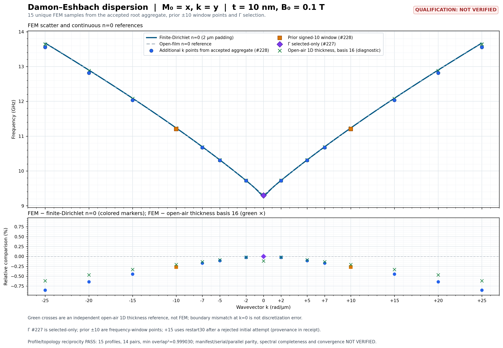

# DE: 15 rzeczywistych punktów dyspersji, 4 października 2026

**Policzono 14 niezerowych wektorów falowych; z wcześniej zaakceptowanym Γ daje to 15 pozycji od −25 do +25 rad/µm.** Każdy nonzero-k ma zaakceptowane rzeczywiste pola i pełny residual, bez interpolowania/odbijania częstotliwości. Zbieżność przestrzenna, airbox, kwalifikacja solvera i wspólny sweep/serial-adaptive parity pozostają **NOT VERIFIED**.

To jednolity film w konfiguracji Damon–Eshbach, nie geometria A1 antidot z COMSOL-a. M₀ jest wzdłuż x, k wzdłuż y, normalna z. Film 40×40×10 nm, PBC x/y, Floquet exp(−ik·Δr), finite Dirichlet air padding 2 µm na każdej stronie. B₀=0,1 T, Ms=800000 A/m, Aex=1,3e−11 J/m, γ₀=221100 m/(A·s), μ₀=1,2566370614359173e−6 T·m/A. L2 target5 nm, trzy warstwy filmu, P1 tetra; actual wspólna geometria: 6138 węzłów, 1476 magnetic tet i 28536 air tet. Demag jest włączony.

## Wyniki i porównanie

| k_y [rad/µm] | f FEM [GHz] | Pełny residual względny | FEM − finite Dirichlet n=0 [%] | FEM − open-air 1D basis16 [%] |
| --- | ---: | ---: | ---: | ---: |
| -25 | 13.557588588 | 1.784e-11 | -0.850378 | -0.616913 |
| -20 | 12.815316991 | 1.769e-11 | -0.641923 | -0.466560 |
| -15 | 12.035727329 | 3.557e-12 | -0.446461 | -0.328920 |
| -10 | 11.205285254 | 9.017e-12 | -0.268160 | -0.204669 |
| -7 | 10.675478005 | 1.222e-11 | -0.170009 | -0.134604 |
| -5 | 10.306327543 | 1.832e-11 | -0.107085 | -0.087271 |
| -2 | 9.723285911 | 3.924e-13 | -0.021769 | -0.021387 |
| +0 | 9.299249697 | 3.283e-11 | -0.000000 | -0.113472 |
| +2 | 9.723285912 | 6.694e-13 | -0.021769 | -0.021387 |
| +5 | 10.306327554 | 1.518e-11 | -0.107085 | -0.087270 |
| +7 | 10.675478033 | 1.956e-11 | -0.170008 | -0.134604 |
| +10 | 11.205285324 | 1.568e-11 | -0.268160 | -0.204668 |
| +15 | 12.035727543 | 4.717e-12 | -0.446459 | -0.328918 |
| +20 | 12.815317483 | 1.733e-11 | -0.641919 | -0.466556 |
| +25 | 13.557589546 | 1.651e-11 | -0.850371 | -0.616906 |

Kolumna open-air przy Γ zawiera różnicę założeń brzegowych; **nie jest miarą błędu dyskretyzacji FEM przy k=0**. n=0 jest przybliżeniem uniform-thickness. Niezależna 1D referencja Galerkina zawiera off-diagonal demag i profile po grubości, basis8/16, quadrature256; zmiana bazy jest diagnostyką referencji, nie zbieżnością siatki FEM/airboxu ani pełnym dowodem zbieżności quadrature.

Zaakceptowany Γ: 9.299249697067 GHz, residual 3.283e-11, selected_only/window_complete=false z #227. Wszystkie nonzero-k: #228, frequency_window8,5–16 GHz, EPS/KSP1e−9 i niezmieniony próg pełnego residualu1e−8. Maksymalny nonzero full residual 1.956e-11. Actual profile comparison potwierdził identyczną uporządkowaną topologię, minimum adjacent consistent-P1-mass overlap² 0.999030113999; to diagnostyka ciągłości, nie kwalifikacja kompletności gałęzi. Maksymalna zmierzona względna różnica niezależnie obliczonych par ±k wynosi 7.06987997e-08 (około 958,5 Hz przy |k|=25).

## Przebieg solvera i granice

- Pierwszy +15, FGMRES restart8: odrzucony przez DIVERGED_ITS w shifted KSP; w nieudanym podoknie true residual criterion zarejestrowało violation. Zachowano raw dane, nie przyjęto kandydata. Fresh +15 restart30: exit0, pełna walidacja PASS, queried native ksp_restart=30. Model, siatka, okno i tolerancje pozostały takie same. Pozostałe nonzero-k restart8. Ten retry pokazuje wrażliwość na przestrzeń Kryłowa; nie dowodzi naprawy wszystkich przypadków ani automatycznego recovery w produkcie.
- Γ228 pełnego okna zakończyło się failed/exit1: 43/50 podokien ukończonych, siedem EPS reason−1 / własne outer_iterations2000. Ten problem nadal jest otwarty. Γ227 na wykresie nie zastępuje świadectwa pełnego okna.
- Dane złożono z osobnych managed runów używających tego samego gotowego builda #228 i osobnego Γ227. Nie jest to jedno native zadanie signed15 ani dowód adaptive multiprocessing, UI czy performance qualification.
- Różnica względem 1D reference rośnie z |k|. Trace źródeł/siatki nie potwierdził błędu fizycznego: consistent mass, weak exchange i −μ₀ adjoint feedback są obecne. Hipotezy do rozróżnienia to discretization magnetic P1/phase/thickness i scalar-P1 graded air. L2→L3 zmienia także air seed; layers3→6 zmienia film z-schedule. Air-only growth1,3→1,15 wymaga nowego versioned input oraz pomiaru niezmienności actual magnetic submesh, nie samego założenia.

## Następne bramki

1. **Wykonano** +10 L2/6 i L3/3: exit0, pełne artefakty i actual mesh PASS. Do wykonania dalsza sekwencja zagęszczeń; dwa eksperymenty nie zamykają zbieżności.
2. Versioned air-only refinement z body L2/3, następnie niezależna zbieżność airbox padding i liczby modów. Zachować rozróżnienie modeli brzegowych.
3. Naprawa zbieżności Γ pełnego okna na podstawie per-window reasons/dimensions; bez obchodzenia kryteriów akceptacji.
4. Wspólny signed15 manifest, serial/adaptive parity i resource measurements oraz live GUI; A1/COMSOL i cały S00–S12 pozostają otwarte.

## Tożsamość i reprodukcja

- Nonzero managed build #228: job `8df582e52a54410bae0387d2eaecd6a9`, runtime source commit `57182911c6e8e721b8ee9705aa7f70491c70fe94`, source digest `1635883ea717cc5892970fabb872c70e6d94648da2b57234d6d3c857bbc9d326`.
- Γ #227: job `d2a6c2dd0c3c4a66a1e05fce10bb32c7`, source commit `a8d67ac92002b884799119578a054b518cf40cbf`, source digest `e848950d7d555f4d70d27a71421803fd2566d7e2f57d7e05b22f05da8123e8e6`.
- Immutable authoring model: `71ba0d18225ffcc83f7f18e676de8dc051e87fd1`, SHA256 `083f8f97b705b819cee2c4a03349e06f7b0b39715ddfec0d9898aa5e8ab23038`. Runtime image i kapsuła pozostają bind-bound w run-request/receipts; source contour checkpoint nie był częścią build228.
- [CSV wszystkich punktów](2026-10-04-de-signed15-runtime.csv), SHA256 Git blob LF (dla checkoutu CRLF normalizować zakończenia linii do LF) `9561fed8d0c7812b78fc97a713f509c52d52f2fda9635c149ffa1fddc974adbf`. CSV opisuje wartości z zaakceptowanych artefaktów; sam nie dowodzi ich kwalifikacji.
- Raw runy: resolver storage → `runs/eigensolve-dispersion-plan-20260-c5dfad6d7f548079/scientific-batches/nonzero-k-validation/8df582e52a54410bae0387d2eaecd6a9/`; mapowanie punkt→run i pełne hashe w inspection JSON. Bez usuwania/nadpisywania poprzednich prób.
- Dowody lokalne: `C:\Users\Mateusz\.codex\visualizations\2026\09\14\01a09ee1-29e6-7d51-98f0-082c5539a0d6\preview-state-checkpoint`. Hashe:
- `signed12-fgmres-window-postsolve-inspection-selected-final.json`: `7cb8773a03b678191f0041332e0e8dd4525a753261d60a170905ea6ae5b2adfe`.
- `signed10-fgmres-window-postsolve-inspection.json`: `b680d18a6a36fa3853870960062256c1a3cf6527431ae5b7ea3c2b530b7a031e`.
- `gamma227-selected-result-inspection-v2.json`: `414baa52b4e3fad1a07f29488adb12c99296a285d66d8d1b7b4a097adec825a1`.
- `signed15-profiles-reciprocity-inspection.json`: `7895829684c7b726d3d4b977d5eb587eb4541d90df653a5b01780d0cc755503b`.
- `signed15-thickness-reference-inspection.json`: `d34a46e87e6109ef1c8acfffd5c9e71c8e0484be7a8b4abe1d2136f0c3aae95c`.
- `gamma228-terminal-diagnostics-inspection.json`: `2b229bf524f6dec48f5a8e3bbc035a3293c5dca184a0acdb0e43b2bda0b2c264`.
- `nonzero-k-discrepancy-source-scan.md`: `cfb1bd4f1bcae1880db2f8a15377911af86d212ecc940640145c56e45bd11c37`.

Raport wygenerowano z zaakceptowanych JSON 2026-10-04T11:01:42.796655+00:00. Nie budowano ani nie uruchamiano jednostek Rust/C++/React. Obecny wynik nie zamyka S00–S12 ani integracji PR97.

## Wykres i dwa ukończone refinementy

[PDF wykresu](assets/de-signed15-20261004/de-dispersion-signed15-job228.pdf), [manifest integralności](assets/de-signed15-20261004/manifest.json), [scan przyczyny rozbieżności](2026-10-04-de-nonzero-discrepancy-source-scan.md).

| Siatka | f FEM [GHz] | Pełny residual | Węzły | Tet filmu / air | Płaszczyzny z filmu | FEM − open-air 1D [%] |
| --- | ---: | ---: | ---: | ---: | ---: | ---: |
| L2-layers3 | 11.205285324 | 1.568e-11 | 6138 | 1476 / 28536 | 4 | -0.204668 |
| L2-layers6 | 11.207794879 | 1.974e-11 | 6435 | 2952 / 28536 | 7 | -0.182318 |
| L3-layers3 | 11.208735289 | 3.103e-11 | 10496 | 2538 / 50760 | 4 | -0.173942 |

Końcowa inspekcja obu refinementów: `k10-mesh-refinement-postsolve-inspection-20261004T111359142967Z.json`, SHA256 `ae0035c9b7f37951f15129beef1d403d1202ccaabc704e788b63f986d3619212`. Niezależny pomiar rzeczywistej geometrii: `k10-refinement-mesh-geometry-inspection.json`, SHA256 `7661aa1c754b118ded88b7db913e2e4c6ff482617d5e57be8adbeaebe3f8a9f9`.

Wszystkie próby zachowują +10 rad/µm, fizyczne parametry, okno, EPS/KSP1e−9, restart8 i próg pełnego residualu1e−8; świeże katalogi wyników. Zaakceptowane czasy L2/6 i L3/3 to odpowiednio 207,424 s i 167,205 s; nie jest to kontrolowany benchmark wydajności. Zmierzono objętość filmu 1,6e−23 m³ oraz rzeczywiste 4/7/4 płaszczyzny z. Wyniki refinementów nie zastępują baseline L2/3 na wykresie. Zagęszczenie podnosi częstotliwość o około 2,510 i 3,450 MHz względem baseline, ale nie ustala pełnej przyczyny różnicy. L3 zmienia także air seed i lateral mesh; nie jest izolacją air-only. Pełna zbieżność siatki, airboxu i liczby modów pozostaje **NOT VERIFIED**.
