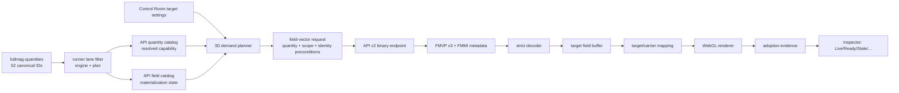
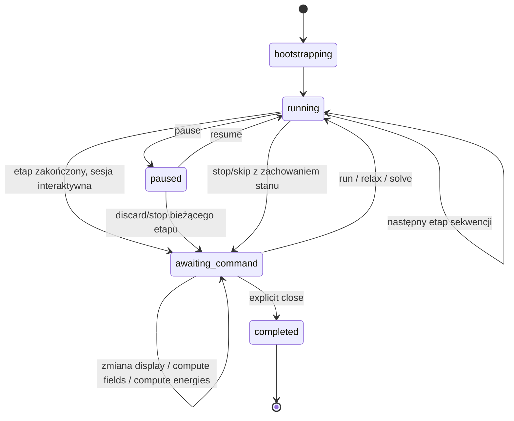

# Audyt frontendu wizualizacji 3D FEM/FDM i kontraktów backend–frontend

**Projekt:** Fullmag  
**Repozytorium:** `MateuszZelent/fullmag`  
**Data audytu:** 2026-08-24  
**Audytowany commit `master`:** `78cde18ee95b6d6ee1cd93e7a775bb7a8c7249de`  
**Opis commitu:** `fix: harden CUDA residency receipt qualification`  
**Zakres:** Control Room, API v2, binarny data plane pól, semantyczne cele renderowania FEM/FDM, Airbox, quantities, cykl życia sesji interaktywnej po zakończeniu etapu solvera  
**Rodzaj audytu:** statyczny audyt kodu i kontraktów; bez deklarowania wyników testów runtime, których nie wykonano dla tego SHA

---

## 1. Streszczenie wykonawcze

Aktualna architektura wizualizacji 3D jest znacznie dojrzalsza niż typowy układ „frontend pobiera tablicę i zgaduje, jak ją narysować”. Fullmag ma już większość elementów potrzebnych do rozwiązania produkcyjnego:

- kanoniczny katalog 52 quantities po stronie Rust;
- niezależne rozróżnienie: **quantity**, **scope**, **target**, **carrier**, **generation**, **revision** i **renderer adoption**;
- binarny transport FMVP v3 z metadanymi zakresu i indeksowania;
- semantyczne cele renderowania dla Airboxa, obiektów, części, regionów i warstw FDM;
- rozdzielenie FDM multilayer na fizyczne siatki warstw oraz osobny, certyfikowany nośnik Airboxa;
- jawny stan `awaiting_command` po zakończeniu etapu interaktywnego;
- zachowanie stanu magnetyzacji lub deterministyczna rekonstrukcja obserwacji zależnie od backendu;
- mechanizmy fail-closed, które odrzucają niezgodne generacje, topologie, zakresy i nośniki;
- target-aware stany `supported`, `materializing`, `ready`, `stale`, `adopted`, `unavailable`.

**Główny wniosek:** rdzeń architektury jest poprawny i bliski produkcyjnemu, ale pełna kwalifikacja produkcyjna powinna pozostać zablokowana do usunięcia trzech klas ryzyka:

1. **FEM `shared-domain-with-air` nie ma pełnej dynamicznej interaktywności po zakończeniu etapu.** Po przejściu do `awaiting_command` korzysta z niezmiennego snapshotu końcowego. Nie można wiarygodnie zażądać dowolnego nowego, wcześniej niezmaterializowanego pola bez ponownego kontekstu obliczeniowego.
2. **Kontrakt quantity nie jest jeszcze całkowicie pojedynczym źródłem prawdy od Rust do renderera.** Frontend nadal utrzymuje ręczne mapy aliasów, jednostek i klasyfikacji pól skalarnych, a część ścieżek Airboxa opiera się na ogólnym `domain=full_domain`, zamiast na możliwościach konkretnego nośnika.
3. **Bramki CI istnieją w repozytorium, ale `master` nie jest chroniony i nie wymaga żadnych status checks.** Dokumentacja kwalifikacyjna sama zaznacza, że nie jest dowodem wykonania dla konkretnego SHA. W czasie audytu nie znaleziono PR-triggered workflow runs dla audytowanego SHA; nie jest to dowód braku workflow uruchomionych przez `push`, ale oznacza brak zweryfikowanego w tym audycie proof bundle przypisanego dokładnie do commitu.

### 1.1. Ocena obszarów

| Obszar | Ocena | Wniosek |
|---|---:|---|
| Architektura target/carrier | dobra | Rozdzielenie semantycznego celu od technicznego nośnika jest właściwe |
| FEM: obiekty i Airbox | dobra z luką UX | Airbox i obiekty są oddzielne; części jednego obiektu są jednak domyślnie agregowane |
| FDM single-grid | dobra | Magnetyczny support i obszar poza nim są rozróżnione; exact ownership wymaga membership |
| FDM multilayer | bardzo dobra | Warstwy natywne i target-only Airbox są osobnymi nośnikami; common FFT grid nie jest renderowany jako geometria |
| Kontrakty quantities | dobra, niepełny parytet | 52 ID są kanoniczne, lecz możliwości wykonawcze są lane-specific i frontend ma pozostałości ręcznych map |
| Binary field data plane | dobra | FMVP v3 jest rygorystyczny; kompatybilność v2 osłabia gwarancje po remeshu |
| Tryb interaktywny po etapie | poprawny dla większości lane’ów | FDM regular, FDM multilayer i FEM magnetic-only są obsłużone; FEM shared-air jest snapshot-only |
| Walidacja i release governance | niewystarczająca | Brak branch protection i required checks na `master` |

### 1.2. Klasyfikacja ustaleń

- **P0:** 0
- **P1:** 3
- **P2:** 9
- **P3:** 2

P0 oznacza błąd prowadzący do nieuniknionej korupcji wyników lub systematycznie fałszywej wizualizacji w podstawowym scenariuszu. Takiego błędu w przeanalizowanym kodzie nie stwierdzono.

---

## 2. Zakres i metodologia

Audyt objął następujące warstwy:

1. **Kanoniczne quantities**
   - `crates/fullmag-quantities/src/id.rs`
   - `crates/fullmag-quantities/src/catalog.rs`
   - `crates/fullmag-quantities/src/registry.rs`
   - `crates/fullmag-runner/src/quantities.rs`

2. **API i data plane**
   - `crates/fullmag-api/src/schemas/fields.rs`
   - `crates/fullmag-api/src/schemas/mesh.rs`
   - `crates/fullmag-api/src/schemas/status.rs`
   - `crates/fullmag-api/src/router_v2/handlers/sessions/status.rs`
   - `crates/fullmag-api/src/session.rs`
   - frontendowe typy OpenAPI i kodeki FMVP/FMMI

3. **Frontend 3D**
   - `apps/control-room/src/modules/viewport-3d/**`
   - `apps/control-room/src/kernel/visualization/**`
   - `apps/control-room/src/kernel/selection/**`
   - `apps/control-room/src/shared/domain/mesh/**`
   - Inspector i Ribbon w zakresie selekcji quantities i ustawień targetów

4. **Interaktywny runtime**
   - `crates/fullmag-cli/src/interactive_runtime_host.rs`
   - `crates/fullmag-cli/src/orchestrator.rs`
   - `crates/fullmag-runner/src/observation.rs`
   - kontrakt statusu i commandability w API/Control Room

5. **Walidacja**
   - `.github/workflows/frontend-3d-managed-fem.yml`
   - `docs/validation/frontend-3d-required-check-matrix.md`
   - istniejące plany naprawcze 3D

### 2.1. Ograniczenia audytu

Audyt jest analizą statyczną audytowanego SHA. Nie wykonano lokalnie:

- kompilacji Rust;
- `pnpm`/TypeScript/Vitest;
- browser fixture smoke;
- testu WebGL na realnym GPU;
- managed FEM magnetic-only;
- managed FEM shared-air;
- obciążeniowego testu dużych siatek;
- porównania pól 3D z niezależnym oracle numerycznym.

Wnioski dotyczące poprawności architektury wynikają z przepływu danych, warunków adopcji, typów, testów obecnych w repozytorium i jawnych polityk runtime. Nie należy ich traktować jako dowodu wykonania bramki dla konkretnego SHA.

---

## 3. Docelowy model architektoniczny

Najważniejszą cechą obecnego rozwiązania jest rozdzielenie pięciu pojęć, które wcześniej łatwo było pomylić:

| Pojęcie | Znaczenie |
|---|---|
| `quantity` | Wielkość fizyczna, np. `m`, `H_demag`, `eden_ex` |
| `scope` | Zakres danych, np. `full`, `object`, `part`, `region`, `layer`, `airbox` |
| `target` | Logiczny element sterowany w UI, np. Airbox lub konkretny obiekt |
| `carrier` | Faktyczny nośnik próbek: siatka FEM, część siatki, regularny grid, warstwa natywna FDM, target-only Airbox |
| `adoption` | Potwierdzenie, że renderer używa dokładnie tego bufora, który odpowiada targetowi, quantity, generacji i rewizji |

To rozdzielenie jest poprawne. Sam fakt, że backend „zna” quantity, nie oznacza, że:

- jest ono aktywne w bieżącym planie fizycznym;
- bieżący engine umie je policzyć;
- zostało zmaterializowane;
- istnieje nośnik dla wybranego targetu;
- payload jest zgodny z aktualną generacją siatki;
- renderer rzeczywiście użył payloadu.

### 3.1. Przepływ danych



### 3.2. Wniosek architektoniczny

Architektura nie powinna wracać do modelu:

> „Aktywne quantity jest globalne, a renderer dopasowuje tablicę po długości”.

Obecny model oparty na scope, generation, topology fingerprint, carrier i target jest właściwy i powinien zostać utrzymany jako obowiązkowy kontrakt.

---

## 4. FEM: rozdzielenie obiektów, części siatki i Airboxa

### 4.1. Co działa prawidłowo

`manifestRenderableCarriers.ts` normalizuje rzeczywiste `mesh_parts` jako nośniki zdolne do przenoszenia pól. `object_segments` są traktowane jako fallback diagnostyczny, a nie równoważny nośnik pola, jeżeli nie mają potwierdzonej własności siatki. Jest to właściwe zachowanie fail-closed.

`semanticRenderTargetCatalog.ts` buduje logiczne cele:

- `airbox`;
- `object:<object_id>`;
- `part:<part_id>`;
- pozostałe targety zależne od typu domeny.

Część siatki oznaczona jako `air`/`airbox` trafia do logicznego Airboxa. Część powiązana z obiektem sceny trafia do targetu obiektu. Nieprzypisana część pozostaje niezależnym targetem `part`.

To spełnia podstawowy wymóg:

> Airbox nie powinien być tylko kolejnym kolorem tej samej, nierozróżnialnej siatki; musi być osobnym celem widoczności, stylu, wektorów i quantity.

### 4.2. Agregacja wielu carrierów jednego obiektu

Jeżeli kilka `mesh_parts` mapuje się na ten sam obiekt sceny, katalog agreguje je pod jednym `object:<id>`. Z punktu widzenia typowego obiektu magnetycznego jest to wygodne: użytkownik steruje obiektem, a nie technicznymi fragmentami meshera.

Nie spełnia to jednak pełnego wariantu wymagania:

> „Każdym fragmentem siatki obiektu można zarządzać niezależnie”.

Aktualny model oferuje niezależny `part` głównie wtedy, gdy część nie została już semantycznie przypisana do obiektu. Dla obiektu z wieloma fizycznie istotnymi częściami — np. różne domeny materiałowe, warstwa interfejsowa, osobne składowe geometrii, region przewodzący i ferromagnetyczny — użytkownik nie ma automatycznie podtargetów.

### 4.3. Rekomendowany model hierarchiczny

```text
object:<object_id>
├── part:<mesh_part_a>
├── part:<mesh_part_b>
└── region:<region_id>
```

Target obiektu powinien działać jako grupa, a część jako opcjonalny override:

1. ustawienia globalne;
2. ustawienia typu targetu;
3. ustawienia obiektu;
4. ustawienia części;
5. ustawienia regionu lub zaznaczenia.

Nie należy duplikować payloadów. Jeden carrier może być współdzielony przez target grupowy i subtarget, pod warunkiem jednoznacznej maski/indeksów.

### 4.4. Ocena FEM

- Rozdzielenie Airbox–magnes: **poprawne**.
- Rozdzielenie obiektów: **poprawne**.
- Rozdzielenie wszystkich części wewnątrz obiektu: **częściowe**.
- Identyfikacja pola per część: **poprawna w architekturze**, zależna od manifestu.
- Fallback z `object_segments`: **bezpieczny**, ponieważ nie jest automatycznie traktowany jako field-capable.

---

## 5. FDM: single-grid, magnetic support, multilayer i Airbox

### 5.1. FDM single-grid

FDM single-grid nie ma „Airbox mesh” w sensie FEM. Istnieje regularny universe grid, a membership określa:

- aktywne komórki magnetyczne;
- aktywne, ale nieprzypisane komórki;
- komórki nieaktywne;
- zakres magnetic support.

`domainPresentation.ts` poprawnie nie utożsamia obszaru poza magnetic support z FEM shared-domain Airboxem. Przed publikacją membership frontend może pokazać jedynie konserwatywną obwiednię wynikającą z geometrii autora. Nie udaje wtedy dokładnej własności komórek.

To jest właściwe. Exact cell ownership musi pochodzić z FMRM/membership, a nie z przybliżonego przecięcia bounding boxów.

### 5.2. FDM multilayer

Implementacja multilayer ma szczególnie dobrą separację:

- każda warstwa natywna ma własny `layer_id`, `object_id`, fingerprint gridu, maskę aktywności i parametry próbkowania;
- common convolution/transform grid jest jawnie wykluczony z reprezentacji fizycznej geometrii;
- Airbox multilayer jest osobnym, `target_only` nośnikiem;
- Airbox ma własne: origin, spacing, shape, generation, carrier fingerprint, revision i count;
- aktualnie certyfikowanym obserwable Airboxa jest tylko `H_demag`;
- `H_eff` jest dla tego nośnika jawnie niedostępne;
- payload musi być FMVP v3, mieć `scope_kind=airbox`, `scope_id=airbox`, zgodną generację, fingerprint i jawne indeksy komórek.

To jest wzorcowa implementacja rozdzielenia nośnika fizycznego od technicznego gridu FFT.

### 5.3. Maski aktywności

Dla warstw natywnych deklarowana maska nie przechodzi na fallback „renderuj wszystko”, nawet gdy wszystkie komórki są aktywne. Sprawdzane są:

- rozmiar maski;
- shape;
- liczba aktywnych i nieaktywnych komórek;
- fingerprint gridu;
- hash maski;
- layout revision.

To minimalizuje ryzyko pokazania pól na komórkach, które nie należą do fizycznej warstwy.

### 5.4. Publiczny target Airboxa a techniczny carrier

Frontend kanonizuje kilka historycznych identyfikatorów do publicznego targetu `airbox`, m.in.:

- FEM Airbox;
- starsze `part:__air__`;
- starsze `object:__air__`;
- logiczny outside-support target FDM;
- multilayer target-only Airbox.

Z punktu widzenia UI jest to pożądane: użytkownik widzi jedną kategorię „Airbox”. Z punktu widzenia danych carrier musi nadal zawierać jednoznaczną klasę:

```ts
type AirboxCarrierKind =
  | "fem-shared-domain-part"
  | "fdm-single-grid-outside-support"
  | "fdm-multilayer-target-only";
```

Aktualna adopcja payloadu jest chroniona generacją, fingerprintem i scope, więc nie stwierdzono bezpośredniego przecieku danych pomiędzy tymi przypadkami. Brakuje jednak równie jednoznacznej klasy nośnika w kontrakcie ustawień i diagnostyce użytkownika. To utrudnia wyjaśnienie, dlaczego np. `H_demag` działa, a `H_eff` nie, albo dlaczego jeden Airbox wspiera punkty i wektory, a inny wyłącznie snapshot.

---

## 6. Kontrakty quantities

## 6.1. Cztery poziomy prawdy

Każda quantity powinna przejść cztery niezależne bramki:

1. **Canonical descriptor**
   - ID;
   - shape;
   - komponenty;
   - jednostka;
   - lokalizacja;
   - domena;
   - polityka 2D/3D/history/export.

2. **Resolved lane capability**
   - backend;
   - CPU/GPU engine;
   - plan fizyczny;
   - aktywne interakcje;
   - rodzaj domeny.

3. **Materialization**
   - `unmaterialized`;
   - `pending`;
   - `complete`;
   - `stale_complete`;
   - `error`;
   - rewizja i generacja.

4. **Target adoption**
   - zgodny target;
   - zgodny scope;
   - zgodny carrier;
   - zgodny payload;
   - renderer faktycznie używa bufora.

Obecny kod ma wszystkie cztery warstwy, ale nie wszystkie ścieżki UI korzystają wyłącznie z najbardziej restrykcyjnego wyniku.

## 6.2. Kanoniczny katalog 52 ID

`QuantityId::as_str()` jest zamrożonym wire formatem. `registry.rs` sprawdza parytet providerów z pełnym katalogiem 52 wpisów. To jest mocna podstawa.

Poniższa macierz ocenia wszystkie 52 quantities.

### Legenda

- **3D** — katalog deklaruje quantity jako aktualnie wystawioną, interaktywną i wspierającą preview 3D.
- **hist.** — global scalar; właściwa ścieżka to tabela/historia, nie bufor przestrzenny 3D.
- **deferred** — quantity jest kanoniczna, ale nie jest obecnie selektowalna jako interaktywny field 3D.
- **A** — plan lane’u dopuszcza quantity zasadniczo zawsze, o ile engine/provider ją realizuje.
- **C** — plan dopuszcza quantity warunkowo, gdy odpowiednia fizyka/transport jest aktywna.
- **N** — bieżący filtr spatial-preview lane’u ją odrzuca.
- **S** — obsługiwana inną ścieżką, np. scalar history lub analysis overlay.
- Symbole w kolumnach backendowych opisują **gate planu**, a nie gwarancję konkretnego engine’u. Engine może dodatkowo zawęzić zestaw.

| # | Quantity | Klasa katalogu | Domena | FDM single | FDM multilayer | FEM time/relax | Uwagi audytowe |
|---:|---|---|---|---:|---:|---:|---|
| 1 | `m` | 3D vector | magnetic | A | A | A | podstawowy carrier; unit vector |
| 2 | `H_ex` | 3D vector | magnetic | C | C | C | zależy od exchange |
| 3 | `H_demag` | 3D vector | full | C | C | C | główne pole Airboxa |
| 4 | `H_ext` | 3D vector | full | C | C | C | zależy od external field |
| 5 | `H_ant` | 3D vector | full | C | N | C | multilayer IR nie zachowuje anteny |
| 6 | `H_drive` | 3D vector | magnetic | C | N | C | regional drive; frontend ma alias `B_drive` |
| 7 | `H_eff` | 3D vector | full | A | A | A | dostępność Airboxa musi być carrier-specific |
| 8 | `torque` | 3D vector | magnetic | A | A | A | jednostka `T`; nie eksportowane wg katalogu |
| 9 | `H_ani` | 3D vector | magnetic | C | C | C | uniaxial anisotropy |
| 10 | `H_dmi` | 3D vector | magnetic | C | C | C | CUDA FDM może mieć węższy provider niż CPU |
| 11 | `H_mel` | 3D vector | magnetic | C | N | C | multilayer IR bez magnetoelastic |
| 12 | `u` | deferred vector | full | N | N | N | kanoniczne, brak live 3D |
| 13 | `eps` | deferred, 6 comp. | full | N | N | N | shape `VectorField` jest semantycznie dyskusyjny |
| 14 | `sigma` | deferred, 6 comp. | full | N | N | N | jak wyżej; powinien być symmetric tensor |
| 15 | `H_ani_cubic` | 3D vector | magnetic | C | C | C | cubic anisotropy |
| 16 | `H_dmi_bulk` | 3D vector | magnetic | C | C | C | bulk DMI |
| 17 | `H_oe` | 3D vector | full | C | N | C | multilayer IR bez Oersteda |
| 18 | `H_therm` | 3D vector | magnetic | C | N | C | aktywne dla `T>0` |
| 19 | `E_ex` | hist. scalar | magnetic | S | S | S | nie powinno trafiać do field-vector 3D |
| 20 | `E_demag` | hist. scalar | magnetic | S | S | S | historia/tabela |
| 21 | `E_ext` | hist. scalar | full | S | S | S | historia/tabela |
| 22 | `E_drive` | hist. scalar | magnetic | S | S | S | historia/tabela |
| 23 | `E_ani` | hist. scalar | magnetic | S | S | S | historia/tabela |
| 24 | `E_dmi` | hist. scalar | magnetic | S | S | S | historia/tabela |
| 25 | `E_el` | hist. deferred | full | S | S | S | mechanika niewystawiona w UI |
| 26 | `E_kin_el` | hist. deferred | full | S | S | S | mechanika niewystawiona w UI |
| 27 | `elastic_residual_norm` | hist. deferred | full | S | S | S | diagnostyka mechaniki |
| 28 | `E_total` | hist. scalar | full | S | S | S | historia/tabela |
| 29 | `mode_amplitude` | deferred analysis | magnetic | N | N | N | osobna ścieżka analysis/eigen |
| 30 | `mode_real` | deferred analysis | magnetic | N | N | N | osobna ścieżka analysis/eigen |
| 31 | `mode_imag` | deferred analysis | magnetic | N | N | N | osobna ścieżka analysis/eigen |
| 32 | `mode_phase` | deferred analysis | magnetic | N | N | N | osobna ścieżka analysis/eigen |
| 33 | `eden_ex` | 3D scalar | magnetic | C | C | C | cell field |
| 34 | `eden_demag` | 3D scalar | magnetic | C | C | C | cell field |
| 35 | `demag_phi` | deferred scalar | full | N | N | C | FEM może policzyć, katalog blokuje preview 3D |
| 36 | `eden_ext` | 3D scalar | magnetic | C | C | C | cell field |
| 37 | `eden_drive` | 3D scalar | magnetic | C | N | C | multilayer IR bez drive |
| 38 | `eden_ani` | 3D scalar | magnetic | C | C | C | cell field |
| 39 | `eden_dmi` | 3D scalar | magnetic | C | C | C | cell field |
| 40 | `eden_total` | 3D scalar | magnetic | A | A | A | cell field |
| 41 | `mat_ms` | 3D scalar | magnetic | A | A | N | brak FEM spatial material provider |
| 42 | `mat_aex` | 3D scalar | magnetic | A | A | N | brak FEM spatial material provider |
| 43 | `mat_alpha` | 3D scalar | magnetic | A | A | N | brak FEM spatial material provider |
| 44 | `mat_dind` | 3D scalar | magnetic | N | N | N | katalog 3D wyprzedza implementację lane’ów |
| 45 | `mat_dbulk` | 3D scalar | magnetic | N | N | N | katalog 3D wyprzedza implementację lane’ów |
| 46 | `dm_dt` | deferred vector | magnetic | N | N | N | `supports_preview_3d=true`, ale UI/interactive=false |
| 47 | `V_electric` | deferred scalar | full | C | N | C | ui_exposed, lecz preview 3D=false |
| 48 | `J_charge` | deferred vector | full | C | N | C | ui_exposed, lecz preview 3D=false |
| 49 | `spin_potential` | deferred vector | full | N | N | C | ui_exposed, lecz preview 3D=false |
| 50 | `spin_current_tensor` | deferred tensor | full | N | N | C | 9 komponentów, brak renderer contract |
| 51 | `torque_stt` | deferred vector | full | N | N | C | preview flag true, lecz UI/interactive=false |
| 52 | `torque_sot` | deferred vector | magnetic | N | N | N | brak bieżącego provider lane’u |

### 6.3. Najważniejsze wnioski z macierzy

1. **Katalog jest kompletny semantycznie, ale nie oznacza parytetu backendów.**  
   Jest to poprawne, pod warunkiem że UI zawsze używa `resolved_capability`, a nie samego wpisu katalogowego.

2. **FEM nie publikuje obecnie pięciu pól parametrów materiałowych**, mimo że są one wystawione jako 3D w katalogu:
   - `mat_ms`;
   - `mat_aex`;
   - `mat_alpha`;
   - `mat_dind`;
   - `mat_dbulk`.

3. **FDM multilayer ma świadomie ograniczony zestaw obserwabli.**  
   Brak drive, antenna, thermal, magnetoelastic, Oersted i transport wynika z tego, że multilayer IR ich nie zachowuje. UI powinien pokazywać jednoznaczny reason code, nie „brak danych”.

4. **Transport jest kanoniczny, ale nie jest jeszcze częścią standardowego renderera 3D.**  
   `spin_current_tensor` wymaga osobnej semantyki wizualizacji tensorowej; nie powinien być automatycznie traktowany jak wektor.

5. **Mechaniczne `eps` i `sigma` są opisane jako `VectorField` z sześcioma komponentami.**  
   To jest przyszłościowy problem kontraktowy. Warto dodać `SymmetricTensorField`/Voigt metadata, zanim pola zostaną wystawione w UI.

6. **`B_drive` nie jest kanoniczną quantity.**  
   Frontend mapuje ją na `H_drive` i skaluje przez `μ0`. Taka transformacja powinna być descriptor-driven, a nie ręcznie zaszyta w `quantityIds.ts`.

---

## 7. Problem podwójnego źródła prawdy w frontendzie

`fullmag-quantities` jest deklarowany jako single source of truth, ale frontend nadal utrzymuje:

- `CANONICAL_QUANTITY_IDS`;
- `SCALAR_SPATIAL_QUANTITY_IDS`;
- `QUANTITY_UNITS`;
- specjalne mapowanie `B_drive -> H_drive`;
- ręczne skalowanie przez `μ0`.

Mapy te nie obejmują pełnego katalogu 52 ID. Obecnie część braków nie powoduje widocznego błędu, ponieważ dane quantity nie są wystawione w 3D. Po ich aktywacji mogą pojawić się:

- pusty lub błędny unit label;
- niewłaściwy selector komponentu;
- potraktowanie scalar field jak vector field;
- niewłaściwe generowanie colorbara;
- brak aliasu;
- niespójność 2D–3D–export.

### 7.1. Docelowe rozwiązanie

Frontend powinien pobierać lub generować z OpenAPI następujący descriptor:

```ts
interface QuantityPresentationDescriptor {
  id: string;
  aliases: string[];
  label: string;
  shape: "global_scalar" | "spatial_scalar" | "vector" | "tensor" | "symmetric_tensor";
  components: number;
  sourceUnit: string;
  domain: "magnetic_only" | "full_domain";
  location: "node" | "cell" | "global";
  preview2d: boolean;
  preview3d: boolean;
  history: boolean;
  renderer:
    | { kind: "scalar-colormap" }
    | { kind: "vector-glyphs"; orientationColoring: boolean }
    | { kind: "tensor"; projectionRequired: true }
    | { kind: "none" };
  displayTransform?: {
    sourceQuantityId: string;
    scale: number;
    displayUnit: string;
  };
}
```

`quantityIds.ts` powinien ograniczyć się do typowanych helperów operujących na descriptorze. Ręczne mapy muszą zostać usunięte albo wygenerowane automatycznie i testowane byte-for-byte względem backendu.

---

## 8. Capability konkretnego nośnika a ogólna domena quantity

`quantity.domain == full_domain` mówi, że wielkość może mieć sens poza domeną magnetyczną. Nie mówi, że każdy konkretny carrier ją publikuje.

Przykład:

- `H_demag`: `full_domain`;
- `H_eff`: `full_domain`;
- FDM multilayer target-only Airbox certyfikuje:
  - `H_demag_available = true`;
  - `H_eff_available = false`.

Renderer multilayer jest bezpieczny, ponieważ `viewport3DFdmMultilayerAirbox.ts` twardo żąda tylko `H_demag` i odrzuca każdy inny payload. Problem pozostaje na poziomie ogólnych helperów i UI:

```ts
fieldCatalogQuantitySupportsAirbox(fieldCatalog, quantityId)
```

Helper sprawdza głównie zgodność ID i `domain=full_domain`. Jest wykorzystywany w:

- planowaniu żądań Airboxa;
- Inspectorze;
- Ribbonie;
- zasobach viewportu.

Równolegle istnieje bardziej poprawny `resolveTargetFieldAvailability`, który rozróżnia:

- advertised capability;
- materialization;
- target carrier;
- generation;
- scope;
- revision;
- adoption.

### 8.1. Rekomendacja

Wprowadzić jeden kontrakt:

```ts
interface CarrierQuantityCapability {
  targetId: string;
  carrierId: string;
  carrierKind: string;
  quantityId: string;
  components: number;
  location: string;
  scopeKind: string;
  scopeId: string | null;
  materialization:
    | "dynamic"
    | "retained-runtime"
    | "deterministic-reconstruction"
    | "immutable-terminal-snapshot"
    | "unavailable";
  state: "supported" | "pending" | "ready" | "stale" | "error" | "unavailable";
  reasonCode: string | null;
}
```

Ogólne helpery `fieldCatalogQuantitySupportsAirbox` należy zdeprecjonować. Każda lista quantity dla targetu powinna pochodzić z capability konkretnego carriera.

---

## 9. Binarny kontrakt pola

### 9.1. Mocne strony FMVP v3

Kodek v3 sprawdza:

- magic i wersję;
- rozmiar nagłówka;
- alignment;
- reserved fields;
- dokładny rozmiar payloadu;
- liczbę komponentów;
- liczbę punktów i wartości;
- sposób indeksowania;
- jawne lub próbkowane indeksy;
- scope kind i scope ID;
- domain generation;
- topology revision/hash;
- zgodność metadata block FMMI.

`Viewport3DTargetFieldBuffer` dodatkowo przechowuje:

- `sessionId`;
- `sessionEpoch`;
- `consumerIds`;
- `targetIds`;
- quantity;
- scope;
- carrier revision;
- mesh/topology revision;
- completeness;
- source identity.

To jest właściwy poziom rygoru.

### 9.2. Kompatybilność FMVP v2

Kod nadal akceptuje format v2. Dla pełnej domeny możliwa jest ścieżka, w której część metadanych identity pochodzi z nagłówków odpowiedzi, a brak części metadanych może zostać zaakceptowany jako legacy full-domain payload.

Ryzyko występuje przede wszystkim po:

- remeshu w tej samej sesji;
- zmianie generation;
- zmianie kolejności węzłów;
- zmianie liczby elementów przy podobnej liczbie próbek;
- użyciu last-good cache.

V3 rozwiązuje ten problem. V2 osłabia gwarancję „nie pokaż starego pola na nowej siatce”.

### 9.3. Rekomendacja migracyjna

1. Dodać metrykę użycia FMVP v2.
2. W development wyświetlać jawny warning.
3. W production 3D wymagać v3 dla:
   - scoped fields;
   - FEM;
   - remesh-capable sessions;
   - multilayer FDM;
   - Airbox.
4. Pozostawić v2 wyłącznie dla statycznego legacy fixture, a następnie usunąć.

### 9.4. Typ danych

Wire payload jest obecnie `Float64`. Dla lane’ów `single` i dużych pól jest to koszt:

- 2× większy transfer niż `Float32`;
- 2× większy cache CPU;
- 2× większy staging buffer;
- dodatkowa konwersja przy uploadzie do GPU/WebGL.

Nie należy automatycznie zmieniać wszystkich pól na `Float32`, ale format powinien mieć jawny `scalar_type` i wspierać co najmniej `f32`/`f64`. Typ musi być częścią identity/cache key.

---

## 10. Ustawienia wizualizacji i niezależne zarządzanie targetami

`ObjectVisualizationController` ma osobne ustawienia per target:

- visibility;
- render mode;
- wireframe;
- points;
- bounds;
- surface;
- color source;
- colormap;
- scalar projection;
- vector glyphs;
- vector budget;
- vector style;
- active quantity.

To jest wystarczająca podstawa do niezależnego sterowania Airboxem, obiektami, warstwami i regionami.

### 10.1. Potwierdzony błąd resetu zagnieżdżonych ustawień

`removeSerializedOverrideField()` usuwa cały obiekt zagnieżdżony:

```ts
case "boundsVisible":
  delete display.bounds;
```

oraz:

```ts
case "pointsVisible":
  delete display.points;
```

Jeżeli `display.bounds` zawiera równocześnie `visible` i `opacity`, reset samego `boundsVisible` usuwa także `bounds.opacity`. Analogicznie reset `pointsVisible` może usunąć `pointOpacity`.

To łamie zasadę, że reset jednego pola nie powinien resetować jego rodzeństwa.

### 10.2. Poprawka

Należy usuwać wyłącznie leaf:

```ts
const bounds = { ...display.bounds };
delete bounds.visible;
if (Object.keys(bounds).length === 0) delete display.bounds;
else display.bounds = bounds;
```

Tak samo dla `points.visible`.

Wymagany jest test parametryczny dla każdego pola serializowanego:

> usunięcie pola X nie zmienia żadnego innego pola Y.

### 10.3. Client-only preferences

Część preferencji jest celowo lokalna dla viewportu i nie jest synchronizowana HTTP/realtime, m.in. wybrane opcje primitive/vector centering. Granica jest opisana w kodzie, ale UI powinien oznaczać ustawienia:

- session-shared;
- viewport-local;
- persistent;
- reset-on-session.

W przeciwnym razie użytkownik może interpretować lokalną preferencję jako stan projektu.

---

## 11. Cykl życia trybu interaktywnego po zakończeniu symulacji

## 11.1. Oczekiwany scenariusz

Użytkownik uruchamia symulację w trybie interaktywnym. Solver kończy etap, ale Fullmag:

- nie zamyka sesji;
- zachowuje ostatni stan;
- pozwala zmieniać quantity i ustawienia renderera;
- pozwala liczyć pola/energie na bieżącym stanie;
- pozwala uruchomić kolejny etap;
- kończy sesję dopiero po jawnym `close`.

Aktualny orchestrator realizuje ten scenariusz.

### 11.2. Przejścia stanu



Kluczowe elementy:

- `interactive_session_should_stay_alive()` wymaga `!headless` oraz flagi CLI lub żądania ze skryptu;
- ostatni update etapu jest publikowany bez oznaczenia całej sesji jako zakończonej;
- jeżeli sekwencja ma kolejny etap, runtime nie przechodzi przedwcześnie do `awaiting_command`;
- po ostatnim etapie status session/run/live state staje się `awaiting_command`;
- `finished=false`;
- host zachowuje continuation magnetization;
- `mark_closed()` jest wywoływane dopiero po wyjściu z pętli interaktywnej;
- dopiero wtedy live state przechodzi do `completed`.

To jest poprawny model.

## 11.3. Polityka obserwacji per lane

`ObservationProviderResolver` ma cztery polityki:

| Lane | Polityka po etapie | Ocena |
|---|---|---|
| FDM regular | retained runtime | pełna dynamiczna obserwacja |
| FDM multilayer | deterministic reconstruction | poprawne, ale ograniczone do obsługiwanych pól |
| FEM magnetic-only | retained runtime | pełna dynamiczna obserwacja |
| FEM shared-air | immutable terminal snapshot | read-only dla wcześniej utrwalonych pól |
| FEM eigen/frequency response | unavailable after stage w tym runtime | wymaga osobnej ścieżki analysis |

### 11.4. Główna luka: FEM shared-domain-with-air

Dla `SharedDomainMeshWithAir`:

```text
supports_dynamic_idle_preview = false
```

Po zakończeniu etapu host może zachować i publikować snapshot końcowy, ale nie utrzymuje pełnego dynamicznego contextu pozwalającego obliczyć dowolne nowe quantity po zmianie display selection.

Skutki:

- przełączenie na już utrwalone pole może działać;
- przełączenie na niezmaterializowane pole nie powinno być przedstawiane jako zwykłe „loading” bez końca;
- `compute_fields` musi mieć jasno zdefiniowaną politykę;
- UI musi pokazywać powód `immutable_terminal_snapshot`;
- użytkownik powinien wiedzieć, które quantities są dostępne po etapie.

### 11.5. Docelowe warianty rozwiązania

**Wariant A — pełny retained observation runtime**

Zachować po etapie:

- siatkę shared-domain;
- mapowanie magnetic/air DOF;
- operator demag/Poisson;
- boundary conditions;
- cache solvera;
- ostatnią magnetyzację;
- parametry materiałowe;
- możliwość materializacji pola bez wykonania kroku LLG.

To daje najlepszą interaktywność, ale wymaga kontroli pamięci.

**Wariant B — jawny immutable snapshot**

Jeżeli pełny runtime jest zbyt kosztowny:

- backend publikuje dokładny zestaw terminal snapshot quantities;
- UI selektor wyłącza pozostałe;
- reason code: `unavailable_after_stage`;
- przycisk „Materialize before finish”/policy w planie;
- opcjonalny command uruchamia krótką rekonstrukcję w nowym observation context.

Nie wolno udawać pełnej interaktywności, jeżeli dostępny jest tylko snapshot.

### 11.6. Lifecycle API

API poprawnie rozdziela:

- `solver`;
- `session_resource`;
- `connectivity`;
- `commandability`.

`awaiting_command` nie jest terminalne, więc session resource pozostaje aktywny. Komendy są dozwolone tylko gdy runtime je przyjmuje i connectivity jest `connected`.

Problemem jest typ:

```ts
export type SolverLifecycle = string;
```

Backend także publikuje solver lifecycle jako `String`. Literówka lub nowy status nie powoduje błędu kompilacji. Należy wygenerować zamknięty enum współdzielony przez Rust/OpenAPI/TypeScript.

---

## 12. Resource freshness, cache i adopcja

### 12.1. Mocne strony

Frontend:

- czyści cache przy zmianie `sessionId + sessionEpoch`;
- abortuje inflight binary requests;
- przechowuje last-good payload oddzielnie od bieżącego statusu;
- nie oznacza częściowo udanego Airboxa jako w pełni `ready`;
- zachowuje stale payload tylko wtedy, gdy identity nadal pasuje do requestu;
- rozróżnia status backendu od renderer adoption.

To jest poprawne.

### 12.2. Wymagana zasada

Żaden payload nie może zostać przyjęty wyłącznie dlatego, że:

- ma właściwą długość;
- ma tę samą liczbę węzłów;
- quantity ID pasuje;
- pochodzi z tej samej sesji.

Minimalne identity dla 3D:

```text
session_epoch
domain_generation
carrier_id/fingerprint
scope_kind
scope_id
quantity_id
component/view
indexing
topology_revision/hash albo regular-grid fingerprint
field_revision
```

V3 w dużej mierze to zapewnia. Legacy v2 powinien zostać wygaszony.

---

## 13. Monolityczność `useViewport3DSceneModel`

`useViewport3DSceneModel.ts` łączy w jednym module:

- pobieranie wielu zasobów;
- session identity;
- domain adaptation;
- FEM/FDM/multilayer branching;
- field demand planning;
- scalar mapping;
- vector allocation;
- build jobs;
- selection;
- region overlays;
- clipping;
- planar/cross-section;
- analysis overlays;
- diagnostics;
- finalne propsy sceny.

Nawet jeśli poszczególne helpery są wydzielone, centralny hook pozostaje punktem o bardzo dużej odpowiedzialności. Skutki:

- trudne przewidywanie invalidation;
- ryzyko niepotrzebnych rerenderów;
- trudne testowanie lane-specific;
- łatwe wprowadzenie zależności między Airboxem i obiektem;
- skomplikowane śledzenie, który zasób wywołał żądanie pola;
- trudniejsze egzekwowanie „no scanning in render”.

### 13.1. Rekomendowany podział

```text
useViewport3DSessionFrame()
useViewport3DDomainFrame()
useFemTargetFrame()
useFdmSingleGridTargetFrame()
useFdmMultilayerTargetFrame()
useViewport3DFieldDemandFrame()
useViewport3DScalarFrame()
useViewport3DVectorFrame()
useViewport3DOverlayFrame()
useViewport3DDiagnosticsFrame()
```

Każdy frame powinien zwracać immutable model i jawny `frameKey`. Kompozycja końcowa nie powinna wykonywać dodatkowych lookupów ani przeliczeń O(N).

---

## 14. Luźne typy w kontrakcie mesh

Główne nośniki topologii i manifest części są typowane. W schemas mesh pozostają jednak pola wizualizacyjnie istotne reprezentowane przez:

- `serde_json::Value`;
- generic maps;
- niezamknięte struktury diagnostyczne.

Dotyczy to m.in. wybranych summary/config/quality/diagnostics. Frontend musi wtedy:

- runtime-parse’ować pola;
- zakładać shape;
- stosować fallbacki;
- tracić exhaustiveness TypeScript.

Należy typować przede wszystkim dane, które wpływają na:

- rolę części;
- renderability;
- field capability;
- bounds;
- quality coloring;
- Airbox semantics;
- carrier identity;
- reason codes.

Dane czysto diagnostyczne mogą pozostać otwartym JSON-em, ale nie powinny sterować renderowaniem.

---

## 15. Ustalenia szczegółowe

## F3D-AUD-001 — P1 — FEM shared-air nie zapewnia pełnej dynamicznej obserwacji po etapie

**Stan:** potwierdzone ograniczenie kontraktu  
**Komponenty:** `interactive_runtime_host.rs`, `observation.rs`, `orchestrator.rs`

**Dowód w kodzie:**

- lane `FemSharedAir` używa `ImmutableTerminalSnapshot`;
- dynamic idle preview jest wyłączone;
- orchestrator poprawnie pozostawia sesję w `awaiting_command`, ale provider nie może dynamicznie policzyć dowolnego nowego pola.

**Ryzyko:**

UI może wyglądać na interaktywne, podczas gdy zestaw quantity jest zamrożony. Użytkownik może interpretować brak pola jako błąd renderera albo oczekiwać, że zmiana quantity uruchomi obliczenie.

**Rekomendacja:**

- retained observation runtime albo jawny snapshot-only capability;
- reason code per quantity/target;
- selektor oparty na terminal snapshot inventory;
- test end-to-end po zakończeniu etapu.

**Kryterium akceptacji:**

Dla każdego quantity UI potrafi jednoznacznie pokazać jeden z wyników:

- live dynamic;
- ready from immutable snapshot;
- materialization available;
- unavailable after stage z powodem.

---

## F3D-AUD-002 — P1 — `master` nie egzekwuje wymaganych bramek CI

**Stan:** potwierdzone przez branch API w czasie audytu  
**Komponenty:** branch protection, workflow, proof bundle

`master` ma:

```text
protected = false
required_status_checks.contexts = []
required_status_checks.checks = []
```

Repozytorium zawiera poprawnie zaprojektowaną macierz wymaganych bramek i managed FEM workflow, lecz GitHub nie wymusza ich przed zmianą `master`.

**Ryzyko:**

Zmiana może zostać scalona bez:

- Rust contract tests;
- OpenAPI determinism;
- Control Room tests;
- browser/WebGL smoke;
- managed FEM magnetic-only;
- managed FEM shared-air;
- canonicalization guards.

**Rekomendacja:**

Włączyć branch protection/ruleset i wymagać dokładnych contextów opisanych w `docs/validation/frontend-3d-required-check-matrix.md`.

**Kryterium akceptacji:**

Direct push bez zielonych required checks jest niemożliwy, a merge wymaga proof bundle z dokładnym head SHA.

---

## F3D-AUD-003 — P2 — Frontend duplikuje metadata quantities

**Stan:** potwierdzone  
**Komponent:** `apps/control-room/src/kernel/api/quantityIds.ts`

Ręczne mapy aliasów, jednostek i scalar IDs mogą rozjechać się z katalogiem Rust.

**Rekomendacja:**

Wygenerować descriptor TypeScript z kanonicznego katalogu albo używać wyłącznie `QuantityCatalogResource`. Dodać parity test dla wszystkich 52 ID.

---

## F3D-AUD-004 — P1 — Ogólna domena quantity jest używana jako przybliżenie capability Airboxa

**Stan:** potwierdzone jako równoległa ścieżka; renderer multilayer ma dodatkowe zabezpieczenie  
**Komponenty:** `quantityIds.ts`, `viewport3dResources.ts`, Inspector, Ribbon, `viewport3DFieldDataPlan.ts`

`fieldCatalogQuantitySupportsAirbox()` nie reprezentuje capability konkretnego carriera. FDM multilayer kompensuje to przez twarde `H_demag`, lecz kontrakt jest rozproszony.

**Rekomendacja:**

Jedna target/carrier-specific capability resource; usunąć legacy helper po migracji.

---

## F3D-AUD-005 — P2 — Brak pełnej hierarchii object → parts

**Stan:** potwierdzone zachowanie modelu semantycznego  
**Komponent:** `semanticRenderTargetCatalog.ts`

Wiele carrierów jednego obiektu jest agregowanych do jednego targetu. Brak automatycznej kontroli per subpart.

**Rekomendacja:**

Wprowadzić opcjonalne part child targets i dziedziczenie ustawień.

---

## F3D-AUD-006 — P2 — Reset jednego pola może usunąć opacity rodzeństwa

**Stan:** potwierdzony błąd  
**Komponent:** `ObjectVisualizationController.ts`

Reset `boundsVisible` usuwa całe `display.bounds`. Reset `pointsVisible` usuwa całe `display.points`.

**Rekomendacja:**

Leaf-level deletion i parametryczny test non-interference.

---

## F3D-AUD-007 — P2 — Lifecycle solvera jest free-form stringiem

**Stan:** potwierdzone  
**Komponenty:** `schemas/status.rs`, `sessionLifecycle.ts`

**Ryzyko:** brak exhaustiveness, literówki, różne interpretacje nowego stanu.

**Rekomendacja:** wspólny enum w Rust/OpenAPI/TS oraz test wszystkich przejść.

---

## F3D-AUD-008 — P2 — Legacy FMVP v2 osłabia identity po remeshu

**Stan:** potwierdzona kompatybilność legacy  
**Komponenty:** `fieldVectorCodec.ts`, `viewport3DTargetFieldBuffer.ts`

**Rekomendacja:** v3-required dla nowych sesji/remeshu/FEM/Airbox; telemetria i usunięcie v2.

---

## F3D-AUD-009 — P2 — Brak wire-level `f32`

**Stan:** potwierdzone ograniczenie kodeka  
**Komponent:** FMVP decoder/data plane

**Rekomendacja:** scalar type w nagłówku i cache identity; f32 dla single-precision lane.

---

## F3D-AUD-010 — P2 — `eps` i `sigma` mają nieprecyzyjny shape

**Stan:** potwierdzone  
**Komponent:** canonical quantity catalog

Sześcioskładnikowy tensor Voigta jest opisany jako `VectorField`.

**Rekomendacja:** `SymmetricTensorField`, component labels i jawne projekcje.

---

## F3D-AUD-011 — P2 — Centralny scene hook ma zbyt szeroką odpowiedzialność

**Stan:** architektoniczne ryzyko utrzymaniowe  
**Komponent:** `useViewport3DSceneModel.ts`

**Rekomendacja:** lane frames i immutable render frame composition.

---

## F3D-AUD-012 — P2 — Visualization-adjacent mesh metadata jest częściowo luźnym JSON-em

**Stan:** potwierdzone  
**Komponent:** `schemas/mesh.rs`

**Rekomendacja:** typować wszystko, co steruje renderowaniem i capability.

---

## F3D-AUD-013 — P3 — Publiczny `airbox` ukrywa różne klasy carrierów

**Stan:** celowa kanonizacja, ale niewystarczająca diagnostyka  
**Ryzyko:** nie korupcja danych, lecz niejasne zachowanie i ustawienia.

**Rekomendacja:** publikować `carrier_kind` i capability summary w Inspectorze.

---

## F3D-AUD-014 — P3 — Równoległe klasyfikatory Airboxa i helper bez produkcyjnego konsumenta

`resolveFdmMultilayerAirboxFieldAvailability()` występuje w adapterze i testach, ale bieżący request builder sam twardo definiuje `H_demag`. Równoległe definicje mogą się rozjechać.

**Rekomendacja:** jedna funkcja/descriptor generujący zarówno UI capability, jak i request plan.

---

## 16. Mocne strony, które należy zachować

1. **Kanoniczne ID są zamrożonym wire formatem.**
2. **Rejestr providerów ma test pełnego parytetu z 52-elementowym katalogiem.**
3. **Lane filters są fail-closed i zależne od aktywnej fizyki.**
4. **Backend nie twierdzi, że renderer zaadoptował payload.**
5. **Inspector odróżnia `Ready` od `Live`.**
6. **FEM object segments nie są bez dowodu uznawane za field-capable.**
7. **FDM common transform grid nie jest przedstawiany jako fizyczna warstwa.**
8. **FDM multilayer Airbox ma osobny scope i fingerprint.**
9. **Maski warstw nie mają niebezpiecznego fallbacku do dense rendering.**
10. **Cache jest unieważniany przez session epoch.**
11. **Inflight requests są abortowane przy zmianie sesji.**
12. **Partial Airbox failure nie jest raportowany jako pełne `ready`.**
13. **Orchestrator nie zamyka interaktywnej sesji po samym zakończeniu etapu.**
14. **Sequence continuation nie przechodzi przedwcześnie do idle.**
15. **Lifecycle rozdziela commandability od solver state.**
16. **Repozytorium ma zdefiniowaną macierz dowodów CI i osobny managed FEM workflow.**

---

## 17. Plan naprawczy

## Etap 0 — blokery release

### R0.1. Wymusić branch protection

- włączyć ruleset dla `master`;
- zablokować direct push;
- wymagać kontekstów z macierzy 3D;
- wymagać aktualnej gałęzi przed merge;
- wymagać proof bundle z head SHA.

### R0.2. Jawnie oznaczyć FEM shared-air snapshot-only

- backend reason code;
- terminal snapshot inventory;
- wyłączone quantity nie mogą wisieć w `loading`;
- dokumentacja UX;
- test browser + managed runtime.

### R0.3. Naprawić reset `boundsVisible`/`pointsVisible`

Mała poprawka o wysokiej pewności i prostym teście regresyjnym.

## Etap 1 — pojedynczy kontrakt quantity/target

### R1.1. Usunąć ręczne mapy metadata

- aliasy;
- units;
- scalar classification;
- display transforms.

### R1.2. Carrier-specific capability

- target;
- carrier;
- quantity;
- state;
- materialization policy;
- reason code.

### R1.3. Typed lifecycle enum

Wspólny kontrakt Rust/OpenAPI/TS.

## Etap 2 — pełna interaktywność

### R2.1. Retained FEM shared-air observation context

Z limitem pamięci i możliwością jawnego zwolnienia cache.

### R2.2. Dynamic `compute_fields`

Komenda musi zwracać:

- accepted/rejected;
- command ID;
- target scope;
- expected generation;
- terminal state;
- materialized field revision.

### R2.3. Quantity selector per carrier

Selektor nie może oferować quantity wyłącznie dlatego, że jest `full_domain`.

## Etap 3 — struktura i wydajność

### R3.1. Hierarchia object/part/region

Grupowe ustawienia obiektu i niezależne override części.

### R3.2. FMVP f32/f64

Jawny scalar type i testy byte-level.

### R3.3. Rozbicie scene modelu

Lane-specific frames, stabilne keys i izolowane testy.

### R3.4. Typowanie mesh metadata

Usunięcie `serde_json::Value` z pól sterujących renderowaniem.

---

## 18. Minimalny zestaw testów akceptacyjnych

## 18.1. Quantity contracts

- [ ] Wszystkie 52 `QuantityId` mają dokładnie jeden descriptor.
- [ ] Wszystkie 52 mają provider registry entry.
- [ ] Frontend nie ma ręcznej listy units/shape/aliases różnej od wygenerowanego katalogu.
- [ ] Każde quantity ma jawny wynik per lane: supported/conditional/unavailable.
- [ ] `eps`/`sigma` mają poprawny tensor contract przed ekspozycją.
- [ ] `spin_current_tensor` nie trafia do renderer vector3 bez projekcji.

## 18.2. Identity i remesh

- [ ] Payload starej generation jest odrzucany po remeshu.
- [ ] Payload o tej samej liczbie węzłów, ale innym topology hash jest odrzucany.
- [ ] Scoped payload bez scope metadata jest odrzucany.
- [ ] FMVP v2 jest odrzucany w produkcyjnej sesji FEM/remesh.
- [ ] Last-good cache nie może zmienić statusu `stale` na `ready`.

## 18.3. FEM

- [ ] Obiekt i Airbox mają niezależną widoczność.
- [ ] Obiekt i Airbox mogą wybrać różne quantities.
- [ ] Dwa mesh parts jednego obiektu mogą otrzymać niezależne override, jeżeli feature jest włączony.
- [ ] Part bez field-capable carrier nie żąda pola.
- [ ] Airbox aggregate zachowuje per-part failure state.

## 18.4. FDM single-grid

- [ ] Przed FMRM widoczna jest wyłącznie obwiednia, nie fałszywe filled cells.
- [ ] Po FMRM inactive cells nie dziedziczą pola magnetyzacji.
- [ ] Outside-support target nie jest mylony z FEM mesh part.
- [ ] Zmiana membership revision unieważnia mapping.

## 18.5. FDM multilayer

- [ ] Każda native layer ma niezależne ustawienia.
- [ ] Common FFT grid nie jest renderowany jako warstwa.
- [ ] Błędny mask hash blokuje warstwę.
- [ ] Airbox akceptuje tylko `H_demag`.
- [ ] `H_eff` otrzymuje jawne `unavailable` dla target-only Airbox.
- [ ] Airbox payload wymaga scope, generation, carrier fingerprint i indeksów.

## 18.6. Interaktywny runtime

- [ ] FDM regular: stage complete → `awaiting_command`; zmiana quantity materializuje nowe pole.
- [ ] FDM multilayer: stage complete → deterministic reconstruction dla wspieranych pól.
- [ ] FEM magnetic-only: stage complete → retained runtime.
- [ ] FEM shared-air: UI pokazuje snapshot-only; brak nieskończonego spinnera.
- [ ] Kolejny etap sekwencji nie powoduje przejściowego `completed`.
- [ ] `close` zmienia session resource na tombstoned/read-only.
- [ ] Disconnect blokuje komendy, ale nie fałszuje solver state.
- [ ] Ponowne połączenie nie adoptuje payloadu ze starego epoch.

## 18.7. Ustawienia

- [ ] Reset `boundsVisible` zachowuje `boundsOpacity`.
- [ ] Reset `pointsVisible` zachowuje `pointOpacity`.
- [ ] Każdy leaf reset jest non-interfering.
- [ ] UI oznacza viewport-local preferences.

## 18.8. CI i proof

- [ ] `master` jest chroniony.
- [ ] Wszystkie wymagane contexts są required.
- [ ] Browser fixture proof zawiera dokładny head SHA.
- [ ] Managed FEM proof zawiera magnetic-only i shared-air.
- [ ] Brak runnera kończy gate jako `BLOCKED`, nie `PASS`.
- [ ] Release nie może opierać się wyłącznie na fixture.

---

## 19. Proponowana kolejność implementacji

| Kolejność | Zadanie | Priorytet | Szacowane ryzyko zmiany |
|---:|---|---:|---:|
| 1 | Branch protection i required checks | P1 | niskie |
| 2 | Naprawa leaf reset | P2, szybka | niskie |
| 3 | Shared-air reason codes i snapshot inventory | P1 | średnie |
| 4 | Carrier-specific quantity capability | P1/P2 | średnie |
| 5 | Usunięcie ręcznych quantity maps | P2 | średnie |
| 6 | Typed lifecycle enum | P2 | niskie/średnie |
| 7 | FMVP v3-only dla FEM/remesh/Airbox | P2 | średnie |
| 8 | Retained shared-air observation runtime | P1 | wysokie |
| 9 | Hierarchia object → parts | P2 | średnie |
| 10 | FMVP f32 | P2 | średnie |
| 11 | Rozbicie scene modelu | P2 | średnie/wysokie |
| 12 | Tensor i mesh schema hardening | P2 | średnie |

---

## 20. Ostateczny werdykt

### 20.1. Czy backend i frontend współpracują prawidłowo?

**Zasadniczo tak.** Przepływ jest resource-first, identity-aware i target-aware. Backend publikuje capability/materialization, frontend buduje demand, a renderer potwierdza adoption. Jest to właściwy kierunek.

Nie jest jeszcze idealnie, ponieważ:

- frontend ma równoległe, ręczne metadata quantities;
- ogólny full-domain gate bywa używany zamiast carrier-specific capability;
- legacy v2 osłabia identity;
- część mesh metadata nie jest silnie typowana.

### 20.2. Czy Airbox i obiekty są rozdzielone?

**Tak na poziomie logicznych targetów i nośników.**

- FEM Airbox jest oddzielony od obiektów.
- FDM outside-support nie jest udawany jako FEM Airbox mesh.
- FDM multilayer ma osobne native layers i target-only Airbox.
- Payloady są identyfikowane per scope/carrier.

**Nie w pełni** dla wszystkich podfragmentów jednego obiektu: carrier parts są zwykle agregowane pod targetem obiektu.

### 20.3. Czy kontrakty wszystkich quantities są dobrze zorganizowane?

**Kanoniczny katalog jest dobrze zorganizowany i kompletny dla 52 ID.**  
**Parytet wykonawczy nie jest pełny**, co samo w sobie jest dopuszczalne, ale musi być jawnie reprezentowane per lane i per carrier.

Najważniejszy dług techniczny to frontendowe mapy metadata i rozproszone Airbox capability gates.

### 20.4. Czy scenariusz interaktywny po zakończeniu symulacji jest poprawny?

**Tak dla FDM regular, FDM multilayer i FEM magnetic-only.**  
Orchestrator poprawnie przechodzi do `awaiting_command`, zachowuje stan i zamyka sesję dopiero po explicit close.

**Częściowo dla FEM shared-domain-with-air.**  
Sesja pozostaje interaktywna, lecz obserwacja jest oparta na immutable terminal snapshot, a nie pełnym dynamicznym runtime. UI i API muszą to prezentować jako jawne ograniczenie albo runtime trzeba rozszerzyć.

### 20.5. Czy można uznać sekcję 3D za produkcyjnie gotową?

**Warunkowo, dla ograniczonego i jawnie kwalifikowanego zakresu.**

Nie należy ogłaszać pełnej gotowości produkcyjnej całego FEM/FDM 3D do czasu:

1. wymuszenia bramek CI na `master`;
2. uzyskania proof bundle dla dokładnego SHA;
3. jednoznacznego rozwiązania shared-air post-stage;
4. migracji do carrier-specific quantity capability;
5. naprawy potwierdzonego błędu resetu ustawień.

---

## 21. Pliki o największym znaczeniu dla dalszych prac

### Canonical quantity

- `crates/fullmag-quantities/src/id.rs`
- `crates/fullmag-quantities/src/catalog.rs`
- `crates/fullmag-quantities/src/registry.rs`
- `crates/fullmag-runner/src/quantities.rs`

### API/data plane

- `crates/fullmag-api/src/schemas/fields.rs`
- `crates/fullmag-api/src/schemas/mesh.rs`
- `crates/fullmag-api/src/schemas/status.rs`
- `crates/fullmag-api/src/router_v2/handlers/sessions/status.rs`
- `crates/fullmag-api/src/session.rs`

### Frontend quantities i targety

- `apps/control-room/src/kernel/api/quantityIds.ts`
- `apps/control-room/src/kernel/visualization/ObjectVisualizationController.ts`
- `apps/control-room/src/kernel/visualization/targetFieldAvailability.ts`
- `apps/control-room/src/kernel/visualization/visualizationTargetIdentity.ts`
- `apps/control-room/src/kernel/selection/manifestRenderableCarriers.ts`
- `apps/control-room/src/kernel/selection/semanticRenderTargetCatalog.ts`

### Viewport 3D

- `apps/control-room/src/modules/viewport-3d/hooks/useViewport3DSceneModel.ts`
- `apps/control-room/src/modules/viewport-3d/model/viewport3DFieldDataPlan.ts`
- `apps/control-room/src/modules/viewport-3d/model/viewport3DTargetFieldBuffer.ts`
- `apps/control-room/src/modules/viewport-3d/model/viewport3DFdmMultilayerAirbox.ts`
- `apps/control-room/src/modules/viewport-3d/viewport3dDomainAdapter.ts`
- `apps/control-room/src/modules/viewport-3d/viewport3dResources.ts`
- `apps/control-room/src/shared/domain/mesh/domainPresentation.ts`
- `apps/control-room/src/kernel/api/codecs/fieldVectorCodec.ts`

### Interactive runtime

- `crates/fullmag-cli/src/interactive_runtime_host.rs`
- `crates/fullmag-cli/src/orchestrator.rs`
- `crates/fullmag-runner/src/observation.rs`

### Walidacja

- `.github/workflows/frontend-3d-managed-fem.yml`
- `docs/validation/frontend-3d-required-check-matrix.md`
- `docs/superpowers/plans/2026-08-20-frontend-3d-visualization-fem-fdm-remediation.md`

---

## 22. Status dowodu dla audytowanego SHA

Na moment audytu:

- `master` wskazywał `78cde18ee95b6d6ee1cd93e7a775bb7a8c7249de`;
- branch API raportował `protected: false`;
- nie było wymaganych status checks;
- zapytanie o workflow runs powiązane z tym SHA w trybie PR-triggered nie zwróciło wyników;
- nie wykonano w ramach tego audytu managed runtime ani browser fixture.

Dlatego status końcowy brzmi:

> **ARCHITECTURE REVIEW: PASS WITH FINDINGS**  
> **FULL PRODUCTION QUALIFICATION FOR SHA: NOT PROVEN / BLOCKED PENDING REQUIRED CI EVIDENCE**
