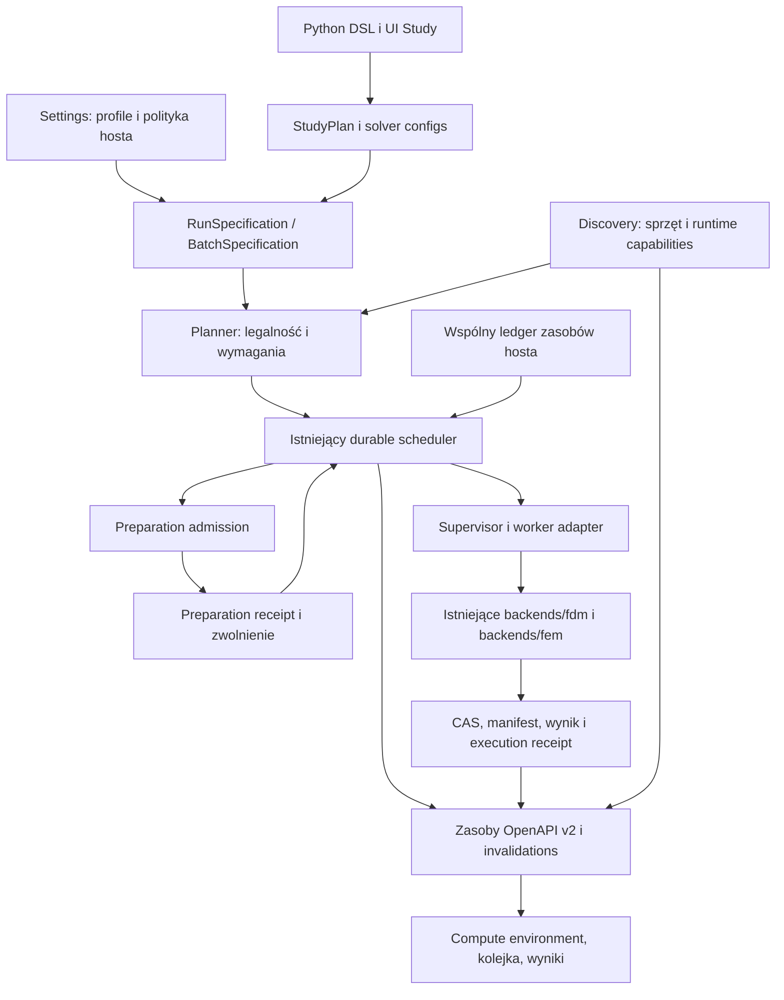

# Compute resources, execution profiles i równoległe sweeps

Status: **architektura przyjęta do implementacji**, 2026-10-04. Dokument nie deklaruje
wdrożenia wszystkich opisanych rozszerzeń. Stan prac podaje
[checkpoint](../plans/active/compute-execution-20261004/implementation-checkpoint.md).
Zachowanie bazowe sprzed implementacji jest opisane w
[audycie źródeł](../plans/active/compute-execution-20261004/source-audit.md).
Projekt UI: [Settings i Compute environment](../design/start-screen/docs/10-compute-settings-and-multi-device.md).
Kolejność wdrożenia i bramki: [plan](../plans/active/compute-execution-20261004/README.md).

## 1. Decyzja produktowa i zakres

Użytkownik ma móc uruchomić jeden solve na CPU/GPU, rozdzielić niezależne
przypadki sweepu między kilka kart i/lub grup rdzeni, a docelowo wykonywać
jeden obsługiwany solve przez wiele urządzeń lub węzłów. Każdy przypadek ma
mieć odtwarzalne wejście, zasoby, wynik i historię prób. Zamknięcie UI nie
może być poleceniem zatrzymania zaakceptowanej pracy.

Trzy oddzielne obiekty odpowiadają na trzy pytania:

1. **Compute environment:** co host wykrył, udostępnił, zarezerwował i faktycznie
   wykonuje? Odczyt nie zmienia ustawień problemu.
2. **Execution profile / Study execution:** czego żąda zadanie i jakiego
   sposobu wykonania wymaga? Ustawienia numeryczne pozostają w solver config.
3. **Allocation:** które rzeczywiste urządzenia i procesy otrzymała konkretna
   próba? Przydział jest decyzją backendu, potwierdzoną przez worker.

Nie utożsamiamy: GPU wykrytego, kompatybilnego runtime, przyjętego zadania,
przydzielonego GPU, wykonania na GPU i kwalifikacji naukowej. Są to osobne fakty.

Zakres obejmuje FDM CPU, FDM GPU, FEM CPU i FEM GPU. Nie zmienia równań fizyki,
integratorów, tolerancji, precyzji ani semantyki termów. Zmiany numeryki
wymagane przez rozproszony pojedynczy solve mają osobne bramki naukowe (§11).

## 2. Słownik i własność

| Pojęcie | Jednoznaczne znaczenie |
|---|---|
| Node / węzeł | Host wykonawczy o trwałym `node_id`; nie karta i nie proces MPI |
| Socket | Fizyczny procesor w płycie; nie utożsamiamy go automatycznie z NUMA node |
| Physical core | Rdzeń; jego rodzeństwo SMT jest jawnie widoczne w topologii |
| Logical CPU | Jednostka schedulera OS; 48 logical CPUs nie dowodzi 48 rdzeni |
| Worker thread | Wątek biblioteki/solvera; liczba wątków nie jest maską affinity |
| Rank | Jeden proces zadania rozproszonego; ma własne wątki i urządzenia |
| Case | Jeden niezmienny zestaw parametrów sweepu i zależności wejściowych |
| Task | Istniejący wykonawczy węzeł grafu study; case może wymagać kilku tasków |
| Attempt | Jedna próba taska z własnym claimem, epoch, lease i receiptami |
| Batch | Niezmienna kolekcja runów/cases oraz polityka ich współbieżności |
| Pool | Zbiór dozwolonych zasobów i polityk; nie nowa fizyczna pojemność |
| Allocation | Złożona rezerwacja CPU, RAM, GPU/VRAM i scratch dla attemptu |

### 2.1 Rozszerzenie obecnych właścicieli

- `fullmag-authoring` / `fullmag-ir`: semantyka study i żądania wykonania.
- `fullmag-plan` i aplikacyjny planner: legalność przed heurystyką placementu.
- `fullmag-application`: immutable submit, batch/case expansion, RunSpecification.
- `fullmag-runtime-control`: istniejący scheduler, supervisor, resource admission
  i nowy wspólny bilans zasobów; bez operatorów numerycznych.
- `fullmag-session`: trwałe katalogi, rezerwacje, fencing, journal i CAS.
- Obecna usługa runtime: jedyny właściciel lokalnego wykonania; API i UI są klientami.
- `backends/*`: wykonanie numeryki i faktyczne potwierdzenie urządzeń/precyzji.
- `fullmag-api` → generated v2 → facade → resource hooks → moduły UI:
  jedyna droga odczytu i mutacji. Nie powstaje drugi scheduler w przeglądarce.

Zachowujemy ADR 0035, 0037 i 0049: preparation oraz solve mają różne leases
i lifecycle, ale korzystają ze wspólnego fizycznego bilansu CPU/RAM/storage.
Nie wstawiamy prac symulacji do kolejki Fullmag_build_runner. Build runner
buduje i kwalifikuje pakiety; runtime scheduler wykonuje zaakceptowane zadania.

## 3. Warstwy konfiguracji i pierwszeństwo

| Warstwa | Przechowywanie | Zastosowanie zmiany |
|---|---|---|
| Polityka operatora węzła | Trwała konfiguracja usługi, revision, ACL | Nowe admission; zmniejszenie budżetu drenuje nadmiar, nie zabija zadań |
| Preferencje użytkownika | Istniejący SQLite workspace przez typowane API | Domyślne wartości nowych draftów |
| Execution profile | Wersjonowany katalog, immutable opublikowana wersja | Referencja `profile_id/version`, rozwinięta przy Submit |
| Study / step | Kanoniczny authoring, eksport Python, solver config | Dotyczy wskazanych kroków i następnego Submit |
| Parametry uruchomienia | Immutable RunSpecification / BatchSpecification | Dotyczą jednego przyjęcia pracy |
| Allocation | Ledger + attempt/lease | Faktyczny przydział podczas admission |
| Executed resources | Receipt workera i runtime | Rzeczywistość po starcie, nie edytowalna preferencja |

**Limity operatora, widoczność urządzeń i legalność solvera są ograniczeniami,
nie warstwą nadpisywaną przez preferencje.** Efektywne żądanie powstaje z:
domyślnych wartości produktu → przypiętego profilu → jawnych pól study/step
→ jawnych, dopuszczonych override'ów tego Submit. Pochodzenie każdego pola
jest zapisane. Profile nie śledzą ruchomej wersji `latest` po przyjęciu runu.

Jawny override CLI/Run dialog musi być widoczny w preview, kanonicznym eksporcie
i RunSpec. Nie może zmienić `gpu` na `cpu`, `double` na `single` lub parametrów
fizyki pod pretekstem oszczędzania zasobów. Konflikt profilu kroku z jawną
polityką runu daje `execution_intent_conflict`, z oboma źródłami wartości.
Nie redukujemy różniących się profili kroków do jednej pary backend/device.

Obecny szew między `RuntimeSelection`, referencją profilu kroku i
`RunSpecification.requested_execution` wymaga jednego resolvera. Rozwija on
profil do **każdego** kroku przed zaakceptowaniem snapshotu i sprawdza zgodność
wszystkich czterech pól: backend, device, precision, mode. Run-level request
jest ograniczeniem/udokumentowanym override'em; nie drugim wyborem urządzenia
wykonywanym po plannerze. `auto` na poziomie runu dopuszcza jawne per-step
żądania. Forced `gpu` wymaga GPU we wszystkich objętych nim solver tasks;
CPU preparation ma odrębny zakres i receipt. Jawne sprzeczne profile dają
błąd, a overlay override'u ma osobny digest i nie zmienia zapisanej bazy modelu.

Przejściowy kontrakt per-task w implementacji E1: `resolved_task_input.v3`
przenosi żądanie wyprowadzone z immutable ProblemIR danego kroku przez
`RequestedExecution::for_problem`. Ten sam resolver jest używany przy
doborze oferty, admission i kontroli wejścia workera. `resolved_task_input.v2`
pozostaje czytany jako kopia globalnego żądania RunSpec; nie reinterpretujemy
zapisanych komunikatów. Obie wersje zachowują fingerprint całego RunSpec.
Run-wide wejścia nadal używają v2; nowe materializowane kroki Study używają v3.
Globalne `auto` dopuszcza konkretne backend/device kroku; konkretne ograniczenie
runu może zawęzić Auto, ale nie zastępuje innej konkretnej wartości kroku.
Brak wyboru hosta w tym resolverze: Auto bez konkretnego ograniczenia pozostaje
Auto. Rozstrzygnięcie sprzętowe i jego receipt należą do admission/wykonania.

Do czasu wersjonowania podsumowania runu, precision/mode RunSpec v2 pozostają
jawnymi ograniczeniami wszystkich kroków. Mieszane precision/mode wymagają
dalszej migracji E1, nie specjalnej wartości w istniejącym polu. Budżet v2
pozostaje konserwatywnym minimum per task, z zerowym VRAM dla kroku CPU;
GPU wymaga dodatniego minimum VRAM. To nie jest jeszcze estymator zużycia
ani rezerwacja we wspólnym ledgerze hosta (E2).

`justfile` pozostaje klientem uruchomieniowym. Przekazuje wybór profilu i
jawne parametry do tego samego resolvera, którego używa UI/Submit. Nie jest
bazą preferencji użytkownika i UI nie edytuje repozytoryjnego `justfile`.
Zmienne builda, np. liczba kompilacji równoległych, nie trafiają do Study.

Dotychczasowe env/CLI mają adapter migracyjny:

1. Tylko jawna allow-lista zmiennych zasobowych jest odczytywana; bez dumpu env.
2. Adapter normalizuje wartość, jednostkę i źródło (`legacy_env`, `cli`, `script`).
3. Nieuzupełnione pole może otrzymać tę wartość; konflikt dwóch jawnych źródeł
   jest błędem z podglądem różnicy, bez cichego zwycięzcy.
4. `CUDA_VISIBLE_DEVICES` / ograniczenie kontenera jest granicą widoczności,
   nie żądaniem liczby niezależnych zadań ani sposobem nadpisania lease.
5. Worker dostaje oczyszczone środowisko wyliczone z allocation. Adaptery
   bibliotek nie odczytują sprzecznych odziedziczonych indeksów GPU/wątków.
6. Import legacy jest audytowany, odwracalny i nie przepisuje istniejących runów.

## 4. Model danych — proponowane rozszerzenia

Nazwy poniżej są kontraktem projektu, **nie istniejącym API do wywołania**.
Nowe wersje są wymagane dla typów z `deny_unknown_fields` i dla zmiany
semantyki lease/protokołu. Nie dopisujemy pól po cichu do formatu v1.

### 4.1 ComputeNodeSnapshot i dane obserwacyjne

| Pole/grupa | Kontrakt |
|---|---|
| `node_id`, `boot_id`, `inventory_revision` | Trwały host, bieżące uruchomienie, rewizja topologii |
| `runtime_owner_id`, `owner_epoch`, `capabilities_revision` | Tożsamość właściciela i publikacji; nie PID jako tożsamość |
| `cpu.topology` | Socket, NUMA, core, logical IDs, SMT siblings, grupy procesorów Windows, cpuset/quota ograniczająca host |
| `cpu.effective_capacity_millis` | Pojemność OS/cgroup; 1000 oznacza ekwiwalent jednego logical CPU, nie fizycznego rdzenia |
| `memory.total_bytes`, `available_bytes` | Osobne wartości całkowite i bieżący pomiar; brak pomiaru to null/status |
| `gpus[]` | Trwały pełny UUID, PCI ID, nazwa, lokalny ordinal, VRAM, zgodność runtime, topology/NUMA gdy dostępna |
| `gpus[].partition` | Całe GPU lub jawna partycja MIG z parent UUID; unknown nie jest pełną kartą |
| `sample` | Source, collected_at, freshness, error/reason; brak danych nie jest zerem |
| `enforcement` | Osobno `cpu_affinity`, CPU quota, memory cap, GPU visibility, storage quota: supported/advisory/unavailable |

Bieżące GPU oparte tylko na `index`/nazwie w telemetrii UI trzeba wzbogacić
o UUID i wiązanie z inventory. Przekierowanie API na innego hosta/epoch
unieważnia wszystkie cache zasobów i draft bindings do starej topologii.
Stan last-good pozostaje tylko przy zgodnej tożsamości źródła i jest oznaczony.

### 4.2 NodePolicy i ExecutionProfile

`NodePolicy` ma revision, allowed GPU UUIDs/CPU sets, rezerwę dla OS/UI,
budżet RAM/scratch, limit równoległych workerów, kolejność priorytetów,
tryb drain i dopuszczone wzorce parallelism. GPU obsługujące monitor można
wykluczyć lub jawnie dopuścić z rezerwą; obciążenie graficzne nie jest runem.

`ExecutionProfile` ma `profile_id`, immutable `version`, opis, target/pool,
domyślne żądania zasobów, dozwolone lane'y, kryteria placementu i politykę
awarii. Profil nie jest image name ani zestawem niekontrolowanych env.
Numerical solver configuration (tolerancje, integrator, demag strategy,
preconditioner) pozostaje istniejącym odrębnym obiektem study.

Domyślna polityka nowej instalacji: lokalny host, `strict`, zachowanie
autorskiej precyzji, wyłączność jednego Fullmag attemptu na całe GPU,
brak automatycznego retry, brak oversubscription, brak auto-preemption.
Budżety discovery muszą być rzeczywiste i jawnie zaakceptowane przez istniejącą
fabrykę konfiguracji. Nie zastępujemy ich stałą wartością RAM/VRAM. Rezerwy
i wybór SMT są parametrami operatora; profil „Interactive” proponuje zachowanie
rezerwy na UI, a preview pokazuje dokładne obliczone wartości przed zapisem.

### 4.3 RunResourceRequest i profil kroku

| Pole | Typ i walidacja | Semantyka |
|---|---|---|
| `target` | local/node/pool ID, dokładny scope | Miejsce wykonania, bez adresu/shell command w skrypcie |
| `cpu.threads` | `auto` lub dodatnie u32 | Żądany limit wątków obliczeniowych procesu; stare `threads(n)` zachowuje to znaczenie |
| `cpu.core_policy` | physical-first / logical, capability gated | Przydział rdzeni i SMT; nie przelicza 48 logical na 48 physical |
| `cpu.affinity` | auto/compact/spread/numa, opcjonalne ID | Rozmieszczenie; wymuszony wariant bez wsparcia jest odrzucany |
| `cpu.native_threads`, `blas_threads` | auto lub dodatnie u32, advanced | Tylko w budżecie procesu; nie mnożymy zagnieżdżonych pul |
| `ram.reservation_bytes` | dodatnie u64 lub estimate-ref | Minimum dla admission; osobny limit egzekwowania i peak actual |
| `gpu.selector` | any-compatible / allow-list UUID / required UUID | Zbiór dozwolony ≠ lista GPU jednego solve'a |
| `gpu.devices_per_task` | dodatnie u32 dla GPU, 0 CPU | Początkowo dokładnie 1; >1 wymaga osobnej capability distributed solve |
| `gpu.vram_per_device_bytes` | dodatnie u64 lub wektor per rank | Wymaganie na każdą kartę; VRAM różnych kart nie sumuje się domyślnie |
| `parallelism` | single-process / distributed | Intra-solve; nie to samo co batch concurrency i nie `mode=hybrid` |
| `distributed` | ranks, threads_per_rank, ranks_per_node, GPUs_per_rank | Tylko przy wspieranej parze workflow/runtime i wspólnym planie topologii |
| `scratch.reservation_bytes` | dodatnie u64 | Budżet per attempt w kanonicznym storage |
| `placement` | balanced / throughput / pinned | Heurystyka po sprawdzeniu legalności; bez automatycznego benchmarku |

`auto` pozostaje w request. Resolve zapisuje konkretną liczbę oraz przesłanki.
Explicit `threads=16` przy allocation=8 nie staje się po cichu 8: zadanie czeka
lub jest odrzucane jako niemożliwe, a użytkownik widzi proponowaną zmianę.
`minimum_resources.cpu_millis` pozostaje minimalnym budżetem admission, nie
aliasem liczby wątków ani dowodem wykorzystania wszystkich tych CPU.
Resolver wyprowadza dodatkowo wymagany zbiór CPU: w polityce bez
oversubscription każdy równocześnie aktywny wątek obliczeniowy potrzebuje
jednego przydzielonego logical CPU i 1000 jednostek pojemności. Physical-first
wybiera różne rdzenie, o ile request nie dopuszcza SMT; topology ledger
blokuje konflikt rodzeństwa przy wyłącznej rezerwacji całego rdzenia.
Efektywne minimum jest maksimum z jawnego `cpu_millis` i wyliczonego budżetu
wszystkich współbieżnych pul/ranków. CPU quota OS może ograniczyć ten zbiór
poniżej jego liczności; wtedy obowiązuje mniejsza pojemność, nie sam cpuset.
Mniejsza rzeczywista liczba aktywnych wątków, np. przy małej siatce, jest
poprawna i raportowana; nie uzasadnia cichego zmniejszenia przydziału requestu.

### 4.4 BatchSpecification

- `batch_id`, snapshot/digest, study/catalog digest, versioned execution profiles.
- Osie parametrów: nazwa, typ, jednostka kanoniczna, lista/przedział,
  `cartesian` albo `zip`; porządek i reguły walidacji są częścią hasha.
- `cases`: trwałe case IDs, canonical parameter tuples, seed derivation,
  zależności i odpowiednie child run IDs. Duże zbiory mają stronicowany,
  content-addressed manifest; UI nie przesyła milionowej tablicy w status.
- `max_parallel_cases`: auto lub dodatni limit; to górna granica, nie gwarancja.
- `resources_per_case`: domyślny profil/request; kroki nadal mają własne profile.
- `execution_strategy`: independent / continuation / dependency-graph.
- `failure_policy`: continue-independent / stop-admission; domyślnie brak
  auto-retry. Liczbowy limit retry, jeśli włączony, jest immutable.
- `lane_policy`: homogeneous domyślnie; mixed CPU/GPU dopiero po jawnym wyborze
  `auto` i kwalifikowanym zbiorze równoważnych lane'ów. Forced GPU wyklucza CPU.
- Polityka wyników: required ports, scalar summaries, field retention,
  indeks częściowych rezultatów, sposób agregacji i oczekiwany komplet.
- `output_storage`: przypięty snapshot istniejącej OutputStorage policy,
  rozwiązany przy Submit z authoring i workspace defaults zgodnie z ADR 0051.
  Child RunSpecs dziedziczą ten sam snapshot; późniejsza zmiana Settings nie
  zmienia ich writera ani katalogu docelowego. Istniejący właściciel
  OutputStorage rezerwuje osobne ścieżki case/attempt/scratch, wiążąc je
  trwale z BatchId/CaseId/AttemptId. Retry/odtworzenie ekspansji odczytuje
  tę samą rezerwację albo tworzy nową dla nowego attemptu; nigdy nie nadpisuje
  ukończonego wyniku ani nie losuje innej ścieżki dla tego samego intentu.

Batch nie jest drugim schedulerem. Materializuje child RunSpecifications
i zależności w istniejącym durable store. Przyjęcie batcha i zakres case IDs
są trwałe i idempotentne; recovery kontynuuje ekspansję bez duplikowania runów.
Przy bardzo dużej ekspansji ACK potwierdza batch i manifest, a nie gotowość
wszystkich tasków. Postęp ekspansji jest osobnym zasobem.

`max_parallel_cases` liczy cases rozpoczęte pierwszym admission (także
preparation), aż do terminalnego zakończenia case. Nie liczy liczby tasków
ani ranków. Case oczekujący po preparation nadal zajmuje slot case, ale nie
trzyma zwolnionego GPU/CPU lease. Każdy task otrzymuje osobny allocation;
równoległe taski jednego case podlegają łącznemu limitowi workerów i ledgerowi.
`resources_per_case` określa domyślne wymagania tasków oraz opcjonalny łączny
limit case; preview analizuje rzeczywistą szerokość DAG, nie zakłada zawsze
jednego taska na case. Pause new cases pozwala aktywnym cases wykonać pozostałe
kroki. Canceled/failed dependency propaguje stan blocked/skipped descendants
z przyczyną, zamiast pozostawić je bez końca w zwykłym waiting for resources.

Dla `homogeneous` resolver utrwala zgodny zestaw resolved lanes dla kroków
przed pierwszym admission batcha. Następne cases nie przechodzą samodzielnie
na CPU ani inną precyzję, gdy GPU jest zajęte. Requested Auto nadal pozostaje
w snapshot; trwały zapis batch resolution określa wspólny wybór. Mixed lanes
wymagają jawnej polityki i kwalifikowanej równoważności wyników.

### 4.5 Allocation i receipt

Allocation łączy: node/boot/owner epoch, pełny RunId/TaskId/AttemptId,
lease token, profile/policy/inventory revisions, logical CPU set i powiązane
rdzenie, per-rank threads, GPU UUIDs i lokalne ordinale, RAM/VRAM/scratch,
poziom enforcement i powód wyboru. Wektor zasobów zastępuje założenie,
że pojedynczy tekstowy `resource_id` dowodzi całego przydziału.

Receipt osobno zapisuje requested → resolved → allocated → executed:
załadowany runtime/build, rzeczywiste GPU UUID, CPU affinity i pulę wątków
zgłoszoną przez backend, precyzję, fallbacks, peak memory, stop reason,
manifest i exit receipt. Brak native thread telemetry jest `unreported`,
nie kopią requested value. Nie kopiujemy tajnych env ani lokalnych tokenów.

## 5. Jeden bilans zasobów i admission

### 5.1 Granica hosta

Obecne blokady/pule w store nie dowodzą wyłączności fizycznego GPU między
dwoma różnymi store'ami, natywnym procesem i kontenerem. Docelowo jeden
właściciel zasobów hosta, rozszerzający usługę runtime, utrzymuje ledger
CPU/RAM/GPU/scratch dla wszystkich podłączonych store'ów i obu faz.
Build runner może publikować do tego ledgeru własną rezerwację pojemności
na czas ciężkiego buildu, zachowując swoją kolejkę i storage locks. Brak
takiej integracji wymaga konserwatywnego admission/rozłącznej puli; UI nie
anuluje builda ani symulacji w celu zwolnienia zasobów.
Jeśli operator nie uruchamia takiego właściciela, pule muszą być jawnie
rozłączne; konfiguracja bez dowodu rozłączności nie uruchamia multi-worker.

Rezerwacja węzła i claim taska są dwoma trwałymi zapisami. Stosujemy
fenced prepare/commit, nie fikcyjną atomową transakcję między bazami:

1. Właściciel zapisuje tentative allocation dla dokładnego admission ID/epoch.
2. Store atomowo sprawdza snapshot, gotowość, claim i zapisuje allocation-ref.
3. Właściciel potwierdza committed; worker rusza dopiero po zgodnych zapisach.
4. Crash pomiędzy zapisami uruchamia reconciliation po admission ID. Nie
   powstaje druga alokacja, a lease nie jest zwalniany przez sam timeout.
5. Release wymaga worker exit i dopuszczonego terminalnego receiptu;
   osierocony proces/nieznany wynik pozostawia zasób quarantined/unknown.

W jednym store i procesie można zoptymalizować tę ścieżkę transakcyjnie,
ale identyczna semantyka recovery pozostaje kontraktem.

### 5.2 Reguły budżetów

- Suma aktywnych, tentative i quarantined rezerwacji CPU/RAM/scratch nie
  przekracza puli po rezerwie operatora; przygotowanie mesh liczy się do sumy.
  Gdy operator obniża politykę poniżej istniejących rezerwacji, powstaje
  jawny stan over-budget/draining: nowe admission jest zablokowane do zejścia
  poniżej limitu. Stare leases zachowują pierwotny budżet; nie udajemy,
  że zmiana konfiguracji natychmiast zwolniła fizyczne zasoby.
- Dla GPU wyłącznego aktywne allocation sets nie przecinają się po pełnym
  UUID. Całe GPU i jego MIG children także mają relację konfliktu.
- CPU jobs i GPU helper threads mają rozłączne CPU sets przy exclusive
  placement. SMT siblings nie tworzą dwóch niezależnych physical cores.
- Budżet ranków obejmuje sumę/równoczesne pule, a nie samo największe
  `OMP_NUM_THREADS`. Zagnieżdżone BLAS/OpenMP/Rayon są ograniczane przez adapter.
- Rezerwacje są odrębne od bieżącego użycia. Nie odejmujemy jednocześnie
  całej rezerwacji i tego samego zmierzonego RSS od identycznej pojemności.
- Oprócz bilansu jest świeży preflight wolnej RAM/VRAM/scratch. Konserwatywnie
  uwzględnia niewykorzystany jeszcze zapas z istniejących rezerwacji i obce
  procesy. Nieznana atrybucja lub pomiar blokuje automatyczne zwiększenie puli.
- Podane minimum pamięci ma źródło: operator, model estimator lub kalibracja
  zgodnego workloadu. Estymata zawiera margines i wersję; nie jest pomiarem.
- Rezerwacja RAM nie jest twardym limitem OS. Worker publikuje poziom
  enforcement; wymagany hard limit bez wsparcia daje odmowę przed startem.

### 5.3 Algorytm wyboru

1. Wybierz istniejącą kolejnością priority/fairness gotowe taski i case DAG.
2. Zastosuj immutable requested backend/device/precision/mode, workflow
   legality, profile version i required output/input codecs.
3. Sprawdź finalized preparation oraz dependency manifests; nie trzymaj GPU
   podczas długiego oczekiwania na mesh lub poprzedni case.
4. Zbuduj kandydatów z dozwolonej topologii i zgodnych runtime manifests.
5. Usuń kandydatów niespełniających RAM/VRAM/storage/threads/affinity/limits.
6. W ramach pozostałych wybierz zgodnie z polityką: lokalność danych i NUMA,
   zachowanie dużych kart dla dużych zadań, fairness, opcjonalnie kwalifikowany
   koszt historyczny. Brak pomiarów oznacza brak obietnicy przyspieszenia.
7. Atomowo/fenced zarezerwuj cały zestaw albo nic. Gang z 2 GPU nie może
   trzymać jednej karty, czekając bez końca na drugą.
8. Zbuduj per-process environment, uruchom supervisor i zweryfikuj receipt
   rzeczywistej tożsamości urządzeń przed przyjęciem wyników.

Przyczyny są rozłączne: `unsupported_parallelism`, `incompatible_runtime`,
`resource_request_exceeds_capacity` (nigdy się nie zmieści),
`waiting_for_resources` (chwilowo zajęte), `inventory_stale`,
`awaiting_preparation`, `awaiting_dependency`, `policy_conflict`,
`allocation_outcome_unknown`. UI pokazuje przyczynę i działanie naprawcze.
Zmiana profilu nie naprawia automatycznie już zaakceptowanego requestu.

Fairness zachowuje istniejący trwały kursor między runami, rozszerzony o
grupę batch. Jeden sweep 10000 przypadków nie monopolizuje całej kolejki.
Przy jednorodnych, niezależnych cases górna granica concurrency to minimum:
limit użytkownika i operatora, liczba gotowych cases, liczba dostępnych GPU
podzielona przez GPU/case oraz całkowitoliczbowe ilorazy dostępnego CPU,
RAM i scratch przez zasób/case. Warunek VRAM obowiązuje osobno na każdej
karcie; nie sumujemy pamięci niezależnych GPU. Ten wzór jest tylko granicą:
NUMA, heterogeniczne karty, gang i zależności wymagają rzeczywistego placementu.
UI pokazuje ten sam wynik preview co scheduler oraz zasób ograniczający.
Obowiązuje także trwały service-wide limit współbieżnych workerów istniejącej
usługi, osobno dla preparation/solve, niezależny od `max_parallel_cases`.
Przy jednym workerze na case service cap=1 serializuje również batch z
limitem 4. Zmiana cap wymaga wersjonowanej konfiguracji runtime ownera,
spójnej z NodePolicy i ledgerem; nie jest efektem otwarcia UI ani chwilowego
pomiaru wolnego RAM. Preview uwzględnia oba limity i aktualne obciążenie.
Priorytet nie przerywa aktywnych zadań. Backfill nie głodzi dużego gang job:
po ustalonym przez politykę wieku tworzy trwałą rezerwację przyszłego okna.
Drain zatrzymuje nowe admission, Pause batch zatrzymuje nowe cases, a Stop
jest osobnym protokołem zakończenia i publikacji receiptów.

## 6. Przydział GPU i CPU w procesie

Wyłączny worker GPU otrzymuje pełny UUID w masce i lokalny ordinal 0.
To zachowuje istniejący wzorzec `spawn_worker`; ordinal 0 w tym procesie
może oznaczać fizyczne GPU 3 hosta. Maski ustawiamy przed inicjalizacją CUDA.
Nie ustawiamy globalnego środowiska procesu API dla wielu jednoczesnych runów.
Kontener dostaje zgodny zestaw device UUID; maska CUDA nie daje prawa dostępu
do GPU, którego kontener lub zewnętrzny scheduler nie przyznał.

Źródło zasady enumeracji: [NVIDIA CUDA Environment Variables](https://docs.nvidia.com/cuda/cuda-programming-guide/05-appendices/environment-variables.html).
Pełny UUID jest identyfikatorem trwałym w Fullmag; skróty i numeracja z UI
służą prezentacji. Kolejność kart po reboot nie może zmienić przypięcia.
Legacy `cuda:N` rozwiązuje się w widocznej enumeracji procesu importującego,
z uwzględnieniem odziedziczonej maski. Import utrwala ordinal, maskę i UUID.
Brak możliwości ustalenia tego powiązania wymaga jawnego wyboru; N nie może
zostać cicho zinterpretowane jako indeks fizycznej karty innego hosta.

Native Windows i kontenerowy FEM mają oddzielne adaptery tego samego allocation.
Windows uwzględnia processor groups oraz możliwości affinity/limitów procesu;
Linux cpuset/cgroup i quota, również gdy kontener widzi więcej CPU niż dostał.
Adapter używa runtime-specific thread pools. Nie zakładamy, że zmienna
`RAYON_NUM_THREADS` dowodzi liczby wątków OpenMP albo zmieni raz utworzoną pulę.

Po starcie limitów wątków/urządzeń nie edytujemy w miejscu. Zmiana tworzy nową
próbę/run z jawnym restartem od wspieranego checkpointu. Scheduler nie
przenosi aktywnego CUDA contextu na inną kartę. Migracja po checkpointach
wymaga zgodności codec/mesh/runtime/precision i jawnej proweniencji.

## 7. Sweeps, zależności i wyniki

### 7.1 Dwa typy równoległości

**Niezależne cases:** każdy ma własny snapshot parametrów, seed, katalog scratch
i wynik. Można wykonać je na różnych GPU lub grupach CPU; awaria jednego
nie unieważnia ukończonych niezależnych przypadków.

**Continuation / zależny sweep:** `case[i+1]` wymaga zaakceptowanego outputu
`case[i]`. Histereza zachowuje warm-start i kolejność gałęzi zgodnie z
[notą 0930](../physics/0930-hysteresis-sweep-semantics.md). Równoleglić można
niezależne zewnętrzne łańcuchy, np. kąty lub próbki, jeśli ich initial states
są niezależne; nie dowolne kolejne punkty pola. Przeniesienie stanu między
FDM/FEM lub layoutami wymaga istniejącego jawnego transferu i walidacji.

Bifurkacje/adaptive sweeps dopisują deterministyczną, wersjonowaną decyzję
ekspansji z rodzicami i seed; nigdy nie edytują wcześniej przyjętego manifestu.
Warm caches mesh/operatorów są reuse'owane wyłącznie po kluczu obejmującym
geometrię, materiał, dyskretyzację, fizykę, solver policy, precision i runtime.
Między procesami współdzielimy immutable artifacts; mutable native Context
i CUDA allocations należą do pojedynczego workera.

### 7.2 Idempotencja, awarie, cancel i retry

- Submit używa istniejącego `client_intent_id`; utrata ACK wymaga lookup,
  nie ponownego wysłania z nową tożsamością. Batch ma ten sam kontrakt.
- Case IDs są stabilne wobec kolejności zakończenia. Seed wynika z master
  seed, canonical case ID i nazwanej polityki; nie z indeksu GPU ani PID.
- Retry zachowuje run/task/case i tworzy nowy attempt, dopiero po terminalnym
  dowodzie poprzedniej próby i zgodnym zwolnieniu lease.
- OOM nie wywołuje automatycznie zmiany precision, siatki lub GPU→CPU.
  Można wybrać większą zgodną kartę w ramach requestu; zwiększenie żądanych
  limitów wymaga nowego jawnego requestu. Nauka retry z mniejszym timestep
  jest osobnym kontraktem solvera, nie polityką schedulera.
- Cancel batch ma dwa jawne warianty: zatrzymaj przyjmowanie i dokończ
  aktywne albo zażądaj Stop aktywnych. Oba zachowują wyniki i historię.
- Lost heartbeat / niedostępny node oznacza unknown, nie success ani wolny
  zasób. Stale epoch nie publikuje outputów. Zdalny reconnect uzgadnia
  ten sam attempt przed decyzją o retry.

### 7.3 Wyniki i obserwacja

Każdy case ma manifest outputów i lineage zgodne z ADR 0035. Batch result
jest indeksem tych rezultatów: kompletność, brakujące/failed/canceled cases,
parametry, resolved/executed lanes, jednostki, scalar summaries i referencje
do pól. Nie skleja niezgodnych mesh/precision/parametrów w jedną pozornie
jednorodną tablicę. Agregacje mają określone kryteria równoważności.

Wyniki korzystają z istniejącej [OutputStorage](project-output-storage.md)
i [ADR 0051](../adr/0051-project-output-storage.md): jednej requested policy,
rzeczywistego writera i resolved paths. Defaults pozostają w SQLite workspace
za `/v2/platform/output-storage`. Batch rezerwuje odrębne miejsca cases/attempts
bez kolizji; reservation scratch dotyczy konkretnego attemptu. Nie tworzymy
drugiego rootu storage ani nie zmieniamy własności CAS/receipts. Publikacja
wyników wymagana przez OutputStorage kończy się przed durable completed;
nieudana publikacja pozostaje jawnym stanem, bez usuwania poprawnych danych.

UI obserwuje wybrany run/case przez istniejące identyfikowane źródło danych,
nie przepina wszystkich workerów na alias `current`. W tle mogą pracować
wiele runów, a jeden viewport pokazuje wybrane observation source.
Przełączenie źródła ma własne generation/epoch i czyści niezgodne cache.
Pola pozostają na binary data plane; queue/status zawierają małe podsumowania.

## 8. OpenAPI, mutacje i cache

Tabela opisuje **proponowane** zasoby, poza wierszami oznaczonymi „istnieje”.
Kanoniczną trasą submit pozostaje `persistence/projects`, a nie nowy endpoint
wykonujący solver bez durable RunSpec.

| Zasób / operacja | Odpowiedzialność |
|---|---|
| `GET /v2/platform/runtime-service` — istnieje | Read-only stan ownera; nie lista sprzętu ani uprawnienie do mutation |
| `GET /v2/platform/capabilities` — istnieje | Rejestr runtime; rozszerzenie o parallelism/workload qualification |
| `GET /v2/platform/compute/nodes` i `/{node_id}` | Inventory/topologia, stronicowana lista; observed/revision/epoch |
| `GET /v2/platform/compute/nodes/{node_id}/telemetry` | Bieżące bounded samples, per-resource freshness |
| `GET/PUT /v2/platform/compute/nodes/{node_id}/policy` | Operator policy z If-Match i uprawnieniem; validation preview przed apply |
| `GET/POST /v2/platform/compute/profiles` | Katalog; POST tworzy nową immutable wersję, nie zmienia użytej |
| `GET /v2/platform/compute/queue` | Stronicowany read-model istniejących schedulerów, bez drugiej kolejki |
| `POST /v2/persistence/projects/{project_id}/execution-previews` | Plan legalności i szacowany placement bez lease/spawnu |
| `POST /v2/persistence/projects/{project_id}/runs` — istnieje | Rozszerzony typowany request przyjęcia z profile/resource snapshot |
| `GET /v2/persistence/projects/{project_id}/runs/{run_id}` — istnieje | Run/Tasks; rozszerzone references do allocation i executed receipt |
| `POST/GET .../projects/{project_id}/batches` | Immutable przyjęcie i katalog kolekcji, idempotencja oraz pagination |
| `GET .../batches/{batch_id}/cases` | Parametry, zależności, child runs, status i output refs |
| `POST .../batches/{batch_id}/commands` | Pause admission/resume/cancel/retry; ACK + command lifecycle |
| `GET /v2/platform/compute/allocations/{allocation_id}` | Read-only szczegóły przydziału; bez tokenów operacyjnych |
| `GET /v2/platform/compute/events/ws` | Proponowane platform-scoped invalidations; potrzebne bez aktywnej sesji |

Preview zawiera `preview_id`, input digest, snapshot/profile/policy/capability
revisions, predicted placement, estimate confidence i reasons. Jest orientacyjne:
Submit przypina wejście, ponownie waliduje wersje, a allocation powstaje dopiero
przy admission. Zajęcie karty między Preview a Submit daje queued, nie zmianę
żądania. Zmiana modelu/profilu wymaga nowego preview lub jawnego 409/stale.

Rewizje inventory, policy, queue i telemetry są oddzielne. Cache key obejmuje
API instance, node/owner epoch i odpowiedni scope project/run/batch. WebSocket
przesyła tylko rewizje/invalidations/lifecycle; reconnect odczytuje HTTP
snapshot i nie wnioskuje o wolnym zasobie z ciszy. Ukryty widok zatrzymuje
odpytywanie telemetryczne; stan kolejki nie zależy od otwarcia strony Home.

Zmiana API oznacza: backend schemas/OpenAPI → generated v2 types/transport →
facade → resource hooks → adapters → wspólne UI. Obecne session diagnostics
pozostają adapterem zgodności do platform host telemetry, z jednym właścicielem
próbkowania i terminem usunięcia podwójnej ścieżki po migracji konsumentów.

Mutacje Settings korzystają z typowanej walidacji i optimistic concurrency.
Nie wysyłają dowolnego polecenia shell ani ścieżki do urządzenia. Lokalny
instance pin nie jest autoryzacją; polityki operatora wymagają kontrolowanego
kanału usługi. Zdalny target wymaga uwierzytelnienia, ACL projektu/puli oraz
TLS, a sekrety pozostają w magazynie poświadczeń poza eksportem problemu.

## 9. Python, IR, CLI i odtwarzalność

Zachowujemy obecne `StudyBuilder.engine/device/mode/threads` i typowaną
`RuntimeSelection`. `StudyExecutionProfileReference` staje się wspólnym
wiązaniem StudyPlan z rozwiniętą wersją profilu; nie wprowadzamy osobnego
zestawu znaczeń dla UI, Python i CLI.

| Znaczenie | Obecny owner | Docelowe obniżenie |
|---|---|---|
| backend/device/mode/precision | Python RuntimeSelection + Study authoring | Kanoniczny request w ProblemIR/study → planner → per-task requested execution |
| CPU threads | `study.threads`, `requested_cpu_threads` | Żądanie runtime; adapter do `cpu.threads`, zachowany origin i auto |
| GPU index/count | RuntimeSelection | Legacy single-solve selector; UUID resolve z inventory revision; nie liczba przypadków |
| Profile reference | StudyPlan step.execution_profile | Immutable profile snapshot w RunSpec |
| RAM/VRAM/storage minimum | RequestedResourceBudget | Zachowane minimum + allocation/enforcement, bez interpretacji jako pomiar |
| Case parameters i dependencies | RunSpecification + StudyPlan | Immutable batch manifest → istniejące runy/task DAG |
| Liczba równoległych cases | Nowy BatchSpecification | Scheduler limit; nie parametr kernela ani fizycznego termu |
| GPU UUID/cpuset/host | Nowy allocation binding | Operacyjne receipt/provenance; bez hostowych ścieżek w fizycznym IR |

Rozszerzenia publicznego Python API powinny przyjąć typowane profile/resources
i batch builder, a nie dziesiątki env. Konkretne sygnatury są bramką etapu E1:
muszą mieć walidatory, round-trip i mapę do kanonicznych typów przed eksportem
z UI. Ten dokument nie podaje nieistniejącego skryptu jako wykonalnego przykładu.

Eksport ma dwa jawne warianty: **portable study + wymagania** (domyślny,
bez numerów kart/hostowych ścieżek) oraz **reproduction manifest** wskazujący
rozwiązane profile, UUID/node, runtime/build, seeds i artifacts. Dokładny
replay na innym hoście zgłasza brak przypiętego zasobu, a nie używa podobnej
nazwy GPU. Request `auto` i jego resolution history pozostają odrębne.

## 10. Wiele hostów i scheduler zewnętrzny

Ten sam model node/pool/allocation obsługuje lokalny komputer, kolejny
zarządzany węzeł i adapter klastra. Remote worker wykonuje tylko przypięty
runtime oraz immutable inputy; API użytkownika nie uruchamia arbitralnego
SSH/shell z formularza. Transfer CAS weryfikuje digest, ma resume i osobny
status staging. Ścieżka Windows klienta nie staje się ścieżką scratch Linuksa.

Adapter np. Slurm/HPC otrzymuje jeden konkretny przydział zewnętrzny i
publikuje ograniczone nim zasoby. Fullmag nie rezerwuje całego hosta obok
tego przydziału. Provider job ID wiąże się z admission/attempt; utrata ACK
powoduje lookup tego samego joba. Requeue zewnętrzny jest nowym uzgodnionym
attemptem, nie równoległą drugą próbą. Polityka CPU/GPU/RAM jest przecięciem
limitu klastra, operatora i requestu. Pierwsza integracja wielowęzłowa powinna
przenosić niezależne cases; pojedynczy distributed solve ma dodatkową §11.

## 11. Jeden solve na wielu GPU/CPU — pełny kontrakt docelowy

To odrębny wzorzec od sweepu. Samo ustawienie `gpu_count=2`, dwóch UUID lub
MPI-capable zależności nie oznacza, że solver potrafi podzielić problem.

| Realizacja | Kontrakt wymagany do otwarcia opcji |
|---|---|
| FDM CPU | Jedna obecna CPU route z kontrolą wątków; distributed-memory wymaga osobnego podziału siatki, halo i globalnych redukcji |
| FDM GPU | Partycjonowanie siatki, halo termów lokalnych/gradientowych, rozproszona demag/FFT, globalne kryteria kroku i energii, collective checkpoints |
| FEM CPU | Rozproszony mesh/DoF, ownership/ghosting/constraints, kompatybilne MPI/hypre solvery i wszystkie użyte strategie demag |
| FEM GPU | Wymagania FEM CPU oraz per-rank CUDA device, rezydencja operatorów, CUDA-aware transfers/collectives i ścisły execution receipt |

Planner generuje `PartitionPlan` o własnym digest: global entity IDs,
podział ranków, granice, rank↔node↔GPU binding, topologia komunikacji i
per-rank memory estimates. Nie tworzy osobnego modelu fizycznego dla partycji.
Gang admission obejmuje komplet ranków/CPU/GPU/RAM; ready wymaga wszystkich
uczestników i potwierdzenia zgodnego planu. Awaria ranka zatrzymuje cały
attempt lub uruchamia jawnie wspierany collective recovery, nigdy częściowy sukces.

Checkpoint obejmuje globalny stan i zgodny krok czasu wszystkich partycji;
nie można kontynuować z mieszanki różnych iteracji. Completion manifest
wymaga wszystkich shardów oraz ich indeksu. Globalne energie/obserwable
zachowują jednostki i definicje; kolejność redukcji, błędy zaokrągleń i
deterministyczność są jawnie kwalifikowane dla konfiguracji ranków/precyzji.

Capability jest per workflow/interaction set/demag strategy/precision,
nie ogólnym `supports_multi_gpu=true`. Dopóki jej bramki są otwarte,
UI pokazuje niedostępny „One solve across multiple devices” z powodem.
Plan wdrożenia obejmuje tę ścieżkę, ale nie odblokowuje jej przez zmianę UI.
Nowe noty naukowe rozszerzają istniejących właścicieli interakcji; wymagane
są zbieżność, energia, parity z jednym urządzeniem i właściwe benchmarki.

## 12. Scenariusze odbioru projektu

Liczby są przykładami planistycznymi, nie pomiarem obecnego komputera.

| Scenariusz | Oczekiwany rozkład i warunek |
|---|---|
| 4 GPU, 32 dozwolone rdzenie, 24 niezależne cases; 1 GPU + 4 CPU/case | Do 4 cases równolegle i 16 CPU; kolejne czekają. RAM/VRAM może obniżyć limit |
| 2 sockety po 24 rdzenie; operator udostępnia 40, CPU/case=10 | Do 4 cases, jawne 10-rdzeniowe zestawy; NUMA locality uwzględniona, nie 4×48 |
| 4 GPU, request pojedynczego solve'a wymaga 2 GPU, concurrency=2 | Dwa gang allocations po 2 GPU, wyłącznie po kwalifikacji distributed lane |
| GPU 12/24/48 GiB, case wymaga 20 GiB + margines | Karta 12 GiB nie jest kandydatem; 24/48 według fit i innych rezerwacji |
| Histereza 100 punktów, 4 niezależne kąty | 4 łańcuchy równoległe, w każdym 100 zależnych punktów w kolejności |
| Mixed CPU/GPU pool, forced GPU | CPU nie staje się fallbackiem; czeka na GPU albo jawna odmowa |
| Dwa store'y i kontener żądają tego samego UUID | Jeden host ledger przyznaje najwyżej jeden wyłączny allocation |
| Zmiana polityki podczas solve'a | Aktywny attempt zachowuje przydział; nowe admission respektuje rewizję/drain |
| Brak RAM telemetry lub nieznany UUID po reboot | unknown/blocked, bez sztucznego zera i bez przypięcia po starej pozycji listy |
| API timeout po Submit / crash przy release | Lookup istniejącego intentu; uzgodnienie claim/lease/exit, bez duplicate spawn |

Macierz implementacji i dowodów jest w planie. Powstanie dokumentacji zamyka
projekt architektury, nie implementację ani kwalifikację wielu urządzeń.

## 13. Wersjonowanie pierwszego kontraktu authoring — E1

Typed request używa `problem_meta.runtime_metadata.compute_resources` oraz
`schema_version="compute_resources.v1"`. Dotychczasowe dokumenty bez tego klucza
zachowują obecną ścieżkę. Mapa runtime_metadata jest istniejącym rozszerzalnym
kontenerem IR; nowy obiekt ma własną wersję i odrzuca nieznane pola.

W wire format tokeny używają snake_case: `physical_first`, `any_compatible`,
`allow_list`, `single_process`. Target ma `kind` i tylko dla node/pool `id`;
parallelism ma `kind`, a distributed dodatkowo ranks/threads_per_rank/
ranks_per_node/gpus_per_rank. `cpu.core_policy` jest opcjonalne: brak oznacza
dziedziczenie polityki, nie potwierdzenie affinity. Jawne Auto to string `auto`,
liczba wątków to dodatni u32; bool/ułamek/overflow są błędem. Bajty pamięci
to dodatni u64, NUMA ID nieujemny u32. Brak opcjonalnej rezerwacji nie jest zerem.

Właściciel IR: `crates/fullmag-ir/src/compute_resources.rs` —
`ComputeResourcesIR::validate`, `validate_legacy_selection`.
Właściciel runtime support pozostaje planner/adapter; przejściowy
`validate_current_runtime_support` odrzuca niewdrożone wymagania zamiast je
ignorować. Nie jest to dowód ich wykonania ani docelowe wyłączenie E2–E7.
Runner `requested_cpu_threads` / `configured_cpu_threads` czyta nowy request;
explicit Auto zachowuje Auto i nie dziedziczy numeric env jako jawnego intentu.

Profil, pochodzenie pól, przydział i actual native threads pozostają osobnymi
kontraktami. Pole request nie jest kopiowane do wykonanej telemetrii.
FDM CPU, FDM GPU, FEM CPU i FEM GPU podlegają tej samej walidacji danych;
wykonanie nowej polityki i parity każdej lane pozostają **NOT VERIFIED**,
dopóki nie istnieją odpowiednie dowody z etapów E2/E3/E7.

### 13.1 Przypięty profil i sparse overrides

Kolejny fragment E1 dodaje `execution_profile.v1` i `execution_request.v1`.
Typy i shape validation należą do `fullmag-ir::execution_profile`, a czysta
materializacja i weryfikacja jej odtworzenia do `fullmag-application`.
Profil zawiera immutable `profile_id/version`, opis i częściowe `defaults`.
Digest jest SHA-256 kanonicznego JSON UTF-8 z posortowanymi kluczami.
Wersja `latest` nie może być przypięta do zadania.
`execution_request.v1` przypina również semantykę domyślnych wartości i
pierwszeństwa resolvera. Zmiana tych reguł wymaga nowej wersji i zachowania
odtwarzania v1 dla wcześniej przyjętych runów; nie wolno reinterpretować
starego snapshotu według nowych preferencji aplikacji.

Patch ma odrębny typ od pełnego requestu. `FieldPatch::Absent` pomija pole,
`Value("auto")` zapisuje jawne Auto, a `Value(None)` resetuje pole nullable.
Nie wolno zamieniać tych trzech stanów w jeden opcjonalny odczyt.
Python eksportuje analogiczne `ExecutionProfile`, `ExecutionOverrides`,
`ComputeResourceOverrides`, `CpuResourceOverrides`, `MemoryResourceOverrides`.
Pominięte argumenty znikają z wire format; `None` pozostaje resetem tylko dla
pól nullable. Są to konstruktory danych dla resolvera, nie przełącznik
aktywnego solvera. Walidacja ograniczeń powiązanych pól odbywa się po
materializacji; samo utworzenie częściowego patcha nie dowodzi wykonalności.

`study_problem_catalog.v2` przechowuje pełną materializację dla każdego
włączonego kroku: przypiętą treść profilu i jej hash, warstwy wejść, efektywne
żądanie oraz origin. Katalog sprawdza zgodność id/version z referencją Study
oraz backend/device/precision/mode/resources z immutable ProblemIR.
Application ponownie wylicza materializację przed publikacją runu i przy
jego odczycie. Podmiana requestu, originów lub hash profilu musi być błędem.
RunSpec v2 już przypina hash całego katalogu; nie wymaga nowego pola z
drugim, niezależnym wyborem profilu.

Katalogi v1 pozostają odczytywalne i serializują się bez dopisywania nowych
pól. `from_entries` zachowuje v1 dla starych wpisów; użycie snapshotów
przechodzi na v2 i wymaga ich dla całego katalogu. Nie dopisujemy originów
historycznym runom. Binding tworzy nowy ProblemIR, nie mutuje oryginału.

Ten fragment nie zamyka E1: allowed lanes i failure policy, powiązanie
profilu Settings ze Study/DSL/CLI/env oraz preview pozostają do połączenia
z tym samym resolverem. Provider opisany w 13.2 przechowuje wersje; nie
jest dowodem wykonania ich zasobów.

### 13.2 Trwały katalog profili i publikacja z Settings

Właścicielem `execution_profile_catalog.v1` jest skonfigurowany accepted-run
`SessionStore`. Jedyny plik `compute/EXECUTION_PROFILES.json` jest zapisywany
atomowo pod istniejącą blokadą writera. Nie należy do odbudowywalnego indeksu
ostatnich projektów ani localStorage. Odczyt nie tworzy katalogów. Brak
konfiguracji magazynu zwraca 503; nieprawidłowy istniejący katalog pozostaje
błędem i nie jest zastępowany pustym.

`GET /v2/platform/compute/profiles` zwraca rewizję, stronicowane entries,
`total`, `offset` i `next_offset`. Limit domyślny wynosi 50, maksymalny 100.
Kolejne strony przypinają `revision`; jej zmiana daje 409. Filtry
`profile_id`, `version` (tylko wraz z ID) i `client_intent_id` umożliwiają
lookup konkretnej wersji lub uzgodnienie publikacji. ETag obejmuje treść
strony i instancję API.

POST przyjmuje `expected_revision`, `client_intent_id` oraz typowany profil.
Application materializuje i sprawdza semantykę defaults przed zapisem.
Publikacja dopisuje wersję z kanonicznym SHA-256, datą UTC i kolejną rewizją;
odpowiedź 201 oznacza nowy zapis. Ten sam intent i ta sama treść zwracają 200
oraz oryginalny wpis, nawet przy nieaktualnej expected_revision. Ponowne
użycie intentu z inną treścią lub pary ID/version z innym intentem daje 409.
Rewizja chroni dwa równoczesne szkice; użyta wersja nigdy nie jest nadpisywana.
Granice katalogu: 1024 wpisy, 4 MiB pliku, 32 KiB pojedynczego profilu.

Settings rozdziela szkic od zapisu. Apply tworzy stałą wersję; Cancel porzuca
nieopublikowany szkic. Refresh aktualizuje katalog bez nadpisania szkicu.
Nieznany wynik POST wymaga lookup po tym samym intent ID; retry zachowuje
identyczną treść i tożsamość. Inherit pomija pole, Auto pozostaje jawne.
Edytor podstawowych pól zachowuje pozostałe sparse resources skopiowanego
profilu. Zapis nie przypisuje profilu do Study ani nie zmienia aktywnych runów.
Uprawnienia operatora NodePolicy i pełna integracja authoring pozostają
osobnymi bramkami E1/E4. Bieżące dowody implementacji są w checkpointcie planu.

### 13.3 Powiązanie opublikowanej wersji z nowym Submit

Nowy HTTP Submit z materializacją profilu w katalogu Study odczytuje katalog
profili tego samego accepted-run store. Application rozwiązuje dokładne
`profile_id/version` przez provider i odtwarza zapisane jawne warstwy requestu.
Cały otrzymany snapshot — profil, SHA-256, requested i origins — musi mieć tę
samą kanoniczną treść co żądanie klienta. Brak opublikowanej wersji daje 409
`execution_profile_reference_conflict`; inna treść pod tym samym ID/version
lub niezgodne pochodzenie daje 409 `execution_profile_snapshot_conflict`.
Nie ma fallbacku do domyślnego profilu ani ruchomej wersji.

Przenośny profil zaimportowany ze skryptu trzeba opublikować w docelowym store
przed nowym HTTP Submit. Publikacja nie uruchamia zadania. Stare katalogi v1
bez materializacji zachowują trasę zgodności; nie dopisujemy im pochodzenia.
Powtórzenie zaakceptowanego intentu nie korzysta ponownie z bieżącego katalogu
preferencji: obowiązują zapisane immutable wejścia i fingerprint runu.
Nie zmienia to admission ani nie stanowi dowodu użycia zasobów przez worker.

Python przyjmuje opublikowaną kanoniczną odpowiedź przez
`ExecutionProfile.from_ir(profile_json)`. Typed import zachowuje omission,
jawne Auto i nullable null; `to_ir()` oraz `canonical_sha256()` odtwarzają
treść i tożsamość profilu. Pełny obiekt GPU z opublikowanej odpowiedzi wymaga
selector, UUID list i devices_per_task; VRAM pozostaje opcjonalne. Puste
sparse obiekty normalizują się do pominięcia, zgodnie z Rust. Import odrzuca
obcy schema, nieznane pola, błędne typy i ruchomą wersję `latest`. Nie czyta
hosta, nie rozwiązuje dziedziczenia i nie przypisuje profilu do Study.

### 13.4 Jedna materializacja całego Study

`fullmag-application::materialize_study_execution` przyjmuje dokładny
StudyPlan, authored ProblemIR i jawne warstwy każdego włączonego kroku oraz
provider immutable profili. Nie wnioskuje warstw ze środowiska. Odrzuca
nieznane, wyłączone, brakujące i powielone wejścia. Wersja współdzielona przez
kilka kroków jest odczytywana raz; każdy krok nadal ma własny request/origins.
Wynik powstaje w kolejności StudyPlan, niezależnie od kolejności wejść.
Binding tworzy nowy ProblemIR i katalog v2 związany z rewizją i hashem planu;
oryginalne authored wejście pozostaje niezmienione.

Nowy HTTP Submit używa tej materializacji dla całego katalogu i porównuje
snapshoty po step_id, również gdy klient przesłał inną kolejność entries.
Nie jest to admission preview: topologia, polityka hosta i przydział pozostają
odrębnymi bramkami E2–E4. Study UI nadal wymaga połączenia wcześniejszego
modelu sceny/etapów z kanonicznym authoringiem StudyPlan; sam selector profilu
nie zastępuje tej migracji.

### 13.5 Stateless preview żądania wykonania

`POST /v2/platform/compute/preview` przyjmuje rewizję katalogu profili,
kanoniczny StudyPlan oraz ProblemIR i jawne warstwy każdego kroku. Odtwarza
całe Study tym samym resolverem co Submit i sprawdza lowering przez istniejący
planner. Zwraca pełny katalog do Submit, jego SHA-256, digest znormalizowanych
authored wejść oraz typowane requested/origins per step. `preview_id` obejmuje
instancję API, oba digests i rewizję profili. Kolejność inputów nie zmienia
tożsamości; zmiana instancji lub treści tak. Tożsamość preview nie zastępuje
tożsamości archiwum projektu ani fingerprintu RunSpecification.

Preview nie zapisuje katalogu, nie przyjmuje runu i nie uruchamia preparation
ani workera. `admission_state` ma obecnie wyłącznie `not_evaluated`, a
`blocking_reasons` zawiera `host_admission_not_evaluated`. Sukces 200 oznacza
poprawny podgląd intentu; nie jest potwierdzeniem available capacity, GPU
execution ani kwalifikacji. Policy/inventory/allocation preview wymaga E2–E4.

Granice: 256 kroków, 8 MiB body i 8 MiB odpowiedzi. Nieaktualna rewizja lub
brak opublikowanej wersji daje 409; błędne wejścia/lowering dają 400, brak
skonfigurowanego store 503, uszkodzony istniejący katalog 500. Odczyt
nieistniejącego skonfigurowanego store nie tworzy katalogu na dysku.

OpenAPI typuje envelope, warstwy, profile, pełne zasoby i pochodzenie. Wewnętrzny
StudyPlan/ProblemIR oraz katalog zachowują dotychczasową kanoniczną granicę
JSON stosowaną przez ProjectRunSubmit; Rust jest właścicielem deserializacji
i walidacji tych domain objects. Ta granica nie oznacza pełnych wygenerowanych
typów StudyPlan w UI. Jej usunięcie należy do migracji authoringu E1/E4;
frontend nie tworzy drugiego modelu ani własnego resolvera.

Transport StudyPlan/ProblemIR w preview jest otwartą mapą JSON z wartościami
unknown w wygenerowanym kliencie. Nie jest obiektem bez dozwolonych pól;
pełna deserializacja i walidacja domenowa nadal należy do Rust.
`prepareComputeExecutionPreview` odłącza i zamraża HTTP body oraz zapisuje
jego digest. To digest transportu, nie kanoniczny `source_digest` serwera.
`useComputeExecutionPreviewResource` używa fasady i wspólnej warstwy resource;
klucz obejmuje body i sesję, a API scope izoluje cache. Zmiana epoch/scope
wyłącza stary preview. Hook nie konwertuje sceny do StudyPlan, nie zgaduje
wejść i nie wywołuje Submit; ta projekcja pozostaje oddzielną integracją.

### 13.6 Deklaracja profilu w scenie i Pythonie

SceneStudyState i ScriptBuilderState zachowują opcjonalny `execution_profile`
oraz `execution_layers`. Brak deklaracji pomija oba pola w dotychczasowym
JSON. Projekcje scena → builder → skrypt zachowują wersję i sparse patches;
nie rozwiązują żądań na podstawie hosta ani bieżących preferencji.

Kanoniczny Python udostępnia `ExecutionRequestLayer` oraz
`study.execution_profile(profile, layers=[...])`. Deklaracja musi poprzedzać
kroki solvera/pipeline. Nie można mieszać jej z legacy engine/device/mode/
threads/resources ani change_device, również gdy użytkownik jawnie wybrał
Auto. Eksport używa typed `from_ir()` i zachowuje geometrię oraz numerykę.
Bezpośrednie eager wykonanie z deklaracją profilu jest odrzucane; capture
do ProblemIR pozostaje dostępny i wymaga wspólnej materializacji Rust.

`fullmag-application::bind_declared_execution` rozstrzyga deklarację przed
planowaniem. Zastępuje authored markers w kopii ProblemIR pełnym snapshotem
`execution_materialization`; zapisany snapshot jest odtwarzany również bez
nowych nadpisań. API scene loader, CLI JSON loader oraz oba przebiegi importu
skryptu korzystają z tej samej funkcji. Jawne opcje CLI backend/mode/precision
są warstwą `cli`; sprzeczny wymuszony device i managed lane dają błąd.

Materializacja całego Study nie może pomijać deklaracji przeniesionej w
ProblemIR: pinned profile musi odpowiadać authored wejściu, a lista jawnych
warstw musi zachowywać carried layers przed dodaniem kolejnych. Zastąpienie
profilu wymaga nowego authored wejścia zamiast ukrytego rebindu. Istniejący
snapshot jest sprawdzany przez canonical replay przed wykorzystaniem.

Planner odrzuca unresolved markers i późniejszą zmianę konkretnych bound
backend/device, precision/mode lub zasobów. Auto może zostać zawężone przez
wybór wykonania; requested snapshot nadal zachowuje Auto. Ta kontrola nie
jest host admission ani dowodem egzekwowania przydziału. Scene loader API
nadal ma istniejącą granicę auto/fdm; obsługa FEM i formularz authoringu
Study wymagają kolejnej integracji. Profile nie odblokowują zasobów, których
istniejący planner jawnie nie obsługuje.

### 13.7 Atomowe przypisanie wersji profilu

Istniejący endpoint model transactions obsługuje `assign_study_execution`:
wymagane base_revision, pełny execution_profile oraz execution_layers.
Transakcja zastępuje dokładny snapshot i tablicę warstw, zachowując pozostałą
scenę. Nie scala sparse defaults z poprzednią wersją, nie przydziela zasobów
i nie zmienia przyjętych runów. Walidacja sceny sprawdza originy i konflikt
z Change device; commit nadal korzysta z istniejącego session/revision fence.

Non-null execution_profile w zwykłym merge_patch jest odrzucany jako
execution_profile_requires_atomic_assignment. Merge patch obu pól null
pozostaje sposobem jawnego wyczyszczenia przypisania; ReplaceScene służy
nadal pełnemu importowi i Undo/Redo. Nie ma pośredniej transakcji kasowania
starego profilu przed przypisaniem nowego.

Porównanie zgodności restore uwzględnia authored execution_profile/layers
w kategorii execution. Dotychczasowe sceny bez przypisania zachowują formę
tej kategorii. Sam niezmieniony resolved device nie oznacza tożsamości dwóch
różnych authored profili. Python importuje pominięty request warstwy jako
pusty patch zgodnie z domyślną deserializacją IR; jawny request null jest błędem.

### 13.8 Study Inspector i zapis przypisania w projekcie

Study Inspector wybiera dokładną wersję z resource hook katalogu, zachowuje
nieedytowane warstwy i zaawansowane wartości oraz rozróżnia Inherit i Auto.
Apply korzysta z atomowej transakcji i pierwotnej rewizji szkicu; konflikt
zachowuje szkic i blokuje ponowne Apply do Cancel. Zmiana sesji lub scope API
resetuje szkic. None jawnie czyści przypisanie i warstwy. Profil blokuje
Change device; admission pozostaje Not evaluated. Jednoczesny szkic profilu
i innych zmian Study wymaga osobnego Apply/Cancel; combined Apply jest dalszą
pracą. Formularz kanonicznego preview nie jest jeszcze podłączony.

Zapis projektu korzysta ze wspólnego ProjectDocumentController i projekcji
kanonicznej sceny. Po jawnym utworzeniu projektu powiązanie przechwytuje ID
zaakceptowanej sesji, scope API i potwierdzoną tożsamość session/epoch/request
scope. Save pobiera scenę z tego zakresu, synchronizuje archiwum i dopiero po
potwierdzeniu zapisuje plik. Błąd odczytu, nieznany wynik synchronizacji lub
zmiana zakresu zatrzymuje zapis; starsze bajty nie są używane jako fallback.
Projection zachowuje cały Study wraz z profilem/warstwami, a pomija metadane
zasobu takie jak scene_revision. Same panele nie synchronizują archiwum.

Otwarte archiwum bez jawnego powiązania nadal zapisuje własne dane; nie wolno
zgadywać, że bieżąca sesja do niego należy. Powiązanie po imporcie/restore
i development handoff wymaga dalszej integracji. Kontrole interpretowane
oraz browser fixture nie dowodzą rzeczywistego zapisu przez host/backend ani
egzekwowania zasobów solvera.

### 13.9 Wspólna granica producentów authoringu i preview

API rozdziela przechwycenie authored ProblemIR od wiązania profilu.
`scene_document_to_authored_problem_ir` używa istniejącego kanonicznego Python
DSL i zachowuje surowe profile/layers. Walidacja i binding należą do granicy
materializacji wybranej przez konsumenta. Dotychczasowe live preparation nadal
stosuje swoje ograniczenie auto/FDM, binding i końcową walidację. Funkcja nie
generuje per-step inputs i nie jest oceną dostępności wykonania.

Czysta konfiguracja głównego autosave jest współdzielona jako
`fullmag_ir::configure_project_autosave_policy`. Runtime wrapper zachowuje
sprawdzenie dostępnych formatów przed delegacją; rezerwacje katalogów i zapis
pozostają u istniejącego właściciela OutputStorage. Przeniesienie nie zmienia
cadence, istniejącego explicit stage policy, konfliktów formatu ani reguł dla
modal/hysteresis. Sama konfiguracja polityki nie dowodzi dostępności writera.

Kanoniczne per-step IR wraz z akcjami i przejściami są obecnie produkowane
przez `materialize_script_stages` w CLI. Podgląd musi współdzielić ten producent
po wydzieleniu jego czystej części; kopiowanie jednego base ProblemIR do każdego
kroku nie zastępuje materializacji solvera, zmian stanu ani zależności. Sam
strukturalny adapter StudyPlan nie jest kompilatorem sekwencyjnego wykonania.

`scene_document_to_study_plan` wymaga jawnych migration references modelu,
solver config, discretization i profilu. Nie pobiera mutable current. Niepusty
authored study_pipeline korzysta ze wspólnego from_pipeline; inaczej płaskie
stages zachowują kolejność i pełny legacy payload. Brak etapów nie tworzy Run.
Nieznane rodzaje pozostają Unsupported. Jawne błędne enabled lub source są
odrzucane; brak enabled oznacza true. Podany profil musi odpowiadać referencji
ID/version i poprawnemu authored intent. Wspólny parser Run jest używany także
dla płaskich etapów. Migracja grup dziedziczy enabled od wszystkich przodków,
zgodnie z istniejącym CLI: wyłączona grupa wyłącza wszystkie swoje dzieci,
zachowując źródłowy dokument. Adapter nie tworzy per-step ProblemIR ani portów
stanu/zależności wykonania.

### 13.10 Jeden kanoniczny producent per-stage danych

Historyczne typy capture config są współdzielone przez
`fullmag_application::script_stage_contract`; CLI używa aliasów. Pola,
serde defaults/tags i nazwy terminal_outward_current_density_Apm2 pozostają
niezmienione. Nie jest to drugi canonical StudyPlan. RuntimeResolutionSummary
i dane live pozostają w CLI, bez zależności application od engine/runner/OS.

`script_stage_materialization` posiada istniejącą logikę produkcji stage IR,
actions, macro expansion, sampling i transitions. Binding profilu jest jawnym
krokiem caller-side. Output policy jest przekazywana jako callback: CLI nadal
korzysta z runtime ownera sprawdzającego writer availability, capture API
konfiguruje tylko czystą politykę IR. Nie ma tu przydziału hosta, wykonania
solvera ani pozwolenia na uruchomienie writera. Walidacja poleceń live pozostaje
w CLI. Historyczne źródła regresji są zachowane; nowe Rust fixtures pozostają
source-only przy obowiązującym zakazie kompilowania unit tests.

API współdzieli jeden transport SceneDocument capture dla base ProblemIR
i pełnego ScriptExecutionConfig (`export-scene-ir`/`export-scene-config`).
Pełne authored stages korzystają następnie z tego samego producenta application.
Binding opublikowanego profilu nadal musi być wykonany raz przez materializer
Study. Te wewnętrzne funkcje nie są jeszcze formularzem ani nowym endpointem
preview. Związanie wyników ekspansji/actions z typed steps, CaseIds i portami
stanu pozostaje osobną bramką przed Submit; base IR nie zastępuje rzeczywistych
stage inputs.

Renderer przy flat_workspace pomijał authored flat stages; naprawa capture
i Run payloadu ma focused interpreted regressions. Single/base IR zachowuje
jawny bootstrap-only mode. Nonempty pipeline korzysta ze stage-free base IR
i pustych explicit stages, aby shared Rust owner rozwinął grupy/makra. Empty
pipeline korzysta z rzeczywistych LoadedStage records. Canonical Python export
makr, export actions i niektórych rich policies nadal kończy się jawnym błędem;
nie deklarujemy pełnego Scene → Python round-trip tych form.

Scene preview capture ma być asset-light także na granicy to_ir, nie tylko
podczas load. Include geometry assets uruchamia ich producenta, więc ta
ścieżka musi pomijać zarówno base, jak i stage assets. Nie tworzy siatki/grid
ani pozornej readiness. Legacy export-run-config zachowuje dotychczasowe
pełne assets. Przygotowanie i walidacja realized assets mają własny admission
oraz receipt i pozostają osobnym etapem.

### 13.11 Granica kompilacji etapów do accepted Study

Wspólny producent zwraca uporządkowane solver IR oraz akcje. Accepted worker
ma obecnie jeden task na `step_id`, bez pola akcji i bez wymiaru case w tasku.
Execution i recovery korzystają z case `default`. Nie wolno traktować akcji
save/load/export, zmian urządzenia, drive, autosave/FFT lub transportu jako
solver tasków. Settery zmieniające IR bez emisji etapu również wymagają
audytowalnej reprezentacji skutku. Samo zachowanie źródłowego pipeline w
metadata nie dowodzi zachowania jego wykonania.

Pierwszy jawny adapter może korzystać z rzeczywistych per-stage IR dla
obsługiwanych Run/Relax, dodatniego skończonego horizon oraz wspieranej
rodziny BackendPlan. Standardowy accepted FDM wymaga double/strict; FEM
obecnie CPU/double/strict i H1/P1. Modal, frequency response i multilayer
mają osobne plan variants i nie stają się obsługiwane przez sam capture.
To ograniczenia aktualnej ścieżki, a nie docelowa capability matrix.

Sekwencyjna zależność może wskazywać dokładny output poprzednika:
`initial_state: State <- StepOutput(step_id, final_state, default)`, przy
zadeklarowanym `final_state: State`. Istniejący CAS wiąże artefakt z próbą
producenta i ownership epoch. Worker odtwarza magnetyzację; osobne taski nie
zachowują historii integratora ani cache runtime. Taki transfer nie jest
równoważny `ContinueInPlace`. Kompilator musi blokować sekwencje wymagające
tej ciągłości, dopóki właściwy runtime nie zapewni jej kontraktu.

Rozwinięte makro nadaje dziś wszystkim etapom parent `active_stage_id`.
Przyszły compiler musi utworzyć stabilne unikalne step IDs z zachowaniem
parent ID i parametrów ekspansji. Nie wolno przedstawiać niezależnego sweep
jako sekwencji ani nadawać case IDs, których task creation/worker nie obsługuje.

StudyProblemCatalog wiąże digest StudyPlan, komplet per-step ProblemIR oraz
równość referencji ID/version. Nie rozwiązuje treści modelu, presetów solvera
i mesh recipes. ModelDefinition ma canonical digest bez pola version;
ProjectSnapshot ma definition revision/hash, lecz nie ma jeszcze mapowania
do StudyModelReference. Solver/discretization references nie mają obecnie
wspólnego immutable content ownera. Testowe `solver:default`/`mesh:default`
nie są produkcyjnymi defaults. Przed formularzem Scene preview/Submit trzeba
ustanowić jawne mapowanie do rzeczywistych utrwalonych snapshots; brak
referencji blokuje kompilację, zamiast tworzyć pozornie gotowy katalog.

### 13.12 Limit materializacji Scene preview

Wewnętrzny capture API korzysta z bounded wariantu tego samego producenta,
z limitem 256 wynikowych etapów. Explicit stage list jest sprawdzana przed
klonowaniem assets/polityk; wspólny licznik obejmuje zagnieżdżone enabled groups.
Wyłączone węzły nie zużywają limitu. Makra sprawdzają rzeczywistą liczbę
punktów pomnożoną przez liczbę emitowanych run/relax/save records, z checked
arithmetic, przed alokacją sweep vectors i kopii IR. Hysteresis z jawnymi
field_values sprawdza ich liczbę przed parsowaniem do wektora float.

Primitive sprawdza wynik po jednorazowej materializacji i przed dołączeniem
do kolekcji; nie ma drugiego klasyfikatora rodzajów etapów. Limit ten nie
jest admission ani oceną pamięci solvera. Dotychczasowy dwuargumentowy caller
CLI zachowuje ścieżkę bez nowego limitu. Źródła regresji Rust nie są kompilowane
przy aktualnym zakazie unit-test builds; produkcyjne source gates i dalsza
runtime weryfikacja pozostają odrębnymi dowodami.

### 13.13 Referencje captured input zamiast fikcyjnych presetów

Nowy katalog v3 może posiadać model/solver/discretization input jako trzy
role jednego kompletnego bound ProblemIR. Captured identity v1 zawiera jawny
stabilny source ID i digest tych rzeczywistych bajtów; entry jest właścicielem
content i nie przechowuje jego drugiej kopii. Role mają IDs `captured-model:`,
`captured-solver:` i `captured-discretization:` z tym samym source ID oraz
version `sha256:<digest>`. To nie są registered presets ani wersje mutable
ModelDefinition. Konserwatywnie każda zmiana IR/provenance zmienia wersje.

Canonical IR JSON używa istniejącego sorted-key/UTF-8 encoding profili,
z zachowaniem kolejności tablic. Hash identyfikuje wejście, nie fizyczną
równoważność. Weryfikacja ponownie haszuje całe IR i porównuje role references.
V3 wymaga captured identity i materialized execution dla wszystkich entries.
Brak, mieszanie i downgrade nowej identity do v1/v2 są błędami. Stare katalogi
v1/v2 zachowują dotychczasowy odczyt bez dopisywania brakujących dowodów.

Application współdzieli dotychczasową kolejność validate → published profile
lookup/resolver → carried intent check → bind. Captured input wyprowadza
referencje dopiero z finalnego bound IR, bez ponownego bindingu. Caller nadal
musi zachować authored layers i skompilować rzeczywiste actions/transitions/
typed steps. Sam content owner nie odblokowuje Submit ani równoległości.

V3 preview/Submit wymaga lossless transportu zamrożonego catalog JSON lub
referencji do jego utrwalonego ownera. Read-only parsed projekcja w browserze
nie może być ponownie zakodowana jako accepted content: Number może zmienić
metadata 1.0 na 1 oraz duże integers. Zmienione bytes muszą zostać odrzucone,
zamiast normalizacji scientific input dla dopasowania digestu. Ta bramka
transportu pozostaje do wdrożenia przy Scene preview/Submit.

### 13.14 Trwały ledger hosta przed zwiększeniem concurrency

HostResourceLedger posiada jeden jawny lokalny root, stable host ID,
topology digest, policy revision i owner epoch. Wykorzystuje istniejący
native Writer; JSON owner descriptor nie zastępuje kernel lock. Policy
initialize porównuje już utrwaloną konfigurację, zamiast ponownie próbkować
free RAM lub resetować rezerwacje. Reader nie inicjuje brakującej polityki.

Rezerwacje sumują host CPU/RAM/scratch oraz trzymają wyłączne pełne GPU UUIDs
z osobnymi limitami VRAM. Nie mnożymy RAM przez liczbę GPU offers. Jawne
CPU IDs są sprawdzane pod kątem dozwolonego zbioru i konfliktu; bez IDs
bilans agregatów nie jest deklaracją placement/affinity. Tentative i unknown/
quarantined konsumują zasoby tak jak committed. Exact replay nie tworzy
drugiej rezerwacji, a zmiana tokenu/budżetu/fence nie jest replayem.

Ledger ma bounded document/record limits i checked arithmetic. Każdy zapis
waliduje kompletny stan, a uszkodzony dokument blokuje admission. Nie
odzyskujemy zasobów po wieku heartbeat ani śmierci service ownera. Początkowy
moduł nie udostępnia niepotwierdzonego release/cancel. Worker release sprawdza
trwały process-exit receipt i już zwolniony local lease, wraz z exact identity,
heartbeat i budżetem. Aktywny lease nadal blokuje release, nawet po zapisaniu
receipt. Content-addressed proof jest publikowany przed Released i sprawdzany
przy każdym odczycie; jego brak/uszkodzenie blokuje admission. Publication
unknown nie jest podstawą zwolnienia. Durable local admission precedes spawn.
Identity rozróżnia typed owners Solver (attempt i ownership epoch) oraz
Preparation (preparation attempt), z common store/run/task/resource/token.
Resource ID jest częścią request digest; zmiana lokalnej oferty nie jest
idempotentnym replayem. Preparation nie otrzymuje fikcyjnej epoki solvera.

Runtime-control ma wspólny adapter host allocation oraz wariant dispatch
schedulera z host admission przed Prepare/Start. GPU placement wymaga jawnego
UUID od właściciela topologii, także gdy label lokalnej oferty zawiera UUID.
Adapter przekształca legacy single-GPU lease w per-device VRAM, bez poolingu.
Nie jest to jeszcze konfiguracja działającej usługi ani dowód enforcement.

Root/config/topology ownership, service scheduler/preparation wiring, owner lifecycle
i runtime recovery są nadal otwartymi bramkami E2. Service cap pozostaje 1.
