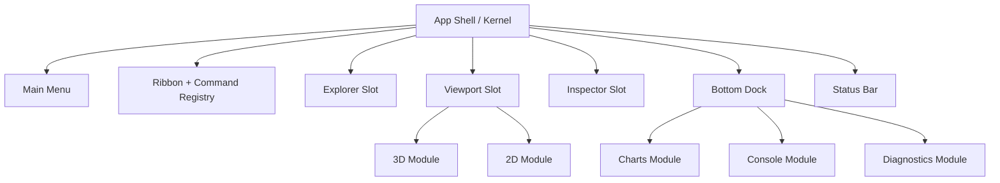

# Frontend v2 - Executive Summary

**Status:** Proposed architecture
**Date:** 2026-05-11
**Scope:** New modular browser control room for Fullmag, replacing `apps/web` as the active frontend after validation.

## 1. Decision

Build frontend v2 as a clean app root at `apps/control-room`. Keep `apps/web` as a legacy reference until cutover, then remove it from active development and deployment.

The new frontend uses a module-kernel architecture:

- the kernel owns routing, provider wiring, module registry, typed event bus, command registry, layout slots, API facade, resource invalidation, diagnostics, and module lifecycle;
- modules own one bounded product area such as explorer, 3D viewport, 2D viewport, inspector, charts, ribbon, console, diagnostics, or notifications;
- modules communicate through typed kernel events, shared command definitions, and resource hooks, not through cross-module imports;
- API access goes through the v2 OpenAPI-generated transport, handwritten API facade, resource hooks, binary codecs, and domain adapters.

Frontend v2 must preserve Fullmag's canonical model. It is not allowed to become a UI-only simulation editor or a backend-specific viewer.

## 1.1. Visual Quality Standard

Fullmag's control room must look and feel like a **premium professional application** — on par with tools like Figma, Linear, Blender, or COMSOL. It is not a bare-bones admin panel.

Design principles:

- **Polished, modern aesthetic** — refined typography (Inter/JetBrains Mono), deliberate spacing, smooth micro-animations, Catppuccin Mocha dark theme, and Catppuccin Latte light theme.
- **shadcn/ui as the component foundation** — menu, ribbon, command palette, dialogs, dropdowns, context menus, tabs, resizable panels, switches, segmented controls, and tooltips use shadcn/ui-style shared primitives for accessibility and visual consistency.
- **Tailwind CSS as utility layer** — rapid layout composition and responsive behavior, consuming `--fm-*` design tokens.
- **Dense but beautiful** — high information density appropriate for scientific work, but with premium polish: smooth transitions, clear visual hierarchy, elegant status indicators.
- **Functional beauty** — every visual element serves a scientific or UX purpose. No gratuitous decoration, but no plain HTML either. The interface should invite sustained use.

Raw Catppuccin hex values are allowed only in central token/theme files. Components and module CSS consume semantic `--fm-*` tokens.

## 1.2. Deployment Targets

Frontend v2 must work in two deployment modes:

| Mode | Technology | Use case |
|---|---|---|
| **Web** | Next.js served from the Rust backend or standalone | Browser-based access, remote sessions, collaboration |
| **Desktop** | Tauri wrapping the same Next.js frontend | Native-feeling local app, system tray, file system access, offline capability |

Architectural constraints for desktop compatibility:

- no server-side rendering dependencies that break in Tauri WebView;
- API base URL must be configurable (localhost for desktop, remote for web);
- file dialogs and system integration go through a thin platform abstraction;
- the same codebase serves both targets — no desktop-only fork.

Electron is an acceptable fallback if Tauri proves impractical, but Tauri is preferred for binary size and resource efficiency.

## 2. Current Frontend Diagnosis

Measured locally on 2026-05-11, excluding `.next`, `node_modules`, `dist`, and `coverage`, `apps/web` contains 992 files and about 212,214 lines.

| Problem | Local evidence |
|---|---|
| God context | `apps/web/components/runs/control-room/ControlRoomContext.tsx` is 1,930 lines and still coordinates transport, model, viewport, commands, and derived state. |
| Monolithic shell | `apps/web/components/runs/RunControlRoom.tsx` is 912 lines. |
| Bootstrap-era normalization | `apps/web/lib/session/normalize.ts` is 2,350 lines and `apps/web/lib/session/merge.ts` is 557 lines. |
| Legacy wire type gravity | `apps/web/lib/session/types.ts` is 1,472 lines and still carries preview/bootstrap vocabulary. |
| Viewport risk concentration | `apps/web/components/preview/FemMeshView3D.tsx` is 1,397 lines, `useViewportDataBridge.ts` is 2,034 lines, and `UnifiedVectorFieldRenderer.tsx` is 2,302 lines. |
| Mixed architecture | Both `components/`, `features/`, `src/features/`, `src/hooks/`, and `lib/` contain overlapping frontend ownership. |
| Transitional semantics leak | `preview`, `bootstrap`, `poll`, and legacy mode names remain visible in runtime/UI code. |

Refactoring in place is no longer the lowest-risk path. The old architecture keeps pulling new fixes back into old state ownership, rendering lifecycle, and preview terminology.

## 3. What Carries Forward

Frontend v2 may port code only when the port has a named owner, a test target, and no dependency on legacy context or bootstrap state.

| Keep | Porting rule |
|---|---|
| OpenAPI v2 generated types and generated low-level client | Regenerate from backend, never edit generated files manually. |
| `LiveSessionClient` endpoint-module idea | Port as the handwritten API facade after removing legacy compatibility branches. |
| Binary codecs for fields and topology | Keep as data-plane readers with malformed-payload tests. |
| Domain adapters | Preserve the FDM/FEM adapter boundary and strengthen it. |
| ECharts integration | Reuse rendering knowledge, not monolithic chart panels. |
| Three.js renderer primitives | Port renderer logic only after extracting resource ownership and disposal. |
| CSS tokens and dense scientific visual language | Keep the control-room look; remove decorative or accidental styles. |
| Zustand where already bounded | Keep small stores; reject stores that fetch, import module internals, or duplicate server state. |

## 4. What Is Banned From v2

- `ControlRoomContext.tsx` or any equivalent context that owns mutable application state.
- `normalize.ts`, `merge.ts`, or any whole-session bootstrap normalization pipeline.
- Direct `fetch()` from modules or React components.
- Hand-built `/v2/...` strings outside API client modules or generated transport.
- Cross-module imports from `src/modules/A` to `src/modules/B`.
- Component-level FDM/FEM product branches.
- WebSocket as the authoritative full-state transport.
- Always-on WebGL render loops.
- Mutable singleton diagnostics and feature flags.
- Legacy `Build` / `Study` / `Analyze` shell switching as product architecture.
- Code copied from `apps/web` without an explicit acceptance reason.

## 5. Target Product Shape

Frontend v2 is one unified workspace:

The user-facing modules are `Home`, `Definitions`, `Geometry`, `Materials`, `Physics`, `Mesh`, `Study`, `Results`, and `Automation`. They are workspace contexts inside one shell, not separate applications.

## 6. Success Criteria

Frontend v2 is allowed to replace legacy only when:

- the app can open a session, show status, navigate the model, inspect and edit supported properties, build mesh resources, run supported stages, switch quantities, view 3D and 2D data, view charts, inspect logs, and export canonical Python;
- all active UI data comes through OpenAPI v2, resource hooks, binary codecs, and domain adapters;
- idle workspace CPU/GPU use is bounded and verified;
- WebGL resources are counted and released across mode switches;
- all modules can be disabled by manifest registration without breaking the shell;
- `apps/web` has no active import path into `apps/control-room`;
- legacy remains only as a documented reference until removal;
- the interface looks and feels premium — Catppuccin Mocha/Latte themes work, transitions are smooth, typography is polished, shadcn/ui-style components are consistent;
- the app runs in both browser and Tauri desktop modes without code forks.
