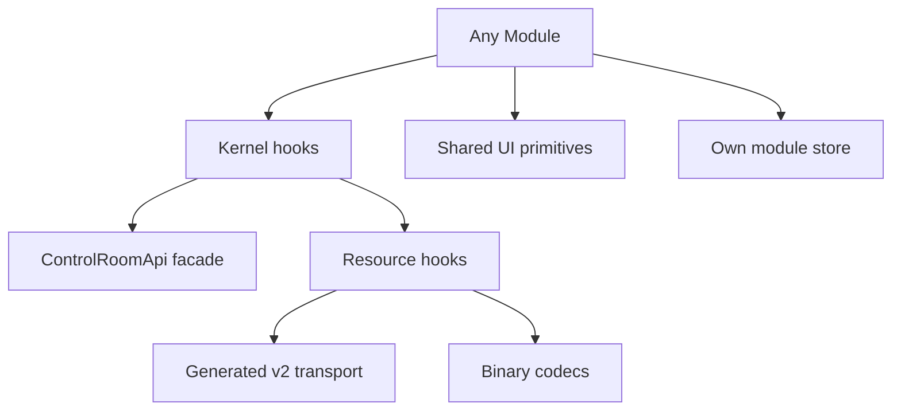

# Frontend v2 - Module Catalog

**Status:** Active migration contract
**Date:** 2026-05-22

Each module below maps to `apps/control-room/src/modules/<module-id>/`. Modules are optional at registration time, but the shell must remain stable when any non-core module is disabled.

## 0. Current Implementation Snapshot

As of 2026-05-22, `apps/control-room` registers these manifests through `src/modules/index.ts`:

| Manifest id | Directory | Slot | Status |
|---|---|---|---|
| `app-menu` | `src/modules/app-menu` | `app-menu` | implemented |
| `ribbon` | `src/modules/ribbon` | `ribbon` | implemented |
| `explorer` | `src/modules/explorer` | `panel-left` | implemented |
| `viewport-3d` | `src/modules/viewport-3d` | `viewport-main` | implemented |
| `inspector` | `src/modules/inspector` | `panel-right` | implemented |
| `transport-footer` | `src/modules/footer` | `panel-bottom` | implemented as the current footer/log dock |
| `command-palette` | `src/modules/overlay` | `overlay` | implemented as the current overlay module |
| `status-bar` | `src/modules/status-bar` | `status-bar` | implemented |

The modules listed in later sections remain the target catalog. A target module that is not in this snapshot is deferred, not silently dropped. Cutover acceptance still depends on the required workflows in `21-cutover-acceptance.md`, not on this snapshot alone.

## 1. Core Shell Modules

| Module | Slot | Responsibility | Required |
|---|---|---|---|
| `app-menu` | `app-menu` | Main menu renderer backed by command registry. | yes |
| `ribbon` | `ribbon` | Context command groups and toolbars. | yes |
| `status-bar` | `status-bar` | Connection, backend, precision, active session, revision summaries. | yes |
| `command-palette` | `overlay` | Keyboard-driven command search and execution. | yes |
| `notifications` | `overlay` | Toasts and command/error summaries. | yes |

The workspace shell (grid, split panes, slot hosts, resize persistence) is kernel-owned infrastructure in `src/kernel/layout/`, not a module.

Core shell modules must not contain physics-specific UI. They render commands, status, and slots.

## 2. Navigation Modules

| Module | Slot | Responsibility | Legacy reference |
|---|---|---|---|
| `explorer` | `panel-left` | Unified tree for model, resources, results, jobs, diagnostics entry points. | `ModelTree.tsx`, `features/model-builder`, `features/workspace-graph` |
| `results-navigator` | `panel-left` | Artifact and result dataset browsing. | `features/analyze`, `features/workspace-graph` |
| `project-start` | `viewport-main` or `overlay` | Open/recent/example/session start flow. | `components/start-hub` |

The explorer is the default left-panel module. Results navigator is a tab in the same panel, not a separate application shell.

## 3. Authoring Modules

| Module | Slot | Responsibility | Notes |
|---|---|---|---|
| `definitions` | `panel-left`, `panel-right` | Materials, quantities, named functions, parameter definitions. | Must round-trip to Python DSL. |
| `geometry-authoring` | `viewport-main`, `ribbon`, `panel-right` | Geometry object creation, primitive editing, transforms, validation, and backend scene transactions in the unified 3D viewport. | Geometry mode is a viewport preset, not a separate builder app. New objects start in primitive display until a mesh build materializes solver topology. |
| `materials` | `panel-right` | Material assignment, tensor/scalar editing, validation. | Uses inspector transaction model. |
| `physics` | `panel-right` | Interactions, boundary conditions, external fields. | Must use canonical Python/IR vocabulary. |
| `mesh-authoring` | `panel-right`, `panel-bottom` | Universe/object/shared-domain mesh controls and reports. | Must preserve FEM three-layer mesh semantics. |
| `study-authoring` | `panel-right`, `ribbon` | Stage pipeline, execution intent, backend/device/precision request. | Must preserve requested vs resolved execution. |
| `python-export` | `panel-bottom`, `overlay` | Canonical Python DSL preview/export and sync diagnostics. | Read-only preview unless transaction support exists. |

Authoring modules never mutate local-only physics state. They submit semantic transactions to the API/resource layer.

`geometry-authoring` follows the lifecycle in `24-geometry-object-authoring-lifecycle.md`: inspector drafts create or patch canonical `SceneDocument` objects through v2 model transactions; primitive/fallback wireframe display is authoring visualization only; solver mesh topology appears only after a successful backend mesh build.

## 4. Visualization Modules

| Module | Slot | Responsibility | Data source |
|---|---|---|---|
| `viewport-3d` | `viewport-main` | 3D scene, mesh, field, glyph, overlay, selection visualization. | Mesh/topology/field binary resources. |
| `viewport-2d` | `viewport-main`, `viewport-aux` | Slices, projections, probes, line profiles. | Slice/profile resources and field catalog. |
| `charts` | `panel-bottom`, `viewport-aux` | Scalar histories, energies, convergence, analysis series. | Scalar and analysis resources. |
| `legend-scale` | `viewport-main` overlay | Quantity legend, units, range, stale/degraded status. | Visualization state and field stats. |
| `view-controls` | `ribbon`, `viewport-main` overlay | Camera, layer, quantity, clip, selection, display controls. | Command registry and visualization resource. |

Viewport modules consume domain-neutral render models. FDM/FEM interpretation belongs to adapters.

## 5. Runtime Modules

| Module | Slot | Responsibility |
|---|---|---|
| `run-control` | `ribbon`, `panel-right` | Start/pause/stop stages and show command completion. |
| `job-monitor` | `panel-bottom` | Active commands, runs, stages, progress, stop reasons. |
| `engine-console` | `panel-bottom` | Logs and solver telemetry. |
| `diagnostics` | `panel-bottom`, `overlay` | API request log, resource cache, render counters, memory checks. |
| `capability-viewer` | `panel-right`, `overlay` | Explains why commands/modules are available, degraded, or unsupported. |

Runtime modules must distinguish compute state from display-selection state.

## 6. Module Dependencies

Modules do not depend on each other directly. Allowed dependency flow:

If `viewport-3d` needs selection, it reads `selectionStore` through kernel hooks or listens to `workspace:selection-changed`. It does not import the explorer store.

## 7. Minimum Acceptance Per Module

Each module needs:

- manifest with slot, capability gate, and declared events;
- root component accepting `ModuleProps`;
- no cross-module imports;
- tests for manifest registration and at least one meaningful behavior;
- teardown coverage for subscriptions, workers, timers, and external resources;
- documented legacy sources copied or deliberately rejected;
- feature flag or registration owner if the module is not core.
