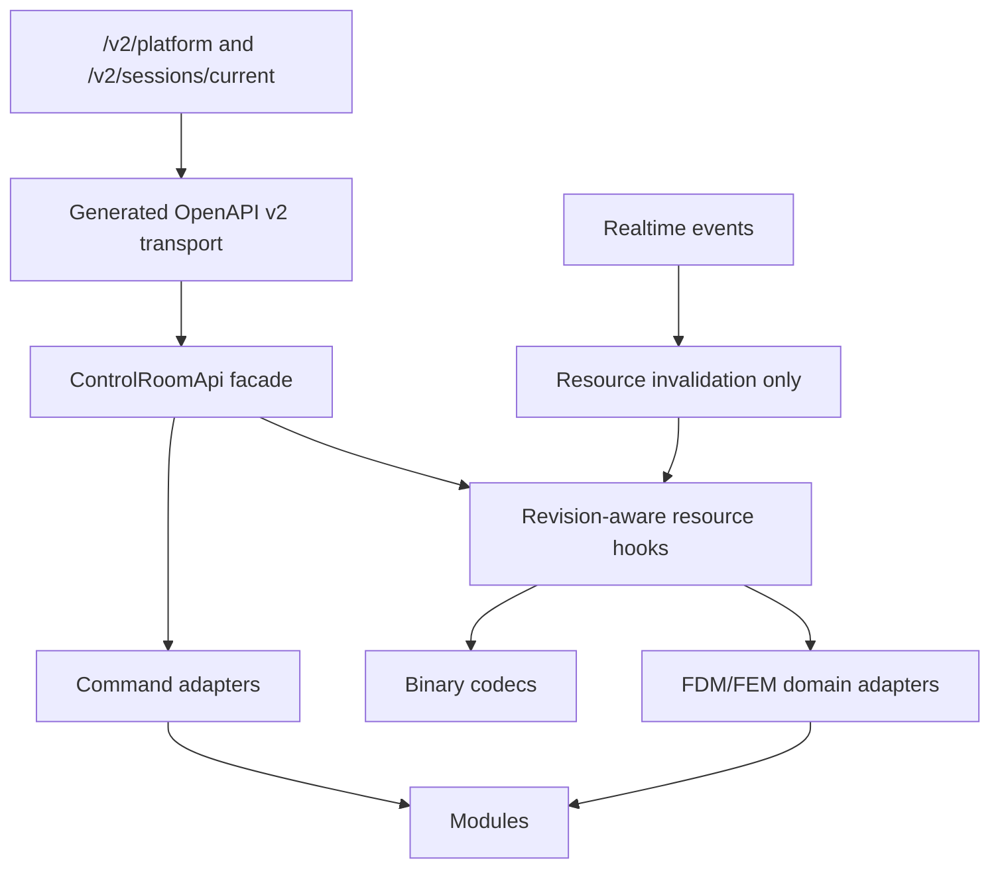

# Frontend v2 - API Integration Layer

**Status:** Proposed architecture
**Date:** 2026-05-11

## 1. Contract

Frontend v2 is an OpenAPI v2 client. The browser contract is the session-scoped resource-first API documented in:

- `docs/specs/resource-first-control-room-api-v2.md`
- `docs/adr/0011-resource-first-api.md`

All JSON transport moves through generated v2 types and generated v2 path/client code. Product semantics live above that in a handwritten facade, resource hooks, command adapters, binary codecs, and domain adapters.

## 2. Layer Stack



HTTP resources are the source of truth. WebSocket events notify lifecycle and invalidation; they do not carry full state, fields, topology, mesh payloads, scalar histories, or artifacts.

## 3. Porting Policy From Legacy

| Legacy area | v2 action |
|---|---|
| `apps/web/src/api/generated/openapi-v2-*` | Regenerate in v2 app from backend. |
| `apps/web/src/api/client/modules/*` | Port endpoint-module pattern after removing compatibility branches. |
| `apps/web/src/api/client/interceptors/*` | Port request-id, retry, version check, diagnostics. |
| `apps/web/src/api/codecs/*` | Port with malformed-payload and transferability tests. |
| `apps/web/src/api/realtime/LiveRealtimeClient.ts` | Port as invalidation/event stream only. |
| `apps/web/src/hooks/resources/*` | Rebuild. Keep names only where the contract is still correct. |
| `apps/web/lib/session/normalize.ts` | Do not port. |
| `apps/web/lib/session/merge.ts` | Do not port. |
| `apps/web/lib/session/types.ts` | Do not port. Generated v2 types and narrow domain models replace it. |

## 4. Resource Hook Rule

Resource hooks are the only data-fetching surface exposed to modules.

```typescript
export interface ResourceResult<T> {
  data: T | null;
  status: "idle" | "loading" | "ready" | "stale" | "error";
  error: Error | null;
  revision: string | number | null;
  refetch: () => void;
}
```

Every resource hook must declare:

- resource family;
- API facade method;
- revision selector;
- cache key;
- stale behavior;
- abort behavior;
- degraded/error behavior.

No module uses `useEffect(() => fetch(...))`. No module constructs endpoint URLs.

## 5. Canonical Resource Families

| Family | Examples | Frontend owner |
|---|---|---|
| `session` | status, capabilities, connection, runtime identity | kernel session store and status hooks |
| `model` | scene document, definitions, authoring projections | authoring resource hooks |
| `workspace` | selection, layout, ribbon state | kernel layout/selection hooks |
| `meshing` | mesh config, build status, topology, quality, reports | mesh and viewport hooks |
| `simulation` | runs, stages, commands, solver state | runtime modules |
| `data` | field vectors, field catalog, scalar histories, slices | data-plane hooks and codecs |
| `visualization` | quantity, layers, color range, clip state | viewport modules |
| `analysis` | eigenmodes, frequency response, derived datasets | charts/results modules |
| `diagnostics` | request log, cache stats, server health | diagnostics module |

Status carries pointers, revisions, capabilities, summaries, and diagnostics. Heavy payloads remain separate resources.

## 6. Command Flow

Commands move through one registry and one API path:

1. menu/ribbon/context/shortcut/palette invokes a `CommandContribution`;
2. command checks local capability gate and selection preconditions;
3. command submits through `ControlRoomApi.commands`;
4. API returns accepted/rejected command state;
5. realtime invalidates command/session resources;
6. resource hooks refetch command completion and status;
7. modules update from resource state, not optimistic private state.

The command result shown to the user must distinguish rejected, accepted, running, completed, failed, degraded, and cancelled.

## 7. Binary Data Plane

| Payload | Transport | Frontend rule |
|---|---|---|
| Field vectors | binary codec, transferable buffers | decode off main thread when large enough to matter |
| Mesh topology | binary codec | topology revision separate from field revision |
| Coordinates | binary or typed array resource | preserve units and coordinate frame metadata |
| Slice/profile data | resource endpoint | no preview-control mutation for warm switching |
| Large scalar histories | paged or since-revision resource | charts request only visible/needed ranges |

Binary decoders must support abort, malformed payload errors, and resource disposal after consumers release them.

## 8. Forbidden API Patterns

- `fetch`, `XMLHttpRequest`, or ad hoc HTTP clients in modules/components.
- `/v1/live/current` in any v2 code.
- `/v2/...` string literals outside generated transport or API facade modules.
- WebSocket state snapshots replacing HTTP resources.
- Copying full field/topology/scalar payloads into status.
- Resource hooks without explicit revision selectors.
- Long-lived compatibility fallback from v2 to old preview/bootstrap routes.

## 9. Verification

Any change to API integration must run the relevant subset:

- `pnpm --dir apps/control-room generate:api` once the v2 app exists;
- `pnpm --dir apps/control-room typecheck`;
- resource-hook unit tests;
- codec malformed-payload tests;
- command accepted/rejected/completed tests;
- `rg "fetch\\(" apps/control-room/src`;
- `rg "/v2/" apps/control-room/src --glob '!src/kernel/api/**' --glob '!src/kernel/api/generated/**'`;
- `rg "/v1/live/current|bootstrap|poll|preview" apps/control-room/src`.
