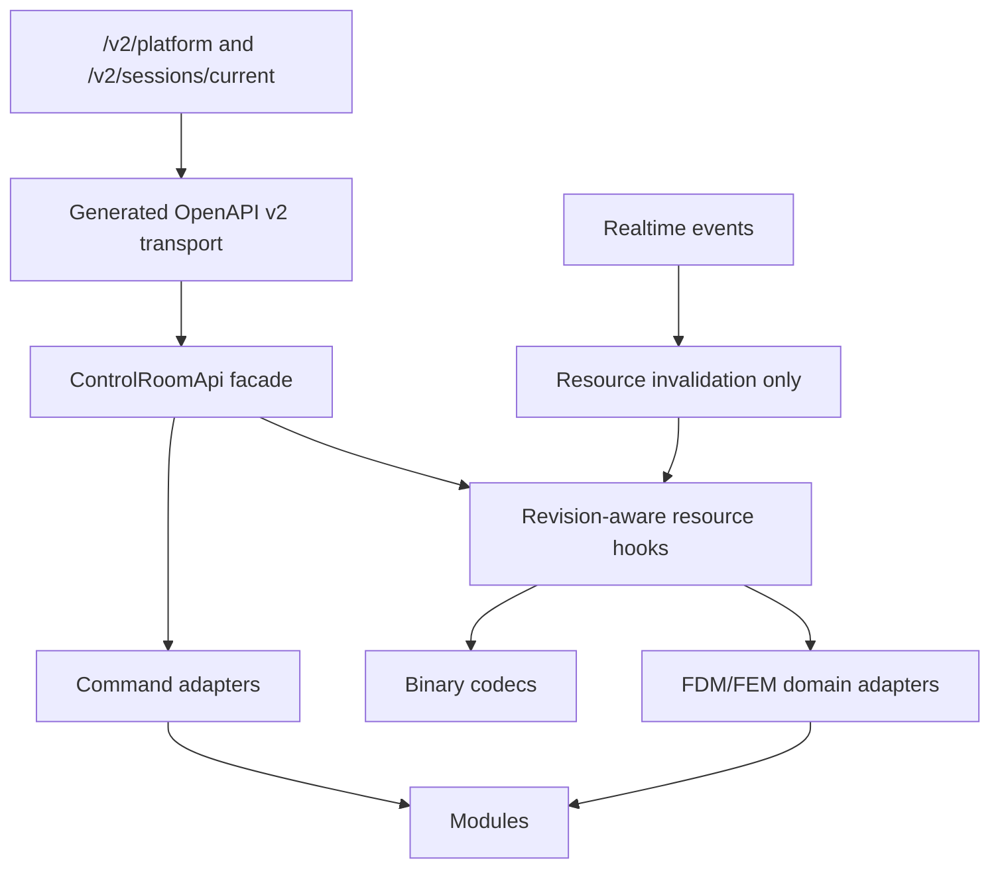

# Frontend v2 - API Integration Layer

**Status:** Phase 2 API spine implemented, still before module/data-plane rollout
**Date:** 2026-05-11

## 1. Contract

Frontend v2 is an OpenAPI v2 client. The browser contract is the session-scoped resource-first API documented in:

- `docs/specs/resource-first-control-room-api-v2.md`
- `docs/adr/0011-resource-first-api.md`

All JSON transport moves through generated v2 types and generated v2 path/client code. Product semantics live above that in a handwritten facade, resource hooks, command adapters, binary codecs, and domain adapters.

OpenAPI `info.version` and the runtime compatibility contract are not the same value. The current
Swagger catalog is `2.0.0`; `ControlRoomApi` validates the runtime response header
`x-api-contract-version: 1.0.0`, and realtime envelopes carry `contract_version: "1.0.0"`.

Current `apps/control-room` implementation:

- `pnpm --dir apps/control-room generate:api` prints backend OpenAPI v2 from `fullmag-api`, generates TypeScript with `openapi-typescript`, and regenerates the `openapi-fetch` transport/path wrapper;
- generated coverage comes from the backend v2 resource tree, including platform, session, model, meshing, simulation, data, visualization, workspace, analysis, persistence, and diagnostics paths;
- runtime API target resolution is centralized: local development defaults to `http://localhost:8081`, while `NEXT_PUBLIC_CONTROL_ROOM_API_BASE_URL`, `NEXT_PUBLIC_RUNTIME_HTTP_BASE`, `NEXT_PUBLIC_API_URL`, or `window.__FULLMAG_CONFIG__` may override it;
- `ControlRoomApi` sends `x-request-id`, validates backend `x-api-contract-version: 1.0.0`, retries idempotent GET failures, and records request diagnostics;
- `ControlRoomApi.sessions.current.status()` is the first facade method on top of the generated transport;
- `ControlRoomApi.commands.list()`, `.submit()`, and `.detail()` cover the v2 simulation command queue, accepted/rejected submission response, and per-command completion detail;
- `useSessionStatus()` is the first revision-aware resource hook;
- `RequestDiagnosticsController` records bounded request outcomes for the facade layer;
- `RealtimeClient` connects to `/v2/sessions/current/events/ws` with subprotocol `fullmag.live.v1`, maps backend `resource.batch_changed` events into resource invalidation, maps `resync.required` into status invalidation, and ignores lifecycle events as state sources;
- FMVP field-vector and FMMT topology codecs exist as the first binary data-plane foundation.

The app is still before Explorer/Inspector/Viewport module rollout. New modules may consume only facade methods, resource hooks, command adapters, or codecs; they must not call transport directly.

## 2. Layer Stack



HTTP resources are the source of truth. WebSocket events notify lifecycle and invalidation; they do not carry full state, fields, topology, mesh payloads, scalar histories, or artifacts. The frontend consumes `resource.batch_changed.payload.changes[]`, invalidates the status resource, and invalidates each `recommended_fetch` resource key for future data hooks. When the backend sends `resync.required`, the frontend invalidates status so HTTP v2 can recover the canonical snapshot.

The HTTP base URL and websocket URL are resolved from the same API target. A browser served from one port must not silently assume the backend lives on that same origin when a local control-room API is configured or when development mode is using the default `localhost:8081` backend.

## 3. Porting Policy From Legacy

| Legacy area | v2 action |
|---|---|
| `apps/legacy_web/src/api/generated/openapi-v2-*` | Regenerate in v2 app from backend. |
| `apps/legacy_web/src/api/client/modules/*` | Port endpoint-module pattern after removing compatibility branches. |
| `apps/legacy_web/src/api/client/interceptors/*` | Port request-id, retry, version check, diagnostics. |
| `apps/legacy_web/src/api/codecs/*` | Port with malformed-payload and transferability tests. |
| `apps/legacy_web/src/api/realtime/LiveRealtimeClient.ts` | Port as invalidation/event stream only. |
| `apps/legacy_web/src/hooks/resources/*` | Rebuild. Keep names only where the contract is still correct. |
| `apps/legacy_web/lib/session/normalize.ts` | Do not port. |
| `apps/legacy_web/lib/session/merge.ts` | Do not port. |
| `apps/legacy_web/lib/session/types.ts` | Do not port. Generated v2 types and narrow domain models replace it. |

## 4. Resource Hook Rule

Resource hooks are the only data-fetching surface exposed to modules.

```typescript
export interface ResourceResult<T> {
  data: T | null;
  status: "idle" | "loading" | "ready" | "stale" | "error";
  error: Error | null;
  revision: string | number | null;
  refetch: () => void;
}
```

Every resource hook must declare:

- resource family;
- API facade method;
- revision selector;
- cache key;
- stale behavior;
- abort behavior;
- degraded/error behavior.

No module uses `useEffect(() => fetch(...))`. No module constructs endpoint URLs.

## 5. Canonical Resource Families

| Family | Examples | Frontend owner |
|---|---|---|
| `session` | status, capabilities, connection, runtime identity | kernel session store and status hooks |
| `model` | scene document, definitions, authoring projections | authoring resource hooks |
| `workspace` | selection, layout, ribbon state | kernel layout/selection hooks |
| `meshing` | mesh config, build status, topology, quality, reports | mesh and viewport hooks |
| `simulation` | runs, stages, commands, solver state | runtime modules |
| `data` | field vectors, field catalog, scalar histories, slices | data-plane hooks and codecs |
| `visualization` | quantity, layers, color range, clip state, session-wide camera | viewport modules |
| `analysis` | eigenmodes, frequency response, derived datasets | charts/results modules |
| `diagnostics` | request log, cache stats, server health | diagnostics module |

Status carries pointers, revisions, capabilities, summaries, and diagnostics. Heavy payloads remain separate resources.

## 5.1 Geometry Object Authoring Resources

Geometry object creation uses the `model` family, not workspace or visualization resources:

- read the canonical scene through `GET /v2/sessions/current/model/scene`;
- commit create/patch/delete/rename/transform authoring changes through `POST /v2/sessions/current/model/transactions` or the object-specific model routes exposed by OpenAPI v2;
- read geometry capabilities, validation, diagnostics, and realization snapshots from `/v2/sessions/current/model/geometry/*`;
- treat mesh-affecting model changes as mesh-stale until meshing resources prove a current build;
- submit mesh rebuilds through `POST /v2/sessions/current/simulation/commands` with `kind: "mesh_build"`;
- read progress and provenance from `meshing/builds/current`, `meshing/builds/latest-successful`, object topology, reports, quality, and shared-domain manifest resources.

The frontend facade must expose handwritten methods/resource hooks for those routes before modules use them. A module must not call generated transport directly or build endpoint strings for object creation.

## 6. Command Flow

Commands move through one registry and one API path:

1. menu/ribbon/context/shortcut/palette invokes a `CommandContribution`;
2. command checks local capability gate and selection preconditions;
3. command submits through `ControlRoomApi.commands`;
4. API returns accepted/rejected command state;
5. realtime invalidates command/session resources;
6. resource hooks refetch command completion and status;
7. modules update from resource state, not optimistic private state.

The command result shown to the user must distinguish rejected, accepted, running, completed, failed, degraded, and cancelled.

## 7. Binary Data Plane

| Payload | Transport | Frontend rule |
|---|---|---|
| Field vectors | binary codec, transferable buffers | decode off main thread when large enough to matter |
| Mesh topology | binary codec | topology revision separate from field revision |
| Coordinates | binary or typed array resource | preserve units and coordinate frame metadata |
| Slice/profile data | resource endpoint | no preview-control mutation for warm switching |
| Large scalar histories | paged or since-revision resource | charts request only visible/needed ranges |

Binary decoders must support abort, malformed payload errors, and resource disposal after consumers release them.

## 8. Forbidden API Patterns

- `fetch`, `XMLHttpRequest`, or ad hoc HTTP clients in modules/components.
- `/v1/live/current` in any v2 code.
- `/v2/...` string literals outside generated transport or API facade modules.
- WebSocket state snapshots replacing HTTP resources.
- Copying full field/topology/scalar payloads into status.
- Resource hooks without explicit revision selectors.
- Long-lived compatibility fallback from v2 to old preview/bootstrap routes.

## 9. Verification

Any change to API integration must run the relevant subset:

- `pnpm --dir apps/control-room generate:api`;
- `pnpm --dir apps/control-room typecheck`;
- `pnpm --dir apps/control-room lint`;
- `pnpm --dir apps/control-room test`;
- `pnpm --dir apps/control-room check:api-hygiene`;
- resource-hook unit tests;
- codec malformed-payload tests;
- command accepted/rejected/completed tests;
- `rg "fetch\\(" apps/control-room/src`;
- `rg "/v2/" apps/control-room/src --glob '!src/kernel/api/**' --glob '!src/kernel/api/generated/**'`;
- `rg "/v1/live/current|bootstrap|poll|preview" apps/control-room/src --glob '!src/kernel/api/generated/**'`.
