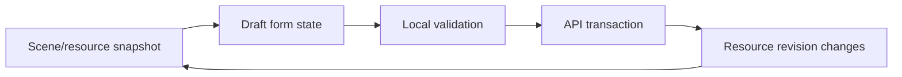

# Frontend v2 - State Management

**Status:** Proposed architecture
**Date:** 2026-05-11

## 1. Rule

Zustand stores are for client-owned UI state. Resource hooks and caches are for server-owned state. React context is for immutable services only.

This split prevents the legacy failure mode where context, stores, normalizers, and mutable singletons all claimed partial ownership of the same session.

## 2. State Ownership

| State kind | Owner | Examples |
|---|---|---|
| Server resource snapshot | resource hook/cache | session status, scene document, mesh topology, field vectors, scalar histories |
| Runtime invalidation pointer | kernel session store | revision map, connection status, command completion revision |
| Layout state | kernel layout store | panel sizes, active slot modules, split ratio |
| Selection state | kernel selection store | selected node, selected resource, selection source |
| Module UI state | module-local Zustand store | expanded tree nodes, active inspector tab, camera preset, chart zoom |
| Imperative external resource | resource tracker / renderer class | WebGL buffers, textures, workers, observers |
| Theme | CSS/token provider | dark/light/high-contrast variant |

Server data must not be copied into module stores except as a small stable identifier or view preference. If a resource changes, modules re-render from resource hooks.

## 3. Allowed React Contexts

Only these mutable-looking contexts are allowed:

- `KernelContext` containing immutable `KernelApi`;
- `ThemeContext` containing visual theme mode and setter;
- third-party provider contexts required by libraries, if wrapped at shell level.

No React context may own session data, mesh data, field data, viewport state, selected entity, command lifecycle, or inspector drafts.

## 4. Kernel Stores

| Store | Writes | Reads |
|---|---|---|
| `sessionStore` | realtime client and status resource synchronizer | all modules through selectors |
| `layoutStore` | layout controller and user resize/tab actions | shell, slot hosts, command palette |
| `selectionStore` | explorer, viewport picking, command actions | explorer, inspector, viewport, status |
| `diagnosticsStore` | diagnostics controller | diagnostics module and dev overlays |

Kernel stores expose selectors and plain controller functions. They do not import module code.

## 5. Module Stores

Each module may define `store.ts` for local UI state. That file is private to the module.

Allowed examples:

- `explorer/store.ts`: expanded node ids, tree filter, active explorer tab;
- `viewport-3d/store.ts`: camera state, active local layer panel, local dirty reason counters;
- `inspector/store.ts`: open sections, draft edit session id, validation panel visibility;
- `charts/store.ts`: visible series ids, brush range, display density.

Forbidden examples:

- storing full `SessionStatus` in a module store;
- storing full mesh topology in a Zustand store;
- storing decoded field arrays in React state;
- importing `viewport-3d/store.ts` from `inspector`;
- store actions that call `fetch`;
- module stores that become cross-module API surfaces.

Geometry object authoring uses this split:

- new-object and edit forms are inspector draft state;
- committed objects are server resource snapshots from `model/scene`;
- primitive display preference is visualization state;
- solver topology and mesh reports are meshing resources;
- selected object id is kernel selection state;
- Three.js primitive and wireframe objects are viewport resources, not React/Zustand state.

## 6. Draft Editing

Inspector edits use explicit draft transactions:

Draft state is local to the inspector panel. The canonical committed state remains the resource snapshot. If a commit fails, the draft remains visible with the error; the canonical resource is not silently overwritten.

## 7. Derived Data

Derived data must be computed in one of these places:

- pure selector over a store;
- pure resource adapter;
- `useMemo` in a leaf component when the input is small and stable;
- worker when computation is large enough to block the main thread;
- renderer class when the data is purely render-side.

Avoid `useEffect + setState` for derived values. That pattern causes stale closures, cascading renders, and difficult invalidation.

## 8. Persistence

Only user preferences and layout state persist locally:

- panel visibility/sizes;
- active module per slot;
- camera presets;
- chart display preferences;
- theme;
- debug overlay preferences.

Canonical simulation state, session state, field state, mesh state, command state, and provenance do not persist through browser local storage.

## 9. Verification

State changes must be checked with:

- store unit tests for updates and selectors;
- resource-hook tests for revision invalidation;
- integration test for event-to-store flow where relevant;
- `rg "createContext" apps/control-room/src`;
- `rg "let .*=" apps/control-room/src/kernel apps/control-room/src/modules`;
- `rg "fetch\\(" apps/control-room/src`.
