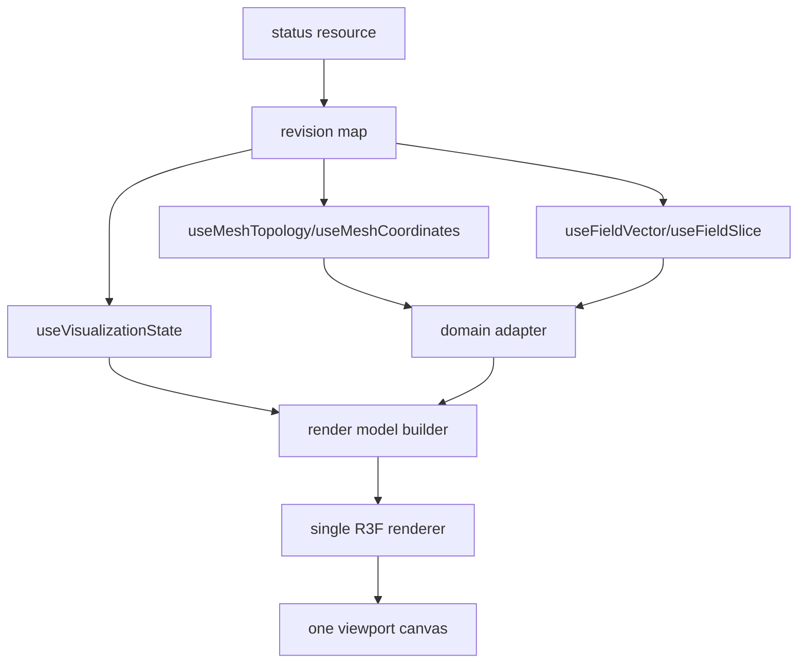

# Frontend v2 - Viewport Architecture

**Status:** Proposed architecture
**Date:** 2026-05-11

## 1. Viewport Family

Frontend v2 has one viewport slot family and multiple viewport modules:

- `viewport-3d` for WebGL/Three.js 3D scene rendering;
- `cross-section-image` for server-rendered mesh cross-section verification and PNG export;
- `field-map` for interactive field slices, projections, contours, probes, and heatmaps;
- `analysis-plots` for scalar and analysis plots in center tabs or docks;
- `view-controls` for layer, camera, quantity, clipping, and display commands.

These modules share the same kernel slot and command model. They do not duplicate the workspace shell.

## 2. Non-Negotiables

1. One viewport tree for FDM and FEM.
2. FDM/FEM differences live in domain adapters and render-model builders.
3. Topology rebuilds are separate from field-buffer swaps; a field buffer may be reused only when its domain generation and mesh topology revision/hash remain compatible with the current topology.
4. Render loops are dirty-driven, not always-on.
5. Every GPU resource has explicit ownership and disposal.
6. Non-3D center surfaces do not keep `viewport-3d` mounted. Server-rendered cross-section images use no browser WebGL. Any future WebGL-backed 2D mode must follow the same active-only mounting and teardown rules as `viewport-3d`.
7. Warm quantity switching reads published data resources; it does not enqueue preview-control commands unless the data truly does not exist.
8. Viewport modules can be disabled without breaking explorer, inspector, charts, or runtime commands.

## 3. Data Flow

The renderer receives render models, not API payloads.

`field-map` uses the same revisioned field resources but has an independent 2D
renderer lifecycle. It may consume binary scalar rasters, arrow payloads,
empty masks, and server-rendered PNG exports. It must not borrow Three.js
buffers or keep `viewport-3d` mounted. Arbitrary line cuts and k-space products
come from `analysis` resources rather than client-side filtering of a full FEM
field.

The authoritative 2D spatial contract is the canonical `PlanarMonitor` from
`docs/physics/0970-planar-monitor-sampling-and-projection.md`. Backend sampling
resolves FDM/FEM interpolation, physical-measure reduction, occupancy, and
surface ambiguity. The client receives domain-neutral raster/vector/overlay
resources and must not reimplement solver-specific sampling.

## 4. Viewport State Split

| State | Owner |
|---|---|
| selected quantity | visualization resource or command state |
| field/topology revisions | session resource revisions |
| decoded buffers | resource cache and renderer/resource tracker |
| camera | visualization resource; viewport module store is only a transient interaction fallback |
| pointer hover | viewport module store or local ref |
| selected object | kernel selection store |
| layer visibility | visualization resource for canonical state, local store for transient panels |
| per-object display overrides | visualization resource/controller keyed by canonical object or airbox target |
| active planar source and view profile | planar visualization resource; `Default` is session-resolved and authored monitor definitions remain model resources |
| monitor edit draft | inspector-local explicit draft transaction |
| planar scalar/vector/occupancy buffers | revision-aware resource cache, never React state |
| planar pan/zoom and hover probe | private field-map external store/renderer |
| perf counters | diagnostics controller |

The planar visualization source is a typed session selection, not a magic
monitor ID. `Default` resolves the complete published domain to an `xy`, `xz`,
or `yz` frame and uses `position_fraction = 0.5` initially; an authored
monitor selection resolves through `SceneDocument.monitors.planar[]`. Opening
the `field-map` surface never creates an inspector draft or mutates the model.

## 5. Rendering Budget

Idle means no continuous rendering. Frames are allowed for:

- camera interaction;
- changed session-wide visualization camera;
- resize;
- new topology;
- new field buffer;
- changed quantity or range;
- changed layer visibility;
- animation explicitly requested by a running solver visualization;
- context-loss recovery.

Status ticks, scalar chart updates, logs, tree expansion, and unrelated inspector drafts must not mark the 3D viewport dirty.

Per-object visualization edits are a valid dirty reason only for the affected render target. Toggling one ferromagnet's shader, vectors, wireframe, points, opacity, or airbox display must not rebuild unrelated topology or refetch unrelated fields. The same target registry is consumed by the View ribbon, explorer visualization nodes, inspector panels, and viewport render-model builders.

Geometry authoring adds one more dirty reason: primitive realization change for the edited object. This rebuilds only the affected primitive/fallback wireframe geometry. It must not be treated as a solver topology revision until meshing resources publish a current mesh for that scene revision.

## 6. Teardown Budget

Unmounting a viewport module must release:

- animation frame handles;
- resize observers;
- pointer listeners;
- workers;
- object URLs;
- WebGL geometries;
- materials;
- textures;
- render targets;
- GPU buffers;
- large typed arrays not owned by the resource cache.

For `field-map`, teardown also terminates its worker, closes owned
`ImageBitmap` instances, cancels its invalidation RAF, disconnects its
`ResizeObserver`, and releases renderer-local paths. Idle `field-map` schedules
no frames. Pan/zoom may transform a cached raster locally; it does not resample
the physical field.

The diagnostics module must expose resource counts in development mode.

## 7. Center Surface Tabs

When multiple modules target `viewport-main`, the kernel owns center-surface tab state. Switching tabs must unmount the previously active heavy module instead of hiding it. A non-3D tab must have:

- no mounted `.fm-viewport-3d` root;
- no R3F canvas;
- no active 3D topology, quality, or field-vector resource listeners;
- no `Viewport3DModule` render measurements;
- no `viewport-main` client acknowledgements emitted by the 3D renderer.

Global realtime invalidation and registry controllers may remain active, but they must not fetch 3D-only resources or rebuild 3D render models without a mounted 3D module.

## 8. Detailed Specs

- 3D viewport internals: `14-viewport-3d-module.md`
- 2D analysis surfaces and superseded live viewport notes: `15-viewport-2d-module.md`
- per-object visualization control: `23-per-object-visualization-control.md`
- geometry object authoring lifecycle: `24-geometry-object-authoring-lifecycle.md`
- Charts and analysis: `16-charts-analysis-module.md`
- Performance and profiling: `17-performance-memory-profiler.md`
