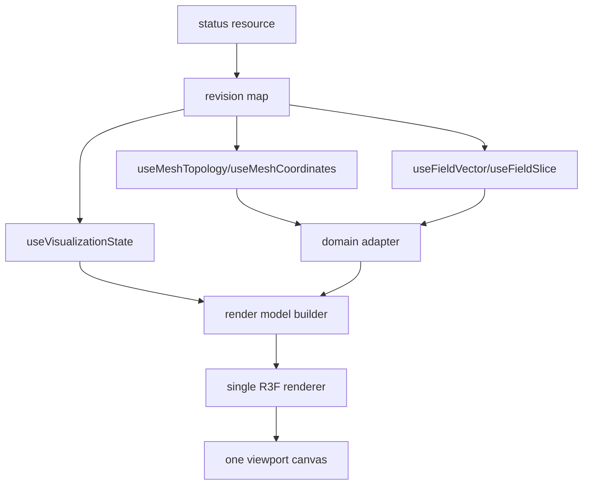

# Frontend v2 - Viewport Architecture

**Status:** Proposed architecture
**Date:** 2026-05-11

## 1. Viewport Family

Frontend v2 has one viewport slot family and multiple viewport modules:

- `viewport-3d` for WebGL/Three.js 3D scene rendering;
- `viewport-2d` for slices, projections, probes, and profiles;
- `charts` for scalar and analysis plots in docks or auxiliary slots;
- `view-controls` for layer, camera, quantity, clipping, and display commands.

These modules share the same kernel slot and command model. They do not duplicate the workspace shell.

## 2. Non-Negotiables

1. One viewport tree for FDM and FEM.
2. FDM/FEM differences live in domain adapters and render-model builders.
3. Topology rebuilds are separate from field-buffer swaps.
4. Render loops are dirty-driven, not always-on.
5. Every GPU resource has explicit ownership and disposal.
6. 2D viewports do not keep WebGL objects alive.
7. Warm quantity switching reads published data resources; it does not enqueue preview-control commands unless the data truly does not exist.
8. Viewport modules can be disabled without breaking explorer, inspector, charts, or runtime commands.

## 3. Data Flow

The renderer receives render models, not API payloads.

## 4. Viewport State Split

| State | Owner |
|---|---|
| selected quantity | visualization resource or command state |
| field/topology revisions | session resource revisions |
| decoded buffers | resource cache and renderer/resource tracker |
| camera | viewport module store |
| pointer hover | viewport module store or local ref |
| selected object | kernel selection store |
| layer visibility | visualization resource for canonical state, local store for transient panels |
| perf counters | diagnostics controller |

## 5. Rendering Budget

Idle means no continuous rendering. Frames are allowed for:

- camera interaction;
- resize;
- new topology;
- new field buffer;
- changed quantity or range;
- changed layer visibility;
- animation explicitly requested by a running solver visualization;
- context-loss recovery.

Status ticks, scalar chart updates, logs, tree expansion, and unrelated inspector drafts must not mark the 3D viewport dirty.

## 6. Teardown Budget

Unmounting a viewport module must release:

- animation frame handles;
- resize observers;
- pointer listeners;
- workers;
- object URLs;
- WebGL geometries;
- materials;
- textures;
- render targets;
- GPU buffers;
- large typed arrays not owned by the resource cache.

The diagnostics module must expose resource counts in development mode.

## 7. Detailed Specs

- 3D viewport internals: `14-viewport-3d-module.md`
- 2D viewport internals: `15-viewport-2d-module.md`
- Charts and analysis: `16-charts-analysis-module.md`
- Performance and profiling: `17-performance-memory-profiler.md`
