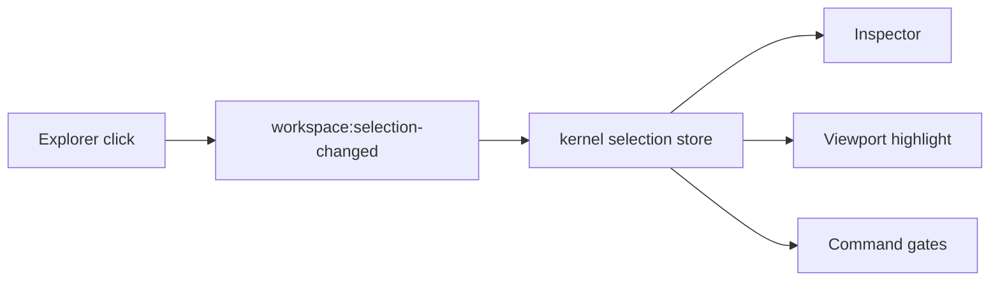

# Frontend v2 - Explorer View

**Status:** Proposed architecture
**Date:** 2026-05-11

## 1. Purpose

The explorer is the primary navigation and selection surface. It replaces scattered model tree, results tree, mesh tree, jobs tree, and diagnostics shortcuts with one module that renders multiple typed tree domains.

## 2. Explorer Tabs

| Tab | Contents |
|---|---|
| `Model` | universe/airbox, ferromagnetic objects, per-object geometry, regions, magnetic parameters, magnetic texture, mesh policy, visualization, study |
| `Resources` | live fields, meshes, quantities, scalar series, visualization resources |
| `Results` | artifacts, completed runs, analysis datasets, exported files |
| `Jobs` | active commands, runs, stages, queued work, failures |
| `Diagnostics` | API resources, cache entries, render resources, capability gates |

Tabs filter the same canonical resource graph. They are not separate state models.

## 3. Node Contract

Every explorer node uses a common shape:

```typescript
export interface ExplorerNode {
  id: string;
  kind: ExplorerNodeKind;
  label: string;
  icon: IconToken;
  parentId: string | null;
  children?: ExplorerNode[];
  resourceRef?: ResourceRef;
  selectionRef?: SelectionRef;
  status?: "ready" | "stale" | "running" | "failed" | "degraded" | "unsupported";
  capabilityGate?: CapabilityGate;
  contextCommands?: CommandId[];
}
```

Nodes are derived from resources. They are never the canonical model.

## 4. Selection Semantics

Selection is global and explicit:



Viewport picking uses the same event. Inspector focus requests use the same selection identity. Selection is not focus and not visibility.

## 5. Tree Rendering

Requirements:

- virtualize when row count exceeds a small fixed threshold;
- derive indentation from tree depth;
- keep row height stable;
- preserve expanded nodes per tab in explorer store;
- support keyboard navigation;
- support search/filter without mutating canonical resources;
- show stale/degraded/unsupported states;
- expose context menu commands from command registry.

## 6. Context Menus

Context menus render command registry entries whose `scope` and `selection` gates match the node.

Examples:

- object: rename, duplicate, assign material asset, isolate, focus in viewport, mesh settings;
- object regions: edit object-derived region name/visibility and inspect material/magnetization refs;
- object magnetic parameters: edit material assignment, material parameters, and interaction stack;
- object magnetic texture: edit magnetization texture assignment and inspect mapping/transform;
- object visualization: focus visualization inspector, clear per-object display overrides, copy/paste display style;
- airbox visualization: focus airbox display inspector, reset airbox display, apply current view defaults;
- mesh build: open report, rebuild, export mesh;
- field: set as viewport quantity, add chart if scalar-compatible, export;
- stage: run from here, disable, duplicate, inspect provenance.

No context menu item calls module-private functions directly.

## 7. Explorer Store

Allowed local state:

- active tab;
- expanded node ids by tab;
- filter text;
- selected keyboard row;
- context menu anchor;
- optional sort mode.

Forbidden local state:

- full scene document;
- field vectors;
- mesh topology;
- command completion snapshots;
- inspector draft state.

## 8. Performance

The explorer must not rebuild the full tree on every status tick. It rebuilds when the relevant resource revision changes:

- model tree from scene/model revision;
- resources tree from field/mesh/scalar/catalog revisions;
- results tree from artifact/analysis revisions;
- jobs tree from command/run/stage revisions;
- diagnostics tree from diagnostics/debug revisions.

Tree model builders are pure functions with tests.

## 9. Visualization Nodes

Every scene object node has a `Visualization` child. The child selects the per-object visualization inspector and uses the same canonical target id as the View ribbon and viewport render model:

- scene object target: `object:<object_id>`;
- airbox target: `airbox`;
- future 2D slice target: the same object or airbox id plus a 2D mode suffix when the 2D backend needs mode-specific state.

The explorer does not own visibility or display style. It only exposes the node that lets the inspector focus the target-specific controls.

`Debug` is the last semantic child of each supported `Visualization` node. It
selects an observation-only inspector for the same canonical target as its
parent; it is not another appearance-settings page and does not create a second
target for a mesh carrier. In particular, Airbox Debug selects target `airbox`
and must report `part:__air__` separately as its data-plane carrier.

The Model tree and stable node ids are:

```text
Session Model
└── Universe
    └── Airbox                                      model:airbox
        ├── Mesh                                    model:airbox:mesh
        │   ├── Parameters                          model:airbox:mesh:parameters
        │   ├── Quality Gates                       model:airbox:mesh:quality-gates
        │   ├── Statistics                          model:airbox:mesh:statistics
        │   ├── Topology                            model:airbox:mesh:topology
        │   └── Build & Provenance                  model:airbox:mesh:build
        └── Visualization                           model:airbox:visualization
            └── Debug                               model:airbox:visualization:debug

Objects
└── <Object>
    └── Visualization                               <object-parent-id>:visualization
        └── Debug                                   <object-parent-id>:visualization:debug
    └── Regions
        └── <Region>
            └── Visualization                       <region-node-id>:visualization
                └── Debug                           <region-node-id>:visualization:debug
```

`model:airbox:mesh` and `model:airbox:visualization` remain stable because
existing commands and ribbon tests address them. The former global
`model:mesh:airbox-quality` node is replaced by
`model:airbox:mesh:quality-gates`; the two must never be visible together.
Debug badges are static or derived from an already-published bounded debug
snapshot. Building the Explorer tree must not fetch visualization or field
resources merely to populate a Debug badge.

## 10. Geometry Object Nodes

Scene objects come from the `model/scene` resource. A micromagnetic model is object-first: material parameters, regions, magnetization texture, mesh policy, and visualization are focused through the selected ferromagnetic object. Material and magnetization entries may remain reusable backend assets, but the Model explorer must not expose them as standalone primary branches.

The explorer must render object subtrees that can focus authoring, mesh, and visualization panels without creating another scene store:

```text
Objects
  <object name>
    Geometry
    Regions
    Magnetic Parameters
      Material: <asset>
      Exchange
      Demagnetization
      <optional interactions>
    Magnetic Texture
    Mesh
    Visualization
```

The Geometry child focuses primitive dimensions and transform. Regions focuses the object-derived region resource and future per-object region gradients. Magnetic Parameters owns material assignment, material scalar/tensor parameters, and object interaction stack. Magnetic Texture owns the object magnetization reference and texture mapping/transform inspection. The Mesh child focuses object mesh settings, build state, reports, and quality. Newly created objects should be selected immediately after the backend commits the create transaction, then shown as primitive-only or mesh-stale until meshing resources publish current topology.

Object rows expose mesh/geometry badges derived from resources: primitive-only, mesh stale, mesh building, mesh ready, mesh failed, validation blocked. Deleting an object clears selection if the deleted object or one of its children was selected.

## 11. Renderer addressability invariant

Every semantic and pickable 3D render target must have exactly one stable Model
Explorer node. Viewport picking stores that Explorer node id, never a topology
carrier id. A selection originating in the viewport switches to the Model tab,
expands the full ancestor path, remains visible under an active filter, scrolls
into view, and becomes the active tree row.

Airbox carriers (`__air__`, `part:__air__`, and roles `air`/`airbox`) map only
to `model:airbox`. A magnetic carrier maps to its existing authored object.
Renderable parts without an existing scene owner appear under
`Mesh -> Unassigned mesh parts`; their node ids use
`model:mesh:unassigned:<encoded-part-id>`. Grid, axes, lights, gizmos, bounds
helpers, and selection shells are non-semantic and non-pickable.

The viewport must reject blank, duplicate, or otherwise unaddressable carriers
before creating scientific passes or picking handlers and publish the bounded
diagnostic `unaddressable-render-target:<count>`.
