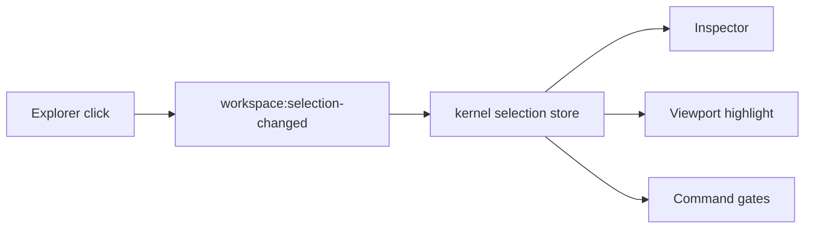

# Frontend v2 - Explorer View

**Status:** Proposed architecture
**Date:** 2026-05-11

## 1. Purpose

The explorer is the primary navigation and selection surface. It replaces scattered model tree, results tree, mesh tree, jobs tree, and diagnostics shortcuts with one module that renders multiple typed tree domains.

## 2. Explorer Tabs

| Tab | Contents |
|---|---|
| `Model` | universe, objects, materials, physics interactions, mesh policies, studies |
| `Resources` | live fields, meshes, quantities, scalar series, visualization resources |
| `Results` | artifacts, completed runs, analysis datasets, exported files |
| `Jobs` | active commands, runs, stages, queued work, failures |
| `Diagnostics` | API resources, cache entries, render resources, capability gates |

Tabs filter the same canonical resource graph. They are not separate state models.

## 3. Node Contract

Every explorer node uses a common shape:

```typescript
export interface ExplorerNode {
  id: string;
  kind: ExplorerNodeKind;
  label: string;
  icon: IconToken;
  parentId: string | null;
  children?: ExplorerNode[];
  resourceRef?: ResourceRef;
  selectionRef?: SelectionRef;
  status?: "ready" | "stale" | "running" | "failed" | "degraded" | "unsupported";
  capabilityGate?: CapabilityGate;
  contextCommands?: CommandId[];
}
```

Nodes are derived from resources. They are never the canonical model.

## 4. Selection Semantics

Selection is global and explicit:



Viewport picking uses the same event. Inspector focus requests use the same selection identity. Selection is not focus and not visibility.

## 5. Tree Rendering

Requirements:

- virtualize when row count exceeds a small fixed threshold;
- derive indentation from tree depth;
- keep row height stable;
- preserve expanded nodes per tab in explorer store;
- support keyboard navigation;
- support search/filter without mutating canonical resources;
- show stale/degraded/unsupported states;
- expose context menu commands from command registry.

## 6. Context Menus

Context menus render command registry entries whose `scope` and `selection` gates match the node.

Examples:

- object: rename, duplicate, assign material, isolate, focus in viewport, mesh settings;
- material: edit, duplicate, assign to selection, show references;
- mesh build: open report, rebuild, export mesh;
- field: set as viewport quantity, add chart if scalar-compatible, export;
- stage: run from here, disable, duplicate, inspect provenance.

No context menu item calls module-private functions directly.

## 7. Explorer Store

Allowed local state:

- active tab;
- expanded node ids by tab;
- filter text;
- selected keyboard row;
- context menu anchor;
- optional sort mode.

Forbidden local state:

- full scene document;
- field vectors;
- mesh topology;
- command completion snapshots;
- inspector draft state.

## 8. Performance

The explorer must not rebuild the full tree on every status tick. It rebuilds when the relevant resource revision changes:

- model tree from scene/model revision;
- resources tree from field/mesh/scalar/catalog revisions;
- results tree from artifact/analysis revisions;
- jobs tree from command/run/stage revisions;
- diagnostics tree from diagnostics/debug revisions.

Tree model builders are pure functions with tests.
