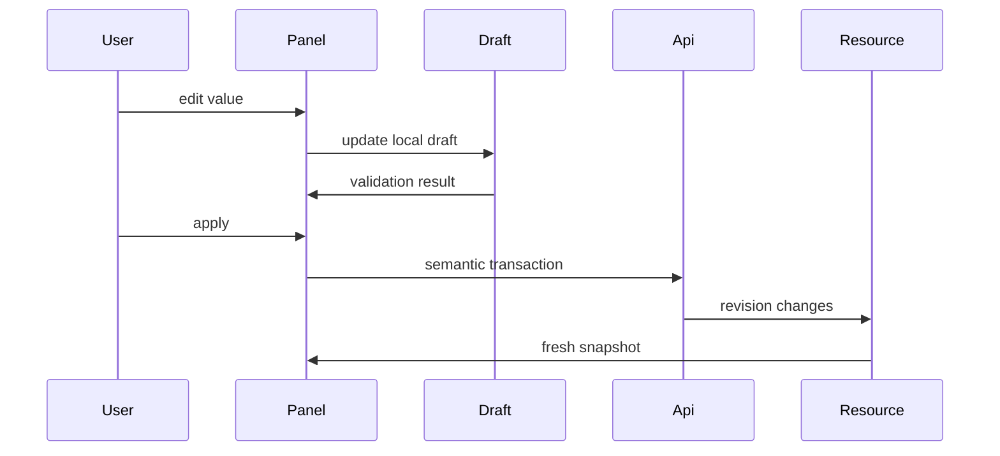

# Frontend v2 - Inspector and Property Editing

**Status:** Proposed architecture
**Date:** 2026-05-11

## 1. Purpose

The inspector edits or inspects the selected resource. It is not a second model store. It reads resource snapshots, creates local drafts, validates them, and commits semantic transactions.

## 2. Inspector Registry

Panels are registered by selection kind:

```typescript
export interface InspectorPanelContribution {
  id: string;
  title: string;
  selectionKinds: SelectionKind[];
  capabilityGate?: CapabilityGate;
  component: React.ComponentType<InspectorPanelProps>;
}
```

Examples:

- `geometry-object-panel`;
- `material-panel`;
- `physics-interaction-panel`;
- `universe-mesh-panel`;
- `object-mesh-panel`;
- `shared-domain-mesh-report-panel`;
- `study-stage-panel`;
- `run-provenance-panel`;
- `field-resource-panel`.

The inspector host chooses the best panel from selection, active context, and capability gates.

## 3. Draft Transaction Flow



Auto-apply is allowed only for safe display preferences. Physics, mesh, material, geometry, and study edits need explicit transaction semantics.

## 4. Validation

Validation layers:

1. input-level bounds and units;
2. panel-level consistency;
3. resource transaction validation;
4. planner/capability validation;
5. runtime rejection diagnostics.

The UI must not hide server/planner rejection behind a generic toast. It should pin the error to the relevant inspector field or section when possible.

## 5. Units and Physical Labels

Inspector fields show:

- symbol where useful;
- SI unit;
- display unit conversion if supported;
- allowed range;
- source of value: user, default, inherited, resolved, backend-reported;
- stale/degraded state when the resource revision is behind.

No frontend-only naming for canonical physics concepts.

## 6. Panel Composition

Panel files stay small:

```text
inspector/
  manifest.ts
  InspectorModule.tsx
  registry.ts
  panels/
    GeometryObjectPanel.tsx
    MaterialPanel.tsx
    PhysicsInteractionPanel.tsx
    ObjectMeshPanel.tsx
    StudyStagePanel.tsx
  primitives/
    InspectorSection.tsx
    FieldRow.tsx
    UnitNumberInput.tsx
    VectorInput.tsx
    ValidationMessage.tsx
```

Primitives are visual and form helpers only. They do not know Fullmag resource endpoints.

## 7. Undo and Revert

The first v2 implementation supports:

- revert draft to current resource snapshot;
- apply draft as a transaction;
- show dirty state.

Undo/redo requires a canonical transaction log. Do not fake undo by keeping hidden local copies of server resources.

## 8. Tests

Required tests:

- selected node chooses expected inspector panel;
- editing creates draft without mutating resource snapshot;
- validation blocks invalid local value;
- commit dispatches one semantic transaction;
- failed commit keeps draft and displays server error;
- successful commit refreshes from resource revision.
