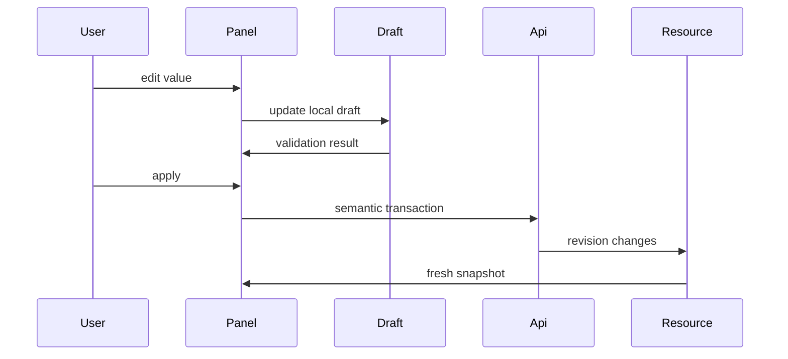

# Frontend v2 - Inspector and Property Editing

**Status:** Proposed architecture
**Date:** 2026-05-11

## 1. Purpose

The inspector edits or inspects the selected resource. It is not a second model store. It reads resource snapshots, creates local drafts, validates them, and commits semantic transactions.

## 2. Inspector Registry

Panels are registered by selection kind:

```typescript
export interface InspectorPanelContribution {
  id: string;
  title: string;
  selectionKinds: SelectionKind[];
  capabilityGate?: CapabilityGate;
  component: React.ComponentType<InspectorPanelProps>;
}
```

Examples:

- `geometry-object-panel`;
- `object-visualization-panel`;
- `airbox-visualization-panel`;
- `object-regions-panel`;
- `object-magnetic-parameters-panel`;
- `object-magnetic-texture-panel`;
- `physics-interaction-panel`;
- `universe-mesh-panel`;
- `object-mesh-panel`;
- `shared-domain-mesh-report-panel`;
- `study-stage-panel`;
- `run-provenance-panel`;
- `field-resource-panel`.

The inspector host chooses the best panel from selection, active context, and capability gates.

## 3. Draft Transaction Flow



Auto-apply is allowed only for safe display preferences. Physics, mesh, material, geometry, and study edits need explicit transaction semantics.

Per-object visualization edits are safe display preferences. They may auto-apply to the visualization registry because they do not mutate physics, mesh, material, geometry, study, or field resources. The panel must still show whether a value is inherited, overridden, or reset to default.

Geometry object edits are not safe display preferences. Creating an object, changing primitive dimensions, changing transform, deleting an object, changing mesh-affecting material/region data, and changing universe bounds use explicit transactions against the model API. The inspector keeps a local draft, validates SI units and primitive constraints, submits the transaction with the current scene revision, and refreshes from `model/scene` after commit.

## 4. Validation

Validation layers:

1. input-level bounds and units;
2. panel-level consistency;
3. resource transaction validation;
4. planner/capability validation;
5. runtime rejection diagnostics.

The UI must not hide server/planner rejection behind a generic toast. It should pin the error to the relevant inspector field or section when possible.

## 5. Units and Physical Labels

Inspector fields show:

- symbol where useful;
- SI unit;
- display unit conversion if supported;
- allowed range;
- source of value: user, default, inherited, resolved, backend-reported;
- stale/degraded state when the resource revision is behind.

No frontend-only naming for canonical physics concepts.

## 6. Panel Composition

Panel files stay small:

```text
inspector/
  manifest.ts
  InspectorModule.tsx
  registry.ts
  panels/
    GeometryObjectPanel.tsx
    ObjectVisualizationPanel.tsx
    ObjectRegionsPanel.tsx
    ObjectMaterialPanel.tsx
    ObjectMagneticTexturePanel.tsx
    PhysicsInteractionPanel.tsx
    ObjectMeshPanel.tsx
    StudyStagePanel.tsx
  primitives/
    InspectorSection.tsx
    FieldRow.tsx
    UnitNumberInput.tsx
    VectorInput.tsx
    ValidationMessage.tsx
```

Primitives are visual and form helpers only. They do not know Fullmag resource endpoints.

## 7. Undo and Revert

The first v2 implementation supports:

- revert draft to current resource snapshot;
- apply draft as a transaction;
- show dirty state.

Undo/redo requires a canonical transaction log. Do not fake undo by keeping hidden local copies of server resources.

## 7.1 Geometry Object Panel Requirements

`GeometryObjectPanel` covers:

- identity, name, and region name;
- primitive type and type-specific dimensions in SI units;
- position, rotation, and scale where supported;
- material and magnetization references as object-owned refs;
- mesh status and stale/building/failed diagnostics;
- links to object mesh settings, report, and quality resources;
- scene revision and last successful mesh-build source scene revision when available.

For a new object, Apply commits the create transaction, selects the committed object, and lets the viewport render it in primitive mode before mesh topology exists. Failed commits keep the draft and show the backend error near the responsible field or section.

## 7.2 Per-Object Authoring Panels

Object selections expose required authoring panels:

- `object.regions`: reads `model/scene` and `model/regions`, patches `/v2/sessions/current/model/regions/{region_id}`, and invalidates scene, regions, geometry diagnostics, and mesh build resources.
- `object.magnetic-parameters`: reads the selected object from `model/scene`, reads the assigned material asset through `/v2/sessions/current/model/materials/{material_id}`, patches object `material_ref` through `/model/objects/{object_id}`, and patches material scalar parameters through `/model/materials/{material_id}`.
- `object.physics`: reads and patches `/v2/sessions/current/model/objects/{object_id}/interactions/{interaction_kind}` for required and optional interaction entries.
- `object.magnetic-texture`: reads the object `magnetization_ref` and referenced `magnetization_assets` from `model/scene`, patches the object reference through `/model/objects/{object_id}`, and treats texture asset editing as deferred until a typed magnetization-asset endpoint exists.

The inspector may show material and texture assets, but they are secondary resources owned by object context in the workspace. A standalone top-level Materials branch in the Model explorer is not the canonical navigation path.

## 8. Tests

Required tests:

- selected node chooses expected inspector panel;
- editing creates draft without mutating resource snapshot;
- validation blocks invalid local value;
- commit dispatches one semantic transaction;
- failed commit keeps draft and displays server error;
- successful commit refreshes from resource revision.
- visualization panel edits update the same target registry observed by the View ribbon and viewport.
- new-object create flow keeps draft state isolated before commit, selects the committed object after refresh, and marks the object primitive-only or mesh-stale until mesh resources catch up.
