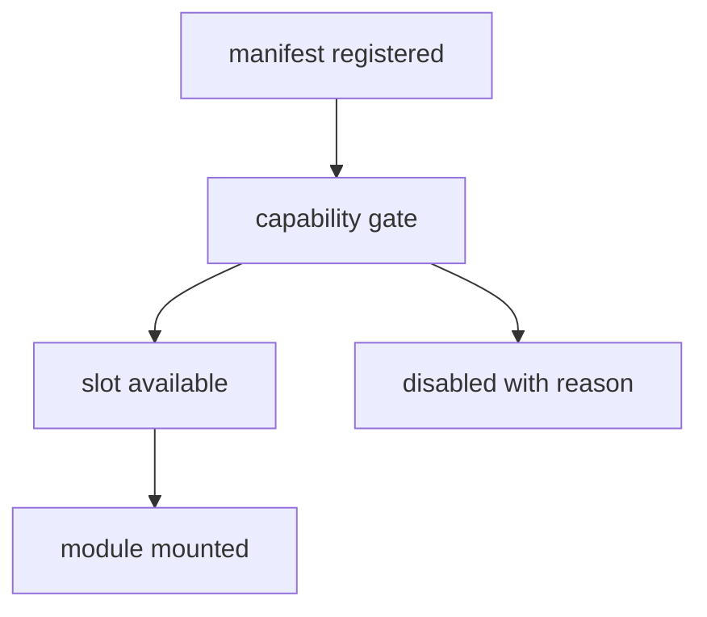

# Frontend v2 - Feature Flags and Module Lifecycle

**Status:** Proposed architecture
**Date:** 2026-05-11

## 1. Principle

Module registration is the primary enable/disable mechanism. Feature flags are temporary rollout controls with owners and removal criteria.

## 2. Module Enablement

A disabled module does not break the shell. It leaves an empty slot, fallback module, or explanatory unavailable panel.

## 3. Feature Flag Contract

Every feature flag needs:

- name;
- owner;
- default value;
- scope: development, experimental, rollout, emergency kill switch;
- affected modules;
- removal condition;
- target removal date or cutover phase.

Flags without removal criteria are not allowed.

## 4. Capability Gates vs Feature Flags

| Mechanism | Meaning |
|---|---|
| Capability gate | runtime/server/session cannot support the feature now |
| Feature flag | product team intentionally disabled or staged the feature |
| Module registration | build/config chooses whether module exists in this frontend |
| User preference | user changes layout or display preference |

Do not use user preferences or feature flags to hide missing runtime capability.

## 5. Module Lifecycle States

| State | UI behavior |
|---|---|
| registered | appears in available module catalog |
| eligible | capability gate passes |
| active | mounted in slot |
| suspended | not visible but retained in layout config |
| disabled | not registered or blocked by flag |
| unsupported | runtime capability missing |
| faulted | error boundary caught failure |

The shell must show `unsupported` and `faulted` differently.

## 6. Kill Switches

Emergency kill switches are allowed for:

- viewport 3D renderer;
- binary data plane;
- experimental analysis module;
- managed runtime automation.

Kill switches must degrade to an explanatory panel and diagnostics entry. They must not silently fall back to legacy preview paths.

## 7. Legacy Sunset

Legacy status phases:

1. `reference` - old app readable and runnable for comparison.
2. `shadowed` - v2 is default, old app behind explicit legacy command.
3. `frozen` - no new features or bug fixes except data recovery.
4. `removed` - old app deleted or moved out of active repo path.

Each phase change requires updating AGENTS, docs, scripts, and CI.
