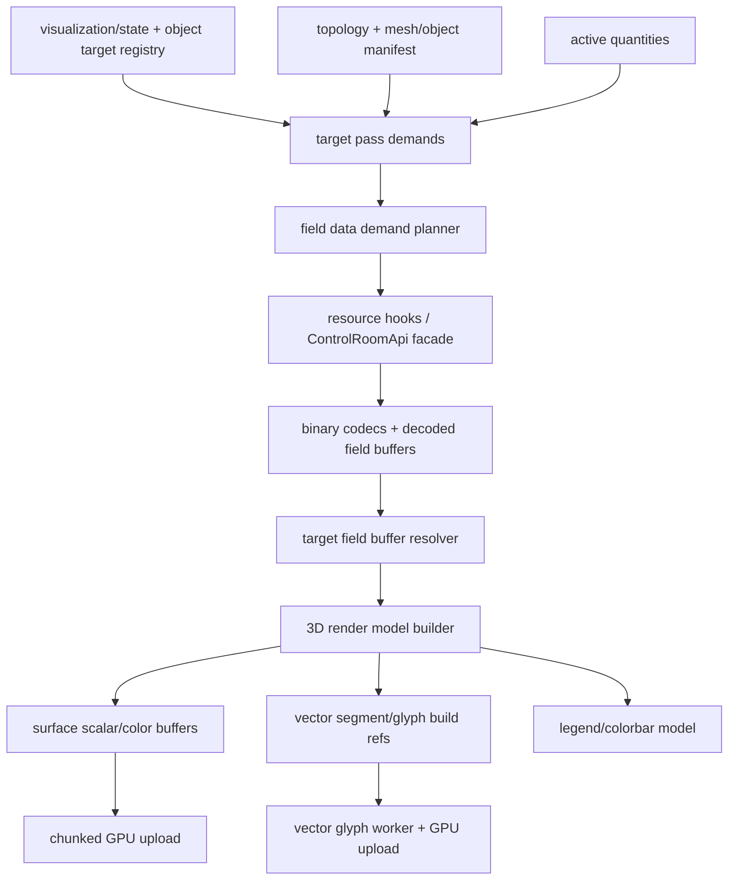

# Frontend v2 - 3D Viewport Field Data Architecture

**Status:** Proposed production architecture  
**Date:** 2026-06-25  
**Scope:** `apps/control-room` 3D field, scalar surface, vector glyph, colorbar, scoped data, worker, cache, and update lifecycle

## 1. Purpose

The 3D viewport has to render several independent visual passes over the same physical field:

- surface shader colors;
- vector glyphs;
- scalar/colorbar metadata;
- airbox vectors and airbox surfaces;
- future slices, probes, and overlays.

These passes must not accidentally define separate data contracts. A target that shows both a scalar surface and vector arrows reads one coherent field payload whenever one payload can satisfy both passes. The viewport must never fetch a scalar component and then discover that vector arrows need a second copy of the same target's field. It must also never render vector arrows from a component-only scalar payload.

This document defines the production contract from visualization state to API requests, decoded buffers, render models, GPU uploads, workers, colorbars, and diagnostics.

## 2. Core Rule

Every visible target produces a **pass demand**. Pass demands are merged into a **field data demand** before any request is made.

The merge is conservative:

1. If any active pass for a target needs vector components, the field data demand is `component=full`.
2. If all active passes for a target need the same scalar component, the demand may be `component=x`, `component=y`, `component=z`, or `component=magnitude`.
3. If active passes need different scalar components, orientation, vector glyphs, or any vector-derived mode, the demand is `component=full`.
4. If a target has only vector glyphs and no per-vertex surface shader field, the demand may be sampled with `max_samples`.
5. If a target has a surface shader that needs field values at mesh vertices, the demand must be unsampled for that target, even when vectors are also visible.

The renderer then derives all pass-specific buffers from the chosen payload. It does not request a second equivalent payload for convenience.

## 3. Terminology

| Term | Meaning |
|---|---|
| target | Canonical visualization target: object, part fallback, airbox, FDM domain, or future slice target. |
| pass | A visual layer that needs target data: surface shader, vector glyphs, colorbar, wireframe, points, bounds. |
| pass demand | One pass's data requirement for one target. |
| field data demand | The merged requestable data contract for one quantity/scope after all pass demands are considered. |
| payload | One decoded field resource from the v2 data plane. |
| full vector payload | Field payload with all vector components required to derive x, y, z, magnitude, orientation, and vector glyphs. |
| scalar component payload | Field payload with one scalar component such as x, y, z, or magnitude. |
| sampled payload | Payload with fewer points than the target topology, valid for glyph placement only unless explicitly tagged otherwise. |
| render plan | Which targets and passes should be drawn. |
| fetch plan | Which resources must be fetched to satisfy the render plan. |

The render plan and fetch plan are separate. The render plan keeps vector budgets, visibility, palette, range, and style. The fetch plan uses those settings only to choose the smallest correct payload.

## 4. Data Ownership



Ownership rules:

- v2 HTTP resources own snapshots and binary field payloads.
- Websocket events only invalidate resources; they are not a second field transport.
- Resource hooks own loading, aborting, caching, and stale-payload handling.
- The render model owns pass-specific derived buffers.
- R3F layers own Three.js objects and GPU resources.
- React state must not hold large typed arrays, geometries, textures, or materials.

## 5. Pass Demand Model

Each target emits demands from active passes.

### 5.1 Surface Shader Pass

Surface shader demand depends on `surfaceColorSource`.

| Surface mode | Minimum payload when vectors are off | Payload when vectors are on |
|---|---|---|
| solid | none | full or sampled vector payload, depending on vector-only rules |
| x component | scalar x | full vector |
| y component | scalar y | full vector |
| z component | scalar z | full vector |
| magnitude | scalar magnitude | full vector |
| orientation / HSL sphere | full vector | full vector |
| complex phase modes | full or complex payload according to analysis overlay | full or complex payload according to analysis overlay |

When surface shader is active, the payload must cover the surface's required vertex domain. `max_samples` is not valid for shader coloring unless the payload explicitly contains a complete value-to-vertex mapping for that surface.

### 5.2 Vector Glyph Pass

Vector glyph demand always requires full vector components. The pass may use:

- sampled payload when glyphs are the only field-valued pass for the target;
- unsampled full payload when a surface shader for the same target already requires complete field data;
- existing aggregate full payload when that payload covers the target's node selection.

Vector glyph demand must never be satisfied by `component=x`, `component=y`, `component=z`, or `component=magnitude`.

### 5.3 Colorbar Demand

A colorbar is not a separate field payload demand by default. It consumes range metadata from:

1. scoped field metadata endpoint for numeric scalar modes when available;
2. the decoded complete target payload when metadata is unavailable;
3. retained previous range while a compatible update is pending.

Colorbar range for orientation/HSL modes is style-defined, not computed from scalar min/max.

### 5.4 Wireframe, Points, Bounds, Selection

These passes consume topology and visualization style. They must not request field data.

## 6. Field Data Demand Merge

The planner groups pass demands by:

- session id;
- quantity id;
- snapshot/stage query;
- target scope id and scope kind;
- topology revision;
- required component class;
- completeness requirement;
- sampling budget.

The result is the smallest correct set of field requests.

### 6.1 Merge Matrix

| Active passes for one target | Correct request |
|---|---|
| shader solid only | no field request |
| shader x only | `component=x`, unsampled |
| shader y only | `component=y`, unsampled |
| shader z only | `component=z`, unsampled |
| shader magnitude only | `component=magnitude`, unsampled |
| shader orientation only | `component=full`, unsampled |
| vectors only | `component=full`, sampled by vector budget |
| shader solid + vectors | `component=full`, sampled by vector budget |
| shader x + vectors | `component=full`, unsampled |
| shader y + vectors | `component=full`, unsampled |
| shader z + vectors | `component=full`, unsampled |
| shader magnitude + vectors | `component=full`, unsampled |
| shader orientation + vectors | `component=full`, unsampled |
| two scalar components on same target | `component=full`, unsampled |
| same scalar component on all visible targets of one quantity | aggregate `component=<component>`, unsampled, if scope semantics match |
| different per-object modes on same quantity | scoped requests or full aggregate request, whichever is smaller and complete |

The rule intentionally prefers correctness over a smaller scalar payload when a vector pass exists. Rendering quality must not be reduced to avoid a full vector fetch.

### 6.2 Aggregate vs Scoped Requests

Aggregate full-domain requests are valid when:

- all visible targets use the same quantity and compatible scope;
- a single payload covers every target selection without ambiguous index mapping;
- the payload is cheaper than many scoped requests or is already needed by another pass.

Scoped requests are valid when:

- only a subset of targets needs field data;
- targets use different quantities;
- targets use different scalar modes and no complete aggregate payload is otherwise needed;
- airbox and magnetic object data have different scope contracts;
- vector-only targets can be sampled.

The planner must avoid duplicate equivalent requests. If an unsampled full aggregate payload already covers target A, target A must not also request `component=x` for its shader or a sampled full payload for its vectors.

## 7. Required Buffer Model

The viewport should use explicit buffer roles instead of one ambiguous `partFieldVectors` bucket.

```typescript
type FieldPayloadCapability =
  | "full-vector-complete"
  | "full-vector-sampled"
  | "scalar-complete";

interface TargetFieldBuffer {
  targetId: string;
  quantityId: string;
  scopeId: string;
  scopeKind: "full" | "object" | "part" | "airbox" | "selection";
  component: "full" | "x" | "y" | "z" | "magnitude";
  capability: FieldPayloadCapability;
  fieldRevision: string | null;
  topologyRevision: string | null;
  pointCount: number;
  vectorComponentCount: number;
  values: Float32Array | Float64Array;
}
```

Layer eligibility must be explicit:

- surface shader can consume `scalar-complete` or `full-vector-complete`;
- vector glyphs can consume `full-vector-complete` or `full-vector-sampled`;
- colorbar can consume metadata, `scalar-complete`, or `full-vector-complete`;
- no pass can silently consume an incompatible buffer.

If the current implementation keeps a single map during migration, the map values must still carry enough metadata to reject invalid consumers. A `DecodedFieldVector` with `nComp=1` must not be passed to the vector glyph build path.

## 8. Render Plan vs Fetch Plan

This separation is mandatory.

The render plan preserves:

- target visibility;
- shader visibility;
- vector visibility;
- vector budget;
- vector length scale;
- vector centering;
- vector surface offset;
- surface color mode;
- palette;
- scalar range;
- colorbar visibility;
- geometry scope.

The fetch plan may remove a target from the primary aggregate field request if that target is satisfied by a scoped request. It must not remove the target's vector budget from the render plan. Losing the budget from the render plan means the endpoint may fetch the right vector data while the renderer still produces no glyphs.

Correct lifecycle:

1. Build render plan from visualization state.
2. Build fetch plan by merging data demands.
3. Fetch/decode payloads.
4. Resolve target field buffers from fetched payloads.
5. Build render model from the render plan plus resolved buffers.
6. Draw only the passes whose buffers satisfy eligibility.

## 9. Per-Object Quantities

Each target may have its own active quantity. The planner must treat quantity as part of the demand key.

Examples:

- object A: `m`, surface x, vectors on;
- object B: `m`, orientation, vectors off;
- object C: `H_eff`, vectors on.

Correct plan:

- object A needs `m/full`, unsampled;
- object B can share `m/full` with A if aggregate is cheaper and complete, otherwise scoped `m/full`;
- object C needs `H_eff/full`, sampled only if no shader needs complete values.

The render model must not force non-primary quantity targets into the primary quantity's scalar mode set. Non-primary target data remains target-scoped unless a deliberate aggregate request for that quantity exists.

## 10. Colorbars and Legends

The colorbar model is derived from visible shader passes, not from global viewport state.

A legend group key is:

```text
quantityId | component/mode | palette | rangeRevision | scopeKind | scopeId-set | targetVisualizationRevision
```

Rules:

- The Inspector always shows the selected target's colorbar/range when that target has a shader field mode.
- Viewport colorbars are opt-in per target or group via "Add colorbar to viewport".
- Multiple targets with identical legend group keys may share one viewport colorbar.
- Targets with different quantities, modes, palettes, ranges, or scoped metadata need separate colorbars.
- While a field update is pending, retain the last compatible colorbar instead of unmounting/remounting it.
- A missing range is a degraded metadata state, not a reason to destroy the colorbar component.

This prevents flicker where colorbars disappear during solver updates and reappear after metadata arrives.

## 11. Worker and GPU Pipeline

Heavy derived work must not run synchronously on the main thread for large fields.

### 11.1 Scalar Color Buffers

Scalar color construction should run off-main-thread when field or topology size crosses the chunk threshold. Results should stream progressively by target/mode when possible:

- global mode result can update global consumers immediately;
- per-target mode result can update that target without waiting for unrelated targets;
- stale jobs are cancelled by revision key;
- retained compatible buffers remain visible while replacement buffers are building.

### 11.2 Vector Glyphs

Vector glyph transform construction belongs in a worker. The main thread may only:

- retain/release derived buffer handles;
- perform bounded chunked GPU uploads;
- invalidate the viewport with a specific dirty reason.

Glyph build keys must include:

- quantity id;
- component class, always full for glyphs;
- field revision;
- topology revision;
- target visualization revision;
- scope id and scope kind;
- vector budget;
- vector scale and anchoring;
- style revision.

### 11.3 GPU Uploads

GPU uploads are frame-budgeted:

- no monolithic upload for large color/glyph buffers;
- upload manager batches by dirty reason and target;
- shader/material uniform changes do not recreate geometry;
- topology changes release geometry; field changes update attributes/textures.

## 12. Stale and Pending States

The viewport distinguishes:

- `available`: compatible current payload is present;
- `pending`: a newer compatible payload is loading/building;
- `stale-compatible`: old payload can still be shown until replacement is ready;
- `unavailable`: no compatible payload exists;
- `incompatible`: payload exists but cannot satisfy this pass.

For `pending` and `stale-compatible`, keep rendering the last compatible visual buffer. Do not flash to white, hide vector arrows, or unmount colorbars. For `incompatible`, show the pass as degraded and report the reason in diagnostics.

## 13. FDM and FEM

The renderer remains domain-neutral.

FEM:

- target scopes come from object/part mappings in mesh topology;
- surface shader uses mesh vertex/node selection;
- vector glyphs use surface or full target node selection according to geometry scope;
- airbox can have a separate scope and synthetic fallback only when explicitly enabled.

FDM:

- the FDM domain is one target unless future region/object mapping is introduced;
- voxel surface colors and vector glyphs use the same demand merge rules;
- vector-only FDM can use sampled full vectors;
- topography or threshold passes may require full or magnitude payloads according to their own pass demand.

FDM/FEM differences belong in domain adapters and render-model builders, not in React layer forks.

## 14. API Contract

Field data remains in the v2 data family.

Minimum request parameters:

- `quantityId`;
- `component`: `full | x | y | z | magnitude`;
- `scope_kind`: `full | object | part | airbox | selection`;
- `scope_id` when scope is not full;
- `max_samples` only for sampled vector-only demands;
- snapshot/stage query when replaying historical data.

Required response metadata:

- quantity id;
- component;
- scope id and kind;
- point count;
- component count;
- field revision or ETag;
- enough topology/sampling metadata to prove whether the payload is complete or sampled.

Frontend code must call this only through the typed API facade and resource hooks. React components must not build `/v2/...` paths directly.

## 15. Diagnostics

Viewport diagnostics must expose:

- pass demand list by target;
- merged field data demand list;
- actual request list;
- payload capabilities after decode;
- pass eligibility failures;
- retained stale-compatible buffers;
- worker queue durations by lane;
- GPU upload batch durations;
- colorbar group keys and range sources;
- duplicate request detector for equivalent payloads.

The diagnostic report should be able to answer:

- why a target fetched `component=full`;
- why a target was allowed to fetch a scalar component;
- whether shader and vectors shared one payload;
- why a vector pass was hidden or degraded;
- why a colorbar is retained, pending, unavailable, or incompatible.

## 16. Failure Modes This Architecture Forbids

1. Surface shader switches to `x` and vector glyphs disappear because the target field buffer became scalar-only.
2. A scoped vector request fetches correct data but the renderer has no vector budget because the fetch planner removed it.
3. The same object fetches both `component=x` and `component=full` for the same revision when full already satisfies both shader and vectors.
4. Colorbar components unmount during every solver field update.
5. Different objects overwrite each other's surface color mode, palette, range, or vector budget.
6. A global scalar mode leaks into non-primary quantity targets.
7. Large color transforms run synchronously in the render model and freeze the browser.
8. A sampled vector-only payload is used as a per-vertex shader source.
9. Airbox and magnetic object requests are merged without preserving scope semantics.
10. Realtime events carry field arrays instead of invalidating HTTP resources.

## 17. Implementation Shape

The production refactor should introduce these boundaries:

1. `Viewport3DPassDemandPlanner`
   - input: topology render model, target visualization settings, active quantities, analysis overlay, FDM/FEM adapter state;
   - output: normalized pass demands.

2. `Viewport3DFieldDemandPlanner`
   - input: pass demands;
   - output: merged fetch plan plus render-plan annotations.

3. `Viewport3DFieldResourceResolver`
   - input: fetch plan and resource hook results;
   - output: target field buffers with explicit capabilities.

4. `Viewport3DRenderModelBuilder`
   - input: render plan plus target field buffers;
   - output: surface buffers, vector build references, colorbar groups, and degradation diagnostics.

5. `Viewport3DLayerRuntime`
   - input: render model;
   - output: R3F objects, worker jobs, GPU uploads, dirty-frame invalidations.

These are logical boundaries. They do not require five large classes, but the responsibilities must be testable separately.

## 18. Required Tests

Unit tests:

- shader x only produces scalar x request;
- shader x plus vectors produces one full unsampled request;
- solid plus vectors produces full sampled request;
- orientation plus vectors produces one full unsampled request;
- vector-only scoped object keeps vector budget in render plan and excludes only the primary fetch plan;
- non-primary quantity target preserves per-target scalar mode without polluting global scalar modes;
- sampled vector payload is rejected for shader pass;
- scalar component payload is rejected for vector glyph pass;
- equal colorbar group keys share one viewport colorbar;
- different per-target range/palette/quantity creates separate colorbars;
- pending field update retains compatible surface, vector, and colorbar buffers.

Integration tests:

- changing one object's surface mode does not change other objects' modes;
- enabling vectors for one object does not refetch unrelated targets;
- disabling vectors while keeping shader component switches request from full to scalar component;
- solver update replaces buffers without white flicker or colorbar remount;
- topology revision rebuilds topology resources, field revision does not.

Browser/performance tests:

- boot diagnostic contains no duplicate equivalent field requests for shader+vector target;
- camera interaction remains responsive while scalar/vector workers build;
- idle viewport reaches zero frames after settling;
- memory stress has bounded derived buffer and WebGL resource counts.

## 19. Migration Plan

1. Add demand planner tests that describe the merge matrix before changing fetch behavior.
2. Split render plan from fetch plan in the existing scene-model hook.
3. Add explicit payload capability metadata after field decode.
4. Route vector glyphs only through full-vector-capable buffers.
5. Route shader surfaces through complete scalar or full-vector buffers.
6. Replace ambiguous `partFieldVectors` usage with target field buffer resolution.
7. Add colorbar group model and retention state.
8. Add duplicate request diagnostics.
9. Move large per-target scalar builds behind the worker/chunked path.
10. Run targeted unit tests, full control-room tests, and live browser smoke with vectors+shader enabled on multiple objects.

## 20. Acceptance Criteria

The architecture is implemented when all of the following are true:

- A target with shader component and vectors enabled fetches one full complete payload and renders both passes from it.
- A target with shader component and vectors disabled fetches only that scalar component.
- A target with vectors only can fetch sampled full vectors.
- Per-object quantity, scalar mode, palette, vector visibility, vector budget, and colorbar settings are isolated.
- No solver field update causes white surface flicker, vector disappearance, or colorbar unmount when a compatible previous buffer exists.
- Diagnostics can prove why each field request exists.
- Typecheck, lint, focused viewport tests, resource hook tests, full control-room test suite, and browser smoke pass.
