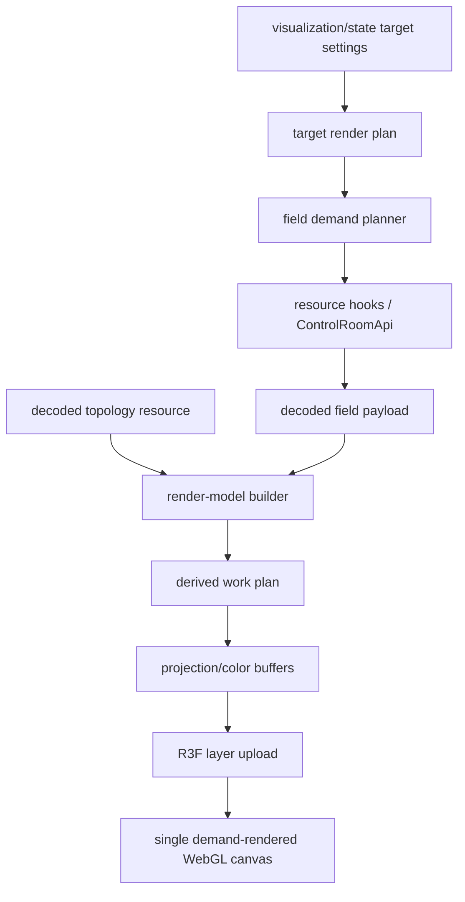

# Frontend v2 - 3D Viewport Surface Field Projection

**Status:** Proposed production visualization contract
**Date:** 2026-06-27
**Scope:** `apps/control-room` 3D surface shader field projection, face
coloring, thickness averaging, per-target visualization state, render-model
derived buffers, inspector status, diagnostics, and browser proof

## 1. Purpose

The 3D viewport currently colors mesh surfaces from nodal field values. That is
faithful for many views, but it is not sufficient for diagnosing thin-film FEM
fields when values vary strongly through thickness. A field can look noisy,
striped, or nearly antiferromagnetic in HSL orientation because top and bottom
surface layers carry opposite vector directions, or because per-vertex
interpolation visually blends values that need to be inspected as face-local
data.

This document defines explicit surface projection modes for the object
visualization inspector, v2 visualization state, render plan, render-model
derived buffers, and R3F upload path. The goal is professional diagnostic
clarity: the viewport must make clear which field representation is being
shown, where the data came from, which values were projected, and which faces
are degraded. It must not hide solver data or quietly smooth away physically
meaningful through-thickness structure.

This is a visualization contract, not a solver contract. Solver output, field
units, field payload ownership, and physical semantics remain owned by the
runtime/data plane.

## 2. Design Standard

The target quality bar is comparable to a commercial scientific workstation:
calm, inspectable, predictable, and fast. In this context, "COMSOL-grade" means
the following engineering properties, not decorative rendering:

- the selected representation is explicit in the UI and diagnostics;
- color ranges and legends describe the values actually being displayed;
- undefined orientation, missing data, stale data, and unsupported projection
  are visually and textually distinct;
- topology, field payloads, projection buffers, and GPU resources have separate
  ownership and revision identities;
- switching projection modes does not refetch topology or rebuild unrelated
  targets;
- visual polish improves data readability without creating a second physical
  model.

## 3. Non-Goals

- Do not change solver output, field units, or physical semantics.
- Do not introduce a second field API, direct component `fetch()`, or a
  screen-shaped endpoint.
- Do not store field arrays, topology arrays, Three.js resources, or projected
  buffers in React state, React context, Zustand module stores, or persisted
  workspace layout.
- Do not make thickness averaging the default. Averaging can hide real
  antisymmetric structure.
- Do not silently smooth HSL orientation when vector norm is near zero.
- Do not claim exact high-order FEM surface projection. The first implementation
  is a nodal/P1 diagnostic projection over the payload currently available to
  the browser.
- Do not fork the renderer into FEM-only and FDM-only product paths. Domain
  differences stay in adapters and render-model builders.

## 4. User-Facing Controls

Add a compact `Projection` segmented control under:

```text
Inspector -> Visualization -> Surface Coloring
```

Initial modes:

| Mode | Value | Meaning | Intended use |
|---|---|---|---|
| `Raw nodal` | `raw_nodal` | Current behavior: color topology vertices from nodal field values and let the indexed surface interpolate them. | Default faithful view and regression baseline. |
| `Surface faces` | `surface_faces` | Color each boundary triangle from the average of that face's own boundary-node values, with flat face color. | Inspect the actual rendered surface without through-thickness projection or vertex interpolation artifacts. |
| `Thickness avg Z` | `thickness_average_z` | Group complete target field values by approximate world `(x, y)` columns, average over world `z`, then color surface faces from projected values. | Diagnose top/bottom cancellation and through-thickness antisymmetry in thin films lying in the viewport `xy` plane. |

`Raw nodal` remains the default. Existing sessions and new targets must resolve
to `raw_nodal` unless the user explicitly selects another projection.

The control is enabled only when the surface shader uses a field-valued color
source. It remains visible but disabled for `solid`, so the user can see that
projection is a field-surface concept.

The inspector must keep this section operationally dense:

```text
Surface Coloring
  Color source: HSL orientation | X | Y | Z | Magnitude | Colormap | Solid
  Projection: Raw nodal | Surface faces | Thickness avg Z
  Color map / range
  Viewport colorbar
  Field status
```

Do not add long instructional copy inside the panel. Use short labels,
tooltips, and diagnostic rows.

## 5. State And API Ownership

Projection mode is per-target visualization display state. It is not physics
state and it is not a data-plane field resource.

Production state ownership:

- `visualization/state` owns the configured per-target projection mode.
- `VisualizationResolvedTargetSettings` exposes the effective projection mode.
- `VisualizationTargetStyleOverride` patches the configured projection mode.
- The frontend `ObjectVisualizationController` is a resolver/cache around the
  v2 resource. It may provide immediate local feedback while the v2 revision is
  pending, but it must not become a second persistence model.
- Workspace layout, module stores, and inspector draft state may keep only
  transient UI affordances, never field/topology/projected typed arrays.

Required v2 schema shape:

```rust
#[serde(rename_all = "snake_case")]
pub enum SurfaceFieldProjectionMode {
    RawNodal,
    SurfaceFaces,
    ThicknessAverageZ,
}
```

`VisualizationResolvedTargetSettings` and `VisualizationTargetStyleOverride`
must expose:

```text
surface_projection_mode: raw_nodal | surface_faces | thickness_average_z
```

The OpenAPI v2 schema, generated frontend types, handwritten facade/types,
visualization controller normalization, remote patch mapping, and tests must
move together. A short-lived frontend-only prototype is acceptable only behind
an explicit temporary implementation note; it is not the production end state.

Realtime events remain invalidation-only. A projection patch may invalidate
`visualization/state`; it must not advance field payload revisions, mesh
topology revisions, `domain_generation_id`, or websocket field-sample freshness.

## 6. Data Flow

Projection mode follows the existing resource-first viewport path:



Rules:

- The field demand planner still requests the same field payload required by
  the selected quantity and color source; projection mode may strengthen
  completeness requirements but must not create a second field API.
- Projection derivation consumes decoded topology and decoded field buffers.
- Projection output is render-side derived data. It is cacheable by render
  identity, but it is not a canonical resource and is not persisted as
  simulation output.
- R3F layers upload derived attributes/geometries to GPU and release them on
  topology, field, style, projection, or module changes.
- Topology rebuilds remain separate from field-buffer/projection updates.

## 7. Projection Semantics

### 7.1 Raw Nodal

`Raw nodal` keeps the existing contract:

```text
vertex_value[node_i] = field[node_i]
triangle color = interpolated shader result over indexed surface geometry
```

This mode is useful for seeing exact nodal values and interpolation artifacts.
It must not smooth, denoise, average, or reinterpret the field. It is also the
regression baseline for existing viewport behavior.

### 7.2 Surface Faces

`Surface faces` uses only the boundary face being drawn. For each surface
triangle:

```text
face = (node_a, node_b, node_c)
field_face = average(field[node_a], field[node_b], field[node_c])
color_face = color(field_face)
```

The rendered result must be flat per face. Neighboring triangles must not blend
their field values through shared vertex interpolation.

Implementation contract:

- Build a target-local `face_expanded_surface` render geometry, or an
  equivalent shader input with provable flat per-face semantics.
- If face-expanded geometry is used, duplicate three positions per boundary
  triangle and write the same projected scalar/vector value to the three
  expanded vertices.
- The source topology is not refetched and not rebuilt; the expanded geometry is
  a disposable render-side derived geometry keyed by topology/projection/style.
- Picking must preserve the original boundary face identity. Expanded geometry
  must carry enough face mapping to resolve selection back to the canonical
  mesh part/face.

This mode must not average top and bottom surfaces together. If the top surface
has `+z` and the bottom surface has `-z`, `Surface faces` must show those as
two distinct face sets.

### 7.3 Thickness Average Z

`Thickness average Z` is a diagnostic projection, not a physical boundary
condition and not a solver observable. It approximates a world-Z column average:

```text
field_projected(x, y) = average_z(field(x, y, z))
```

The initial axis is fixed to world `Z`. The mode is intended for thin films in
the viewport `xy` plane. It must report a degraded warning if the target bounds
do not look like a world-Z thin film, for example when the `z` extent is not the
smallest extent or when insufficient depth samples exist per `(x, y)` column.

For unstructured FEM meshes, exact columns are not guaranteed. The production
browser implementation must use deterministic tolerance-based spatial binning:

1. Normalize node positions into the target bounds.
2. Compute a projection tolerance from the median local surface edge length when
   available, otherwise from the bounding-box diagonal and node count.
3. Build stable world `(x, y)` bins using sorted keys, not insertion-order
   dependent object iteration.
4. Average scalar components or vector components across all complete target
   nodes in each bin, including interior nodes when the payload covers them.
5. For each boundary face, look up the projected values for its three boundary
   nodes and average those projected values into the face value.

If a surface node cannot be matched to a projected bin, the face must degrade to
the missing-data color and emit diagnostics. It must not fall back silently to
raw nodal coloring.

Future axis modes (`X`, `Y`, object-local normal, mesh normal, selected plane,
or camera-facing projection) require a separate design update because their
validity depends on geometry metadata and user intent.

## 8. Vector And HSL Rules

HSL orientation is meaningful only when the displayed vector has a meaningful
norm. Opposite vectors can average to a near-zero vector; assigning an arbitrary
hue in that case is misleading.

For vector-valued color sources:

```text
vector_projected = average(v_i)
norm_projected = |vector_projected|
```

Rules:

- If `norm_projected >= epsilon`, color from `vector_projected`.
- If `norm_projected < epsilon`, render the low-confidence orientation color,
  not an arbitrary hue.
- Low norm after projection, missing data, and unsupported payload must be
  distinct diagnostic states.

Epsilon is scale-aware:

| Quantity family | Suggested epsilon |
|---|---|
| reduced magnetization `m` | fixed `1e-3` on projected vector norm |
| physical vector fields such as `H_ex`, `H_demag`, `H_eff`, `torque` | relative threshold such as `1e-3 * p99(|v_projected|)` with a finite lower bound |
| unknown vector quantity | relative threshold from finite projected norm distribution |

Shader constants such as `1e-30` are valid only for guarding division by zero.
They are not sufficient for diagnostic low-confidence orientation.

Scalar component modes (`x`, `y`, `z`) average the scalar component.
`magnitude` must be computed from averaged vectors when a full-vector payload is
present. When only a scalar magnitude payload is available, the projection may
average scalar magnitudes, and diagnostics must record that range/source.

## 9. Field Payload Requirements

Projection modes do not weaken payload completeness.

| Projection | Required payload |
|---|---|
| `raw_nodal` | Same as current surface shader demand. |
| `surface_faces` | Complete unsampled payload covering every boundary face node drawn by the selected target. |
| `thickness_average_z` | Complete unsampled payload covering all target nodes needed for world-Z columns, including interior nodes when the selected target has thickness samples. |

`sampled_node_indices` is not sufficient for any surface projection. It remains
valid for vector glyphs only.

`explicit_node_indices` is valid only when a complete node-index map is present
and the mesh topology hash/revision matches the current topology. Projection
code must build a global-node-to-field-index map before deriving face or
thickness values.

`legacy_count_only` may serve `raw_nodal` only under the existing compatibility
rules. It must not serve `surface_faces` or `thickness_average_z` unless the
resource cache or adapter has proven full-domain topology compatibility.

If the current field payload cannot satisfy the selected projection, the
surface pass is degraded/unavailable. It must not render a visually plausible
fallback using a different projection mode.

## 10. Render-Model Contract

Projection mode is explicit:

```typescript
type SurfaceFieldProjectionMode =
  | "raw_nodal"
  | "surface_faces"
  | "thickness_average_z";
```

The target render plan carries the effective mode:

```typescript
interface Viewport3DTargetRenderPlan {
  shader: {
    projectionMode: SurfaceFieldProjectionMode;
    scalarColorMode: string | null;
    surfaceColorSource: SurfaceColorSource;
    visible: boolean;
    // existing fields omitted
  };
}
```

The render model must distinguish raw vertex buffers from projected surface
buffers:

```typescript
type SurfaceProjectionGeometryRole =
  | "indexed_topology"
  | "face_expanded_surface";

interface SurfaceProjectionBuffer {
  algorithmVersion: number;
  colorMode: string;
  colorPalette: string;
  degradedFaceCount: number;
  faceCount: number;
  geometryRole: SurfaceProjectionGeometryRole;
  lowNormFaceCount: number;
  missingNodeCount: number;
  projectionMode: SurfaceFieldProjectionMode;
  quantityId: string;
  range: ScalarRange;
  rangeSource: "field_meta" | "raw_nodal" | "face_values" | "projected_values" | "manual";
  targetId: string;
  targetRevision: string;
  topologyRevision: string;
  scalarValues?: Float32Array;
  vectorValues?: Float32Array;
  colors?: Float32Array;
}
```

Existing `ScalarColorBuffer` can be extended or wrapped, but it must not become
ambiguous. A buffer meant for `face_expanded_surface` must not be accepted by a
layer expecting `indexed_topology` unless the vertex count and geometry role
match exactly.

Derived work items must include projection identity:

```text
field-color | target | quantity | colorMode | palette | rangePolicy |
topologyRevision | meshTopologyHash | fieldRevision | indexing |
projectionMode | projectionAlgorithmVersion | projectionAxis |
projectionTolerance | targetVisualizationRevision
```

Changing projection mode may:

- derive a new color buffer;
- build or swap a target-local face-expanded render geometry;
- update shader attributes/uniforms;
- dirty only the affected target surface pass.

Changing projection mode must not:

- refetch topology;
- rebuild unrelated target topology;
- refetch unrelated fields;
- change vector glyph budgets or vector glyph sampling;
- invalidate field payload freshness.

## 11. Derived Work And Resource Lifecycle

Projection derivation is derived work, not free render-model bookkeeping.

Required derived work output kinds:

```text
surface-vertex-colors
surface-face-colors
surface-thickness-projection
surface-face-expanded-geometry
```

Large projection work must run through the viewport derived-work/worker path.
The synchronous render-model path may only handle small payloads under the
existing color transform threshold. Diagnostic cost entries must include input
bytes, output bytes, face count, node count, bin count, and execution lane.

Lifecycle rules:

- Projection buffers are released on field revision, topology revision,
  projection mode, color mode, palette, range policy, target visibility, or
  module unmount.
- Face-expanded geometries are tracked and disposed like other Three.js
  geometries.
- GPU uploads remain frame-budgeted and dirty-driven.
- The idle viewport must settle to zero frames after the projection switch.
- Context-loss recovery rebuilds projection geometry and attributes from the
  current render model, not from stale module state.

## 12. Colorbar And Range Semantics

The colorbar must describe the values displayed by the active surface pass.

Default range sources:

| Projection | Default range source |
|---|---|
| `raw_nodal` | Existing field metadata or raw nodal decoded range, according to current range policy. |
| `surface_faces` | Derived face-value range. |
| `thickness_average_z` | Derived projected face-value range. |

Manual/shared range policies remain valid and override the default derived
range. When a manual/shared range is active, diagnostics must still report the
observed projected range so the user can see clipping or compression.

Legend group keys must include projection mode and range source:

```text
quantityId | component/mode | palette | rangeRevision | rangeSource |
projectionMode | projectionAlgorithmVersion | scopeKind | scopeId-set |
targetVisualizationRevision
```

Orientation/HSL modes do not use scalar min/max for hue. Their legend/status
must expose low-confidence orientation counts instead of pretending there is a
scalar range. Component and magnitude modes use numeric ranges with units where
metadata provides them.

## 13. Inspector Status And Diagnostics

The inspector field status row must distinguish at least:

- `available`;
- `building projection`;
- `stale-compatible`;
- `sampled payload unavailable for surface projection`;
- `node map unavailable`;
- `topology/field mismatch`;
- `missing projected bins`;
- `low-norm orientation`;
- `unsupported projection for target`;
- `no field payload`;
- `solid color; field not required`.

The render model exposes projection diagnostics per target surface pass:

- projection mode;
- projection algorithm version;
- projection axis and tolerance when applicable;
- source field indexing (`full_domain`, `explicit_node_indices`,
  `sampled_node_indices`, or legacy);
- source field capability (`scalar-complete`, `full-vector-complete`,
  `full-vector-sampled`, or synthetic);
- number of surface faces requested;
- number of faces colored;
- number and ratio of degraded faces;
- number of missing node values;
- number of world-Z projected bins;
- average, minimum, and maximum samples per projected bin;
- low-norm HSL face count and ratio;
- range source and observed finite range;
- whether the displayed buffer is current or stale-compatible.

Diagnostics are explanatory. They must not silently change the user's selected
projection, range policy, or color source.

## 14. Visual Standard

Projection rendering must read as a serious scientific surface view:

- Use existing Catppuccin-derived `--fm-*` tokens for UI chrome and diagnostic
  colors. Do not add raw component-local colors.
- Use shader uniforms or centrally defined color constants for missing data and
  low-confidence orientation. Do not hardcode one-off neutral colors in random
  components.
- Missing data and low-confidence orientation must not rely on color alone; the
  inspector/status diagnostics must expose counts and reasons.
- Flat `surface_faces` mode must have clean face boundaries without z-fighting
  or accidental wireframe dependency.
- Surface opacity, wireframe opacity, and projection confidence coloring remain
  separate controls; projection confidence must not attenuate the whole object
  opacity.
- Text in inspector controls must fit dense panels and use existing shared
  primitives/`fm-*` classes.
- Motion is limited to ordinary viewport dirty frames and UI state changes. No
  decorative animation may compete with field data.

Lighting/material guidance:

- Projection color is the data layer. Lighting may help geometry perception but
  must not make colors unreadable.
- If a material profile uses tone mapping, verify that scalar palettes and HSL
  orientation remain interpretable in dark and light themes.
- Wireframe overlays must remain optional and must not be required to understand
  `surface_faces`.

## 15. FDM And FEM Behavior

The renderer remains domain-neutral.

FEM:

- `surface_faces` uses boundary triangles from mesh topology or mesh-part
  surface indices.
- `thickness_average_z` requires complete target node coverage. Boundary-only
  scoped payloads are insufficient for a real through-thickness average.
- Mesh part/object mappings define target scope. Object-local differences stay
  in adapters/render-model builders.

FDM:

- `raw_nodal` maps to the existing voxel/domain surface semantics.
- `surface_faces` can be implemented over voxel surface quads split into
  triangles or over the existing surface mesh representation. In both cases the
  output must be flat per rendered face.
- `thickness_average_z` is valid for regular grids only when complete column
  data is available. It must use the same diagnostic/status vocabulary as FEM.

No projection mode may introduce separate FDM and FEM product UX.

## 16. Implementation Plan

Recommended staged implementation:

1. **Contract and types**
   - Add `SurfaceFieldProjectionMode` to backend visualization schemas.
   - Add `surface_projection_mode` to resolved target settings and target style
     override.
   - Regenerate OpenAPI v2 and control-room generated types.
   - Add frontend normalization, defaults, remote patch mapping, and controller
     tests.

2. **Render plan plumbing**
   - Thread projection mode through `Viewport3DTargetRenderPlan`.
   - Include projection mode in field demand diagnostics, render pass summaries,
     color-buffer identity, upload retention keys, and derived-work keys.
   - Keep `raw_nodal` behavior byte-for-byte equivalent where possible.

3. **Surface faces**
   - Add `surface_faces` derived work and buffer model.
   - Build flat face-color data and, if needed, target-local face-expanded
     surface geometry.
   - Preserve original face identity for picking.
   - Add face-value colorbar/range source and diagnostics.

4. **Inspector status**
   - Add the projection segmented control in `Surface Coloring`.
   - Replace generic field status with projection-aware status.
   - Surface unavailable/degraded reasons from render-model diagnostics.

5. **Thickness average Z**
   - Add deterministic world-Z binning.
   - Add thin-film suitability diagnostics.
   - Add low-norm HSL confidence handling and projected range reporting.
   - Keep this mode opt-in and diagnostic.

6. **Visual QA and performance hardening**
   - Verify dark/light theme readability.
   - Verify flat face rendering, no z-fighting, no accidental smoothing, and
     stable colorbars.
   - Verify projection switches do not cause topology refetches, unrelated
     target rebuilds, continuous render loops, or unbounded memory growth.

Do not implement `thickness_average_z` before `surface_faces`. `Surface faces`
is the simpler baseline that proves flat surface data, face diagnostics, and
projection-aware cache keys without introducing column-binning ambiguity.

## 17. Verification

Required unit tests:

- `raw_nodal` remains the default and preserves existing render-plan behavior.
- `surface_faces` colors a triangle from the average of its three mapped node
  values.
- `surface_faces` respects `explicit_node_indices` reordering.
- `surface_faces` rejects missing or partial node maps.
- `surface_faces` does not average top and bottom surfaces together.
- `thickness_average_z` cancels top `+z` and bottom `-z` vectors to
  low-confidence orientation.
- `thickness_average_z` reports degraded suitability for non-world-Z thin-film
  geometry.
- `sampled_node_indices` is rejected for surface projections.
- scalar `magnitude` from full-vector payload uses magnitude of the averaged
  vector where required by the mode contract.
- projected range statistics use face/projected values, not unrelated global
  metadata, unless manual/shared range policy is active.

Required integration tests:

- Inspector projection control patches only target visualization settings.
- `surface_projection_mode` round-trips through `visualization/state`.
- Projection mode changes color-buffer identity without refetching topology.
- Projection mode changes dirty only the affected target surface pass.
- Stale-compatible buffers remain visible while a new projection buffer builds.
- Colorbar group keys differ across projection modes.
- Diagnostics distinguish low norm, missing data, sampled payload, and topology
  mismatch.

Required browser/performance tests:

- Switching projection modes keeps the canvas visible, WebGL context live, and
  drawing buffer non-zero.
- Idle viewport returns to zero frames after projection upload settles.
- A large mesh projection uses worker/chunked derived work instead of a
  monolithic main-thread transform.
- Repeated projection switches have bounded derived-buffer and WebGL geometry
  counts.
- A visual fixture with opposite top/bottom magnetization shows different
  results for `raw_nodal`, `surface_faces`, and `thickness_average_z`.

Before claiming the feature complete:

```bash
pnpm --dir apps/control-room generate:api
pnpm --dir apps/control-room typecheck
pnpm --dir apps/control-room lint
pnpm --dir apps/control-room test
pnpm --dir apps/control-room test -- --run viewport
pnpm --dir apps/control-room smoke:viewport-3d
pnpm --dir apps/control-room audit:idle-performance
```

If backend visualization schema changes are implemented, also run the focused
`fullmag-api` router/OpenAPI tests that cover `visualization/state` and schema
generation.

No FEM/MFEM native build is required for the UI-only projection implementation
unless the backend field payload contract, FEM output, or native preview writer
changes.

## 18. Acceptance Criteria

The project is complete when all of the following are true:

- `raw_nodal`, `surface_faces`, and `thickness_average_z` are explicit
  per-target display modes in `visualization/state`.
- `raw_nodal` remains the default and matches existing behavior.
- `surface_faces` renders flat per-boundary-face colors with no shared-vertex
  interpolation.
- `thickness_average_z` is opt-in, world-Z-specific, and visibly diagnostic
  when geometry/payload suitability is weak.
- Sampled vector-only payloads can still serve glyphs but never serve surface
  projection.
- Explicit node-index payloads are mapped correctly before projection.
- Colorbars/range diagnostics describe the displayed projection.
- Low-confidence orientation, missing data, and unsupported projection are
  distinguishable in both rendering and diagnostics.
- Projection switches do not refetch topology or rebuild unrelated targets.
- Derived work, GPU uploads, resource disposal, and idle rendering stay bounded.
- The implementation preserves the unified viewport, one ribbon/inspector path,
  resource-first API ownership, Catppuccin token discipline, and shadcn-style
  primitive usage.

## 19. Deferred Work

The following are deliberately out of scope for the first production pass:

- object-local thickness normals;
- projection axes other than world `Z`;
- exact high-order FEM surface/shell projection from backend basis functions;
- backend-provided canonical projection resources;
- multi-view comparison panes;
- contour lines, iso-bands, or probe labels on projected surfaces;
- publication-export styling for screenshots.

Each deferred item requires a separate design update because it changes either
physical interpretation, data-plane ownership, or viewport performance budget.
