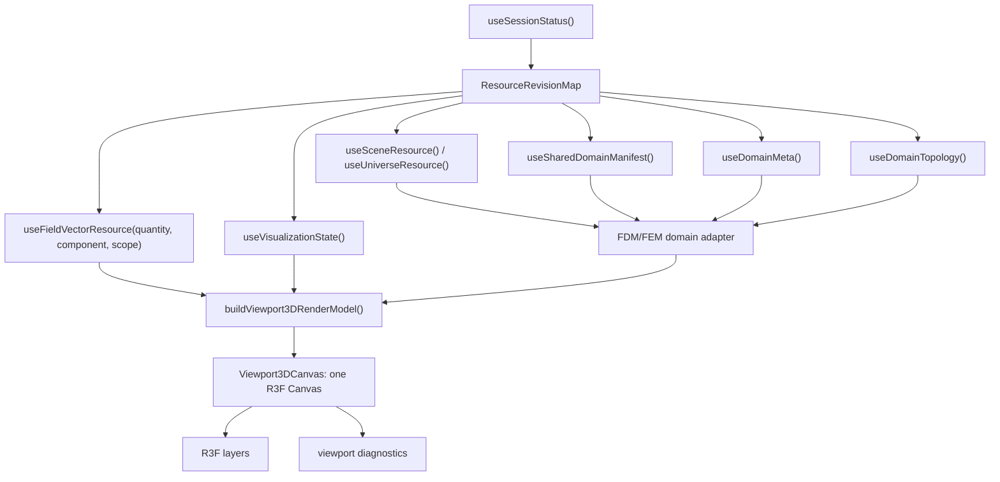

# 3D Visualization System - Implementation-Ready Plan

**Phase:** frontend-v2 Phase 5
**Status:** Implementation-ready plan
**Decision:** one R3F viewport, one canvas, no split/multi-pane in Phase 5
**Scope:** `apps/control-room`, `docs/specs/frontend-v2`, and backend OpenAPI only where required by the browser contract

This plan is the implementation authority for Phase 5. The earlier split/multi-pane drafts are superseded. The objective is a stable, resource-first 3D viewport that can render FDM and FEM scenes through one domain-neutral render model without leaking memory, over-rendering, or bypassing the API facade.

## 1. Non-Negotiable Decisions

1. Render surface: a single R3F `<Canvas frameloop="demand">`.
2. No multi-pane, no split-h/split-v, no quad, no per-pane layer state, no synced-camera grid in Phase 5.
3. One camera state belongs to `viewport-3d/store.ts`.
4. One canonical visualization state comes from `/v2/sessions/current/visualization/state`.
5. HTTP v2 resources are authoritative. WebSocket only invalidates resource keys.
6. All module data access goes through `ControlRoomApi` facade methods and resource hooks.
7. R3F is the scene layer, not the resource owner. Phase 5 must still define and test disposal for Three.js objects, decoded binary buffers, render buffers, workers, subscriptions, observers, and diagnostics.
8. Topology revisions and field revisions are separate. A field or quantity change updates field/color/glyph buffers only; it does not rebuild geometry.
9. FDM and FEM use one render model, but their adapters are allowed to differ for topology, field location, object/part/airbox mapping, units, scope, and LOD.
10. Field-value probe readout is deferred until a backend probe/hit-test contract exists. Phase 5 picking emits object/part/face hit metadata and kernel selection.
11. Per-object visualization is not a separate viewport mode. Object, mesh-part fallback, and airbox display overrides use the frontend-v2 target visualization registry and must be visible from the View ribbon, explorer `Visualization` nodes, inspector panels, and 3D render layers.

## 2. Architecture Target



Renderer inputs are render models, never raw API payloads. Endpoint paths stay inside the generated transport and `ControlRoomApi`.

## 3. Required API Facade Contract

Add typed facade methods before viewport module work starts.

### JSON facade methods

| Method | Endpoint | Notes |
|---|---|---|
| `api.data.domain.meta()` | `GET /v2/sessions/current/data/domain/meta` | Domain bounds, grid, generation, discretization. |
| `api.visualization.state()` | `GET /v2/sessions/current/visualization/state` | Canonical layers, quantity, sampling, clip. |
| `api.visualization.patch(patch)` | `PATCH /v2/sessions/current/visualization/state` | All layer/quantity/sampling mutations. |
| `api.model.scene()` | `GET /v2/sessions/current/model/scene` | Scene document as generated/typed value. |
| `api.model.universe()` | `GET /v2/sessions/current/model/universe` | Universe bounds and airbox config. |
| `api.meshing.sharedDomainManifest()` | `GET /v2/sessions/current/meshing/meshes/shared-domain/manifest` | Object/part/airbox mapping source. |

### Binary facade methods

| Method | Endpoint | Codec | 204 handling |
|---|---|---|---|
| `api.data.domain.topology(options)` | `GET /v2/sessions/current/data/domain/topology` | FMMT | FDM/no topology => `not-applicable`. |
| `api.data.fields.vector(quantityId, query, options)` | `GET /v2/sessions/current/data/fields/{quantity_id}/samples/vector` | FMVP | Missing field => error/degraded state. |
| `api.meshing.sharedDomainTopology(options)` | `GET /v2/sessions/current/meshing/meshes/shared-domain/topology` | FMMT | No FEM mesh => `not-applicable`. |
| `api.meshing.objectTopology(objectId, options)` | `GET /v2/sessions/current/meshing/meshes/objects/{object_id}/topology` | FMMT | No FEM mesh => `not-applicable`. |
| `api.meshing.partTopology(partId, options)` | `GET /v2/sessions/current/meshing/meshes/parts/{part_id}/topology` | FMMT | No FEM mesh => `not-applicable`. |

### Binary response type

```typescript
type BinaryResourceResult<T> =
  | { status: "ready"; data: T; etag: string | null; byteLength: number }
  | { status: "not-modified"; etag: string | null }
  | { status: "not-applicable"; etag: string | null };
```

### Required transport behavior

1. Send `If-None-Match` when a cache entry has an ETag.
2. Interpret 304 as `not-modified` and reuse the cached decoded resource.
3. Interpret 204 as `not-applicable`, not as an error.
4. Preserve `x-request-id`, contract-version validation, GET retry, abort, diagnostics, and response status.
5. Add OpenAPI header parameters for cacheable resources where possible. If generated typing still cannot express them, keep header construction inside `ControlRoomApi` only.

## 4. Resource Hooks and Keys

Resource hooks must be stable, revision-aware, abortable, and cache-backed. Loader callbacks must be memoized; React rerenders without relevant revision changes must not refetch binary resources.

| Hook | Resource key | Relevant revision |
|---|---|---|
| `useDomainMeta()` | `data:domain:meta` | `domain_generation_id` or status resource revision |
| `useDomainTopology()` | `data:domain:topology` | `topology_revision` / `mesh_revision` |
| `useSharedDomainManifest()` | `meshing:shared-domain:manifest` | `mesh_revision` / `topology_revision` |
| `useFieldVectorResource(quantity, component, scope)` | `data:field-vector:{quantity}:{component}:{scopeKind}:{scopeId}` | `field_revision`, plus scope key |
| `useVisualizationState()` | `visualization:state` | `visualization_state_revision` |
| `useSceneResource()` | `model:scene` | `scene_revision` |
| `useUniverseResource()` | `model:universe` | `scene_revision` |

## 5. Cache and Lifecycle Contract

Add a bounded `ResourceCache` for decoded binary and render-prep resources.

Required behavior:

1. ETag storage per resource key.
2. Inflight request dedupe per resource key.
3. Byte budget with LRU eviction.
4. Oversize entry rejection instead of unbounded retention.
5. Consumer retain/release or equivalent owner tracking.
6. Dispose callback for decoded topology, field vectors, render buffers, workers, and derived Three.js resources.
7. Separate topology cache entries from field/vector cache entries.
8. Cache keys include quantity, component, scope kind, scope id, and compatible revision identity.

Default budgets:

| Resource family | Initial budget |
|---|---|
| Decoded topology + field vectors | 128 MB total |
| Single field vector entry | 64 MB soft cap |
| Render-side color/glyph buffers | owned by viewport and released on field/topology change |
| WebGL geometries/materials/textures | owned by R3F layer plus explicit disposal audit |

## 6. Domain Model Decisions

### FDM

FDM does not receive binary topology from `/data/domain/topology`; 204 is normal. The adapter builds a structured grid render model from `DomainMeta.grid` and `DomainMeta.bounds`.

Do not allocate one matrix per cell before applying LOD. The adapter must decide the displayed cell budget first, then allocate instanced buffers only for displayed cells.

### FEM

FEM topology comes from FMMT and mapping comes from `MeshSharedDomainManifestResource.mesh_parts`, not from "marker equals scene index".

Use `MeshPartResource` fields:

- `role`
- `object_id`
- `geometry_id`
- `material_id`
- `boundary_face_indices`
- `node_indices`
- `surface_faces`
- bounds fields when available

Element and boundary markers may be used as topology attributes, but not as the only object identity contract.

### Airbox

Airbox is not a `SceneObject`. It is represented by mesh parts with `role="air"`, visualization airbox layer state, `scope_kind=airbox`, and universe config. The render model must keep magnetic objects and airbox render data separate.

### Per-object display overrides

Every renderable object target resolves display settings from the target visualization registry:

- scene objects use `object:<object_id>`;
- airbox uses `airbox`;
- mesh parts without an object id may use `part:<part_id>` as a degraded fallback.

The settings cover visibility, shader surface, wireframe, points, vectors, opacity percent, and render-mode summary. The registry is a temporary frontend controller until `/v2/sessions/current/visualization/state` exposes per-target fields; it stores only display preferences and never topology, fields, scene documents, or runtime resources.

### Picking

Phase 5 picking resolves:

- hit object id where available;
- hit mesh part id where available;
- face index;
- world position;
- selection identity for `kernel.selection.set(...)`.

Phase 5 does not claim field-value probing unless a backend endpoint or topology extension provides boundary face -> element/sample mapping and interpolation semantics.

## 7. R3F Renderer Contract

File target:

```text
apps/control-room/src/modules/viewport-3d/
  manifest.ts
  Viewport3DModule.tsx
  store.ts
  components/
    Viewport3DCanvas.tsx
    ViewportToolbar.tsx
    ViewportOverlayStack.tsx
    OrbitCameraControls.tsx
  layers/
    ObjectMeshLayer.tsx
    ScalarFieldLayer.tsx
    VectorGlyphLayer.tsx
    WireframeLayer.tsx
    AirboxLayer.tsx
    AxesGridLayer.tsx
    SelectionHighlightLayer.tsx
    BoundsBoxLayer.tsx
  hooks/
    useViewport3DResources.ts
    useViewport3DResourceTracker.ts
    useViewport3DDiagnostics.ts
  model/
    buildViewport3DRenderModel.ts
    viewport3DTypes.ts
    fieldColorMapping.ts
    glyphSampling.ts
    lodStrategy.ts
```

Rules:

1. One `<Canvas frameloop="demand">`.
2. Controls call `invalidate()` during interaction only.
3. Layer prop changes call one dirty frame, not a continuous loop.
4. Three.js objects never live in React state.
5. Color/glyph buffer updates reuse existing geometry where compatible.
6. Topology revision changes replace geometry and release stale geometry.
7. Module unmount releases all module-owned resources and aborts pending requests.
8. Context loss/restoration is tested. R3F may rebuild the scene, but the viewport must still clear/rebuild diagnostics/resource ownership correctly.

## 8. Delivery Phases

### Phase 5a - Contract and Cache Foundation

Deliverables:

1. Update `docs/specs/frontend-v2/14-viewport-3d-module.md` to single R3F viewport.
2. Add API path constants/facade methods for all JSON and binary resources listed above.
3. Add `requestBinaryResource` with 200/204/304/ETag/abort/diagnostics semantics.
4. Add typed resource hooks and resource keys.
5. Add bounded `ResourceCache`.
6. Add tests for 304 reuse, 204 not-applicable, abort, inflight dedupe, unrelated invalidation no-refetch, and no raw `/v2/...` strings outside API facade/generated code.

Gate:

```bash
pnpm --dir apps/control-room generate:api
pnpm --dir apps/control-room typecheck
pnpm --dir apps/control-room lint
pnpm --dir apps/control-room test
pnpm --dir apps/control-room check:api-hygiene
```

### Phase 5b - Domain Adapters and Render Model

Deliverables:

1. Implement FDM adapter with budget-first instancing.
2. Implement FEM adapter using shared-domain manifest/mesh parts for mapping.
3. Implement airbox render data from `role="air"` mesh parts.
4. Implement render model builder as a pure function.
5. Implement LOD decisions before buffer allocation.
6. Add tests for FDM, FEM, airbox, object/part mapping, quantity switch without topology rebuild, and large-grid allocation budgets.

Gate: all Phase 5a commands plus targeted adapter/model tests.

### Phase 5c - Single R3F Viewport

Deliverables:

1. Install R3F dependencies.
2. Implement `Viewport3DModule`, manifest, store, and one `Viewport3DCanvas`.
3. Implement object mesh, wireframe, airbox, axes/bounds, selection layers.
4. Implement camera controls and fit/reset commands through the command registry.
5. Add resource tracker/diagnostics for Three.js/R3F resources.
6. Add idle render audit for zero frames after settling.
7. Apply target visualization overrides independently for scene objects, part fallbacks, and airbox without rebuilding topology for style-only changes.

Gate: all Phase 5a commands plus R3F layer tests and idle audit.

### Phase 5d - Field Visualization and Workers

Deliverables:

1. Implement scalar color mapping with buffer reuse.
2. Implement vector glyphs with density/scoping budget.
3. Move heavy color/glyph transforms to a worker or chunked scheduler when thresholds are exceeded.
4. Add abort/cancel for stale field revisions.
5. Add memory stress covering quantity cycles and 3D/2D switches.

Gate: all Phase 5c gates plus viewport memory stress.

### Phase 5e - Picking, Selection, and Final Hardening

Deliverables:

1. Implement object/part picking and kernel selection.
2. Implement selection highlight.
3. Implement hover/click hit metadata without field-value claims.
4. Add context loss recovery test.
5. Add Playwright/canvas smoke check once the module can render in browser.
6. Update diagnostics surface with frame count, dirty reasons, resource counts, cache bytes, topology revision, field revision, quantity, object count, and airbox presence.

Gate: full app gate plus browser smoke.

## 9. Explicit Non-Goals for Phase 5

These are not blockers because they are out of scope:

1. Multi-pane/split viewport.
2. Per-pane quantity override.
3. Geometry transform gizmos.
4. Field-value probe tooltip without backend probe contract.
5. Backend recomputation from viewport display controls.

If any non-goal becomes required later, it needs a new plan section or ADR before implementation.

## 10. Completion Criteria

Phase 5 is complete only when:

1. `14-viewport-3d-module.md` and this plan agree on single R3F viewport.
2. No module builds endpoint strings or calls `fetch()` directly.
3. Binary resources handle 200/204/304/ETag and reuse cached decoded data.
4. Topology and field revisions are tested independently.
5. FDM large-grid rendering applies LOD before allocating per-cell buffers.
6. FEM object/part/airbox mapping uses mesh manifest/parts.
7. Quantity switching does not rebuild topology.
8. Idle viewport renders zero frames after settling.
9. Repeated quantity and 3D/2D switches have bounded resource growth.
10. All `apps/control-room` gates pass.
11. Explorer, inspector, View ribbon, and 3D viewport use the same per-object/airbox visualization target registry.
